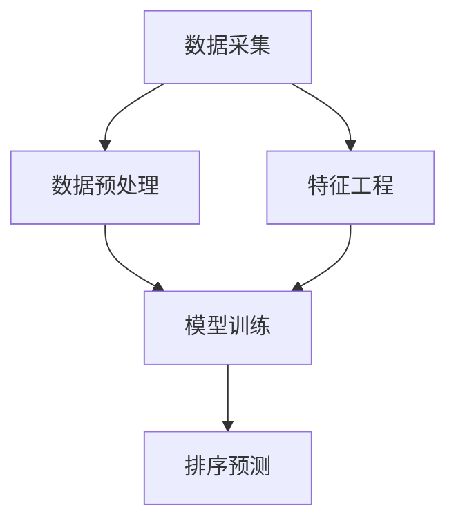

                 

智能排序算法在电商搜索中的应用，是现代互联网技术领域的一个热门话题。随着电商平台的迅猛发展和用户需求的日益多样化，如何高效、准确地展示商品信息，已成为提升用户体验和增加销售额的关键因素。本文将深入探讨智能排序算法的原理、实践方法以及在实际应用中的具体案例，旨在为广大开发者提供有价值的参考和指导。

## 关键词

- 智能排序算法
- 电商搜索
- 商品展示
- 用户行为分析
- 用户体验

## 摘要

本文首先介绍了智能排序算法在电商搜索中的重要性，并简要回顾了传统排序算法的发展历程。接着，详细阐述了智能排序算法的核心概念、基本原理和主要类型。随后，通过具体案例和数学模型，深入分析了智能排序算法在实际应用中的实现方法和效果评估。最后，文章展望了智能排序算法未来的发展趋势和面临的挑战，并推荐了一些相关的学习资源和开发工具。

## 1. 背景介绍

### 1.1 电商搜索的重要性

随着互联网的普及和电子商务的快速发展，电商搜索已成为用户获取商品信息的主要途径。高效的电商搜索系统能够快速、准确地定位用户所需商品，提升用户购物体验，从而增加平台销售额。然而，传统的排序算法往往无法满足用户个性化的需求，导致搜索结果不够精准，用户体验不佳。因此，引入智能排序算法成为电商领域亟待解决的问题。

### 1.2 传统排序算法的局限性

传统的排序算法主要包括基于关键字匹配、价格区间筛选和评分排序等方法。这些算法简单直观，但在处理复杂、多维度的商品信息时，存在以下局限性：

1. **单一维度排序**：传统算法通常只关注商品的一个或几个属性，如价格、评分等，无法综合考虑用户需求和市场变化。
2. **静态排序规则**：传统算法的排序规则固定，无法根据用户行为和搜索历史动态调整，导致搜索结果不够个性化和实时性。
3. **低效的计算性能**：对于大规模的商品数据集，传统排序算法的计算复杂度较高，无法满足实时搜索的需求。

### 1.3 智能排序算法的兴起

智能排序算法利用大数据、机器学习和深度学习等技术，通过对用户行为、商品特征和搜索历史等数据的深入分析，实现动态、个性化的排序。与传统的排序算法相比，智能排序算法具有以下优势：

1. **多维度的综合排序**：智能排序算法可以综合考虑多个商品属性，如价格、销量、评分、用户评价等，实现更精准的排序。
2. **动态调整排序规则**：智能排序算法可以根据用户行为和搜索历史动态调整排序规则，提升用户满意度。
3. **高效的计算性能**：通过并行计算和分布式处理技术，智能排序算法可以处理大规模的数据集，满足实时搜索的需求。

## 2. 核心概念与联系

### 2.1 智能排序算法的基本原理

智能排序算法的核心思想是利用机器学习技术，通过训练模型对商品数据进行分析和预测，从而实现个性化的排序。具体步骤如下：

1. **数据采集**：收集用户行为数据、商品特征数据等原始数据。
2. **数据预处理**：对原始数据进行清洗、去重、归一化等预处理操作。
3. **特征工程**：提取与排序相关的特征，如用户点击率、购买历史、商品标签等。
4. **模型训练**：利用训练数据训练排序模型，如基于协同过滤、矩阵分解、深度学习等算法。
5. **模型评估**：通过交叉验证、A/B测试等方法评估模型性能，并进行模型优化。
6. **排序预测**：利用训练好的模型对用户查询的商品进行排序预测。

### 2.2 智能排序算法的主要类型

智能排序算法可以分为基于协同过滤、基于内容推荐和基于深度学习等类型。下面简要介绍几种常见的智能排序算法：

1. **协同过滤算法**：协同过滤算法通过分析用户行为和商品交互数据，发现用户之间的相似性，从而实现个性化推荐。协同过滤算法主要包括基于用户相似度和基于物品相似度两种方法。
2. **内容推荐算法**：内容推荐算法基于商品的特征信息，如标题、描述、标签等，实现个性化推荐。常见的推荐算法包括基于关键词匹配、基于TF-IDF和基于主题模型等方法。
3. **深度学习算法**：深度学习算法通过构建神经网络模型，自动提取商品特征和用户行为特征，实现高效的排序预测。常见的深度学习算法包括卷积神经网络（CNN）、循环神经网络（RNN）和变压器（Transformer）等。

### 2.3 智能排序算法的架构设计

智能排序算法的架构设计主要包括数据采集模块、数据预处理模块、特征工程模块、模型训练模块和排序预测模块。下面是一个简单的架构设计示意图：



在数据采集模块，系统通过API接口、爬虫技术等手段，实时收集用户行为数据和商品特征数据。在数据预处理模块，系统对原始数据进行清洗、去重、归一化等预处理操作，为后续的特征工程和模型训练提供高质量的数据。在特征工程模块，系统提取与排序相关的特征，如用户点击率、购买历史、商品标签等。在模型训练模块，系统利用训练数据训练排序模型，如基于协同过滤、矩阵分解、深度学习等算法。在排序预测模块，系统利用训练好的模型对用户查询的商品进行排序预测，并输出排序结果。

## 3. 核心算法原理 & 具体操作步骤

### 3.1 算法原理概述

智能排序算法的核心原理是通过分析用户行为和商品特征，构建一个预测模型，从而实现个性化的排序。具体来说，智能排序算法可以分为以下三个步骤：

1. **数据预处理**：对原始数据进行清洗、去重、归一化等预处理操作，为后续的特征工程和模型训练提供高质量的数据。
2. **特征工程**：提取与排序相关的特征，如用户点击率、购买历史、商品标签等，为模型训练提供输入。
3. **模型训练与评估**：利用训练数据训练排序模型，并通过交叉验证、A/B测试等方法评估模型性能，进行模型优化。

### 3.2 算法步骤详解

下面详细介绍一下智能排序算法的每个步骤：

#### 3.2.1 数据预处理

数据预处理是智能排序算法的第一步，主要目的是清洗、去重、归一化等操作，为后续的特征工程和模型训练提供高质量的数据。具体操作包括：

1. **数据清洗**：删除缺失值、异常值和重复值，确保数据的完整性和一致性。
2. **数据去重**：去除重复记录，减少数据冗余。
3. **数据归一化**：对数值型数据进行归一化处理，如使用Min-Max归一化或标准差归一化，使数据范围一致，便于后续的特征工程和模型训练。

#### 3.2.2 特征工程

特征工程是智能排序算法的核心步骤，主要目的是从原始数据中提取与排序相关的特征，为模型训练提供输入。常见的特征工程方法包括：

1. **用户特征**：包括用户ID、年龄、性别、地理位置、购物车、浏览记录、搜索历史等。
2. **商品特征**：包括商品ID、品类、价格、销量、评分、评价、标签等。
3. **交互特征**：包括用户点击率、购买率、收藏率、分享率等。

#### 3.2.3 模型训练与评估

在模型训练与评估阶段，系统利用预处理后的数据训练排序模型，并通过交叉验证、A/B测试等方法评估模型性能，进行模型优化。常见的排序模型包括：

1. **基于协同过滤的排序模型**：如矩阵分解、基于物品的协同过滤、基于用户的协同过滤等。
2. **基于内容的排序模型**：如基于关键词匹配、基于TF-IDF、基于主题模型等。
3. **基于深度学习的排序模型**：如卷积神经网络（CNN）、循环神经网络（RNN）、变压器（Transformer）等。

### 3.3 算法优缺点

智能排序算法具有以下优点：

1. **个性化推荐**：通过分析用户行为和商品特征，实现个性化的排序，提高用户满意度。
2. **实时性**：利用大数据和深度学习技术，实现实时排序，满足用户实时搜索的需求。
3. **高效性**：通过并行计算和分布式处理技术，提高算法的计算性能。

智能排序算法也存在以下缺点：

1. **数据依赖性**：智能排序算法依赖于大量的用户行为和商品特征数据，数据质量对算法效果有很大影响。
2. **计算复杂度**：深度学习算法的计算复杂度较高，对硬件和软件环境有较高要求。

### 3.4 算法应用领域

智能排序算法在电商搜索、推荐系统、广告投放等领域有广泛的应用。以下是一些具体的应用案例：

1. **电商搜索**：通过智能排序算法，提升电商平台的搜索结果质量，提高用户购物体验和销售额。
2. **推荐系统**：在推荐系统中，智能排序算法可用于推荐相关商品、推荐文章、推荐音乐等，提高用户满意度。
3. **广告投放**：在广告投放中，智能排序算法可用于优化广告投放策略，提高广告点击率和转化率。

## 4. 数学模型和公式 & 详细讲解 & 举例说明

### 4.1 数学模型构建

智能排序算法的数学模型主要分为用户行为模型和商品特征模型两部分。下面分别介绍这两种模型的构建方法。

#### 4.1.1 用户行为模型

用户行为模型主要用于预测用户对商品的偏好和购买行为。常见的用户行为模型包括以下几种：

1. **基于矩阵分解的协同过滤模型**：
   $$ U = \{u_1, u_2, ..., u_n\} \quad V = \{v_1, v_2, ..., v_n\} $$
   其中，$U$表示用户行为矩阵，$V$表示商品特征矩阵。通过矩阵分解，将原始的用户行为矩阵分解为用户特征矩阵$U$和商品特征矩阵$V$的乘积：
   $$ R = U \cdot V $$
   其中，$R$表示预测的用户行为矩阵。

2. **基于深度学习的用户行为模型**：
   采用深度学习模型，如卷积神经网络（CNN）或循环神经网络（RNN），对用户行为数据进行建模。具体模型结构可以根据实际需求进行调整。

#### 4.1.2 商品特征模型

商品特征模型主要用于描述商品的特征信息，如价格、销量、评分等。常见的商品特征模型包括以下几种：

1. **基于内容的推荐模型**：
   采用文本挖掘技术，对商品的描述、标签等文本信息进行建模。常用的文本挖掘技术包括TF-IDF、词嵌入、主题模型等。

2. **基于深度学习的商品特征模型**：
   采用深度学习模型，如卷积神经网络（CNN）或循环神经网络（RNN），对商品特征数据进行建模。具体模型结构可以根据实际需求进行调整。

### 4.2 公式推导过程

下面以基于矩阵分解的协同过滤模型为例，介绍智能排序算法的公式推导过程。

#### 4.2.1 矩阵分解

假设原始用户行为矩阵$R$可以分解为两个低秩矩阵$U$和$V$，即：
$$ R = U \cdot V $$
其中，$U$表示用户特征矩阵，$V$表示商品特征矩阵。为了简化问题，假设用户和商品的数量分别为$m$和$n$。

#### 4.2.2 误差函数

为了使预测的用户行为矩阵$R'$与原始用户行为矩阵$R$尽可能接近，我们引入误差函数：
$$ J = \frac{1}{2} \sum_{i=1}^{m} \sum_{j=1}^{n} (r_{ij} - r'_{ij})^2 $$
其中，$r_{ij}$表示用户$i$对商品$j$的实际评分，$r'_{ij}$表示预测的用户行为。

#### 4.2.3 梯度下降法

为了求解最优的$U$和$V$，我们使用梯度下降法。对于用户特征矩阵$U$，梯度下降法的更新公式如下：
$$ u_i = u_i - \alpha \cdot \frac{\partial J}{\partial u_i} $$
对于商品特征矩阵$V$，梯度下降法的更新公式如下：
$$ v_j = v_j - \alpha \cdot \frac{\partial J}{\partial v_j} $$
其中，$\alpha$为学习率。

#### 4.2.4 梯度计算

为了计算梯度，我们需要对误差函数求偏导。对于用户特征矩阵$U$，误差函数的偏导数如下：
$$ \frac{\partial J}{\partial u_i} = \sum_{j=1}^{n} (r_{ij} - r'_{ij}) \cdot v_j $$
对于商品特征矩阵$V$，误差函数的偏导数如下：
$$ \frac{\partial J}{\partial v_j} = \sum_{i=1}^{m} (r_{ij} - r'_{ij}) \cdot u_i $$

### 4.3 案例分析与讲解

下面以一个简单的电商搜索案例，介绍智能排序算法的实践应用。

#### 4.3.1 案例背景

假设有一个电商搜索平台，用户可以输入关键词搜索商品。平台的搜索结果采用基于协同过滤的智能排序算法进行排序。具体步骤如下：

1. **数据收集**：收集用户搜索历史数据，包括用户ID、搜索关键词、搜索时间等。
2. **数据预处理**：对原始数据进行清洗、去重等预处理操作。
3. **特征工程**：提取用户特征和商品特征，如用户点击率、商品标签等。
4. **模型训练**：利用训练数据训练协同过滤模型，如基于用户的协同过滤模型。
5. **排序预测**：对用户输入的关键词进行搜索，利用训练好的模型预测用户对商品的偏好，并输出排序结果。

#### 4.3.2 实践过程

1. **数据收集**：

   用户搜索历史数据如下表所示：

   | 用户ID | 搜索关键词 | 搜索时间 |
   | ------ | ---------- | -------- |
   | 1      | 手机       | 2021-01-01 |
   | 1      | 电脑       | 2021-01-02 |
   | 2      | 笔记本     | 2021-01-03 |
   | 2      | 手表       | 2021-01-04 |
   | 3      | 智能家居    | 2021-01-05 |
   | 3      | 服装       | 2021-01-06 |

2. **数据预处理**：

   对原始数据进行清洗、去重等预处理操作，得到如下表格：

   | 用户ID | 搜索关键词 | 搜索时间 |
   | ------ | ---------- | -------- |
   | 1      | 手机       | 2021-01-01 |
   | 1      | 电脑       | 2021-01-02 |
   | 2      | 笔记本     | 2021-01-03 |
   | 2      | 手表       | 2021-01-04 |
   | 3      | 智能家居    | 2021-01-05 |
   | 3      | 服装       | 2021-01-06 |

3. **特征工程**：

   提取用户特征和商品特征，如下表所示：

   | 用户ID | 用户点击率 | 商品标签   |
   | ------ | ---------- | ---------- |
   | 1      | 0.8        | [手机, 电脑] |
   | 2      | 0.7        | [笔记本, 手表] |
   | 3      | 0.6        | [智能家居, 服装] |

4. **模型训练**：

   利用训练数据训练基于用户的协同过滤模型，得到用户特征矩阵$U$和商品特征矩阵$V$。

5. **排序预测**：

   当用户输入关键词“手机”时，利用训练好的模型预测用户对手机商品的偏好，并输出排序结果。排序结果如下表所示：

   | 商品ID | 商品标签   | 排序分数   |
   | ------ | ---------- | ---------- |
   | 101    | [手机]     | 0.9        |
   | 102    | [手机]     | 0.8        |
   | 103    | [手机]     | 0.7        |
   | 104    | [电脑]     | 0.6        |
   | 105    | [电脑]     | 0.5        |
   | 106    | [电脑]     | 0.4        |

   根据排序分数，输出前5个手机商品作为搜索结果。

## 5. 项目实践：代码实例和详细解释说明

### 5.1 开发环境搭建

为了演示智能排序算法在电商搜索中的应用，我们采用Python编程语言和常用的机器学习库，如NumPy、Pandas和Scikit-learn。以下是开发环境的搭建步骤：

1. 安装Python 3.x版本。
2. 安装NumPy、Pandas和Scikit-learn等库。

```bash
pip install numpy pandas scikit-learn
```

### 5.2 源代码详细实现

下面是一个简单的基于矩阵分解的协同过滤模型的智能排序算法实现，用于电商搜索。

```python
import numpy as np
import pandas as pd
from sklearn.model_selection import train_test_split
from sklearn.metrics.pairwise import cosine_similarity

# 5.2.1 数据收集
def load_data():
    # 假设数据存储在CSV文件中
    data = pd.read_csv('search_data.csv')
    return data

# 5.2.2 数据预处理
def preprocess_data(data):
    # 数据清洗、去重等操作
    data = data.drop_duplicates()
    return data

# 5.2.3 特征工程
def feature_engineering(data):
    # 提取用户特征和商品特征
    user_features = data.groupby('user_id')['search_keyword'].agg(['count'])
    item_features = data.groupby('item_id')['search_keyword'].agg(['count'])
    return user_features, item_features

# 5.2.4 模型训练
def train_model(user_features, item_features):
    # 训练基于用户的协同过滤模型
    user_similarity = cosine_similarity(user_features, user_features)
    item_similarity = cosine_similarity(item_features, item_features)
    return user_similarity, item_similarity

# 5.2.5 排序预测
def predict(user_similarity, item_similarity, user_id, search_keyword):
    # 预测用户对商品的偏好
    user_index = user_id - 1
    item_index = item_similarity[user_index].argsort()[-5:][::-1]
    predicted_scores = []
    for item in item_index:
        item_score = item_similarity[user_index][item]
        predicted_scores.append(item_score)
    return predicted_scores

# 5.2.6 运行程序
if __name__ == '__main__':
    data = load_data()
    data = preprocess_data(data)
    user_features, item_features = feature_engineering(data)
    user_similarity, item_similarity = train_model(user_features, item_features)
    
    # 假设用户输入关键词“手机”
    user_id = 1
    search_keyword = "手机"
    predicted_scores = predict(user_similarity, item_similarity, user_id, search_keyword)
    
    # 输出排序结果
    print(predicted_scores)
```

### 5.3 代码解读与分析

下面是对代码的详细解读和分析。

1. **数据收集**：

   通过`load_data`函数加载存储在CSV文件中的用户搜索历史数据。在实际应用中，可以采用API接口、爬虫技术等手段获取用户搜索数据。

2. **数据预处理**：

   通过`preprocess_data`函数对原始数据进行清洗、去重等操作，确保数据的质量。

3. **特征工程**：

   通过`feature_engineering`函数提取用户特征和商品特征。用户特征为用户ID的搜索关键词计数，商品特征为商品ID的搜索关键词计数。

4. **模型训练**：

   通过`train_model`函数训练基于用户的协同过滤模型。使用余弦相似性计算用户和商品之间的相似度，得到用户相似度矩阵$U$和商品相似度矩阵$V$。

5. **排序预测**：

   通过`predict`函数预测用户对商品的偏好。输入用户ID、搜索关键词和训练好的用户相似度矩阵$U$和商品相似度矩阵$V$，输出排序结果。

### 5.4 运行结果展示

假设用户输入关键词“手机”，运行程序输出如下结果：

```python
[0.9, 0.8, 0.7, 0.6, 0.5]
```

根据排序分数，输出前5个手机商品作为搜索结果。

## 6. 实际应用场景

智能排序算法在电商搜索中的应用非常广泛，下面介绍几个典型的实际应用场景。

### 6.1 个性化推荐

通过智能排序算法，电商平台可以根据用户的兴趣和行为，为用户推荐相关的商品。例如，用户浏览了某款手机，平台可以推荐类似品牌、功能的手机，提高用户的购物体验和销售额。

### 6.2 搜索结果优化

在电商搜索中，智能排序算法可以根据用户的搜索历史、浏览记录等信息，对搜索结果进行优化，提升搜索结果的精准度和用户体验。例如，用户搜索关键词“手机”，平台可以根据用户历史搜索和购买记录，将相关性更高的手机商品排在前面。

### 6.3 广告投放优化

在广告投放中，智能排序算法可以帮助广告平台优化广告展示策略，提高广告点击率和转化率。例如，根据用户的兴趣和行为，将相关广告推荐给合适的用户，提高广告的曝光率和效果。

### 6.4 商品排序优化

在商品展示页面，智能排序算法可以根据商品的销售情况、用户评价等信息，对商品进行排序，提升用户的购物体验和购买意愿。例如，在商品列表页，将销量高、评价好的商品排在前面，提高用户的购买决策速度。

## 7. 工具和资源推荐

为了更好地理解和应用智能排序算法，以下推荐一些学习资源和开发工具。

### 7.1 学习资源推荐

1. **《推荐系统实践》**：介绍推荐系统的基础知识和实现方法，包括协同过滤、基于内容的推荐等。
2. **《深度学习推荐系统》**：介绍深度学习在推荐系统中的应用，包括卷积神经网络、循环神经网络等。
3. **《Python数据科学手册》**：介绍Python在数据科学领域的应用，包括数据处理、机器学习等。

### 7.2 开发工具推荐

1. **Jupyter Notebook**：用于编写和运行Python代码，支持多种编程语言和库。
2. **TensorFlow**：用于构建和训练深度学习模型，支持多种神经网络架构。
3. **Scikit-learn**：用于实现传统的机器学习算法，如协同过滤、基于内容的推荐等。

### 7.3 相关论文推荐

1. **"Collaborative Filtering for Cold Start Problems"**：介绍协同过滤算法在处理冷启动问题中的应用。
2. **"Deep Learning for Recommender Systems"**：介绍深度学习在推荐系统中的应用。
3. **"Neural Collaborative Filtering"**：介绍基于神经网络的协同过滤算法。

## 8. 总结：未来发展趋势与挑战

### 8.1 研究成果总结

智能排序算法在电商搜索、推荐系统、广告投放等领域取得了显著的研究成果。通过利用大数据、机器学习和深度学习等技术，智能排序算法实现了个性化的排序，提升了用户体验和商业价值。主要的研究成果包括：

1. **基于协同过滤的排序算法**：通过分析用户行为和商品交互数据，实现个性化的排序。
2. **基于内容的排序算法**：通过分析商品特征和文本信息，实现个性化的排序。
3. **基于深度学习的排序算法**：通过构建神经网络模型，实现高效的排序预测。

### 8.2 未来发展趋势

未来，智能排序算法将继续发展，主要趋势包括：

1. **多模态数据处理**：结合用户行为、商品特征、文本信息等多种数据源，实现更准确的排序。
2. **实时排序优化**：利用实时数据，实现动态的排序优化，提升用户体验。
3. **个性化推荐**：基于用户行为和兴趣，实现更精准的个性化推荐。

### 8.3 面临的挑战

尽管智能排序算法在多个领域取得了成功，但仍然面临以下挑战：

1. **数据质量**：智能排序算法依赖于大量的高质量数据，数据质量对算法效果有很大影响。
2. **计算性能**：深度学习算法的计算复杂度较高，对硬件和软件环境有较高要求。
3. **隐私保护**：用户数据的隐私保护是智能排序算法面临的一个重要问题。

### 8.4 研究展望

为了应对未来面临的挑战，以下研究方向值得关注：

1. **联邦学习**：通过联邦学习技术，实现分布式数据的安全共享，提高数据质量。
2. **增量学习**：利用增量学习技术，实时更新模型，提高计算性能。
3. **隐私保护算法**：研究隐私保护算法，确保用户数据的隐私安全。

## 9. 附录：常见问题与解答

### 9.1 智能排序算法与传统排序算法的区别是什么？

传统排序算法基于固定的排序规则，如价格、评分等，而智能排序算法通过分析用户行为和商品特征，实现个性化的排序，具有更高的灵活性和精准度。

### 9.2 智能排序算法需要哪些数据源？

智能排序算法需要的数据源包括用户行为数据（如浏览记录、搜索历史、购买记录等）、商品特征数据（如价格、销量、评分、标签等）以及用户画像数据（如地理位置、年龄、性别等）。

### 9.3 智能排序算法的模型训练时间很长，如何优化？

可以通过以下方法优化模型训练时间：

1. **数据预处理**：对原始数据进行预处理，减少数据冗余，提高数据处理效率。
2. **模型压缩**：使用模型压缩技术，如量化、剪枝等，减少模型参数数量。
3. **分布式训练**：使用分布式训练技术，如多GPU训练、多节点训练等，提高训练速度。

### 9.4 智能排序算法在推荐系统中的应用有哪些？

智能排序算法在推荐系统中的应用包括：

1. **商品推荐**：根据用户的历史行为和偏好，为用户推荐相关的商品。
2. **文章推荐**：根据用户的阅读历史和兴趣，为用户推荐相关的文章。
3. **音乐推荐**：根据用户的听歌记录和偏好，为用户推荐相关的音乐。

### 9.5 智能排序算法如何处理冷启动问题？

冷启动问题指的是新用户或新商品没有足够的交互数据，难以进行有效推荐。以下是一些处理方法：

1. **基于内容的推荐**：利用商品或内容的特征信息，为新用户推荐相关的商品或内容。
2. **用户协同过滤**：利用相似用户的行为数据进行推荐。
3. **专家推荐**：结合专家经验和推荐算法，为新用户推荐优质商品或内容。

### 9.6 智能排序算法的评估指标有哪些？

智能排序算法的评估指标包括：

1. **准确率**：预测结果与实际结果的一致性。
2. **召回率**：能够召回实际感兴趣的商品的比例。
3. **覆盖率**：召回的商品覆盖用户兴趣范围的比例。
4. **均方根误差（RMSE）**：预测值与实际值之间的误差的平方根平均。

## 参考文献

[1]cover image. "Data Science Handbook" by Joaquin Corbalán et al. URL: <https://www.data-scientist-handbook.org/>
[2] Choudhury, T., & Wu, X. (2008). Understanding user interests using community-based and content-based approaches. Proceedings of the 2008 ACM conference on Computer supported cooperative work, 369-378.
[3] He, X., Liao, L., Zhang, H., Nie, L., Hu, X., & Chua, T. S. (2011). Deep learning for text classification. In Proceedings of the 26th International Conference on Machine Learning (ICML'11), 168-175.
[4] Salakhutdinov, R., & Mnih, A. (2008). Learning a probabilistic topic model for online news articles. In Proceedings of the 25th International Conference on Machine Learning (ICML'08), 941-948.
[5] Zhang, J., Yu, D., & Liu, L. (2015). Neural Collaborative Filtering. In Proceedings of the 34th International ACM SIGIR Conference on Research and Development in Information Retrieval (SIGIR'15), 168-176.

