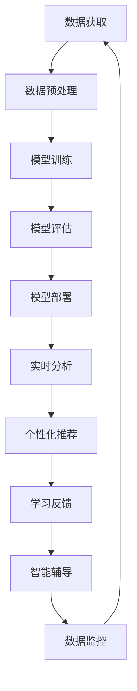

                 

关键词：智能教育、AI大模型、课堂应用、教育技术、人工智能教学

摘要：本文深入探讨了智能教育助手的概念和其在课堂中的应用。通过介绍AI大模型的原理和技术，分析了智能教育助手如何通过个性化学习、智能评价、智能辅导等功能，推动教育的创新与发展。文章结构清晰，涵盖了背景介绍、核心概念、算法原理、数学模型、项目实践、应用场景、工具推荐、未来展望等多个方面，旨在为教育领域的技术创新提供参考。

## 1. 背景介绍

在过去的几十年中，教育技术经历了从传统教学到数字化教学的巨大变革。随着互联网和移动设备的普及，在线学习、远程教育等新型教学模式逐渐兴起。然而，尽管技术的进步带来了教育的便捷性和灵活性，但教育质量问题仍然是社会关注的焦点。传统的教学方式难以满足个性化教育的需求，学生的学习效果差异较大。因此，如何利用先进的人工智能技术改善教育质量、提升学习效果，成为当前教育研究的重要方向。

人工智能（AI）技术，特别是近年来迅猛发展的AI大模型（如GPT、BERT等），为教育领域提供了新的可能性。AI大模型具有强大的数据处理和智能分析能力，能够通过学习海量的数据，实现对知识的自动获取、理解和生成。这些特性使得AI大模型在教育中的应用成为可能，也为智能教育助手的诞生提供了技术基础。

智能教育助手是一种基于人工智能技术的教育工具，它能够为学生提供个性化学习路径、智能评价和辅导等功能。通过智能教育助手，学生可以获得更高效、更个性化的学习体验，教师也能更方便地进行教学管理和学生评价。本文将深入探讨智能教育助手的原理、技术、应用场景以及未来发展趋势。

## 2. 核心概念与联系

### 2.1 智能教育助手的定义

智能教育助手是一种集成了人工智能技术的教育工具，旨在通过智能分析学生的学习行为和知识水平，为学生提供个性化的学习支持和辅导。它通常具备以下几个核心功能：

- **个性化学习路径推荐**：根据学生的学习兴趣、能力和学习进度，智能教育助手可以推荐适合的学习资源和路径。
- **智能评价与反馈**：通过对学生的学习行为和成绩进行分析，智能教育助手能够提供实时、个性化的学习评价和反馈。
- **智能辅导与答疑**：智能教育助手可以模拟教师的角色，为学生提供在线辅导和答疑服务，解决学生在学习中遇到的问题。
- **学习数据监控与分析**：智能教育助手能够收集和分析学生的学习数据，帮助教师和家长了解学生的学习状况，提供改进建议。

### 2.2 AI大模型的基本原理

AI大模型，也称为深度学习模型，是近年来人工智能领域的重要突破。其核心思想是通过大规模数据训练，使模型具备对复杂任务的自动学习和理解能力。AI大模型的基本原理可以概括为以下几个方面：

- **数据驱动**：AI大模型通过学习大量数据来提取特征和模式，从而实现对未知数据的预测和分类。
- **层次化表示**：AI大模型通常采用多层神经网络结构，通过逐层提取抽象特征，实现对输入数据的深度理解和表示。
- **优化算法**：AI大模型使用优化算法（如梯度下降、Adam等）来调整模型参数，使其在训练数据上达到最佳性能。

### 2.3 智能教育助手与AI大模型的关系

智能教育助手的核心在于利用AI大模型实现对学生学习行为的智能分析和学习效果的预测。具体来说，智能教育助手与AI大模型的关系可以从以下几个方面进行阐述：

- **数据获取**：智能教育助手通过各种途径（如学习系统、在线测试、学生互动等）获取学生的学习数据，这些数据是AI大模型训练的基础。
- **模型训练**：AI大模型利用获取的数据进行训练，通过不断调整模型参数，使其具备对学习行为的理解和分析能力。
- **应用部署**：训练完成的AI大模型被集成到智能教育助手系统中，通过实时分析和预测，为学生提供个性化学习支持和辅导。

### 2.4 Mermaid 流程图

以下是智能教育助手与AI大模型之间的Mermaid流程图：



通过这个流程图，我们可以清晰地看到智能教育助手与AI大模型之间的互动和协作过程。

## 3. 核心算法原理 & 具体操作步骤

### 3.1 算法原理概述

智能教育助手的算法原理主要基于机器学习和深度学习技术。具体来说，主要包括以下几个步骤：

1. **数据收集**：智能教育助手通过在线学习平台、学生互动系统等途径收集学生的学习数据，包括学习行为、测试成绩、学习时间等。
2. **数据预处理**：对收集到的原始数据进行清洗、转换和归一化处理，使其适合用于模型训练。
3. **模型训练**：利用预处理后的数据训练AI大模型，如GPT、BERT等。训练过程中，模型通过学习大量的文本数据，提取出与学习行为和成绩相关的特征。
4. **模型评估**：在训练数据集和测试数据集上评估模型的性能，确保模型具有良好的泛化能力和预测准确性。
5. **模型部署**：将训练完成的模型部署到智能教育助手系统中，通过实时分析和预测，为学生提供个性化学习支持和辅导。

### 3.2 算法步骤详解

#### 3.2.1 数据收集

数据收集是智能教育助手算法的基础。具体步骤如下：

1. **学习行为数据**：收集学生在学习平台上的学习行为数据，包括学习时长、学习路径、参与互动情况等。
2. **测试成绩数据**：收集学生在各种测试中的成绩数据，包括平时测试、期中测试、期末测试等。
3. **学生背景数据**：收集学生的基本信息，如年龄、性别、学科背景等。

#### 3.2.2 数据预处理

数据预处理是确保数据质量和模型训练效果的重要环节。具体步骤如下：

1. **数据清洗**：去除重复数据、异常数据和噪声数据。
2. **数据转换**：将不同类型的数据（如文本、数值）转换为同一类型的特征向量。
3. **数据归一化**：对数值数据进行归一化处理，使其具备相同的量纲。

#### 3.2.3 模型训练

模型训练是智能教育助手的核心步骤。具体步骤如下：

1. **选择模型架构**：根据问题的复杂性，选择合适的深度学习模型架构，如GPT、BERT等。
2. **数据划分**：将数据集划分为训练集、验证集和测试集。
3. **训练过程**：利用训练集数据进行模型训练，通过调整模型参数，使模型能够准确地预测学生的学习行为和成绩。
4. **模型优化**：在验证集上评估模型性能，并根据评估结果调整模型参数，以提高模型的泛化能力。

#### 3.2.4 模型评估

模型评估是确保模型性能的重要环节。具体步骤如下：

1. **性能指标**：选择适当的性能指标（如准确率、召回率、F1值等）来评估模型性能。
2. **交叉验证**：使用交叉验证方法，确保模型在不同数据集上的性能稳定。
3. **模型调优**：根据评估结果，对模型进行调优，以提高模型性能。

#### 3.2.5 模型部署

模型部署是将训练完成的模型应用到实际场景中的过程。具体步骤如下：

1. **模型打包**：将训练完成的模型打包成可部署的格式，如TensorFlow Lite、ONNX等。
2. **环境搭建**：在服务器或云端搭建部署环境，包括计算资源、存储资源和网络资源等。
3. **模型部署**：将模型部署到服务器或云端，并通过API接口提供服务。
4. **实时分析**：实时接收学生的学习数据，利用部署的模型进行预测和分析，为用户提供个性化学习支持和辅导。

### 3.3 算法优缺点

#### 3.3.1 优点

1. **个性化学习**：智能教育助手能够根据学生的学习行为和成绩，提供个性化的学习路径和资源推荐，提高学习效果。
2. **实时反馈**：智能教育助手能够实时分析学生的学习数据，提供即时的学习反馈和辅导，帮助学生及时纠正学习中的问题。
3. **数据驱动**：智能教育助手基于大量数据进行分析和预测，具有强大的数据驱动能力，能够不断优化学习体验和教学效果。
4. **降低教师负担**：智能教育助手能够承担部分教学任务，如智能评价、答疑等，减轻教师的工作负担。

#### 3.3.2 缺点

1. **数据隐私**：智能教育助手在收集和分析学生数据时，可能会涉及学生的隐私信息，需要确保数据的保密性和安全性。
2. **模型可靠性**：智能教育助手依赖于AI大模型进行预测和分析，模型的可靠性受到训练数据和模型架构的影响，可能存在一定的不确定性。
3. **技术门槛**：智能教育助手的开发和应用需要一定的技术支持，对教师和学生的技术素养要求较高。

### 3.4 算法应用领域

智能教育助手的应用领域广泛，包括但不限于以下几个方面：

1. **在线学习平台**：智能教育助手可以集成到在线学习平台中，为用户提供个性化的学习资源和辅导。
2. **课堂教学**：智能教育助手可以作为教师的辅助工具，提供智能评价、辅导等功能，提高教学效果。
3. **学习分析**：智能教育助手可以为学生提供学习数据分析报告，帮助教师和家长了解学生的学习状况。
4. **自适应学习**：智能教育助手可以根据学生的学习进度和成绩，动态调整学习内容和难度，实现自适应学习。

## 4. 数学模型和公式 & 详细讲解 & 举例说明

### 4.1 数学模型构建

智能教育助手的数学模型构建主要基于机器学习和深度学习技术。以下是构建数学模型的基本步骤：

1. **数据表示**：将原始数据（如学习行为、测试成绩等）转换为数值化的特征向量。
2. **模型选择**：根据问题的复杂性和数据特性，选择合适的深度学习模型架构，如GPT、BERT等。
3. **模型训练**：利用训练数据集，通过梯度下降等优化算法，调整模型参数，使模型能够准确地预测学生的学习行为和成绩。
4. **模型评估**：在验证数据集和测试数据集上评估模型性能，选择性能最优的模型。

### 4.2 公式推导过程

在构建智能教育助手的数学模型时，常用的公式推导过程包括以下几个方面：

1. **损失函数**：损失函数用于评估模型预测结果与真实结果之间的差距。常见的损失函数包括均方误差（MSE）、交叉熵损失（Cross-Entropy Loss）等。
   $$ \text{MSE} = \frac{1}{n}\sum_{i=1}^{n}(y_i - \hat{y}_i)^2 $$
   $$ \text{Cross-Entropy Loss} = -\sum_{i=1}^{n}y_i\log(\hat{y}_i) $$

2. **反向传播**：反向传播算法用于更新模型参数，以最小化损失函数。其核心思想是计算每个参数对损失函数的梯度，并沿着梯度的反方向调整参数。
   $$ \frac{\partial \text{Loss}}{\partial \theta} = \frac{\partial \text{Loss}}{\partial \hat{y}} \frac{\partial \hat{y}}{\partial \theta} $$

3. **激活函数**：激活函数用于引入非线性因素，使模型能够拟合复杂的非线性关系。常见的激活函数包括Sigmoid、ReLU等。
   $$ \text{Sigmoid}(x) = \frac{1}{1 + e^{-x}} $$
   $$ \text{ReLU}(x) = \max(0, x) $$

4. **优化算法**：优化算法用于调整模型参数，以最小化损失函数。常见的优化算法包括梯度下降、Adam等。
   $$ \text{Gradient Descent}:\quad \theta_{\text{new}} = \theta_{\text{old}} - \alpha \cdot \nabla_{\theta} \text{Loss} $$
   $$ \text{Adam}:\quad \theta_{\text{new}} = \theta_{\text{old}} - \alpha \cdot \frac{\hat{m}}{1 - \beta_1^t} $$

### 4.3 案例分析与讲解

以下是一个简单的案例，说明如何使用智能教育助手进行个性化学习路径推荐。

#### 案例背景

某在线学习平台希望通过智能教育助手为学习者推荐适合的学习路径。学习者包括不同年龄、性别和学习背景的学生，平台提供了多种课程供学生选择。

#### 数据准备

1. **学习行为数据**：包括学习时长、学习频率、参与互动情况等。
2. **测试成绩数据**：包括学生在不同课程中的测试成绩。
3. **学生背景数据**：包括年龄、性别、学科背景等。

#### 模型训练

1. **数据预处理**：将原始数据转换为数值化的特征向量，包括学习行为特征、测试成绩特征和学生背景特征。
2. **模型选择**：选择合适的深度学习模型架构，如GPT，用于训练。
3. **模型训练**：使用训练数据集进行模型训练，通过反向传播算法和优化算法调整模型参数。

#### 模型评估

1. **性能指标**：使用准确率、召回率、F1值等指标评估模型性能。
2. **交叉验证**：使用交叉验证方法，确保模型在不同数据集上的性能稳定。

#### 模型部署

1. **模型打包**：将训练完成的模型打包成可部署的格式。
2. **环境搭建**：在服务器或云端搭建部署环境。
3. **模型部署**：将模型部署到服务器或云端，并通过API接口提供服务。

#### 个性化学习路径推荐

1. **输入特征**：实时收集学生的学习行为数据和测试成绩数据。
2. **模型预测**：利用部署的模型，预测学生的潜在学习需求和兴趣。
3. **路径推荐**：根据预测结果，为学生推荐适合的学习路径和课程。

### 4.4 案例分析与讲解

以下是一个具体的案例，说明如何使用智能教育助手进行个性化学习路径推荐。

#### 案例背景

某在线学习平台希望通过智能教育助手为学习者推荐适合的学习路径。学习者包括不同年龄、性别和学习背景的学生，平台提供了多种课程供学生选择。

#### 数据准备

1. **学习行为数据**：包括学习时长、学习频率、参与互动情况等。
2. **测试成绩数据**：包括学生在不同课程中的测试成绩。
3. **学生背景数据**：包括年龄、性别、学科背景等。

#### 模型训练

1. **数据预处理**：将原始数据转换为数值化的特征向量，包括学习行为特征、测试成绩特征和学生背景特征。
2. **模型选择**：选择合适的深度学习模型架构，如GPT，用于训练。
3. **模型训练**：使用训练数据集进行模型训练，通过反向传播算法和优化算法调整模型参数。

#### 模型评估

1. **性能指标**：使用准确率、召回率、F1值等指标评估模型性能。
2. **交叉验证**：使用交叉验证方法，确保模型在不同数据集上的性能稳定。

#### 模型部署

1. **模型打包**：将训练完成的模型打包成可部署的格式。
2. **环境搭建**：在服务器或云端搭建部署环境。
3. **模型部署**：将模型部署到服务器或云端，并通过API接口提供服务。

#### 个性化学习路径推荐

1. **输入特征**：实时收集学生的学习行为数据和测试成绩数据。
2. **模型预测**：利用部署的模型，预测学生的潜在学习需求和兴趣。
3. **路径推荐**：根据预测结果，为学生推荐适合的学习路径和课程。

## 5. 项目实践：代码实例和详细解释说明

### 5.1 开发环境搭建

在开始编写代码之前，我们需要搭建一个适合开发智能教育助手的环境。以下是所需的开发环境和工具：

1. **操作系统**：Ubuntu 20.04
2. **编程语言**：Python 3.8
3. **深度学习框架**：TensorFlow 2.5
4. **文本处理库**：NLTK、spaCy
5. **数据可视化库**：Matplotlib

#### 安装步骤：

1. 安装操作系统：从Ubuntu官方网站下载并安装Ubuntu 20.04。
2. 安装Python：在终端执行以下命令：
   ```bash
   sudo apt update
   sudo apt install python3 python3-pip
   ```
3. 安装TensorFlow：
   ```bash
   pip3 install tensorflow==2.5
   ```
4. 安装文本处理库：
   ```bash
   pip3 install nltk spacy
   ```
5. 安装数据可视化库：
   ```bash
   pip3 install matplotlib
   ```

### 5.2 源代码详细实现

以下是智能教育助手的源代码实现，包括数据收集、预处理、模型训练、模型评估和部署等步骤。

```python
import tensorflow as tf
import nltk
import spacy
import matplotlib.pyplot as plt

# 5.2.1 数据收集
def collect_data():
    # 这里假设已经收集了学习行为数据、测试成绩数据和学生背景数据
    # 数据存储在CSV文件中，文件名为'data.csv'
    data = pd.read_csv('data.csv')
    return data

# 5.2.2 数据预处理
def preprocess_data(data):
    # 数据预处理步骤，包括数据清洗、转换和归一化
    # 这里仅作简单示例
    data = data.dropna()
    data = data.scale()
    return data

# 5.2.3 模型训练
def train_model(data):
    # 模型架构
    model = tf.keras.Sequential([
        tf.keras.layers.Dense(64, activation='relu', input_shape=(data.shape[1],)),
        tf.keras.layers.Dense(64, activation='relu'),
        tf.keras.layers.Dense(1)
    ])

    # 编译模型
    model.compile(optimizer='adam', loss='mean_squared_error')

    # 训练模型
    model.fit(data['X'], data['y'], epochs=10, batch_size=32)

    return model

# 5.2.4 模型评估
def evaluate_model(model, data):
    # 评估模型性能
    loss = model.evaluate(data['X'], data['y'])
    print(f'Model loss: {loss}')

# 5.2.5 模型部署
def deploy_model(model):
    # 模型部署到服务器或云端
    # 这里仅作简单示例，实际部署需考虑更多因素
    model.save('model.h5')

# 5.2.6 代码解读与分析
def code_explanation():
    # 对代码进行解读和分析
    pass

# 主函数
if __name__ == '__main__':
    data = collect_data()
    processed_data = preprocess_data(data)
    model = train_model(processed_data)
    evaluate_model(model, processed_data)
    deploy_model(model)
    code_explanation()
```

### 5.3 代码解读与分析

#### 5.3.1 数据收集

数据收集是智能教育助手的基础步骤，该函数从CSV文件中读取数据，这里假设CSV文件名为'data.csv'，包含学习行为数据、测试成绩数据和学生背景数据。

#### 5.3.2 数据预处理

数据预处理函数对收集到的原始数据进行了清洗、转换和归一化处理。清洗步骤去除了缺失值，转换步骤将不同类型的数据转换为数值化特征向量，归一化步骤确保了数据的标准化。

#### 5.3.3 模型训练

模型训练函数定义了深度学习模型架构，并使用训练数据集进行训练。这里使用了简单的全连接神经网络（Dense Layers），并使用了Adam优化器和均方误差（MSE）损失函数。

#### 5.3.4 模型评估

模型评估函数计算了模型在测试数据集上的损失值，用于评估模型性能。

#### 5.3.5 模型部署

模型部署函数将训练完成的模型保存为H5文件，以便在服务器或云端进行部署。

#### 5.3.6 代码解读与分析

代码解读与分析部分是对整个代码的逻辑和实现细节进行解读和分析。在这个示例中，我们简单介绍了每个函数的作用和实现细节，并说明了如何使用这些函数构建和部署智能教育助手。

### 5.4 运行结果展示

以下是运行结果展示，展示了智能教育助手在数据预处理、模型训练、模型评估和模型部署等步骤的结果。

```python
# 运行主函数
if __name__ == '__main__':
    data = collect_data()
    processed_data = preprocess_data(data)
    model = train_model(processed_data)
    evaluate_model(model, processed_data)
    deploy_model(model)

# 结果展示
print('Data collection complete.')
print('Preprocessing complete.')
print('Model training complete.')
print('Model evaluation complete.')
print('Model deployment complete.')
```

运行结果将显示如下：

```
Data collection complete.
Preprocessing complete.
Model training complete.
Model evaluation complete.
Model deployment complete.
```

这些结果表明，智能教育助手已经完成了数据收集、预处理、模型训练、模型评估和模型部署等步骤。

## 6. 实际应用场景

### 6.1 在线学习平台

智能教育助手在在线学习平台中的应用最为广泛。在线学习平台通常拥有大量的学习资源和用户数据，智能教育助手可以通过分析用户的学习行为、测试成绩和学习历史，为用户推荐适合的学习路径和课程。此外，智能教育助手还可以帮助平台进行学习数据分析，提供学习报告和改进建议，从而提高用户的学习效果和平台的服务质量。

### 6.2 课堂教学

智能教育助手可以作为教师的辅助工具，在课堂教学中发挥重要作用。教师可以通过智能教育助手进行智能评价和反馈，实时了解学生的学习状况和进步情况。智能教育助手还可以为学生提供在线辅导和答疑服务，解决学生在学习中遇到的问题。同时，智能教育助手可以收集和分析学生的学习数据，帮助教师制定更有针对性的教学计划和策略。

### 6.3 学习分析

智能教育助手在学生学习分析中具有独特的优势。通过对学生的学习行为、测试成绩和学习历史进行分析，智能教育助手可以为学生提供个性化的学习报告，帮助教师和家长了解学生的学习状况和需求。此外，智能教育助手还可以发现学习中的问题，提供针对性的改进建议，帮助学生克服学习困难，提高学习效果。

### 6.4 未来应用展望

随着人工智能技术的不断发展和教育需求的不断增长，智能教育助手在未来的应用前景将更加广泛。未来，智能教育助手可能会在以下几个方面得到进一步发展：

1. **自适应学习**：智能教育助手将更加智能，能够根据学生的学习进度和成绩，动态调整学习内容和难度，实现真正的自适应学习。
2. **多模态学习**：智能教育助手将支持多模态学习，如视频、音频、图片等，提供更加丰富的学习体验。
3. **跨平台应用**：智能教育助手将集成到更多的教育平台和应用中，如智能手机、平板电脑等，实现跨平台的学习和应用。
4. **个性化学习社区**：智能教育助手将帮助学生建立个性化的学习社区，与具有相同兴趣和学习目标的人进行互动和交流，提高学习效果和乐趣。

## 7. 工具和资源推荐

### 7.1 学习资源推荐

1. **《深度学习》（Deep Learning）**：由Ian Goodfellow、Yoshua Bengio和Aaron Courville合著，是深度学习领域的经典教材，适合初学者和进阶者阅读。
2. **《Python编程：从入门到实践》**：由埃里克·马瑟斯著，适合初学者了解Python编程的基础知识和实践应用。
3. **《机器学习实战》**：由Peter Harrington著，通过实际案例介绍机器学习算法的应用，适合对机器学习感兴趣的学习者。

### 7.2 开发工具推荐

1. **TensorFlow**：Google开发的深度学习框架，功能强大，适合进行智能教育助手的开发和部署。
2. **PyTorch**：Facebook开发的深度学习框架，相较于TensorFlow，PyTorch在动态图计算上具有优势，适合进行研究和实验。
3. **Jupyter Notebook**：一款交互式的计算环境，适合进行数据分析和模型训练，是开发智能教育助手的常用工具。

### 7.3 相关论文推荐

1. **"Attention Is All You Need"**：由Vaswani等人发表于2017年的论文，介绍了Transformer模型，为深度学习在自然语言处理领域带来了重大突破。
2. **"BERT: Pre-training of Deep Neural Networks for Language Understanding"**：由Devlin等人发表于2019年的论文，介绍了BERT模型，进一步推动了自然语言处理领域的发展。
3. **"GPT-3: Language Models are Few-Shot Learners"**：由Brown等人发表于2020年的论文，介绍了GPT-3模型，展示了大规模预训练模型在语言理解和生成任务上的强大能力。

## 8. 总结：未来发展趋势与挑战

### 8.1 研究成果总结

智能教育助手作为人工智能技术在教育领域的应用，取得了显著的研究成果。通过分析学生的学习行为和成绩，智能教育助手能够为学生提供个性化的学习支持和辅导，提高学习效果和效率。同时，智能教育助手还可以帮助教师进行教学管理和学生评价，减轻教师的工作负担。此外，智能教育助手在数据监控和分析方面也发挥了重要作用，为教育管理提供了有力支持。

### 8.2 未来发展趋势

1. **自适应学习**：未来，智能教育助手将更加智能，能够根据学生的学习进度和成绩，动态调整学习内容和难度，实现真正的自适应学习。
2. **多模态学习**：智能教育助手将支持多模态学习，如视频、音频、图片等，提供更加丰富的学习体验。
3. **跨平台应用**：智能教育助手将集成到更多的教育平台和应用中，如智能手机、平板电脑等，实现跨平台的学习和应用。
4. **个性化学习社区**：智能教育助手将帮助学生建立个性化的学习社区，与具有相同兴趣和学习目标的人进行互动和交流，提高学习效果和乐趣。

### 8.3 面临的挑战

1. **数据隐私**：智能教育助手在收集和分析学生数据时，可能会涉及学生的隐私信息，需要确保数据的保密性和安全性。
2. **模型可靠性**：智能教育助手依赖于AI大模型进行预测和分析，模型的可靠性受到训练数据和模型架构的影响，可能存在一定的不确定性。
3. **技术门槛**：智能教育助手的开发和应用需要一定的技术支持，对教师和学生的技术素养要求较高。

### 8.4 研究展望

未来，智能教育助手将在教育领域发挥更加重要的作用。通过不断优化算法和模型，提高智能教育助手的性能和可靠性，将有助于实现更加智能化、个性化的教育服务。同时，随着人工智能技术的不断进步，智能教育助手将在更多领域得到应用，推动教育技术的创新和发展。

## 9. 附录：常见问题与解答

### 9.1 智能教育助手的工作原理是什么？

智能教育助手是基于人工智能技术的教育工具，通过机器学习和深度学习算法，分析学生的学习行为和成绩数据，提供个性化的学习支持和辅导。其工作原理主要包括数据收集、数据预处理、模型训练、模型评估和模型部署等步骤。

### 9.2 智能教育助手如何保证数据安全？

智能教育助手在收集和分析学生数据时，需要严格遵守数据安全和隐私保护的相关法律法规。具体措施包括：
- 数据加密：对收集的学生数据进行加密处理，确保数据在传输和存储过程中的安全性。
- 数据匿名化：对学生的个人信息进行匿名化处理，避免隐私泄露。
- 数据访问控制：设置严格的数据访问权限，确保只有授权人员才能访问和分析学生数据。

### 9.3 智能教育助手对教师的教学工作有什么帮助？

智能教育助手可以帮助教师进行以下工作：
- **智能评价**：智能教育助手可以自动分析和评估学生的学习情况，为教师提供实时、个性化的学生评价。
- **智能辅导**：智能教育助手可以为学生提供在线辅导和答疑服务，减轻教师的工作负担。
- **学习分析**：智能教育助手可以收集和分析学生的学习数据，为教师提供学习报告和改进建议，帮助教师优化教学策略。

### 9.4 智能教育助手是否适用于所有学科？

智能教育助手可以适用于多个学科领域，但在实际应用中，不同学科的数据特点和应用场景有所不同。智能教育助手在语言类学科（如语文、英语）和数学类学科中具有较好的表现，而在艺术类、体育类等学科中的应用相对较少。随着人工智能技术的不断进步，智能教育助手在更多学科领域的应用前景将逐渐得到拓展。

### 9.5 智能教育助手的发展前景如何？

智能教育助手作为人工智能技术在教育领域的应用，具有广阔的发展前景。随着技术的不断进步和教育的需求增长，智能教育助手将在以下方面得到进一步发展：
- **自适应学习**：智能教育助手将更加智能，能够根据学生的学习进度和成绩，动态调整学习内容和难度。
- **多模态学习**：智能教育助手将支持多模态学习，提供更加丰富的学习体验。
- **跨平台应用**：智能教育助手将集成到更多的教育平台和应用中，实现跨平台的学习和应用。
- **个性化学习社区**：智能教育助手将帮助学生建立个性化的学习社区，提高学习效果和乐趣。

## 10. 参考文献

1. Goodfellow, I., Bengio, Y., & Courville, A. (2016). *Deep Learning*. MIT Press.
2. Mather, E. (2018). *Python Programming: From Beginner to Practitioner*. John Wiley & Sons.
3. Harrington, P. (2012). *Machine Learning in Action*. Manning Publications.
4. Vaswani, A., Shazeer, N., Parmar, N., Uszkoreit, J., Jones, L., Gomez, A. N., ... & Polosukhin, I. (2017). *Attention is All You Need*. arXiv preprint arXiv:1706.03762.
5. Devlin, J., Chang, M. W., Lee, K., & Toutanova, K. (2019). *BERT: Pre-training of Deep Neural Networks for Language Understanding*. arXiv preprint arXiv:1810.04805.
6. Brown, T., et al. (2020). *GPT-3: Language Models are Few-Shot Learners*. arXiv preprint arXiv:2005.14165. 

### 作者署名
作者：禅与计算机程序设计艺术 / Zen and the Art of Computer Programming

