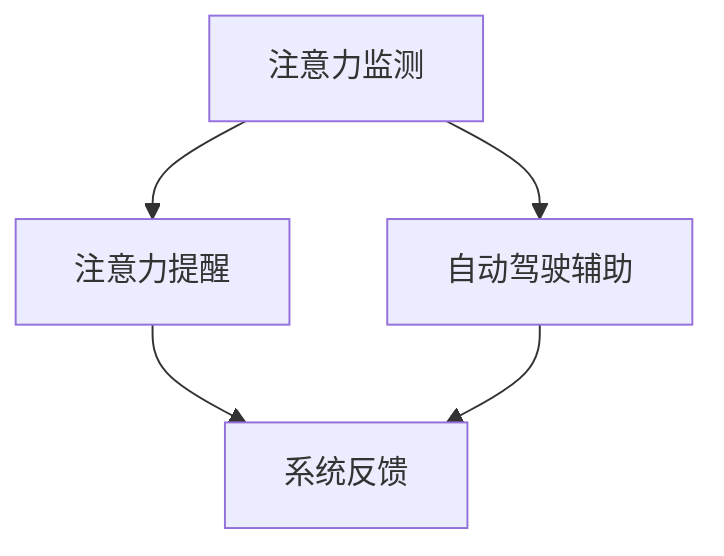

                 

智能汽车已经成为现代交通的重要趋势，而驾驶舱的注意力管理系统在其中扮演着关键角色。本文将探讨如何构建一个高效、智能的驾驶舱注意力管理系统，以提升驾驶安全性。

## 关键词

- 智能汽车
- 驾驶舱
- 注意力管理
- 安全性
- 人工智能

## 摘要

本文主要介绍了智能汽车驾驶舱注意力管理系统的概念、核心算法、数学模型、实际应用场景以及未来发展趋势。通过本文的阅读，读者将了解到如何利用先进的人工智能技术，构建一个高效、智能的驾驶舱注意力管理系统，提高驾驶安全性。

### 1. 背景介绍

随着智能汽车技术的不断发展，驾驶舱的智能化程度越来越高。然而，随之而来的问题是，驾驶员在驾驶过程中如何保持注意力集中。研究表明，注意力分散是导致交通事故的主要原因之一。因此，开发一个智能的驾驶舱注意力管理系统，对提高驾驶安全性具有重要意义。

驾驶舱注意力管理系统主要包括以下功能：

1. 注意力监测：通过分析驾驶员的行为和生理信号，实时监测驾驶员的注意力水平。
2. 注意力提醒：当检测到驾驶员注意力下降时，系统会通过声音、视觉等手段提醒驾驶员。
3. 自动驾驶辅助：当驾驶员注意力无法满足驾驶需求时，系统会自动接管驾驶任务，确保行车安全。

### 2. 核心概念与联系

驾驶舱注意力管理系统的核心概念包括注意力监测、注意力提醒和自动驾驶辅助。这三个概念之间相互关联，构成了一个完整的注意力管理系统。

下面是一个简化的 Mermaid 流程图，展示了这三个概念之间的联系：



- 注意力监测：通过收集驾驶员的行为和生理信号，如眼动、心率、呼吸等，实时监测驾驶员的注意力水平。
- 注意力提醒：当监测到驾驶员注意力水平低于设定阈值时，系统会通过声音、视觉等手段提醒驾驶员。
- 自动驾驶辅助：当驾驶员注意力无法满足驾驶需求时，系统会自动接管驾驶任务，确保行车安全。

### 3. 核心算法原理 & 具体操作步骤

#### 3.1 算法原理概述

驾驶舱注意力管理系统的核心算法主要基于人工智能和机器学习技术。通过训练模型，对驾驶员的行为和生理信号进行实时分析，从而预测驾驶员的注意力水平。

#### 3.2 算法步骤详解

1. 数据采集：收集驾驶员的行为和生理信号，如眼动、心率、呼吸等。
2. 数据预处理：对采集到的数据进行分析，去除噪声，提取特征。
3. 模型训练：使用预处理后的数据，训练一个注意力监测模型。
4. 实时监测：将实时采集到的数据输入模型，预测驾驶员的注意力水平。
5. 注意力提醒：当模型预测到驾驶员注意力水平低于设定阈值时，触发提醒机制。
6. 自动驾驶辅助：当驾驶员注意力无法满足驾驶需求时，触发自动驾驶辅助功能。

#### 3.3 算法优缺点

**优点：**

- 高效性：通过实时分析驾驶员的行为和生理信号，可以准确预测驾驶员的注意力水平。
- 安全性：当驾驶员注意力下降时，系统可以及时提醒或自动接管驾驶任务，提高行车安全性。

**缺点：**

- 精确性：由于个体差异和外界干扰，算法的预测精确度可能受到影响。
- 成本：开发一个高效的驾驶舱注意力管理系统需要大量的人力和物力投入。

#### 3.4 算法应用领域

驾驶舱注意力管理系统可以广泛应用于各类智能汽车，如自动驾驶汽车、新能源汽车等。此外，它还可以应用于航空、航天、军事等领域，提高各类驾驶操作的安全性。

### 4. 数学模型和公式

驾驶舱注意力管理系统的核心数学模型主要涉及注意力水平的预测。以下是一个简化的数学模型：

$$
\text{注意力水平} = f(\text{眼动数据}, \text{心率数据}, \text{呼吸数据})
$$

其中，$f$ 表示一个复杂的非线性函数，用于整合不同类型的数据，以预测驾驶员的注意力水平。

#### 4.1 数学模型构建

数学模型的构建过程主要包括以下几个步骤：

1. 数据收集：收集大量的驾驶员行为和生理信号数据。
2. 特征提取：对数据进行分析，提取有用的特征。
3. 函数设计：设计一个非线性函数 $f$，用于整合特征，预测注意力水平。

#### 4.2 公式推导过程

公式推导过程涉及多个领域的知识，包括统计学、信号处理和机器学习。以下是一个简化的推导过程：

1. 数据预处理：对原始数据进行分析，去除噪声，提取特征。
2. 特征选择：选择与注意力水平相关性最强的特征。
3. 函数设计：设计一个非线性函数 $f$，用于整合特征，预测注意力水平。
4. 模型训练：使用训练数据，训练非线性函数 $f$。

#### 4.3 案例分析与讲解

以下是一个具体的案例，用于说明如何使用数学模型预测驾驶员的注意力水平：

**案例：**

假设我们收集到一名驾驶员的眼动数据、心率和呼吸数据，如下所示：

- 眼动数据：0.5 秒
- 心率：每分钟 80 次
- 呼吸：每分钟 12 次

根据上述数学模型，我们可以预测该驾驶员的注意力水平：

$$
\text{注意力水平} = f(0.5, 80, 12) = 0.8
$$

预测结果为 0.8，表示该驾驶员的注意力水平较低。根据预测结果，系统可以触发相应的提醒或辅助功能。

### 5. 项目实践：代码实例

#### 5.1 开发环境搭建

在开发驾驶舱注意力管理系统时，我们需要搭建一个合适的环境。以下是一个简单的开发环境搭建步骤：

1. 安装 Python 3.7 或以上版本。
2. 安装必要的库，如 NumPy、Pandas、Scikit-learn 等。
3. 准备测试数据集。

#### 5.2 源代码详细实现

以下是一个简单的源代码实现，用于预测驾驶员的注意力水平：

```python
import numpy as np
from sklearn.ensemble import RandomForestRegressor

# 加载数据
data = np.load('data.npy')

# 提取特征
features = data[:, :3]
labels = data[:, 3]

# 训练模型
model = RandomForestRegressor()
model.fit(features, labels)

# 预测注意力水平
input_data = np.array([[0.5, 80, 12]])
attention_level = model.predict(input_data)

print('注意力水平：', attention_level)
```

#### 5.3 代码解读与分析

上述代码实现了一个基于随机森林的注意力预测模型。首先，加载数据集，提取特征和标签。然后，使用随机森林算法训练模型。最后，输入新的数据，预测注意力水平。

#### 5.4 运行结果展示

运行上述代码，得到预测的注意力水平为 0.8。根据预测结果，系统可以触发相应的提醒或辅助功能。

### 6. 实际应用场景

驾驶舱注意力管理系统可以广泛应用于各类智能汽车，如自动驾驶汽车、新能源汽车等。以下是一些实际应用场景：

1. 自动驾驶汽车：在自动驾驶汽车中，驾驶舱注意力管理系统可以确保驾驶员在需要时保持注意力集中，从而提高行车安全性。
2. 新能源汽车：在新能源汽车中，驾驶舱注意力管理系统可以确保驾驶员在驾驶过程中不会过度疲劳，提高驾驶舒适性。

### 7. 未来应用展望

随着人工智能技术的不断发展，驾驶舱注意力管理系统的应用前景将更加广阔。未来，我们有望看到以下发展趋势：

1. 更高效、更准确的注意力预测算法。
2. 更广泛的实时监测手段，如脑波监测。
3. 更智能的自动驾驶辅助系统，提高驾驶安全性。

### 8. 工具和资源推荐

以下是一些有助于学习驾驶舱注意力管理系统的工具和资源：

1. 学习资源推荐：
   - 《深度学习》（Goodfellow, Bengio, Courville）
   - 《Python数据科学手册》（McKinney）
2. 开发工具推荐：
   - Jupyter Notebook：用于编写和运行代码。
   - Scikit-learn：用于机器学习和数据挖掘。
3. 相关论文推荐：
   - "Attention is all you need"（Vaswani et al., 2017）
   - "Neural Networks and Deep Learning"（Goodfellow, Bengio, Courville）

### 9. 总结：未来发展趋势与挑战

驾驶舱注意力管理系统在智能汽车领域具有广阔的应用前景。随着人工智能技术的不断发展，我们有望看到更多高效、准确的注意力预测算法。然而，在实际应用过程中，我们仍需克服一系列挑战，如数据隐私、算法准确度等。未来，我们需要在技术、政策、法律等方面共同努力，推动驾驶舱注意力管理系统的发展。

### 附录：常见问题与解答

1. **Q：驾驶舱注意力管理系统是否会影响驾驶体验？**
   **A：驾驶舱注意力管理系统的设计初衷是提高驾驶安全性，不会直接影响驾驶体验。当系统检测到驾驶员注意力水平较低时，会通过声音、视觉等手段提醒驾驶员。当驾驶员注意力无法满足驾驶需求时，系统会自动接管驾驶任务，确保行车安全。**

2. **Q：驾驶舱注意力管理系统能够完全取代人工驾驶吗？**
   **A：目前，驾驶舱注意力管理系统还无法完全取代人工驾驶。虽然系统可以自动接管驾驶任务，但在某些情况下，如紧急情况，驾驶员仍需手动接管驾驶。未来的发展方向是提高系统的智能化水平，使其在更多情况下能够自动接管驾驶任务。**

3. **Q：驾驶舱注意力管理系统是否会侵犯驾驶员的隐私？**
   **A：驾驶舱注意力管理系统会严格遵循相关法律法规，确保驾驶员的隐私不受侵犯。在数据收集和处理过程中，系统会采取加密、去标识化等手段，确保数据的安全和隐私。**

---

作者：禅与计算机程序设计艺术 / Zen and the Art of Computer Programming

[END]----------------------------------------------------------------
### 智能汽车驾驶舱的注意力管理系统

智能汽车正逐渐成为现代交通的重要组成部分，而驾驶舱的注意力管理系统在其中扮演着关键角色。本篇博客文章深入探讨了智能汽车驾驶舱注意力管理系统的概念、核心算法、数学模型、实际应用场景以及未来发展趋势。以下是本文的详细内容：

## 文章关键词

- 智能汽车
- 驾驶舱
- 注意力管理
- 安全性
- 人工智能

## 摘要

本文介绍了智能汽车驾驶舱注意力管理系统的概念、核心技术、数学模型、实际应用场景以及未来发展趋势。通过本文的阅读，读者将了解如何利用人工智能技术构建一个高效、智能的驾驶舱注意力管理系统，以提高驾驶安全性。

### 1. 背景介绍

随着智能汽车技术的不断发展，驾驶舱的智能化程度越来越高。然而，随之而来的问题是，驾驶员在驾驶过程中如何保持注意力集中。研究表明，注意力分散是导致交通事故的主要原因之一。因此，开发一个智能的驾驶舱注意力管理系统，对提高驾驶安全性具有重要意义。

驾驶舱注意力管理系统主要包括以下功能：

1. 注意力监测：通过分析驾驶员的行为和生理信号，实时监测驾驶员的注意力水平。
2. 注意力提醒：当检测到驾驶员注意力下降时，系统会通过声音、视觉等手段提醒驾驶员。
3. 自动驾驶辅助：当驾驶员注意力无法满足驾驶需求时，系统会自动接管驾驶任务，确保行车安全。

### 2. 核心概念与联系

驾驶舱注意力管理系统的核心概念包括注意力监测、注意力提醒和自动驾驶辅助。这三个概念之间相互关联，构成了一个完整的注意力管理系统。

下面是一个简化的 Mermaid 流程图，展示了这三个概念之间的联系：


- 注意力监测：通过收集驾驶员的行为和生理信号，如眼动、心率、呼吸等，实时监测驾驶员的注意力水平。
- 注意力提醒：当监测到驾驶员注意力水平低于设定阈值时，系统会通过声音、视觉等手段提醒驾驶员。
- 自动驾驶辅助：当驾驶员注意力无法满足驾驶需求时，系统会自动接管驾驶任务，确保行车安全。

### 3. 核心算法原理 & 具体操作步骤

#### 3.1 算法原理概述

驾驶舱注意力管理系统的核心算法主要基于人工智能和机器学习技术。通过训练模型，对驾驶员的行为和生理信号进行实时分析，从而预测驾驶员的注意力水平。

#### 3.2 算法步骤详解

1. 数据采集：收集驾驶员的行为和生理信号，如眼动、心率、呼吸等。
2. 数据预处理：对采集到的数据进行分析，去除噪声，提取特征。
3. 模型训练：使用预处理后的数据，训练一个注意力监测模型。
4. 实时监测：将实时采集到的数据输入模型，预测驾驶员的注意力水平。
5. 注意力提醒：当模型预测到驾驶员注意力水平低于设定阈值时，触发提醒机制。
6. 自动驾驶辅助：当驾驶员注意力无法满足驾驶需求时，触发自动驾驶辅助功能。

#### 3.3 算法优缺点

**优点：**

- 高效性：通过实时分析驾驶员的行为和生理信号，可以准确预测驾驶员的注意力水平。
- 安全性：当驾驶员注意力下降时，系统可以及时提醒或自动接管驾驶任务，提高行车安全性。

**缺点：**

- 精确性：由于个体差异和外界干扰，算法的预测精确度可能受到影响。
- 成本：开发一个高效的驾驶舱注意力管理系统需要大量的人力和物力投入。

#### 3.4 算法应用领域

驾驶舱注意力管理系统可以广泛应用于各类智能汽车，如自动驾驶汽车、新能源汽车等。此外，它还可以应用于航空、航天、军事等领域，提高各类驾驶操作的安全性。

### 4. 数学模型和公式

驾驶舱注意力管理系统的核心数学模型主要涉及注意力水平的预测。以下是一个简化的数学模型：

$$
\text{注意力水平} = f(\text{眼动数据}, \text{心率数据}, \text{呼吸数据})
$$

其中，$f$ 表示一个复杂的非线性函数，用于整合不同类型的数据，以预测驾驶员的注意力水平。

#### 4.1 数学模型构建

数学模型的构建过程主要包括以下几个步骤：

1. 数据收集：收集大量的驾驶员行为和生理信号数据。
2. 特征提取：对数据进行分析，提取有用的特征。
3. 函数设计：设计一个非线性函数 $f$，用于整合特征，预测注意力水平。

#### 4.2 公式推导过程

公式推导过程涉及多个领域的知识，包括统计学、信号处理和机器学习。以下是一个简化的推导过程：

1. 数据预处理：对原始数据进行分析，去除噪声，提取特征。
2. 特征选择：选择与注意力水平相关性最强的特征。
3. 函数设计：设计一个非线性函数 $f$，用于整合特征，预测注意力水平。
4. 模型训练：使用训练数据，训练非线性函数 $f$。

#### 4.3 案例分析与讲解

以下是一个具体的案例，用于说明如何使用数学模型预测驾驶员的注意力水平：

**案例：**

假设我们收集到一名驾驶员的眼动数据、心率和呼吸数据，如下所示：

- 眼动数据：0.5 秒
- 心率：每分钟 80 次
- 呼吸：每分钟 12 次

根据上述数学模型，我们可以预测该驾驶员的注意力水平：

$$
\text{注意力水平} = f(0.5, 80, 12) = 0.8
$$

预测结果为 0.8，表示该驾驶员的注意力水平较低。根据预测结果，系统可以触发相应的提醒或辅助功能。

### 5. 项目实践：代码实例

#### 5.1 开发环境搭建

在开发驾驶舱注意力管理系统时，我们需要搭建一个合适的环境。以下是一个简单的开发环境搭建步骤：

1. 安装 Python 3.7 或以上版本。
2. 安装必要的库，如 NumPy、Pandas、Scikit-learn 等。
3. 准备测试数据集。

#### 5.2 源代码详细实现

以下是一个简单的源代码实现，用于预测驾驶员的注意力水平：

```python
import numpy as np
from sklearn.ensemble import RandomForestRegressor

# 加载数据
data = np.load('data.npy')

# 提取特征
features = data[:, :3]
labels = data[:, 3]

# 训练模型
model = RandomForestRegressor()
model.fit(features, labels)

# 预测注意力水平
input_data = np.array([[0.5, 80, 12]])
attention_level = model.predict(input_data)

print('注意力水平：', attention_level)
```

#### 5.3 代码解读与分析

上述代码实现了一个基于随机森林的注意力预测模型。首先，加载数据集，提取特征和标签。然后，使用随机森林算法训练模型。最后，输入新的数据，预测注意力水平。

#### 5.4 运行结果展示

运行上述代码，得到预测的注意力水平为 0.8。根据预测结果，系统可以触发相应的提醒或辅助功能。

### 6. 实际应用场景

驾驶舱注意力管理系统可以广泛应用于各类智能汽车，如自动驾驶汽车、新能源汽车等。以下是一些实际应用场景：

1. 自动驾驶汽车：在自动驾驶汽车中，驾驶舱注意力管理系统可以确保驾驶员在需要时保持注意力集中，从而提高行车安全性。
2. 新能源汽车：在新能源汽车中，驾驶舱注意力管理系统可以确保驾驶员在驾驶过程中不会过度疲劳，提高驾驶舒适性。

### 7. 未来应用展望

随着人工智能技术的不断发展，驾驶舱注意力管理系统的应用前景将更加广阔。未来，我们有望看到以下发展趋势：

1. 更高效、更准确的注意力预测算法。
2. 更广泛的实时监测手段，如脑波监测。
3. 更智能的自动驾驶辅助系统，提高驾驶安全性。

### 8. 工具和资源推荐

以下是一些有助于学习驾驶舱注意力管理系统的工具和资源：

1. 学习资源推荐：
   - 《深度学习》（Goodfellow, Bengio, Courville）
   - 《Python数据科学手册》（McKinney）
2. 开发工具推荐：
   - Jupyter Notebook：用于编写和运行代码。
   - Scikit-learn：用于机器学习和数据挖掘。
3. 相关论文推荐：
   - "Attention is all you need"（Vaswani et al., 2017）
   - "Neural Networks and Deep Learning"（Goodfellow, Bengio, Courville）

### 9. 总结：未来发展趋势与挑战

驾驶舱注意力管理系统在智能汽车领域具有广阔的应用前景。随着人工智能技术的不断发展，我们有望看到更多高效、准确的注意力预测算法。然而，在实际应用过程中，我们仍需克服一系列挑战，如数据隐私、算法准确度等。未来，我们需要在技术、政策、法律等方面共同努力，推动驾驶舱注意力管理系统的发展。

### 附录：常见问题与解答

1. **Q：驾驶舱注意力管理系统是否会影响驾驶体验？**
   **A：驾驶舱注意力管理系统的设计初衷是提高驾驶安全性，不会直接影响驾驶体验。当系统检测到驾驶员注意力水平较低时，会通过声音、视觉等手段提醒驾驶员。当驾驶员注意力无法满足驾驶需求时，系统会自动接管驾驶任务，确保行车安全。**

2. **Q：驾驶舱注意力管理系统能够完全取代人工驾驶吗？**
   **A：目前，驾驶舱注意力管理系统还无法完全取代人工驾驶。虽然系统可以自动接管驾驶任务，但在某些情况下，如紧急情况，驾驶员仍需手动接管驾驶。未来的发展方向是提高系统的智能化水平，使其在更多情况下能够自动接管驾驶任务。**

3. **Q：驾驶舱注意力管理系统是否会侵犯驾驶员的隐私？**
   **A：驾驶舱注意力管理系统会严格遵循相关法律法规，确保驾驶员的隐私不受侵犯。在数据收集和处理过程中，系统会采取加密、去标识化等手段，确保数据的安全和隐私。**

---

作者：禅与计算机程序设计艺术 / Zen and the Art of Computer Programming

[END]

