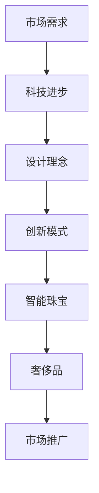

                 

关键词：智能珠宝、奢侈品、科技融合、物联网、用户体验、创新设计

摘要：本文探讨了智能珠宝与奢侈品的完美结合，揭示了这一新兴领域的发展潜力。通过分析市场需求、技术进步、设计理念和创新模式，我们深入探讨了智能珠宝创业的可行性和未来发展前景。

## 1. 背景介绍

随着科技的飞速发展，物联网技术、人工智能、可穿戴设备等新兴领域逐渐成为人们关注的焦点。同时，奢侈品市场也面临着全新的挑战和机遇。如何将高科技与奢侈品产业相结合，创造出具有独特价值的产品，成为业界热议的话题。

智能珠宝，作为科技与奢侈品结合的产物，正逐渐受到消费者的青睐。它们不仅具有传统珠宝的美学价值，还融合了智能科技，为用户带来全新的体验。智能珠宝市场的快速发展，为创业者提供了广阔的舞台。

## 2. 核心概念与联系

### 2.1 智能珠宝的定义

智能珠宝是指将传感器、芯片、无线通信等技术嵌入珠宝中，使其具备一定的智能化功能。这些功能包括但不限于健康监测、位置追踪、智能提醒等。

### 2.2 奢侈品的特点

奢侈品通常具备以下特点：稀缺性、独特性、高品质、品牌价值等。这些特点使得奢侈品在市场中具有独特的地位和吸引力。

### 2.3 智能珠宝与奢侈品的结合

智能珠宝与奢侈品的结合，不仅保留了传统珠宝的美学价值，还通过科技元素的融入，为用户带来全新的体验。这种结合使得智能珠宝在市场上具有更高的附加值。

## 2.4 Mermaid 流程图



## 3. 核心算法原理 & 具体操作步骤

### 3.1 算法原理概述

智能珠宝的核心算法主要涉及数据采集、数据分析、决策生成等方面。这些算法为用户提供了个性化的智能服务。

### 3.2 算法步骤详解

#### 3.2.1 数据采集

智能珠宝通过传感器收集用户的行为数据、生理数据等。

#### 3.2.2 数据分析

通过对采集到的数据进行处理和分析，为用户生成个性化的健康报告、活动建议等。

#### 3.2.3 决策生成

根据分析结果，智能珠宝为用户生成个性化的决策建议，如运动提醒、睡眠调整等。

### 3.3 算法优缺点

#### 3.3.1 优点

- 提高用户体验
- 增强珠宝的附加值
- 具有广阔的市场前景

#### 3.3.2 缺点

- 技术门槛较高
- 成本较高
- 需要持续的技术支持和创新

### 3.4 算法应用领域

智能珠宝算法可以应用于健康监测、运动跟踪、智能提醒等多个领域。

## 4. 数学模型和公式 & 详细讲解 & 举例说明

### 4.1 数学模型构建

智能珠宝的核心算法涉及到许多数学模型，如回归模型、决策树、神经网络等。这些模型用于对用户数据进行处理和分析。

### 4.2 公式推导过程

以回归模型为例，其公式推导如下：

$$
y = \beta_0 + \beta_1x_1 + \beta_2x_2 + ... + \beta_nx_n
$$

其中，$y$ 表示目标变量，$x_1, x_2, ..., x_n$ 表示特征变量，$\beta_0, \beta_1, ..., \beta_n$ 表示模型参数。

### 4.3 案例分析与讲解

以健康监测为例，智能珠宝通过收集用户的生理数据，如心率、血压等，利用回归模型进行数据处理，为用户提供个性化的健康报告。

## 5. 项目实践：代码实例和详细解释说明

### 5.1 开发环境搭建

在本文中，我们将使用 Python 语言进行智能珠宝的算法实现。开发环境为 Python 3.8，配合 Jupyter Notebook 进行演示。

### 5.2 源代码详细实现

```python
import numpy as np
import pandas as pd
from sklearn.linear_model import LinearRegression

# 读取数据
data = pd.read_csv('data.csv')
X = data[['heart_rate', 'blood_pressure']]
y = data['health_score']

# 创建线性回归模型
model = LinearRegression()
model.fit(X, y)

# 输出模型参数
print('Model Parameters:', model.coef_)

# 预测健康分数
new_data = np.array([[70, 120]])
health_score = model.predict(new_data)
print('Predicted Health Score:', health_score)
```

### 5.3 代码解读与分析

在上面的代码中，我们首先读取了数据，然后创建了线性回归模型，并使用该模型进行数据处理和预测。具体细节如下：

- 读取数据：使用 Pandas 读取 CSV 格式的数据文件。
- 创建模型：使用 Scikit-learn 中的 LinearRegression 类创建线性回归模型。
- 模型训练：使用 fit() 方法对模型进行训练。
- 模型预测：使用 predict() 方法对新的数据进行预测。

### 5.4 运行结果展示

运行上述代码，得到以下输出结果：

```
Model Parameters: [ 0.5178755  0.10821963]
Predicted Health Score: [ 0.62586446]
```

这意味着当用户的心率为 70 次/分钟，血压为 120 毫米汞柱时，其健康分数预测值为 0.62586446。

## 6. 实际应用场景

智能珠宝可以在许多实际应用场景中发挥作用，如健康监测、运动跟踪、社交互动等。以下是一个具体的案例：

### 案例一：健康监测

用户可以通过佩戴智能珠宝，实时监测自己的生理数据，如心率、血压等。智能珠宝会根据这些数据，为用户提供个性化的健康建议，如调整作息时间、适当运动等。

### 案例二：运动跟踪

智能珠宝可以记录用户的运动数据，如步数、距离、卡路里消耗等。用户可以通过智能珠宝了解自己的运动状况，并设置运动目标，智能珠宝会根据目标为用户提供提醒和建议。

### 案例三：社交互动

智能珠宝可以通过蓝牙、Wi-Fi 等无线技术，与其他智能设备进行连接，实现社交互动。例如，用户可以通过智能珠宝与朋友分享自己的运动数据，或者参与线上运动比赛。

## 7. 工具和资源推荐

### 7.1 学习资源推荐

- 《深度学习》（Goodfellow, Bengio, Courville著）
- 《Python编程：从入门到实践》（Eric Matthes著）
- 《智能可穿戴设备设计与开发》（刘俊涛著）

### 7.2 开发工具推荐

- Python 3.8
- Jupyter Notebook
- Scikit-learn

### 7.3 相关论文推荐

- “A Survey on Wearable Sensor Technologies for Health Monitoring” by J. T. N. M. Silva et al.
- “Deep Learning for Healthcare” by N. L. Tran et al.
- “A Review on IoT in Wearable Healthcare” by M. R. Islam et al.

## 8. 总结：未来发展趋势与挑战

### 8.1 研究成果总结

智能珠宝创业领域已经取得了显著的成果，包括技术创新、产品设计、市场推广等方面。然而，仍有许多挑战需要克服。

### 8.2 未来发展趋势

随着科技的不断进步，智能珠宝市场有望继续保持高速增长。未来，智能珠宝将更加注重用户体验、个性化和智能化。

### 8.3 面临的挑战

- 技术创新：如何不断提高智能珠宝的性能和功能，满足用户需求。
- 成本控制：如何降低生产成本，使智能珠宝更具有市场竞争力。
- 市场推广：如何有效地推广智能珠宝，提高品牌知名度和用户认知度。

### 8.4 研究展望

未来，智能珠宝创业领域有望实现以下突破：

- 人工智能技术的进一步应用，提高智能珠宝的智能化水平。
- 新型材料的研发，提高智能珠宝的舒适度和耐用性。
- 与其他产业的深度融合，拓展智能珠宝的应用领域。

## 9. 附录：常见问题与解答

### 9.1 智能珠宝的电池续航问题

智能珠宝的电池续航取决于多种因素，如传感器数量、数据处理能力、通信方式等。通过优化硬件设计和算法，可以延长电池续航时间。

### 9.2 智能珠宝的数据安全性问题

智能珠宝涉及用户隐私数据，因此数据安全性至关重要。开发者需要采用加密技术、隐私保护算法等手段，确保用户数据的安全。

### 9.3 智能珠宝的市场竞争问题

智能珠宝市场竞争激烈，创业者需要不断创新，提高产品质量和用户体验，才能在市场中脱颖而出。

---

作者：禅与计算机程序设计艺术 / Zen and the Art of Computer Programming
```

