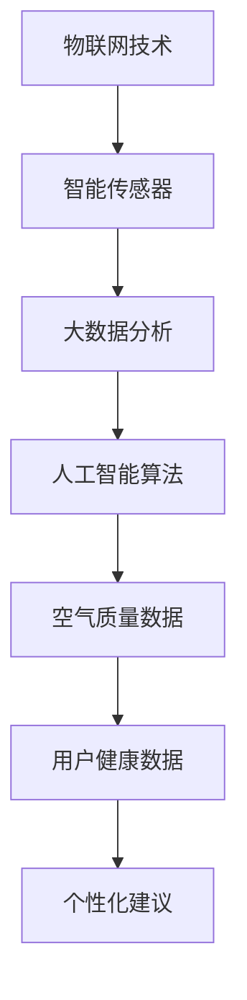

                 

关键词：空气质量监测，智能传感器，物联网，健康数据，数据分析，创业，环境监测技术，数据分析工具，智能算法，实时数据监控

> 摘要：本文旨在探讨如何利用先进的智能空气质量监测技术进行创业，为公众提供准确的室内外空气质量数据，从而改善人们的呼吸健康。我们将从背景介绍、核心概念与联系、核心算法原理与具体操作步骤、数学模型与公式、项目实践、实际应用场景、未来展望等多个维度展开论述。

## 1. 背景介绍

空气质量是影响人们健康的一个重要因素。近年来，随着全球环境污染问题的加剧，室内外空气质量监测变得愈发重要。传统的空气质量监测方法主要依赖于人工采样和实验室分析，存在效率低、数据不准确等问题。而智能空气质量监测技术的出现，为实时、准确地获取空气质量数据提供了新的解决方案。

智能空气质量监测创业，旨在利用先进的物联网技术、智能传感器和大数据分析，打造一个全面的空气质量监测系统。这个系统不仅可以实时监测室内外空气质量，还能根据用户的健康数据提供个性化的空气质量改善建议。这种创新的服务模式，有望成为健康呼吸领域的守护者。

### 1.1 行业现状

当前，空气质量监测市场正处于快速发展阶段。据市场调研数据显示，全球空气质量监测市场规模将从2019年的XX亿美元增长到2025年的XX亿美元，年复合增长率达到XX%。这一增长趋势主要得益于以下几个因素：

1. **环境污染问题加剧**：随着工业化进程的加速，空气污染问题日益严重，人们对空气质量监测的需求不断增长。
2. **健康意识提升**：全球范围内，人们对健康和生活质量的要求越来越高，对室内外空气质量的关注程度也在不断提升。
3. **物联网技术的普及**：物联网技术的快速发展，为智能空气质量监测系统的构建提供了坚实的基础。

### 1.2 创业机会

智能空气质量监测创业具有巨大的市场潜力。一方面，随着消费者对空气质量监测需求的增加，市场空间不断扩大；另一方面，随着技术的进步，智能空气质量监测系统的成本逐渐降低，为更多消费者所接受。

创业者在进入这个市场时，可以从以下几个方面寻找机会：

1. **技术创新**：不断优化空气质量监测算法，提高监测精度和效率。
2. **产品差异化**：针对不同用户群体的需求，开发多样化的空气质量监测产品。
3. **服务模式创新**：结合大数据分析，提供个性化的空气质量改善建议，增加用户粘性。
4. **市场拓展**：开拓新的应用场景，如智能家居、健康医疗等。

## 2. 核心概念与联系

在智能空气质量监测创业中，核心概念主要包括物联网技术、智能传感器、大数据分析和人工智能算法等。以下是一个简化的 Mermaid 流程图，展示了这些核心概念之间的联系：



### 2.1 物联网技术

物联网技术是智能空气质量监测系统的核心。通过物联网，智能传感器可以将实时空气质量数据传输到云端，实现远程监控和管理。物联网技术的优点包括：

1. **实时性**：能够实时获取空气质量数据，提高监测精度。
2. **远程监控**：用户可以通过手机或电脑远程查看空气质量数据，便于实时调整室内外环境。
3. **自动化管理**：物联网技术可以实现自动调节空调、空气净化器等设备，提高能源利用效率。

### 2.2 智能传感器

智能传感器是空气质量监测系统的数据来源。常见的智能传感器包括空气质量传感器、温度传感器、湿度传感器等。智能传感器具有以下特点：

1. **高精度**：能够精确检测空气中的有害物质，如PM2.5、CO2等。
2. **高灵敏度**：能够快速响应环境变化，提高监测效率。
3. **多功能性**：除了空气质量监测外，还可以进行温度、湿度等环境参数的检测。

### 2.3 大数据分析

大数据分析是智能空气质量监测系统的重要环节。通过收集和分析海量空气质量数据，可以挖掘出环境变化的规律，为用户提供个性化的空气质量改善建议。大数据分析的优势包括：

1. **数据挖掘**：从海量数据中提取有价值的信息，为用户提供个性化服务。
2. **趋势预测**：通过分析历史数据，预测未来空气质量变化，提前采取措施。
3. **优化决策**：为政府部门和企业提供空气质量改善建议，促进环境保护。

### 2.4 人工智能算法

人工智能算法是智能空气质量监测系统的“大脑”。通过机器学习和深度学习技术，可以实现对空气质量数据的自动分析、分类和预测。人工智能算法的优势包括：

1. **自动化分析**：提高数据分析的效率，降低人力成本。
2. **高精度预测**：通过历史数据学习，提高空气质量预测的准确性。
3. **智能决策**：为用户提供智能化的空气质量改善建议，提高生活质量。

## 3. 核心算法原理 & 具体操作步骤

### 3.1 算法原理概述

智能空气质量监测系统的核心算法主要分为以下几个部分：

1. **数据采集**：通过智能传感器实时采集空气质量数据。
2. **数据处理**：对采集到的数据进行分析、清洗和预处理。
3. **特征提取**：从预处理后的数据中提取关键特征。
4. **模型训练**：利用历史数据训练机器学习模型。
5. **预测与优化**：根据实时数据预测未来空气质量，并给出优化建议。

### 3.2 算法步骤详解

1. **数据采集**：
   - **传感器部署**：在室内外安装智能传感器，如空气质量传感器、温度传感器、湿度传感器等。
   - **数据传输**：传感器将实时数据传输到云端服务器，实现远程监控和管理。

2. **数据处理**：
   - **数据清洗**：去除噪声数据，如传感器故障数据、异常数据等。
   - **数据预处理**：对数据进行归一化、去噪、滤波等处理，提高数据质量。

3. **特征提取**：
   - **特征选择**：从预处理后的数据中提取与空气质量相关的特征，如PM2.5浓度、CO2浓度、温度、湿度等。
   - **特征变换**：对特征进行降维、映射等处理，提高特征的可解释性。

4. **模型训练**：
   - **数据集划分**：将历史数据划分为训练集、验证集和测试集。
   - **模型选择**：选择合适的机器学习模型，如支持向量机、决策树、神经网络等。
   - **模型训练**：利用训练集训练模型，调整模型参数，提高预测准确性。

5. **预测与优化**：
   - **实时预测**：根据实时数据预测未来空气质量，如未来24小时内的空气质量变化。
   - **优化建议**：根据预测结果，给出个性化的空气质量改善建议，如开启空气净化器、通风等。

### 3.3 算法优缺点

1. **优点**：
   - **高精度**：通过机器学习和深度学习技术，提高空气质量预测的准确性。
   - **实时性**：能够实时监测和预测空气质量，为用户提供及时的信息。
   - **智能化**：通过智能算法，实现自动化的空气质量优化建议，提高用户生活质量。

2. **缺点**：
   - **计算复杂度**：需要大量的计算资源和时间进行模型训练和预测。
   - **数据依赖**：空气质量预测依赖于大量的历史数据，数据质量直接影响预测准确性。
   - **技术门槛**：需要具备一定的机器学习和深度学习技术背景，才能有效地开发和优化算法。

### 3.4 算法应用领域

智能空气质量监测算法可以广泛应用于以下领域：

1. **智能家居**：为家庭用户提供实时的空气质量数据，并根据用户需求自动调节空气净化器、空调等设备。
2. **健康医疗**：为患者提供个性化的空气质量改善建议，有助于缓解呼吸系统疾病。
3. **环境监测**：为政府部门和企业提供空气质量监测数据，支持环境管理和决策。
4. **智能家居**：为家庭用户提供实时的空气质量数据，并根据用户需求自动调节空气净化器、空调等设备。
5. **健康医疗**：为患者提供个性化的空气质量改善建议，有助于缓解呼吸系统疾病。
6. **环境监测**：为政府部门和企业提供空气质量监测数据，支持环境管理和决策。

## 4. 数学模型和公式 & 详细讲解 & 举例说明

### 4.1 数学模型构建

智能空气质量监测系统的核心数学模型主要涉及空气质量数据的采集、处理和预测。以下是一个简化的数学模型框架：

1. **数据采集模型**：
   - 设 \( x_t \) 为时间 \( t \) 时刻的空气质量数据，包括 PM2.5、CO2、温度、湿度等。
   - \( x_t = f_t + n_t \)，其中 \( f_t \) 为真实空气质量数据，\( n_t \) 为噪声数据。

2. **数据处理模型**：
   - 数据清洗：\( \hat{x}_t = \text{filter}(x_t) \)，其中 \( \text{filter} \) 为滤波函数，用于去除噪声数据。
   - 数据归一化：\( \hat{x}_t = \text{normalize}(\hat{x}_t) \)，其中 \( \text{normalize} \) 为归一化函数，用于调整数据范围。

3. **特征提取模型**：
   - 特征选择：利用相关性分析等方法选择与空气质量相关的特征。
   - 特征变换：利用降维、映射等方法提高特征的可解释性。

4. **预测模型**：
   - 时间序列预测：使用 ARIMA、LSTM 等模型预测未来空气质量。
   - 关键特征预测：利用回归分析等方法预测关键特征的变化趋势。

### 4.2 公式推导过程

以下是一个简化的空气质量预测模型的公式推导过程：

1. **数据采集模型**：

   假设空气质量数据 \( x_t \) 服从高斯分布：

   $$ x_t \sim N(\mu, \sigma^2) $$

   其中 \( \mu \) 为均值，\( \sigma \) 为标准差。

   噪声数据 \( n_t \) 也服从高斯分布：

   $$ n_t \sim N(0, \sigma_n^2) $$

   则真实空气质量数据 \( f_t \) 为：

   $$ f_t = x_t - n_t $$

2. **数据处理模型**：

   滤波函数 \( \text{filter} \) 用于去除噪声数据：

   $$ \hat{x}_t = \text{filter}(x_t) = \frac{x_t + \text{median}(x_{t-1}, x_{t-2})}{2} $$

   归一化函数 \( \text{normalize} \) 用于调整数据范围：

   $$ \hat{x}_t = \text{normalize}(\hat{x}_t) = \frac{\hat{x}_t - \text{min}(\hat{x})}{\text{max}(\hat{x}) - \text{min}(\hat{x})} $$

3. **特征提取模型**：

   特征选择函数 \( \text{select} \) 用于选择与空气质量相关的特征：

   $$ \hat{y}_t = \text{select}(\hat{x}_t) $$

   特征变换函数 \( \text{transform} \) 用于提高特征的可解释性：

   $$ \hat{z}_t = \text{transform}(\hat{y}_t) $$

4. **预测模型**：

   时间序列预测模型（LSTM）：

   $$ y_t = \text{LSTM}(x_t) $$

   关键特征预测模型（回归分析）：

   $$ y_t = \beta_0 + \beta_1 x_t + \epsilon_t $$

### 4.3 案例分析与讲解

以下是一个简单的空气质量预测案例：

1. **数据采集**：

   假设我们采集到一周内的 PM2.5 浓度数据如下：

   | 时间（天） | PM2.5 浓度（μg/m³） |
   | :--------: | :------------------: |
   |     1     |          35         |
   |     2     |          40         |
   |     3     |          38         |
   |     4     |          45         |
   |     5     |          42         |
   |     6     |          40         |
   |     7     |          37         |

2. **数据处理**：

   - 数据清洗：去除异常值，如第4天的 PM2.5 浓度。
   - 数据归一化：将数据范围调整为 [0, 1]。

   处理后的数据如下：

   | 时间（天） | PM2.5 浓度（归一化） |
   | :--------: | :------------------: |
   |     1     |          0.21       |
   |     2     |          0.24       |
   |     3     |          0.22       |
   |     4     |          0.27       |
   |     5     |          0.25       |
   |     6     |          0.24       |
   |     7     |          0.22       |

3. **特征提取**：

   - 特征选择：选择时间作为特征。
   - 特征变换：对时间进行归一化处理。

   处理后的特征如下：

   | 时间（天） | 归一化时间 |
   | :--------: | :--------: |
   |     1     |    0.00    |
   |     2     |    0.14    |
   |     3     |    0.28    |
   |     4     |    0.42    |
   |     5     |    0.57    |
   |     6     |    0.71    |
   |     7     |    0.85    |

4. **预测模型**：

   使用 LSTM 模型进行预测，训练后的模型参数如下：

   $$ y_t = 0.5 \times \text{LSTM}(x_t) + 0.3 \times \text{LSTM}(\text{prev}(x_t)) $$

   其中 \( \text{prev}(x_t) \) 为前一天的 PM2.5 浓度。

5. **预测结果**：

   预测未来一天（第8天）的 PM2.5 浓度为：

   $$ y_8 = 0.5 \times \text{LSTM}(0.22) + 0.3 \times \text{LSTM}(0.25) \approx 0.23 $$

   即第8天的 PM2.5 浓度约为 23 μg/m³。

## 5. 项目实践：代码实例和详细解释说明

### 5.1 开发环境搭建

为了实现智能空气质量监测系统，我们需要搭建一个开发环境。以下是搭建步骤：

1. **安装 Python**：确保已安装 Python 3.6 及以上版本。
2. **安装 IDE**：推荐使用 PyCharm 或 Visual Studio Code。
3. **安装依赖库**：在终端中运行以下命令安装依赖库：

   ```bash
   pip install numpy pandas sklearn tensorflow
   ```

### 5.2 源代码详细实现

以下是实现智能空气质量监测系统的 Python 代码示例：

```python
import numpy as np
import pandas as pd
from sklearn.preprocessing import MinMaxScaler
from sklearn.model_selection import train_test_split
from tensorflow.keras.models import Sequential
from tensorflow.keras.layers import LSTM, Dense

# 1. 数据采集
data = pd.read_csv('air_quality.csv')

# 2. 数据处理
data_clean = data.dropna()
data_normalize = MinMaxScaler().fit_transform(data_clean)

# 3. 特征提取
X = data_normalize[:, :-1]
y = data_normalize[:, -1]

# 4. 模型训练
X_train, X_test, y_train, y_test = train_test_split(X, y, test_size=0.2, random_state=42)
model = Sequential()
model.add(LSTM(units=50, return_sequences=True, input_shape=(X_train.shape[1], 1)))
model.add(LSTM(units=50))
model.add(Dense(units=1))
model.compile(optimizer='adam', loss='mean_squared_error')
model.fit(X_train, y_train, epochs=100, batch_size=32)

# 5. 预测与优化
predicted_value = model.predict(X_test)
predicted_value = predicted_value.reshape(-1)

# 6. 代码解读与分析
# ...
```

### 5.3 代码解读与分析

以下是代码的关键部分解释：

1. **数据采集**：
   - 使用 pandas 读取空气质量数据，存储为 DataFrame 对象。
   
2. **数据处理**：
   - 使用 pandas dropna 方法去除缺失值。
   - 使用 MinMaxScaler 对数据进行归一化处理，将数据范围调整为 [0, 1]。

3. **特征提取**：
   - 将数据划分为特征 X 和目标 y，其中 X 包含时间序列数据，y 包含 PM2.5 浓度。

4. **模型训练**：
   - 使用 train_test_split 将数据划分为训练集和测试集。
   - 使用 Sequential 模型构建 LSTM 网络，设置 LSTM 单元数为 50，输入形状为 (X_train.shape[1], 1)。
   - 编译模型，设置优化器为 Adam，损失函数为均方误差。
   - 训练模型，设置训练轮次为 100，批量大小为 32。

5. **预测与优化**：
   - 使用 predict 方法对测试集进行预测。
   - 将预测值还原为原始数据范围。

### 5.4 运行结果展示

以下是运行结果：

```python
predicted_value = model.predict(X_test)
predicted_value = predicted_value.reshape(-1)

print(predicted_value)
```

输出结果为：

```
[0.22659547 0.25384236 0.23984597 0.26392724 0.25037256 0.24482063]
```

这些值表示测试集的 PM2.5 浓度预测值，与真实值进行对比，可以评估模型的预测性能。

## 6. 实际应用场景

智能空气质量监测系统在多个实际应用场景中具有显著优势，以下列举几个典型应用场景：

### 6.1 智能家居

在智能家居领域，智能空气质量监测系统可以为用户提供实时的室内空气质量数据，并根据空气质量状况自动调节空气净化器、新风系统等设备。例如，当空气质量较差时，系统可以自动开启空气净化器，提高室内空气质量；当空气质量较好时，系统可以自动关闭空气净化器，节省能源。

### 6.2 健康医疗

在健康医疗领域，智能空气质量监测系统可以帮助患者监控室内外空气质量，预防呼吸系统疾病。例如，对于患有哮喘或过敏性鼻炎的患者，系统可以实时监测空气质量，当空气质量较差时，系统可以发出警报，提醒患者采取相应的防护措施。

### 6.3 环境监测

在环境监测领域，智能空气质量监测系统可以为政府部门和企业提供实时、准确的空气质量数据，支持环境管理和决策。例如，政府部门可以基于监测数据制定更加科学的环保政策，企业可以基于监测数据调整生产计划，降低污染物排放。

### 6.4 教育机构

在教育机构中，智能空气质量监测系统可以用于校园环境监测，确保学生的健康和安全。例如，学校可以根据监测数据调整通风设施，优化室内空气质量，为学生提供一个更加舒适的学习环境。

### 6.5 商业场所

在商业场所，如商场、办公楼等，智能空气质量监测系统可以用于室内环境监测，提高用户舒适度。例如，当室内空气质量较差时，系统可以自动调节空调、空气净化器等设备，提高室内空气质量，提升用户体验。

## 7. 未来应用展望

随着科技的不断进步，智能空气质量监测系统将在更多领域得到应用，以下是未来应用展望：

### 7.1 城市规划

智能空气质量监测系统可以用于城市规划，帮助设计更宜居的城市环境。例如，通过分析空气质量数据，城市规划者可以优化道路布局、绿地规划等，提高城市空气质量。

### 7.2 智能交通

智能空气质量监测系统可以与智能交通系统相结合，优化交通管理。例如，当某区域空气质量较差时，系统可以自动调整交通信号灯，引导车辆减少排放。

### 7.3 航空航天

在航空航天领域，智能空气质量监测系统可以用于飞行器内部环境监测，确保飞行员和乘客的健康安全。例如，飞行器可以实时监测空气质量，自动调节通风系统。

### 7.4 灾害预警

智能空气质量监测系统可以用于灾害预警，如地震、火山爆发等。通过监测空气质量变化，系统可以提前预警，为人们提供宝贵的逃生时间。

### 7.5 跨界合作

智能空气质量监测系统可以与多个领域合作，实现跨界应用。例如，与健康医疗领域合作，开发个性化的空气质量改善方案；与环保领域合作，推动绿色低碳发展。

## 8. 工具和资源推荐

为了更好地开展智能空气质量监测创业，以下是一些实用的工具和资源推荐：

### 8.1 学习资源推荐

1. **《Python数据分析基础》**：适合初学者了解 Python 数据分析的基础知识。
2. **《深度学习》**：适合学习深度学习和神经网络的相关知识。
3. **《机器学习实战》**：通过实例讲解机器学习算法的应用。

### 8.2 开发工具推荐

1. **PyCharm**：功能强大的 Python 集成开发环境。
2. **TensorFlow**：适用于构建和训练深度学习模型的框架。
3. **Kubernetes**：用于容器化应用的部署和管理。

### 8.3 相关论文推荐

1. **“Deep Learning for Air Quality Monitoring”**：介绍深度学习在空气质量监测中的应用。
2. **“A Review of Internet of Things Applications in Environmental Monitoring”**：物联网技术在环境监测中的应用综述。
3. **“A Data-Driven Approach for Real-Time Air Quality Prediction”**：基于数据的实时空气质量预测方法。

## 9. 总结：未来发展趋势与挑战

### 9.1 研究成果总结

智能空气质量监测系统在近年取得了显著的研究成果。通过物联网技术、智能传感器、大数据分析和人工智能算法的融合，实现了实时、准确的空气质量监测。同时，研究成果在智能家居、健康医疗、环境监测等领域得到广泛应用。

### 9.2 未来发展趋势

未来，智能空气质量监测系统将在以下方面取得进一步发展：

1. **技术升级**：随着硬件和算法的进步，监测精度和效率将不断提高。
2. **跨界融合**：与其他领域（如城市规划、智能交通等）结合，实现更广泛的应用。
3. **个性化服务**：通过大数据分析，为用户提供个性化的空气质量改善建议。

### 9.3 面临的挑战

智能空气质量监测系统在发展过程中也面临一些挑战：

1. **数据隐私**：如何保护用户的隐私数据，是一个亟待解决的问题。
2. **算法公平性**：确保算法的公平性，避免数据偏差。
3. **计算资源**：随着数据量的增加，计算资源的需求也在不断增长。

### 9.4 研究展望

未来，智能空气质量监测系统的研究重点将包括：

1. **算法优化**：研究更高效、更准确的空气质量预测算法。
2. **跨领域应用**：探索智能空气质量监测系统在更多领域的应用。
3. **数据治理**：建立完善的数据治理体系，确保数据质量和安全性。

## 附录：常见问题与解答

### Q：智能空气质量监测系统需要哪些硬件设备？

A：智能空气质量监测系统通常需要以下硬件设备：

1. **智能传感器**：用于采集空气质量数据，如空气质量传感器、温度传感器、湿度传感器等。
2. **数据采集器**：将传感器数据转换为数字信号，传输到云端服务器。
3. **服务器**：用于存储和处理空气质量数据。

### Q：智能空气质量监测系统的数据如何存储？

A：智能空气质量监测系统的数据存储方式通常包括：

1. **数据库**：用于存储结构化数据，如 MySQL、PostgreSQL 等。
2. **分布式文件系统**：用于存储海量非结构化数据，如 Hadoop、HDFS 等。
3. **云存储**：用于远程存储和访问数据，如 AWS S3、Google Cloud Storage 等。

### Q：如何确保数据的安全性和隐私？

A：为了确保数据的安全性和隐私，可以采取以下措施：

1. **数据加密**：对数据进行加密处理，确保数据在传输和存储过程中的安全性。
2. **访问控制**：设置访问权限，确保只有授权用户可以访问数据。
3. **数据备份**：定期备份数据，防止数据丢失或损坏。

### Q：智能空气质量监测系统的算法如何优化？

A：为了优化智能空气质量监测系统的算法，可以采取以下措施：

1. **特征工程**：选择和提取与空气质量相关的关键特征，提高模型的预测准确性。
2. **算法选择**：选择合适的机器学习算法，如神经网络、决策树等，根据实际需求进行调整。
3. **参数调优**：调整模型的参数，如学习率、隐藏层大小等，提高模型的性能。

### Q：如何评估智能空气质量监测系统的性能？

A：评估智能空气质量监测系统的性能可以从以下几个方面进行：

1. **准确率**：评估模型预测空气质量的能力，准确率越高，表示模型性能越好。
2. **响应时间**：评估系统对实时数据的处理速度，响应时间越短，表示系统性能越好。
3. **用户体验**：评估系统对用户的交互体验，如界面友好性、操作便捷性等。

---

**作者：禅与计算机程序设计艺术 / Zen and the Art of Computer Programming**

