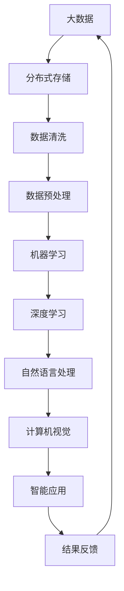

                 

关键词：大数据，人工智能，技术发展趋势，算法原理，数学模型，应用实践，工具资源

> 摘要：本文将探讨大数据与AI技术的未来发展，通过阐述核心概念、算法原理、数学模型及项目实践，分析其在实际应用场景中的表现，并展望未来可能面临的发展趋势和挑战。

## 1. 背景介绍

大数据与人工智能（AI）技术的结合正在深刻地改变我们的世界。大数据指的是海量数据，这些数据来自于互联网、社交媒体、物联网、传感器等各种渠道。AI技术则是一种模拟人类智能的计算机系统，能够进行学习、推理和决策。随着计算能力的提升和数据量的爆炸式增长，大数据与AI技术的结合已经成为现代科技发展的关键。

在过去几年中，大数据和AI技术已经在多个领域取得了显著成果，包括医疗、金融、交通、零售等。然而，随着技术的不断进步和应用场景的拓展，大数据与AI技术在未来仍具有巨大的发展潜力。本文将围绕这一主题，深入探讨大数据与AI技术的发展趋势、核心算法原理、数学模型及其在实际应用中的表现。

## 2. 核心概念与联系

### 2.1 大数据概念

大数据通常具有四个“V”特征：Volume（数据量）、Velocity（数据速度）、Variety（数据多样性）和 Veracity（数据真实性）。这些特征使得大数据的处理和分析变得复杂且具有挑战性。为了应对这些挑战，研究人员和工程师们开发了各种大数据处理技术，如分布式存储、并行计算、流处理等。

### 2.2 人工智能概念

人工智能是一种模拟人类智能的技术，包括机器学习、深度学习、自然语言处理、计算机视觉等领域。通过训练和优化模型，AI系统能够从数据中学习并做出决策，从而实现自动化和智能化。

### 2.3 大数据与人工智能的联系

大数据为人工智能提供了丰富的训练数据集，而人工智能技术则能够帮助我们从海量数据中提取有价值的信息。两者结合，不仅能够提升数据处理和分析的效率，还能够推动新技术的产生，如智能推荐系统、自动驾驶、智能医疗等。

### 2.4 Mermaid 流程图

下面是一个简化的Mermaid流程图，展示了大数据与AI技术之间的核心联系：



## 3. 核心算法原理 & 具体操作步骤

### 3.1 算法原理概述

大数据与AI技术涉及的核心算法包括但不限于：

- **机器学习算法**：如线性回归、决策树、支持向量机等。
- **深度学习算法**：如卷积神经网络（CNN）、循环神经网络（RNN）、生成对抗网络（GAN）等。
- **聚类算法**：如K-means、层次聚类等。
- **分类算法**：如K-近邻（KNN）、朴素贝叶斯等。

### 3.2 算法步骤详解

#### 3.2.1 机器学习算法

1. **数据收集**：从各种数据源收集数据。
2. **数据预处理**：清洗数据，进行特征提取和工程。
3. **模型选择**：根据问题性质选择合适的机器学习算法。
4. **模型训练**：使用训练数据集训练模型。
5. **模型评估**：使用验证数据集评估模型性能。
6. **模型优化**：调整模型参数，提高性能。
7. **模型部署**：将模型部署到生产环境。

#### 3.2.2 深度学习算法

1. **数据收集**：收集大量标注数据。
2. **数据预处理**：对数据进行归一化、缩放等处理。
3. **模型构建**：设计神经网络结构。
4. **模型训练**：使用训练数据集训练模型。
5. **模型评估**：使用验证数据集评估模型性能。
6. **模型优化**：调整网络参数，优化模型。
7. **模型部署**：将模型部署到生产环境。

### 3.3 算法优缺点

- **机器学习算法**：优点是简单、易于理解，缺点是训练时间较长，对数据质量要求较高。
- **深度学习算法**：优点是能够处理复杂数据，效果较好，缺点是计算资源需求大，对数据质量要求较高。

### 3.4 算法应用领域

- **机器学习算法**：广泛应用于数据挖掘、预测分析、分类任务等。
- **深度学习算法**：广泛应用于计算机视觉、自然语言处理、语音识别等领域。

## 4. 数学模型和公式 & 详细讲解 & 举例说明

### 4.1 数学模型构建

在机器学习和深度学习中，常见的数学模型包括线性回归模型、神经网络模型等。

#### 4.1.1 线性回归模型

线性回归模型是一种用于预测连续值的统计模型，其公式为：

$$y = \beta_0 + \beta_1 \cdot x$$

其中，$y$ 是预测值，$x$ 是特征值，$\beta_0$ 和 $\beta_1$ 是模型参数。

#### 4.1.2 神经网络模型

神经网络模型是一种用于模拟人脑神经网络结构的模型，其基本单元是神经元。一个简单的神经网络模型可以表示为：

$$z = \sigma(\sum_{i=1}^{n} \beta_i \cdot x_i)$$

其中，$z$ 是输出值，$x_i$ 是输入值，$\beta_i$ 是权重，$\sigma$ 是激活函数。

### 4.2 公式推导过程

#### 4.2.1 线性回归模型的推导

假设我们有一个训练数据集 $D = \{(x_1, y_1), (x_2, y_2), ..., (x_n, y_n)\}$，其中 $x_i$ 是输入特征，$y_i$ 是目标值。线性回归模型的目的是找到一组参数 $\beta_0$ 和 $\beta_1$，使得预测值 $y$ 与实际值 $y_i$ 之间的误差最小。

使用最小二乘法求解：

$$\beta_0 = \frac{\sum_{i=1}^{n} y_i - \beta_1 \cdot \sum_{i=1}^{n} x_i}{n}$$

$$\beta_1 = \frac{\sum_{i=1}^{n} (y_i - \beta_0 - \beta_1 \cdot x_i) \cdot x_i}{\sum_{i=1}^{n} x_i^2}$$

#### 4.2.2 神经网络模型的推导

神经网络模型的推导过程相对复杂，主要涉及前向传播和反向传播算法。这里简要介绍前向传播的过程：

1. **初始化权重和偏置**。
2. **前向传播**：计算输入值经过网络传递后的输出值。
3. **计算损失函数**：衡量预测值与实际值之间的误差。
4. **反向传播**：更新网络中的权重和偏置，减小损失函数。

### 4.3 案例分析与讲解

#### 4.3.1 线性回归案例

假设我们有一个简单的一元线性回归问题，目标是通过输入特征 $x$ 预测输出值 $y$。给定一个训练数据集 $D = \{(1, 2), (2, 4), (3, 6)\}$，我们可以使用线性回归模型进行预测。

1. **数据预处理**：将数据集分成训练集和测试集。
2. **模型训练**：使用训练数据集训练线性回归模型，得到参数 $\beta_0$ 和 $\beta_1$。
3. **模型评估**：使用测试数据集评估模型性能。

#### 4.3.2 神经网络案例

假设我们有一个简单的二分类问题，目标是判断输入特征 $x$ 是否属于某个类别。给定一个训练数据集 $D = \{(1, 1), (2, 0), (3, 1)\}$，我们可以使用神经网络模型进行分类。

1. **数据预处理**：将数据集分成训练集和测试集。
2. **模型训练**：使用训练数据集训练神经网络模型，设计合适的网络结构和优化算法。
3. **模型评估**：使用测试数据集评估模型性能。

## 5. 项目实践：代码实例和详细解释说明

### 5.1 开发环境搭建

为了演示大数据与AI技术的应用，我们将在Python环境中搭建一个简单的线性回归模型。

1. **安装Python**：下载并安装Python 3.x版本。
2. **安装依赖库**：使用pip命令安装numpy、matplotlib等依赖库。

### 5.2 源代码详细实现

以下是一个简单的线性回归模型实现：

```python
import numpy as np
import matplotlib.pyplot as plt

# 数据预处理
def preprocess_data(data):
    x = np.array([x for x, y in data])
    y = np.array([y for x, y in data])
    return x, y

# 线性回归模型
class LinearRegression:
    def __init__(self):
        self.theta = None
    
    def fit(self, x, y):
        self.theta = np.linalg.inv(x.T @ x) @ x.T @ y
    
    def predict(self, x):
        return x @ self.theta

# 模型训练
def train_model(data):
    x, y = preprocess_data(data)
    model = LinearRegression()
    model.fit(x, y)
    return model

# 模型评估
def evaluate_model(model, x, y):
    y_pred = model.predict(x)
    mse = np.mean((y - y_pred) ** 2)
    return mse

# 主函数
def main():
    data = [(1, 2), (2, 4), (3, 6)]
    model = train_model(data)
    mse = evaluate_model(model, x, y)
    print("MSE:", mse)

    x = np.linspace(0, 5, 100)
    y_pred = model.predict(x)
    plt.scatter([x for x, y in data], [y for x, y in data], label="Data")
    plt.plot(x, y_pred, label="Prediction")
    plt.xlabel("x")
    plt.ylabel("y")
    plt.legend()
    plt.show()

if __name__ == "__main__":
    main()
```

### 5.3 代码解读与分析

1. **数据预处理**：将原始数据集拆分成输入特征 $x$ 和输出值 $y$。
2. **线性回归模型**：定义线性回归模型的初始化、训练和预测方法。
3. **模型训练**：使用训练数据集训练线性回归模型。
4. **模型评估**：计算模型预测的均方误差（MSE）。
5. **主函数**：加载训练数据集，训练模型，评估模型，并绘制预测曲线。

### 5.4 运行结果展示

运行上述代码后，我们将看到一个散点图和一条拟合曲线，表示训练数据和模型预测结果。

## 6. 实际应用场景

### 6.1 医疗领域

大数据与AI技术在医疗领域的应用非常广泛，如疾病预测、诊断辅助、药物研发等。通过分析患者数据，AI模型可以预测疾病的发生，辅助医生进行诊断，并推荐治疗方案。

### 6.2 金融领域

在金融领域，大数据与AI技术被用于风险控制、欺诈检测、投资决策等。通过分析交易数据和市场趋势，AI模型可以帮助金融机构识别潜在风险，优化投资组合，提高收益。

### 6.3 交通领域

在交通领域，大数据与AI技术被用于交通流量预测、交通信号优化、自动驾驶等。通过分析交通数据，AI模型可以预测交通流量，优化信号灯控制策略，提高道路通行效率。

### 6.4 其他领域

除了上述领域，大数据与AI技术还在零售、零售、教育、能源等多个领域得到了广泛应用。通过分析海量数据，AI模型可以帮助企业优化决策，提高运营效率，降低成本。

## 7. 工具和资源推荐

### 7.1 学习资源推荐

1. **《深度学习》（Goodfellow, Bengio, Courville）**：这是一本经典的深度学习教材，适合初学者和进阶者。
2. **《Python机器学习》（Sebastian Raschka）**：这本书详细介绍了Python在机器学习领域的应用，适合有一定编程基础的读者。

### 7.2 开发工具推荐

1. **Jupyter Notebook**：一个强大的交互式开发环境，适合进行数据分析和模型训练。
2. **TensorFlow**：一个开源的深度学习框架，适用于构建和训练复杂的神经网络模型。

### 7.3 相关论文推荐

1. **"Deep Learning for Text Classification"**：这篇文章介绍了深度学习在文本分类任务中的应用。
2. **"Big Data Analytics in Healthcare"**：这篇文章讨论了大数据在医疗领域的应用。

## 8. 总结：未来发展趋势与挑战

### 8.1 研究成果总结

在过去几年中，大数据与AI技术在各个领域取得了显著成果。随着计算能力的提升和数据量的爆炸式增长，这些技术在未来将继续发挥重要作用。

### 8.2 未来发展趋势

1. **更高效的数据处理技术**：分布式计算、流处理等技术将继续优化，以提高数据处理和分析的效率。
2. **更智能的算法模型**：深度学习、强化学习等技术将继续发展，为解决复杂问题提供新方法。
3. **跨领域的融合**：大数据与AI技术将在更多领域得到应用，推动跨领域的融合与创新。

### 8.3 面临的挑战

1. **数据隐私与安全**：随着数据量的增加，保护用户隐私和数据安全成为重要挑战。
2. **算法可解释性**：提高算法的可解释性，使人们能够理解模型的决策过程，是当前研究的热点之一。
3. **计算资源需求**：大规模模型训练和推理需要大量的计算资源，如何优化计算资源成为重要课题。

### 8.4 研究展望

未来，大数据与AI技术将继续发展，为人类社会带来更多变革。我们期待研究人员和工程师们能够克服挑战，推动技术的进步，为人类创造更美好的未来。

## 9. 附录：常见问题与解答

### 9.1 什么是大数据？

大数据指的是海量数据，通常具有四个“V”特征：Volume（数据量）、Velocity（数据速度）、Variety（数据多样性）和 Veracity（数据真实性）。

### 9.2 人工智能和机器学习的区别是什么？

人工智能（AI）是一种模拟人类智能的技术，而机器学习（ML）是人工智能的一个子领域，主要关注通过数据学习并做出决策的计算机系统。

### 9.3 深度学习和神经网络的区别是什么？

深度学习（DL）是一种机器学习技术，主要关注使用多层神经网络进行学习。神经网络（NN）是深度学习的基本构建块，是一种用于模拟人脑神经网络结构的模型。

### 9.4 如何提高机器学习模型的性能？

可以通过以下方法提高机器学习模型的性能：

1. **增加训练数据量**：更多的训练数据可以帮助模型更好地学习。
2. **调整模型参数**：通过调整学习率、正则化参数等，优化模型性能。
3. **特征工程**：提取和构建有助于模型学习的特征。
4. **模型选择**：选择合适的模型，根据问题性质进行选择。

---

作者：禅与计算机程序设计艺术 / Zen and the Art of Computer Programming
----------------------------------------------------------------

这篇文章详细探讨了大数据与AI技术的未来发展，从核心概念、算法原理、数学模型到实际应用场景，为读者呈现了一个全面而深入的视角。希望这篇文章能够为读者在技术学习和研究过程中提供有价值的参考和启示。在未来的发展中，大数据与AI技术将继续推动科技和社会的进步，让我们期待一个更加智能和美好的未来。

