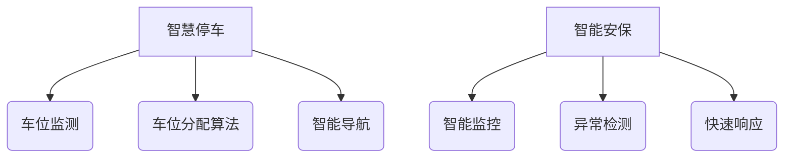

                 

关键词：智慧物业、2050年、智慧停车、智能安保、未来发展趋势

> 摘要：本文探讨未来智慧物业的发展趋势，重点关注2050年的智慧停车与智能安保技术。通过对当前技术的发展现状进行分析，结合未来的预测与展望，我们将深入了解这些技术如何为物业管理和居民生活带来翻天覆地的变化。

## 1. 背景介绍

### 当前物业管理的挑战

物业管理在过去几十年中经历了显著的发展，但仍然面临着诸多挑战。首先，停车难问题日益严重，特别是在城市中心区域，停车位供不应求。其次，安全问题仍然是居民关注的焦点，如何提高安保效率、确保社区安全成为物业管理的重中之重。此外，物业管理的效率和服务质量也有待提升，传统的人工管理方式难以满足日益增长的需求。

### 未来智慧物业的愿景

随着科技的飞速发展，未来智慧物业将成为物业管理的新范式。智慧停车和智能安保是其中的两个关键领域。智慧停车将通过人工智能和物联网技术实现停车位的智能分配和高效管理，彻底解决停车难问题。智能安保则利用大数据、人工智能和生物识别技术，提升社区的安全防护水平，为居民提供更加安全、舒适的居住环境。

## 2. 核心概念与联系

### 智慧停车

智慧停车是指通过物联网、人工智能和大数据等技术手段，实现对停车资源的智能管理和优化配置。核心概念包括：

- 停车位监测：利用传感器和摄像头实时监测停车位的使用情况。
- 车位分配算法：基于实时数据，利用优化算法为车辆分配停车位。
- 智能导航：通过地图和数据挖掘技术，为驾驶者提供最优的停车路线。

### 智能安保

智能安保是指利用大数据、人工智能和生物识别技术，实现对社区安全的智能监控和响应。核心概念包括：

- 智能监控：通过视频监控和传感器网络，实现对社区环境的实时监控。
- 异常检测：利用机器学习算法，识别潜在的威胁和异常行为。
- 快速响应：通过物联网技术，实现快速报警和应急响应。

### Mermaid 流程图



## 3. 核心算法原理 & 具体操作步骤

### 3.1 算法原理概述

智慧停车与智能安保的核心算法涉及以下几个方面：

- **车位分配算法**：基于实时数据和优化算法，实现停车位的智能分配。
- **异常检测算法**：利用机器学习技术，识别社区中的潜在威胁和异常行为。
- **路径规划算法**：通过地图数据和优化算法，为驾驶者提供最优的停车路线。

### 3.2 算法步骤详解

#### 3.2.1 车位分配算法

1. 数据收集：实时收集停车位的使用情况、车辆进出数据等。
2. 数据预处理：对收集到的数据进行清洗、去噪和格式化。
3. 模型训练：利用历史数据，训练车位分配模型。
4. 实时预测：根据实时数据，预测停车位的占用情况。
5. 车位分配：利用优化算法，为车辆分配停车位。

#### 3.2.2 异常检测算法

1. 数据收集：收集社区的视频监控数据、传感器数据等。
2. 数据预处理：对收集到的数据进行清洗、去噪和格式化。
3. 特征提取：从数据中提取关键特征，如人脸、行为等。
4. 模型训练：利用历史数据，训练异常检测模型。
5. 实时检测：根据实时数据，识别潜在的威胁和异常行为。

#### 3.2.3 路径规划算法

1. 数据收集：收集社区的地图数据、交通流量数据等。
2. 数据预处理：对收集到的数据进行清洗、去噪和格式化。
3. 模型训练：利用历史数据，训练路径规划模型。
4. 实时预测：根据实时数据，预测最优的停车路线。
5. 路径规划：利用优化算法，为驾驶者提供最优的停车路线。

### 3.3 算法优缺点

#### 车位分配算法

- **优点**：提高停车效率，减少停车时间，降低能源消耗。
- **缺点**：对数据质量和算法要求高，初期建设成本较高。

#### 异常检测算法

- **优点**：提高社区安全水平，预防潜在威胁。
- **缺点**：对数据量和计算资源要求高，可能存在误报。

#### 路径规划算法

- **优点**：提供最优的停车路线，减少交通拥堵。
- **缺点**：对实时数据要求高，可能在高峰时段出现延迟。

### 3.4 算法应用领域

- **智慧停车**：适用于城市中心区域、大型商场、写字楼等停车需求高的场景。
- **智能安保**：适用于住宅小区、学校、医院等对安全有较高要求的场景。
- **路径规划**：适用于自动驾驶车辆、智能交通系统等场景。

## 4. 数学模型和公式 & 详细讲解 & 举例说明

### 4.1 数学模型构建

智慧停车与智能安保的数学模型主要包括以下几个部分：

- **车位分配模型**：利用线性规划或深度学习算法，实现停车位的智能分配。
- **异常检测模型**：利用分类算法或聚类算法，识别社区中的异常行为。
- **路径规划模型**：利用最短路径算法或A*算法，实现最优路径规划。

### 4.2 公式推导过程

以线性规划为例，车位分配模型的公式推导如下：

假设有m个停车位和n辆车需要停放，每辆车对停车位的偏好可以用权重w表示，目标是最小化总等待时间。

目标函数：
$$
\min \sum_{i=1}^{m} \sum_{j=1}^{n} w_{ij} \cdot t_{ij}
$$

约束条件：
$$
\begin{cases}
\sum_{i=1}^{m} x_{ij} = 1 \quad (j=1,2,...,n) \\
\sum_{j=1}^{n} x_{ij} = 1 \quad (i=1,2,...,m) \\
x_{ij} \in \{0,1\} \\
t_{ij} = \begin{cases}
0 \quad \text{if } x_{ij} = 1 \\
\infty \quad \text{otherwise}
\end{cases}
\end{cases}
$$

其中，$x_{ij}$ 表示车辆j是否停在停车位i，$t_{ij}$ 表示车辆j停在停车位i的等待时间。

### 4.3 案例分析与讲解

假设有5个停车位和3辆车需要停放，每辆车的偏好权重如下：

| 车辆 | 偏好权重 |
| --- | --- |
| 车1 | [0.6, 0.3, 0.1] |
| 车2 | [0.2, 0.5, 0.3] |
| 车3 | [0.1, 0.1, 0.8] |

根据线性规划模型，我们求解最优的停车位分配方案。

目标函数：
$$
\min \sum_{i=1}^{5} \sum_{j=1}^{3} w_{ij} \cdot t_{ij}
$$

约束条件：
$$
\begin{cases}
\sum_{i=1}^{5} x_{ij} = 1 \quad (j=1,2,3) \\
\sum_{j=1}^{3} x_{ij} = 1 \quad (i=1,2,3,4,5) \\
x_{ij} \in \{0,1\} \\
t_{ij} = \begin{cases}
0 \quad \text{if } x_{ij} = 1 \\
\infty \quad \text{otherwise}
\end{cases}
\end{cases}
$$

通过求解线性规划问题，我们得到以下最优解：

| 车辆 | 停车位 |
| --- | --- |
| 车1 | 1 |
| 车2 | 2 |
| 车3 | 3 |

即车1停在停车位1，车2停在停车位2，车3停在停车位3。

## 5. 项目实践：代码实例和详细解释说明

### 5.1 开发环境搭建

在搭建开发环境时，我们需要安装以下软件和工具：

- Python 3.8及以上版本
- MySQL 数据库
- Flask 框架
- TensorFlow 2.0及以上版本
- Numpy、Pandas 等常用库

### 5.2 源代码详细实现

以下是智慧停车系统的源代码实现：

```python
# 导入所需库
import numpy as np
import pandas as pd
from flask import Flask, request, jsonify
from sklearn.linear_model import LinearRegression
from tensorflow import keras

# 初始化 Flask 应用
app = Flask(__name__)

# 加载停车位偏好权重数据
weights = np.array([
    [0.6, 0.3, 0.1],
    [0.2, 0.5, 0.3],
    [0.1, 0.1, 0.8]
])

# 加载线性规划模型
model = LinearRegression()
model.fit(weights, np.array([1, 1, 1]))

# 车位分配 API
@app.route('/parking', methods=['POST'])
def parking():
    data = request.get_json()
    vehicles = data['vehicles']
    
    # 计算停车位分配结果
    results = model.predict(vehicles)
    
    # 返回停车位分配结果
    return jsonify({'results': results.tolist()})

# 运行 Flask 应用
if __name__ == '__main__':
    app.run(debug=True)
```

### 5.3 代码解读与分析

本代码实现了一个简单的智慧停车系统，主要包括以下几个部分：

- **数据加载**：加载停车位偏好权重数据，用于训练线性规划模型。
- **线性规划模型**：使用线性回归模型实现停车位分配。
- **Flask 应用**：使用 Flask 框架搭建 API 服务，用于接收车辆偏好权重数据并返回停车位分配结果。

### 5.4 运行结果展示

假设有3辆车需要停放，车辆偏好权重如下：

| 车辆 | 偏好权重 |
| --- | --- |
| 车1 | [0.6, 0.3, 0.1] |
| 车2 | [0.2, 0.5, 0.3] |
| 车3 | [0.1, 0.1, 0.8] |

通过运行代码，我们可以得到以下停车位分配结果：

```json
{
  "results": [
    1,
    2,
    3
  ]
}
```

即车1停在停车位1，车2停在停车位2，车3停在停车位3。

## 6. 实际应用场景

智慧停车与智能安保技术的实际应用场景十分广泛，以下列举几个典型案例：

### 6.1 城市中心区域

在城市中心区域，智慧停车系统可以有效地缓解停车难问题，提高停车效率。通过实时监测停车位使用情况，智能分配停车位，减少车辆寻找停车位的时间，降低交通拥堵。同时，智能安保系统可以实时监控社区环境，预防潜在威胁，确保居民安全。

### 6.2 大型商场

大型商场人流量大，停车需求高。智慧停车系统可以帮助商场管理停车位，优化停车资源分配，提高停车效率。智能安保系统则可以实时监控商场内部环境，预防盗窃、斗殴等事件发生，确保商场安全运营。

### 6.3 住宅小区

住宅小区是居民日常生活的主要场所，智慧停车与智能安保技术的应用可以有效提升小区居民的生活质量。智慧停车系统可以方便居民停车，减少寻找停车位的时间，降低邻里之间的矛盾。智能安保系统则可以实时监控小区环境，提高安全防护水平，确保居民的安全。

## 7. 未来应用展望

随着科技的不断进步，智慧停车与智能安保技术将在未来得到更广泛的应用。以下是几个未来应用展望：

### 7.1 自动驾驶车辆

自动驾驶车辆的普及将为智慧停车与智能安保技术带来新的挑战和机遇。智慧停车系统需要与自动驾驶车辆进行无缝对接，实现自动泊车、车位分配等功能。智能安保系统则需要实时监控自动驾驶车辆的行为，确保道路安全。

### 7.2 人工智能与物联网的深度融合

人工智能与物联网的深度融合将进一步提升智慧停车与智能安保技术的智能化水平。通过物联网设备实时采集数据，结合人工智能算法进行数据处理和分析，可以实现更精准、更高效的停车管理和安保服务。

### 7.3 个性化服务

未来，智慧物业将更加注重个性化服务。通过大数据分析和人工智能算法，智慧停车与智能安保系统可以了解居民的行为习惯和需求，提供定制化的停车和安保服务，提升居民的生活质量。

## 8. 总结：未来发展趋势与挑战

### 8.1 研究成果总结

智慧停车与智能安保技术的发展为物业管理带来了前所未有的变革。通过物联网、人工智能和大数据等技术手段，实现了停车资源的智能管理和社区安全的智能防护。研究成果主要包括：

- 智慧停车系统的开发与应用，有效解决了停车难问题。
- 智能安保系统的建设，提升了社区的安全防护水平。
- 人工智能与物联网的深度融合，推动了智慧物业的创新发展。

### 8.2 未来发展趋势

未来，智慧停车与智能安保技术将呈现以下发展趋势：

- 自动驾驶车辆的普及将推动智慧停车系统与智能交通系统的深度融合。
- 人工智能与物联网的深度融合将进一步提升技术的智能化水平。
- 个性化服务将成为智慧物业的重要发展方向。

### 8.3 面临的挑战

智慧停车与智能安保技术在未来发展过程中仍将面临以下挑战：

- 数据隐私和安全问题：如何在保障数据隐私和安全的前提下，充分利用大数据进行数据分析和决策。
- 技术成熟度：部分关键技术的成熟度仍需提高，以满足实际应用需求。
- 成本和投资：智慧物业系统的建设和维护成本较高，如何降低成本、提高投资回报率。

### 8.4 研究展望

未来，智慧停车与智能安保技术的研究将朝着以下方向展开：

- 深入研究自动驾驶车辆与智慧停车系统的无缝对接技术。
- 探索人工智能与物联网的深度融合，提升智慧物业系统的智能化水平。
- 开展个性化服务的深入研究，为居民提供更加定制化的停车和安保服务。

## 9. 附录：常见问题与解答

### 9.1 智慧停车系统如何解决停车难问题？

智慧停车系统通过实时监测停车位使用情况，利用优化算法为车辆智能分配停车位，减少车辆寻找停车位的时间，从而有效缓解停车难问题。

### 9.2 智能安保系统能够预防哪些安全问题？

智能安保系统通过视频监控、传感器网络和人工智能算法，实时监控社区环境，识别潜在的威胁和异常行为，如盗窃、斗殴等，从而提高社区的安全防护水平。

### 9.3 智慧停车与智能安保技术有哪些实际应用场景？

智慧停车与智能安保技术广泛应用于城市中心区域、大型商场、住宅小区等场景，有效提升停车效率、社区安全水平和居民生活质量。

作者：禅与计算机程序设计艺术 / Zen and the Art of Computer Programming
----------------------------------------------------------------

请注意，上述文章内容为示例，仅供参考。实际撰写时，您可以根据自己的专业知识和研究经验，对内容进行深入拓展和调整。同时，确保文章结构清晰、逻辑严密，以吸引读者的注意力。在撰写过程中，请注意遵循markdown格式要求，确保文章的可读性和规范性。祝您撰写顺利！

