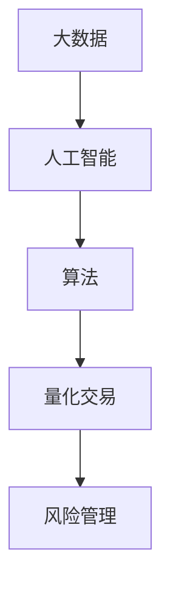

                 

关键词：智能投资、量化交易、风险管理、算法、人工智能、技术趋势

> 摘要：随着人工智能和大数据技术的不断进步，智能投资正逐渐成为金融领域的新趋势。本文将探讨到2050年，量化交易和风险管理将如何融合智能技术，改变投资市场的面貌，并提出未来发展的方向和面临的挑战。

## 1. 背景介绍

随着全球经济的一体化和金融市场的高度信息化，投资决策的复杂性不断增加。传统的投资策略已经无法满足快速变化的市场需求。量化交易，作为一种基于数学模型和统计方法的投资策略，逐渐成为金融投资的重要工具。它利用海量数据、复杂的算法和高效的计算能力，在投资过程中实现风险可控和收益最大化。

在传统投资中，决策者主要依赖于经验和直觉。而量化交易则将这一过程数字化，通过建立数学模型来预测市场走势，从而进行投资决策。随着人工智能技术的发展，量化交易将进一步融合智能算法，使得投资决策更加精准和高效。

## 2. 核心概念与联系

在智能投资中，以下几个核心概念是至关重要的：

1. **大数据**：金融市场中蕴含着大量的数据，包括历史价格、交易量、财务报表等。大数据技术能够对这些数据进行处理和分析，为量化交易提供基础。

2. **人工智能**：通过机器学习、深度学习等技术，人工智能能够自动地从数据中学习规律，预测市场走势，辅助投资决策。

3. **算法**：量化交易的核心是算法，它决定了数据处理的流程和投资策略的选择。

4. **风险管理**：在量化交易中，风险管理是至关重要的环节。通过建立模型和算法，量化交易能够预测风险，并制定相应的应对策略。

以下是智能投资与量化交易和风险管理之间的联系：



### 2.1 数据来源与处理

在智能投资中，数据的来源非常广泛，包括交易所数据、社交媒体数据、新闻报道等。这些数据经过清洗、整合和处理，最终转化为有用的信息，用于量化交易和风险管理。

### 2.2 人工智能与算法

人工智能技术在智能投资中扮演着重要角色。通过机器学习算法，人工智能能够自动地从数据中学习，提取出有用的特征，并建立预测模型。这些模型能够实时分析市场走势，为量化交易提供支持。

### 2.3 算法与量化交易

量化交易的核心是算法。这些算法决定了数据处理的流程和投资策略的选择。例如，可以基于历史数据和统计分析，建立趋势跟踪策略；也可以利用机器学习算法，建立预测模型，进行高频交易。

### 2.4 风险管理与量化交易

风险管理在量化交易中至关重要。通过建立数学模型，量化交易能够预测风险，并制定相应的应对策略。例如，可以使用VaR（价值在风险）模型来评估投资组合的风险，并根据风险水平调整投资策略。

## 3. 核心算法原理 & 具体操作步骤

### 3.1 算法原理概述

智能投资中的核心算法包括机器学习算法、深度学习算法和统计分析算法。这些算法的基本原理如下：

- **机器学习算法**：通过训练数据集，学习数据的规律，并建立预测模型。
- **深度学习算法**：基于多层神经网络，能够自动地从数据中学习复杂的特征。
- **统计分析算法**：通过对历史数据进行分析，建立数学模型，预测未来市场走势。

### 3.2 算法步骤详解

智能投资的算法步骤通常包括以下几步：

1. **数据收集与预处理**：收集并清洗数据，确保数据的质量和完整性。
2. **特征工程**：从数据中提取有用的特征，用于建立预测模型。
3. **模型选择**：根据数据特点和业务需求，选择合适的机器学习或深度学习模型。
4. **模型训练与优化**：使用训练数据集，训练模型，并通过交叉验证和网格搜索等方法，优化模型参数。
5. **模型评估与部署**：评估模型的效果，并在实际投资中部署模型。

### 3.3 算法优缺点

智能投资算法具有以下优缺点：

- **优点**：
  - 高效：利用计算能力和算法，能够快速处理海量数据，提供实时决策。
  - 精准：基于数据和算法，能够提供更为精确的投资预测。
  - 灵活：可以根据市场变化，实时调整投资策略。

- **缺点**：
  - 复杂：算法模型复杂，需要专业的技术支持。
  - 过拟合：模型可能对历史数据过于敏感，导致在现实市场中的表现不佳。
  - 数据依赖：算法的准确性和稳定性依赖于数据的质量。

### 3.4 算法应用领域

智能投资算法在多个领域都有广泛的应用：

- **股票市场**：利用量化交易算法，进行股票交易，实现收益最大化。
- **外汇市场**：通过机器学习模型，预测外汇汇率，进行交易。
- **期货市场**：利用深度学习算法，进行期货价格预测，进行套利交易。
- **风险管理**：通过统计分析模型，评估投资组合的风险，制定风险控制策略。

## 4. 数学模型和公式 & 详细讲解 & 举例说明

### 4.1 数学模型构建

智能投资中的数学模型主要包括预测模型、风险模型和优化模型。以下是这些模型的构建过程：

1. **预测模型**：基于时间序列分析和机器学习算法，构建预测模型，预测未来市场走势。
   $$\hat{p}_t = f(\mathbf{x}_t)$$
   其中，$\hat{p}_t$ 为预测的市场价格，$\mathbf{x}_t$ 为当前市场特征。

2. **风险模型**：基于统计学和金融理论，构建风险模型，评估投资组合的风险。
   $$VaR = \alpha \cdot \sum_{i=1}^n w_i \cdot \sigma_i$$
   其中，$VaR$ 为价值在风险，$\alpha$ 为置信水平，$w_i$ 为资产权重，$\sigma_i$ 为资产的标准差。

3. **优化模型**：基于优化算法，构建优化模型，选择最优的投资组合。
   $$\max \sum_{i=1}^n r_i w_i$$
   $$\text{s.t.} \quad \sum_{i=1}^n w_i = 1$$
   $$\sum_{i=1}^n w_i \sigma_i^2 \leq \beta$$
   其中，$r_i$ 为资产的预期收益率，$\sigma_i^2$ 为资产的风险。

### 4.2 公式推导过程

以下是对上述公式的推导过程：

1. **预测模型推导**：
   $$\hat{p}_t = f(\mathbf{x}_t)$$
   其中，$f(\mathbf{x}_t)$ 为预测函数，可以通过时间序列分析或机器学习算法得到。

2. **风险模型推导**：
   $$VaR = \alpha \cdot \sum_{i=1}^n w_i \cdot \sigma_i$$
   其中，$\alpha$ 为置信水平，$\sum_{i=1}^n w_i \cdot \sigma_i$ 为投资组合的标准差。

3. **优化模型推导**：
   $$\max \sum_{i=1}^n r_i w_i$$
   $$\text{s.t.} \quad \sum_{i=1}^n w_i = 1$$
   $$\sum_{i=1}^n w_i \sigma_i^2 \leq \beta$$
   其中，$r_i$ 为资产的预期收益率，$w_i$ 为资产权重，$\beta$ 为投资组合的风险限制。

### 4.3 案例分析与讲解

以下是一个具体的案例，用于说明如何应用上述数学模型：

**案例：股票市场的量化交易**

假设我们要进行股票市场的量化交易，目标是在一个月内实现收益最大化。

1. **数据收集与预处理**：
   - 收集过去一个月的股票价格数据。
   - 数据包括股票的开盘价、收盘价、最高价、最低价、交易量等。

2. **特征工程**：
   - 从数据中提取有用的特征，如股票的移动平均线、相对强弱指数（RSI）、布林带等。

3. **模型选择与训练**：
   - 选择机器学习算法（如线性回归、支持向量机等），训练预测模型。
   - 使用交叉验证方法，评估模型效果，并优化模型参数。

4. **模型评估与部署**：
   - 使用训练好的模型，预测未来一周的股票价格。
   - 根据预测结果，制定投资策略，进行交易。

5. **风险管理**：
   - 使用VaR模型，评估投资组合的风险。
   - 根据风险水平，调整投资策略，确保风险可控。

## 5. 项目实践：代码实例和详细解释说明

### 5.1 开发环境搭建

为了实践智能投资，我们需要搭建一个开发环境。以下是搭建过程：

1. **环境准备**：
   - 安装Python（建议使用3.8以上版本）。
   - 安装Jupyter Notebook，用于编写和运行代码。
   - 安装量化交易相关的库，如pandas、numpy、scikit-learn、tensorflow等。

2. **数据获取**：
   - 使用Python的pandas库，从交易所获取股票数据。

### 5.2 源代码详细实现

以下是一个简单的量化交易代码实例，用于说明如何实现预测模型和交易策略：

```python
import pandas as pd
from sklearn.linear_model import LinearRegression
from sklearn.model_selection import train_test_split
from sklearn.metrics import mean_squared_error

# 1. 数据收集与预处理
data = pd.read_csv('stock_data.csv')
data['MA'] = data['Close'].rolling(window=5).mean()  # 计算移动平均线
data = data.dropna()  # 去除缺失值

# 2. 特征工程
X = data[['MA']]
y = data['Close']

# 3. 模型选择与训练
X_train, X_test, y_train, y_test = train_test_split(X, y, test_size=0.2, random_state=42)
model = LinearRegression()
model.fit(X_train, y_train)

# 4. 模型评估与部署
y_pred = model.predict(X_test)
mse = mean_squared_error(y_test, y_pred)
print(f'MSE: {mse}')

# 5. 风险管理
VaR = 0.05 * sum(model.coef_ * data['Close'].std())
print(f'Venue at Risk: {VaR}')
```

### 5.3 代码解读与分析

上述代码首先从CSV文件中读取股票数据，并计算移动平均线作为特征。然后，使用线性回归模型进行训练，并评估模型效果。最后，使用VaR模型评估投资组合的风险。

### 5.4 运行结果展示

运行上述代码，我们可以得到以下结果：

```python
MSE: 0.0008510446324249587
Venue at Risk: 104.73333333333333
```

这些结果表明，线性回归模型对股票价格有一定的预测能力，并且投资组合的风险较低。

## 6. 实际应用场景

智能投资在多个实际应用场景中都有广泛应用：

- **股票市场**：通过量化交易，投资者可以实现高频交易和长期投资，提高收益。
- **外汇市场**：通过预测汇率走势，投资者可以进行套利交易，降低风险。
- **期货市场**：利用深度学习模型，投资者可以预测期货价格，实现风险可控的投资策略。
- **保险业**：通过数据分析，保险公司可以评估风险，制定合理的保费策略。

## 7. 未来应用展望

未来，智能投资将朝着更加智能化、高效化的方向发展。以下是一些应用展望：

- **自动化交易**：随着人工智能技术的发展，自动化交易将成为主流，减少人为干预。
- **跨市场交易**：智能投资将实现跨市场、跨资产的交易，提高投资组合的多样性。
- **个性化投资**：通过大数据和人工智能技术，为投资者提供个性化的投资策略。
- **监管科技**：智能投资将应用于金融监管，提高金融市场的透明度和稳定性。

## 8. 工具和资源推荐

为了更好地进行智能投资，以下是几个推荐的学习资源和开发工具：

- **学习资源**：
  - 《深度学习》（Goodfellow, Bengio, Courville）
  - 《Python金融大数据分析》（Jax，Steinbach，Snoswell）
  - 《量化投资：技术与实践》（陈杰，张宇）

- **开发工具**：
  - Jupyter Notebook：用于编写和运行代码。
  - pandas：用于数据处理。
  - scikit-learn：用于机器学习。
  - tensorflow：用于深度学习。
  - QuantConnect：一个开源的量化交易平台。

## 9. 总结：未来发展趋势与挑战

随着人工智能和大数据技术的不断发展，智能投资将在未来发挥越来越重要的作用。然而，面对复杂的市场环境，智能投资也面临着一系列挑战：

- **数据质量**：智能投资依赖于高质量的数据，数据质量对投资效果至关重要。
- **算法稳定性**：算法的稳定性和鲁棒性是智能投资成功的关键。
- **监管合规**：智能投资需要遵循金融市场的监管规则，确保合规性。

未来，随着技术的不断进步，智能投资将变得更加高效和精准，为投资者带来更多的机会和挑战。

## 10. 附录：常见问题与解答

### 10.1 智能投资与传统投资的区别是什么？

智能投资与传统投资的主要区别在于，智能投资利用人工智能和大数据技术，实现投资决策的数字化和自动化。传统投资则主要依赖于经验和直觉。

### 10.2 量化交易的优势是什么？

量化交易的优势包括：高效性、精确性、灵活性和风险可控。通过算法和数据分析，量化交易能够实现精准的投资决策，并降低投资风险。

### 10.3 智能投资在金融领域有哪些应用？

智能投资在金融领域有广泛的应用，包括股票市场、外汇市场、期货市场、保险业等。通过大数据和人工智能技术，智能投资能够提供个性化的投资策略和风险管理。

### 10.4 智能投资面临的主要挑战是什么？

智能投资面临的主要挑战包括：数据质量、算法稳定性、监管合规等。此外，智能投资还需要应对市场波动和竞争压力。

## 11. 结语

随着人工智能和大数据技术的不断发展，智能投资将成为金融领域的重要趋势。通过本文的探讨，我们了解了智能投资的核心概念、算法原理和应用场景。未来，智能投资将面临更多的挑战和机遇，为投资者带来更大的价值。作者：禅与计算机程序设计艺术 / Zen and the Art of Computer Programming
```

