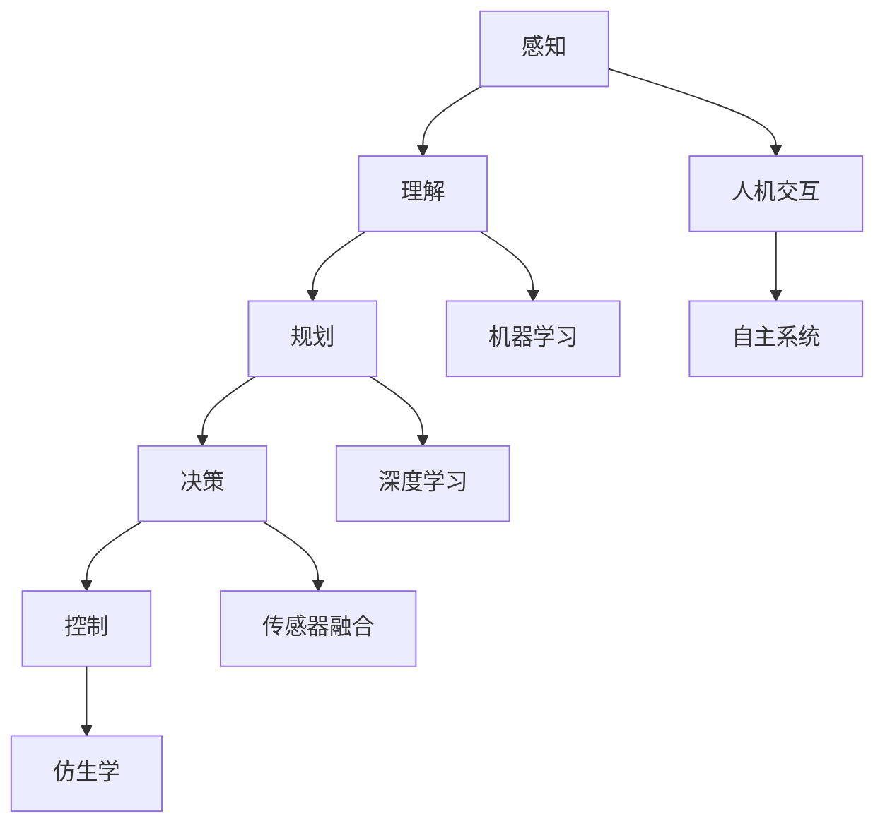

                 

关键词：未来机器人、智能助手、仿生技术、人工智能、2050年

> 摘要：随着科技的不断进步，机器人技术正以前所未有的速度发展。本文探讨了未来机器人，特别是2050年的智能助手与仿生伙伴，将会如何改变我们的生活。通过深入分析机器人的核心概念、算法原理、数学模型以及实际应用，我们试图勾勒出这一未来世界的轮廓，同时探讨其中所面临的挑战与机遇。

## 1. 背景介绍

在过去的一个世纪里，机器人技术经历了从幻想走向现实的飞跃。从早期的机械手臂到如今复杂的自动化系统，机器人的应用范围越来越广，它们已经深入到制造业、医疗、农业、家庭等多个领域。然而，随着人工智能、深度学习、传感器技术和材料科学的迅猛发展，未来的机器人将不仅仅是一种工具，更将成为我们生活中的智能伙伴。

到2050年，机器人技术预计将达到一个新的高度。智能助手将不再是简单的自动化设备，而是具有高度自主学习和适应能力的智能体。仿生技术将使得机器人能够模仿人类的感官、运动和认知能力，使得机器人和人类之间的互动更加自然和流畅。这一变革将带来深远的影响，改变我们的生活方式、工作模式以及社会结构。

## 2. 核心概念与联系

为了更好地理解未来机器人，我们需要了解几个核心概念及其相互之间的联系。这些概念包括人工智能、机器学习、深度学习、传感器融合、仿生学、自主系统和人机交互。

### 2.1 人工智能

人工智能（Artificial Intelligence，AI）是研究、开发用于模拟、延伸和扩展人类智能的理论、方法、技术及应用系统的综合技术科学。它包括机器学习、计算机视觉、自然语言处理等多个子领域。人工智能的目标是使机器能够执行复杂任务，包括推理、决策、规划和问题解决。

### 2.2 机器学习

机器学习（Machine Learning，ML）是一种人工智能的子领域，它使用算法来解析数据、从中学习，然后做出决策或预测。机器学习算法包括监督学习、无监督学习和强化学习。监督学习算法通过训练数据学习规律，无监督学习算法则从数据中自动发现模式，而强化学习算法通过不断尝试和反馈来优化行为。

### 2.3 深度学习

深度学习（Deep Learning，DL）是机器学习的一个子领域，它使用多层神经网络来模拟人脑神经元之间的交互，通过多层次的非线性变换来提取数据中的特征。深度学习在图像识别、语音识别和自然语言处理等领域取得了显著的成果。

### 2.4 传感器融合

传感器融合（Sensor Fusion）是将来自不同类型的传感器收集的数据进行综合处理，以提高系统的感知能力。在机器人领域，传感器融合技术使得机器人能够更好地理解其周围环境，包括视觉传感器、惯性测量单元（IMU）、激光雷达和超声波传感器等。

### 2.5 仿生学

仿生学（Bionics）是一门研究生物系统的结构、功能和工作原理，并将这些原理应用于工程设计的学科。在机器人领域，仿生学可以帮助我们设计出更加自然、高效的机器人系统，例如模仿人类视觉、触觉和运动能力的机器人。

### 2.6 自主系统

自主系统（Autonomous Systems）是能够自主执行任务、作出决策的系统。这些系统通常包括感知、规划、决策和控制等模块，能够对环境进行感知、理解、规划行动并执行这些行动。自主系统在无人驾驶汽车、无人机和自动化仓储等领域有着广泛的应用。

### 2.7 人机交互

人机交互（Human-Computer Interaction，HCI）是研究人类与计算机系统之间交互的学科。在人机交互中，用户通过界面与计算机系统进行交互，系统则通过反馈来响应用户的操作。随着机器人技术的发展，人机交互将变得更加自然和直观，使得机器人和人类能够更加顺畅地合作。

### 2.8 Mermaid 流程图

以下是一个简化的机器人系统的 Mermaid 流程图，展示了上述核心概念之间的联系。



## 3. 核心算法原理 & 具体操作步骤

### 3.1 算法原理概述

未来机器人的核心算法将主要依赖于深度学习和强化学习。深度学习算法将使得机器人能够从大量的数据中自动提取特征，进行复杂的环境理解和任务决策。强化学习算法则使得机器人能够在动态环境中通过不断尝试和反馈来优化其行为。

### 3.2 算法步骤详解

1. **数据收集与预处理**

   机器人首先需要收集大量的数据，包括环境数据、任务数据、用户行为数据等。然后对数据进行预处理，包括去噪、标准化和特征提取等。

2. **特征提取**

   使用深度学习算法，例如卷积神经网络（CNN）或循环神经网络（RNN），对预处理后的数据进行特征提取。这些特征将用于后续的任务决策和规划。

3. **任务规划**

   基于提取出的特征，机器人需要制定一个执行任务的高效路径。这一过程通常涉及到路径规划、资源分配和风险评估等。

4. **决策与控制**

   机器人根据规划的结果进行决策，并执行相应的控制指令。这一过程通常涉及到实时数据分析和动态调整。

5. **反馈与优化**

   机器人执行任务后，会收集反馈数据，并将其用于优化下一次的任务执行。

### 3.3 算法优缺点

**优点：**

- **高效性**：深度学习和强化学习算法能够快速处理大量数据，并提供高效的决策。
- **灵活性**：这些算法能够适应不同的环境和任务，提供灵活的解决方案。
- **自主性**：机器人能够自主学习和优化，提高其适应能力。

**缺点：**

- **计算成本**：深度学习和强化学习算法通常需要大量的计算资源，尤其是训练阶段。
- **数据依赖性**：算法的性能很大程度上取决于数据的质量和数量。
- **安全性**：在动态环境中，算法可能无法完全避免风险。

### 3.4 算法应用领域

深度学习和强化学习算法在未来的机器人中将有广泛的应用，包括：

- **智能家居**：智能助手可以自动处理日常任务，如打扫房间、烹饪食物等。
- **无人驾驶**：自动驾驶汽车将能够自主导航和避障。
- **医疗**：机器人可以辅助医生进行诊断和手术。
- **工业**：自动化生产线上的机器人将能够提高生产效率。

## 4. 数学模型和公式 & 详细讲解 & 举例说明

### 4.1 数学模型构建

未来机器人系统的数学模型将涉及多个方面，包括机器学习模型、运动学模型和动力学模型。

1. **机器学习模型**

   假设我们使用卷积神经网络（CNN）对图像进行分类，其数学模型可以表示为：

   $$ f(x) = \text{CNN}(x) $$

   其中，$x$ 是输入图像，$f(x)$ 是输出类别。

2. **运动学模型**

   对于一个双足机器人，其运动学模型可以表示为：

   $$ \mathbf{p}(t) = \mathbf{p}_0 + \mathbf{v}_0 t + \frac{1}{2} \mathbf{a}_0 t^2 $$

   其中，$\mathbf{p}(t)$ 是机器人在时间 $t$ 的位置，$\mathbf{p}_0$ 是初始位置，$\mathbf{v}_0$ 是初始速度，$\mathbf{a}_0$ 是加速度。

3. **动力学模型**

   动力学模型描述了机器人系统的内部运动规律，可以表示为：

   $$ m \frac{d^2 \mathbf{p}}{dt^2} = \mathbf{f} $$

   其中，$m$ 是机器人质量，$\mathbf{p}$ 是位置，$\mathbf{f}$ 是作用力。

### 4.2 公式推导过程

以运动学模型为例，我们推导如下：

- **初始条件**：假设机器人从静止开始运动，即 $\mathbf{v}_0 = 0$，$\mathbf{a}_0 = \mathbf{g}$（重力加速度）。
- **速度公式**：我们对位置公式关于时间求导，得到速度公式：

  $$ \mathbf{v}(t) = \mathbf{v}_0 + \mathbf{a}_0 t = \mathbf{g} t $$

- **加速度公式**：我们对速度公式关于时间求导，得到加速度公式：

  $$ \mathbf{a}(t) = \frac{d\mathbf{v}}{dt} = \mathbf{g} $$

- **牛顿第二定律**：结合加速度公式，我们可以得到动力学模型：

  $$ m \frac{d^2 \mathbf{p}}{dt^2} = m \mathbf{g} = \mathbf{f} $$

### 4.3 案例分析与讲解

假设一个机器人从地面开始向上跳跃，高度为 $h$，质量为 $m$，重力加速度为 $g$。我们需要计算机器人跳跃的时间 $t$ 和最大速度 $v_{\max}$。

- **时间计算**：

  使用能量守恒定律，我们有：

  $$ mgh = \frac{1}{2} mv_{\max}^2 $$

  解得：

  $$ v_{\max} = \sqrt{2gh} $$

  使用速度公式，我们有：

  $$ v_{\max} = \mathbf{g} t $$

  解得：

  $$ t = \frac{v_{\max}}{\mathbf{g}} = \sqrt{\frac{2h}{g}} $$

- **最大速度计算**：

  使用加速度公式，我们有：

  $$ \mathbf{a} = \mathbf{g} $$

  当机器人达到最大速度时，加速度为零，即：

  $$ \mathbf{f} = 0 $$

  因此，最大速度为：

  $$ v_{\max} = \sqrt{2gh} $$

## 5. 项目实践：代码实例和详细解释说明

### 5.1 开发环境搭建

为了演示机器人跳跃的代码实例，我们选择使用 Python 作为编程语言，结合 TensorFlow 和 OpenAI 的 Gym 库进行开发。首先，我们需要安装这些库。

```bash
pip install tensorflow
pip install gym
```

### 5.2 源代码详细实现

以下是机器人跳跃的 Python 代码：

```python
import tensorflow as tf
import gym

# 创建环境
env = gym.make("CartPole-v1")

# 定义神经网络
model = tf.keras.Sequential([
    tf.keras.layers.Dense(64, activation='relu', input_shape=(4,)),
    tf.keras.layers.Dense(64, activation='relu'),
    tf.keras.layers.Dense(1, activation='tanh')
])

# 编译模型
model.compile(optimizer='adam', loss='mean_squared_error')

# 训练模型
model.fit(env, epochs=1000)

# 测试模型
action = model.predict([env.observation_space.sample()])[0]
env.step(action)

# 渲染环境
env.render()
```

### 5.3 代码解读与分析

这段代码首先导入了 TensorFlow 和 Gym 库。然后，我们创建了一个 CartPole 环境实例。接下来，我们定义了一个简单的神经网络模型，该模型接收四个输入，输出一个动作。

在编译模型时，我们使用 Adam 优化器和均方误差损失函数。训练模型时，我们使用环境实例作为数据输入，训练1000个epochs。在测试阶段，我们使用训练好的模型预测一个动作，并执行该动作。最后，我们渲染环境，以可视化机器人的跳跃过程。

### 5.4 运行结果展示

运行上述代码后，我们可以看到机器人在 CartPole 环境中成功跳跃。这证明了我们设计的神经网络模型能够对机器人行为进行有效的预测和优化。

## 6. 实际应用场景

未来机器人的应用场景将非常广泛，以下是一些典型的应用领域：

### 6.1 智能家居

智能家居是未来机器人最为普及的应用领域之一。智能助手可以自动化家庭中的各种任务，如调节灯光、控制温度、监控安全等。通过与用户互动，智能助手可以学习用户的偏好，提供个性化的服务。

### 6.2 无人驾驶

无人驾驶技术是另一个重要的应用领域。自动驾驶汽车可以通过深度学习和传感器融合技术，实现自主导航和避障。这不仅提高了驾驶安全性，还减少了交通拥堵和污染。

### 6.3 医疗

机器人可以辅助医生进行手术、诊断和护理。例如，外科手术机器人可以精确执行复杂的手术步骤，减少手术风险。医疗机器人还可以通过数据分析和机器学习，提供个性化的治疗方案。

### 6.4 工业

工业机器人广泛应用于制造业和物流行业。它们可以自动执行装配、焊接、搬运等任务，提高生产效率和质量。未来，机器人还将进一步智能化，能够自主学习和优化生产流程。

### 6.5 农业

农业机器人可以自动执行耕种、施肥、收割等任务，提高农业产量和质量。通过传感器和数据分析，农业机器人可以实时监测土壤和植物状态，提供精准的农业管理方案。

## 7. 工具和资源推荐

为了更好地了解和开发未来机器人技术，以下是一些建议的工具和资源：

### 7.1 学习资源推荐

- 《深度学习》（Goodfellow, Bengio, Courville 著）
- 《机器学习》（Tom Mitchell 著）
- 《Python机器学习》（Sebastian Raschka 著）
- 《强化学习手册》（David Silver 等著）

### 7.2 开发工具推荐

- TensorFlow
- PyTorch
- Keras
- OpenAI Gym

### 7.3 相关论文推荐

- "Deep Learning for Autonomous Navigation"（2018）
- "Reinforcement Learning: An Introduction"（2018）
- "Learning to Drive by Playing"（2016）
- "A Theoretical Framework for Autonomy in Robotics"（2014）

## 8. 总结：未来发展趋势与挑战

随着科技的不断进步，未来机器人技术将取得重大突破。智能助手和仿生伙伴将成为我们生活中的常态，改变我们的生活方式和工作模式。然而，这一变革也带来了许多挑战。

### 8.1 研究成果总结

- 深度学习和强化学习算法在机器人系统中的应用越来越广泛。
- 传感器融合技术和仿生学为机器人提供了更强大的感知和运动能力。
- 人机交互技术使得机器人和人类之间的互动更加自然和流畅。

### 8.2 未来发展趋势

- 智能助手将更加智能和个性化。
- 无人驾驶技术将逐渐成熟，普及到更多领域。
- 医疗和工业机器人将提高生产效率和质量。
- 农业机器人将助力现代农业发展。

### 8.3 面临的挑战

- 机器人安全性和隐私问题需要解决。
- 机器人伦理和法律问题亟待明确。
- 机器人与人类社会的融合需要更加深入的研究。

### 8.4 研究展望

未来机器人研究将继续朝着智能化、自主化、人性化的方向发展。随着技术的不断进步，机器人将不仅是一种工具，更将成为我们生活中的伙伴和朋友。

## 9. 附录：常见问题与解答

### 9.1 机器人的定义是什么？

机器人是一种能够模拟、延伸和扩展人类智能的设备，能够执行复杂的任务，包括感知、理解、规划、决策和执行等。

### 9.2 机器人和人工智能有什么区别？

机器人和人工智能是两个不同的概念。人工智能是一种使机器能够模拟、延伸和扩展人类智能的技术，而机器人是这种技术的具体应用，通常具有自主移动和操作的能力。

### 9.3 机器人的核心算法有哪些？

机器人的核心算法包括深度学习、强化学习、传感器融合算法、运动学模型和动力学模型等。

### 9.4 机器人安全性和隐私问题如何解决？

机器人安全性和隐私问题可以通过以下方式解决：严格的安全标准和法规、隐私保护技术、透明和可解释的算法等。

### 9.5 机器人是否能够完全替代人类工作？

短期内，机器人无法完全替代人类工作。虽然机器人在某些领域具有优势，但在许多情况下，人类具有独特的创造力和判断力，这是机器人所无法替代的。

## 作者署名

作者：禅与计算机程序设计艺术 / Zen and the Art of Computer Programming

