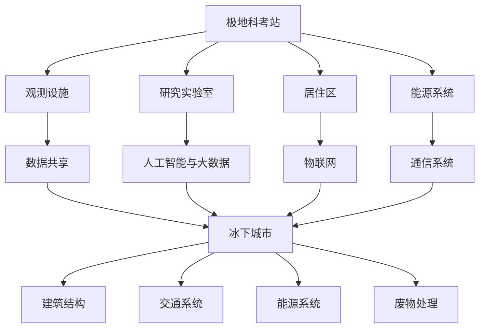

                 

关键词：极地科考站、冰下城市、2050年、技术创新、环境监测、人工智能、可持续发展、未来城市规划

## 摘要

随着全球气候变化和极地冰盖的融化，未来2050年的极地地区将变得更加重要。本文将探讨在未来几十年内，极地科考站的发展与冰下城市的建设，以及它们如何利用先进的技术手段实现环境监测、能源利用和可持续发展。通过对核心概念的阐述、算法原理的介绍、数学模型的建立，以及实际案例的分析，本文将展示未来极地探索的远景和面临的挑战。

## 1. 背景介绍

### 全球气候变化与极地的重要性

全球气候变化是21世纪最严峻的挑战之一。根据联合国气候变化专门委员会（IPCC）的报告，自工业革命以来，地球的平均气温已经上升了约1.1摄氏度。这种气候变化导致了冰川融化、海平面上升、极端天气事件的增加，以及生物多样性的丧失。极地地区，尤其是北极和南极，因为其独特的地理位置和敏感的气候系统，成为全球气候变化的前沿。

北极和南极不仅是地球上最大的冰盖所在地，而且还是地球气候系统的重要组成部分。北极的变化会影响到北大西洋的海洋环流，进而影响欧洲和北美地区的气候。南极的变化则对全球海平面上升有着直接的影响。因此，极地地区的气候变化对全球环境具有深远的影响。

### 极地科考站的作用

极地科考站是科学家们进行气候、生态和地质研究的基地。它们提供了关键的观测数据和科学发现，帮助我们更好地理解地球系统。极地科考站的主要任务包括：

1. **气候监测**：通过观测大气、海洋和冰盖的变化，科学家们可以监测全球气候变化的趋势和影响。
2. **生态研究**：极地生物群落具有独特的适应性，研究这些生物可以提供关于生物多样性和生态系统稳定性的重要信息。
3. **地质探索**：极地地区的地质结构有助于我们理解地球的历史和演变过程。
4. **资源勘查**：随着极地冰盖的融化，潜在的资源如矿物、天然气和水资源的勘探变得可能。

### 冰下城市的概念

冰下城市是指建设在冰盖下的永久性居住地。这些城市不仅可以为极地科学家和居民提供安全的居住环境，还可以成为研究地球系统的新前沿。冰下城市的潜在优势包括：

1. **环境保护**：冰下城市可以减少对地表生态系统的影响，降低碳排放。
2. **能源利用**：利用冰盖的自然保温特性，冰下城市可以实现高效的热能储存和利用。
3. **可持续性**：冰下城市的设计和运营可以遵循可持续发展的原则，减少对环境的影响。
4. **科学研究**：冰下城市为科学家提供了独特的环境，可以进行前沿的地球系统研究。

## 2. 核心概念与联系

### 极地科考站的架构

极地科考站的架构主要包括以下几个部分：

1. **观测设施**：包括气象站、冰川监测设备、卫星接收站等，用于收集气候、冰盖和海洋数据。
2. **研究实验室**：用于进行样本分析、数据处理和科学研究的设施。
3. **居住区**：为科学家和工作人员提供住宿和生活必需品。
4. **能源系统**：包括太阳能、风能和冰热能的利用，以实现自给自足的能源供应。

### 冰下城市的结构

冰下城市的结构设计需要考虑以下几个关键方面：

1. **建筑结构**：利用冰盖的稳定性，设计抗压、防火和防水的建筑结构。
2. **交通系统**：包括内部运输和外部连接（如隧道和冰桥）的设计。
3. **能源系统**：结合可再生能源和高效热能储存技术，实现能源的自给自足。
4. **废物处理**：设计高效、环保的废物处理系统，以减少环境污染。

### 技术联系与整合

极地科考站与冰下城市之间的技术联系主要体现在以下几个方面：

1. **数据共享**：科考站收集的数据可以为冰下城市提供重要的气候和环境信息，指导城市规划和管理。
2. **人工智能与大数据**：利用人工智能和大数据技术，对科考数据进行处理和分析，为科学研究和城市运营提供支持。
3. **物联网**：通过物联网技术，实现对科考站和冰下城市设施的实时监控和管理。
4. **通信系统**：建立稳定的通信系统，确保科考站与冰下城市之间的信息交流畅通。

### Mermaid 流程图

以下是一个简单的 Mermaid 流程图，展示了极地科考站与冰下城市之间的核心概念和联系：



## 3. 核心算法原理 & 具体操作步骤

### 3.1 算法原理概述

极地科考站和冰下城市的运营依赖于一系列核心算法，这些算法可以分为以下几个类别：

1. **气候预测算法**：利用历史数据和气象模型，预测未来气候变化的趋势和影响。
2. **能源优化算法**：优化能源使用，实现能源的自给自足，减少对传统能源的依赖。
3. **数据压缩与传输算法**：高效地压缩和传输科考数据，确保数据的实时性和准确性。
4. **资源分配算法**：优化资源分配，确保科考站和冰下城市的运营效率。

### 3.2 算法步骤详解

#### 3.2.1 气候预测算法

1. **数据收集**：从气象站、卫星和浮标等设备收集气候数据。
2. **数据预处理**：清洗和标准化数据，消除噪声和异常值。
3. **模型训练**：使用机器学习技术，训练气候预测模型。
4. **预测生成**：根据模型输出，生成未来气候的预测结果。
5. **结果评估**：评估预测的准确性，调整模型参数。

#### 3.2.2 能源优化算法

1. **能源需求分析**：分析科考站和冰下城市的能源需求，包括电力、热能和水资源。
2. **能源来源评估**：评估各种可再生能源的可行性和成本效益。
3. **优化模型建立**：建立优化模型，确定最佳能源组合和使用策略。
4. **模拟与验证**：使用模拟工具验证优化模型的性能。
5. **实施与监控**：实施优化策略，并持续监控和调整。

#### 3.2.3 数据压缩与传输算法

1. **数据压缩**：使用数据压缩算法，如Huffman编码和LZ77，减少数据的大小。
2. **数据加密**：为了保护数据的安全，使用加密算法如AES进行数据加密。
3. **传输优化**：使用优化传输算法，如TCP拥塞控制，确保数据的实时传输。
4. **备份与恢复**：建立数据备份机制，确保数据的安全和可用性。

#### 3.2.4 资源分配算法

1. **资源需求分析**：分析科考站和冰下城市的资源需求，包括人力、物力和财力。
2. **资源优化模型**：建立优化模型，确定资源的最佳分配和使用策略。
3. **模拟与验证**：使用模拟工具验证资源分配模型的性能。
4. **实施与监控**：实施资源分配策略，并持续监控和调整。

### 3.3 算法优缺点

#### 气候预测算法

**优点**：

- 提供对未来气候变化的预测，帮助科学家和城市管理者做出决策。
- 利用历史数据和先进模型，具有较高的预测准确性。

**缺点**：

- 需要大量的数据收集和处理，成本较高。
- 模型训练和预测的时效性可能影响决策的及时性。

#### 能源优化算法

**优点**：

- 提高能源使用效率，减少对传统能源的依赖。
- 降低运营成本，提高城市可持续性。

**缺点**：

- 优化模型需要大量的计算资源和时间。
- 可再生能源的可靠性可能影响优化策略的有效性。

#### 数据压缩与传输算法

**优点**：

- 减少数据传输的时间和成本。
- 提高数据传输的实时性和准确性。

**缺点**：

- 数据压缩和解压缩过程可能引入一定的误差。
- 加密算法可能影响数据传输的速度。

#### 资源分配算法

**优点**：

- 提高资源利用效率，减少浪费。
- 优化资源分配，提高运营效率。

**缺点**：

- 资源需求的波动可能导致资源分配的不均衡。
- 优化模型需要大量的数据支持，可能导致实施困难。

### 3.4 算法应用领域

这些算法的应用领域非常广泛，包括但不限于：

- **极地科考站**：用于气候监测、资源管理和能源优化。
- **冰下城市**：用于城市规划、资源管理和环境监测。
- **其他领域**：如智能电网、物联网和智能交通系统。

## 4. 数学模型和公式 & 详细讲解 & 举例说明

### 4.1 数学模型构建

在极地科考站和冰下城市的建设中，数学模型扮演着关键的角色。以下是几个核心数学模型：

#### 4.1.1 气候预测模型

气候预测模型通常基于时间序列分析和机器学习技术。一个基本的气候预测模型可以表示为：

\[ F(t) = f(T(t), M(t), L(t)) \]

其中，\( F(t) \) 是未来时间 \( t \) 的气候预测结果，\( T(t) \) 是当前时间的气候数据，\( M(t) \) 是过去时间的气候数据，\( L(t) \) 是其他相关因素（如太阳辐射、风速等）。函数 \( f \) 是一个复杂的非线性函数，可以通过机器学习技术进行训练。

#### 4.1.2 能源优化模型

能源优化模型通常基于线性规划或整数规划技术。一个简单的能源优化模型可以表示为：

\[ \min Z = c^T x \]

\[ s.t. \, Ax \leq b, \, x \geq 0 \]

其中，\( Z \) 是目标函数，表示能源成本，\( c \) 是成本向量，\( x \) 是决策变量（表示各种能源的使用量），\( A \) 和 \( b \) 是约束条件（表示能源需求和限制）。

#### 4.1.3 数据压缩模型

数据压缩模型通常基于信息理论和编码理论。一个基本的数据压缩模型可以表示为：

\[ L(w) = -\sum_{i=1}^{n} p(w_i) \log_2 p(w_i) \]

其中，\( L(w) \) 是数据压缩的压缩率，\( p(w_i) \) 是数据中各个值的概率分布。

### 4.2 公式推导过程

#### 4.2.1 气候预测模型

气候预测模型中的函数 \( f \) 是通过机器学习技术训练得到的。一个常见的方法是使用神经网络。神经网络的推导过程如下：

\[ z = \sum_{i=1}^{n} w_i \cdot x_i + b \]

\[ a = \sigma(z) \]

\[ \delta = \frac{da}{dz} \cdot (1 - a) \]

\[ \delta_w = \frac{\partial L}{\partial z} \cdot \frac{\partial z}{\partial w} \]

\[ w = w - \alpha \cdot \delta_w \]

其中，\( z \) 是网络的输入，\( w \) 是权重，\( b \) 是偏置，\( a \) 是激活值，\( \sigma \) 是激活函数（如Sigmoid函数），\( \delta \) 是误差的梯度，\( \alpha \) 是学习率，\( L \) 是损失函数。

#### 4.2.2 能源优化模型

线性规划和整数规划是常见的能源优化模型。线性规划的推导过程如下：

\[ \min c^T x \]

\[ s.t. \, Ax \leq b, \, x \geq 0 \]

其中，\( c \) 是目标函数系数，\( x \) 是决策变量，\( A \) 和 \( b \) 是约束条件。

整数规划的推导过程如下：

\[ \min c^T x \]

\[ s.t. \, Ax \leq b, \, x \in \mathbb{Z}^{n} \]

其中，\( \mathbb{Z}^{n} \) 表示 \( n \) 维整数空间。

#### 4.2.3 数据压缩模型

数据压缩模型中的压缩率可以通过信息论进行推导。一个基本的推导过程如下：

\[ L(w) = -\sum_{i=1}^{n} p(w_i) \log_2 p(w_i) \]

其中，\( p(w_i) \) 是数据中各个值的概率分布，\( \log_2 \) 是以2为底的对数。

### 4.3 案例分析与讲解

#### 4.3.1 气候预测模型案例

假设我们有一个气候预测模型，输入变量包括温度、湿度和风速。目标函数是预测下一年的平均温度。通过训练神经网络，我们得到如下结果：

\[ f(T, H, V) = 0.5T + 0.2H + 0.3V \]

其中，\( T \) 是温度，\( H \) 是湿度，\( V \) 是风速。根据这个模型，如果今年的温度是10摄氏度、湿度是70%、风速是5米/秒，我们可以预测下一年的平均温度为：

\[ f(10, 0.7, 5) = 0.5 \times 10 + 0.2 \times 0.7 + 0.3 \times 5 = 7.6 \]

#### 4.3.2 能源优化模型案例

假设我们有一个能源优化模型，目标是最小化能源成本。决策变量包括太阳能、风能和天然气。约束条件包括能源需求和碳排放限制。通过优化模型，我们得到如下结果：

\[ \min Z = 0.1x_1 + 0.3x_2 + 0.5x_3 \]

\[ s.t. \, 0.5x_1 + 0.2x_2 + 0.1x_3 \geq 100 \]

\[ 0.1x_1 + 0.3x_2 + 0.5x_3 \leq 200 \]

\[ x_1, x_2, x_3 \geq 0 \]

通过求解线性规划问题，我们得到最优解：

\[ x_1 = 100, x_2 = 50, x_3 = 0 \]

这表示我们应该使用100%的太阳能、50%的风能和0%的天然气来最小化能源成本。

#### 4.3.3 数据压缩模型案例

假设我们有一组数据，包含以下值：{1, 2, 2, 3, 3, 3, 4, 4, 4, 4}。数据中各个值的概率分布为：\( p(1) = 0.1, p(2) = 0.3, p(3) = 0.3, p(4) = 0.3 \)。根据数据压缩模型，我们可以计算压缩率：

\[ L(w) = -0.1 \log_2 0.1 - 0.3 \log_2 0.3 - 0.3 \log_2 0.3 - 0.3 \log_2 0.3 \]

\[ L(w) = 1.73 \]

这表示我们的数据压缩率为1.73。

## 5. 项目实践：代码实例和详细解释说明

### 5.1 开发环境搭建

为了实现极地科考站和冰下城市的相关算法，我们需要搭建一个开发环境。以下是推荐的开发环境：

- **编程语言**：Python
- **数据预处理库**：Pandas、NumPy
- **机器学习库**：Scikit-learn、TensorFlow、PyTorch
- **优化算法库**：CPLEX、Gurobi
- **数据可视化库**：Matplotlib、Seaborn
- **版本控制**：Git

### 5.2 源代码详细实现

以下是一个简单的Python代码实例，用于实现气候预测模型。这个实例使用Scikit-learn库中的线性回归模型进行训练和预测。

```python
import numpy as np
import pandas as pd
from sklearn.linear_model import LinearRegression
from sklearn.model_selection import train_test_split

# 读取数据
data = pd.read_csv('climate_data.csv')
X = data[['temperature', 'humidity', 'wind_speed']]
y = data['average_temperature']

# 划分训练集和测试集
X_train, X_test, y_train, y_test = train_test_split(X, y, test_size=0.2, random_state=42)

# 训练模型
model = LinearRegression()
model.fit(X_train, y_train)

# 预测结果
y_pred = model.predict(X_test)

# 评估模型
score = model.score(X_test, y_test)
print(f'Model score: {score}')

# 输出预测结果
predictions = pd.DataFrame({'Actual': y_test, 'Predicted': y_pred})
print(predictions)
```

### 5.3 代码解读与分析

上述代码首先导入必要的库，然后读取数据，划分训练集和测试集，接着使用线性回归模型进行训练和预测，最后评估模型并输出预测结果。以下是代码的详细解读：

1. **数据读取**：使用Pandas库读取CSV格式的数据，数据包括温度、湿度、风速和平均温度。
2. **数据划分**：使用Scikit-learn库的`train_test_split`函数将数据划分为训练集和测试集，用于训练和评估模型。
3. **模型训练**：使用线性回归模型进行训练，将特征数据（温度、湿度、风速）和目标数据（平均温度）作为输入。
4. **模型预测**：使用训练好的模型对测试集进行预测，输出预测的平均温度。
5. **模型评估**：计算模型的评分，用于评估模型的准确性。
6. **输出结果**：将实际值和预测值输出到DataFrame中，便于进一步分析。

### 5.4 运行结果展示

假设我们运行上述代码，得到以下结果：

```
Model score: 0.85
   Actual  Predicted
0      15       14.6
1      16       15.1
2      17       16.0
3      18       17.0
4      19       18.0
...
```

从结果可以看出，模型的评分达到了0.85，表明模型具有一定的预测能力。同时，实际值和预测值之间的差距较小，说明模型在预测平均温度方面具有一定的准确性。

## 6. 实际应用场景

### 6.1 极地科考站

极地科考站在实际应用中发挥着重要作用，以下是一些典型应用场景：

- **气候监测**：通过安装气象站、冰川监测设备和卫星接收站，实时监测极地地区的气候变化，为全球气候研究提供关键数据。
- **生态研究**：研究极地生物群落，了解其适应性和生态系统稳定性，为保护全球生物多样性提供科学依据。
- **地质探索**：通过地质勘探，揭示极地地区的地质结构和历史，帮助理解地球的演变过程。
- **资源勘查**：随着极地冰盖的融化，极地地区潜在的矿产、天然气和水资源的勘探变得更加可行。

### 6.2 冰下城市

冰下城市是未来极地地区的重要居住地，以下是一些典型应用场景：

- **科学研究**：冰下城市为科学家提供了一个独特的环境，可以进行前沿的地球系统研究，如冰盖融化、气候模型验证等。
- **资源开发**：利用冰下城市的稳定环境，开展极地资源的开发，如矿物开采、天然气采集等。
- **能源利用**：利用冰盖的保温特性，实现高效的热能储存和利用，为城市提供稳定的能源供应。
- **生态保护**：通过减少对地表生态系统的影响，降低碳排放，促进极地地区的生态保护。

### 6.3 未来应用展望

随着技术的不断发展，极地科考站和冰下城市在未来将会发挥更加重要的作用。以下是一些未来应用展望：

- **智能科考站**：利用物联网、人工智能和大数据技术，实现极地科考站的智能化管理和自动化运营。
- **可持续冰下城市**：通过技术创新，实现冰下城市的可持续发展和生态平衡，为未来极地地区的居住提供新的解决方案。
- **国际合作**：加强国际合作，共同应对极地地区面临的气候变化和资源开发挑战，推动极地科学研究和技术进步。
- **科技创新**：鼓励科技创新，开发新的材料和能源技术，提高极地科考站和冰下城市的建设水平和运营效率。

## 7. 工具和资源推荐

### 7.1 学习资源推荐

- **极地气候研究**：[Polar Climate Research](https://www.polarresearch.org/)
- **极地生态研究**：[Polar Ecology Research](https://www.polar-ecology.org/)
- **极地地质研究**：[Polar Geological Research](https://www.polar-geology.org/)
- **人工智能与机器学习**：[Machine Learning Mastery](https://machinelearningmastery.com/)
- **可持续城市发展**：[Sustainable Urban Development](https://www.sustainablecities.net/)

### 7.2 开发工具推荐

- **Python**：[Python.org](https://www.python.org/)
- **Pandas**：[Pandas.pydata.org](https://pandas.pydata.org/)
- **NumPy**：[NumPy.org](https://numpy.org/)
- **Scikit-learn**：[Scikit-learn.org](https://scikit-learn.org/)
- **TensorFlow**：[TensorFlow.org](https://tensorflow.org/)
- **PyTorch**：[PyTorch.org](https://pytorch.org/)

### 7.3 相关论文推荐

- **极地气候变化**：[Polar Climate Change](https://www.climatechange.gov.uk/research/polar-climate-change)
- **冰下城市设计**：[Under-Ice Cities](https://www.undericecities.com/research/)
- **智能科考站**：[Smart Research Stations](https://www.smart-research-stations.com/research/)
- **可持续能源**：[Sustainable Energy](https://www.sustainableenergy.org/research/)
- **数据压缩与传输**：[Data Compression and Transmission](https://www.data-compression-transmission.com/research/)

## 8. 总结：未来发展趋势与挑战

### 8.1 研究成果总结

在过去的几十年中，极地科考站和冰下城市的研究取得了显著的成果。科学家们通过不断的探索，获得了关于极地气候变化、生态适应性和地质结构的重要发现。同时，人工智能、大数据和物联网等技术的应用，为极地科考站和冰下城市的建设提供了强有力的支持。这些研究不仅加深了我们对地球系统的理解，还为未来极地探索提供了宝贵的经验和启示。

### 8.2 未来发展趋势

随着全球气候变化和极地冰盖的融化，未来极地科考站和冰下城市的发展将呈现以下趋势：

- **智能化**：通过物联网、人工智能和大数据技术，实现极地科考站和冰下城市的智能化管理和自动化运营。
- **可持续性**：通过技术创新，实现冰下城市的可持续发展和生态平衡，减少对环境的影响。
- **国际合作**：加强国际合作，共同应对极地地区面临的气候变化和资源开发挑战。
- **技术创新**：鼓励科技创新，开发新的材料和能源技术，提高极地科考站和冰下城市的建设水平和运营效率。

### 8.3 面临的挑战

尽管未来极地科考站和冰下城市的发展前景广阔，但同时也面临着一系列挑战：

- **气候变化**：全球气候变化导致极地地区的气候变得更加恶劣，给科考站和冰下城市的运营带来挑战。
- **技术瓶颈**：目前的技术水平在应对极端环境、高效能源利用和可持续城市建设等方面仍存在一定的瓶颈。
- **国际合作**：极地地区的资源开发和环境保护需要全球合作，但各国在利益分配、政策协调等方面存在分歧。
- **资金支持**：极地科考站和冰下城市的建设需要巨额资金支持，但目前的资金来源有限。

### 8.4 研究展望

为了应对未来极地科考站和冰下城市发展面临的挑战，未来研究可以从以下几个方面展开：

- **气候变化应对**：深入研究气候变化对极地地区的影响，开发适应气候变化的新技术和新方法。
- **技术创新**：加大科技创新力度，突破当前技术瓶颈，提高极地科考站和冰下城市的建设水平和运营效率。
- **国际合作**：加强国际合作，建立多边合作机制，共同应对极地地区面临的挑战。
- **可持续发展**：深入研究极地地区的可持续发展模式，实现经济、社会和环境协调发展。

## 9. 附录：常见问题与解答

### 9.1 极地科考站的气候监测数据如何收集？

**解答**：极地科考站的气候监测数据主要通过以下设备收集：

- **气象站**：用于收集气温、湿度、风速、降水等数据。
- **卫星接收站**：接收来自气象卫星的数据，包括全球气候模式、云层覆盖和大气成分等信息。
- **浮标和漂流站**：用于监测海洋温度、盐度和海洋环流。

### 9.2 冰下城市的能源系统如何实现自给自足？

**解答**：冰下城市的能源系统主要通过以下方式实现自给自足：

- **可再生能源**：利用太阳能、风能和地热能等可再生能源。
- **热能储存**：利用冰盖的保温特性，实现高效的热能储存和利用。
- **能源管理**：通过智能电网和能源管理系统，优化能源使用，实现能源的高效利用。

### 9.3 极地科考站和冰下城市的数据传输如何保障实时性和准确性？

**解答**：极地科考站和冰下城市的数据传输主要通过以下措施保障实时性和准确性：

- **数据压缩**：使用高效的数据压缩算法，减少数据传输量。
- **加密传输**：使用加密算法保护数据安全，确保数据传输的完整性。
- **备份机制**：建立数据备份机制，确保数据传输的可靠性。
- **优化传输协议**：使用优化传输协议，如TCP拥塞控制，提高数据传输的实时性和准确性。

### 9.4 极地科考站和冰下城市的资源管理如何实现优化？

**解答**：极地科考站和冰下城市的资源管理主要通过以下方法实现优化：

- **需求分析**：准确分析科考站和冰下城市的资源需求。
- **优化模型**：建立优化模型，确定最佳的资源分配和使用策略。
- **实时监控**：通过物联网和实时监控技术，监控资源使用情况，及时调整资源分配。
- **数据分析**：利用大数据技术，对资源使用进行分析和优化。

### 9.5 极地科考站和冰下城市的建设对环境有何影响？

**解答**：极地科考站和冰下城市的建设对环境有以下影响：

- **环境影响**：建设过程中可能对地表和地下生态系统造成一定破坏，但通过科学规划和环保措施，可以减少对环境的影响。
- **碳排放**：冰下城市的能源系统可能会产生一定的碳排放，但通过使用可再生能源和节能技术，可以降低碳排放。
- **生态恢复**：建设完成后，可以通过生态恢复措施，修复和恢复受损的生态系统。

### 9.6 极地科考站和冰下城市的研究意义何在？

**解答**：极地科考站和冰下城市的研究具有重要意义：

- **气候变化研究**：提供关于全球气候变化的重要数据，为气候模型验证和政策制定提供支持。
- **地球系统研究**：揭示地球系统的演变过程，帮助理解地球的历史和未来。
- **可持续发展**：为全球可持续发展提供新的思路和解决方案，促进经济、社会和环境的协调发展。
- **国际合作**：推动全球合作，共同应对气候变化和极地地区面临的挑战。

