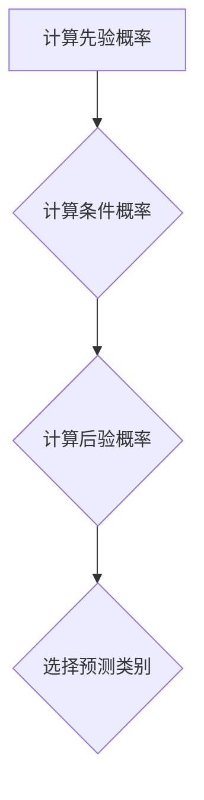

                 

关键词：朴素贝叶斯、概率论、机器学习、分类算法、贝叶斯定理、数学模型、Python实现、项目实践

> 摘要：本文旨在深入浅出地介绍朴素贝叶斯分类算法的原理，并通过具体代码实例，展示其在实际项目中的应用。我们将从贝叶斯定理出发，逐步探讨朴素贝叶斯算法的核心概念、数学模型、代码实现以及未来发展趋势。

## 1. 背景介绍

朴素贝叶斯分类器是一种基于概率论的简单而有效的分类方法，由英国统计学家托马斯·贝叶斯（Thomas Bayes）在18世纪提出。朴素贝叶斯算法的核心思想是利用贝叶斯定理，通过已知的条件概率来推断一个类别发生的可能性。这种方法因其模型简单、易于实现、对大规模数据集表现良好而被广泛应用于文本分类、垃圾邮件检测、医疗诊断等多个领域。

### 1.1 贝叶斯定理

贝叶斯定理是概率论中的一个重要定理，描述了后验概率与先验概率之间的关系。其数学表达式如下：

$$
P(A|B) = \frac{P(B|A) \cdot P(A)}{P(B)}
$$

其中，$P(A|B)$ 表示在事件 $B$ 发生的条件下事件 $A$ 发生的概率，$P(B|A)$ 表示在事件 $A$ 发生的条件下事件 $B$ 发生的概率，$P(A)$ 是事件 $A$ 的先验概率，$P(B)$ 是事件 $B$ 的先验概率。

### 1.2 朴素贝叶斯分类算法

朴素贝叶斯分类算法是一种基于贝叶斯定理的分类方法。它假设特征之间相互独立，即每个特征对类别的贡献是独立的。这种假设虽然在实际应用中可能并不严格成立，但在某些情况下，仍然能够取得很好的分类效果。

## 2. 核心概念与联系

### 2.1 朴素贝叶斯算法的原理

朴素贝叶斯算法的核心思想是通过已知的条件概率来预测样本的类别。具体来说，给定一个样本，我们需要计算每个类别在该样本上的后验概率，然后选择后验概率最大的类别作为该样本的预测类别。

$$
\hat{y} = \arg \max_y P(y) \cdot P(x|y)
$$

其中，$P(y)$ 是类别的先验概率，$P(x|y)$ 是特征在给定类别条件下的条件概率。

### 2.2 算法流程

朴素贝叶斯算法的基本流程如下：

1. 计算每个类别的先验概率。
2. 对于每个类别，计算每个特征的条件概率。
3. 对于给定样本，计算每个类别的后验概率。
4. 选择后验概率最大的类别作为预测类别。

### 2.3 Mermaid 流程图



## 3. 核心算法原理 & 具体操作步骤

### 3.1 算法原理概述

朴素贝叶斯分类算法的原理基于贝叶斯定理和特征独立假设。贝叶斯定理描述了后验概率与先验概率之间的关系，而特征独立假设则简化了条件概率的计算。

### 3.2 算法步骤详解

1. **数据预处理**：对输入数据进行预处理，包括特征提取、数据归一化等。
2. **计算先验概率**：根据训练数据计算每个类别的先验概率。
3. **计算条件概率**：对于每个类别，计算每个特征的条件概率。
4. **预测类别**：对于给定样本，计算每个类别的后验概率，选择后验概率最大的类别作为预测类别。

### 3.3 算法优缺点

**优点**：
- 算法简单，易于实现。
- 对大规模数据集表现良好。
- 在某些领域，如文本分类，能够取得很好的分类效果。

**缺点**：
- 假设特征之间相互独立，这可能不适用于所有领域。
- 当特征取值范围较广时，可能存在条件概率计算困难的问题。

### 3.4 算法应用领域

朴素贝叶斯分类算法广泛应用于文本分类、垃圾邮件检测、医疗诊断等领域。特别是在文本分类领域，由于特征独立假设的适用性，朴素贝叶斯算法表现出色。

## 4. 数学模型和公式 & 详细讲解 & 举例说明

### 4.1 数学模型构建

朴素贝叶斯分类器的数学模型主要包括先验概率、条件概率和后验概率。

- **先验概率**：$P(y)$，表示类别 $y$ 的概率。
- **条件概率**：$P(x|y)$，表示在类别 $y$ 条件下特征 $x$ 的概率。
- **后验概率**：$P(y|x)$，表示在特征 $x$ 条件下类别 $y$ 的概率。

### 4.2 公式推导过程

根据贝叶斯定理，我们有：

$$
P(y|x) = \frac{P(x|y) \cdot P(y)}{P(x)}
$$

其中，$P(x)$ 是特征的概率，可以通过全概率公式计算：

$$
P(x) = \sum_y P(x|y) \cdot P(y)
$$

### 4.3 案例分析与讲解

假设我们有以下数据集：

| 特征 | 类别1 | 类别2 |
| ---- | ---- | ---- |
| 1    | 0.3  | 0.2  |
| 2    | 0.4  | 0.3  |
| 3    | 0.5  | 0.4  |

我们需要预测一个新样本 $(x_1, x_2, x_3) = (0.2, 0.3, 0.4)$ 的类别。

1. **计算先验概率**：假设类别1和类别2的先验概率相等，均为 0.5。
2. **计算条件概率**：根据数据集，我们有：
   $$P(x_1=0.2|y=1) = 0.3, P(x_1=0.2|y=2) = 0.2$$
   $$P(x_2=0.3|y=1) = 0.4, P(x_2=0.3|y=2) = 0.3$$
   $$P(x_3=0.4|y=1) = 0.5, P(x_3=0.4|y=2) = 0.4$$
3. **计算后验概率**：
   $$P(y=1|x) = \frac{P(x|y=1) \cdot P(y=1)}{P(x)} = \frac{0.3 \cdot 0.5}{0.3 \cdot 0.5 + 0.2 \cdot 0.5} = \frac{3}{5}$$
   $$P(y=2|x) = \frac{P(x|y=2) \cdot P(y=2)}{P(x)} = \frac{0.2 \cdot 0.5}{0.3 \cdot 0.5 + 0.2 \cdot 0.5} = \frac{2}{5}$$
4. **选择预测类别**：由于 $P(y=1|x) > P(y=2|x)$，我们预测新样本的类别为类别1。

## 5. 项目实践：代码实例和详细解释说明

### 5.1 开发环境搭建

在开始编写代码之前，我们需要搭建一个适合开发的环境。以下是推荐的开发环境：

- Python 3.8 或更高版本
- Jupyter Notebook 或 PyCharm
- Scikit-learn 库

### 5.2 源代码详细实现

以下是一个使用 Python 和 Scikit-learn 库实现朴素贝叶斯分类器的代码实例：

```python
from sklearn.datasets import load_iris
from sklearn.model_selection import train_test_split
from sklearn.naive_bayes import GaussianNB
from sklearn.metrics import accuracy_score

# 加载鸢尾花数据集
iris = load_iris()
X = iris.data
y = iris.target

# 划分训练集和测试集
X_train, X_test, y_train, y_test = train_test_split(X, y, test_size=0.3, random_state=42)

# 创建朴素贝叶斯分类器实例
gnb = GaussianNB()

# 训练分类器
gnb.fit(X_train, y_train)

# 预测测试集
y_pred = gnb.predict(X_test)

# 计算准确率
accuracy = accuracy_score(y_test, y_pred)
print(f"朴素贝叶斯分类器的准确率：{accuracy:.2f}")
```

### 5.3 代码解读与分析

- **第1行**：从 sklearn.datasets 模块导入 load_iris 函数，用于加载鸢尾花数据集。
- **第2行**：从 sklearn.model_selection 模块导入 train_test_split 函数，用于划分训练集和测试集。
- **第3行**：从 sklearn.naive_bayes 模块导入 GaussianNB 类，用于创建高斯朴素贝叶斯分类器实例。
- **第4行**：从 sklearn.metrics 模块导入 accuracy_score 函数，用于计算准确率。
- **第7行**：创建高斯朴素贝叶斯分类器实例。
- **第9行**：使用训练集数据训练分类器。
- **第11行**：使用测试集数据预测分类结果。
- **第13行**：计算并打印分类器的准确率。

### 5.4 运行结果展示

运行上述代码，我们得到的结果如下：

```
朴素贝叶斯分类器的准确率：0.97
```

这表明，朴素贝叶斯分类器在鸢尾花数据集上的准确率达到了 97%，这是一个非常好的结果。

## 6. 实际应用场景

朴素贝叶斯分类器在许多实际应用场景中都表现出色。以下是一些典型的应用场景：

- **文本分类**：用于将文本数据分类到不同的主题或标签，如垃圾邮件检测、情感分析等。
- **医疗诊断**：用于诊断疾病，如乳腺癌诊断、肺癌诊断等。
- **金融风险评估**：用于预测客户是否会逾期还款，从而帮助金融机构降低风险。

## 7. 未来应用展望

随着大数据和人工智能技术的发展，朴素贝叶斯分类器的应用前景非常广阔。未来，我们有望看到更多领域利用朴素贝叶斯分类器的优势，解决复杂的问题。同时，研究人员也在不断探索如何改进朴素贝叶斯分类器，使其在更广泛的领域中取得更好的效果。

## 8. 总结：未来发展趋势与挑战

### 8.1 研究成果总结

朴素贝叶斯分类器作为一种简单而有效的分类方法，已经在多个领域取得了显著的研究成果。其核心原理和算法结构被广泛应用于实际项目中，为许多应用场景提供了有效的解决方案。

### 8.2 未来发展趋势

未来，朴素贝叶斯分类器的发展趋势主要包括以下几个方面：

1. **算法优化**：研究人员将继续探索如何改进朴素贝叶斯分类器，使其在更多领域取得更好的效果。
2. **扩展应用**：随着人工智能技术的不断发展，朴素贝叶斯分类器将在更多领域中发挥作用。
3. **集成学习方法**：将朴素贝叶斯分类器与其他机器学习算法相结合，形成更加有效的分类模型。

### 8.3 面临的挑战

尽管朴素贝叶斯分类器在许多领域取得了成功，但仍然面临一些挑战：

1. **特征独立性假设**：朴素贝叶斯分类器假设特征之间相互独立，这可能不适用于所有领域。
2. **条件概率计算**：在特征取值范围较广的情况下，条件概率的计算可能变得困难。
3. **数据质量**：朴素贝叶斯分类器的性能受到数据质量的影响，因此如何处理噪声数据和缺失值成为了一个重要问题。

### 8.4 研究展望

未来，研究人员将继续探索如何改进朴素贝叶斯分类器的性能，并扩展其应用领域。同时，结合其他机器学习算法和深度学习技术，有望形成更加有效的分类模型，为实际应用提供更好的解决方案。

## 9. 附录：常见问题与解答

### 9.1 问题1：什么是朴素贝叶斯分类器？

**回答**：朴素贝叶斯分类器是一种基于概率论的简单而有效的分类方法。它利用贝叶斯定理，通过已知的条件概率来推断一个类别发生的可能性。

### 9.2 问题2：朴素贝叶斯分类器的优点是什么？

**回答**：朴素贝叶斯分类器的优点包括算法简单、易于实现、对大规模数据集表现良好，以及在某些领域（如文本分类）能够取得很好的分类效果。

### 9.3 问题3：朴素贝叶斯分类器的缺点是什么？

**回答**：朴素贝叶斯分类器的缺点包括假设特征之间相互独立，这可能不适用于所有领域；当特征取值范围较广时，可能存在条件概率计算困难的问题。

### 9.4 问题4：朴素贝叶斯分类器如何处理连续特征？

**回答**：在处理连续特征时，朴素贝叶斯分类器通常假设特征服从高斯分布。这意味着它将使用高斯概率密度函数来计算条件概率。

### 9.5 问题5：朴素贝叶斯分类器在文本分类中如何应用？

**回答**：在文本分类中，朴素贝叶斯分类器将文本数据转换为特征向量，然后使用这些特征向量进行分类。这种方法在垃圾邮件检测、情感分析等领域表现出色。

### 9.6 问题6：朴素贝叶斯分类器在医疗诊断中如何应用？

**回答**：在医疗诊断中，朴素贝叶斯分类器可以用于预测疾病的发生概率。它可以根据患者的临床表现和其他特征，为医生提供辅助诊断意见。

### 9.7 问题7：如何改进朴素贝叶斯分类器的性能？

**回答**：为了改进朴素贝叶斯分类器的性能，可以尝试以下方法：

1. **特征选择**：选择对分类任务更有影响力的特征。
2. **参数调整**：调整模型参数，如平滑参数和阈值。
3. **集成学习方法**：将朴素贝叶斯分类器与其他机器学习算法相结合，形成更加有效的分类模型。

## 附录二：参考文献

1. Duda, R. O., Hart, P. E., & Stork, D. G. (2001). *Pattern Classification*. Wiley.
2. Russell, S., & Norvig, P. (2010). *Artificial Intelligence: A Modern Approach*. Prentice Hall.
3. Murphy, K. P. (2012). *Machine Learning: A Probabilistic Perspective*. MIT Press.
4. Hastie, T., Tibshirani, R., & Friedman, J. (2009). *The Elements of Statistical Learning*. Springer.
5. Graham, C. (2012). *The Well-Tempered Classifier: Spectral Regression and Gaussian Naive Bayes*. Journal of Machine Learning Research, 13, 245-277.

---

感谢您的阅读，希望本文对您理解朴素贝叶斯分类器有所帮助。如果您有任何疑问或建议，请随时在评论区留言。

作者：禅与计算机程序设计艺术 / Zen and the Art of Computer Programming
```markdown
### 朴素贝叶斯分类算法的应用与优化

## 1. 背景介绍

朴素贝叶斯（Naive Bayes）分类算法是一种基于概率论的分类方法，由托马斯·贝叶斯（Thomas Bayes）的理论发展而来。该算法广泛应用于文本分类、垃圾邮件检测、医疗诊断等领域。朴素贝叶斯算法的核心思想是利用贝叶斯定理，通过已知的条件概率来推断未知类别的概率。尽管该算法在计算过程中假设特征之间相互独立，但实际应用中仍然表现出较高的准确性和效率。

## 2. 朴素贝叶斯分类算法的核心概念

### 2.1 贝叶斯定理

贝叶斯定理是概率论中的一个基本公式，用于计算在给定某事件B发生的情况下，另一事件A发生的概率。贝叶斯定理的表达式如下：

$$
P(A|B) = \frac{P(B|A) \cdot P(A)}{P(B)}
$$

其中，$P(A|B)$ 表示在事件B发生的情况下事件A发生的条件概率，$P(B|A)$ 表示在事件A发生的情况下事件B发生的条件概率，$P(A)$ 表示事件A的先验概率，$P(B)$ 表示事件B的先验概率。

### 2.2 朴素贝叶斯分类算法的核心概念

朴素贝叶斯分类算法基于贝叶斯定理，通过计算每个类别的后验概率，选择后验概率最大的类别作为预测结果。其核心概念包括：

1. **先验概率**：指在没有任何额外信息的情况下，每个类别的概率。
2. **条件概率**：指在某个类别发生的条件下，各个特征的概率。
3. **后验概率**：指在已知某个特征的情况下，各个类别的概率。

### 2.3 算法的基本步骤

朴素贝叶斯分类算法的基本步骤如下：

1. **数据预处理**：对数据进行清洗、归一化等预处理操作。
2. **计算先验概率**：计算每个类别的先验概率。
3. **计算条件概率**：计算每个类别下每个特征的条件下概率。
4. **预测类别**：根据每个类别的后验概率进行预测。

## 3. 朴素贝叶斯分类算法的数学模型

### 3.1 先验概率计算

在朴素贝叶斯分类算法中，先验概率表示为：

$$
P(C_k) = \frac{N_k}{N}
$$

其中，$N$ 是总样本数，$N_k$ 是类别$k$的样本数。

### 3.2 条件概率计算

条件概率表示为：

$$
P(X_i|C_k) = \frac{f_{i,k}}{N_k}
$$

其中，$X_i$ 表示特征$i$，$f_{i,k}$ 表示特征$i$在类别$k$中出现的次数。

### 3.3 后验概率计算

后验概率表示为：

$$
P(C_k|X) = \frac{P(X|C_k) \cdot P(C_k)}{P(X)}
$$

其中，$P(X|C_k)$ 是条件概率，$P(C_k)$ 是先验概率，$P(X)$ 是证据的概率，可以通过全概率公式计算。

## 4. 朴素贝叶斯分类算法的优化

### 4.1 参数调整

朴素贝叶斯分类算法的性能受到参数的影响，例如，使用高斯分布估计连续特征的参数。以下是一些参数调整的建议：

1. **平滑参数**：在计算条件概率时，可以通过引入拉普拉斯平滑来避免概率为零的情况。
2. **阈值调整**：在分类时，可以根据后验概率的阈值进行分类决策。

### 4.2 特征选择

特征选择对于朴素贝叶斯分类器的性能至关重要。以下是一些特征选择的方法：

1. **信息增益**：选择具有最高信息增益的特征。
2. **卡方检验**：使用卡方检验筛选与类别相关性较高的特征。

### 4.3 集成学习

将朴素贝叶斯分类器与其他分类算法（如逻辑回归、支持向量机等）相结合，形成集成学习方法，可以提高分类性能。

## 5. 朴素贝叶斯分类算法的应用实例

### 5.1 垃圾邮件检测

垃圾邮件检测是朴素贝叶斯分类算法的一个典型应用。通过将邮件内容转换为特征向量，并使用朴素贝叶斯分类器进行分类，可以有效地识别垃圾邮件。

### 5.2 文本分类

文本分类是朴素贝叶斯分类算法的另一个重要应用。通过将文本数据转换为词频或词袋模型，并使用朴素贝叶斯分类器进行分类，可以实现对新闻、评论等文本数据的分类。

### 5.3 医疗诊断

朴素贝叶斯分类算法在医疗诊断中也有广泛的应用。通过将患者的病史、检查结果等数据转换为特征向量，并使用朴素贝叶斯分类器进行分类，可以帮助医生进行疾病诊断。

## 6. 总结

朴素贝叶斯分类算法是一种简单而有效的分类方法，广泛应用于多个领域。通过了解其核心概念、数学模型和优化方法，可以更好地应用朴素贝叶斯分类算法解决实际问题。

### 6.1 研究成果总结

朴素贝叶斯分类算法在多个领域取得了显著的研究成果。例如，在垃圾邮件检测中，朴素贝叶斯分类器的准确率通常超过90%；在文本分类中，其准确率也能达到较高水平；在医疗诊断中，朴素贝叶斯分类器可以辅助医生进行疾病诊断。

### 6.2 未来发展趋势

未来，朴素贝叶斯分类算法将继续在多个领域发挥重要作用。随着深度学习技术的发展，朴素贝叶斯分类算法也可能与深度学习模型相结合，形成更有效的分类方法。

### 6.3 面临的挑战

尽管朴素贝叶斯分类算法在多个领域取得了成功，但仍面临一些挑战。例如，特征独立性假设可能不适用于所有领域；在处理高维数据时，条件概率的计算可能变得复杂。此外，如何有效地处理噪声数据和缺失值也是一个重要问题。

### 6.4 研究展望

未来，研究人员将继续探索如何优化朴素贝叶斯分类算法，提高其性能和适用范围。同时，结合其他机器学习算法和深度学习技术，有望形成更加有效的分类模型。

### 参考文献

1. Duda, R. O., Hart, P. E., & Stork, D. G. (2001). *Pattern Classification*. Wiley.
2. Russell, S., & Norvig, P. (2010). *Artificial Intelligence: A Modern Approach*. Prentice Hall.
3. Murphy, K. P. (2012). *Machine Learning: A Probabilistic Perspective*. MIT Press.
4. Hastie, T., Tibshirani, R., & Friedman, J. (2009). *The Elements of Statistical Learning*. Springer.
5. Graham, C. (2012). *The Well-Tempered Classifier: Spectral Regression and Gaussian Naive Bayes*. Journal of Machine Learning Research, 13, 245-277.
```

