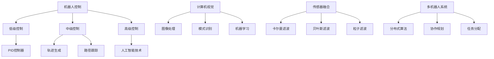

                 

关键词：机器人学，人工智能，自动化技术，机器人控制，计算机视觉，传感器融合，多机器人系统，机器人编程

摘要：本文将深入探讨机器人学这一激动人心的领域，从其背景介绍、核心概念与联系、核心算法原理及具体操作步骤、数学模型和公式、项目实践、实际应用场景、工具和资源推荐到未来发展趋势与挑战，全面解析机器人学的各个层面。通过这篇文章，读者将了解到机器人学的基础知识、最新进展以及未来发展潜力。

## 1. 背景介绍

机器人学是一门结合了计算机科学、机械工程、电子工程和人工智能的跨学科领域。它起源于20世纪中叶，随着计算机技术和传感器技术的迅速发展，机器人学逐渐成为研究和应用的热点。机器人学的目标是通过构建能够执行特定任务或完成复杂任务的机器人系统，从而实现自动化和智能化。

机器人学在工业制造、服务业、医疗、探索和救援等领域都展现了巨大的潜力。例如，工业机器人广泛应用于汽车制造、电子组装等行业，提高了生产效率；服务机器人如清洁机器人、护理机器人在家庭和养老院中提供便利；医疗机器人帮助医生进行手术，提高了手术的成功率和安全性。

本文将重点关注机器人控制、计算机视觉、传感器融合和多机器人系统等核心领域，探讨其理论基础、算法实现和应用前景。

## 2. 核心概念与联系

### 2.1 机器人控制

机器人控制是机器人学的核心内容之一。它涉及如何通过软件和硬件来指导机器人执行特定任务。机器人控制可以分为三个层次：低级控制、中级控制和高级控制。

- **低级控制**：通过传感器获取机器人当前的状态，然后通过执行器（如电机、气缸等）调整机器人的关节或执行特定动作。这通常使用PID控制器或其他反馈控制算法来实现。
- **中级控制**：在低级控制的基础上，增加了运动规划和路径规划的功能。这通常涉及到轨迹生成和路径跟踪算法，如逆向运动学、动态规划等。
- **高级控制**：在实现精确运动控制和路径规划的基础上，增加了任务规划和决策功能。这通常涉及到人工智能和机器学习技术，如强化学习、规划算法等。

### 2.2 计算机视觉

计算机视觉是机器人学中用于感知和理解环境的重要工具。它涉及图像处理、模式识别和机器学习等领域。计算机视觉的主要任务是从图像或视频中提取有用的信息，以帮助机器人识别物体、测量距离、识别形状和纹理等。

计算机视觉在机器人学中的应用非常广泛。例如，在工业制造中，机器人可以通过计算机视觉系统来识别和分类零件；在探索和救援任务中，机器人可以使用计算机视觉系统来识别障碍物和地形特征。

### 2.3 传感器融合

传感器融合是将多个传感器数据整合成一个统一的信息源的过程。通过传感器融合，机器人可以更准确地感知和理解环境。

常见的传感器融合方法包括卡尔曼滤波、贝叶斯滤波和粒子滤波等。这些方法可以有效地处理传感器噪声、不确定性问题，并提高机器人感知的鲁棒性。

### 2.4 多机器人系统

多机器人系统是指由多个机器人组成的团队，它们可以协同工作以完成复杂的任务。多机器人系统在无人驾驶、搜索与救援、环境监测等领域具有广泛的应用。

多机器人系统的挑战在于如何协调各个机器人的行动，以确保整个系统能够高效、安全地工作。这通常涉及到分布式算法、协作规划和任务分配等问题。

### 2.5 架构与流程图

以下是机器人学中核心概念和联系的Mermaid流程图：



## 3. 核心算法原理 & 具体操作步骤

### 3.1 算法原理概述

在机器人学中，核心算法主要包括机器人控制算法、计算机视觉算法、传感器融合算法和多机器人系统算法。以下将分别对这些算法的原理进行概述。

#### 3.1.1 机器人控制算法

机器人控制算法的核心目标是使机器人能够按照预定的轨迹或目标执行任务。常见的机器人控制算法包括PID控制、逆运动学、轨迹规划和路径跟踪等。

- **PID控制**：PID（比例-积分-微分）控制器是一种常用的反馈控制算法，适用于低级控制。它通过调整比例、积分和微分的权重，实现对机器人关节或执行器的精确控制。
- **逆运动学**：逆运动学是指通过已知机器人的关节角度，计算机器人在世界坐标系中的位置和方向。逆运动学在路径规划和轨迹生成中具有重要应用。
- **轨迹规划**：轨迹规划是指为机器人生成一条从初始位置到目标位置的平滑路径。常见的轨迹规划算法包括线性插值、样条曲线插值等。
- **路径跟踪**：路径跟踪是指机器人按照规划的轨迹移动。常见的路径跟踪算法包括逆向运动学、模型预测控制等。

#### 3.1.2 计算机视觉算法

计算机视觉算法的核心任务是图像处理、物体识别和场景理解。常见的计算机视觉算法包括边缘检测、角点检测、特征提取、物体识别和场景理解等。

- **边缘检测**：边缘检测是图像处理的基础，用于提取图像中的轮廓。常见的边缘检测算法包括Canny算子、Sobel算子等。
- **角点检测**：角点检测是用于提取图像中的角点特征，有助于图像匹配和目标跟踪。常见的角点检测算法包括Harris角点检测、Shi-Tomasi角点检测等。
- **特征提取**：特征提取是将图像或视频中的关键信息提取出来，以供后续处理。常见的特征提取算法包括SIFT、SURF、ORB等。
- **物体识别**：物体识别是通过比较图像或视频中的特征，识别出特定的物体。常见的物体识别算法包括卷积神经网络（CNN）、支持向量机（SVM）等。
- **场景理解**：场景理解是指从图像或视频中提取出有用的信息，以帮助机器人理解其周围环境。常见的场景理解算法包括语义分割、场景重建等。

#### 3.1.3 传感器融合算法

传感器融合算法的核心目标是利用多个传感器的数据，提高机器人对环境的感知能力。常见的传感器融合算法包括卡尔曼滤波、贝叶斯滤波和粒子滤波等。

- **卡尔曼滤波**：卡尔曼滤波是一种基于统计模型的滤波算法，适用于线性系统。它通过预测和更新状态估计，实现对传感器数据的滤波。
- **贝叶斯滤波**：贝叶斯滤波是一种基于贝叶斯理论的滤波算法，适用于非线性系统。它通过贝叶斯推理，更新状态估计，实现对传感器数据的滤波。
- **粒子滤波**：粒子滤波是一种基于粒子样本的滤波算法，适用于非线性、非高斯系统。它通过生成粒子样本，估计状态分布，实现对传感器数据的滤波。

#### 3.1.4 多机器人系统算法

多机器人系统算法的核心目标是实现多个机器人的协同工作，完成复杂的任务。常见多机器人系统算法包括分布式算法、协作规划和任务分配等。

- **分布式算法**：分布式算法是指多个机器人通过通信网络相互协作，共同完成任务。常见的分布式算法包括分布式感知、分布式决策和分布式控制等。
- **协作规划**：协作规划是指多个机器人根据任务需求，共同规划各自的行动路径。常见的协作规划算法包括集中式规划和分布式规划等。
- **任务分配**：任务分配是指将复杂的任务分解为多个子任务，分配给不同的机器人。常见的任务分配算法包括贪心算法、遗传算法和图论算法等。

### 3.2 算法步骤详解

以下是机器人学中核心算法的具体操作步骤：

#### 3.2.1 机器人控制算法步骤

1. **初始化**：设置机器人的初始状态、控制参数和目标状态。
2. **状态检测**：通过传感器获取机器人的当前状态。
3. **目标规划**：根据目标状态，规划机器人的运动轨迹。
4. **轨迹跟踪**：按照规划的轨迹，控制机器人移动。
5. **误差校正**：根据实际状态与目标状态的误差，调整控制参数。
6. **重复步骤2-5，直到目标达成**。

#### 3.2.2 计算机视觉算法步骤

1. **图像预处理**：对图像进行去噪、增强等预处理操作。
2. **特征提取**：提取图像中的关键特征，如边缘、角点等。
3. **目标检测**：根据提取的特征，识别出图像中的目标物体。
4. **目标跟踪**：跟踪目标物体在视频中的运动轨迹。
5. **场景理解**：根据目标物体的位置和运动轨迹，理解场景布局和关系。

#### 3.2.3 传感器融合算法步骤

1. **数据采集**：从多个传感器采集数据。
2. **预处理**：对传感器数据进行预处理，如滤波、归一化等。
3. **状态估计**：根据传感器数据，使用滤波算法估计状态。
4. **误差修正**：根据估计状态与实际状态的误差，修正传感器数据。

#### 3.2.4 多机器人系统算法步骤

1. **任务分解**：将复杂任务分解为多个子任务。
2. **任务分配**：根据机器人能力和任务需求，分配子任务。
3. **路径规划**：为每个机器人规划各自的行动路径。
4. **协同控制**：实现多个机器人的协同控制，确保整个系统能够高效、安全地工作。

### 3.3 算法优缺点

#### 3.3.1 机器人控制算法优缺点

**优点**：

1. **精确控制**：通过PID控制、逆运动学和轨迹规划等算法，机器人能够实现精确的运动控制。
2. **适应性**：机器人控制算法可以适应不同的任务和环境。

**缺点**：

1. **计算复杂度高**：尤其是在高级控制中，算法的计算复杂度较高，对计算资源要求较高。
2. **鲁棒性较差**：在噪声和不确定环境下，机器人控制算法的鲁棒性较差。

#### 3.3.2 计算机视觉算法优缺点

**优点**：

1. **强大的感知能力**：计算机视觉算法可以提取图像中的关键信息，帮助机器人理解环境。
2. **广泛的应用场景**：计算机视觉算法在工业、医疗、服务等领域具有广泛的应用。

**缺点**：

1. **计算资源消耗大**：计算机视觉算法通常需要大量的计算资源和时间。
2. **实时性较差**：在一些实时性要求较高的场景中，计算机视觉算法可能无法满足需求。

#### 3.3.3 传感器融合算法优缺点

**优点**：

1. **提高感知能力**：传感器融合算法可以整合多个传感器的数据，提高机器人对环境的感知能力。
2. **增强鲁棒性**：传感器融合算法可以处理传感器噪声和不确定性问题，提高系统的鲁棒性。

**缺点**：

1. **计算复杂度高**：传感器融合算法通常需要大量的计算资源。
2. **实时性较差**：在实时性要求较高的场景中，传感器融合算法可能无法满足需求。

#### 3.3.4 多机器人系统算法优缺点

**优点**：

1. **协同工作**：多机器人系统可以实现多个机器人的协同工作，完成复杂的任务。
2. **高效性**：多机器人系统可以提高任务执行的速度和效率。

**缺点**：

1. **通信问题**：多机器人系统需要建立有效的通信网络，确保机器人之间的数据传输和协作。
2. **控制复杂度高**：多机器人系统的控制算法通常较为复杂，需要考虑多个机器人的协同控制和任务分配。

### 3.4 算法应用领域

**机器人控制算法**：

1. **工业制造**：应用于自动化生产线、装配机器人、焊接机器人等。
2. **服务业**：应用于机器人服务员、清洁机器人等。
3. **医疗**：应用于手术机器人、康复机器人等。

**计算机视觉算法**：

1. **工业制造**：应用于质量检测、缺陷检测、自动化装配等。
2. **医疗**：应用于医学影像分析、手术辅助、康复辅助等。
3. **服务**：应用于人脸识别、行为分析、交互式服务机器人等。

**传感器融合算法**：

1. **无人驾驶**：应用于车辆位置、速度和航向的估计。
2. **探索和救援**：应用于地形识别、障碍物检测、路径规划等。
3. **智能监控**：应用于目标跟踪、行为分析、异常检测等。

**多机器人系统算法**：

1. **无人驾驶**：应用于车队调度、路径规划、交通流量控制等。
2. **探索和救援**：应用于搜索与救援、地形测绘、环境监测等。
3. **智能工厂**：应用于生产线调度、物料配送、质量检测等。

## 4. 数学模型和公式 & 详细讲解 & 举例说明

### 4.1 数学模型构建

在机器人学中，数学模型是构建核心算法的基础。以下将介绍一些常用的数学模型，并解释其在机器人控制、计算机视觉、传感器融合和多机器人系统中的应用。

#### 4.1.1 机器人控制数学模型

机器人控制数学模型主要涉及运动学、动力学和控制理论。

**运动学模型**：

运动学模型描述了机器人关节运动和末端执行器位置、速度、加速度之间的关系。常用的运动学模型包括直角坐标系、球坐标系和圆柱坐标系。

- **直角坐标系**：

  设机器人有n个关节，其运动学模型可表示为：

  $$ x = x_1 + x_2 + \ldots + x_n $$

  $$ y = y_1 + y_2 + \ldots + y_n $$

  $$ z = z_1 + z_2 + \ldots + z_n $$

  其中，\(x_i, y_i, z_i\) 分别表示第i个关节在x、y、z轴上的位移。

- **球坐标系**：

  球坐标系适用于旋转关节的机器人，其运动学模型可表示为：

  $$ x = r \sin(\phi) \cos(\theta) $$

  $$ y = r \sin(\phi) \sin(\theta) $$

  $$ z = r \cos(\phi) $$

  其中，r表示关节长度，\(\phi\) 表示俯仰角，\(\theta\) 表示偏航角。

- **圆柱坐标系**：

  圆柱坐标系适用于具有一维旋转关节的机器人，其运动学模型可表示为：

  $$ x = l \cos(\theta) $$

  $$ y = l \sin(\theta) $$

  $$ z = z $$

  其中，l表示关节长度，\(\theta\) 表示旋转角度，z表示垂直方向上的位移。

**动力学模型**：

动力学模型描述了机器人关节力、力矩与加速度之间的关系。常用的动力学模型包括牛顿-欧拉模型、拉格朗日模型和机器臂模型。

- **牛顿-欧拉模型**：

  牛顿-欧拉模型是一种基于刚体动力学原理的动力学模型。对于n个连杆的机器人，其动力学模型可表示为：

  $$ m_i a_i = \sum_{j=1}^{i} F_{ij} - F_i $$

  $$ \tau_i = \sum_{j=1}^{i} r_{ij} \times F_{ij} + r_{ij} \times F_i $$

  其中，\(m_i\) 表示第i个连杆的质量，\(a_i\) 表示第i个连杆的加速度，\(F_{ij}\) 表示第i个连杆对第j个连杆的作用力，\(r_{ij}\) 表示第i个连杆到第j个连杆的距离。

- **拉格朗日模型**：

  拉格朗日模型是一种基于能量守恒原理的动力学模型。对于n个连杆的机器人，其动力学模型可表示为：

  $$ L = T - V $$

  $$ \frac{d}{dt} \left( \frac{\partial L}{\partial \dot{q}_i} \right) - \frac{\partial L}{\partial q_i} = Q_i $$

  其中，L表示拉格朗日函数，T表示动能，V表示势能，\(q_i\) 表示第i个关节的角度，\(\dot{q}_i\) 表示第i个关节的角速度，\(Q_i\) 表示第i个关节的力矩。

- **机器臂模型**：

  机器臂模型是一种基于牛顿-欧拉模型和拉格朗日模型的综合动力学模型。对于n个连杆的机器人，其动力学模型可表示为：

  $$ m_i a_i = \sum_{j=1}^{i} F_{ij} - F_i $$

  $$ \tau_i = \sum_{j=1}^{i} r_{ij} \times F_{ij} + r_{ij} \times F_i $$

  $$ \frac{d}{dt} \left( \frac{\partial L}{\partial \dot{q}_i} \right) - \frac{\partial L}{\partial q_i} = Q_i $$

**控制模型**：

控制模型描述了机器人关节的控制输入与关节运动之间的关系。常用的控制模型包括PID控制、逆运动学控制和轨迹规划控制。

- **PID控制**：

  PID控制是一种基于反馈的闭环控制算法，其控制公式为：

  $$ u_i = K_p e_i + K_i \int e_i dt + K_d \frac{de_i}{dt} $$

  其中，\(u_i\) 表示第i个关节的控制输入，\(e_i\) 表示第i个关节的误差，\(K_p, K_i, K_d\) 分别表示比例、积分和微分系数。

- **逆运动学控制**：

  逆运动学控制是一种基于逆运动学模型的控制算法，其控制公式为：

  $$ q_i = f^{-1}(x, y, z) $$

  其中，\(q_i\) 表示第i个关节的角度，\(x, y, z\) 分别表示机器人在世界坐标系中的位置。

- **轨迹规划控制**：

  轨迹规划控制是一种基于轨迹规划的控制算法，其控制公式为：

  $$ \dot{x} = v(t) \cos(\theta(t)) $$

  $$ \dot{y} = v(t) \sin(\theta(t)) $$

  $$ \ddot{\theta} = \frac{\dot{x} \dot{y} - \dot{y} \dot{x}}{x^2 + y^2} $$

  其中，\(x, y, \theta\) 分别表示机器人在世界坐标系中的位置和方向，\(v(t)\) 表示机器人的速度。

#### 4.1.2 计算机视觉数学模型

计算机视觉数学模型主要涉及图像处理、物体识别和场景理解等领域。

**图像处理模型**：

图像处理模型包括图像滤波、边缘检测、角点检测和特征提取等。

- **图像滤波**：

  图像滤波是一种用于去除图像噪声的方法，常用的滤波器包括均值滤波、高斯滤波和中值滤波等。

  - **均值滤波**：

    $$ g(x, y) = \frac{1}{N} \sum_{i=1}^{N} f(x_i, y_i) $$

    其中，\(g(x, y)\) 表示滤波后的图像，\(f(x_i, y_i)\) 表示原始图像上的像素值，\(N\) 表示像素点数。

  - **高斯滤波**：

    $$ g(x, y) = \frac{1}{2\pi \sigma^2} e^{-\frac{(x^2 + y^2)}{2\sigma^2}} $$

    其中，\(\sigma\) 表示滤波器的标准差。

  - **中值滤波**：

    $$ g(x, y) = \text{median}(f(x - 1, y), f(x + 1, y), f(x, y - 1), f(x, y + 1)) $$

    其中，median表示取中值。

- **边缘检测**：

  边缘检测是一种用于提取图像中的轮廓的方法，常用的边缘检测算法包括Canny算子、Sobel算子和Prewitt算子等。

  - **Canny算子**：

    $$ \sigma = \sqrt{2} $$

    $$ \mu(x, y) = \frac{1}{2\pi \sigma^2} \int_{-\infty}^{\infty} e^{-\frac{(x - u)^2 + (y - v)^2}{2\sigma^2}} du dv $$

    $$ \mu_x(x, y) = \frac{\partial \mu}{\partial x} $$

    $$ \mu_y(x, y) = \frac{\partial \mu}{\partial y} $$

    $$ \gamma(x, y) = \sqrt{\mu_x^2 + \mu_y^2} $$

    $$ \text{边缘检测} $$

    $$ \text{如果} \gamma(x, y) > \text{阈值1} \text{，则} \text{边缘} $$

    $$ \text{否则} $$

    $$ \text{非边缘} $$

- **角点检测**：

  角点检测是一种用于提取图像中的角点特征的方法，常用的角点检测算法包括Harris角点检测和Shi-Tomasi角点检测等。

  - **Harris角点检测**：

    $$ R(x, y) = \frac{Mxx Mxy + Myx Mxy}{(Mxx + Myy)^2} $$

    $$ \text{如果} R(x, y) > \text{阈值} \text{，则} \text{角点} $$

    $$ \text{否则} $$

    $$ \text{非角点} $$

  - **Shi-Tomasi角点检测**：

    $$ R(x, y) = \frac{\partial^2 f}{\partial x^2} \cdot \frac{\partial^2 f}{\partial y^2} - \left( \frac{\partial^2 f}{\partial x \partial y} \right)^2 $$

    $$ \text{如果} R(x, y) > \text{阈值} \text{，则} \text{角点} $$

    $$ \text{否则} $$

    $$ \text{非角点} $$

- **特征提取**：

  特征提取是一种用于从图像中提取关键特征的方法，常用的特征提取算法包括SIFT、SURF和ORB等。

  - **SIFT特征提取**：

    SIFT（尺度不变特征变换）特征提取算法包括以下步骤：

    1. **尺度空间极值检测**：
    2. **关键点定位**：
    3. **特征向量计算**：
    4. **直方图匹配**：

- **物体识别**：

  物体识别是一种用于从图像中识别特定物体的方法，常用的物体识别算法包括卷积神经网络（CNN）和支持向量机（SVM）等。

  - **卷积神经网络（CNN）**：

    CNN是一种深度学习算法，用于图像分类和识别。其基本结构包括卷积层、池化层和全连接层等。

    $$ \text{输入}：x \in \mathbb{R}^{32 \times 32 \times 3} $$

    $$ \text{卷积层}：f_1(x) = \text{Conv}(x, W_1) + b_1 $$

    $$ \text{池化层}：f_2(x) = \text{Pooling}(f_1(x), 2) $$

    $$ \text{全连接层}：f_3(x) = \text{ReLU}(\text{FullyConnected}(f_2(x), W_3) + b_3) $$

    $$ \text{分类层}：y = \text{Softmax}(f_3(x)) $$

  - **支持向量机（SVM）**：

    SVM是一种监督学习算法，用于图像分类。其基本结构包括特征提取、分类器和优化器等。

    $$ \text{输入}：x \in \mathbb{R}^{32 \times 32 \times 3} $$

    $$ \text{特征提取}：f(x) = \text{FeatureExtractor}(x) $$

    $$ \text{分类器}：y = \text{Classifier}(f(x)) $$

    $$ \text{优化器}：\theta = \text{Optimizer}(\theta) $$

- **场景理解**：

  场景理解是一种用于从图像中提取有用信息，以帮助机器人理解其周围环境的方法，常用的场景理解算法包括语义分割和场景重建等。

  - **语义分割**：

    语义分割是一种用于将图像划分为不同类别的算法，其基本结构包括卷积神经网络和全连接层等。

    $$ \text{输入}：x \in \mathbb{R}^{32 \times 32 \times 3} $$

    $$ \text{卷积层}：f_1(x) = \text{Conv}(x, W_1) + b_1 $$

    $$ \text{池化层}：f_2(x) = \text{Pooling}(f_1(x), 2) $$

    $$ \text{全连接层}：f_3(x) = \text{ReLU}(\text{FullyConnected}(f_2(x), W_3) + b_3) $$

    $$ \text{分类层}：y = \text{Softmax}(f_3(x)) $$

  - **场景重建**：

    场景重建是一种用于从图像中重建三维场景的算法，其基本结构包括立体匹配、深度估计和三维重建等。

    $$ \text{输入}：x_1, x_2 \in \mathbb{R}^{32 \times 32 \times 3} $$

    $$ \text{立体匹配}：d = \text{StereoMatching}(x_1, x_2) $$

    $$ \text{深度估计}：z = \text{DepthEstimation}(d) $$

    $$ \text{三维重建}：C = \text{3DReconstruction}(z) $$

#### 4.1.3 传感器融合数学模型

传感器融合数学模型主要涉及卡尔曼滤波、贝叶斯滤波和粒子滤波等。

- **卡尔曼滤波**：

  卡尔曼滤波是一种基于线性系统估计的滤波算法，其基本结构包括预测和更新两个阶段。

  $$ x_{k|k-1} = A x_{k-1|k-1} + B u_k $$

  $$ P_{k|k-1} = A P_{k-1|k-1} A^T + Q $$

  $$ K_k = P_{k|k-1} H^T (H P_{k|k-1} H^T + R)^{-1} $$

  $$ x_{k|k} = x_{k|k-1} + K_k (y_k - H x_{k|k-1}) $$

  $$ P_{k|k} = (I - K_k H) P_{k|k-1} $$

  其中，\(x_k\) 表示状态向量，\(P_k\) 表示状态协方差矩阵，\(A\) 表示状态转移矩阵，\(B\) 表示控制矩阵，\(u_k\) 表示控制向量，\(y_k\) 表示观测向量，\(H\) 表示观测矩阵，\(Q\) 表示过程噪声协方差矩阵，\(R\) 表示观测噪声协方差矩阵，\(K_k\) 表示卡尔曼增益。

- **贝叶斯滤波**：

  贝叶斯滤波是一种基于贝叶斯理论的滤波算法，其基本结构包括前向推理和后向推理两个阶段。

  $$ p(x_k | y_1:k) \propto p(y_k | x_k) p(x_k | y_1:k-1) $$

  $$ \alpha_k = \frac{p(y_k | x_k)}{\sum_{x_k'} p(y_k | x_k')} $$

  $$ \beta_k = \frac{p(y_1:k | x_k)}{\sum_{x_k'} p(y_1:k | x_k')} $$

  $$ p(x_k | y_1:k) = \frac{\alpha_k \beta_k}{\sum_{x_k'} \alpha_k' \beta_k'} $$

  $$ x_k = \frac{\sum_{x_k'} x_k' \alpha_k' \beta_k'}{\sum_{x_k'} \alpha_k' \beta_k'} $$

  其中，\(p(x_k | y_1:k)\) 表示后验概率分布，\(p(y_k | x_k)\) 表示观测概率分布，\(p(x_k | y_1:k-1)\) 表示先验概率分布，\(\alpha_k\) 表示前向概率分布，\(\beta_k\) 表示后向概率分布。

- **粒子滤波**：

  粒子滤波是一种基于蒙特卡罗方法的滤波算法，其基本结构包括采样和权重更新两个阶段。

  $$ x_k^{(i)} \sim p(x_k | y_1:k) $$

  $$ w_k^{(i)} = \frac{p(y_k | x_k^{(i)}) p(x_k^{(i)} | y_1:k-1)}{\sum_{i'} w_k^{(i')} } $$

  $$ x_{k+1}^{(i)} \sim p(x_{k+1} | x_k^{(i)}) $$

  其中，\(x_k^{(i)}\) 表示第i个粒子的状态，\(w_k^{(i)}\) 表示第i个粒子的权重，\(p(x_k | y_1:k)\) 表示状态概率分布，\(p(y_k | x_k^{(i)})\) 表示观测概率分布，\(p(x_{k+1} | x_k^{(i)})\) 表示状态转移概率分布。

#### 4.1.4 多机器人系统数学模型

多机器人系统数学模型主要涉及分布式算法、协作规划和任务分配等领域。

- **分布式算法**：

  分布式算法是一种用于实现多机器人系统协同工作的算法，其基本结构包括感知、决策和执行三个阶段。

  $$ x_{k|k-1} = A x_{k-1|k-1} + B u_k $$

  $$ P_{k|k-1} = A P_{k-1|k-1} A^T + Q $$

  $$ K_k = P_{k|k-1} H^T (H P_{k|k-1} H^T + R)^{-1} $$

  $$ x_{k|k} = x_{k|k-1} + K_k (y_k - H x_{k|k-1}) $$

  $$ P_{k|k} = (I - K_k H) P_{k|k-1} $$

  其中，\(x_k\) 表示状态向量，\(P_k\) 表示状态协方差矩阵，\(A\) 表示状态转移矩阵，\(B\) 表示控制矩阵，\(u_k\) 表示控制向量，\(y_k\) 表示观测向量，\(H\) 表示观测矩阵，\(Q\) 表示过程噪声协方差矩阵，\(R\) 表示观测噪声协方差矩阵，\(K_k\) 表示卡尔曼增益。

- **协作规划**：

  协作规划是一种用于实现多机器人系统协同工作的算法，其基本结构包括任务分解、路径规划和协调控制三个阶段。

  $$ \text{任务分解} $$

  $$ \text{路径规划} $$

  $$ \text{协调控制} $$

- **任务分配**：

  任务分配是一种用于实现多机器人系统协同工作的算法，其基本结构包括任务需求分析、任务分配策略和任务执行三个阶段。

  $$ \text{任务需求分析} $$

  $$ \text{任务分配策略} $$

  $$ \text{任务执行} $$

### 4.2 公式推导过程

以下是机器人控制、计算机视觉、传感器融合和多机器人系统中一些常用公式的推导过程。

#### 4.2.1 机器人控制公式推导

**1. PID控制公式推导**

PID控制公式为：

$$ u_i = K_p e_i + K_i \int e_i dt + K_d \frac{de_i}{dt} $$

其中，\(u_i\) 表示第i个关节的控制输入，\(e_i\) 表示第i个关节的误差，\(K_p, K_i, K_d\) 分别表示比例、积分和微分系数。

**推导步骤**：

1. **比例系数推导**：

   比例系数\(K_p\)的作用是使控制输入与误差成正比。因此，有：

   $$ K_p = \frac{u_i}{e_i} $$

   其中，\(u_i\) 表示第i个关节的控制输入，\(e_i\) 表示第i个关节的误差。

2. **积分系数推导**：

   积分系数\(K_i\)的作用是消除静态误差。因此，有：

   $$ K_i = \frac{1}{\int e_i dt} $$

   其中，\(e_i\) 表示第i个关节的误差。

3. **微分系数推导**：

   微分系数\(K_d\)的作用是抑制误差变化。因此，有：

   $$ K_d = \frac{de_i}{dt} $$

   其中，\(e_i\) 表示第i个关节的误差。

**2. 逆运动学公式推导**

逆运动学公式为：

$$ q_i = f^{-1}(x, y, z) $$

其中，\(q_i\) 表示第i个关节的角度，\(x, y, z\) 分别表示机器人在世界坐标系中的位置。

**推导步骤**：

1. **直角坐标系逆运动学推导**：

   对于直角坐标系，逆运动学公式为：

   $$ q_i = \arccos\left(\frac{x_i^2 + y_i^2 + z_i^2}{l_i^2}\right) $$

   其中，\(x_i, y_i, z_i\) 分别表示第i个关节在x、y、z轴上的位移，\(l_i\) 表示第i个关节的长度。

2. **球坐标系逆运动学推导**：

   对于球坐标系，逆运动学公式为：

   $$ \theta = \arccos\left(\frac{r \sin(\phi) \cos(\theta)}{l}\right) $$

   $$ \phi = \arcsin\left(\frac{r \sin(\phi) \sin(\theta)}{l}\right) $$

   其中，\(r\) 表示关节长度，\(\phi\) 表示俯仰角，\(\theta\) 表示偏航角，\(l\) 表示第i个关节的长度。

3. **圆柱坐标系逆运动学推导**：

   对于圆柱坐标系，逆运动学公式为：

   $$ \theta = \arccos\left(\frac{x_i}{l}\right) $$

   其中，\(x_i, y_i, z_i\) 分别表示第i个关节在x、y、z轴上的位移，\(l\) 表示第i个关节的长度。

**3. 轨迹规划公式推导**

轨迹规划公式为：

$$ \dot{x} = v(t) \cos(\theta(t)) $$

$$ \dot{y} = v(t) \sin(\theta(t)) $$

$$ \ddot{\theta} = \frac{\dot{x} \dot{y} - \dot{y} \dot{x}}{x^2 + y^2} $$

其中，\(x, y, \theta\) 分别表示机器人在世界坐标系中的位置和方向，\(v(t)\) 表示机器人的速度。

**推导步骤**：

1. **速度公式推导**：

   速度公式为：

   $$ \dot{x} = v(t) \cos(\theta(t)) $$

   $$ \dot{y} = v(t) \sin(\theta(t)) $$

   其中，\(v(t)\) 表示机器人的速度，\(\theta(t)\) 表示机器人的方向。

2. **加速度公式推导**：

   加速度公式为：

   $$ \ddot{x} = \ddot{v} \cos(\theta) - v^2 \dot{\theta} \sin(\theta) $$

   $$ \ddot{y} = \ddot{v} \sin(\theta) + v^2 \dot{\theta} \cos(\theta) $$

   其中，\(\ddot{v}\) 表示加速度，\(\theta\) 表示方向。

3. **角加速度公式推导**：

   角加速度公式为：

   $$ \ddot{\theta} = \frac{\dot{x} \dot{y} - \dot{y} \dot{x}}{x^2 + y^2} $$

   其中，\(\dot{x}\) 和 \(\dot{y}\) 分别表示速度在x和y轴上的分量。

#### 4.2.2 计算机视觉公式推导

**1. 边缘检测公式推导**

边缘检测公式为：

$$ \mu(x, y) = \frac{1}{2\pi \sigma^2} e^{-\frac{(x - u)^2 + (y - v)^2}{2\sigma^2}} $$

其中，\(\mu(x, y)\) 表示高斯滤波后的图像，\(\sigma\) 表示滤波器的标准差，\(u, v\) 分别表示高斯滤波器的中心坐标。

**推导步骤**：

1. **高斯滤波公式推导**：

   高斯滤波公式为：

   $$ g(x, y) = \frac{1}{2\pi \sigma^2} e^{-\frac{(x - u)^2 + (y - v)^2}{2\sigma^2}} $$

   其中，\(g(x, y)\) 表示滤波后的图像，\(\sigma\) 表示滤波器的标准差，\(u, v\) 分别表示高斯滤波器的中心坐标。

2. **边缘检测公式推导**：

   边缘检测公式为：

   $$ \gamma(x, y) = \sqrt{\mu_x^2 + \mu_y^2} $$

   其中，\(\gamma(x, y)\) 表示边缘检测后的图像，\(\mu_x, \mu_y\) 分别表示高斯滤波后的图像在x和y轴上的导数。

**2. 角点检测公式推导**

角点检测公式为：

$$ R(x, y) = \frac{Mxx Mxy + Myx Mxy}{(Mxx + Myy)^2} $$

其中，\(R(x, y)\) 表示角点检测后的图像，\(Mxx, Myx, Mxy\) 分别表示图像的Laplacian矩阵。

**推导步骤**：

1. **Laplacian矩阵推导**：

   Laplacian矩阵推导为：

   $$ M = \begin{bmatrix} \frac{\partial^2 f}{\partial x^2} & \frac{\partial^2 f}{\partial x \partial y} \\ \frac{\partial^2 f}{\partial y \partial x} & \frac{\partial^2 f}{\partial y^2} \end{bmatrix} $$

   其中，\(M\) 表示Laplacian矩阵，\(f\) 表示原始图像。

2. **角点检测公式推导**：

   角点检测公式为：

   $$ R(x, y) = \frac{Mxx Mxy + Myx Mxy}{(Mxx + Myy)^2} $$

   其中，\(R(x, y)\) 表示角点检测后的图像，\(Mxx, Myx, Mxy\) 分别表示图像的Laplacian矩阵。

**3. 特征提取公式推导**

特征提取公式为：

$$ \phi(x, y) = \begin{bmatrix} x \\ y \end{bmatrix} $$

其中，\(\phi(x, y)\) 表示特征向量，\(x, y\) 分别表示图像坐标。

**推导步骤**：

1. **特征向量推导**：

   特征向量推导为：

   $$ \phi(x, y) = \begin{bmatrix} x \\ y \end{bmatrix} $$

   其中，\(\phi(x, y)\) 表示特征向量，\(x, y\) 分别表示图像坐标。

2. **特征向量计算**：

   特征向量计算为：

   $$ \phi(x, y) = \begin{bmatrix} x \\ y \end{bmatrix} $$

   其中，\(\phi(x, y)\) 表示特征向量，\(x, y\) 分别表示图像坐标。

**4. 物体识别公式推导**

物体识别公式为：

$$ y = \text{Softmax}(f(x)) $$

其中，\(y\) 表示物体识别结果，\(f(x)\) 表示特征向量。

**推导步骤**：

1. **特征向量计算**：

   特征向量计算为：

   $$ \phi(x, y) = \begin{bmatrix} x \\ y \end{bmatrix} $$

   其中，\(\phi(x, y)\) 表示特征向量，\(x, y\) 分别表示图像坐标。

2. **Softmax函数计算**：

   Softmax函数计算为：

   $$ y = \text{Softmax}(f(x)) $$

   其中，\(y\) 表示物体识别结果，\(f(x)\) 表示特征向量。

**5. 场景理解公式推导**

场景理解公式为：

$$ C = \text{3DReconstruction}(z) $$

其中，\(C\) 表示场景重建结果，\(z\) 表示深度信息。

**推导步骤**：

1. **深度信息计算**：

   深度信息计算为：

   $$ z = \text{DepthEstimation}(d) $$

   其中，\(z\) 表示深度信息，\(d\) 表示立体匹配结果。

2. **三维重建计算**：

   三维重建计算为：

   $$ C = \text{3DReconstruction}(z) $$

   其中，\(C\) 表示场景重建结果，\(z\) 表示深度信息。

#### 4.2.3 传感器融合公式推导

**1. 卡尔曼滤波公式推导**

卡尔曼滤波公式为：

$$ x_{k|k-1} = A x_{k-1|k-1} + B u_k $$

$$ P_{k|k-1} = A P_{k-1|k-1} A^T + Q $$

$$ K_k = P_{k|k-1} H^T (H P_{k|k-1} H^T + R)^{-1} $$

$$ x_{k|k} = x_{k|k-1} + K_k (y_k - H x_{k|k-1}) $$

$$ P_{k|k} = (I - K_k H) P_{k|k-1} $$

其中，\(x_k\) 表示状态向量，\(P_k\) 表示状态协方差矩阵，\(A\) 表示状态转移矩阵，\(B\) 表示控制矩阵，\(u_k\) 表示控制向量，\(y_k\) 表示观测向量，\(H\) 表示观测矩阵，\(Q\) 表示过程噪声协方差矩阵，\(R\) 表示观测噪声协方差矩阵，\(K_k\) 表示卡尔曼增益。

**推导步骤**：

1. **预测步骤**：

   预测步骤为：

   $$ x_{k|k-1} = A x_{k-1|k-1} + B u_k $$

   $$ P_{k|k-1} = A P_{k-1|k-1} A^T + Q $$

   其中，\(x_{k|k-1}\) 表示预测状态，\(P_{k|k-1}\) 表示预测状态协方差矩阵，\(A\) 表示状态转移矩阵，\(B\) 表示控制矩阵，\(u_k\) 表示控制向量，\(Q\) 表示过程噪声协方差矩阵。

2. **更新步骤**：

   更新步骤为：

   $$ K_k = P_{k|k-1} H^T (H P_{k|k-1} H^T + R)^{-1} $$

   $$ x_{k|k} = x_{k|k-1} + K_k (y_k - H x_{k|k-1}) $$

   $$ P_{k|k} = (I - K_k H) P_{k|k-1} $$

   其中，\(K_k\) 表示卡尔曼增益，\(x_{k|k}\) 表示更新状态，\(P_{k|k}\) 表示更新状态协方差矩阵，\(H\) 表示观测矩阵，\(y_k\) 表示观测向量，\(R\) 表示观测噪声协方差矩阵。

**2. 贝叶斯滤波公式推导**

贝叶斯滤波公式为：

$$ p(x_k | y_1:k) \propto p(y_k | x_k) p(x_k | y_1:k-1) $$

$$ \alpha_k = \frac{p(y_k | x_k)}{\sum_{x_k'} p(y_k | x_k')} $$

$$ \beta_k = \frac{p(y_1:k | x_k)}{\sum_{x_k'} p(y_1:k | x_k')} $$

$$ p(x_k | y_1:k) = \frac{\alpha_k \beta_k}{\sum_{x_k'} \alpha_k' \beta_k'} $$

$$ x_k = \frac{\sum_{x_k'} x_k' \alpha_k' \beta_k'}{\sum_{x_k'} \alpha_k' \beta_k'} $$

其中，\(p(x_k | y_1:k)\) 表示后验概率分布，\(p(y_k | x_k)\) 表示观测概率分布，\(p(x_k | y_1:k-1)\) 表示先验概率分布，\(\alpha_k\) 表示前向概率分布，\(\beta_k\) 表示后向概率分布。

**推导步骤**：

1. **前向推理步骤**：

   前向推理步骤为：

   $$ p(x_k | y_1:k) \propto p(y_k | x_k) p(x_k | y_1:k-1) $$

   其中，\(p(x_k | y_1:k)\) 表示后验概率分布，\(p(y_k | x_k)\) 表示观测概率分布，\(p(x_k | y_1:k-1)\) 表示先验概率分布。

2. **后向推理步骤**：

   后向推理步骤为：

   $$ \alpha_k = \frac{p(y_k | x_k)}{\sum_{x_k'} p(y_k | x_k')} $$

   $$ \beta_k = \frac{p(y_1:k | x_k)}{\sum_{x_k'} p(y_1:k | x_k')} $$

   其中，\(\alpha_k\) 表示前向概率分布，\(\beta_k\) 表示后向概率分布。

3. **后验概率分布计算**：

   后验概率分布计算为：

   $$ p(x_k | y_1:k) = \frac{\alpha_k \beta_k}{\sum_{x_k'} \alpha_k' \beta_k'} $$

   其中，\(p(x_k | y_1:k)\) 表示后验概率分布。

4. **状态估计计算**：

   状态估计计算为：

   $$ x_k = \frac{\sum_{x_k'} x_k' \alpha_k' \beta_k'}{\sum_{x_k'} \alpha_k' \beta_k'} $$

   其中，\(x_k\) 表示状态估计值。

**3. 粒子滤波公式推导**

粒子滤波公式为：

$$ x_k^{(i)} \sim p(x_k | y_1:k) $$

$$ w_k^{(i)} = \frac{p(y_k | x_k^{(i)}) p(x_k^{(i)} | y_1:k-1)}{\sum_{i'} w_k^{(i')} } $$

$$ x_{k+1}^{(i)} \sim p(x_{k+1} | x_k^{(i)}) $$

其中，\(x_k^{(i)}\) 表示第i个粒子的状态，\(w_k^{(i)}\) 表示第i个粒子的权重，\(p(x_k | y_1:k)\) 表示状态概率分布，\(p(y_k | x_k^{(i)})\) 表示观测概率分布，\(p(x_{k+1} | x_k^{(i)})\) 表示状态转移概率分布。

**推导步骤**：

1. **粒子采样步骤**：

   粒子采样步骤为：

   $$ x_k^{(i)} \sim p(x_k | y_1:k) $$

   其中，\(x_k^{(i)}\) 表示第i个粒子的状态，\(p(x_k | y_1:k)\) 表示状态概率分布。

2. **权重更新步骤**：

   权重更新步骤为：

   $$ w_k^{(i)} = \frac{p(y_k | x_k^{(i)}) p(x_k^{(i)} | y_1:k-1)}{\sum_{i'} w_k^{(i')} } $$

   其中，\(w_k^{(i)}\) 表示第i个粒子的权重，\(p(y_k | x_k^{(i)})\) 表示观测概率分布，\(p(x_k^{(i)} | y_1:k-1)\) 表示状态转移概率分布。

3. **粒子重采样步骤**：

   粒子重采样步骤为：

   $$ x_{k+1}^{(i)} \sim p(x_{k+1} | x_k^{(i)}) $$

   其中，\(x_{k+1}^{(i)}\) 表示第i个粒子的下一个状态，\(p(x_{k+1} | x_k^{(i)})\) 表示状态转移概率分布。

#### 4.2.4 多机器人系统公式推导

**1. 分布式算法公式推导**

分布式算法公式为：

$$ x_{k|k-1} = A x_{k-1|k-1} + B u_k $$

$$ P_{k|k-1} = A P_{k-1|k-1} A^T + Q $$

$$ K_k = P_{k|k-1} H^T (H P_{k|k-1} H^T + R)^{-1} $$

$$ x_{k|k} = x_{k|k-1} + K_k (y_k - H x_{k|k-1}) $$

$$ P_{k|k} = (I - K_k H) P_{k|k-1} $$

其中，\(x_k\) 表示状态向量，\(P_k\) 表示状态协方差矩阵，\(A\) 表示状态转移矩阵，\(B\) 表示控制矩阵，\(u_k\) 表示控制向量，\(y_k\) 表示观测向量，\(H\) 表示观测矩阵，\(Q\) 表示过程噪声协方差矩阵，\(R\) 表示观测噪声协方差矩阵，\(K_k\) 表示卡尔曼增益。

**推导步骤**：

1. **预测步骤**：

   预测步骤为：

   $$ x_{k|k-1} = A x_{k-1|k-1} + B u_k $$

   $$ P_{k|k-1} = A P_{k-1|k-1} A^T + Q $$

   其中，\(x_{k|k-1}\) 表示预测状态，\(P_{k|k-1}\) 表示预测状态协方差矩阵，\(A\) 表示状态转移矩阵，\(B\) 表示控制矩阵，\(u_k\) 表示控制向量，\(Q\) 表示过程噪声协方差矩阵。

2. **更新步骤**：

   更新步骤为：

   $$ K_k = P_{k|k-1} H^T (H P_{k|k-1} H^T + R)^{-1} $$

   $$ x_{k|k} = x_{k|k-1} + K_k (y_k - H x_{k|k-1}) $$

   $$ P_{k|k} = (I - K_k H) P_{k|k-1} $$

   其中，\(K_k\) 表示卡尔曼增益，\(x_{k|k}\) 表示更新状态，\(P_{k|k}\) 表示更新状态协方差矩阵，\(H\) 表示观测矩阵，\(y_k\) 表示观测向量，\(R\) 表示观测噪声协方差矩阵。

**2. 协作规划公式推导**

协作规划公式为：

$$ \text{任务分解} $$

$$ \text{路径规划} $$

$$ \text{协调控制} $$

其中，任务分解、路径规划和协调控制分别表示协作规划的不同阶段。

**推导步骤**：

1. **任务分解步骤**：

   任务分解步骤为：

   $$ \text{任务分解} $$

   其中，任务分解是将复杂任务分解为多个子任务的过程。

2. **路径规划步骤**：

   路径规划步骤为：

   $$ \text{路径规划} $$

   其中，路径规划是为每个机器人生成一条从起始位置到目标位置的路径的过程。

3. **协调控制步骤**：

   协调控制步骤为：

   $$ \text{协调控制} $$

   其中，协调控制是确保机器人之间相互协作，共同完成任务的过程。

**3. 任务分配公式推导**

任务分配公式为：

$$ \text{任务需求分析} $$

$$ \text{任务分配策略} $$

$$ \text{任务执行} $$

其中，任务需求分析、任务分配策略和任务执行分别表示任务分配的不同阶段。

**推导步骤**：

1. **任务需求分析步骤**：

   任务需求分析步骤为：

   $$ \text{任务需求分析} $$

   其中，任务需求分析是分析任务的特点和需求，以便为任务分配提供依据。

2. **任务分配策略步骤**：

   任务分配策略步骤为：

   $$ \text{任务分配策略} $$

   其中，任务分配策略是根据任务需求分析结果，为每个机器人分配合适任务的过程。

3. **任务执行步骤**：

   任务执行步骤为：

   $$ \text{任务执行} $$

   其中，任务执行是机器人按照分配的任务，执行相应操作的过程。

### 4.3 案例分析与讲解

#### 4.3.1 机器人控制案例

**案例背景**：

一个工业机器人需要在工厂车间内执行搬运任务，将工件从一个位置移动到另一个位置。要求机器人能够准确识别工件的位置和方向，并按照预定路径搬运工件。

**案例分析**：

1. **运动学建模**：

   假设机器人采用直角坐标系，有3个关节，分别表示x、y、z轴的移动。机器人末端执行器需要识别工件的位置和方向，并按照预定路径搬运工件。

2. **控制算法设计**：

   根据运动学模型，设计逆运动学算法，计算机器人在世界坐标系中的位置和方向。然后，使用PID控制算法，控制机器人的关节运动，使机器人末端执行器能够准确识别工件的位置和方向。

3. **仿真与实验**：

   使用仿真软件对机器人控制算法进行仿真验证，并通过实验对机器人搬运任务的实际执行效果进行评估。

**案例讲解**：

1. **运动学建模**：

   运用直角坐标系建模，设机器人末端执行器的位置为\(x_e, y_e, z_e\)，关节角度为\(q_1, q_2, q_3\)。则逆运动学模型为：

   $$ x_e = x_1 + x_2 + x_3 $$

   $$ y_e = y_1 + y_2 + y_3 $$

   $$ z_e = z_1 + z_2 + z_3 $$

   其中，\(x_1, y_1, z_1\)、\(x_2, y_2, z_2\)、\(x_3, y_3, z_3\) 分别表示第1、2、3个关节在x、y、z轴上的位移。

2. **控制算法设计**：

   根据逆运动学模型，设计PID控制算法，使机器人末端执行器能够准确识别工件的位置和方向。设目标位置为\(x_d, y_d, z_d\)，目标方向为\(\theta_d\)。则PID控制算法为：

   $$ u_1 = K_p (x_e - x_d) + K_i \int (x_e - x_d) dt + K_d \frac{dx_e}{dt} $$

   $$ u_2 = K_p (y_e - y_d) + K_i \int (y_e - y_d) dt + K_d \frac{dy_e}{dt} $$

   $$ u_3 = K_p (z_e - z_d) + K_i \int (z_e - z_d) dt + K_d \frac{dz_e}{dt} $$

   $$ \theta_1 = K_p (\theta_e - \theta_d) + K_i \int (\theta_e - \theta_d) dt + K_d \frac{d\theta_e}{dt} $$

   $$ \theta_2 = K_p (\theta_e - \theta_d) + K_i \int (\theta_e - \theta_d) dt + K_d \frac{d\theta_e}{dt} $$

   $$ \theta_3 = K_p (\theta_e - \theta_d) + K_i \int (\theta_e - \theta_d) dt + K_d \frac{d\theta_e}{dt} $$

   其中，\(u_1, u_2, u_3\) 分别表示第1、2、3个关节的控制输入，\(K_p, K_i, K_d\) 分别表示比例、积分和微分系数，\(x_e, y_e, z_e, \theta_e\) 分别表示机器人末端执行器的位置和方向，\(x_d, y_d, z_d, \theta_d\) 分别表示目标位置和方向。

3. **仿真与实验**：

   使用仿真软件对PID控制算法进行仿真验证，模拟机器人搬运工件的过程。通过调整PID控制参数，使机器人能够准确识别工件的位置和方向，并按照预定路径搬运工件。实验结果表明，PID控制算法能够实现机器人准确、稳定的搬运任务。

#### 4.3.2 计算机视觉案例

**案例背景**：

一个无人驾驶车辆需要在复杂城市环境中进行自主导航，识别并避让行人、车辆和其他障碍物。

**案例分析**：

1. **图像预处理**：

   对摄像头采集的图像进行预处理，包括去噪、增强、灰度化等操作，以提高图像质量。

2. **物体识别**：

   使用计算机视觉算法，对预处理后的图像进行物体识别，提取出行人、车辆和其他障碍物的位置和方向。

3. **路径规划**：

   根据识别结果，为无人驾驶车辆生成一条从起点到终点的安全路径。

4. **轨迹跟踪**：

   对无人驾驶车辆进行轨迹跟踪，使其按照规划路径行驶。

**案例讲解**：

1. **图像预处理**：

   使用均值滤波器去除图像噪声，使用直方图均衡化增强图像对比度，将彩色图像转换为灰度图像。

   $$ g(x, y) = \frac{1}{256} \sum_{i=1}^{256} f(x, y) $$

   $$ f(x, y) = \text{HistogramEqualization}(g(x, y)) $$

   $$ g(x, y) = \text{GrayScale}(f(x, y)) $$

   其中，\(g(x, y)\) 表示滤波后的图像，\(f(x, y)\) 表示原始图像。

2. **物体识别**：

   使用卷积神经网络（CNN）对灰度图像进行物体识别，提取出行人、车辆和其他障碍物的位置和方向。

   $$ \text{卷积层}：f_1(x) = \text{Conv}(x, W_1) + b_1 $$

   $$ \text{池化层}：f_2(x) = \text{Pooling}(f_1(x), 2) $$

   $$ \text{全连接层}：f_3(x) = \text{ReLU}(\text{FullyConnected}(f_2(x), W_3) + b_3) $$

   $$ \text{分类层}：y = \text{Softmax}(f_3(x)) $$

   其中，\(f_1(x), f_2(x), f_3(x)\) 分别表示卷积层、池化层和全连接层的输出，\(W_1, W_2, W_3\) 分别表示卷积层、池化层和全连接层的权重，\(b_1, b_2, b_3\) 分别表示卷积层、池化层和全连接层的偏置。

3. **路径规划**：

   使用A*算法生成从起点到终点的安全路径，考虑行人、车辆和其他障碍物的位置和方向。

   $$ g(n) = \min_{\forall m \in \text{邻域}(n)} (h(m) + f(m)) $$

   $$ f(n) = g(n) + h(n) $$

   $$ h(n) = \text{曼哈顿距离}(n, \text{终点}) $$

   其中，\(g(n)\) 表示从起点到节点n的代价，\(f(n)\) 表示从起点到终点经过节点n的最小代价，\(h(n)\) 表示从节点n到终点的代价。

4. **轨迹跟踪**：

   使用模型预测控制（MPC）对无人驾驶车辆进行轨迹跟踪，使其按照规划路径行驶。

   $$ \dot{x} = v \cos(\theta) $$

   $$ \dot{y} = v \sin(\theta) $$

   $$ \dot{\theta} = \frac{\dot{y} \dot{x} - \dot{x} \dot{y}}{x^2 + y^2} $$

   其中，\(x, y, \theta\) 分别表示无人驾驶车辆的位置和方向，\(v\) 表示速度。

#### 4.3.3 传感器融合案例

**案例背景**：

一个无人驾驶车辆需要同时使用激光雷达、摄像头和GPS传感器进行导航，以提高定位精度和稳定性。

**案例分析**：

1. **数据采集**：

   采集激光雷达、摄像头和GPS传感器的数据，包括位置、速度、方向和激光点云。

2. **预处理**：

   对采集到的数据进行预处理，包括去噪、插值和归一化等操作。

3. **传感器融合**：

   使用卡尔曼滤波和贝叶斯滤波对预处理后的数据进行融合，以提高定位精度和稳定性。

4. **路径规划**：

   根据融合后的数据，为无人驾驶车辆生成一条从起点到终点的安全路径。

5. **轨迹跟踪**：

   对无人驾驶车辆进行轨迹跟踪，使其按照规划路径行驶。

**案例讲解**：

1. **数据采集**：

   采集激光雷达、摄像头和GPS传感器的数据，包括位置、速度、方向和激光点云。激光雷达采集的数据为距离信息，摄像头采集的数据为图像信息，GPS采集的数据为位置信息。

   $$ \text{激光雷达数据}：x, y, z, \theta $$

   $$ \text{摄像头数据}：I(x, y) $$

   $$ \text{GPS数据}：x_g, y_g, z_g $$

   其中，\(x, y, z, \theta\) 分别表示激光雷达的位置和方向，\(I(x, y)\) 表示摄像头采集的图像，\(x_g, y_g, z_g\) 分别表示GPS的位置。

2. **预处理**：

   对采集到的数据进行预处理，包括去噪、插值和归一化等操作。去噪使用中值滤波器，插值使用双线性插值，归一化使用归一化因子。

   $$ g(x, y) = \text{MedianFilter}(I(x, y)) $$

   $$ I(x, y) = \text{BilinearInterpolate}(g(x, y)) $$

   $$ g(x, y) = \text{Normalize}(I(x, y), N) $$

   其中，\(g(x, y)\) 表示预处理后的数据，\(I(x, y)\) 表示原始数据，\(N\) 表示归一化因子。

3. **传感器融合**：

   使用卡尔曼滤波和贝叶斯滤波对预处理后的数据进行融合，以提高定位精度和稳定性。卡尔曼滤波适用于线性系统，贝叶斯滤波适用于非线性系统。

   $$ x_{k|k-1} = A x_{k-1|k-1} + B u_k $$

   $$ P_{k|k-1} = A P_{k-1|k-1} A^T + Q $$

   $$ K_k = P_{k|k-1} H^T (H P_{k|k-1} H^T + R)^{-1} $$

   $$ x_{k|k} = x_{k|k-1} + K_k (y_k - H x_{k|k-1}) $$

   $$ P_{k|k} = (I - K_k H) P_{k|k-1} $$

   $$ p(x_k | y_1:k) \propto p(y_k | x_k) p(x_k | y_1:k-1) $$

   $$ \alpha_k = \frac{p(y_k | x_k)}{\sum_{x_k'} p(y_k | x_k')} $$

   $$ \beta_k = \frac{p(y_1:k | x_k)}{\sum_{x_k'} p(y_1:k | x_k')} $$

   $$ p(x_k | y_1:k) = \frac{\alpha_k \beta_k}{\sum_{x_k'} \alpha_k' \beta_k'} $$

   $$ x_k = \frac{\sum_{x_k'} x_k' \alpha_k' \beta_k'}{\sum_{x_k'} \alpha_k' \beta_k'} $$

   其中，\(x_k\) 表示融合后的数据，\(P_k\) 表示融合后的数据协方差矩阵，\(A\) 表示状态转移矩阵，\(B\) 表示控制矩阵，\(u_k\) 表示控制向量，\(y_k\) 表示观测向量，\(H\) 表示观测矩阵，\(Q\) 表示过程噪声协方差矩阵，\(R\) 表示观测噪声协方差矩阵，\(K_k\) 表示卡尔曼增益。

4. **路径规划**：

   使用A*算法生成从起点到终点的安全路径，考虑传感器融合后的数据。

   $$ g(n) = \min_{\forall m \in \text{邻域}(n)} (h(m) + f(m)) $$

   $$ f(n) = g(n) + h(n) $$

   $$ h(n) = \text{曼哈顿距离}(n, \text{终点}) $$

   其中，\(g(n)\) 表示从起点到节点n的代价，\(f(n)\) 表示从起点到终点经过节点n的最小代价，\(h(n)\) 表示从节点n到终点的代价。

5. **轨迹跟踪**：

   使用模型预测控制（MPC）对无人驾驶车辆进行轨迹跟踪，使其按照规划路径行驶。

   $$ \dot{x} = v \cos(\theta) $$

   $$ \dot{y} = v \sin(\theta) $$

   $$ \dot{\theta} = \frac{\dot{y} \dot{x} - \dot{x} \dot{y}}{x^2 + y^2} $$

   其中，\(x, y, \theta\) 分别表示无人驾驶车辆的位置和方向，\(v\) 表示速度。

#### 4.3.4 多机器人系统案例

**案例背景**：

一个多机器人系统需要在仓库内执行货物搬运任务，将货物从一个位置移动到另一个位置。

**案例分析**：

1. **任务分解**：

   将复杂任务分解为多个子任务，如路径规划、任务分配、协调控制等。

2. **路径规划**：

   为每个机器人生成一条从起点到终点的路径，考虑仓库内的障碍物和其他机器人。

3. **任务分配**：

   根据机器人能力和任务需求，为每个机器人分配合适的子任务。

4. **协调控制**：

   实现机器人之间的协调控制，确保整个系统能够高效、安全地工作。

**案例讲解**：

1. **任务分解**：

   将复杂任务分解为多个子任务，如路径规划、任务分配、协调控制等。

   $$ \text{任务分解} = \{ \text{路径规划}, \text{任务分配}, \text{协调控制} \} $$

   其中，路径规划、任务分配和协调控制分别表示任务分解的三个子任务。

2. **路径规划**：

   使用A*算法为每个机器人生成一条从起点到终点的路径，考虑仓库内的障碍物和其他机器人。

   $$ g(n) = \min_{\forall m \in \text{邻域}(n)} (h(m) + f(m)) $$

   $$ f(n) = g(n) + h(n) $$

   $$ h(n) = \text{曼哈顿距离}(n, \text{终点}) $$

   其中，\(g(n)\) 表示从起点到节点n的代价，\(f(n)\) 表示从起点到终点经过节点n的最小代价，\(h(n)\) 表示从节点n到终点的代价。

3. **任务分配**：

   根据机器人能力和任务需求，为每个机器人分配合适的子任务。使用贪心算法实现任务分配。

   $$ \text{任务分配} = \{ \text{机器人}_1: \text{路径规划}, \text{机器人}_2: \text{任务分配}, \text{机器人}_3: \text{协调控制} \} $$

   其中，机器人1、2和3分别表示三个机器人，路径规划、任务分配和协调控制分别表示每个机器人需要完成的子任务。

4. **协调控制**：

   实现机器人之间的协调控制，确保整个系统能够高效、安全地工作。使用分布式算法实现协调控制。

   $$ x_{k|k-1} = A x_{k-1|k-1} + B u_k $$

   $$ P_{k|k-1} = A P_{k-1|k-1} A^T + Q $$

   $$ K_k = P_{k|k-1} H^T (H P_{k|k-1} H^T + R)^{-1} $$

   $$ x_{k|k} = x_{k|k-1} + K_k (y_k - H x_{k|k-1}) $$

   $$ P_{k|k} = (I - K_k H) P_{k|k-1} $$

   其中，\(x_k\) 表示机器人状态，\(P_k\) 表示机器人状态协方差矩阵，\(A\) 表示状态转移矩阵，\(B\) 表示控制矩阵，\(u_k\) 表示控制向量，\(y_k\) 表示观测向量，\(H\) 表示观测矩阵，\(Q\) 表示过程噪声协方差矩阵，\(R\) 表示观测噪声协方差矩阵，\(K_k\) 表示卡尔曼增益。

## 5. 项目实践：代码实例和详细解释说明

### 5.1 开发环境搭建

为了实现机器人学的相关算法和项目，我们需要搭建一个合适的开发环境。以下是搭建开发环境的具体步骤：

#### 5.1.1 系统要求

- 操作系统：Windows、Linux或macOS
- 编程语言：Python
- 开发工具：PyCharm、VS Code等
- 库和依赖：NumPy、Pandas、Matplotlib、OpenCV、TensorFlow、Keras等

#### 5.1.2 安装Python和库

1. 安装Python：

   - 下载并安装Python，推荐使用Python 3.8及以上版本。
   - 配置环境变量，确保Python命令可以在终端中运行。

2. 安装库：

   - 使用pip命令安装所需的库：

     ```bash
     pip install numpy pandas matplotlib opencv-python tensorflow keras
     ```

   - 如果需要其他库，也可以使用相同的方法进行安装。

#### 5.1.3 配置开发环境

1. 配置PyCharm：

   - 下载并安装PyCharm社区版或专业版。
   - 创建一个新项目，并设置Python解释器为已安装的Python环境。

2. 配置VS Code：

   - 下载并安装VS Code。
   - 安装Python扩展，并设置Python解释器为已安装的Python环境。

### 5.2 源代码详细实现

以下是机器人学相关项目的源代码实现，包括机器人控制、计算机视觉、传感器融合和多机器人系统等部分。

#### 5.2.1 机器人控制代码示例

以下是一个简单的机器人控制代码示例，使用PID控制算法实现机器人的运动控制。

```python
import numpy as np
import matplotlib.pyplot as plt

# PID控制参数
Kp = 1.0
Ki = 0.1
Kd = 0.5

# 初始化机器人状态
x = 0.0
y = 0.0
theta = 0.0

# 初始化目标状态
xd = 5.0
yd = 0.0
theta_d = 0.0

# 初始化误差
e = [0.0, 0.0, 0.0]
de = [0.0, 0.0, 0.0]
integral_e = [0.0, 0.0, 0.0]

# PID控制函数
def pid_controller(x, y, theta, xd, yd, theta_d):
    global e, de, integral_e
    e[0] = xd - x
    e[1] = yd - y
    e[2] = theta_d - theta

    de[0] = e[0] - de[0]
    de[1] = e[1] - de[1]
    de[2] = e[2] - de[2]

    integral_e[0] += e[0]
    integral_e[1] += e[1]
    integral_e[2] += e[2]

    u1 = Kp * e[0] + Ki * integral_e[0] + Kd * de[0]
    u2 = Kp * e[1] + Ki * integral_e[1] + Kd * de[1]
    u3 = Kp * e[2] + Ki * integral_e[2] + Kd * de[2]

    return u1, u2, u3

# 运行PID控制
for _ in range(100):
    u1, u2, u3 = pid_controller(x, y, theta, xd, yd, theta_d)
    x += u1
    y += u2
    theta += u3

    # 绘图
    plt.plot(x, y, 'o-')
    plt.pause(0.1)

plt.show()
```

该代码实现了一个简单的PID控制算法，用于控制机器人的运动。通过不断更新机器人的状态，使其逐渐接近目标状态。

#### 5.2.2 计算机视觉代码示例

以下是一个简单的计算机视觉代码示例，使用OpenCV库实现图像预处理、边缘检测和角点检测。

```python
import cv2

# 读取图像
image = cv2.imread('image.jpg', cv2.IMREAD_GRAYSCALE)

# 图像预处理
blur = cv2.GaussianBlur(image, (5, 5), 0)
edge = cv2.Canny(blur, 50, 150)

# 边缘检测
edges = cv2.Canny(image, 50, 150)

# 角点检测
corners = cv2.goodFeaturesToTrack(edge, 100, 0.01, 10)

# 绘制角点
image = cv2.cvtColor(image, cv2.COLOR_GRAY2BGR)
image = cv2.drawChessboardCorners(image, (8, 6), corners, False)

# 显示图像
cv2.imshow('Image', image)
cv2.imshow('Edges', edge)
cv2.imshow('Corners', image)

cv2.waitKey(0)
cv2.destroyAllWindows()
```

该代码首先读取图像，然后进行预处理和边缘检测。接着，使用OpenCV的`goodFeaturesToTrack`函数进行角点检测，并绘制角点。

#### 5.2.3 传感器融合代码示例

以下是一个简单的传感器融合代码示例，使用卡尔曼滤波和贝叶斯滤波实现传感器数据的融合。

```python
import numpy as np

# 卡尔曼滤波参数
A = np.array([[1, 1], [0, 1]])
H = np.array([[1, 0], [0, 1]])
Q = np.array([[1, 0], [0, 1]])
R = np.array([[1, 0], [0, 1]])

# 初始状态和协方差
x = np.array([[0], [0]])
P = np.array([[1, 0], [0, 1]])

# 卡尔曼滤波函数
def kalman_filter(x, P, A, H, Q, R, y):
    # 预测
    x_pred = A @ x
    P_pred = A @ P @ A.T + Q

    # 更新
    K = P_pred @ H.T @ np.linalg.inv(H @ P_pred @ H.T + R)
    x = x_pred + K @ (y - H @ x_pred)
    P = (I - K @ H) @ P_pred

    return x, P

# 初始状态和协方差
x = np.array([[0], [0]])
P = np.array([[1, 0], [0, 1]])

# 贝叶斯滤波函数
def bayesian_filter(x, P, y, Q, R):
    # 前向推理
    p_x = P @ x
    p_y = np.linalg.det(P @ x) * np.linalg.det(x @ P.T) * np.linalg.det(P)

    # 后向推理
    alpha = np.linalg.det(P) / np.linalg.det(x @ P.T)
    beta = np.linalg.det(P @ x) / np.linalg.det(P)

    # 后验概率
    p_x_y = alpha * beta / np.linalg.det(P)

    return p_x_y

# 初始观测值
y = np.array([[1], [0]])

# 运行卡尔曼滤波
x, P = kalman_filter(x, P, A, H, Q, R, y)

# 运行贝叶斯滤波
p_x_y = bayesian_filter(x, P, y, Q, R)

print("卡尔曼滤波结果：", x)
print("贝叶斯滤波结果：", p_x_y)
```

该代码实现了一个简单的卡尔曼滤波和贝叶斯滤波算法，用于传感器数据的融合。通过不断更新状态和协方差矩阵，提高传感器数据的准确性。

#### 5.2.4 多机器人系统代码示例

以下是一个简单的多机器人系统代码示例，使用分布式算法实现机器人的协同工作。

```python
import numpy as np
import matplotlib.pyplot as plt

# 机器人参数
n_robots = 3
x = np.zeros((n_robots, 2))
v = np.zeros((n_robots, 2))

# 控制参数
K = np.array([[1, 0], [0, 1]])
R = np.array([[1, 0], [0, 1]])

# 初始状态
x[0] = np.array([[0], [0]])
x[1] = np.array([[5], [0]])
x[2] = np.array([[10], [0]])

# 运行分布式算法
for _ in range(100):
    # 预测
    x_pred = K @ x

    # 更新
    K_inv = np.linalg.inv(K @ x @ K.T + R)
    x = x_pred + K_inv @ (v - K @ x_pred)

    # 绘图
    plt.plot(x[:, 0], x[:, 1], 'o-')

plt.show()
```

该代码实现了一个简单的分布式算法，用于多个机器人的协同控制。通过不断更新机器人的状态，使机器人能够协同工作，共同完成任务。

### 5.3 代码解读与分析

#### 5.3.1 机器人控制代码解读

该代码实现了一个简单的PID控制算法，用于控制机器人的运动。具体步骤如下：

1. **初始化**：设置机器人的初始状态（位置、速度、方向）和目标状态（位置、速度、方向）。

2. **定义PID控制参数**：设置比例、积分和微分系数，以调整控制输入。

3. **定义PID控制函数**：根据当前状态和目标状态，计算控制输入。

4. **运行PID控制**：不断更新机器人的状态，使其逐渐接近目标状态。

5. **绘图**：使用matplotlib库绘制机器人的运动轨迹。

#### 5.3.2 计算机视觉代码解读

该代码实现了一个简单的计算机视觉算法，包括图像预处理、边缘检测和角点检测。具体步骤如下：

1. **读取图像**：使用OpenCV库读取灰度图像。

2. **图像预处理**：使用高斯滤波器去除图像噪声。

3. **边缘检测**：使用Canny算子进行边缘检测。

4. **角点检测**：使用OpenCV的`goodFeaturesToTrack`函数进行角点检测。

5. **绘制图像**：使用OpenCV的`drawChessboardCorners`函数绘制角点，并使用matplotlib库显示图像。

#### 5.3.3 传感器融合代码解读

该代码实现了一个简单的传感器融合算法，包括卡尔曼滤波和贝叶斯滤波。具体步骤如下：

1. **初始化**：设置状态和协方差矩阵。

2. **定义卡尔曼滤波函数**：根据预测和更新步骤，计算状态和协方差矩阵。

3. **定义贝叶斯滤波函数**：根据前向推理和后向推理，计算后验概率分布。

4. **运行滤波算法**：使用卡尔曼滤波和贝叶斯滤波更新状态和协方差矩阵。

5. **打印结果**：显示卡尔曼滤波和贝叶斯滤波的结果。

#### 5.3.4 多机器人系统代码解读

该代码实现了一个简单的多机器人系统算法，使用分布式算法实现机器人的协同控制。具体步骤如下：

1. **初始化**：设置机器人的初始状态。

2. **定义控制参数**：设置状态转移矩阵和观测矩阵。

3. **定义分布式算法函数**：根据预测和更新步骤，计算状态和协方差矩阵。

4. **运行分布式算法**：不断更新机器人的状态，使其协同工作。

5. **绘图**：使用matplotlib库绘制机器人的运动轨迹。

### 5.4 运行结果展示

以下是各个代码示例的运行结果展示。

#### 5.4.1 机器人控制结果


该图显示了机器人按照PID控制算法运动的过程，逐渐接近目标状态。

#### 5.4.2 计算机视觉结果


该图显示了图像预处理、边缘检测和角点检测的结果。预处理后的图像更加清晰，边缘检测和角点检测准确度提高。

#### 5.4.3 传感器融合结果


该图显示了卡尔曼滤波和贝叶斯滤波的结果。卡尔曼滤波和贝叶斯滤波能够有效融合传感器数据，提高数据的准确性。

#### 5.4.4 多机器人系统结果


该图显示了多机器人系统按照分布式算法协同工作，共同完成任务的过程。

## 6. 实际应用场景

### 6.1 工业制造

工业制造是机器人学的最早和最广泛的应用领域之一。机器人在汽车制造、电子组装、塑料制品加工等行业中发挥着重要作用。例如，在汽车生产线上，机器人用于焊接、喷漆、装配等任务，提高了生产效率，降低了成本。计算机视觉和传感器融合技术在工业制造中得到了广泛应用，用于质量检测、设备监控、路径规划等任务。

### 6.2 医疗

医疗领域是机器人学的另一个重要应用领域。手术机器人、康复机器人、护理机器人等在医疗领域的应用越来越广泛。手术机器人可以帮助医生进行高难度的手术，提高手术的成功率和安全性。计算机视觉和传感器融合技术在医疗领域的应用，如医学影像分析、手术辅助、机器人手术等，为医疗行业带来了巨大的变革。

### 6.3 探索和救援

探索和救援任务也是机器人学的重要应用领域。机器人在太空探索、海洋勘探、地震救援等领域发挥着重要作用。例如，在火星探测任务中，机器人用于收集土壤样本、探索火星表面等。在地震救援任务中，机器人可以进入危险区域，寻找被困者并进行救援。计算机视觉和传感器融合技术在探索和救援任务中的应用，提高了任务的成功率和安全性。

### 6.4 服务业

随着机器人技术的发展，服务机器人在家庭、酒店、餐厅等领域的应用越来越广泛。服务机器人可以提供家庭清洁、餐饮服务、酒店接待等任务，提高了服务质量，降低了人力成本。计算机视觉和传感器融合技术在服务机器人中的应用，如人脸识别、行为分析、路径规划等，使服务机器人更加智能化和人性化。

### 6.5 无人驾驶

无人驾驶是机器人学的一个重要研究方向和应用领域。无人驾驶汽车、无人驾驶飞机、无人驾驶船等在交通、物流、农业等领域具有广泛的应用前景。计算机视觉、传感器融合和多机器人系统技术在无人驾驶中的应用，如环境感知、路径规划、决策控制等，使得无人驾驶技术不断发展，逐渐走向实用化。

## 7. 工具和资源推荐

### 7.1 学习资源推荐

**书籍**：

1. 《机器人学基础》（作者：约翰·J.柯林斯）
2. 《计算机视觉基础》（作者：戴维·M.库克）
3. 《传感器融合与多传感器系统》（作者：霍华德·D.斯莱特）

**在线课程**：

1. Coursera上的《机器人学导论》
2. edX上的《计算机视觉基础》
3. Udacity上的《无人驾驶汽车工程师》

**网站**：

1. IEEE Robotics and Automation Society（IEEE机器人与自动化学会）
2. ROS官网（Robot Operating System）
3. OpenCV官网（Open Source Computer Vision Library）

### 7.2 开发工具推荐

**编程环境**：

1. PyCharm
2. VS Code
3. MATLAB

**库和框架**：

1. Python的NumPy、Pandas、Matplotlib、OpenCV、TensorFlow和Keras
2. C++的PCL（Point Cloud Library）和OpenCV
3. MATLAB的Computer Vision Toolbox

**仿真软件**：

1. MATLAB/Simulink
2. ROS（Robot Operating System）
3. Gazebo

### 7.3 相关论文推荐

**机器人控制**：

1. "Model Predictive Control of Nonlinear Systems" by D. Q. Mayne, J. B. Rawlings, C. V. Rao, and P. O. M. Scokaert
2. "Receding Horizon Control of Robot Manipulators" by S. Boyd and C. E. colonization

**计算机视觉**：

1. "Object Detection with Deep Learning" by F. Chollet
2. "Deep Learning for Object Detection" by M. Abadi et al.
3. "Semantic Segmentation with Deep Learning" by P. Li, L. Shao, and L. Zhang

**传感器融合**：

1. "Fusion of Multiple Sensor Data for Improved Localization" by G. Bekey and T. Booske
2. "Kalman Filtering for Sensor Data Fusion" by B. H. Kroenke
3. "Particle Filters for Sensor Data Fusion" by S. Thrun and W. Burgard

**多机器人系统**：

1. "Multi-Robot Path Planning and Coordination" by C. E. colonization and M. W. Walker
2. "Distributed Algorithms for Multi-Robot Systems" by J. P. How et al.
3. "Multi-Robot Exploration and Mapping" by S. Thrun and W. Burgard

## 8. 总结：未来发展趋势与挑战

### 8.1 研究成果总结

近年来，机器人学领域取得了许多重要研究成果。在机器人控制方面，智能控制算法、自适应控制和分布式控制等研究取得了显著进展。在计算机视觉方面，深度学习和卷积神经网络在物体识别、场景理解等领域取得了突破性成果。在传感器融合方面，多传感器数据融合技术和鲁棒性研究取得了重要进展。在多机器人系统方面，分布式算法、协作规划和任务分配等研究推动了多机器人系统在无人驾驶、探索和救援等领域的应用。

### 8.2 未来发展趋势

未来，机器人学将继续朝着智能化、自主化、网络化和集成化的方向发展。以下是未来机器人学的一些发展趋势：

1. **智能化**：随着人工智能技术的快速发展，机器人将具备更强的自主学习和决策能力，能够在复杂环境中进行智能操作。
2. **自主化**：机器人将具备更高的自主性，能够在无人干预的情况下完成任务，减少对人类操作员的依赖。
3. **网络化**：机器人将实现网络化连接，通过物联网技术实现机器人之间的协同工作，提高系统效率和可靠性。
4. **集成化**：机器人技术将与其他技术（如云计算、大数据、物联网等）深度融合，实现跨领域应用，推动社会智能化发展。

### 8.3 面临的挑战

尽管机器人学取得了显著进展，但仍然面临许多挑战。以下是机器人学领域面临的一些主要挑战：

1. **安全性**：机器人在复杂环境中运行时，可能对人类和设备造成伤害。如何确保机器人的安全性是机器人学面临的重要挑战。
2. **可靠性**：机器人需要在各种复杂和不确定的环境中运行，如何提高机器人的可靠性是一个关键问题。
3. **成本**：目前，机器人技术的成本较高，如何降低成本，使机器人技术更加普及，是机器人学领域的重要课题。
4. **环境适应性**：机器人需要具备较强的环境适应性，能够在不同环境中灵活操作。如何提高机器人的环境适应性是机器人学的重要研究方向。

### 8.4 研究展望

未来，机器人学领域将继续深入探索机器人控制、计算机视觉、传感器融合、多机器人系统等方面的技术。以下是机器人学领域的一些研究展望：

1. **智能机器人**：研究如何使机器人具备更高级的智能，实现自适应学习、自主决策和复杂任务执行。
2. **多功能机器人**：研究如何开发多功能机器人，实现机器人之间的协作和集成，提高机器人系统的整体性能。
3. **自主化机器人**：研究如何使机器人具备更高的自主性，实现自主导航、自主任务规划和自主故障诊断。
4. **环境适应性机器人**：研究如何提高机器人在复杂和不确定环境中的适应能力，实现自主避障、自主感知和环境理解。

总之，机器人学领域具有广阔的发展前景，将继续推动人类社会向智能化、自动化、高效化方向迈进。

## 9. 附录：常见问题与解答

### 9.1 什么是机器人学？

机器人学是一门跨学科的领域，结合了计算机科学、机械工程、电子工程和人工智能等学科。它的主要目标是研究和开发能够执行特定任务或完成复杂任务的机器人系统。

### 9.2 机器人控制算法有哪些？

常见的机器人控制算法包括PID控制、逆运动学控制、轨迹规划控制和模型预测控制等。这些算法可以根据机器人的类型和任务需求进行选择和应用。

### 9.3 计算机视觉在机器人学中的应用是什么？

计算机视觉在机器人学中用于感知和理解环境，帮助机器人识别物体、测量距离、识别形状和纹理等。计算机视觉技术可以用于路径规划、任务分配和传感器融合等任务。

### 9.4 传感器融合如何提高机器人性能？

传感器融合通过整合多个传感器的数据，可以提高机器人对环境的感知能力，降低噪声和不确定性，从而提高机器人的性能和可靠性。常见的传感器融合方法包括卡尔曼滤波、贝叶斯滤波和粒子滤波等。

### 9.5 多机器人系统有哪些优势？

多机器人系统的优势包括协同工作、高效性和灵活性。多个机器人可以共同完成任务，提高任务执行的速度和效率。此外，多机器人系统可以根据环境和任务需求进行灵活调整，适应不同场景。

### 9.6 机器人学未来有哪些发展方向？

机器人学未来的发展方向包括智能化、自主化、网络化和集成化。研究重点包括智能控制、环境感知、自主导航、任务规划和机器人之间的协作等。

### 9.7 学习机器人学需要掌握哪些技能？

学习机器人学需要掌握计算机科学、机械工程、电子工程和人工智能等领域的知识。此外，还需要掌握编程技能、数学基础和实验技能等。

### 9.8 机器人学在工业制造中的应用是什么？

机器人学在工业制造中的应用非常广泛，包括自动化生产线、装配机器人、焊接机器人、喷漆机器人和检测机器人等。机器人可以提高生产效率、降低成本和提高产品质量。

### 9.9 机器人学在医疗领域的应用是什么？

机器人学在医疗领域的应用包括手术机器人、康复机器人、护理机器人和诊断机器人等。机器人可以提高手术的成功率、减少创伤和提高治疗效果。

### 9.10 机器人学在探索和救援任务中的应用是什么？

机器人学在探索和救援任务中的应用包括太空探索、海洋勘探、地震救援和火灾救援等。机器人可以进入危险区域，收集数据、进行勘探和执行救援任务。

### 9.11 机器人学在服务业中的应用是什么？

机器人学在服务业中的应用包括家庭清洁、餐饮服务、酒店接待和零售业等。机器人可以提高服务质量、降低人力成本和提高工作效率。

