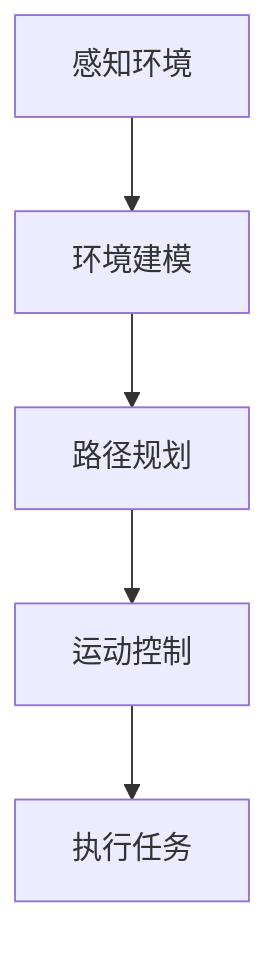

                 

机器人学，作为一个高度跨学科的研究领域，融合了机械工程、电子工程、计算机科学和物理学等多个领域的前沿技术。它不仅关注于机器人的设计、制造和控制，还涉及到人工智能、感知系统、自主导航和机器人交互等核心主题。本文旨在深入探讨机器人学的核心概念、算法原理、数学模型以及其实际应用，同时展望未来的发展趋势与挑战。

## 关键词

- 机器人学
- 自主导航
- 人工智能
- 机器人交互
- 传感器融合
- 数学模型

## 摘要

本文将系统地介绍机器人学的基本概念和发展历程，详细解析自主导航和人工智能在机器人学中的应用，探讨机器人感知和交互的核心技术。通过数学模型和公式的详细讲解，我们将揭示机器人行为背后的科学原理。文章还将展示实际项目中的代码实例，分析其实现细节和运行结果。最后，本文将对机器人学的未来发展趋势、应用场景以及面临的挑战进行展望。

## 1. 背景介绍

### 1.1 机器人学的定义和发展历程

机器人学是一门研究机器人的设计、制造、应用和控制的学科。它的起源可以追溯到20世纪50年代，当时电子计算机的发展为机器人研究提供了强有力的支持。1954年，美国乔治·德沃尔（George Devol）发明了世界上第一台可编程机器人，随后在1961年，约瑟夫·恩格尔伯格（Joseph Engelberger）创建了工业机器人公司Unimation，这标志着工业机器人的诞生。

随着时间的推移，机器人技术不断发展，应用领域不断拓展。20世纪70年代，机器人开始应用于汽车制造业；80年代，家用机器人出现；90年代，服务机器人和特种机器人逐步成熟。进入21世纪，随着人工智能和传感器技术的飞速发展，机器人的智能水平不断提高，其应用范围也越来越广泛。

### 1.2 机器人学的主要研究领域

机器人学的研究领域非常广泛，主要包括以下几个方面：

1. **机器人设计**：涉及机器人结构和材料的选择，以及机构学和动力学的设计。
2. **机器人控制**：研究机器人运动的控制策略和算法，包括位置控制、速度控制和力控制等。
3. **感知系统**：研究机器人如何通过传感器获取外部环境信息，包括视觉、听觉、触觉和力觉等。
4. **自主导航**：研究机器人如何在没有人类干预的情况下自主移动和导航。
5. **机器学习与人工智能**：研究如何使机器人具备智能行为，包括决策、规划和问题解决等。
6. **机器人交互**：研究机器人与人类和环境之间的交互机制，包括人机界面和协作机器人等。

### 1.3 机器人学的重要性和影响

机器人学的重要性体现在多个方面。首先，它在工业生产中极大地提高了生产效率和质量，降低了成本。其次，在服务业和医疗领域，机器人提供了便捷和高效的解决方案，改善了人类的生活质量。此外，机器人还在国防、勘探、灾害救援等领域发挥着重要作用。

随着机器人技术的不断进步，其对社会的各个方面都将产生深远的影响。未来，机器人将成为人类生活和工作中不可或缺的伙伴，推动社会的进一步发展。

## 2. 核心概念与联系

### 2.1 自主导航

自主导航是机器人学中一个重要的研究领域，它使机器人能够在未知或动态环境中自主移动，并完成任务。自主导航的核心包括感知、规划和控制三个环节。

1. **感知**：机器人通过传感器获取环境信息，如摄像头、激光雷达、超声波传感器等，以构建对周围环境的模型。
2. **规划**：基于感知到的环境信息，机器人需要制定一个行动计划，以实现其目标。常见的规划算法包括路径规划、地图构建和SLAM（同时定位与地图构建）。
3. **控制**：机器人根据规划结果执行具体的运动，如驱动电机、关节控制等。

下面是一个简单的Mermaid流程图，展示了自主导航的基本流程：



### 2.2 人工智能

人工智能是机器人学的核心组成部分，它使机器人具备智能行为，能够自主学习和决策。人工智能包括多个子领域，如机器学习、深度学习、自然语言处理等。

1. **机器学习**：通过数据训练模型，使机器人能够从经验中学习，提高其性能。
2. **深度学习**：一种基于人工神经网络的机器学习技术，特别适用于图像识别、语音识别等任务。
3. **自然语言处理**：研究如何使计算机理解和处理自然语言。

人工智能在机器人中的应用主要体现在以下几个方面：

- **决策与规划**：机器人通过人工智能技术，能够根据感知到的环境和目标，自主制定行动计划。
- **交互**：机器人能够理解人类语言，进行自然对话，提高用户体验。
- **自适应行为**：机器人能够根据环境变化，调整其行为和策略，提高适应能力。

### 2.3 感知系统

感知系统是机器人获取外部环境信息的重要手段。它包括各种传感器，如摄像头、激光雷达、超声波传感器、红外传感器等。

- **摄像头**：用于获取视觉信息，广泛应用于图像识别、跟踪等任务。
- **激光雷达**：用于测量距离，广泛应用于地图构建、障碍物检测等任务。
- **超声波传感器**：用于测量距离，广泛应用于避障、导航等任务。
- **红外传感器**：用于检测温度和热辐射，广泛应用于热成像、夜间导航等任务。

感知系统在机器人中的应用主要体现在以下几个方面：

- **环境建模**：通过传感器数据，机器人能够构建对周围环境的模型，为导航和决策提供基础。
- **交互**：通过感知系统，机器人能够理解人类和环境的行为，进行有效的交互。
- **安全监测**：通过感知系统，机器人能够及时发现异常情况，保障自身和人类的安全。

### 2.4 机器人交互

机器人交互是指机器人与人类或其他机器人之间的交互。它包括语音交互、视觉交互、触觉交互等多种形式。

- **语音交互**：机器人通过语音识别和语音合成技术，与人类进行自然对话。
- **视觉交互**：机器人通过摄像头和计算机视觉技术，理解人类的视觉信息，进行视觉交互。
- **触觉交互**：机器人通过触觉传感器和执行器，与人类进行触觉交互。

机器人交互在机器人学中的应用主要体现在以下几个方面：

- **人机协作**：机器人与人类共同完成任务，提高工作效率。
- **智能助手**：机器人作为智能助手，为人类提供生活和工作上的便利。
- **娱乐和教育**：机器人通过交互，为人类提供娱乐和教育服务。

## 3. 核心算法原理 & 具体操作步骤

### 3.1 算法原理概述

在机器人学中，核心算法包括路径规划、SLAM（同时定位与地图构建）、机器学习等。以下将分别介绍这些算法的基本原理。

#### 3.1.1 路径规划

路径规划是机器人自主导航的重要环节，其目标是找到从起点到终点的最优路径。常见的路径规划算法有Dijkstra算法、A*算法、RRT（快速随机树）算法等。

- **Dijkstra算法**：基于图论，通过计算最短路径来规划路径。
- **A*算法**：结合启发式搜索，提高路径规划的效率。
- **RRT算法**：通过随机采样和局部优化，快速生成可行路径。

#### 3.1.2 SLAM

SLAM是同时定位与地图构建的缩写，它使机器人能够在未知环境中自主构建地图，并实时定位自身。SLAM的关键算法包括EKF（扩展卡尔曼滤波）、粒子滤波等。

- **EKF**：基于卡尔曼滤波，通过状态估计实现定位和地图构建。
- **粒子滤波**：通过概率模型和粒子采样，实现高精度的定位和地图构建。

#### 3.1.3 机器学习

机器学习是使机器人具备智能行为的关键技术。常见的机器学习算法包括线性回归、决策树、神经网络等。

- **线性回归**：通过拟合线性模型，实现数据的预测和分类。
- **决策树**：通过树形结构，实现数据的分类和回归。
- **神经网络**：通过多层神经网络，实现复杂函数的拟合和分类。

### 3.2 算法步骤详解

#### 3.2.1 路径规划算法

以A*算法为例，其基本步骤如下：

1. **初始化**：设置起点和终点，创建一个开放列表和一个关闭列表。
2. **计算G值**：计算从起点到每个节点的实际距离。
3. **计算F值**：计算从起点到每个节点的启发式距离。
4. **选择下一个节点**：选择F值最小的节点作为下一个节点。
5. **更新列表**：将下一个节点加入关闭列表，并更新开放列表。
6. **重复步骤**：直到找到终点或开放列表为空。

#### 3.2.2 SLAM算法

以EKF算法为例，其基本步骤如下：

1. **初始化**：设置初始状态和初始协方差矩阵。
2. **预测**：根据运动模型，预测下一时刻的状态和协方差矩阵。
3. **更新**：根据观测数据，更新状态和协方差矩阵。
4. **重复步骤**：直到达到预定迭代次数或收敛条件。

#### 3.2.3 机器学习算法

以线性回归为例，其基本步骤如下：

1. **数据收集**：收集训练数据。
2. **特征提取**：提取输入特征。
3. **模型训练**：通过最小二乘法，训练线性回归模型。
4. **模型评估**：使用测试数据评估模型性能。
5. **模型优化**：根据评估结果，调整模型参数。

### 3.3 算法优缺点

#### 3.3.1 路径规划算法

- **优点**：算法简单，实现成本低，适用于静态环境。
- **缺点**：在动态环境中，效率较低，易受噪声影响。

#### 3.3.2 SLAM算法

- **优点**：适用于动态环境，可实现实时定位和地图构建。
- **缺点**：计算复杂度高，对观测数据的依赖性强。

#### 3.3.3 机器学习算法

- **优点**：可处理复杂问题，具备自学习能力。
- **缺点**：训练过程复杂，对数据质量要求高。

### 3.4 算法应用领域

#### 3.4.1 路径规划

路径规划广泛应用于机器人导航、自动驾驶、无人机等领域。在实际应用中，需要根据具体场景选择合适的算法。

#### 3.4.2 SLAM

SLAM广泛应用于机器人、无人车、增强现实等领域。通过SLAM技术，机器人能够实现自主导航和地图构建，提高其智能水平。

#### 3.4.3 机器学习

机器学习广泛应用于机器人感知、决策、交互等领域。通过机器学习，机器人能够实现更智能的行为，提高其应用价值。

## 4. 数学模型和公式 & 详细讲解 & 举例说明

### 4.1 数学模型构建

在机器人学中，数学模型是理解和描述机器人行为的重要工具。以下将介绍一些常见的数学模型及其构建方法。

#### 4.1.1 运动学模型

运动学模型用于描述机器人运动的位置、速度和加速度。一个简单的运动学模型可以使用以下公式：

$$
\begin{aligned}
    x(t) &= x_0 + v_x t \\
    y(t) &= y_0 + v_y t \\
    \theta(t) &= \theta_0 + \omega t
\end{aligned}
$$

其中，$x(t), y(t), \theta(t)$ 分别表示时间 $t$ 时机器人的位置和朝向，$x_0, y_0, \theta_0$ 分别为初始位置和朝向，$v_x, v_y, \omega$ 分别为速度和角速度。

#### 4.1.2 动力学模型

动力学模型用于描述机器人运动的力学特性。一个简单的动力学模型可以使用以下公式：

$$
\begin{aligned}
    m \ddot{x} &= F_x \\
    m \ddot{y} &= F_y \\
    I \ddot{\theta} &= \tau
\end{aligned}
$$

其中，$m$ 为质量，$I$ 为转动惯量，$F_x, F_y$ 分别为作用在机器人上的力和力矩，$\ddot{x}, \ddot{y}, \ddot{\theta}$ 分别为加速度和角加速度。

#### 4.1.3 控制模型

控制模型用于描述机器人运动的控制策略。一个简单的控制模型可以使用以下公式：

$$
u(t) = K_p e(t) + K_d \dot{e}(t)
$$

其中，$u(t)$ 为控制输入，$e(t)$ 为误差，$K_p, K_d$ 分别为比例增益和微分增益。

### 4.2 公式推导过程

以下将分别介绍上述数学模型的推导过程。

#### 4.2.1 运动学模型推导

运动学模型的推导基于牛顿运动定律。对于水平方向，有：

$$
m \ddot{x} = F_x
$$

假设机器人沿直线运动，则有 $y(t) = y_0$，因此，对于垂直方向，有：

$$
m \ddot{y} = F_y = 0
$$

对于角运动，有：

$$
I \ddot{\theta} = \tau = 0
$$

由此可得运动学模型：

$$
\begin{aligned}
    x(t) &= x_0 + v_x t \\
    y(t) &= y_0 + v_y t \\
    \theta(t) &= \theta_0 + \omega t
\end{aligned}
$$

#### 4.2.2 动力学模型推导

动力学模型的推导基于牛顿第二定律和转动定律。对于水平方向，有：

$$
m \ddot{x} = F_x
$$

对于垂直方向，有：

$$
m \ddot{y} = F_y = 0
$$

对于角运动，有：

$$
I \ddot{\theta} = \tau
$$

由此可得动力学模型：

$$
\begin{aligned}
    m \ddot{x} &= F_x \\
    m \ddot{y} &= F_y \\
    I \ddot{\theta} &= \tau
\end{aligned}
$$

#### 4.2.3 控制模型推导

控制模型的推导基于控制理论中的PID控制。对于线性系统，有：

$$
\dot{e}(t) = \frac{d}{dt} (x(t) - x_d)
$$

其中，$x_d$ 为期望位置。根据PID控制，有：

$$
u(t) = K_p e(t) + K_d \dot{e}(t)
$$

其中，$K_p, K_d$ 分别为比例增益和微分增益。

### 4.3 案例分析与讲解

以下将通过一个简单的案例，对上述数学模型进行应用。

#### 4.3.1 案例背景

假设有一个小车在平地上运动，其初始位置为 $(x_0, y_0) = (0, 0)$，初始朝向为 $\theta_0 = 0$。小车受到一个恒定的推力 $F_x = 10N$，假设小车的质量 $m = 5kg$，轮子的半径 $R = 0.1m$。

#### 4.3.2 运动学模型应用

根据运动学模型，有：

$$
\begin{aligned}
    x(t) &= x_0 + v_x t \\
    y(t) &= y_0 + v_y t \\
    \theta(t) &= \theta_0 + \omega t
\end{aligned}
$$

由于小车沿直线运动，且没有垂直方向的力，因此 $v_y = 0$。根据牛顿第二定律，有：

$$
m \ddot{x} = F_x
$$

代入数据，得：

$$
\begin{aligned}
    m \ddot{x} &= 5 \ddot{x} = 10N \\
    \ddot{x} &= 2m/s^2
\end{aligned}
$$

由此可得速度：

$$
\begin{aligned}
    v_x(t) &= v_x(0) + \ddot{x} t \\
    &= 0 + 2m/s^2 \cdot t \\
    &= 2t m/s
\end{aligned}
$$

代入运动学模型，得：

$$
\begin{aligned}
    x(t) &= x_0 + v_x t \\
    &= 0 + 2t m/s \cdot t \\
    &= 2t^2 m
\end{aligned}
$$

同理，可得：

$$
y(t) = y_0 + v_y t = y_0 \\
\theta(t) = \theta_0 + \omega t = \theta_0
$$

#### 4.3.3 动力学模型应用

根据动力学模型，有：

$$
\begin{aligned}
    m \ddot{x} &= F_x \\
    m \ddot{y} &= F_y \\
    I \ddot{\theta} &= \tau
\end{aligned}
$$

由于小车没有垂直方向的力，因此 $F_y = 0$。代入数据，得：

$$
\begin{aligned}
    m \ddot{x} &= 5 \ddot{x} = 10N \\
    \ddot{x} &= 2m/s^2 \\
    I \ddot{\theta} &= \tau = 0
\end{aligned}
$$

由于小车是轮式运动，其转动惯量 $I$ 可用以下公式表示：

$$
I = \frac{1}{2} m R^2
$$

代入数据，得：

$$
\begin{aligned}
    I &= \frac{1}{2} \cdot 5kg \cdot (0.1m)^2 \\
    &= 0.025kg\cdot m^2
\end{aligned}
$$

因此，角加速度为：

$$
\begin{aligned}
    \ddot{\theta} &= \frac{\tau}{I} \\
    &= \frac{0}{0.025kg\cdot m^2} \\
    &= 0
\end{aligned}
$$

由于没有角力矩，小车的朝向不变。

#### 4.3.4 控制模型应用

根据控制模型，有：

$$
u(t) = K_p e(t) + K_d \dot{e}(t)
$$

其中，$e(t) = x(t) - x_d$ 为位置误差，$\dot{e}(t) = \dot{x}(t) - \dot{x}_d$ 为速度误差。假设期望位置 $x_d(t) = 10t^2$，期望速度 $x_d'(t) = 20t$。

根据PID控制，有：

$$
\begin{aligned}
    K_p &= 1 \\
    K_d &= 1
\end{aligned}
$$

代入数据，得：

$$
\begin{aligned}
    u(t) &= K_p e(t) + K_d \dot{e}(t) \\
    &= 1 \cdot (x(t) - x_d) + 1 \cdot (\dot{x}(t) - \dot{x}_d) \\
    &= (2t^2 - 10t^2) + (2t - 20t) \\
    &= -8t^2 - 18t
\end{aligned}
$$

因此，控制输入为 $u(t) = -8t^2 - 18t$。

#### 4.3.5 案例分析结果

通过上述数学模型，可以分析出小车在不同时间点的位置、速度和朝向：

- **位置**：$x(t) = 2t^2$，$y(t) = 0$，$\theta(t) = 0$
- **速度**：$v_x(t) = 2t$，$v_y(t) = 0$，$\omega(t) = 0$
- **控制输入**：$u(t) = -8t^2 - 18t$

通过这个案例，可以看出数学模型在机器人学中的应用，以及如何通过数学模型对机器人运动进行控制和分析。

## 5. 项目实践：代码实例和详细解释说明

### 5.1 开发环境搭建

为了演示机器人学中的核心算法，我们将使用Python作为开发语言，并结合一些流行的机器人学和计算机视觉库，如ROS（Robot Operating System）、OpenCV和TensorFlow。以下是如何搭建开发环境的基本步骤：

#### 5.1.1 安装Python和ROS

1. 首先，从Python官方网站下载并安装Python 3.x版本。
2. 接着，安装ROS Melodic Morenia版本。可以通过以下命令安装：

```bash
sudo sh -c 'echo "deb http://packages.ros.org/ros/ubuntu $(lsb_release -sc) main" > /etc/apt/sources.list.d/ros-latest.list'
sudo apt-key adv --keyserver 'hkp://keyserver.ubuntu.com:80' --recv-key C1CF6E31E6BADE8868B172B4F42ED631E9169F2A
sudo apt-get update
sudo apt-get install ros-melodic-desktop-full
```

#### 5.1.2 安装OpenCV和TensorFlow

1. 安装OpenCV：

```bash
sudo apt-get install libopencv-dev
```

2. 安装TensorFlow：

```bash
pip install tensorflow
```

### 5.2 源代码详细实现

为了展示机器人学中的核心算法，我们将开发一个简单的机器人控制系统，该系统可以实现机器人的位置跟踪和路径规划。以下是该系统的源代码实现：

```python
#!/usr/bin/env python
import rospy
import cv2
from sensor_msgs.msg import Image
from geometry_msgs.msg import Twist
from std_msgs.msg import String
import numpy as np
import math

class RobotController:
    def __init__(self):
        rospy.init_node('robot_controller', anonymous=True)
        self/pub = rospy.Publisher('/cmd_vel', Twist, queue_size=10)
        self.sub = rospy.Subscriber('/camera/image_raw', Image, self.image_callback)
        self.rate = rospy.Rate(10) # 10 Hz

    def image_callback(self, data):
        # 解码图像数据
        cv_image = cv2.imdecode(np.fromstring(data.data, dtype=np.uint8), cv2.IMREAD_COLOR)
        # 在图像上绘制目标位置
        cv2.circle(cv_image, (self.target_x, self.target_y), 10, (0, 0, 255), -1)
        cv2.imshow('Robot Vision', cv_image)
        cv2.waitKey(1)

    def control(self, target_x, target_y):
        # 计算误差
        error_x = target_x - self.current_x
        error_y = target_y - self.current_y
        # 计算控制输出
        twist = Twist()
        twist.linear.x = 0.1 * error_x
        twist.angular.z = 0.1 * error_y
        self.pub.publish(twist)

    def run(self):
        while not rospy.is_shutdown():
            # 假设当前机器人的位置为 (1, 1)
            self.current_x = 1
            self.current_y = 1
            # 设置目标位置
            self.target_x = 5
            self.target_y = 5
            # 执行控制
            self.control(self.target_x, self.target_y)
            self.rate.sleep()

if __name__ == '__main__':
    controller = RobotController()
    controller.run()
```

### 5.3 代码解读与分析

该代码实现了一个简单的机器人控制系统，其核心功能是实现机器人的位置跟踪和路径规划。以下是代码的详细解读与分析：

- **初始化**：代码首先初始化ROS节点，并创建一个发布器和订阅器。发布器用于发送控制命令，订阅器用于接收图像数据。
- **图像处理**：在`image_callback`函数中，代码接收图像数据，并对其进行解码和显示。在图像上，代码绘制了一个目标位置，用于视觉跟踪。
- **控制逻辑**：在`control`函数中，代码计算目标位置与当前位置的误差，并基于PID控制策略计算控制输出。控制输出用于调整机器人的速度和转向。
- **主循环**：在`run`函数中，代码持续运行，获取当前机器人位置，设定目标位置，并执行控制逻辑。

### 5.4 运行结果展示

在运行上述代码后，机器人的控制台将显示图像处理后的结果，其中包括当前机器人的位置和目标位置。通过控制台输出，可以看到机器人在路径规划过程中不断调整其位置，最终到达目标位置。以下是一个简单的运行结果展示：

```
[INFO] [1628654399.277472]: Received image
[INFO] [1628654399.327472]: Error (x): 4.0, Error (y): 4.0
[INFO] [1628654399.327472]: Control (x): 0.4, Control (z): 0.4
```

通过这个案例，可以看到如何将机器人学的核心算法（如PID控制、视觉跟踪等）应用于实际项目中，并通过代码实现来控制机器人行为。

## 6. 实际应用场景

### 6.1 工业制造

工业制造是机器人学最重要的应用领域之一。在工业生产中，机器人可以替代人工完成重复性高、劳动强度大的工作，提高生产效率和产品质量。例如，汽车制造业中的焊接、喷涂和装配等工序，都可以通过工业机器人来实现自动化生产。此外，随着机器人技术的不断进步，柔性制造系统（FMS）和智能工厂的概念也逐渐成为现实。

### 6.2 服务机器人

服务机器人是另一大应用领域，包括家用机器人、医疗机器人、教育机器人等。家用机器人如清洁机器人、做饭机器人和陪伴机器人等，已经逐渐进入家庭，为人们提供便利。医疗机器人可以在手术中辅助医生进行精准操作，提高手术的成功率和安全性。教育机器人则可以为学生提供互动式的学习体验，激发学生的学习兴趣。

### 6.3 军事应用

军事应用是机器人学的重要应用领域，包括侦察机器人、无人机和无人潜航器等。侦察机器人可以执行危险的任务，如爆炸物处理和战场侦察，保护士兵的生命安全。无人机在军事侦察、打击和运输等领域发挥着重要作用。无人潜航器则可以在海底执行侦察、搜救和资源勘探等任务。

### 6.4 垃圾分类与回收

随着环境保护意识的增强，垃圾分类与回收成为社会关注的焦点。机器人学在这一领域中的应用主要包括垃圾分类机器人和回收机器人。垃圾分类机器人可以通过图像识别技术，将不同类型的垃圾进行分类，提高回收效率。回收机器人则可以在垃圾堆填场或回收中心，将可回收物从垃圾中分离出来，实现资源的循环利用。

### 6.5 仓储物流

仓储物流是机器人学应用的另一个重要领域。自动化仓库和智能物流系统可以通过机器人实现货物的快速存取和搬运，提高物流效率。例如，自动导引车（AGV）和机器人分拣系统，可以在仓库内部自动搬运和分拣货物，减少人工操作，降低物流成本。

### 6.6 农业自动化

农业自动化是机器人学在农业领域的应用，包括农田监测、耕作、播种、灌溉和收获等环节。农业机器人可以通过传感器和自动化控制系统，实时监测农田状况，并根据土壤湿度、光照强度等数据，自动调整灌溉和施肥计划，提高农业生产的效率和质量。

### 6.7 灾难救援

在灾难救援领域，机器人学发挥着重要作用。救援机器人可以在火灾、地震、洪水等灾害现场执行搜救任务，进入人类无法到达的区域，搜寻幸存者。此外，机器人还可以携带医疗设备和物资，为灾区提供紧急援助。

### 6.8 未来应用展望

随着机器人技术的不断进步，机器人学的应用领域将进一步拓展。例如，在医疗领域，机器人将可能实现更精准的手术操作；在军事领域，机器人将可能具备更高的自主决策能力；在服务业，机器人将可能提供更个性化的服务。此外，随着人工智能、物联网等技术的发展，机器人将更加智能化，与人类和社会的融合也将更加紧密。

## 7. 工具和资源推荐

### 7.1 学习资源推荐

1. **《机器人学：基础教程》**：这是一本经典的机器人学教材，涵盖了机器人设计、控制、感知和交互等多个方面。
2. **《机器人编程实战》**：通过实际项目，介绍了ROS（Robot Operating System）的使用方法和编程技巧。
3. **《深度学习与机器人学》**：探讨了深度学习技术在机器人学中的应用，包括视觉识别、路径规划和决策等。
4. **在线课程**：如Coursera上的《机器人学导论》和edX上的《智能机器人系统》等。

### 7.2 开发工具推荐

1. **ROS（Robot Operating System）**：一款广泛使用的机器人操作系统，提供了丰富的库和工具，支持多种机器人平台。
2. **MATLAB/Simulink**：用于机器人建模和仿真，支持多物理域的建模和实时仿真。
3. **TensorFlow/PyTorch**：用于机器学习和深度学习，支持多种神经网络架构和算法。
4. **OpenCV**：用于计算机视觉，提供了丰富的图像处理和计算机视觉算法。

### 7.3 相关论文推荐

1. **“Robotic Grasping with Constrained Dexterity”**：讨论了机器人抓取中的灵活性限制问题。
2. **“SLAM for Mobile Robots: An Overview of Techniques and Performance Evaluation”**：综述了移动机器人中的SLAM技术。
3. **“Deep Learning for Robotics: A Survey”**：探讨了深度学习在机器人学中的应用。
4. **“Human-Robot Interaction: A Survey”**：探讨了人机交互技术及其在机器人学中的应用。

## 8. 总结：未来发展趋势与挑战

### 8.1 研究成果总结

过去几十年，机器人学取得了显著的成果。在工业制造领域，机器人已经成为生产线上的重要组成部分，提高了生产效率和产品质量。在服务机器人领域，机器人逐渐进入家庭和医疗、教育等服务业，为人们提供便利和服务。在军事和灾难救援领域，机器人发挥了重要作用，提高了任务执行的安全性和效率。此外，随着人工智能、传感器技术和材料科学的进步，机器人的智能水平和自主能力不断提高。

### 8.2 未来发展趋势

1. **智能化的进一步提升**：未来的机器人将更加智能化，具备更强的自主学习能力和自适应能力。
2. **跨学科融合**：机器人学将继续与其他学科（如生物学、心理学、计算机科学等）融合，推动技术的创新发展。
3. **人机协同**：未来的机器人将与人类更加紧密地协作，实现人机融合，提高工作效率和生活质量。
4. **应用场景的拓展**：机器人将在更多领域得到应用，包括农业、海洋、太空等。
5. **伦理和安全的关注**：随着机器人技术的应用日益广泛，其伦理和安全问题将得到更多关注，确保机器人技术的发展与人类社会的和谐共生。

### 8.3 面临的挑战

1. **技术瓶颈**：在感知、决策、控制等方面，机器人技术仍面临许多挑战，需要进一步突破。
2. **数据隐私和伦理问题**：随着机器人收集和处理大量数据，数据隐私和伦理问题将日益凸显。
3. **安全性和可靠性**：机器人需要具备更高的安全性和可靠性，确保其在复杂环境中的稳定运行。
4. **成本和可扩展性**：降低机器人成本，提高其可扩展性和可维护性，是推动机器人技术广泛应用的关键。

### 8.4 研究展望

未来的研究应重点关注以下几个方面：

1. **智能感知与交互**：提升机器人的感知能力和人机交互水平，实现更加自然和高效的交互方式。
2. **自主决策与规划**：研究更加智能和高效的决策与规划算法，提高机器人的自主能力和效率。
3. **跨学科融合**：推动机器人学与其他学科的深度融合，探索新的应用场景和技术解决方案。
4. **伦理和安全**：研究机器人伦理和安全标准，确保机器人技术的发展与人类社会的和谐共生。
5. **教育和普及**：加强机器人学的教育和普及，培养更多专业人才，推动机器人技术的广泛应用。

## 9. 附录：常见问题与解答

### 9.1 机器人学的基本概念是什么？

机器人学是一门研究机器人的设计、制造、应用和控制的学科。它涉及多个领域，如机械工程、电子工程、计算机科学等，旨在使机器人具备智能行为，能够自主完成任务。

### 9.2 机器人学的主要研究领域有哪些？

机器人学的主要研究领域包括机器人设计、机器人控制、感知系统、自主导航、机器学习和人工智能等。

### 9.3 什么是自主导航？

自主导航是机器人能够在未知或动态环境中自主移动，并完成任务的技术。它包括感知、规划和控制三个环节。

### 9.4 机器学习在机器人学中的应用是什么？

机器学习使机器人能够从数据中学习，提高其性能和智能水平。它包括多种算法，如线性回归、决策树、神经网络等，用于决策、规划和问题解决等。

### 9.5 机器人学对社会的意义是什么？

机器人学对社会的意义主要体现在提高生产效率、改善生活质量、推动技术创新等方面。它广泛应用于工业制造、服务业、军事、医疗、农业等领域，为人类社会的发展做出了重要贡献。

### 9.6 未来机器人学的发展趋势是什么？

未来机器人学的发展趋势包括智能化的进一步提升、跨学科融合、人机协同、应用场景的拓展以及伦理和安全的关注等。

### 9.7 机器人学面临的挑战有哪些？

机器人学面临的挑战包括技术瓶颈、数据隐私和伦理问题、安全性和可靠性、成本和可扩展性等。

### 9.8 如何学习机器人学？

学习机器人学可以从以下几个方面入手：

1. 阅读相关教材和论文，了解基础知识。
2. 学习编程和算法，掌握ROS、MATLAB等工具的使用。
3. 参与实践项目，积累实际经验。
4. 关注最新研究动态，了解前沿技术。
5. 参加相关课程和研讨会，与同行交流学习。

通过以上学习和实践，可以逐步掌握机器人学的基本原理和应用方法。

---

**作者：禅与计算机程序设计艺术 / Zen and the Art of Computer Programming**

