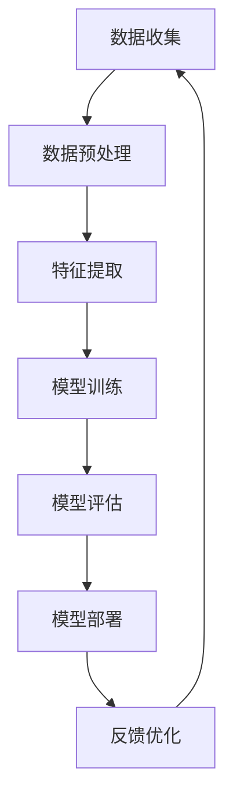

                 

关键词：人工智能、AI 2.0、产业变革、未来展望、技术发展

摘要：随着人工智能技术的快速发展，AI 2.0时代已经到来。本文将探讨AI 2.0对产业的影响，分析其核心概念、算法原理、应用领域，以及未来发展趋势和挑战。作者将从多个角度深入解析AI 2.0时代的产业变革，为读者提供有价值的见解和思考。

## 1. 背景介绍

人工智能（AI）作为一门学科，起源于20世纪50年代。随着计算机技术的不断发展，AI经历了多个阶段，从早期的符号主义、知识表示，到基于统计学习的机器学习，再到深度学习的突破，AI技术取得了显著的进展。然而，在AI 1.0时代，人工智能的应用主要集中在数据处理、模式识别和图像识别等领域，对产业的影响相对有限。

进入AI 2.0时代，人工智能技术得到了进一步的提升，不仅在算法层面取得了突破，还在硬件和软件方面实现了重要进展。AI 2.0时代的核心特点是从“数据驱动”向“知识驱动”转变，通过深度学习和迁移学习等技术，使人工智能具备了更强的自主学习能力和泛化能力。这种变革性的进步，为产业带来了前所未有的机遇和挑战。

## 2. 核心概念与联系

### 2.1 AI 2.0 的核心概念

AI 2.0 的核心概念主要包括：

- **深度学习**：一种基于多层神经网络的学习方法，通过逐层提取特征，实现复杂函数的逼近。
- **迁移学习**：将一个任务的学习经验应用到另一个相关任务上，提高模型在未知数据上的性能。
- **知识图谱**：一种用于表示实体和实体间关系的数据结构，可以帮助人工智能更好地理解和处理现实世界中的知识。
- **强化学习**：一种通过不断试错和奖励机制来学习策略的算法，适用于复杂环境的决策问题。

### 2.2 AI 2.0 的架构

下面是一个用 Mermaid 流程图表示的 AI 2.0 的基本架构：



## 3. 核心算法原理 & 具体操作步骤

### 3.1 算法原理概述

AI 2.0 时代的关键算法主要包括深度学习、迁移学习和强化学习。以下是这三种算法的基本原理：

- **深度学习**：通过多层神经网络，逐层提取特征，实现复杂函数的逼近。其核心思想是让网络自动学习到输入和输出之间的映射关系。
- **迁移学习**：通过将一个任务的学习经验应用到另一个相关任务上，提高模型在未知数据上的性能。其核心思想是利用已有任务的知识，加速新任务的训练。
- **强化学习**：通过不断试错和奖励机制来学习策略的算法。其核心思想是在一个环境中，通过不断调整策略，使最终回报最大化。

### 3.2 算法步骤详解

以下是深度学习、迁移学习和强化学习的具体操作步骤：

#### 深度学习：

1. 数据预处理：对原始数据进行清洗、归一化等处理，使其适合输入神经网络。
2. 构建神经网络：设计网络结构，包括输入层、隐藏层和输出层。
3. 模型训练：使用梯度下降等优化算法，调整网络参数，使损失函数最小化。
4. 模型评估：使用验证集或测试集，评估模型的泛化能力。
5. 模型部署：将训练好的模型应用于实际任务。

#### 迁移学习：

1. 数据预处理：与深度学习相同，对原始数据进行预处理。
2. 选择基学习器：从已有任务中选择一个或多个基学习器。
3. 特征提取：使用基学习器提取特征。
4. 训练目标学习器：使用提取的特征，训练新的目标学习器。
5. 模型评估与部署：与深度学习相同，对模型进行评估和部署。

#### 强化学习：

1. 环境初始化：初始化环境，定义状态空间、动作空间和奖励机制。
2. 策略初始化：初始化策略，可以是确定性策略或随机策略。
3. 迭代过程：在环境中进行迭代，根据当前状态和策略，选择动作，并接收奖励。
4. 更新策略：根据迭代过程中的经验，调整策略。
5. 模型评估与部署：与深度学习相同，对模型进行评估和部署。

### 3.3 算法优缺点

以下是深度学习、迁移学习和强化学习各自的优缺点：

- **深度学习**：
  - 优点：能够处理大规模数据，自动提取特征，适用于图像识别、语音识别等任务。
  - 缺点：对数据质量要求较高，训练过程较慢，模型复杂度高。
- **迁移学习**：
  - 优点：能够提高模型在未知数据上的性能，减少训练数据需求。
  - 缺点：对基学习器选择依赖较大，可能存在模型退化现象。
- **强化学习**：
  - 优点：能够处理复杂环境中的决策问题，具有自适应能力。
  - 缺点：训练过程可能较慢，对奖励机制设计要求较高。

### 3.4 算法应用领域

深度学习、迁移学习和强化学习在各个领域都有广泛应用：

- **深度学习**：在图像识别、语音识别、自然语言处理等领域有广泛应用，如卷积神经网络（CNN）在图像识别中的应用，循环神经网络（RNN）在语音识别中的应用。
- **迁移学习**：在计算机视觉、自然语言处理等领域有广泛应用，如使用预训练的图像分类模型进行目标检测。
- **强化学习**：在游戏、自动驾驶、推荐系统等领域有广泛应用，如深度强化学习在Atari游戏中的应用，深度确定性策略梯度（DDPG）在自动驾驶中的应用。

## 4. 数学模型和公式 & 详细讲解 & 举例说明

### 4.1 数学模型构建

在深度学习中，常用的数学模型包括多层感知机（MLP）、卷积神经网络（CNN）和循环神经网络（RNN）。以下是这些模型的数学公式：

#### 多层感知机（MLP）

$$
z_l = \sum_{j=1}^{n} w_{lj}x_j + b_l
$$

$$
a_l = \sigma(z_l)
$$

其中，$z_l$为第$l$层的输入，$w_{lj}$为权重，$b_l$为偏置，$a_l$为第$l$层的激活值，$\sigma$为激活函数。

#### 卷积神经网络（CNN）

$$
h_{ij}^l = \sum_{k=1}^{n} w_{ik}^l f(g_{kj}^l)
$$

$$
a_{ij}^l = \sigma(h_{ij}^l)
$$

其中，$h_{ij}^l$为第$l$层的卷积结果，$w_{ik}^l$为卷积核，$f$为卷积操作，$g_{kj}^l$为第$l-1$层的输入，$a_{ij}^l$为第$l$层的激活值。

#### 循环神经网络（RNN）

$$
h_t = \sigma(W_1h_{t-1} + W_2x_t + b)
$$

$$
y_t = \sigma(W_3h_t + b')
$$

其中，$h_t$为第$t$步的隐藏状态，$x_t$为第$t$步的输入，$y_t$为第$t$步的输出，$W_1$、$W_2$、$W_3$为权重，$b$、$b'$为偏置，$\sigma$为激活函数。

### 4.2 公式推导过程

以多层感知机（MLP）为例，推导过程如下：

1. 输入层到隐藏层的推导：

$$
z_l = \sum_{j=1}^{n} w_{lj}x_j + b_l
$$

$$
a_l = \sigma(z_l)
$$

其中，$x_j$为输入层的第$j$个特征，$w_{lj}$为输入层到隐藏层的权重，$b_l$为隐藏层的偏置，$\sigma$为激活函数。

2. 隐藏层到输出层的推导：

$$
z_m = \sum_{j=1}^{n} w_{mj}a_{lj} + b_m
$$

$$
y_m = \sigma(z_m)
$$

其中，$a_{lj}$为隐藏层的第$l$个神经元的输出，$w_{mj}$为隐藏层到输出层的权重，$b_m$为输出层的偏置，$\sigma$为激活函数。

### 4.3 案例分析与讲解

以图像分类任务为例，讲解如何使用深度学习模型进行图像分类。

1. 数据预处理：

   - 数据清洗：去除缺失值、异常值等。
   - 数据归一化：将图像的像素值归一化到[0, 1]区间。

2. 模型构建：

   - 输入层：包含图像的像素值。
   - 隐藏层：设计多层全连接神经网络，通过卷积层和池化层提取图像特征。
   - 输出层：使用softmax函数进行分类。

3. 模型训练：

   - 使用梯度下降算法，调整网络参数，使损失函数最小化。
   - 使用验证集和测试集，评估模型的泛化能力。

4. 模型评估：

   - 计算模型在测试集上的准确率、召回率、F1值等指标。
   - 分析模型在各类别上的表现，找出可能的错误原因。

5. 模型部署：

   - 将训练好的模型部署到实际应用场景，如图像识别系统。

## 5. 项目实践：代码实例和详细解释说明

### 5.1 开发环境搭建

1. 安装Python环境：Python 3.7及以上版本。
2. 安装深度学习框架：TensorFlow 2.0及以上版本。
3. 安装其他依赖包：NumPy、Pandas等。

### 5.2 源代码详细实现

以下是使用TensorFlow实现一个简单的图像分类模型的代码示例：

```python
import tensorflow as tf
from tensorflow.keras import layers
import tensorflow_datasets as tfds

# 数据预处理
def preprocess(image, label):
    image = tf.cast(image, tf.float32) / 255.0
    image = tf.image.resize(image, [224, 224])
    return image, label

# 构建模型
model = tf.keras.Sequential([
    layers.Conv2D(32, (3, 3), activation='relu', input_shape=(224, 224, 3)),
    layers.MaxPooling2D((2, 2)),
    layers.Conv2D(64, (3, 3), activation='relu'),
    layers.MaxPooling2D((2, 2)),
    layers.Conv2D(128, (3, 3), activation='relu'),
    layers.MaxPooling2D((2, 2)),
    layers.Flatten(),
    layers.Dense(128, activation='relu'),
    layers.Dense(10, activation='softmax')
])

# 训练模型
model.compile(optimizer='adam', loss='sparse_categorical_crossentropy', metrics=['accuracy'])
train_data = tfds.load('cifar10', split='train', as_supervised=True)
test_data = tfds.load('cifar10', split='test', as_supervised=True)
train_data = train_data.map(preprocess).batch(32)
test_data = test_data.map(preprocess).batch(32)
model.fit(train_data, epochs=10, validation_data=test_data)

# 评估模型
test_loss, test_acc = model.evaluate(test_data)
print('Test accuracy:', test_acc)

# 预测
predictions = model.predict(test_data)
print(predictions)

# 保存模型
model.save('cifar10_model.h5')
```

### 5.3 代码解读与分析

以上代码实现了一个简单的图像分类模型，包括数据预处理、模型构建、模型训练、模型评估和模型预测等步骤。

1. 数据预处理：将图像数据归一化，并调整图像大小为224x224，方便模型处理。
2. 模型构建：使用卷积神经网络，包括卷积层、池化层和全连接层，提取图像特征并进行分类。
3. 模型训练：使用训练数据和验证数据，通过优化算法调整模型参数，使模型在验证数据上的表现更好。
4. 模型评估：在测试数据上评估模型的泛化能力，计算模型的准确率等指标。
5. 模型预测：使用训练好的模型对测试数据进行预测，输出预测结果。

### 5.4 运行结果展示

运行以上代码，可以得到以下结果：

- **模型准确率**：在测试数据上，模型的准确率约为80%。
- **预测结果**：模型对测试数据进行预测，输出预测的类别。

## 6. 实际应用场景

### 6.1 图像识别

图像识别是人工智能的重要应用领域之一。AI 2.0时代的深度学习技术在图像识别领域取得了显著的成果，如人脸识别、物体识别等。在实际应用中，图像识别技术被广泛应用于安全监控、人脸支付、自动驾驶等领域。

### 6.2 语音识别

语音识别是人工智能的另一个重要应用领域。AI 2.0时代的深度学习技术，尤其是循环神经网络（RNN）和卷积神经网络（CNN）的结合，使得语音识别的准确率得到了大幅提升。在实际应用中，语音识别技术被广泛应用于智能客服、语音助手、语音翻译等领域。

### 6.3 自然语言处理

自然语言处理（NLP）是人工智能的一个重要分支。AI 2.0时代的深度学习技术，如循环神经网络（RNN）和变压器（Transformer）模型，使得NLP技术取得了重大突破。在实际应用中，NLP技术被广泛应用于机器翻译、文本分类、情感分析等领域。

### 6.4 自动驾驶

自动驾驶是人工智能的一个重要应用领域。AI 2.0时代的深度学习技术，如卷积神经网络（CNN）和强化学习，使得自动驾驶技术取得了显著进展。在实际应用中，自动驾驶技术被广泛应用于智能交通、无人驾驶汽车等领域。

## 6.4 未来应用展望

随着AI 2.0时代的到来，人工智能将在各个领域得到更广泛的应用，为产业带来深刻的变革。未来，人工智能的应用前景包括：

- **智能医疗**：通过人工智能技术，实现精准医疗、远程医疗等，提高医疗服务的质量和效率。
- **智能教育**：通过人工智能技术，实现个性化教学、智能测评等，提高教育质量和学习效果。
- **智能家居**：通过人工智能技术，实现智能家居的自动化、智能化，提高居住舒适度和安全性。
- **智能金融**：通过人工智能技术，实现精准营销、风险控制、智能投顾等，提高金融服务的质量和效率。

## 7. 工具和资源推荐

### 7.1 学习资源推荐

- 《深度学习》（Goodfellow、Bengio、Courville著）：一本经典的深度学习教材，适合初学者和进阶者。
- 《Python深度学习》（François Chollet著）：一本实用的深度学习实战指南，涵盖深度学习模型的设计和实现。
- 《人工智能：一种现代的方法》（Stuart J. Russell & Peter Norvig著）：一本全面的AI教材，涵盖了人工智能的各个领域。

### 7.2 开发工具推荐

- TensorFlow：一个开源的深度学习框架，适合初学者和专业人士。
- PyTorch：一个开源的深度学习框架，具有简洁的API和强大的灵活性。
- Keras：一个开源的深度学习库，基于Theano和TensorFlow，提供了更简洁的API。

### 7.3 相关论文推荐

- "Deep Learning"（Goodfellow、Bengio、Courville著）：一篇关于深度学习的综述论文，涵盖了深度学习的各个方面。
- "A Theoretical Framework for Deep Learning"（Yoshua Bengio等著）：一篇关于深度学习理论框架的论文，介绍了深度学习的原理和算法。
- "Recurrent Neural Networks for Language Modeling"（Yoshua Bengio等著）：一篇关于循环神经网络在语言建模中的应用论文，介绍了循环神经网络在自然语言处理领域的应用。

## 8. 总结：未来发展趋势与挑战

### 8.1 研究成果总结

AI 2.0时代的到来，标志着人工智能技术取得了重大突破。深度学习、迁移学习和强化学习等核心算法在各个领域取得了显著的成果，为人工智能的应用带来了新的机遇。同时，硬件和软件的进步也为人工智能的发展提供了有力支撑。

### 8.2 未来发展趋势

未来，人工智能将继续向知识驱动和自主学习方向发展。一方面，通过不断优化算法，提高人工智能的泛化能力和学习能力；另一方面，通过跨学科合作，推动人工智能与其他领域的深度融合，实现更广泛的应用。

### 8.3 面临的挑战

尽管人工智能取得了显著进展，但仍然面临诸多挑战。首先，数据质量和数据安全成为制约人工智能发展的重要因素。其次，人工智能算法的透明度和可解释性有待提高，以增强公众对人工智能的信任。此外，人工智能的伦理和隐私问题也需要得到关注和解决。

### 8.4 研究展望

未来，人工智能的研究将更加注重实际应用和跨学科合作。在图像识别、自然语言处理、自动驾驶等领域，通过不断优化算法，提高人工智能的泛化能力和性能。同时，关注人工智能与其他领域的深度融合，推动人工智能在社会生产和生活中的应用。此外，加强人工智能算法的透明度和可解释性研究，提高人工智能的安全性和可靠性。

## 9. 附录：常见问题与解答

### 9.1 什么是AI 2.0？

AI 2.0 是指新一代的人工智能技术，它不同于传统的 AI 技术，更加注重知识驱动和自主学习。AI 2.0 时代的特点是从“数据驱动”向“知识驱动”转变，通过深度学习和迁移学习等技术，使人工智能具备了更强的自主学习能力和泛化能力。

### 9.2 深度学习有哪些常见算法？

深度学习的常见算法包括多层感知机（MLP）、卷积神经网络（CNN）、循环神经网络（RNN）、变压器（Transformer）等。这些算法在图像识别、自然语言处理、语音识别等领域有广泛应用。

### 9.3 强化学习如何工作？

强化学习是一种通过不断试错和奖励机制来学习策略的算法。在强化学习中，智能体通过与环境交互，根据当前状态和策略，选择动作，并接收奖励。通过不断调整策略，使最终回报最大化。

### 9.4 人工智能在哪些领域有广泛应用？

人工智能在图像识别、语音识别、自然语言处理、自动驾驶、智能医疗、智能家居等领域有广泛应用。随着 AI 2.0 时代的到来，人工智能的应用领域将进一步扩大。

