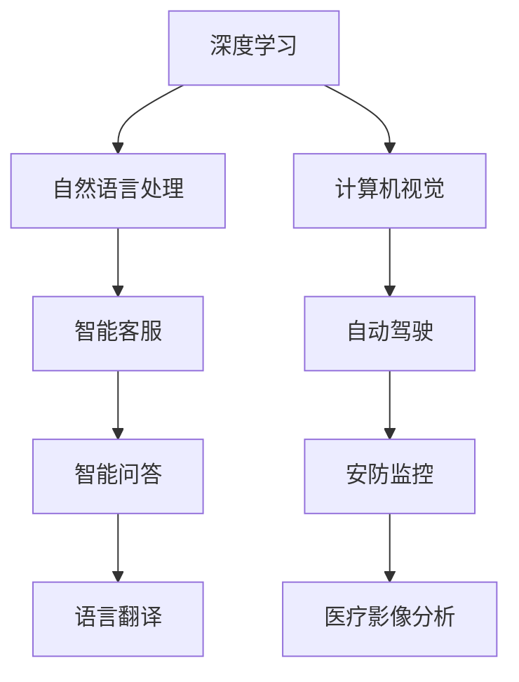

                 

关键词：李开复，人工智能，AI 2.0，产业革命，技术趋势，未来展望

## 摘要

本文旨在探讨李开复关于AI 2.0时代的产业观点，通过分析AI技术的发展历程、核心概念及其应用场景，深入剖析AI 2.0时代的产业变革。文章将结合李开复的观点，对人工智能在各个领域的影响进行详细解读，同时展望AI 2.0时代的发展趋势与挑战。

## 1. 背景介绍

### 1.1 AI技术的发展历程

人工智能（Artificial Intelligence，简称AI）作为计算机科学的一个重要分支，起源于20世纪50年代。在经历了早期的基础理论研究和探索阶段后，AI技术逐渐走向应用，特别是在20世纪80年代到90年代，专家系统和机器学习技术得到了快速发展。

进入21世纪，随着计算机性能的提升和大数据的积累，AI技术迎来了新的发展机遇。深度学习、神经网络、自然语言处理等技术不断突破，使得AI在语音识别、图像识别、自动驾驶等领域取得了显著成果。

### 1.2 AI 1.0与AI 2.0

李开复将人工智能的发展分为两个阶段：AI 1.0和AI 2.0。AI 1.0主要依赖于规则和模板，擅长处理结构化数据，如专家系统和早期的机器学习算法。而AI 2.0则强调基于数据驱动的学习，能够处理复杂和非结构化的数据，如深度学习、自然语言处理和计算机视觉等领域。

AI 2.0时代的到来，标志着人工智能技术的成熟和应用范围的扩大。本文将围绕这一主题，探讨AI 2.0时代的产业变革。

## 2. 核心概念与联系

### 2.1 深度学习

深度学习是AI 2.0时代的关键技术之一，基于多层神经网络的结构，能够自动提取数据中的特征。深度学习在图像识别、语音识别和自然语言处理等领域取得了巨大突破。

### 2.2 自然语言处理

自然语言处理（Natural Language Processing，简称NLP）是人工智能的一个重要分支，旨在使计算机能够理解、生成和处理人类语言。NLP技术在智能客服、智能问答和语言翻译等领域具有广泛的应用。

### 2.3 计算机视觉

计算机视觉（Computer Vision）是AI 2.0时代的重要应用领域之一，通过图像识别、目标检测和图像分类等技术，实现计算机对视觉信息的自动理解。计算机视觉在自动驾驶、安防监控和医疗影像分析等领域具有广泛的应用。

### 2.4 Mermaid 流程图



## 3. 核心算法原理 & 具体操作步骤

### 3.1 算法原理概述

AI 2.0时代的核心算法主要包括深度学习、自然语言处理和计算机视觉。这些算法基于神经网络结构，通过大量数据训练模型，实现数据特征自动提取和模式识别。

### 3.2 算法步骤详解

- **深度学习**：通过构建多层神经网络，逐层提取数据特征，最终实现目标识别。具体步骤包括数据预处理、模型构建、训练和评估。

- **自然语言处理**：通过分词、词性标注、句法分析等技术，实现文本数据的理解和生成。具体步骤包括语料库构建、模型训练、应用部署。

- **计算机视觉**：通过图像识别、目标检测和图像分类等技术，实现视觉信息的自动理解。具体步骤包括图像预处理、模型训练、实时检测和评估。

### 3.3 算法优缺点

- **深度学习**：优点在于能够自动提取数据特征，适应性强；缺点是模型训练时间较长，对计算资源要求较高。

- **自然语言处理**：优点在于能够处理自然语言文本，实现人机交互；缺点是模型复杂度较高，对语料库要求较高。

- **计算机视觉**：优点在于能够实现实时视觉信息的自动理解，应用范围广泛；缺点是模型训练时间较长，对计算资源要求较高。

### 3.4 算法应用领域

- **深度学习**：广泛应用于图像识别、语音识别和自然语言处理等领域。

- **自然语言处理**：广泛应用于智能客服、智能问答和语言翻译等领域。

- **计算机视觉**：广泛应用于自动驾驶、安防监控和医疗影像分析等领域。

## 4. 数学模型和公式 & 详细讲解 & 举例说明

### 4.1 数学模型构建

AI 2.0时代的核心算法基于神经网络结构，包括输入层、隐藏层和输出层。每个神经元之间的连接权重和偏置通过训练过程不断调整，以实现模型拟合。

### 4.2 公式推导过程

假设一个简单的神经网络模型，包括一个输入层、一个隐藏层和一个输出层。输入层有n个神经元，隐藏层有m个神经元，输出层有k个神经元。神经元之间的连接权重和偏置分别表示为W和b。

输入层到隐藏层的激活函数为$f(x) = \sigma(Wx + b)$，其中$\sigma$为Sigmoid函数。

隐藏层到输出层的激活函数为$f(x) = \sigma(W'x + b')$。

损失函数为$J = \frac{1}{2}\sum_{i=1}^{k}(y_i - \hat{y}_i)^2$，其中$y_i$为真实标签，$\hat{y}_i$为预测结果。

### 4.3 案例分析与讲解

假设我们使用一个简单的神经网络模型进行图像分类任务。输入层有784个神经元（对应28x28像素的图像），隐藏层有500个神经元，输出层有10个神经元（对应10个类别）。

输入层到隐藏层的权重矩阵W为$500 \times 784$，偏置矩阵b为$500 \times 1$。隐藏层到输出层的权重矩阵W'为$10 \times 500$，偏置矩阵b'为$10 \times 1$。

通过训练过程，不断调整权重矩阵和偏置矩阵，使得模型拟合度逐渐提高。最终，输出层的预测结果与真实标签之间的差距最小化。

## 5. 项目实践：代码实例和详细解释说明

### 5.1 开发环境搭建

在本项目中，我们使用Python作为编程语言，结合TensorFlow框架进行深度学习模型的构建和训练。

安装Python环境和TensorFlow框架：

```bash
pip install python tensorflow
```

### 5.2 源代码详细实现

```python
import tensorflow as tf
from tensorflow.keras import layers

# 定义模型
model = tf.keras.Sequential([
    layers.Dense(500, activation='sigmoid', input_shape=(784,)),
    layers.Dense(10, activation='softmax')
])

# 编译模型
model.compile(optimizer='adam', loss='mean_squared_error', metrics=['accuracy'])

# 加载训练数据
(x_train, y_train), (x_test, y_test) = tf.keras.datasets.mnist.load_data()

# 预处理数据
x_train = x_train / 255.0
x_test = x_test / 255.0

# 训练模型
model.fit(x_train, y_train, epochs=10, batch_size=32, validation_data=(x_test, y_test))

# 评估模型
model.evaluate(x_test, y_test)
```

### 5.3 代码解读与分析

- 第1行：引入TensorFlow库和keras模块。

- 第2行：定义一个Sequential模型，包含一个全连接层（Dense）作为隐藏层，一个输出层（Dense）。

- 第3行：设置隐藏层神经元个数为500，激活函数为sigmoid。

- 第4行：设置输出层神经元个数为10，激活函数为softmax。

- 第5行：编译模型，指定优化器为adam，损失函数为均方误差，评估指标为准确率。

- 第6行：加载MNIST数据集。

- 第7行：对训练数据进行归一化处理。

- 第8行：训练模型，指定训练轮数为10，批量大小为32。

- 第9行：评估模型在测试数据集上的性能。

## 6. 实际应用场景

### 6.1 自动驾驶

自动驾驶是AI 2.0时代的一个重要应用场景。通过计算机视觉和自然语言处理技术，自动驾驶系统能够实时感知路况、识别交通标志和行人，实现车辆的自主驾驶。

### 6.2 智能客服

智能客服系统利用自然语言处理技术，实现与用户的智能对话。通过语音识别、语义分析和语音合成等技术，智能客服能够快速响应用户需求，提供高效的客户服务。

### 6.3 医疗影像分析

医疗影像分析是AI 2.0时代的重要应用领域。通过计算机视觉技术，AI系统能够对医学影像进行自动分析和诊断，提高医生的工作效率，降低误诊率。

## 7. 工具和资源推荐

### 7.1 学习资源推荐

- 《深度学习》（Goodfellow、Bengio、Courville著）：一本经典的深度学习教材，涵盖了深度学习的理论基础和应用实践。

- 《自然语言处理综论》（Daniel Jurafsky、James H. Martin著）：一本全面介绍自然语言处理技术的教材，适合初学者和专业人士。

### 7.2 开发工具推荐

- TensorFlow：一款开源的深度学习框架，适用于构建和训练神经网络模型。

- PyTorch：一款流行的深度学习框架，具有良好的灵活性和扩展性。

### 7.3 相关论文推荐

- "Deep Learning for Text Classification"（Yoon Kim著）：一篇关于文本分类的深度学习论文，介绍了深度学习在自然语言处理中的应用。

- "Object Detection with Faster R-CNN"（Shaoqing Ren等著）：一篇关于目标检测的论文，介绍了Faster R-CNN算法。

## 8. 总结：未来发展趋势与挑战

### 8.1 研究成果总结

AI 2.0时代在深度学习、自然语言处理和计算机视觉等领域取得了显著成果，为各个行业带来了深刻变革。通过大量数据和强大的计算能力，AI系统在图像识别、语音识别、自动驾驶等领域取得了突破性进展。

### 8.2 未来发展趋势

未来，AI 2.0时代将继续发展，主要趋势包括：

- 数据驱动：AI系统将更加依赖海量数据，通过数据驱动的学习方式不断提高性能。

- 跨学科融合：AI技术将与其他学科（如生物、物理、化学等）融合，推动新的科学研究和技术突破。

- 自主化：AI系统将实现更高程度的自主化，能够在复杂环境中进行自主决策和行动。

### 8.3 面临的挑战

AI 2.0时代也面临一系列挑战，包括：

- 数据隐私：海量数据的使用引发数据隐私和安全问题，需要加强数据保护和隐私保护。

- 伦理道德：AI技术的应用引发伦理和道德问题，需要制定相应的法律法规和道德准则。

- 技术普及：AI技术的普及需要解决技术成本、人才短缺等问题，推动技术落地应用。

### 8.4 研究展望

未来，我国在AI 2.0时代的研究将朝着以下方向发展：

- 加强基础研究：加大投入，推动深度学习、自然语言处理和计算机视觉等基础理论研究。

- 跨学科合作：加强跨学科合作，推动AI技术与生物、物理、化学等领域的融合创新。

- 应用推广：推动AI技术在各行业的应用，提高社会生产力和生活质量。

## 9. 附录：常见问题与解答

### 9.1 什么是AI 2.0？

AI 2.0是李开复提出的一个概念，相对于早期的AI 1.0，AI 2.0更加注重数据驱动的学习，能够处理复杂和非结构化的数据，如深度学习、自然语言处理和计算机视觉等领域。

### 9.2 深度学习有哪些优点？

深度学习具有以下优点：

- 自动提取数据特征，减少人工特征工程的工作量。

- 适用于处理复杂和非结构化的数据。

- 在图像识别、语音识别和自然语言处理等领域取得了显著成果。

### 9.3 自然语言处理有哪些应用场景？

自然语言处理在以下应用场景具有广泛的应用：

- 智能客服：实现与用户的智能对话，提供高效的客户服务。

- 智能问答：实现自动回答用户的问题，提高信息检索效率。

- 语言翻译：实现跨语言的信息交流，促进全球沟通。

### 9.4 AI 2.0时代有哪些挑战？

AI 2.0时代面临的挑战包括：

- 数据隐私和安全：海量数据的使用引发数据隐私和安全问题。

- 伦理道德：AI技术的应用引发伦理和道德问题。

- 技术普及：AI技术的普及需要解决技术成本、人才短缺等问题。

## 参考文献

- Goodfellow, I., Bengio, Y., & Courville, A. (2016). Deep Learning. MIT Press.
- Jurafsky, D., & Martin, J. H. (2008). Speech and Language Processing. Prentice Hall.
- Ren, S., He, K., Girshick, R., & Sun, J. (2015). Fast R-CNN. IEEE Transactions on Pattern Analysis and Machine Intelligence.

