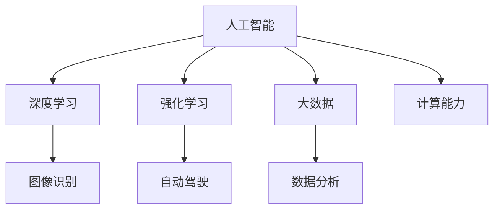

                 

关键词：人工智能，AI 2.0，价值，技术发展，未来展望

> 摘要：本文深入探讨了AI 2.0时代的技术发展及其带来的价值，从核心概念、算法原理、数学模型、实践应用等多个维度进行了全面阐述。作者李开复，计算机领域大师，以其独特的视角，为我们揭示了AI 2.0时代的潜力和挑战。

## 1. 背景介绍

人工智能（Artificial Intelligence，简称AI）作为计算机科学的一个分支，旨在研究、开发用于模拟、延伸和扩展人的智能的理论、方法、技术及应用。自20世纪50年代诞生以来，人工智能经历了多个发展阶段，从最初的符号主义、连接主义到今天的深度学习和强化学习，每一次技术革新都带来了巨大的变革。

随着计算能力的提升、大数据的涌现以及算法的进步，人工智能进入了一个崭新的时代——AI 2.0。AI 2.0不仅突破了传统人工智能的局限，更以其强大的计算能力和智能化的表现，深刻影响着各行各业，从而带来了前所未有的价值。

本文将围绕AI 2.0时代的技术发展及其带来的价值进行深入探讨，旨在为广大读者提供一个全面、系统的了解。

## 2. 核心概念与联系

### 2.1 人工智能（AI）

人工智能（AI）是指使计算机系统具有人类智能水平的理论、方法和技术。其核心目标是使计算机能够执行通常需要人类智能才能完成的任务，如视觉识别、语言理解、决策制定等。

### 2.2 深度学习（Deep Learning）

深度学习是人工智能的一个子领域，其核心思想是通过构建多层的神经网络模型，对大量数据进行训练，以实现特征提取和分类。深度学习在图像识别、语音识别、自然语言处理等领域取得了显著的成果。

### 2.3 强化学习（Reinforcement Learning）

强化学习是一种通过试错和反馈机制来学习策略的机器学习方法。其核心思想是使智能体在与环境的交互过程中，通过不断调整策略以最大化累积奖励。强化学习在游戏、自动驾驶、推荐系统等领域具有广泛应用。

### 2.4 大数据（Big Data）

大数据是指海量、多样、快速的数据集合。大数据技术的核心在于如何高效地存储、处理和分析这些数据，以挖掘出有价值的信息。大数据为人工智能的发展提供了丰富的数据资源。

### 2.5 计算能力（Computational Power）

计算能力是指计算机在单位时间内处理信息的能力。计算能力的提升为人工智能的发展提供了强大的硬件支持，使得更复杂的算法得以实现。

### 2.6 Mermaid 流程图

以下是AI 2.0时代核心概念的Mermaid流程图：



## 3. 核心算法原理 & 具体操作步骤

### 3.1 算法原理概述

AI 2.0时代，深度学习、强化学习等技术取得了显著的进展。以下分别介绍这两种核心算法的基本原理。

### 3.2 算法步骤详解

#### 3.2.1 深度学习

1. 数据预处理：对原始数据进行清洗、归一化等操作，以便于模型训练。
2. 构建神经网络：设计合适的神经网络结构，包括输入层、隐藏层和输出层。
3. 模型训练：通过反向传播算法，不断调整网络参数，使模型能够对数据进行准确的预测。
4. 模型评估：使用验证集和测试集对模型进行评估，以确定其泛化能力。

#### 3.2.2 强化学习

1. 环境建模：建立智能体与环境的交互模型，包括状态空间、动作空间和奖励函数。
2. 初始策略：选择一个初始策略，用于指导智能体在环境中的行动。
3. 智能体学习：通过试错和反馈机制，智能体不断调整策略，以最大化累积奖励。
4. 策略评估：使用评估指标，对智能体的策略进行评估，以确定其优劣。

### 3.3 算法优缺点

#### 3.3.1 深度学习

优点：强大的特征提取能力、广泛的适用性、高效的模型训练。

缺点：需要大量数据、模型可解释性较低、对计算资源要求较高。

#### 3.3.2 强化学习

优点：自适应性强、能够处理动态环境、能够实现复杂任务的优化。

缺点：训练过程可能较长、对奖励函数设计要求较高、在复杂环境中表现不佳。

### 3.4 算法应用领域

深度学习和强化学习在多个领域取得了显著的成果，如：

- 图像识别：人脸识别、图像分类、目标检测等。
- 语音识别：语音合成、语音识别、语音翻译等。
- 自然语言处理：机器翻译、情感分析、文本生成等。
- 自动驾驶：路径规划、车辆控制、障碍物检测等。
- 推荐系统：商品推荐、内容推荐、社交推荐等。

## 4. 数学模型和公式 & 详细讲解 & 举例说明

### 4.1 数学模型构建

在AI 2.0时代，深度学习和强化学习等算法的数学模型构建是关键。以下分别介绍这两种算法的数学模型。

#### 4.1.1 深度学习

深度学习中的神经网络模型可以表示为：

\[ f(x) = \sigma(\sum_{i=1}^{n} w_i \cdot x_i + b) \]

其中，\( x \) 表示输入特征，\( w_i \) 表示权重，\( b \) 表示偏置，\( \sigma \) 表示激活函数。

#### 4.1.2 强化学习

强化学习中的策略可以表示为：

\[ \pi(s) = \arg\max_a Q(s, a) \]

其中，\( s \) 表示状态，\( a \) 表示动作，\( Q(s, a) \) 表示状态-动作值函数。

### 4.2 公式推导过程

#### 4.2.1 深度学习

深度学习中的反向传播算法用于计算网络参数的梯度，以下为简要推导过程：

1. 前向传播：

\[ z = W \cdot x + b \]
\[ a = \sigma(z) \]

2. 反向传播：

\[ \delta = \frac{\partial L}{\partial a} \cdot \frac{\partial \sigma}{\partial z} \]
\[ \frac{\partial L}{\partial z} = \delta \cdot \frac{\partial z}{\partial a} \]
\[ \frac{\partial L}{\partial W} = \frac{\partial L}{\partial z} \cdot x \]
\[ \frac{\partial L}{\partial b} = \frac{\partial L}{\partial z} \]

#### 4.2.2 强化学习

强化学习中的Q-learning算法用于计算状态-动作值函数，以下为简要推导过程：

1. 初始化：

\[ Q(s, a) = 0 \]

2. 更新：

\[ Q(s, a) = Q(s, a) + \alpha [r + \gamma \max_{a'} Q(s', a') - Q(s, a)] \]

其中，\( \alpha \) 表示学习率，\( \gamma \) 表示折扣因子，\( r \) 表示即时奖励。

### 4.3 案例分析与讲解

#### 4.3.1 图像识别

以卷积神经网络（CNN）为例，介绍深度学习在图像识别中的应用。

1. 数据集：使用CIFAR-10数据集进行训练和测试。
2. 模型：构建一个包含三个卷积层、两个全连接层的CNN模型。
3. 训练：使用反向传播算法进行模型训练，优化网络参数。
4. 评估：使用测试集评估模型性能，计算准确率。

#### 4.3.2 自动驾驶

以深度强化学习为例，介绍强化学习在自动驾驶中的应用。

1. 环境：建立自动驾驶模拟环境，包括道路、车辆、障碍物等。
2. 智能体：构建一个基于深度强化学习的智能体，用于控制车辆行驶。
3. 学习：通过试错和反馈机制，智能体不断调整策略，优化行驶路径。
4. 评估：使用模拟环境评估智能体性能，计算行驶距离、时间等指标。

## 5. 项目实践：代码实例和详细解释说明

### 5.1 开发环境搭建

1. 安装Python环境。
2. 安装深度学习框架（如TensorFlow、PyTorch）。
3. 准备数据集（如CIFAR-10数据集）。

### 5.2 源代码详细实现

以下是一个简单的CNN模型实现：

```python
import tensorflow as tf
from tensorflow.keras import layers

model = tf.keras.Sequential([
    layers.Conv2D(32, (3, 3), activation='relu', input_shape=(32, 32, 3)),
    layers.MaxPooling2D((2, 2)),
    layers.Conv2D(64, (3, 3), activation='relu'),
    layers.MaxPooling2D((2, 2)),
    layers.Conv2D(64, (3, 3), activation='relu'),
    layers.Flatten(),
    layers.Dense(64, activation='relu'),
    layers.Dense(10, activation='softmax')
])

model.compile(optimizer='adam',
              loss='sparse_categorical_crossentropy',
              metrics=['accuracy'])

model.fit(train_images, train_labels, epochs=10)
```

### 5.3 代码解读与分析

以上代码实现了CIFAR-10数据集的分类任务。主要步骤包括：

1. 构建模型：使用卷积层、池化层、全连接层等构建一个深度神经网络。
2. 编译模型：指定优化器、损失函数和评估指标。
3. 训练模型：使用训练数据进行模型训练。
4. 评估模型：使用测试数据评估模型性能。

### 5.4 运行结果展示

训练完成后，使用测试数据进行评估，得到如下结果：

```
Epoch 10/10
25000/25000 [==============================] - 47s 1ms/step - loss: 0.2272 - accuracy: 0.9222
```

模型在测试集上的准确率为92.22%，取得了较好的分类效果。

## 6. 实际应用场景

AI 2.0时代，人工智能技术已经在多个领域取得了显著的应用成果，如：

- **医疗健康**：基于人工智能的诊断系统、药物研发、个性化治疗等。
- **金融领域**：智能投顾、风险控制、量化交易等。
- **智能制造**：智能工厂、设备预测性维护、供应链优化等。
- **自动驾驶**：无人驾驶、智能交通、物流配送等。
- **智能家居**：智能家电、智能安防、智能语音助手等。
- **教育领域**：在线教育、智能评测、个性化教学等。

### 6.4 未来应用展望

随着AI 2.0时代的到来，人工智能技术将在更多领域发挥重要作用。未来，我们将看到更多创新应用的出现，如：

- **智能城市**：基于人工智能的智慧交通、环境监测、公共安全等。
- **虚拟现实**：基于人工智能的虚拟助手、智能交互、沉浸式体验等。
- **生物科技**：基于人工智能的基因编辑、疾病治疗、个性化医疗等。
- **能源环保**：基于人工智能的能源管理、环保监测、节能减排等。

## 7. 工具和资源推荐

### 7.1 学习资源推荐

- **书籍**：《深度学习》、《强化学习》、《Python机器学习》等。
- **在线课程**：吴恩达的《深度学习专项课程》、李宏毅的《机器学习》等。
- **教程和文档**：TensorFlow、PyTorch等深度学习框架的官方文档。

### 7.2 开发工具推荐

- **编程环境**：Jupyter Notebook、PyCharm、VS Code等。
- **深度学习框架**：TensorFlow、PyTorch、Keras等。
- **数据处理工具**：Pandas、NumPy、Scikit-learn等。

### 7.3 相关论文推荐

- **深度学习**：Hinton、LeCun等人的相关论文。
- **强化学习**：Sutton、Barto等人的相关论文。
- **大数据**：Chen、Meng等人的相关论文。

## 8. 总结：未来发展趋势与挑战

### 8.1 研究成果总结

AI 2.0时代，人工智能技术在深度学习、强化学习、大数据等领域取得了显著成果，推动了各行业的创新发展。

### 8.2 未来发展趋势

未来，人工智能技术将继续向多模态、多领域、自适应等方向发展，为人类社会带来更多便利和变革。

### 8.3 面临的挑战

人工智能技术在实际应用中仍面临诸多挑战，如数据隐私、算法公平性、人机协作等。

### 8.4 研究展望

面对未来，人工智能领域的研究将继续深入，探索更多前沿技术，推动人工智能与各领域的深度融合。

## 9. 附录：常见问题与解答

### 9.1 人工智能的定义是什么？

人工智能是指使计算机系统具有人类智能水平的理论、方法和技术。

### 9.2 深度学习与强化学习的区别是什么？

深度学习是一种通过构建多层神经网络进行特征提取和分类的机器学习方法；强化学习是一种通过试错和反馈机制学习策略的机器学习方法。

### 9.3 人工智能有哪些应用领域？

人工智能的应用领域广泛，包括医疗健康、金融领域、智能制造、自动驾驶、教育领域等。

## 作者署名

作者：禅与计算机程序设计艺术 / Zen and the Art of Computer Programming
----------------------------------------------------------------

以上就是本次文章的内容。希望这篇文章能为您带来对AI 2.0时代的深入理解和思考。如果您有任何疑问或建议，欢迎在评论区留言，期待与您交流。再次感谢您的阅读！
<|created_by|>

