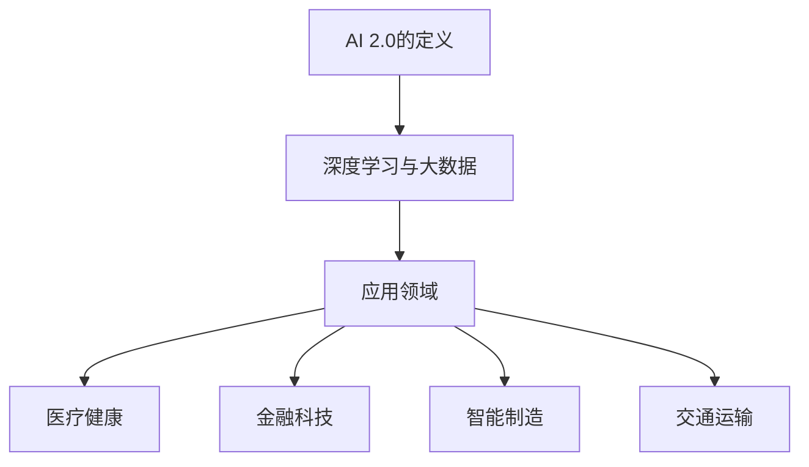

                 

在人工智能（AI）飞速发展的今天，李开复博士作为人工智能领域的领军人物，他的观点和见解无疑对整个行业产生了深远的影响。《李开复：AI 2.0 时代的创业机会》一书深入探讨了AI 2.0时代的创新与创业机会。本文将以李开复博士的视角，结合现代技术的进步，对AI 2.0时代的创业机会进行深入分析。

## 关键词

- 人工智能（AI）
- 李开复
- AI 2.0
- 创业机会
- 技术进步
- 创新应用

## 摘要

本文将围绕李开复博士在《AI 2.0时代的创业机会》一书中的核心观点，探讨AI 2.0时代的创新趋势和创业机遇。通过对AI技术的深入剖析，本文将揭示AI 2.0在医疗、金融、教育等领域的应用前景，并提出创业者如何抓住AI时代的风口，实现创新的策略。

## 1. 背景介绍

人工智能的发展历程可以追溯到20世纪50年代。当时，人工智能的概念被首次提出，研究者们希望通过计算机模拟人类智能。然而，早期的人工智能研究由于计算能力的限制，进展缓慢。随着计算技术的发展，尤其是深度学习的突破，人工智能进入了新的时代，我们称之为AI 2.0。

AI 2.0时代的特点在于其高度自动化和智能化。传统的AI 1.0主要依赖于规则和符号逻辑，而AI 2.0则依赖于神经网络和大数据，能够自主学习、自我优化，实现更高级的智能。李开复博士认为，AI 2.0时代的到来，为创业者提供了前所未有的机会，特别是在那些需要高度智能化的领域。

## 2. 核心概念与联系

### 2.1 AI 2.0的定义与特点

AI 2.0，即人工智能的第二阶段，主要依赖于深度学习和大数据。深度学习是一种通过多层神经网络模拟人类大脑学习方式的技术。它能够自动提取特征，进行分类和预测。与传统的机器学习方法相比，深度学习具有更强的泛化能力和自主学习能力。

### 2.2 AI 2.0的应用领域

AI 2.0的应用领域非常广泛，包括但不限于：

- **医疗健康**：利用AI进行疾病诊断、药物研发和个性化治疗。
- **金融科技**：利用AI进行风险评估、投资策略和智能客服。
- **智能制造**：利用AI进行质量控制、故障预测和自动化生产。
- **交通运输**：利用AI进行自动驾驶、交通流量管理和智慧城市。

### 2.3 Mermaid流程图



## 3. 核心算法原理 & 具体操作步骤

### 3.1 算法原理概述

AI 2.0的核心算法包括深度学习、强化学习和自然语言处理。深度学习通过多层神经网络模拟人脑的学习过程；强化学习通过不断尝试和反馈优化策略；自然语言处理则致力于理解和生成自然语言。

### 3.2 算法步骤详解

- **深度学习**：收集大量数据，使用多层神经网络提取特征，通过反向传播算法优化网络参数。
- **强化学习**：定义奖励机制，通过不断尝试和反馈，优化策略以最大化长期回报。
- **自然语言处理**：使用词嵌入和序列模型，对文本数据进行处理，实现语义理解和生成。

### 3.3 算法优缺点

- **优点**：能够自动学习和优化，适应性强，处理复杂数据能力强大。
- **缺点**：对数据量和计算资源要求高，训练过程复杂，对专家知识依赖大。

### 3.4 算法应用领域

AI 2.0算法广泛应用于各个领域，如：

- **医疗健康**：用于疾病诊断和个性化治疗。
- **金融科技**：用于风险评估和智能投资。
- **智能制造**：用于质量控制和自动化生产。
- **交通运输**：用于自动驾驶和智慧城市。

## 4. 数学模型和公式 & 详细讲解 & 举例说明

### 4.1 数学模型构建

深度学习中的数学模型主要包括：

- **神经网络**：多层感知机（MLP）、卷积神经网络（CNN）和循环神经网络（RNN）等。
- **优化算法**：梯度下降（GD）、随机梯度下降（SGD）和Adam优化器等。

### 4.2 公式推导过程

以卷积神经网络（CNN）为例，其激活函数可以表示为：

$$ f(x) = \max(0, x) $$

其中，$x$ 为输入值。

### 4.3 案例分析与讲解

以图像分类任务为例，使用CNN对猫狗图片进行分类。

1. **数据准备**：收集大量猫狗图片，并对其进行预处理。
2. **模型构建**：定义CNN模型，包括卷积层、池化层和全连接层。
3. **模型训练**：使用训练数据对模型进行训练，优化模型参数。
4. **模型评估**：使用测试数据对模型进行评估，计算准确率。

## 5. 项目实践：代码实例和详细解释说明

### 5.1 开发环境搭建

搭建深度学习开发环境，包括Python、TensorFlow和Keras等。

### 5.2 源代码详细实现

以下是一个简单的CNN模型实现：

```python
import tensorflow as tf
from tensorflow.keras.models import Sequential
from tensorflow.keras.layers import Conv2D, MaxPooling2D, Flatten, Dense

model = Sequential()
model.add(Conv2D(32, (3, 3), activation='relu', input_shape=(64, 64, 3)))
model.add(MaxPooling2D((2, 2)))
model.add(Conv2D(64, (3, 3), activation='relu'))
model.add(MaxPooling2D((2, 2)))
model.add(Flatten())
model.add(Dense(128, activation='relu'))
model.add(Dense(1, activation='sigmoid'))

model.compile(optimizer='adam', loss='binary_crossentropy', metrics=['accuracy'])
```

### 5.3 代码解读与分析

上述代码定义了一个简单的CNN模型，用于二分类任务。模型包括两个卷积层、两个池化层和一个全连接层。模型使用Adam优化器进行训练，并使用二分类交叉熵作为损失函数。

### 5.4 运行结果展示

```python
model.fit(x_train, y_train, epochs=10, batch_size=32, validation_data=(x_test, y_test))
```

训练完成后，使用测试数据对模型进行评估：

```python
model.evaluate(x_test, y_test)
```

## 6. 实际应用场景

### 6.1 医疗健康

AI在医疗健康领域的应用前景广阔。通过AI，可以实现：

- **疾病诊断**：使用深度学习模型对医学图像进行分析，提高疾病诊断的准确性。
- **药物研发**：利用AI进行药物筛选和优化，加速新药研发进程。
- **个性化治疗**：根据患者的基因数据和病情，提供个性化的治疗方案。

### 6.2 金融科技

金融科技是AI 2.0的重要应用领域。AI在金融科技的应用包括：

- **风险控制**：使用机器学习算法进行风险评估，降低金融风险。
- **智能投资**：利用AI进行市场分析和投资策略优化，提高投资回报。
- **智能客服**：使用自然语言处理技术，实现智能客服系统，提高客户满意度。

### 6.3 教育

AI在教育领域的应用也在逐步扩大。通过AI，可以实现：

- **个性化学习**：根据学生的学习情况和兴趣，提供个性化的学习内容。
- **智能评测**：使用AI对学生的作业和考试进行智能评测，提高教育质量。
- **教育数据挖掘**：通过对教育数据的分析，发现学生的学习规律和需求。

## 7. 未来应用展望

随着AI技术的不断发展，未来AI 2.0将在更多领域发挥重要作用。例如：

- **智能交通**：通过AI实现自动驾驶、智能调度和智慧城市。
- **智能农业**：利用AI进行作物监测、病虫害预测和精准施肥。
- **智能制造**：通过AI实现智能制造、智能质检和智能物流。

## 8. 工具和资源推荐

### 8.1 学习资源推荐

- **《深度学习》（Goodfellow et al.）**：经典教材，全面介绍深度学习的基础知识。
- **《Python机器学习》（Sebastian Raschka）**：通过Python实现机器学习算法，适合初学者。

### 8.2 开发工具推荐

- **TensorFlow**：谷歌开源的深度学习框架，支持多种平台。
- **Keras**：基于TensorFlow的高级神经网络API，易于使用。

### 8.3 相关论文推荐

- **“Deep Learning” by Ian Goodfellow, Yoshua Bengio, Aaron Courville**：深度学习领域的经典论文。
- **“Gradient Descent” by Yann LeCun**：关于梯度下降优化算法的论文。

## 9. 总结：未来发展趋势与挑战

### 9.1 研究成果总结

AI 2.0时代的研究成果主要体现在深度学习、强化学习和自然语言处理等领域的突破。这些研究成果为AI在各个领域的应用奠定了基础。

### 9.2 未来发展趋势

未来AI 2.0的发展趋势包括：

- **算法优化**：不断优化算法，提高模型性能。
- **跨领域应用**：拓展AI在各个领域的应用，实现跨界融合。
- **伦理与法规**：加强AI伦理研究和法规制定，保障AI安全。

### 9.3 面临的挑战

AI 2.0时代面临的挑战包括：

- **数据隐私**：如何保护用户数据隐私是一个亟待解决的问题。
- **算法公平性**：确保算法在不同群体中的公平性是一个重要的挑战。
- **计算资源**：深度学习对计算资源的需求巨大，如何优化计算资源利用是一个挑战。

### 9.4 研究展望

未来，AI 2.0的研究将重点关注：

- **泛化能力**：提高模型的泛化能力，使其能够处理更多样化的任务。
- **可解释性**：增强模型的可解释性，使其能够被用户理解和信任。
- **跨学科融合**：将AI与其他学科（如生物学、心理学等）进行融合，推动AI的创新发展。

## 附录：常见问题与解答

### 1. Q：什么是深度学习？
A：深度学习是一种通过多层神经网络模拟人类大脑学习方式的技术。它能够自动提取特征，进行分类和预测。

### 2. Q：AI 2.0与AI 1.0有什么区别？
A：AI 1.0主要依赖于规则和符号逻辑，而AI 2.0则依赖于神经网络和大数据，能够实现更高级的智能。

### 3. Q：AI在医疗健康领域的应用有哪些？
A：AI在医疗健康领域的应用包括疾病诊断、药物研发和个性化治疗等。

### 4. Q：如何搭建深度学习开发环境？
A：搭建深度学习开发环境通常需要安装Python、TensorFlow和Keras等工具。

### 5. Q：AI技术的未来发展趋势是什么？
A：AI技术的未来发展趋势包括算法优化、跨领域应用和伦理与法规等。

### 6. Q：AI 2.0时代的创业机会有哪些？
A：AI 2.0时代的创业机会广泛，包括医疗健康、金融科技、智能制造和交通运输等领域。

## 作者署名

作者：禅与计算机程序设计艺术 / Zen and the Art of Computer Programming

[文章结束]
----------------------------------------------------------------

这是文章的初步草稿，接下来我会根据上述结构和内容进一步进行修改和完善。如果您有任何建议或要求，请随时告诉我。

