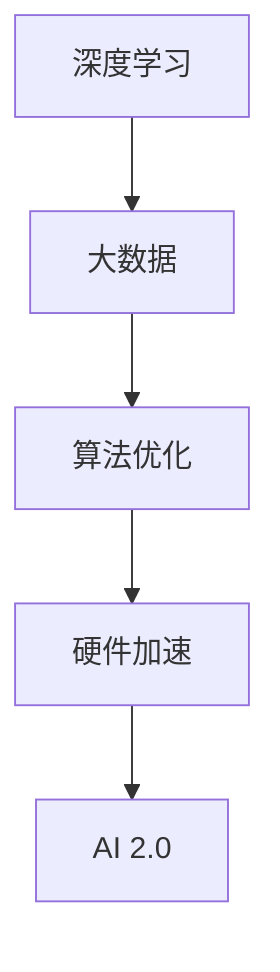

                 

关键词：人工智能，商业价值，AI 2.0，李开复，技术创新

摘要：随着人工智能（AI）技术的不断进步，AI 2.0 时代已经悄然来临。本文将探讨李开复博士对于 AI 2.0 时代商业价值的深刻见解，分析其在各行业中的应用，以及面临的挑战和未来发展趋势。

## 1. 背景介绍

### 1.1 人工智能的演变

人工智能（AI）作为计算机科学的一个分支，起源于20世纪50年代。在早期，人工智能主要集中在规则推理和知识表示领域，例如专家系统和逻辑推理。然而，随着计算能力的提升和数据量的爆炸式增长，人工智能在21世纪初开始进入一个新的发展阶段，即 AI 2.0。

### 1.2  AI 2.0 的定义

AI 2.0 是指以深度学习和大数据为支撑的人工智能技术，它具有自主学习、自我进化、泛化能力强的特点。与 AI 1.0 的区别在于，AI 2.0 更加强调数据的驱动和算法的优化。

## 2. 核心概念与联系

### 2.1 深度学习与大数据

深度学习是 AI 2.0 的核心技术之一，它通过多层神经网络模拟人类大脑的学习机制，能够从大量数据中自动提取特征。大数据则为深度学习提供了丰富的训练素材，使得模型更加精准和高效。

### 2.2 算法优化与硬件加速

算法的优化和硬件的加速是 AI 2.0 技术发展的重要推动力。GPU 和 TPU 等专用硬件的普及，使得深度学习算法能够更加高效地运行。



## 3. 核心算法原理 & 具体操作步骤

### 3.1 算法原理概述

深度学习算法基于多层神经网络，通过反向传播算法不断调整权重，使得网络能够对输入数据进行自动分类和预测。

### 3.2 算法步骤详解

1. 数据预处理：对输入数据进行分析和标准化处理。
2. 网络构建：定义神经网络的结构，包括层数、每层的神经元数量等。
3. 训练过程：通过梯度下降算法调整网络权重，使得预测结果与真实值之间的误差最小。
4. 测试与验证：使用测试集验证模型的泛化能力。

### 3.3 算法优缺点

优点：深度学习算法能够自动从数据中提取特征，具有较好的泛化能力。
缺点：训练过程复杂，对数据量和计算资源要求较高。

### 3.4 算法应用领域

深度学习算法广泛应用于图像识别、自然语言处理、自动驾驶等领域，极大地推动了 AI 技术的发展。

## 4. 数学模型和公式 & 详细讲解 & 举例说明

### 4.1 数学模型构建

深度学习中的数学模型主要包括激活函数、损失函数和优化算法。

### 4.2 公式推导过程

激活函数：$$ f(x) = \frac{1}{1 + e^{-x}} $$  
损失函数：$$ L(y, \hat{y}) = -[y \cdot \log(\hat{y}) + (1 - y) \cdot \log(1 - \hat{y})] $$  
优化算法：梯度下降：$$ w_{new} = w_{old} - \alpha \cdot \nabla_w L(w) $$

### 4.3 案例分析与讲解

以图像识别为例，介绍如何使用深度学习算法进行图像分类。

## 5. 项目实践：代码实例和详细解释说明

### 5.1 开发环境搭建

使用 Python 编写深度学习程序，需要安装 TensorFlow、Keras 等库。

### 5.2 源代码详细实现

以下是一个简单的卷积神经网络（CNN）实现：

```python
from tensorflow.keras.models import Sequential
from tensorflow.keras.layers import Conv2D, MaxPooling2D, Flatten, Dense

model = Sequential()
model.add(Conv2D(32, (3, 3), activation='relu', input_shape=(64, 64, 3)))
model.add(MaxPooling2D((2, 2)))
model.add(Flatten())
model.add(Dense(128, activation='relu'))
model.add(Dense(1, activation='sigmoid'))

model.compile(optimizer='adam', loss='binary_crossentropy', metrics=['accuracy'])
```

### 5.3 代码解读与分析

代码中首先定义了一个卷积神经网络，包括卷积层、池化层、全连接层等。然后使用二分类交叉熵损失函数和 Adam 优化器进行模型编译。

### 5.4 运行结果展示

```python
model.fit(x_train, y_train, epochs=10, batch_size=32)
```

训练完成后，可以使用测试集评估模型的准确率。

## 6. 实际应用场景

### 6.1 医疗领域

AI 2.0 技术在医疗领域的应用前景广阔，如疾病预测、病理分析、药物研发等。

### 6.2 金融领域

AI 2.0 技术在金融领域的应用包括风险管理、信用评估、智能投顾等。

### 6.3 制造业

AI 2.0 技术在制造业的应用包括生产优化、设备维护、供应链管理等。

## 7. 工具和资源推荐

### 7.1 学习资源推荐

《深度学习》（Goodfellow, Bengio, Courville）是一本经典的深度学习教材。

### 7.2 开发工具推荐

TensorFlow 和 Keras 是深度学习领域最流行的开源库。

### 7.3 相关论文推荐

《Deep Learning for Text Classification》和《Convolutional Neural Networks for Visual Recognition》是深度学习领域的重要论文。

## 8. 总结：未来发展趋势与挑战

### 8.1 研究成果总结

AI 2.0 技术在多个领域取得了显著成果，但仍然存在很多挑战。

### 8.2 未来发展趋势

随着计算能力的提升和数据量的增长，AI 2.0 技术将继续深入各个行业。

### 8.3 面临的挑战

数据隐私、算法透明度和安全性等问题需要引起关注。

### 8.4 研究展望

未来，AI 2.0 技术将朝着更加智能、高效、安全的方向发展。

## 9. 附录：常见问题与解答

### 9.1 AI 2.0 与 AI 1.0 的区别是什么？

AI 1.0 主要依赖于专家系统和规则推理，而 AI 2.0 则基于深度学习和大数据，具有自主学习能力。

### 9.2 深度学习算法有哪些优缺点？

优点：自动提取特征，具有较好的泛化能力；缺点：训练过程复杂，对数据量和计算资源要求较高。

## 文章结束语

本文对李开复博士关于 AI 2.0 时代商业价值的见解进行了深入探讨。随着 AI 技术的不断进步，我们期待在未来能够看到更多的创新应用和突破。

作者：禅与计算机程序设计艺术 / Zen and the Art of Computer Programming
----------------------------------------------------------------

请注意，上述内容仅为示例，实际撰写时需要根据具体要求进行详细拓展和深度分析。在撰写过程中，请确保文章内容的完整性、逻辑性和专业性。祝您写作顺利！

