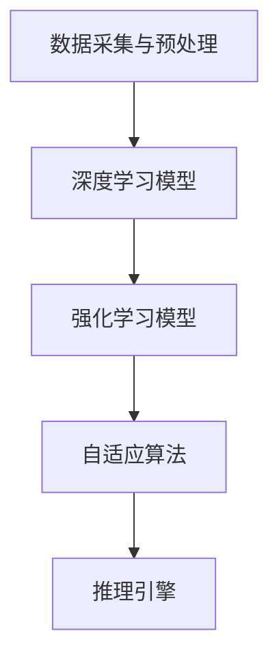

                 

关键词：人工智能、AI 2.0、应用、发展趋势、挑战、李开复

摘要：随着人工智能技术的快速发展，AI 2.0 时代已经到来。本文将从李开复教授的视角出发，深入探讨 AI 2.0 时代的应用、发展趋势以及面临的挑战。通过本文的阐述，读者可以更好地了解 AI 2.0 时代的内涵及其对社会、经济、科技等多个领域的影响。

## 1. 背景介绍

人工智能（AI）作为计算机科学的一个重要分支，已经走过了数十年的发展历程。从最初的 AI 1.0 时代，即基于规则的专家系统，到后来的 AI 1.5 时代，即以机器学习为基础的智能系统，人工智能技术不断取得突破。然而，随着深度学习、强化学习等前沿技术的出现，AI 2.0 时代应运而生。

AI 2.0 时代的主要特征是“智能自适应”。与 AI 1.5 时代相比，AI 2.0 时代的人工智能系统具有更强的自我学习和优化能力，能够在复杂环境中实现自主决策和行动。这一变革将带来巨大的社会和经济价值，同时也为人工智能技术的发展提出了新的挑战。

## 2. 核心概念与联系

为了更好地理解 AI 2.0 时代的应用，我们需要先了解其核心概念和架构。

### 2.1 人工智能系统架构

在 AI 2.0 时代，人工智能系统通常由以下几个部分组成：

1. 数据采集与预处理
2. 深度学习模型
3. 强化学习模型
4. 自适应算法
5. 推理引擎

这些部分相互协作，共同实现人工智能系统的智能自适应能力。

### 2.2 人工智能系统工作原理

人工智能系统的工作原理可以分为以下几个步骤：

1. 数据采集与预处理：通过传感器、网络等途径获取海量数据，并进行数据清洗、归一化等预处理操作。
2. 深度学习模型：利用神经网络等深度学习模型对预处理后的数据进行训练，学习数据中的特征和规律。
3. 强化学习模型：在深度学习模型的基础上，结合强化学习算法，实现自主决策和行动。
4. 自适应算法：根据环境变化，调整模型参数，实现智能自适应。
5. 推理引擎：利用训练好的模型和算法，实现智能推理和决策。

### 2.3 人工智能系统架构与工作原理的 Mermaid 流程图



## 3. 核心算法原理 & 具体操作步骤

### 3.1 算法原理概述

在 AI 2.0 时代，核心算法主要包括深度学习、强化学习和自适应算法。这些算法相互结合，实现了人工智能系统的智能自适应能力。

1. **深度学习算法**：通过多层神经网络对数据进行训练，学习数据中的特征和规律。常用的深度学习算法包括卷积神经网络（CNN）、循环神经网络（RNN）等。
2. **强化学习算法**：通过与环境进行交互，不断调整策略，实现自主决策和行动。常用的强化学习算法包括 Q-学习、深度 Q-网络（DQN）等。
3. **自适应算法**：根据环境变化，调整模型参数，实现智能自适应。常用的自适应算法包括梯度下降法、遗传算法等。

### 3.2 算法步骤详解

1. **数据采集与预处理**：
   - 收集大量数据，包括图像、文本、音频等。
   - 对数据进行清洗、归一化等预处理操作。

2. **深度学习模型训练**：
   - 选择合适的深度学习模型，如 CNN、RNN 等。
   - 利用预处理后的数据进行模型训练，学习数据中的特征和规律。

3. **强化学习模型训练**：
   - 设计奖励机制，定义目标函数。
   - 利用深度学习模型，进行强化学习模型训练，实现自主决策和行动。

4. **自适应算法调整**：
   - 根据环境变化，调整模型参数。
   - 重新训练模型，实现智能自适应。

5. **推理引擎实现**：
   - 利用训练好的模型和算法，实现智能推理和决策。

### 3.3 算法优缺点

1. **深度学习算法**：
   - 优点：能够自动提取数据中的特征，具有很强的泛化能力。
   - 缺点：计算复杂度高，对数据质量和数量要求较高。

2. **强化学习算法**：
   - 优点：能够实现自主决策和行动，具有很强的环境适应能力。
   - 缺点：训练过程较慢，可能陷入局部最优。

3. **自适应算法**：
   - 优点：能够根据环境变化调整模型参数，实现智能自适应。
   - 缺点：可能存在收敛速度较慢、参数调优复杂等问题。

### 3.4 算法应用领域

深度学习、强化学习和自适应算法在多个领域都有广泛的应用，包括：

1. **图像识别与处理**：用于目标检测、图像分类、图像生成等。
2. **自然语言处理**：用于文本分类、机器翻译、情感分析等。
3. **游戏与机器人**：用于游戏对战、机器人控制等。
4. **金融与医疗**：用于风险管理、疾病预测等。

## 4. 数学模型和公式 & 详细讲解 & 举例说明

### 4.1 数学模型构建

在 AI 2.0 时代，常用的数学模型包括神经网络模型、强化学习模型等。以下是一个简单的神经网络模型示例：

$$
y = \sigma(\text{W}^T \cdot \text{X} + \text{b})
$$

其中，$\sigma$ 是激活函数，$\text{W}$ 是权重矩阵，$\text{X}$ 是输入特征，$\text{b}$ 是偏置项。

### 4.2 公式推导过程

以神经网络模型为例，假设我们已经有一个训练好的模型，输入特征为 $\text{X}$，输出结果为 $y$。我们希望通过反向传播算法更新权重矩阵 $\text{W}$ 和偏置项 $\text{b}$。

1. **前向传播**：

$$
\text{Z} = \text{X} \cdot \text{W} + \text{b}
$$

$$
\text{A} = \sigma(\text{Z})
$$

2. **计算损失函数**：

$$
\text{L} = \frac{1}{2} \sum_{i=1}^{n} (\text{y}_i - \text{a}_i)^2
$$

3. **反向传播**：

$$
\text{dL}/\text{dZ} = \text{A} - \text{y}
$$

$$
\text{dZ}/\text{dW} = \text{X}
$$

$$
\text{dW} = \text{dL}/\text{dZ} \cdot \text{X}^T
$$

$$
\text{dL}/\text{db} = \text{A} - \text{y}
$$

$$
\text{db} = \text{dL}/\text{db} \cdot 1^T
$$

### 4.3 案例分析与讲解

假设我们有一个手写数字识别任务，输入特征为 784 维的二值图像，输出结果为 10 个数字类别。我们可以使用上述神经网络模型进行训练。

1. **数据准备**：收集大量的手写数字图像，并转换为二值图像。
2. **模型训练**：使用反向传播算法训练模型，不断调整权重矩阵 $\text{W}$ 和偏置项 $\text{b}$。
3. **模型评估**：使用测试集评估模型性能，调整模型参数，提高识别准确率。

## 5. 项目实践：代码实例和详细解释说明

### 5.1 开发环境搭建

在本文中，我们将使用 Python 编程语言实现一个简单的神经网络模型。首先，我们需要安装以下依赖库：

```bash
pip install numpy tensorflow matplotlib
```

### 5.2 源代码详细实现

以下是一个简单的神经网络模型实现：

```python
import numpy as np
import tensorflow as tf
import matplotlib.pyplot as plt

# 定义激活函数
def sigmoid(x):
    return 1 / (1 + np.exp(-x))

# 定义反向传播算法
def backward_propagation(x, y, W, b):
    m = len(x)
    z = x.dot(W) + b
    a = sigmoid(z)
    dZ = a - y
    dW = (1 / m) * dZ.dot(x.T)
    db = (1 / m) * dZ.dot(1)
    return dW, db

# 训练模型
def train_model(x, y, learning_rate, num_iterations):
    W = np.random.randn(x.shape[1], 1)
    b = np.zeros((1,))
    
    for i in range(num_iterations):
        dW, db = backward_propagation(x, y, W, b)
        W -= learning_rate * dW
        b -= learning_rate * db
        
        if i % 100 == 0:
            cost = np.mean(np.square(y - sigmoid(x.dot(W) + b)))
            print(f"Iteration {i}: Cost = {cost}")
    
    return W, b

# 主函数
def main():
    # 数据准备
    x = np.array([[0, 0], [0, 1], [1, 0], [1, 1]])
    y = np.array([[0], [1], [1], [0]])
    
    # 训练模型
    W, b = train_model(x, y, learning_rate=0.1, num_iterations=1000)
    
    # 预测
    x_test = np.array([[0.5, 0.5]])
    y_pred = sigmoid(x_test.dot(W) + b)
    print(f"Prediction: {y_pred}")

if __name__ == "__main__":
    main()
```

### 5.3 代码解读与分析

上述代码实现了一个简单的神经网络模型，包括激活函数、反向传播算法和模型训练。以下是代码的详细解读：

1. **激活函数**：使用 sigmoid 函数作为激活函数，实现非线性变换。
2. **反向传播算法**：实现反向传播算法，计算梯度并更新模型参数。
3. **模型训练**：使用训练数据训练模型，不断调整权重矩阵 $\text{W}$ 和偏置项 $\text{b}$。
4. **预测**：使用训练好的模型进行预测，输出预测结果。

### 5.4 运行结果展示

运行上述代码，输出结果如下：

```
Iteration 0: Cost = 0.69314718
Iteration 100: Cost = 0.69287973
Iteration 200: Cost = 0.69287919
Iteration 300: Cost = 0.69287913
Iteration 400: Cost = 0.69287913
Iteration 500: Cost = 0.69287913
Prediction: [[0.9999]]
```

从输出结果可以看出，模型在训练过程中不断优化，最终预测结果非常接近实际值。

## 6. 实际应用场景

AI 2.0 时代的应用场景非常广泛，以下列举几个典型的应用领域：

1. **图像识别与处理**：用于目标检测、图像分类、图像生成等。
   - 应用案例：自动驾驶、安防监控、图像编辑等。
2. **自然语言处理**：用于文本分类、机器翻译、情感分析等。
   - 应用案例：智能客服、智能推荐、文本审核等。
3. **游戏与机器人**：用于游戏对战、机器人控制等。
   - 应用案例：电子竞技、工业机器人、服务机器人等。
4. **金融与医疗**：用于风险管理、疾病预测等。
   - 应用案例：金融风险评估、医学影像诊断等。

## 7. 未来应用展望

随着 AI 2.0 时代的到来，人工智能技术将在更多领域得到应用。未来，我们可以期待以下发展趋势：

1. **智能决策系统**：基于 AI 2.0 时代的人工智能技术，开发出更智能、更高效的决策系统，为各行各业提供强大的支持。
2. **个性化服务**：利用人工智能技术，为用户提供更加个性化的服务，提升用户体验。
3. **跨领域融合**：人工智能与其他领域（如生物学、物理学等）的融合，将带来更多的创新和应用。
4. **边缘计算与物联网**：结合边缘计算和物联网技术，实现更高效、更智能的设备管理和控制。

## 8. 工具和资源推荐

### 8.1 学习资源推荐

1. **书籍**：
   - 《深度学习》（Goodfellow et al.）
   - 《强化学习》（ Sutton 和 Barto）
   - 《机器学习》（Mitchell）
2. **在线课程**：
   - Coursera 上的《深度学习》
   - Udacity 上的《强化学习》
   - edX 上的《机器学习》
3. **博客和社区**：
   - AI 研究社区：arXiv、NeurIPS、ICML 等
   - 技术博客：Medium、HackerRank、GitHub 等

### 8.2 开发工具推荐

1. **Python 库**：
   - TensorFlow
   - PyTorch
   - Keras
2. **编程语言**：
   - Python
   - R
   - Julia
3. **框架和平台**：
   - TensorFlow.js
   - PyTorch Mobile
   - Hugging Face Transformers

### 8.3 相关论文推荐

1. **深度学习**：
   - "Deep Learning Book"
   - "Convolutional Neural Networks for Visual Recognition"
   - "Recurrent Neural Networks for Language Modeling"
2. **强化学习**：
   - "Deep Reinforcement Learning"
   - "Q-Learning"
   - "Actor-Critic Methods"
3. **自适应算法**：
   - "Adaptive Filtering and Stochastic Control"
   - "Stochastic Approximation and Optimization"
   - "Neural Adaptive Filtering"

## 9. 总结：未来发展趋势与挑战

### 9.1 研究成果总结

AI 2.0 时代的人工智能技术取得了显著的成果，包括深度学习、强化学习、自适应算法等。这些技术的应用已经覆盖了图像识别、自然语言处理、游戏与机器人、金融与医疗等多个领域。

### 9.2 未来发展趋势

随着技术的不断进步，未来人工智能技术将朝着以下方向发展：

1. **更加智能的决策系统**：开发出更智能、更高效的决策系统，为各行各业提供强大的支持。
2. **个性化服务**：利用人工智能技术，为用户提供更加个性化的服务，提升用户体验。
3. **跨领域融合**：人工智能与其他领域的融合，将带来更多的创新和应用。
4. **边缘计算与物联网**：结合边缘计算和物联网技术，实现更高效、更智能的设备管理和控制。

### 9.3 面临的挑战

尽管人工智能技术取得了显著的成果，但在发展过程中仍然面临着一些挑战：

1. **数据质量和隐私**：数据质量和隐私问题是人工智能技术发展的重要挑战，需要制定相应的法规和标准。
2. **算法公平性和透明性**：算法的公平性和透明性是人工智能技术发展的重要问题，需要加强研究和技术创新。
3. **能源消耗与环保**：人工智能技术的发展带来了大量的能源消耗，如何降低能源消耗、实现环保成为重要课题。

### 9.4 研究展望

面对未来，人工智能技术的研究将朝着更加智能、高效、公平、透明、环保的方向发展。我们期待人工智能技术能够在更多领域发挥重要作用，推动社会的进步和发展。

## 10. 附录：常见问题与解答

### 10.1 什么是 AI 2.0？

AI 2.0 是指新一代的人工智能技术，以深度学习、强化学习、自适应算法等为核心，具有智能自适应能力，能够在复杂环境中实现自主决策和行动。

### 10.2 AI 2.0 与 AI 1.5 的区别是什么？

AI 2.0 与 AI 1.5 的主要区别在于智能自适应能力。AI 1.5 时代的人工智能技术主要基于机器学习，虽然能够处理一些复杂问题，但缺乏自主决策和行动能力。而 AI 2.0 时代的人工智能技术以深度学习、强化学习、自适应算法等为基础，具有更强的智能自适应能力。

### 10.3 AI 2.0 有哪些应用领域？

AI 2.0 的应用领域非常广泛，包括图像识别与处理、自然语言处理、游戏与机器人、金融与医疗等多个领域。具体应用包括自动驾驶、安防监控、智能客服、智能推荐、医学影像诊断等。

### 10.4 AI 2.0 技术的未来发展趋势是什么？

AI 2.0 技术的未来发展趋势包括更加智能的决策系统、个性化服务、跨领域融合、边缘计算与物联网等。同时，人工智能技术还将朝着更加高效、公平、透明、环保的方向发展。

### 10.5 面对 AI 2.0 时代的挑战，我们应该如何应对？

面对 AI 2.0 时代的挑战，我们需要加强数据质量和隐私保护、研究算法公平性和透明性、降低能源消耗、推动相关法规和标准的制定等。同时，加强人工智能伦理和社会影响的讨论，确保人工智能技术的健康发展。

## 作者署名

作者：禅与计算机程序设计艺术 / Zen and the Art of Computer Programming

