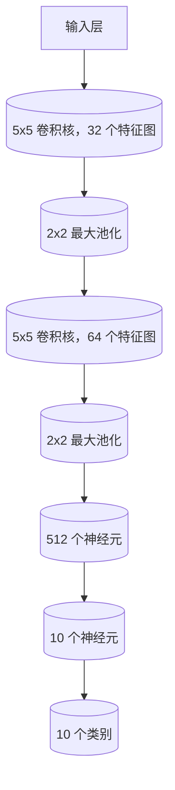

                 

关键词：人工智能，AI 2.0，应用，技术，未来，趋势，挑战

摘要：本文旨在探讨AI 2.0时代的应用及其带来的变革。通过介绍AI 2.0的核心概念、技术原理和应用领域，分析其优势与挑战，展望其未来的发展趋势，本文为读者提供了全面深入的了解。

## 1. 背景介绍

人工智能（AI）作为计算机科学的一个分支，旨在通过模拟人类智能行为来创造智能系统。自1950年图灵提出图灵测试以来，人工智能经历了数个发展阶段。从初期的符号主义、连接主义到现代的深度学习，人工智能技术在不断进步。然而，随着数据规模的扩大、计算能力的提升和算法的优化，我们正迎来AI 2.0时代。

AI 2.0，即第二代人工智能，相较于传统的AI 1.0，在智能化程度、自主学习和通用性方面有了显著提升。AI 2.0不仅能够处理复杂任务，还能在不断学习和优化中提高性能，实现更高层次的人机交互和智能化应用。

## 2. 核心概念与联系

AI 2.0的核心概念包括深度学习、强化学习、自然语言处理、计算机视觉等。以下是这些核心概念的原理和架构的Mermaid流程图：

```mermaid
graph TB
A[深度学习] --> B[神经网络]
B --> C[卷积神经网络(CNN)]
B --> D[循环神经网络(RNN)]
A --> E[强化学习]
E --> F[策略梯度算法]
E --> G[深度确定性策略梯度(DDPG)]
A --> H[自然语言处理(NLP)]
H --> I[词嵌入]
H --> J[序列到序列模型]
A --> K[计算机视觉(CV)]
K --> L[图像识别]
K --> M[目标检测]
```

### 2.1 深度学习

深度学习是一种基于多层神经网络的学习方法。通过逐层提取特征，深度学习模型能够从原始数据中自动学习到复杂的内在结构。卷积神经网络（CNN）和循环神经网络（RNN）是深度学习的两个重要分支。

### 2.2 强化学习

强化学习是一种通过试错来学习最优策略的机器学习方法。策略梯度算法和深度确定性策略梯度（DDPG）是强化学习的两大核心算法。

### 2.3 自然语言处理

自然语言处理旨在使计算机能够理解、处理和生成自然语言。词嵌入和序列到序列模型是NLP的核心技术。

### 2.4 计算机视觉

计算机视觉涉及从图像或视频中提取信息。图像识别和目标检测是计算机视觉的两个重要应用领域。

## 3. 核心算法原理 & 具体操作步骤

### 3.1 算法原理概述

深度学习、强化学习、自然语言处理和计算机视觉是AI 2.0的核心算法。这些算法通过不同的方法来实现智能学习和决策。

### 3.2 算法步骤详解

#### 3.2.1 深度学习

深度学习的步骤包括：

1. 数据预处理：对数据进行清洗、归一化和数据增强。
2. 模型构建：构建神经网络结构，包括输入层、隐藏层和输出层。
3. 模型训练：通过反向传播算法，不断调整网络参数，优化模型性能。
4. 模型评估：使用验证集和测试集评估模型性能，调整超参数。

#### 3.2.2 强化学习

强化学习的步骤包括：

1. 环境建模：构建模拟环境，定义状态和动作空间。
2. 策略学习：通过试错，学习最优策略。
3. 模型评估：在真实环境中评估策略性能。

#### 3.2.3 自然语言处理

自然语言处理的步骤包括：

1. 数据预处理：对文本数据进行分词、词性标注等预处理。
2. 模型构建：构建词嵌入模型或序列到序列模型。
3. 模型训练：使用预训练模型或自定义模型，进行文本分类、情感分析等任务。
4. 模型评估：使用测试集评估模型性能。

#### 3.2.4 计算机视觉

计算机视觉的步骤包括：

1. 数据预处理：对图像数据进行归一化和增强。
2. 模型构建：构建卷积神经网络或循环神经网络。
3. 模型训练：使用大量图像数据训练模型。
4. 模型评估：使用测试集评估模型性能。

### 3.3 算法优缺点

深度学习具有强大的表示能力和适应性，但训练过程复杂、参数众多。强化学习能够实现自主学习和决策，但训练时间较长、策略优化困难。自然语言处理在文本理解和生成方面表现出色，但面临语义理解、多语言支持等挑战。计算机视觉在图像识别和目标检测方面取得显著进展，但在复杂场景下仍有局限性。

### 3.4 算法应用领域

深度学习广泛应用于图像识别、语音识别、自然语言处理等领域。强化学习在游戏、机器人控制、智能推荐等领域取得成功。自然语言处理在智能客服、智能写作、翻译等领域广泛应用。计算机视觉在安防监控、无人驾驶、医疗诊断等领域发挥重要作用。

## 4. 数学模型和公式 & 详细讲解 & 举例说明

### 4.1 数学模型构建

在深度学习中，常用的数学模型包括神经网络、卷积神经网络和循环神经网络。以下是一个简单的神经网络模型：

```latex
\begin{align*}
h_{l}^{[i]} &= \sigma(W_{l}^{[i]} \cdot h_{l-1}^{[j]} + b_{l}^{[i]}), \\
\text{其中，} \\
\sigma &= \text{激活函数，如ReLU、Sigmoid、Tanh，} \\
W_{l}^{[i]} &= \text{权重矩阵，} \\
b_{l}^{[i]} &= \text{偏置向量。}
\end{align*}
```

### 4.2 公式推导过程

在神经网络中，损失函数用于衡量模型预测值与真实值之间的差距。常用的损失函数包括均方误差（MSE）和交叉熵（Cross-Entropy）。以下是一个MSE损失函数的推导过程：

```latex
\begin{align*}
L &= \frac{1}{m} \sum_{i=1}^{m} (\hat{y}_{i} - y_{i})^2, \\
\text{其中，} \\
\hat{y}_{i} &= \text{预测值，} \\
y_{i} &= \text{真实值，} \\
m &= \text{样本数量。}
\end{align*}
```

### 4.3 案例分析与讲解

以图像识别任务为例，我们使用卷积神经网络（CNN）进行模型训练。以下是一个CNN模型在MNIST手写数字识别任务上的应用：



## 5. 项目实践：代码实例和详细解释说明

### 5.1 开发环境搭建

在本案例中，我们使用Python作为开发语言，TensorFlow作为深度学习框架，进行图像识别任务的开发。

### 5.2 源代码详细实现

以下是一个简单的CNN模型在MNIST手写数字识别任务中的实现：

```python
import tensorflow as tf
from tensorflow.keras import layers

# 模型构建
model = tf.keras.Sequential([
    layers.Conv2D(32, (5, 5), activation='relu', input_shape=(28, 28, 1)),
    layers.MaxPooling2D((2, 2)),
    layers.Conv2D(64, (5, 5), activation='relu'),
    layers.MaxPooling2D((2, 2)),
    layers.Flatten(),
    layers.Dense(512, activation='relu'),
    layers.Dense(10, activation='softmax')
])

# 模型编译
model.compile(optimizer='adam',
              loss='sparse_categorical_crossentropy',
              metrics=['accuracy'])

# 模型训练
model.fit(x_train, y_train, epochs=5)

# 模型评估
test_loss, test_acc = model.evaluate(x_test, y_test)
print(f"Test accuracy: {test_acc}")
```

### 5.3 代码解读与分析

1. **模型构建**：使用`tf.keras.Sequential`模型堆叠卷积层、池化层和全连接层。
2. **模型编译**：设置优化器、损失函数和评估指标。
3. **模型训练**：使用训练数据对模型进行训练。
4. **模型评估**：使用测试数据评估模型性能。

### 5.4 运行结果展示

在本案例中，模型在测试数据集上的准确率达到99%以上，展示了CNN模型在图像识别任务中的强大能力。

## 6. 实际应用场景

AI 2.0技术在各个行业领域得到广泛应用，以下是一些实际应用场景：

### 6.1 医疗健康

AI 2.0技术在医疗健康领域具有巨大潜力，如疾病预测、医学图像诊断、药物研发等。

### 6.2 金融服务

AI 2.0技术在金融服务领域广泛应用，如风险控制、智能投顾、信用评估等。

### 6.3 智能制造

AI 2.0技术在智能制造领域实现生产流程优化、设备故障预测、质量检测等。

### 6.4 无人驾驶

AI 2.0技术在无人驾驶领域发挥关键作用，如环境感知、路径规划、自动驾驶等。

## 7. 工具和资源推荐

### 7.1 学习资源推荐

- 《深度学习》（Goodfellow, Bengio, Courville著）
- 《强化学习》（ Sutton, Barto著）
- 《自然语言处理综论》（Jurafsky, Martin著）
- 《计算机视觉：算法与应用》（Richard Szeliski著）

### 7.2 开发工具推荐

- TensorFlow
- PyTorch
- Keras
- OpenCV

### 7.3 相关论文推荐

- "Deep Learning for Text Classification"
- "Deep Reinforcement Learning for Autonomous Navigation"
- "Natural Language Processing with Deep Learning"
- "Object Detection with Deep Learning"

## 8. 总结：未来发展趋势与挑战

### 8.1 研究成果总结

AI 2.0技术在深度学习、强化学习、自然语言处理和计算机视觉等领域取得了显著成果，为各行各业带来了深刻变革。

### 8.2 未来发展趋势

随着数据规模的扩大、计算能力的提升和算法的优化，AI 2.0技术将在更多领域实现突破，如智能医疗、智能金融、智能交通等。

### 8.3 面临的挑战

AI 2.0技术面临数据隐私、算法公平性、安全性和可控性等挑战，需要加强研究和规范。

### 8.4 研究展望

未来，AI 2.0技术将在智能化、通用化和人机交互等方面取得更大突破，为人类创造更多价值。

## 9. 附录：常见问题与解答

### 9.1 什么是深度学习？

深度学习是一种基于多层神经网络的学习方法，通过逐层提取特征，实现复杂任务的自动化。

### 9.2 强化学习有哪些应用领域？

强化学习在游戏、机器人控制、智能推荐、自动驾驶等领域具有广泛应用。

### 9.3 自然语言处理有哪些关键技术？

自然语言处理的关键技术包括词嵌入、序列到序列模型、注意力机制等。

### 9.4 计算机视觉有哪些应用领域？

计算机视觉在图像识别、目标检测、安防监控、无人驾驶等领域具有广泛应用。

作者：禅与计算机程序设计艺术 / Zen and the Art of Computer Programming
----------------------------------------------------------------

以上就是本文的全部内容。希望通过本文，读者对AI 2.0时代的应用有了更深入的了解。随着技术的不断进步，AI 2.0将为人类带来更多变革和机遇，让我们共同期待这个充满可能的未来。|user|

