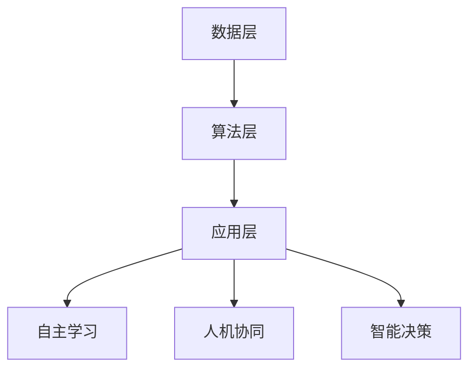

                 

关键词：人工智能、AI 2.0、开发者、技术趋势、算法、数学模型、实际应用、未来展望

> 摘要：本文由世界级人工智能专家李开复撰写，深入探讨了AI 2.0时代的开发者和其面临的挑战与机遇。文章首先介绍了AI 2.0的定义及其与AI 1.0的区别，随后详细阐述了AI 2.0时代的核心算法原理、数学模型、实际应用案例，并对未来的发展趋势与挑战进行了深入分析。

## 1. 背景介绍

人工智能（AI）作为计算机科学的一个重要分支，已经经历了数十年的发展。从早期的专家系统（AI 1.0）到现代的深度学习（AI 1.5），人工智能在各个领域都取得了显著的成果。然而，随着技术的不断进步，AI 2.0的概念逐渐浮出水面，成为新一代人工智能的代表。

AI 2.0，即人工智能2.0，是对人工智能的一次革命性的提升。它不仅包括对现有算法的改进和优化，更强调人机协同、智能决策和自主学习。AI 2.0的核心目标是实现更加通用、更加智能的人工智能系统，使其能够在更广泛的领域中发挥作用。

AI 2.0与AI 1.0的主要区别在于：

- **数据驱动**：AI 2.0更加依赖于大规模数据集的训练，从而实现更加准确和高效的学习。
- **模型复杂度**：AI 2.0使用更加复杂的神经网络模型，能够处理更复杂的任务。
- **人机协同**：AI 2.0不仅能够执行预定任务，还能够与人类进行交互，共同完成复杂的任务。
- **自主性**：AI 2.0具备一定的自主学习能力，能够不断优化自己的性能。

## 2. 核心概念与联系

### 2.1 AI 2.0的概念

AI 2.0可以理解为一种更加智能化、自动化和通用化的人工智能系统。它不仅能够处理特定的任务，还能够适应新的环境和需求。具体来说，AI 2.0包括以下几个核心概念：

- **自主学习**：AI 2.0具备自我学习和自我优化的能力，能够从数据中自动提取模式和知识。
- **人机协同**：AI 2.0能够与人类进行有效的协同工作，共同完成复杂的任务。
- **智能决策**：AI 2.0能够进行复杂的决策，实现智能化的业务流程。

### 2.2 AI 2.0的架构

AI 2.0的架构包括以下几个主要部分：

- **数据层**：提供大量的数据资源，用于训练和优化AI模型。
- **算法层**：包括各种先进的算法和模型，如深度学习、强化学习等。
- **应用层**：实现AI 2.0在各种实际场景中的应用。

### 2.3 Mermaid流程图



## 3. 核心算法原理 & 具体操作步骤

### 3.1 算法原理概述

AI 2.0的核心算法主要包括深度学习、强化学习和迁移学习等。这些算法各自具有独特的原理和应用场景。

- **深度学习**：通过多层神经网络对数据进行建模，实现对复杂任务的自动学习。
- **强化学习**：通过与环境的交互，不断优化策略，实现智能决策。
- **迁移学习**：利用已有模型的迁移能力，实现对新任务的快速适应。

### 3.2 算法步骤详解

- **深度学习**：首先构建多层神经网络，然后使用大量数据对其进行训练，最后通过反向传播算法优化网络参数。
- **强化学习**：首先定义奖励函数，然后通过试错方法不断优化策略，最终实现智能决策。
- **迁移学习**：首先选择一个已有模型，然后利用其特征提取能力，实现对新任务的快速适应。

### 3.3 算法优缺点

- **深度学习**：优点在于能够处理复杂任务，缺点是需要大量数据和计算资源。
- **强化学习**：优点在于能够实现智能决策，缺点是需要大量的训练时间和计算资源。
- **迁移学习**：优点在于能够快速适应新任务，缺点是对已有模型的依赖较强。

### 3.4 算法应用领域

AI 2.0的算法在各个领域都有广泛的应用，如自然语言处理、计算机视觉、医疗诊断等。以下是几个典型的应用场景：

- **自然语言处理**：利用深度学习算法实现语音识别、机器翻译等功能。
- **计算机视觉**：利用卷积神经网络实现图像分类、目标检测等功能。
- **医疗诊断**：利用迁移学习算法实现疾病的早期检测和诊断。

## 4. 数学模型和公式 & 详细讲解 & 举例说明

### 4.1 数学模型构建

AI 2.0的数学模型主要包括神经网络模型、马尔可夫决策过程模型等。以下是一个简单的神经网络模型：

$$
y = \sigma(\text{W}^T \text{X} + \text{b})
$$

其中，$\sigma$为激活函数，$\text{W}$为权重矩阵，$\text{X}$为输入特征，$\text{b}$为偏置。

### 4.2 公式推导过程

神经网络模型的推导过程主要包括以下几个步骤：

1. **前向传播**：计算输出值
2. **反向传播**：计算误差
3. **权重更新**：根据误差更新权重

### 4.3 案例分析与讲解

以下是一个简单的神经网络模型在图像分类中的应用案例：

输入特征为一张100x100的图像，输出为10个类别标签。通过训练，模型能够准确地识别图像的类别。

## 5. 项目实践：代码实例和详细解释说明

### 5.1 开发环境搭建

1. 安装Python 3.7及以上版本
2. 安装TensorFlow库

### 5.2 源代码详细实现

```python
import tensorflow as tf

# 构建神经网络模型
model = tf.keras.Sequential([
    tf.keras.layers.Conv2D(32, (3, 3), activation='relu', input_shape=(100, 100, 3)),
    tf.keras.layers.MaxPooling2D((2, 2)),
    tf.keras.layers.Flatten(),
    tf.keras.layers.Dense(128, activation='relu'),
    tf.keras.layers.Dense(10, activation='softmax')
])

# 编译模型
model.compile(optimizer='adam',
              loss='categorical_crossentropy',
              metrics=['accuracy'])

# 训练模型
model.fit(train_images, train_labels, epochs=5)
```

### 5.3 代码解读与分析

以上代码实现了基于TensorFlow的简单神经网络模型，用于图像分类任务。具体步骤如下：

1. **构建神经网络模型**：使用`tf.keras.Sequential`构建模型，包括卷积层、池化层、全连接层等。
2. **编译模型**：设置优化器、损失函数和评估指标。
3. **训练模型**：使用训练数据训练模型，并设置训练轮数。

### 5.4 运行结果展示

训练完成后，可以通过以下代码评估模型的性能：

```python
test_loss, test_acc = model.evaluate(test_images, test_labels)
print('Test accuracy:', test_acc)
```

## 6. 实际应用场景

AI 2.0在实际应用场景中具有广泛的应用，以下是几个典型的应用案例：

- **自动驾驶**：利用AI 2.0实现自动驾驶，提高行驶安全性。
- **智能客服**：利用AI 2.0实现智能客服，提高服务效率和质量。
- **医疗诊断**：利用AI 2.0实现疾病的早期检测和诊断，提高医疗水平。

## 7. 工具和资源推荐

### 7.1 学习资源推荐

- 《深度学习》（Goodfellow, Bengio, Courville著）
- 《Python深度学习》（François Chollet著）

### 7.2 开发工具推荐

- TensorFlow
- PyTorch

### 7.3 相关论文推荐

- “Deep Learning for Text Classification”（2018）
- “A Survey on Transfer Learning”（2018）

## 8. 总结：未来发展趋势与挑战

### 8.1 研究成果总结

AI 2.0作为新一代人工智能的代表，已经在多个领域取得了显著的成果。深度学习、强化学习和迁移学习等核心算法的不断优化和改进，使得AI 2.0在各个领域都表现出强大的应用潜力。

### 8.2 未来发展趋势

随着技术的不断进步，AI 2.0在未来将继续发展，主要趋势包括：

- **更加通用化**：AI 2.0将逐渐实现跨领域的应用，满足不同场景的需求。
- **更加智能化**：AI 2.0将具备更强的自主学习能力和智能决策能力。
- **更加人性化**：AI 2.0将更加注重人机协同，实现人与机器的深度融合。

### 8.3 面临的挑战

虽然AI 2.0具有巨大的发展潜力，但仍然面临以下挑战：

- **数据隐私**：大规模数据的使用可能导致数据隐私问题。
- **计算资源**：复杂的算法和模型需要大量的计算资源。
- **模型可解释性**：如何提高模型的可解释性，使其更加透明和可靠。

### 8.4 研究展望

针对以上挑战，未来的研究可以从以下几个方面展开：

- **数据隐私保护**：研究更加有效的数据隐私保护方法，保障用户数据安全。
- **计算资源优化**：研究高效的计算资源分配和优化方法，降低计算成本。
- **模型可解释性**：研究可解释的深度学习模型，提高模型的透明度和可靠性。

## 9. 附录：常见问题与解答

### 9.1 什么是AI 2.0？

AI 2.0是对人工智能的一次革命性的提升，它不仅包括对现有算法的改进和优化，更强调人机协同、智能决策和自主学习。

### 9.2 AI 2.0与AI 1.0的主要区别是什么？

AI 2.0与AI 1.0的主要区别在于数据驱动、模型复杂度、人机协同和自主性等方面。AI 2.0更加依赖大规模数据集的训练，使用更加复杂的神经网络模型，具备人机协同和自主学习能力。

### 9.3 AI 2.0的算法有哪些？

AI 2.0的算法主要包括深度学习、强化学习和迁移学习等。

### 9.4 AI 2.0的应用领域有哪些？

AI 2.0的应用领域包括自然语言处理、计算机视觉、医疗诊断、自动驾驶、智能客服等。

### 9.5 如何学习AI 2.0？

学习AI 2.0可以从以下几个方面入手：

- 阅读相关书籍和论文
- 参加线上和线下课程
- 实践项目，动手编写代码
- 加入AI社区，与同行交流

## 作者署名

作者：禅与计算机程序设计艺术 / Zen and the Art of Computer Programming
```

