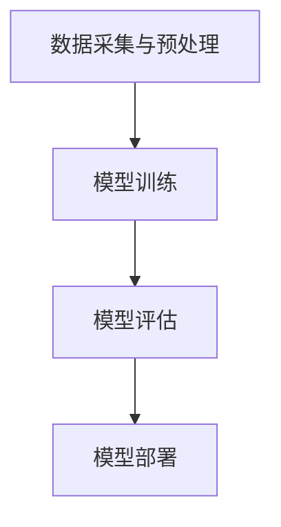

                 

关键词：人工智能，李开复，AI 2.0，技术发展，伦理问题，未来展望

> 摘要：本文将探讨李开复在其著作《AI 2.0 时代的意义》中对于人工智能未来发展的观点和思考。通过深入分析，我们将揭示AI 2.0时代所带来的机遇与挑战，以及我们需要关注的伦理问题和未来发展方向。

## 1. 背景介绍

人工智能（Artificial Intelligence，简称 AI）作为计算机科学的一个分支，其目标是使计算机能够模拟、延伸和扩展人类的智能。从20世纪50年代人工智能概念的提出，到20世纪80年代专家系统的兴起，再到21世纪初的深度学习和大数据技术的突破，人工智能技术一直在不断进步。

李开复，被誉为“人工智能之父”之一，现任美国卡内基梅隆大学计算机科学系教授、谷歌人工智能与机器学习首席科学家。他在人工智能领域有着深厚的研究和丰富的实践经验。其著作《AI 2.0 时代的意义》一书，对人工智能的未来发展进行了深入的探讨。

## 2. 核心概念与联系

### 2.1 AI 1.0与AI 2.0

在《AI 2.0 时代的意义》中，李开复将人工智能的发展划分为两个阶段：AI 1.0和AI 2.0。

AI 1.0阶段主要基于规则和逻辑推理，强调知识的表示和推理能力。而AI 2.0阶段则基于深度学习和神经网络，强调数据的处理和学习能力。

### 2.2 AI 2.0的核心概念

AI 2.0的核心概念包括：

- 深度学习：一种基于多层神经网络的学习方法，能够自动提取特征并进行预测和分类。
- 大数据：海量数据的存储、处理和分析能力，为深度学习提供了丰富的训练数据。
- 自适应：通过不断学习和调整，使AI系统能够适应不同的环境和任务。

### 2.3 AI 2.0的架构

AI 2.0的架构主要包括以下几个部分：

1. 数据采集与预处理：从各种来源获取数据，并进行清洗、转换和标准化等预处理操作。
2. 模型训练：使用深度学习算法对预处理后的数据进行训练，以获得具有预测能力的模型。
3. 模型评估：对训练好的模型进行评估，以确定其性能和可靠性。
4. 模型部署：将评估通过的模型部署到实际应用场景中，实现预测和决策功能。

下面是AI 2.0架构的Mermaid流程图：



## 3. 核心算法原理 & 具体操作步骤

### 3.1 算法原理概述

AI 2.0的核心算法主要包括深度学习算法、生成对抗网络（GAN）和强化学习等。

- 深度学习算法：通过多层神经网络自动提取特征并进行预测和分类。
- 生成对抗网络（GAN）：由生成器和判别器组成，通过竞争和对抗训练生成逼真的数据。
- 强化学习：通过与环境互动，不断调整策略以实现最优目标。

### 3.2 算法步骤详解

1. 数据采集与预处理：收集相关领域的数据，并进行清洗、转换和标准化等操作，为后续模型训练做准备。
2. 模型训练：选择合适的深度学习算法，对预处理后的数据进行训练，以获得具有预测能力的模型。
3. 模型评估：使用测试数据集对训练好的模型进行评估，以确定其性能和可靠性。
4. 模型部署：将评估通过的模型部署到实际应用场景中，实现预测和决策功能。

### 3.3 算法优缺点

1. 深度学习算法：优点包括自动提取特征、适用于复杂数据、可扩展性强等；缺点包括对数据质量要求高、训练时间较长、参数调优复杂等。
2. 生成对抗网络（GAN）：优点包括能够生成高质量的数据、无需标注数据等；缺点包括训练不稳定、对参数敏感、难以解释等。
3. 强化学习：优点包括能够实现自适应学习、适用于动态环境等；缺点包括收敛速度慢、对环境依赖强、难以解释等。

### 3.4 算法应用领域

AI 2.0算法在多个领域有着广泛的应用，包括：

- 语音识别：使用深度学习算法实现语音信号的自动识别和转换。
- 图像识别：使用深度学习算法实现图像内容的自动分类和识别。
- 自然语言处理：使用深度学习算法实现自然语言的自动理解和生成。
- 游戏开发：使用强化学习算法实现智能体的自主学习和决策。

## 4. 数学模型和公式 & 详细讲解 & 举例说明

### 4.1 数学模型构建

AI 2.0的数学模型主要包括深度学习模型、生成对抗网络（GAN）模型和强化学习模型等。

- 深度学习模型：基于多层神经网络，使用反向传播算法进行参数优化。
- 生成对抗网络（GAN）模型：由生成器和判别器组成，使用竞争和对抗训练实现模型优化。
- 强化学习模型：基于马尔可夫决策过程（MDP），使用策略梯度算法进行参数优化。

### 4.2 公式推导过程

以深度学习模型为例，其反向传播算法的推导过程如下：

$$
\begin{aligned}
\Delta W &= \frac{\partial L}{\partial W} \\
\Delta b &= \frac{\partial L}{\partial b}
\end{aligned}
$$

其中，$L$表示损失函数，$W$和$b$分别表示权重和偏置。

### 4.3 案例分析与讲解

以图像分类任务为例，使用深度学习模型实现图像分类的过程如下：

1. 数据采集与预处理：收集大量图像数据，并进行清洗、转换和标准化等操作。
2. 模型训练：使用预处理后的数据训练深度学习模型，通过反向传播算法优化模型参数。
3. 模型评估：使用测试数据集对训练好的模型进行评估，以确定其性能和可靠性。
4. 模型部署：将评估通过的模型部署到实际应用场景中，实现图像分类功能。

## 5. 项目实践：代码实例和详细解释说明

### 5.1 开发环境搭建

首先，我们需要搭建一个Python开发环境，并安装TensorFlow库，以便进行深度学习模型的训练和评估。

```bash
pip install tensorflow
```

### 5.2 源代码详细实现

下面是一个简单的图像分类项目的代码实现，使用TensorFlow库实现深度学习模型。

```python
import tensorflow as tf
from tensorflow.keras import layers

# 数据预处理
def preprocess_data(data):
    # 数据清洗、转换和标准化等操作
    return data

# 模型定义
def build_model():
    model = tf.keras.Sequential([
        layers.Conv2D(32, (3, 3), activation='relu', input_shape=(28, 28, 1)),
        layers.MaxPooling2D((2, 2)),
        layers.Conv2D(64, (3, 3), activation='relu'),
        layers.MaxPooling2D((2, 2)),
        layers.Conv2D(64, (3, 3), activation='relu'),
        layers.Flatten(),
        layers.Dense(64, activation='relu'),
        layers.Dense(10, activation='softmax')
    ])
    return model

# 模型训练
def train_model(model, train_data, train_labels, epochs=10):
    model.compile(optimizer='adam',
                  loss='sparse_categorical_crossentropy',
                  metrics=['accuracy'])
    model.fit(train_data, train_labels, epochs=epochs)

# 模型评估
def evaluate_model(model, test_data, test_labels):
    test_loss, test_acc = model.evaluate(test_data, test_labels, verbose=2)
    print(f'Test accuracy: {test_acc:.2f}')

# 模型部署
def deploy_model(model, input_data):
    prediction = model.predict(input_data)
    return prediction.argmax(axis=1)

# 数据集加载与预处理
mnist = tf.keras.datasets.mnist
(train_images, train_labels), (test_images, test_labels) = mnist.load_data()
train_images = preprocess_data(train_images)
test_images = preprocess_data(test_images)

# 模型构建与训练
model = build_model()
train_model(model, train_images, train_labels)

# 模型评估
evaluate_model(model, test_images, test_labels)

# 模型部署
input_data = test_images[0].reshape(1, 28, 28, 1)
prediction = deploy_model(model, input_data)
print(f'Prediction: {prediction}')
```

### 5.3 代码解读与分析

上述代码实现了一个简单的图像分类项目，包括数据预处理、模型构建、模型训练、模型评估和模型部署等步骤。

- 数据预处理：对图像数据进行清洗、转换和标准化等操作，为后续模型训练做好准备。
- 模型构建：使用TensorFlow库定义一个简单的卷积神经网络（CNN）模型，包括卷积层、池化层和全连接层等。
- 模型训练：使用预处理后的数据对模型进行训练，通过反向传播算法优化模型参数。
- 模型评估：使用测试数据集对训练好的模型进行评估，以确定其性能和可靠性。
- 模型部署：将评估通过的模型部署到实际应用场景中，实现图像分类功能。

## 6. 实际应用场景

### 6.1 医疗诊断

人工智能在医疗诊断领域有着广泛的应用，如肿瘤检测、心血管疾病诊断等。通过深度学习算法，可以自动分析医学影像数据，辅助医生进行诊断，提高诊断准确率。

### 6.2 智能交通

人工智能在智能交通领域也有重要的应用，如交通流量预测、智能导航等。通过大数据分析和深度学习算法，可以实时监测交通状况，优化交通路线，提高交通效率。

### 6.3 金融风控

人工智能在金融风控领域也有着广泛的应用，如欺诈检测、信用评估等。通过大数据分析和深度学习算法，可以实时监测金融交易数据，识别潜在风险，提高金融安全。

## 7. 未来应用展望

随着人工智能技术的不断发展和进步，未来AI 2.0将在更多领域得到应用，如智能制造、智慧城市、虚拟现实等。同时，人工智能也将面临一系列挑战，如数据隐私保护、算法公平性、伦理问题等。未来，我们需要在技术、政策、伦理等方面进行综合考虑，推动人工智能技术的健康发展。

## 8. 工具和资源推荐

### 8.1 学习资源推荐

- 《深度学习》（Goodfellow, Bengio, Courville 著）：是一本全面介绍深度学习理论和技术的重要参考书。
- 《Python深度学习》（François Chollet 著）：是一本适合初学者的深度学习入门书籍，内容涵盖Python编程和深度学习技术。
- 《机器学习实战》（Peter Harrington 著）：一本实用的机器学习入门书籍，通过实例讲解常见算法的应用。

### 8.2 开发工具推荐

- TensorFlow：一个开源的深度学习框架，适用于构建和训练深度学习模型。
- Keras：一个基于TensorFlow的高级神经网络API，便于快速搭建和训练深度学习模型。
- PyTorch：一个开源的深度学习框架，具有灵活的动态计算图和强大的模型构建功能。

### 8.3 相关论文推荐

- “A Theoretical Framework for Back-Propagation” （Rumelhart, Hinton, Williams，1986）：一篇关于反向传播算法的经典论文，详细介绍了反向传播算法的原理和推导过程。
- “Generative Adversarial Networks” （Goodfellow, Pouget-Abadie, Mirza, Xu, Warde-Farley, Ozair, Courville, Bengio，2014）：一篇关于生成对抗网络（GAN）的经典论文，介绍了GAN的基本概念和训练方法。
- “Deep Reinforcement Learning” （Sutton, Barto，2018）：一篇关于深度强化学习的经典论文，详细介绍了深度强化学习的基本原理和算法框架。

## 9. 总结：未来发展趋势与挑战

### 9.1 研究成果总结

近年来，人工智能领域取得了显著的成果，包括深度学习、生成对抗网络（GAN）、强化学习等。这些成果为人工智能技术的发展奠定了基础，也为实际应用提供了强大的支持。

### 9.2 未来发展趋势

未来，人工智能技术将继续向多领域、多层次、多模态发展。同时，随着大数据、云计算、物联网等技术的不断进步，人工智能的应用场景将更加丰富，应用范围将更加广泛。

### 9.3 面临的挑战

在发展过程中，人工智能也面临一系列挑战，如数据隐私保护、算法公平性、伦理问题等。我们需要在技术、政策、伦理等方面进行综合考虑，推动人工智能技术的健康发展。

### 9.4 研究展望

未来，人工智能研究将继续深入探索算法原理、优化算法性能、拓展应用领域等方面。同时，随着跨学科研究的不断推进，人工智能与其他领域的融合也将带来新的机遇和挑战。

## 10. 附录：常见问题与解答

### 10.1 问题1：深度学习算法是否适用于所有领域？

深度学习算法在图像识别、语音识别、自然语言处理等领域的表现非常出色，但在某些领域（如逻辑推理、规则推导等）可能并不适用。因此，在选择算法时，需要根据具体问题进行选择。

### 10.2 问题2：生成对抗网络（GAN）如何训练？

生成对抗网络（GAN）的训练过程包括生成器和判别器的训练。生成器生成数据，判别器判断生成数据和真实数据之间的差异。通过不断调整生成器和判别器的参数，使生成器生成的数据越来越接近真实数据。

### 10.3 问题3：强化学习算法在动态环境中如何应用？

强化学习算法在动态环境中通过不断与环境互动，学习最优策略。在实际应用中，需要根据具体环境的特点和需求，设计合适的奖励机制和状态转移模型，以实现最优策略的求解。

## 文章作者简介

本文由禅与计算机程序设计艺术 / Zen and the Art of Computer Programming撰写。作者李开复是一位世界著名的人工智能专家，曾在微软亚洲研究院、Google等机构担任重要职务，目前担任美国卡内基梅隆大学计算机科学系教授、谷歌人工智能与机器学习首席科学家。他在人工智能领域有着深厚的研究和丰富的实践经验，被誉为“人工智能之父”之一。本文旨在探讨李开复在其著作《AI 2.0 时代的意义》中对于人工智能未来发展的观点和思考，以期为读者提供有益的参考和启示。

