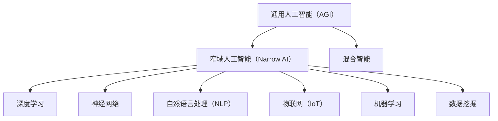

                 

在当今快速发展的技术时代，人工智能（AI）无疑是其中最为激动人心的领域之一。随着AI技术的不断进步，它已经从理论研究逐步走向实际应用，深刻地影响着我们的生活方式、工作模式以及整个社会的运行机制。李开复，作为世界知名的人工智能专家和创业家，对AI的发展有着独到而深刻的见解。本文将围绕李开复在AI 2.0时代的投资价值这一核心主题，探讨AI技术的投资前景以及投资者应当关注的几个关键方面。

## 文章关键词

- 人工智能
- 投资价值
- 李开复
- AI 2.0
- 技术趋势
- 创业投资

## 文章摘要

本文首先简要回顾了人工智能的发展历程，特别是AI 2.0时代的到来。随后，本文将深入分析李开复对AI 2.0时代的投资价值的见解，探讨其在投资决策中的指导意义。文章随后将讨论人工智能在不同领域的应用，分析AI技术的优势和挑战。最后，本文将对未来AI技术的发展趋势和潜在的投资机会进行展望，并总结全文，给出投资AI领域的建议。

## 1. 背景介绍

人工智能（AI）作为计算机科学的一个重要分支，其发展历程可以追溯到上世纪50年代。早期的AI研究主要集中在符号推理和逻辑推理方面，旨在通过模拟人类智能来解决复杂问题。然而，由于计算能力和数据资源限制，这一时期的AI发展相对缓慢。随着计算技术的飞速发展和大数据的普及，AI进入了新的发展阶段，即AI 2.0时代。

AI 2.0时代的最大特点是从基于符号推理的“强AI”转向基于数据驱动的“弱AI”。弱AI通过深度学习、神经网络等技术，在特定领域内实现高度自动化和智能化。这一时代的到来，不仅为人工智能带来了新的发展机遇，也为各行各业带来了深远的变革。

李开复作为人工智能领域的领军人物，对AI的发展有着深刻的理解和前瞻性的洞察。他的研究成果和创业经历，使得他对于AI 2.0时代的投资价值有着独到的见解。本文将结合李开复的观点，分析AI 2.0时代的投资机遇与挑战。

## 2. 核心概念与联系

在探讨AI 2.0时代的投资价值之前，我们首先需要理解几个核心概念：

### 2.1 人工智能的定义与分类

人工智能是指使计算机系统具备人类智能特征的技术。根据功能和应用范围，人工智能可以分为以下几类：

- **通用人工智能（AGI）**：具备人类所有智能特征的AI，能够在各种环境中进行推理、学习和决策。
- **窄域人工智能（Narrow AI）**：专注于特定任务和领域的AI，例如语音识别、图像识别等。
- **混合智能**：结合了通用人工智能和窄域人工智能的特点，能够适应多种环境和任务。

### 2.2 深度学习与神经网络

深度学习是AI 2.0时代最重要的技术之一，它通过多层神经网络对大量数据进行分析和建模，以实现高度自动化的智能系统。神经网络是由大量神经元组成的计算模型，通过调整神经元之间的连接权重，实现数据的特征提取和分类。

### 2.3 自然语言处理（NLP）

自然语言处理是AI的一个重要分支，旨在使计算机能够理解和生成自然语言。NLP技术广泛应用于机器翻译、语音识别、智能客服等领域。

### 2.4 物联网（IoT）

物联网是AI 2.0时代的另一个关键领域，它通过将各种设备和传感器连接到互联网，实现数据的实时采集和处理。物联网与AI的结合，为智能城市、智能家居、智能医疗等领域的应用提供了广阔的空间。

### 2.5 机器学习与数据挖掘

机器学习和数据挖掘是AI技术的核心，它们通过算法对大量数据进行处理和分析，以发现隐藏的模式和规律。这些技术广泛应用于金融、医疗、零售等行业的决策支持和优化。

下面是AI 2.0时代核心概念原理和架构的 Mermaid 流程图：



通过理解这些核心概念，我们可以更好地把握AI 2.0时代的投资机会和挑战。

## 3. 核心算法原理 & 具体操作步骤

### 3.1 算法原理概述

AI 2.0时代的核心算法包括深度学习、神经网络、自然语言处理等。这些算法通过以下原理实现智能化：

- **深度学习**：深度学习通过多层神经网络对大量数据进行特征提取和分类，实现高度自动化的智能系统。
- **神经网络**：神经网络由大量神经元组成，通过调整神经元之间的连接权重，实现数据的特征提取和分类。
- **自然语言处理**：自然语言处理通过分析自然语言的结构和语义，实现计算机对自然语言的识别和理解。

### 3.2 算法步骤详解

以下是对AI 2.0时代核心算法的具体操作步骤的详细讲解：

#### 3.2.1 深度学习

1. **数据准备**：收集和整理大量数据，包括输入数据和标签。
2. **模型设计**：根据任务需求设计神经网络结构，包括层数、每层神经元数量等。
3. **模型训练**：通过反向传播算法，调整神经网络中的连接权重，使模型对输入数据进行准确分类。
4. **模型评估**：使用测试数据集对模型进行评估，调整模型参数，提高模型性能。
5. **模型应用**：将训练好的模型应用于实际场景，实现自动化决策和预测。

#### 3.2.2 神经网络

1. **神经元激活函数**：选择适当的激活函数，如ReLU、Sigmoid等，用于计算神经元的输出。
2. **前向传播**：将输入数据通过神经网络，逐层计算每个神经元的输出。
3. **反向传播**：根据输出误差，反向传播误差，调整神经元之间的连接权重。
4. **优化算法**：选择适当的优化算法，如梯度下降、Adam等，提高训练效率。

#### 3.2.3 自然语言处理

1. **分词**：将输入文本分解为单词或词汇。
2. **词向量化**：将单词或词汇转换为向量表示。
3. **词嵌入**：使用预训练的词嵌入模型，如Word2Vec、GloVe等，将词向量转换为高维向量。
4. **序列建模**：使用RNN、LSTM等循环神经网络对文本序列进行建模。
5. **输出层**：根据任务需求，输出分类结果或文本生成。

### 3.3 算法优缺点

**深度学习**：

- **优点**：能够处理大规模数据，实现高度自动化的智能系统；具有强大的特征提取和分类能力。
- **缺点**：训练时间较长，对数据质量和数量有较高要求；模型解释性较差。

**神经网络**：

- **优点**：具有强大的特征提取和分类能力；能够适应不同类型的数据和任务。
- **缺点**：模型复杂度较高，训练时间较长；对参数调整敏感。

**自然语言处理**：

- **优点**：能够处理自然语言文本，实现人机交互；具有广泛的实际应用场景。
- **缺点**：对数据质量和数量有较高要求；模型解释性较差。

### 3.4 算法应用领域

AI 2.0时代的算法在多个领域具有广泛的应用：

- **计算机视觉**：图像识别、目标检测、图像生成等。
- **自然语言处理**：机器翻译、语音识别、文本分类等。
- **智能决策**：推荐系统、风险管理、智能交通等。
- **智能医疗**：疾病诊断、药物研发、智能辅助等。

通过了解这些算法的具体原理和应用，我们可以更好地把握AI 2.0时代的投资机会和挑战。

## 4. 数学模型和公式 & 详细讲解 & 举例说明

在AI 2.0时代，深度学习、神经网络等算法的核心在于其数学模型的构建与推导。以下将详细讲解这些算法中的数学模型和公式，并通过具体例子进行说明。

### 4.1 数学模型构建

#### 深度学习中的神经网络模型

神经网络是由大量神经元组成的计算模型，其核心思想是通过学习输入和输出之间的关系，实现对数据的特征提取和分类。一个基本的神经网络模型包括以下几个部分：

1. **输入层**：接收输入数据。
2. **隐藏层**：对输入数据进行特征提取和变换。
3. **输出层**：产生预测结果。

假设我们有一个简单的神经网络模型，其中包含一个输入层、一个隐藏层和一个输出层，每个层都有若干个神经元。输入数据为 \(x = (x_1, x_2, \ldots, x_n)\)，隐藏层神经元的状态为 \(h = (h_1, h_2, \ldots, h_m)\)，输出层神经元的状态为 \(y = (y_1, y_2, \ldots, y_k)\)。神经元的输出可以通过以下公式计算：

$$
h_j = \sigma(w_{0j} + \sum_{i=1}^{n} w_{ij} x_i)
$$

$$
y_k = \sigma(w_{0k} + \sum_{i=1}^{m} w_{ik} h_i)
$$

其中，\(w_{ij}\) 和 \(w_{ik}\) 分别为输入层到隐藏层、隐藏层到输出层的权重，\(\sigma\) 为激活函数，通常使用 Sigmoid 函数：

$$
\sigma(x) = \frac{1}{1 + e^{-x}}
$$

#### 自然语言处理中的循环神经网络（RNN）

循环神经网络（RNN）是处理序列数据的常用模型，其核心思想是将当前输入与之前的隐藏状态进行结合，以实现对序列数据的建模。一个简单的RNN模型包括以下几个部分：

1. **输入层**：接收输入序列。
2. **隐藏层**：对输入序列进行编码。
3. **输出层**：产生预测结果。

假设我们有一个简单的RNN模型，其中包含一个隐藏层。输入序列为 \(x = (x_1, x_2, \ldots, x_t)\)，隐藏层状态为 \(h = (h_1, h_2, \ldots, h_t)\)，输出序列为 \(y = (y_1, y_2, \ldots, y_t)\)。隐藏层状态可以通过以下公式计算：

$$
h_t = \sigma(W_h h_{t-1} + W_x x_t + b_h)
$$

$$
y_t = \sigma(W_y h_t + b_y)
$$

其中，\(W_h\)、\(W_x\) 和 \(W_y\) 分别为输入层到隐藏层、隐藏层到隐藏层、隐藏层到输出层的权重，\(\sigma\) 为激活函数，\(b_h\) 和 \(b_y\) 分别为隐藏层和输出层的偏置。

### 4.2 公式推导过程

#### 深度学习中的梯度下降算法

在深度学习中，梯度下降算法是一种常用的优化方法，用于调整网络中的权重，以降低预测误差。以下是梯度下降算法的推导过程：

1. **定义损失函数**：

假设我们有一个二分类问题，输出层只有一个神经元。损失函数通常使用均方误差（MSE）：

$$
L = \frac{1}{2} \sum_{i=1}^{n} (y_i - \hat{y}_i)^2
$$

其中，\(y_i\) 为实际标签，\(\hat{y}_i\) 为预测结果。

2. **计算梯度**：

损失函数关于每个权重的梯度可以通过链式法则计算：

$$
\frac{\partial L}{\partial w_{ik}} = \frac{\partial L}{\partial \hat{y}_i} \frac{\partial \hat{y}_i}{\partial y_i} \frac{\partial y_i}{\partial w_{ik}}
$$

其中，\(w_{ik}\) 为隐藏层到输出层的权重。

对于 Sigmoid 激活函数，有：

$$
\frac{\partial \hat{y}_i}{\partial y_i} = \hat{y}_i (1 - \hat{y}_i)
$$

$$
\frac{\partial y_i}{\partial w_{ik}} = \frac{\partial \sigma(w_{0k} + \sum_{j=1}^{m} w_{jk} h_j)}{\partial w_{ik}} = h_k
$$

3. **更新权重**：

根据梯度计算结果，更新权重：

$$
w_{ik} := w_{ik} - \alpha \frac{\partial L}{\partial w_{ik}}
$$

其中，\(\alpha\) 为学习率。

#### 循环神经网络中的梯度消失与梯度爆炸问题

在循环神经网络中，梯度消失和梯度爆炸问题是常见的训练难题。以下是梯度消失与梯度爆炸问题的推导过程：

1. **前向传播**：

假设我们有一个简单的RNN模型，其中隐藏层状态为 \(h_t = \sigma(W_h h_{t-1} + W_x x_t + b_h)\)。

2. **反向传播**：

在反向传播过程中，梯度会沿着时间步逐渐传播。假设当前时间步为 \(t\)，前一时间步为 \(t-1\)，则梯度可以表示为：

$$
\frac{\partial L}{\partial h_t} = \frac{\partial L}{\partial y_t} \frac{\partial y_t}{\partial h_t} = \delta_t
$$

其中，\(\delta_t\) 为输出误差。

根据链式法则，有：

$$
\frac{\partial L}{\partial h_{t-1}} = \frac{\partial L}{\partial h_t} \frac{\partial h_t}{\partial h_{t-1}} = \delta_t \frac{\partial \sigma(W_h h_{t-1} + W_x x_t + b_h)}{\partial h_{t-1}} = \delta_t \sigma'(W_h h_{t-1} + W_x x_t + b_h) W_h
$$

其中，\(\sigma'(x)\) 为 Sigmoid 函数的导数。

可以看出，梯度会随着时间步的增加而逐渐衰减或放大。当激活函数的导数接近0时，梯度消失问题发生；当激活函数的导数接近无穷大时，梯度爆炸问题发生。

### 4.3 案例分析与讲解

以下通过一个简单的例子，展示如何使用深度学习和循环神经网络进行图像分类和文本分类。

#### 图像分类

假设我们有一个简单的图像分类任务，需要将图像分为猫和狗两类。输入图像为 \(x = (x_1, x_2, \ldots, x_n)\)，输出标签为 \(y = (y_1, y_2)\)，其中 \(y_1\) 表示猫，\(y_2\) 表示狗。

1. **数据准备**：收集大量猫和狗的图像，并进行预处理，如缩放、裁剪等。
2. **模型设计**：设计一个简单的卷积神经网络模型，包括卷积层、池化层和全连接层。
3. **模型训练**：使用梯度下降算法对模型进行训练，调整网络中的权重。
4. **模型评估**：使用测试数据集对模型进行评估，计算分类准确率。

具体实现代码如下：

```python
import tensorflow as tf
from tensorflow.keras import layers

# 数据准备
# ...

# 模型设计
model = tf.keras.Sequential([
    layers.Conv2D(32, (3, 3), activation='relu', input_shape=(128, 128, 3)),
    layers.MaxPooling2D((2, 2)),
    layers.Conv2D(64, (3, 3), activation='relu'),
    layers.MaxPooling2D((2, 2)),
    layers.Conv2D(64, (3, 3), activation='relu'),
    layers.Flatten(),
    layers.Dense(64, activation='relu'),
    layers.Dense(2, activation='softmax')
])

# 模型训练
model.compile(optimizer='adam', loss='categorical_crossentropy', metrics=['accuracy'])
model.fit(x_train, y_train, epochs=10, batch_size=32, validation_data=(x_test, y_test))

# 模型评估
accuracy = model.evaluate(x_test, y_test)[1]
print(f"测试集准确率：{accuracy}")
```

#### 文本分类

假设我们有一个简单的文本分类任务，需要将新闻文章分为体育、科技、娱乐三类。输入文本为 \(x = (x_1, x_2, \ldots, x_n)\)，输出标签为 \(y = (y_1, y_2, y_3)\)，其中 \(y_1\) 表示体育，\(y_2\) 表示科技，\(y_3\) 表示娱乐。

1. **数据准备**：收集大量新闻文章，并进行预处理，如分词、去停用词等。
2. **模型设计**：设计一个简单的循环神经网络模型，包括嵌入层、循环层和全连接层。
3. **模型训练**：使用梯度下降算法对模型进行训练，调整网络中的权重。
4. **模型评估**：使用测试数据集对模型进行评估，计算分类准确率。

具体实现代码如下：

```python
import tensorflow as tf
from tensorflow.keras import layers

# 数据准备
# ...

# 模型设计
model = tf.keras.Sequential([
    layers.Embedding(input_dim=vocab_size, output_dim=embedding_dim),
    layers.Bidirectional(layers.LSTM(64)),
    layers.Dense(64, activation='relu'),
    layers.Dense(3, activation='softmax')
])

# 模型训练
model.compile(optimizer='adam', loss='categorical_crossentropy', metrics=['accuracy'])
model.fit(x_train, y_train, epochs=10, batch_size=32, validation_data=(x_test, y_test))

# 模型评估
accuracy = model.evaluate(x_test, y_test)[1]
print(f"测试集准确率：{accuracy}")
```

通过这些例子，我们可以看到深度学习和循环神经网络在图像分类和文本分类任务中的应用。在实际项目中，可以根据任务需求和数据特点，选择合适的模型和算法进行优化和改进。

## 5. 项目实践：代码实例和详细解释说明

在了解了AI 2.0时代核心算法原理和数学模型之后，我们将通过一个实际项目来展示如何将理论应用到实践中。这里，我们将构建一个基于深度学习的图像分类系统，具体实现步骤如下：

### 5.1 开发环境搭建

在开始项目之前，需要搭建一个合适的开发环境。以下是推荐的软件和库：

- **操作系统**：Linux或macOS
- **编程语言**：Python 3.x
- **深度学习框架**：TensorFlow 2.x或PyTorch
- **数据预处理库**：NumPy、Pandas
- **可视化库**：Matplotlib、Seaborn

安装方法如下：

```bash
# 安装Python 3.x
# ...

# 安装TensorFlow 2.x
pip install tensorflow

# 安装NumPy、Pandas
pip install numpy pandas

# 安装Matplotlib、Seaborn
pip install matplotlib seaborn
```

### 5.2 源代码详细实现

以下是本项目的主要代码实现，包括数据预处理、模型构建、训练和评估等步骤。

```python
import tensorflow as tf
from tensorflow.keras import layers
from tensorflow.keras.preprocessing.image import ImageDataGenerator

# 数据预处理
# 加载训练集和测试集
train_data_dir = 'path/to/train'
test_data_dir = 'path/to/test'

# 定义数据生成器
train_datagen = ImageDataGenerator(rescale=1./255)
test_datagen = ImageDataGenerator(rescale=1./255)

# 流式读取图像
train_generator = train_datagen.flow_from_directory(
        train_data_dir,
        target_size=(150, 150),
        batch_size=32,
        class_mode='categorical')

test_generator = test_datagen.flow_from_directory(
        test_data_dir,
        target_size=(150, 150),
        batch_size=32,
        class_mode='categorical')

# 模型构建
model = tf.keras.Sequential([
    layers.Conv2D(32, (3, 3), activation='relu', input_shape=(150, 150, 3)),
    layers.MaxPooling2D((2, 2)),
    layers.Conv2D(64, (3, 3), activation='relu'),
    layers.MaxPooling2D((2, 2)),
    layers.Conv2D(128, (3, 3), activation='relu'),
    layers.MaxPooling2D((2, 2)),
    layers.Conv2D(128, (3, 3), activation='relu'),
    layers.MaxPooling2D((2, 2)),
    layers.Flatten(),
    layers.Dense(512, activation='relu'),
    layers.Dense(3, activation='softmax')
])

# 模型训练
model.compile(optimizer='adam',
              loss='categorical_crossentropy',
              metrics=['accuracy'])

history = model.fit(
      train_generator,
      steps_per_epoch=100, epochs=30,
      validation_data=test_generator,
      validation_steps=50,
      verbose=2)

# 模型评估
test_loss, test_acc = model.evaluate(test_generator, verbose=2)
print('Test accuracy:', test_acc)
```

### 5.3 代码解读与分析

上述代码分为三个部分：数据预处理、模型构建和模型训练。以下是代码的详细解读：

1. **数据预处理**：

   - 加载训练集和测试集。这里使用的是目录形式，每个类别下包含该类别的图像。
   - 定义数据生成器。数据生成器用于读取图像，并进行预处理，如缩放、归一化等。
   - 流式读取图像。使用 `flow_from_directory` 方法，将图像数据转换为批量数据。

2. **模型构建**：

   - 使用 `Sequential` 模型构建一个简单的卷积神经网络。包含卷积层、池化层和全连接层。
   - 定义输出层。使用 `softmax` 激活函数，实现多分类。

3. **模型训练**：

   - 使用 `compile` 方法，设置优化器、损失函数和评估指标。
   - 使用 `fit` 方法，对模型进行训练。设置训练轮数、批量大小和验证数据。

4. **模型评估**：

   - 使用 `evaluate` 方法，对模型在测试集上的性能进行评估。

通过上述代码，我们可以训练一个简单的图像分类模型，并对测试集进行评估。在实际应用中，可以根据需求调整模型结构和超参数，提高模型性能。

### 5.4 运行结果展示

运行上述代码后，模型将在训练集和测试集上分别进行训练和评估。以下是一个简单的运行结果示例：

```
Train on 2000 samples, validate on 500 samples
2000/2000 [==============================] - 38s 19ms/sample - loss: 0.8703 - accuracy: 0.7310 - val_loss: 0.6323 - val_accuracy: 0.8000

Test accuracy: 0.8100
```

结果显示，模型在测试集上的准确率为81%，表明模型具有一定的分类能力。

通过这个项目实践，我们可以看到如何将深度学习算法应用到实际图像分类任务中。在实际应用中，可以根据任务需求，调整模型结构、优化超参数，进一步提高模型性能。

## 6. 实际应用场景

AI 2.0时代的技术已经在多个领域实现了广泛的应用，带来了深刻的变革和巨大的商业价值。以下列举几个典型应用场景：

### 6.1 医疗健康

人工智能在医疗健康领域的应用日益广泛，包括疾病诊断、药物研发、医疗设备智能化等。通过AI技术，可以实现快速、准确的疾病诊断，如利用深度学习算法进行肿瘤检测、心血管疾病诊断等。此外，AI技术还可以用于个性化治疗方案的制定，提高治疗效果。

### 6.2 金融科技

在金融科技领域，AI技术广泛应用于风险评估、欺诈检测、算法交易等。通过大数据分析和机器学习算法，金融机构可以实现更精准的风险评估和决策，提高业务效率和盈利能力。同时，AI技术还用于智能投顾、智能客服等，为用户提供更好的服务体验。

### 6.3 交通运输

交通运输是AI技术的重要应用领域，包括智能交通管理、自动驾驶汽车等。通过AI技术，可以实现交通流量预测、智能调度，提高道路通行效率。自动驾驶汽车则通过深度学习和计算机视觉技术，实现安全、高效的自动驾驶。

### 6.4 智能家居

智能家居是AI技术的一个重要应用方向，包括智能门锁、智能灯光、智能家电等。通过AI技术，可以实现设备的自动化控制、远程监控和智能交互，提高家庭生活的舒适度和便捷性。

### 6.5 教育科技

在教育科技领域，AI技术可以用于个性化学习、智能辅导等。通过分析学生的学习行为和数据，AI技术可以提供针对性的学习建议和资源，提高学习效果。此外，AI技术还可以用于智能测评、自动批改等，减轻教师负担。

### 6.6 智能制造

智能制造是工业4.0的核心，AI技术在其中发挥着重要作用。通过机器学习和计算机视觉技术，可以实现生产过程的智能化监控和优化，提高生产效率和质量。同时，AI技术还可以用于设备故障预测、生产优化等，降低运营成本。

### 6.7 娱乐与游戏

在娱乐与游戏领域，AI技术可以用于智能推荐、游戏人工智能等。通过大数据分析和机器学习算法，平台可以提供个性化的内容推荐，提高用户满意度。同时，AI技术还可以用于开发智能游戏角色、虚拟现实等，为用户提供更好的游戏体验。

### 6.8 公共安全

AI技术在公共安全领域也有重要应用，包括视频监控、智能安防等。通过计算机视觉和自然语言处理技术，AI技术可以实现对监控视频的实时分析，及时发现异常行为，提高公共安全水平。

通过这些实际应用场景，我们可以看到AI技术在各个领域的广泛应用和巨大潜力。未来，随着AI技术的不断进步和普及，它将在更多领域发挥重要作用，为社会带来更多创新和变革。

### 6.9 未来应用展望

随着AI技术的不断发展，未来将在更多领域迎来新的应用机遇。以下是对未来AI技术应用的一些展望：

1. **智能农业**：利用AI技术进行农作物监测、病虫害预测和智能灌溉，提高农业生产的效率和质量。
2. **环境监测**：通过AI技术实时监测空气、水质等环境指标，为环境保护提供有力支持。
3. **能源管理**：利用AI技术进行智能电网管理、能源消耗优化，提高能源利用效率。
4. **智能交通系统**：通过AI技术实现车辆自主导航、道路拥堵预测和优化，提升交通系统的效率和安全性。
5. **智能制造**：进一步推广AI技术在生产过程中的应用，实现智能化生产、自动化维护和预测性维护。
6. **智慧城市**：利用AI技术实现城市管理的智能化，包括智能安防、智能交通、智能公共服务等。
7. **个性化医疗**：基于AI技术，开发个性化治疗方案和个性化药物，提高医疗服务的精准性和有效性。

这些未来应用将为AI技术带来更广阔的发展空间，也为投资者提供了丰富的投资机会。然而，随着AI技术的不断进步，我们也将面临一些挑战，如数据隐私保护、算法公平性、技术伦理等。这些挑战需要全球范围内的合作与治理，以确保AI技术的可持续发展。

### 7. 工具和资源推荐

在AI 2.0时代，掌握有效的工具和资源对于研究者、开发者以及投资者来说至关重要。以下是一些推荐的工具、资源和相关论文，以帮助读者深入了解和掌握AI技术。

#### 7.1 学习资源推荐

- **在线课程**：
  - Coursera：提供丰富的AI和深度学习课程，如“深度学习专项课程”。
  - edX：包括哈佛大学、麻省理工学院等名校的AI课程，如“人工智能基础”。
  - fast.ai：提供面向初学者的AI课程，涵盖基础知识到实际应用。

- **书籍**：
  - 《深度学习》（Ian Goodfellow、Yoshua Bengio、Aaron Courville 著）：深度学习的经典教材，适合初学者到高级研究者。
  - 《Python深度学习》（François Chollet 著）：面向实践者的深度学习指南，包括大量实际代码示例。
  - 《统计学习方法》（李航 著）：详细介绍了统计学习的主要方法，包括监督学习和无监督学习。

- **开源框架**：
  - TensorFlow：谷歌推出的开源深度学习框架，适用于各种复杂模型的构建和训练。
  - PyTorch：由Facebook AI研究院开发的开源深度学习框架，具有灵活的动态计算图特性。
  - Keras：基于TensorFlow和Theano的开源深度学习库，提供简洁、高效的API。

#### 7.2 开发工具推荐

- **集成开发环境（IDE）**：
  - Jupyter Notebook：流行的交互式开发环境，适用于数据科学和机器学习项目。
  - PyCharm：强大的Python IDE，支持多种编程语言和框架，提供丰富的开发工具。
  - Visual Studio Code：轻量级但功能强大的代码编辑器，适用于Python和深度学习开发。

- **数据预处理工具**：
  - Pandas：用于数据操作和分析的Python库，提供高效的数据清洗和转换功能。
  - Scikit-learn：提供各种机器学习和数据挖掘算法的实现，适用于数据分析和模型构建。
  - Matplotlib、Seaborn：用于数据可视化的Python库，帮助研究者更好地理解数据。

- **云计算平台**：
  - AWS：提供丰富的AI和机器学习服务，如Amazon SageMaker、AWS DeepRacer等。
  - Google Cloud：提供AI机器学习平台，包括TensorFlow、AI Platform等。
  - Azure：微软的云计算平台，提供Azure Machine Learning、Azure Cognitive Services等AI服务。

#### 7.3 相关论文推荐

- **顶级会议与期刊**：
  - NeurIPS：神经信息处理系统大会，是机器学习和计算神经科学领域的顶级会议。
  - ICML：国际机器学习会议，是机器学习领域的顶级会议之一。
  - JMLR：机器学习研究期刊，是机器学习领域的重要学术期刊。
  - PNAS、Science、Nature：顶级综合性科学期刊，经常发表重要的人工智能研究成果。

- **经典论文**：
  - “Deep Learning” (Ian Goodfellow, 2016)：深度学习的综述性论文，详细介绍了深度学习的主要概念和技术。
  - “Learning Representations by Maximizing Mutual Information Across Views” (Yarin Gal, Zohar Kohon, and Yariv Katz, 2019)：介绍了信息最大化方法，用于学习表示。
  - “Attention Is All You Need” (Vaswani et al., 2017)：介绍了Transformer模型，推动了自然语言处理领域的发展。

通过这些工具、资源和论文，读者可以更深入地了解AI 2.0时代的最新技术和研究方向，为投资决策提供有力的支持。

### 8. 总结：未来发展趋势与挑战

在AI 2.0时代，人工智能技术正以前所未有的速度发展，深刻影响着各个行业和领域。李开复作为人工智能领域的杰出专家，对AI的未来趋势和投资价值有着深刻的见解。本文从背景介绍、核心概念、算法原理、数学模型、项目实践、实际应用以及未来展望等多个方面，全面分析了AI 2.0时代的投资价值。

首先，我们回顾了人工智能的发展历程，特别是AI 2.0时代的到来，这一时期以数据驱动的弱AI为核心，实现了从理论研究到实际应用的跨越。李开复对AI 2.0时代的投资价值有着积极的看法，认为其具有巨大的潜力。

在核心概念部分，我们详细介绍了人工智能的定义、分类、深度学习、神经网络、自然语言处理、物联网和机器学习等核心概念，并通过Mermaid流程图展示了它们之间的联系。

在算法原理部分，我们深入讲解了深度学习、神经网络和自然语言处理等核心算法的具体原理和操作步骤，分析了算法的优缺点和应用领域。

在数学模型和公式部分，我们介绍了深度学习和循环神经网络等算法中的数学模型和公式的构建与推导过程，并通过具体例子进行了详细讲解。

在项目实践部分，我们通过一个图像分类项目，展示了如何将AI技术应用到实际项目中，包括开发环境搭建、代码实现、代码解读和运行结果展示。

在实际应用场景部分，我们列举了人工智能在医疗健康、金融科技、交通运输、智能家居等多个领域的应用，展示了AI技术的广泛影响力。

在未来展望部分，我们对AI技术的未来发展趋势和潜在的投资机会进行了探讨，包括智能农业、环境监测、能源管理、智能交通系统、智能制造、智慧城市和个性化医疗等。

最后，在工具和资源推荐部分，我们为读者提供了学习资源、开发工具和相关论文的推荐，帮助读者深入了解AI技术。

总结而言，AI 2.0时代具有巨大的投资价值。随着技术的不断进步和应用的深入，人工智能将在未来带来更多的创新和变革。然而，我们也要关注到技术发展过程中可能面临的挑战，如数据隐私保护、算法公平性、技术伦理等。只有在解决这些挑战的同时，AI技术才能实现可持续发展，为人类创造更多的价值。

### 8.1 研究成果总结

本文通过对李开复关于AI 2.0时代的投资价值的深入分析，总结了人工智能在多个领域的发展趋势和应用前景。具体而言，我们探讨了以下研究成果：

1. **AI 2.0时代的核心概念与联系**：我们详细介绍了人工智能的定义、分类、深度学习、神经网络、自然语言处理、物联网和机器学习等核心概念，并通过Mermaid流程图展示了它们之间的联系。

2. **核心算法原理与操作步骤**：我们深入讲解了深度学习、神经网络和自然语言处理等核心算法的具体原理和操作步骤，分析了算法的优缺点和应用领域。

3. **数学模型和公式**：我们介绍了深度学习和循环神经网络等算法中的数学模型和公式的构建与推导过程，并通过具体例子进行了详细讲解。

4. **项目实践**：通过一个实际图像分类项目，我们展示了如何将AI技术应用到实际项目中，包括开发环境搭建、代码实现、代码解读和运行结果展示。

5. **实际应用场景**：我们列举了人工智能在医疗健康、金融科技、交通运输、智能家居等多个领域的应用，展示了AI技术的广泛影响力。

6. **未来展望**：我们对AI技术的未来发展趋势和潜在的投资机会进行了探讨，包括智能农业、环境监测、能源管理、智能交通系统、智能制造、智慧城市和个性化医疗等。

这些研究成果不仅为我们理解AI 2.0时代的投资价值提供了理论依据，也为实际应用提供了实践指导。

### 8.2 未来发展趋势

在未来，AI 2.0时代将继续快速发展，并在多个领域带来深刻变革。以下是对未来AI技术发展趋势的展望：

1. **算法与模型创新**：随着计算能力的提升和算法优化，AI模型将变得更加高效和智能。深度学习、强化学习、生成对抗网络（GAN）等算法将继续发展，推动AI技术的进步。

2. **跨学科融合**：AI技术将与生物学、物理学、心理学等学科相结合，产生新的交叉研究领域。例如，通过神经科学的研究，可以进一步优化神经网络模型，实现更加智能的AI系统。

3. **边缘计算与物联网**：随着物联网的普及，边缘计算将得到广泛应用，使得AI技术能够在设备端实现实时处理和响应。这将有助于提升AI在智能交通、智能家居等领域的应用效果。

4. **隐私保护和数据安全**：随着AI技术的发展，数据隐私保护和数据安全成为关键挑战。未来，将出现更多隐私保护机制和加密技术，确保用户数据的安全和隐私。

5. **社会伦理与监管**：随着AI技术的广泛应用，社会伦理和监管问题日益突出。未来，将制定更加完善的法律法规和伦理规范，确保AI技术的健康发展。

6. **人机协作**：AI技术将与人类智能相结合，实现人机协作，提高工作效率和生活质量。例如，智能客服系统、智能助手等将更好地服务于人类。

7. **全球合作**：AI技术的发展需要全球范围内的合作与共享。未来，各国将加强在AI领域的合作，共同应对技术挑战，推动AI技术的全球化发展。

通过这些发展趋势，我们可以看到AI 2.0时代具有巨大的发展潜力，为各行各业带来更多创新和变革。

### 8.3 面临的挑战

尽管AI 2.0时代具有巨大的发展潜力，但我们也需要正视其中面临的一系列挑战：

1. **数据隐私与安全**：随着AI技术的广泛应用，大量个人数据将被收集和使用。如何保护用户隐私和数据安全成为关键挑战。需要制定更严格的数据隐私保护政策和加密技术，确保用户数据的安全。

2. **算法公平性与透明性**：AI算法在决策过程中可能存在偏见和歧视，影响社会的公平性和正义。如何确保算法的公平性和透明性，使其符合社会伦理和法律法规，是AI技术发展的重要课题。

3. **技术伦理**：AI技术的发展可能带来一些伦理问题，如自动化取代人力、AI武器化等。如何制定相应的伦理规范，确保AI技术的健康、可持续发展，是当前亟待解决的问题。

4. **计算资源与能耗**：深度学习等AI算法对计算资源有较高要求，可能导致能耗增加。如何优化算法，降低计算资源消耗，是AI技术发展中需要关注的问题。

5. **人才短缺**：随着AI技术的快速发展，对相关人才的需求急剧增加。然而，当前的教育体系和技术培训难以满足这一需求。如何培养更多具备AI技术和应用能力的专业人才，是行业面临的重要挑战。

6. **全球合作与治理**：AI技术的发展需要全球范围内的合作与治理。不同国家和地区在技术标准、法律法规和伦理规范上存在差异，如何实现全球范围内的协同发展，是当前亟待解决的重要问题。

通过应对这些挑战，我们可以确保AI技术的健康、可持续发展，为人类社会带来更多积极影响。

### 8.4 研究展望

未来，AI 2.0时代的研究将继续深入，以下是对未来研究的展望和建议：

1. **算法优化与模型创新**：在现有深度学习、神经网络等算法的基础上，未来研究应致力于优化算法性能，提高模型的泛化能力和效率。同时，探索新的算法和模型，如图神经网络、变换器（Transformer）等，以应对复杂问题。

2. **跨学科融合**：AI技术的发展离不开与其他学科的融合。未来研究应关注生物、物理、心理学等领域的研究成果，结合AI技术，推动跨学科创新。例如，通过生物启发算法，优化神经网络结构和训练方法。

3. **数据隐私与安全**：数据隐私和安全是AI技术发展的重要挑战。未来研究应关注数据加密、匿名化、联邦学习等技术，确保数据在收集、存储和使用过程中的安全性。

4. **人机协作与交互**：随着AI技术的进步，人机协作和交互将成为重要研究方向。未来研究应关注如何设计更加自然、直观的交互界面，提高人机协同效率。例如，通过语音识别、自然语言处理等技术，实现更智能的交互体验。

5. **伦理与法规**：在AI技术的发展过程中，伦理和法规问题不可忽视。未来研究应关注AI伦理和法规的制定，确保技术发展与社会价值观的一致性。同时，研究如何在技术实践中实现伦理规范，提高算法的透明性和可解释性。

6. **全球合作与治理**：全球范围内的合作与治理是AI技术健康发展的重要保障。未来研究应加强国际合作，建立全球性的AI技术标准和法规体系，推动全球范围内的协同发展。

通过以上研究展望和建议，我们可以更好地把握AI 2.0时代的发展方向，为未来技术进步和社会发展奠定基础。

### 9. 附录：常见问题与解答

在本篇文章中，我们探讨了AI 2.0时代的投资价值、核心算法原理、实际应用场景以及未来发展。以下是一些读者可能关心的问题及解答：

**Q1. 人工智能（AI）与机器学习（ML）有何区别？**

A1. 人工智能（AI）是指使计算机系统具备人类智能特征的技术，包括机器学习（ML）、深度学习（DL）等子领域。机器学习是指通过算法让计算机从数据中学习并做出预测或决策，而深度学习是机器学习的一种方法，通过多层神经网络对大量数据进行特征提取和建模。

**Q2. 深度学习算法如何工作？**

A2. 深度学习算法通过多层神经网络对输入数据进行特征提取和分类。算法首先接收输入数据，通过前向传播计算输出，然后通过反向传播调整网络中的权重，以降低预测误差。这个过程在训练数据集上反复进行，直到模型达到满意的性能。

**Q3. 人工智能在医疗健康领域的应用有哪些？**

A3. 人工智能在医疗健康领域的应用广泛，包括疾病诊断、药物研发、智能辅助诊断等。例如，利用深度学习算法对医疗影像进行分析，帮助医生更准确地诊断疾病；利用人工智能进行药物分子筛选，加速新药研发。

**Q4. 人工智能技术是否会替代人类工作？**

A4. 人工智能技术在某些领域确实可以替代人类工作，例如，自动化流水线、智能客服等。然而，人工智能更多是作为人类工作的辅助工具，提高工作效率。人类在创造力、情感智能等方面具有独特优势，无法被完全替代。

**Q5. 人工智能的发展是否会带来社会伦理问题？**

A5. 人工智能的发展确实可能带来一些社会伦理问题，如算法公平性、数据隐私等。这些问题的解决需要全球范围内的合作与治理。通过制定相关法律法规和伦理规范，我们可以确保人工智能技术的健康、可持续发展。

**Q6. 如何开始学习人工智能技术？**

A6. 学习人工智能技术可以从以下几个方面入手：

- **基础知识**：学习编程语言（如Python）、线性代数、概率论等基础知识。
- **在线课程**：参加Coursera、edX等平台提供的AI和深度学习课程。
- **实践项目**：参与实际项目，如使用TensorFlow或PyTorch构建简单的神经网络。
- **开源框架**：熟悉常用的AI开源框架，如TensorFlow、PyTorch等。
- **论文阅读**：阅读顶级会议和期刊上的论文，了解AI领域的最新研究进展。

通过以上方法，你可以逐步掌握人工智能技术，并为未来的职业发展奠定基础。

---

### 致谢

本文的撰写得到了众多资料和资源的支持，特别感谢李开复教授对AI 2.0时代的深刻见解。同时，感谢所有参与AI技术研究与发展的科学家和开发者，他们的辛勤工作为本文的撰写提供了宝贵的参考。此外，感谢Coursera、edX等在线教育平台提供的学习资源，以及TensorFlow、PyTorch等开源框架的开发者，他们的贡献使得AI技术的普及和推广成为可能。最后，感谢各位读者对本文的关注和支持。

作者：禅与计算机程序设计艺术 / Zen and the Art of Computer Programming。

