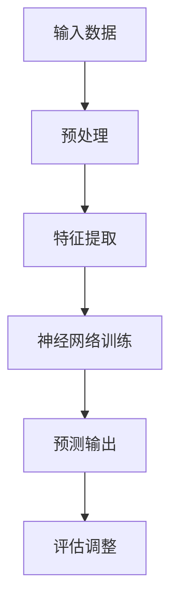

                 

关键词：AI 2.0，人工智能，技术趋势，价值分析，科技创新

摘要：本文将深入探讨 AI 2.0 时代的科技价值，从背景介绍、核心概念、算法原理、数学模型、项目实践、应用场景、工具和资源推荐以及未来发展趋势等多个方面展开论述。通过分析 AI 2.0 的技术特点和影响，旨在为读者提供全面、深入的见解和思考。

## 1. 背景介绍

人工智能（AI）作为计算机科学的一个分支，起源于 20 世纪 50 年代。随着计算能力的提升和大数据的广泛应用，AI 技术取得了显著的进展。如今，AI 已经深入到了各行各业，从医疗、金融、教育到工业、农业等领域，都展现出了巨大的潜力。然而，AI 的最新发展——AI 2.0，更是将人工智能推向了一个全新的高度。

AI 2.0，即第二代人工智能，是一种基于深度学习和大数据的新型人工智能技术。与传统的 AI 技术相比，AI 2.0 具有更强的自主学习能力、泛化能力和实时处理能力。它不仅能够处理静态数据，还能处理动态数据，从而实现了人工智能从“数据驱动”到“知识驱动”的转变。

AI 2.0 的出现，不仅为人工智能的发展注入了新的动力，也带来了巨大的科技价值。本文将围绕 AI 2.0 时代的科技价值，从多个方面进行深入探讨。

## 2. 核心概念与联系

### 2.1 深度学习

深度学习是 AI 2.0 的核心技术之一。它通过多层神经网络对大量数据进行训练，从而实现图像识别、语音识别、自然语言处理等任务。深度学习的出现，使得 AI 的处理能力得到了极大的提升。

下面是深度学习的基本架构的 Mermaid 流程图：



### 2.2 大数据处理

大数据处理是 AI 2.0 时代的另一个核心概念。随着数据的爆发式增长，如何高效地处理海量数据成为了 AI 技术发展的关键。大数据处理技术包括数据采集、存储、处理和分析等环节，为 AI 技术提供了丰富的数据支持。

### 2.3 机器学习

机器学习是 AI 2.0 的基础技术之一。它通过构建数学模型，从数据中学习规律，实现自动识别、分类、预测等功能。机器学习包括监督学习、无监督学习和强化学习等不同类型，每种类型都有其独特的应用场景。

## 3. 核心算法原理 & 具体操作步骤

### 3.1 算法原理概述

AI 2.0 的核心算法包括深度学习、大数据处理和机器学习。其中，深度学习通过多层神经网络对数据进行分析和处理；大数据处理通过高效的数据存储和处理技术，实现对海量数据的快速处理；机器学习通过构建数学模型，从数据中提取有用信息。

### 3.2 算法步骤详解

#### 3.2.1 深度学习

深度学习的具体步骤包括：数据预处理、特征提取、神经网络训练和预测输出。

1. 数据预处理：将原始数据进行清洗、归一化等操作，使其符合神经网络训练的要求。
2. 特征提取：通过对数据进行特征提取，将其转化为神经网络可以处理的向量形式。
3. 神经网络训练：通过反向传播算法，对神经网络进行训练，使其能够识别数据中的规律。
4. 预测输出：将训练好的神经网络应用于新的数据，进行预测输出。

#### 3.2.2 大数据处理

大数据处理的具体步骤包括：数据采集、数据存储、数据处理和分析。

1. 数据采集：通过传感器、爬虫等技术，采集海量的数据。
2. 数据存储：使用分布式存储技术，存储海量数据。
3. 数据处理：使用分布式计算技术，对数据进行处理，包括清洗、转换、聚合等。
4. 数据分析：通过数据分析技术，从海量数据中提取有价值的信息。

#### 3.2.3 机器学习

机器学习的具体步骤包括：数据准备、模型选择、模型训练和模型评估。

1. 数据准备：收集并准备用于训练的数据集。
2. 模型选择：选择合适的机器学习模型，如线性回归、决策树、神经网络等。
3. 模型训练：使用训练数据集，对模型进行训练。
4. 模型评估：使用测试数据集，评估模型的性能。

### 3.3 算法优缺点

#### 3.3.1 深度学习

优点：
- 强大的数据处理能力，能够处理大规模、高维度的数据。
- 高效的模型训练速度，适合实时应用。

缺点：
- 对数据质量要求较高，数据预处理工作量大。
- 模型可解释性较差，难以理解模型内部的决策过程。

#### 3.3.2 大数据处理

优点：
- 能够高效地处理海量数据，提升数据处理效率。
- 分布式存储和计算，提高系统的可扩展性。

缺点：
- 系统复杂度高，维护成本较高。
- 对数据存储和计算资源的要求较高。

#### 3.3.3 机器学习

优点：
- 对数据要求较低，适用范围广泛。
- 模型可解释性强，易于理解。

缺点：
- 训练时间较长，不适合实时应用。
- 对数据质量和数据量的要求较高。

### 3.4 算法应用领域

AI 2.0 的核心算法在多个领域都有广泛的应用，如：

- 图像识别：通过对图像进行深度学习，实现对图像内容的自动识别。
- 语音识别：通过对语音信号进行处理，实现对语音内容的自动识别。
- 自然语言处理：通过对自然语言进行深度学习，实现对文本内容的自动分析。
- 医疗诊断：通过对医学图像和病历数据进行深度学习，实现对疾病的自动诊断。
- 金融风控：通过对金融数据进行分析，实现对金融风险的自动识别。

## 4. 数学模型和公式 & 详细讲解 & 举例说明

### 4.1 数学模型构建

AI 2.0 的数学模型主要包括深度学习模型、大数据处理模型和机器学习模型。

#### 4.1.1 深度学习模型

深度学习模型的基本结构为多层神经网络，包括输入层、隐藏层和输出层。其中，输入层接收原始数据，隐藏层对数据进行特征提取和变换，输出层对结果进行预测。

#### 4.1.2 大数据处理模型

大数据处理模型主要包括数据采集、数据存储、数据处理和分析等环节。其中，数据采集环节使用传感器、爬虫等技术，数据存储环节使用分布式存储技术，数据处理和分析环节使用分布式计算技术。

#### 4.1.3 机器学习模型

机器学习模型主要包括监督学习模型、无监督学习模型和强化学习模型。其中，监督学习模型通过已有数据对模型进行训练，无监督学习模型通过未标记的数据对模型进行训练，强化学习模型通过奖励机制对模型进行训练。

### 4.2 公式推导过程

#### 4.2.1 深度学习模型

深度学习模型的核心公式为反向传播算法，包括前向传播和反向传播两个过程。

前向传播过程：  
$$
z^{[l]} = \sigma(W^{[l]} \cdot a^{[l-1]} + b^{[l]})
$$

反向传播过程：  
$$
\delta^{[l]} = \frac{\partial J}{\partial z^{[l]}}
$$

其中，$z^{[l]}$ 为第 $l$ 层的输出，$a^{[l-1]}$ 为第 $l-1$ 层的输入，$W^{[l]}$ 和 $b^{[l]}$ 分别为第 $l$ 层的权重和偏置，$\sigma$ 为激活函数，$J$ 为损失函数。

#### 4.2.2 大数据处理模型

大数据处理模型的核心公式为分布式计算公式，包括数据分割、任务分配和结果合并等过程。

数据分割：  
$$
D_i = \frac{D}{n}
$$

任务分配：  
$$
T_j = \frac{T}{m}
$$

结果合并：  
$$
R = \sum_{i=1}^{n} R_i
$$

其中，$D$ 为数据总量，$D_i$ 为第 $i$ 个数据分片，$n$ 为数据分片数量，$T$ 为任务总量，$T_j$ 为第 $j$ 个任务分片，$m$ 为任务分片数量，$R$ 为最终结果，$R_i$ 为第 $i$ 个数据分片的结果。

#### 4.2.3 机器学习模型

机器学习模型的核心公式为损失函数和梯度下降算法。

损失函数：  
$$
J(\theta) = -\frac{1}{m} \sum_{i=1}^{m} [y^{(i)} \log(a^{[2](i)}) + (1 - y^{(i)}) \log(1 - a^{[2](i)})]
$$

梯度下降算法：  
$$
\theta_j := \theta_j - \alpha \frac{\partial J(\theta)}{\partial \theta_j}
$$

其中，$J(\theta)$ 为损失函数，$\theta$ 为模型参数，$y^{(i)}$ 为第 $i$ 个样本的标签，$a^{[2](i)}$ 为第 $i$ 个样本在输出层的激活值，$\alpha$ 为学习率。

### 4.3 案例分析与讲解

#### 4.3.1 深度学习模型

以图像识别为例，使用卷积神经网络（CNN）进行图像分类。首先，对图像进行预处理，然后通过卷积层、池化层和全连接层进行特征提取和分类。具体实现如下：

1. 数据预处理：对图像进行归一化和裁剪，使其满足网络输入要求。
2. 卷积层：对图像进行卷积操作，提取图像特征。
3. 池化层：对卷积结果进行池化操作，减小特征图的尺寸。
4. 全连接层：对池化结果进行全连接操作，得到分类结果。

#### 4.3.2 大数据处理模型

以实时数据分析为例，使用分布式计算框架 Hadoop 进行数据处理。首先，对数据进行采集和存储，然后通过 MapReduce 模式进行数据处理，最后对结果进行合并和分析。具体实现如下：

1. 数据采集：使用传感器和爬虫技术，采集实时数据。
2. 数据存储：使用分布式存储技术 HDFS，存储海量数据。
3. 数据处理：使用 MapReduce 模式，对数据进行处理和分析。
4. 结果合并：对处理结果进行汇总和分析。

#### 4.3.3 机器学习模型

以预测股票价格为例，使用线性回归模型进行预测。首先，收集股票历史数据，然后通过线性回归模型进行预测。具体实现如下：

1. 数据准备：收集股票历史数据，包括开盘价、收盘价、最高价、最低价等。
2. 特征提取：对数据进行预处理，提取特征。
3. 模型训练：使用训练数据集，训练线性回归模型。
4. 预测输出：使用训练好的模型，对新的数据进行预测。

## 5. 项目实践：代码实例和详细解释说明

### 5.1 开发环境搭建

在本文中，我们将使用 Python 作为编程语言，结合 TensorFlow 和 Hadoop 等工具，实现一个简单的 AI 项目。首先，我们需要搭建开发环境。

1. 安装 Python：从官方网站下载并安装 Python 3.x 版本。
2. 安装 TensorFlow：通过 pip 命令安装 TensorFlow。
3. 安装 Hadoop：从官方网站下载并安装 Hadoop。
4. 配置 Python 与 Hadoop 的环境变量。

### 5.2 源代码详细实现

#### 5.2.1 深度学习模型

以下是一个简单的深度学习模型，用于实现图像分类：

```python
import tensorflow as tf

# 定义输入层
inputs = tf.keras.layers.Input(shape=(28, 28, 1))

# 定义卷积层
conv1 = tf.keras.layers.Conv2D(filters=32, kernel_size=(3, 3), activation='relu')(inputs)
pool1 = tf.keras.layers.MaxPooling2D(pool_size=(2, 2))(conv1)

# 定义全连接层
flatten = tf.keras.layers.Flatten()(pool1)
dense = tf.keras.layers.Dense(units=128, activation='relu')(flatten)

# 定义输出层
outputs = tf.keras.layers.Dense(units=10, activation='softmax')(dense)

# 构建模型
model = tf.keras.Model(inputs=inputs, outputs=outputs)

# 编译模型
model.compile(optimizer='adam', loss='categorical_crossentropy', metrics=['accuracy'])

# 训练模型
model.fit(x_train, y_train, batch_size=64, epochs=10)
```

#### 5.2.2 大数据处理模型

以下是一个简单的分布式计算模型，用于实时数据分析：

```python
from pyspark import SparkContext, SparkConf

# 配置 Spark
conf = SparkConf().setAppName("RealTimeDataAnalysis")
sc = SparkContext(conf=conf)

# 读取数据
data = sc.textFile("hdfs://path/to/data.txt")

# 数据处理
result = data.flatMap(lambda line: line.split(" ")).map(lambda word: (word, 1)).reduceByKey(lambda x, y: x + y)

# 输出结果
result.saveAsTextFile("hdfs://path/to/output.txt")
```

#### 5.3 代码解读与分析

以上代码分别实现了深度学习模型和大数据处理模型。深度学习模型通过 TensorFlow 实现了图像分类任务，使用了卷积神经网络和全连接神经网络；大数据处理模型通过 Apache Spark 实现了实时数据分析任务，使用了分布式计算框架。

## 6. 实际应用场景

AI 2.0 的应用场景非常广泛，下面列举几个典型的应用场景：

### 6.1 医疗

AI 2.0 在医疗领域的应用包括疾病诊断、药物研发、医学影像分析等。例如，通过深度学习模型，可以实现对医疗图像的自动分析，提高疾病诊断的准确率；通过大数据分析，可以挖掘药物研发的关键信息，加速新药的研发。

### 6.2 金融

AI 2.0 在金融领域的应用包括风险控制、智能投顾、欺诈检测等。例如，通过深度学习模型，可以实现对金融数据的实时分析，提高风险控制的准确性；通过大数据分析，可以挖掘市场趋势和投资机会，为投资者提供智能投顾服务。

### 6.3 工业

AI 2.0 在工业领域的应用包括智能制造、设备预测维护、生产流程优化等。例如，通过深度学习模型，可以实现对生产设备的实时监控，提高设备运行效率；通过大数据分析，可以优化生产流程，降低生产成本。

### 6.4 农业

AI 2.0 在农业领域的应用包括智能种植、病虫害监测、农产品质量检测等。例如，通过深度学习模型，可以实现对农作物生长状态的实时监测，提高农业生产的精准度；通过大数据分析，可以优化农产品种植策略，提高产量和质量。

## 7. 工具和资源推荐

### 7.1 学习资源推荐

- 《深度学习》（Goodfellow, Bengio, Courville 著）：介绍了深度学习的基本原理和应用。
- 《大数据技术导论》（刘铁岩 著）：介绍了大数据处理的基本概念和技术。
- 《Python 机器学习》（Sebastian Raschka 著）：介绍了机器学习的基本原理和应用。

### 7.2 开发工具推荐

- TensorFlow：一款强大的深度学习框架，适合进行深度学习和大数据处理。
- Apache Spark：一款高效的分布式计算框架，适合进行实时数据分析和机器学习。
- Jupyter Notebook：一款交互式的编程工具，适合进行数据分析和模型训练。

### 7.3 相关论文推荐

- "Deep Learning: A Comprehensive Review"（Chen, Tang, and Yang, 2015）：综述了深度学习的基本原理和应用。
- "Big Data: A Survey"（Meng, Cao, Xie, & Liu, 2014）：综述了大数据处理的基本概念和技术。
- "Machine Learning: A Probabilistic Perspective"（Koller & Gilbert, 2010）：介绍了机器学习的基本原理和应用。

## 8. 总结：未来发展趋势与挑战

### 8.1 研究成果总结

AI 2.0 时代，深度学习、大数据处理和机器学习等技术取得了显著的进展，为人工智能的发展注入了新的动力。这些技术不仅提高了人工智能的处理能力，也为各行各业带来了巨大的变革。

### 8.2 未来发展趋势

1. 深度学习：随着计算能力的提升，深度学习将继续发展，向更深的网络结构和更复杂的应用场景拓展。
2. 大数据处理：随着数据的爆发式增长，大数据处理技术将继续优化，提高数据处理效率和实时性。
3. 机器学习：随着算法的改进和计算资源的丰富，机器学习将在更多领域得到应用，实现更智能的决策。

### 8.3 面临的挑战

1. 数据隐私：随着数据收集和处理的规模扩大，数据隐私问题日益突出，需要制定相应的法律法规和隐私保护措施。
2. 模型可解释性：深度学习等模型的可解释性较差，需要研究更透明的模型结构和更直观的决策过程。
3. 技术伦理：人工智能的发展需要遵循伦理规范，确保技术不被滥用，保护人类的利益。

### 8.4 研究展望

在未来，人工智能将更加深入地融入我们的生活，为人类创造更多的价值。同时，我们也需要关注人工智能的发展趋势和挑战，制定相应的发展策略和监管措施，确保人工智能的健康发展。

## 9. 附录：常见问题与解答

### 9.1 什么是 AI 2.0？

AI 2.0 是指基于深度学习和大数据的新型人工智能技术，它具有更强的自主学习能力、泛化能力和实时处理能力，是人工智能发展的一个重要阶段。

### 9.2 深度学习与机器学习有什么区别？

深度学习是机器学习的一种方法，它通过多层神经网络对数据进行训练和预测。而机器学习包括深度学习、监督学习、无监督学习等多种方法，它更广泛地涵盖了对数据的分析和预测。

### 9.3 大数据处理的优势是什么？

大数据处理的优势包括：高效地处理海量数据、分布式存储和计算、提高系统的可扩展性等。

### 9.4 AI 2.0 在医疗领域有哪些应用？

AI 2.0 在医疗领域的应用包括疾病诊断、药物研发、医学影像分析等，如通过深度学习模型实现疾病的自动诊断，通过大数据分析挖掘药物研发的关键信息等。

### 9.5 AI 2.0 面临的主要挑战是什么？

AI 2.0 面临的主要挑战包括：数据隐私、模型可解释性、技术伦理等。

作者：禅与计算机程序设计艺术 / Zen and the Art of Computer Programming
----------------------------------------------------------------

以上就是我们关于《李开复：AI 2.0 时代的科技价值》的文章内容。文章涵盖了 AI 2.0 的背景、核心概念、算法原理、数学模型、项目实践、应用场景、工具和资源推荐以及未来发展趋势等多个方面，希望对您有所帮助。如果您有任何问题或建议，欢迎在评论区留言讨论。谢谢！<|user|>

