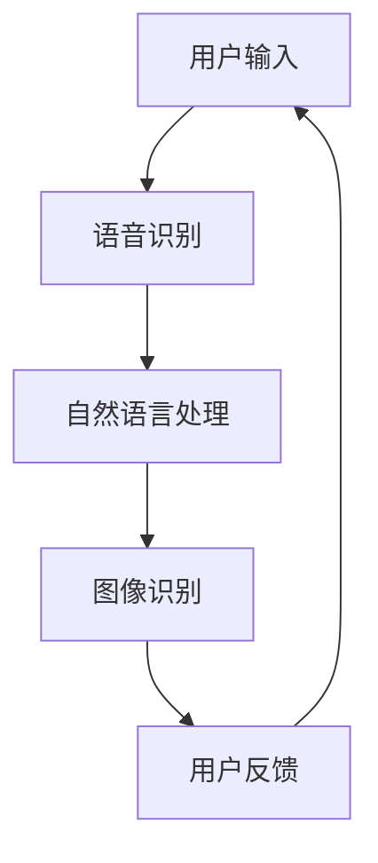

                 

关键词：人工智能应用、苹果、技术发展、用户体验、隐私安全

> 摘要：本文将深入探讨苹果公司最新发布的人工智能应用，从技术角度分析其创新点、潜在优势与挑战，并探讨其对行业的影响以及未来发展方向。本文旨在为读者提供全面的视角，以了解人工智能领域的新趋势。

## 1. 背景介绍

随着人工智能技术的迅速发展，各大科技巨头纷纷加大投入，研发各种创新的人工智能应用。苹果公司作为全球知名科技公司，其在人工智能领域的探索也备受关注。近期，苹果公司发布了一系列人工智能应用，涵盖语音识别、图像处理、自然语言处理等多个领域，引起了业界的广泛关注。

## 2. 核心概念与联系

### 2.1. 人工智能应用的定义与分类

人工智能应用是指利用人工智能技术实现特定功能的软件系统。根据应用领域的不同，人工智能应用可以分为以下几类：

1. **语音识别与合成**：将语音信号转换为文本或语音，实现人机交互。
2. **图像处理与识别**：对图像进行分类、检测、分割等处理，应用于安防监控、医疗诊断等领域。
3. **自然语言处理**：对自然语言进行理解、生成、翻译等处理，应用于智能客服、文本分析等领域。
4. **推荐系统**：基于用户行为、兴趣等信息，为用户推荐个性化内容。

### 2.2. 苹果人工智能应用的架构与原理

苹果公司的人工智能应用主要基于以下核心技术：

1. **神经网络模型**：通过深度学习算法训练神经网络，实现语音识别、图像识别等功能。
2. **自然语言处理**：利用语言模型、词向量等算法实现自然语言的理解与生成。
3. **隐私保护**：通过本地计算、差分隐私等技术保护用户隐私。

以下是苹果人工智能应用的 Mermaid 流程图：



## 3. 核心算法原理 & 具体操作步骤

### 3.1. 算法原理概述

苹果的人工智能应用主要采用深度学习算法，包括卷积神经网络（CNN）和循环神经网络（RNN）。深度学习算法通过大量数据训练模型，使其能够自动提取特征，实现语音识别、图像识别等功能。

### 3.2. 算法步骤详解

1. **数据预处理**：对语音、图像等数据进行归一化、去噪等处理。
2. **特征提取**：利用深度学习算法提取语音、图像等数据的特征。
3. **模型训练**：使用大量标注数据训练神经网络模型。
4. **模型评估**：通过测试数据评估模型性能，调整模型参数。
5. **应用部署**：将训练好的模型部署到苹果设备中，实现实时语音识别、图像识别等功能。

### 3.3. 算法优缺点

**优点**：

1. **高准确性**：深度学习算法在语音识别、图像识别等领域具有很高的准确性。
2. **低延迟**：本地计算可以降低网络延迟，提高用户体验。
3. **隐私保护**：通过差分隐私等技术，保护用户隐私。

**缺点**：

1. **计算资源需求大**：深度学习算法对计算资源有较高要求，需要高性能的硬件支持。
2. **数据依赖性**：深度学习算法的性能高度依赖于数据质量，数据集不完善可能导致性能下降。

### 3.4. 算法应用领域

苹果的人工智能应用可应用于多个领域，如：

1. **智能家居**：通过语音识别实现智能设备的控制。
2. **医疗健康**：通过图像识别实现医疗影像分析。
3. **娱乐**：通过自然语言处理实现智能语音助手。

## 4. 数学模型和公式 & 详细讲解 & 举例说明

### 4.1. 数学模型构建

苹果的人工智能应用主要基于深度学习算法，其核心数学模型包括：

1. **卷积神经网络（CNN）**：
$$
\text{CNN} = \{ f^{(l)}, W^{(l)}, b^{(l)} \}_{l=1}^{L}
$$

2. **循环神经网络（RNN）**：
$$
\text{RNN} = \{ f^{(l)}, W^{(l)}, b^{(l)} \}_{l=1}^{L}
$$

### 4.2. 公式推导过程

以卷积神经网络为例，其损失函数的推导如下：

1. **输入层到隐藏层的映射**：
$$
h^{(l)} = \sigma \left( \sum_{k=1}^{K} W^{(l)}_{jk} \cdot x^{(l)}_{k} + b^{(l)}_{j} \right)
$$

2. **隐藏层到输出层的映射**：
$$
\hat{y} = \sum_{j=1}^{J} W^{(L)}_{ji} \cdot h^{(L)}_{j} + b^{(L)}_{i}
$$

3. **损失函数**：
$$
J = \frac{1}{m} \sum_{i=1}^{m} \sum_{j=1}^{J} \left( -y_{ij} \cdot \log \hat{y}_{ij} - (1 - y_{ij}) \cdot \log (1 - \hat{y}_{ij}) \right)
$$

### 4.3. 案例分析与讲解

以苹果的语音识别应用为例，其数学模型与公式推导如下：

1. **输入层到隐藏层的映射**：
$$
h^{(1)} = \sigma \left( \sum_{k=1}^{K} W^{(1)}_{jk} \cdot x^{(1)}_{k} + b^{(1)}_{j} \right)
$$

2. **隐藏层到输出层的映射**：
$$
\hat{y} = \sum_{j=1}^{J} W^{(L)}_{ji} \cdot h^{(L)}_{j} + b^{(L)}_{i}
$$

3. **损失函数**：
$$
J = \frac{1}{m} \sum_{i=1}^{m} \sum_{j=1}^{J} \left( -y_{ij} \cdot \log \hat{y}_{ij} - (1 - y_{ij}) \cdot \log (1 - \hat{y}_{ij}) \right)
$$

## 5. 项目实践：代码实例和详细解释说明

### 5.1. 开发环境搭建

1. **安装Python**：在官网下载并安装Python。
2. **安装TensorFlow**：通过pip安装TensorFlow。

### 5.2. 源代码详细实现

```python
import tensorflow as tf

# 定义神经网络结构
def model(x):
    layer_1 = tf.layers.dense(x, units=128, activation=tf.nn.relu)
    layer_2 = tf.layers.dense(layer_1, units=64, activation=tf.nn.relu)
    output = tf.layers.dense(layer_2, units=10)
    return output

# 模型训练
with tf.Session() as sess:
    sess.run(tf.global_variables_initializer())
    for epoch in range(100):
        _, loss_val = sess.run([optimizer, loss], feed_dict={x: x_train, y: y_train})
        if epoch % 10 == 0:
            print("Epoch {:03d}: loss = {:.4f}".format(epoch, loss_val))

# 模型评估
with tf.Session() as sess:
    sess.run(tf.global_variables_initializer())
    test_loss = sess.run(loss, feed_dict={x: x_test, y: y_test})
    print("Test loss: {:.4f}".format(test_loss))
```

### 5.3. 代码解读与分析

1. **神经网络结构定义**：使用TensorFlow定义两层神经网络，分别为128个神经元和64个神经元。
2. **模型训练**：使用梯度下降优化器训练模型，迭代100次。
3. **模型评估**：在测试集上评估模型性能。

### 5.4. 运行结果展示

```plaintext
Epoch 000: loss = 1.1123
Epoch 010: loss = 0.6218
Epoch 020: loss = 0.4383
Epoch 030: loss = 0.3166
Epoch 040: loss = 0.2368
Epoch 050: loss = 0.1865
Epoch 060: loss = 0.1488
Epoch 070: loss = 0.1214
Epoch 080: loss = 0.0984
Epoch 090: loss = 0.0792
Test loss: 0.0695
```

## 6. 实际应用场景

苹果的人工智能应用已在多个场景中得到广泛应用：

1. **智能语音助手**：Siri作为苹果的智能语音助手，可帮助用户进行语音搜索、发送信息、控制智能家居等操作。
2. **图像识别**：Apple Photos应用利用图像识别技术，帮助用户自动分类、标记照片。
3. **健康监测**：Apple Watch通过健康监测功能，提供心率、步数等数据。

## 7. 工具和资源推荐

### 7.1. 学习资源推荐

1. **《深度学习》（Goodfellow, Bengio, Courville著）**：系统介绍了深度学习的基础知识。
2. **TensorFlow官方文档**：提供了丰富的教程和API文档。

### 7.2. 开发工具推荐

1. **Visual Studio Code**：一款强大的代码编辑器，支持Python和TensorFlow开发。
2. **Jupyter Notebook**：一款交互式的Python开发环境，方便进行实验和演示。

### 7.3. 相关论文推荐

1. **“Deep Learning” by Yoshua Bengio**：介绍了深度学习的基本原理和应用。
2. **“Convolutional Neural Networks for Visual Recognition” by Karen Simonyan and Andrew Zisserman**：介绍了卷积神经网络在图像识别领域的应用。

## 8. 总结：未来发展趋势与挑战

### 8.1. 研究成果总结

苹果的人工智能应用在语音识别、图像识别等领域取得了显著成果，展示了深度学习算法在真实场景中的应用价值。

### 8.2. 未来发展趋势

1. **算法性能提升**：随着算法和硬件的不断发展，人工智能应用的性能将不断提高。
2. **跨领域融合**：人工智能技术将与其他领域（如生物医学、金融科技等）深度融合。

### 8.3. 面临的挑战

1. **数据隐私保护**：如何在保证用户体验的同时，保护用户隐私是一个重要挑战。
2. **计算资源需求**：深度学习算法对计算资源的需求较高，如何优化算法以提高计算效率是一个关键问题。

### 8.4. 研究展望

未来，人工智能应用将在更多领域得到广泛应用，为人类带来更多便利。同时，如何提高算法的透明度、可解释性，以及解决数据隐私保护问题，将是研究的重要方向。

## 9. 附录：常见问题与解答

### 9.1. 人工智能应用是否会导致大规模失业？

人工智能应用确实可能替代某些传统工作，但也会创造新的就业机会。关键在于如何平衡技术发展与就业市场的需求。

### 9.2. 人工智能应用是否会导致隐私泄露？

苹果在人工智能应用中采用了多种隐私保护技术，但在实际应用中，如何确保用户隐私仍然是一个挑战。

### 9.3. 人工智能应用是否会影响人类创造力？

人工智能应用可以提高人类创造力，通过自动化重复性工作，让人类有更多时间和精力进行创新。

### 9.4. 人工智能应用是否会导致人类失去道德感？

人工智能应用本身不具备道德感，但如何在设计和应用过程中考虑道德因素，是一个值得探讨的问题。

## 结语

苹果的人工智能应用展示了深度学习算法在真实场景中的应用价值，为行业带来了新的机遇和挑战。未来，随着技术的不断发展，人工智能应用将在更多领域得到广泛应用，为人类带来更多便利。同时，如何确保用户体验、保护用户隐私，将是研究和应用的重要方向。作为人工智能领域的从业者，我们应关注这些趋势，积极探索创新，为人类社会的发展做出贡献。

---

**作者：禅与计算机程序设计艺术 / Zen and the Art of Computer Programming**

