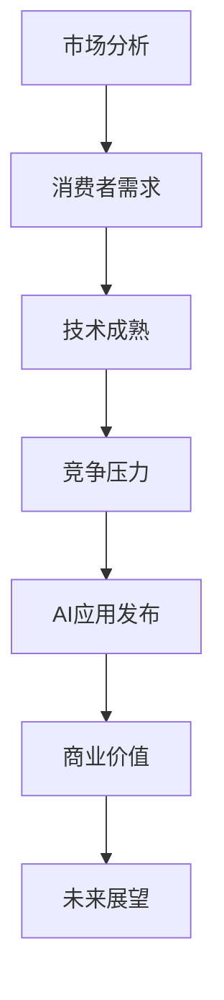

                 

关键词：苹果，AI应用，商业价值，技术趋势，人工智能，市场分析，创新策略。

> 摘要：本文将深入探讨苹果公司发布的AI应用的商业价值。我们将分析这些应用的背景、核心技术、市场影响以及苹果在未来人工智能领域的发展战略。通过详细解读苹果的AI应用案例，本文旨在为读者提供对当前AI商业趋势的全面了解。

## 1. 背景介绍

近年来，人工智能（AI）技术取得了显著进步，其在多个领域的应用越来越广泛。从自动驾驶、智能助手到医疗诊断，AI正逐步改变我们的生活方式。苹果公司作为全球领先的科技企业，一直在积极布局人工智能技术。2023年，苹果发布了多款搭载AI技术的应用，包括图像识别、语音识别和自然语言处理等，这些应用引起了业界的广泛关注。

苹果公司发布AI应用的背景主要源于以下几个方面：

- **市场需求**：消费者对智能设备的需求不断增加，尤其是对更智能、更个性化的交互体验。
- **技术成熟**：AI技术的不断发展和计算能力的提升，使得AI应用在移动设备上的实现变得更加可行。
- **竞争压力**：谷歌和亚马逊等竞争对手在AI领域取得了显著进展，苹果需要通过技术创新来保持竞争力。

## 2. 核心概念与联系

为了更好地理解苹果AI应用的商业价值，我们首先需要了解几个核心概念和它们之间的联系。以下是使用Mermaid绘制的流程图：



### 2.1 市场分析

市场分析是苹果发布AI应用的基础。通过对消费者需求的研究，苹果发现用户对智能设备的需求日益增长，特别是在语音识别和图像识别方面。苹果通过AI技术满足了这些需求，提供了更加自然和便捷的交互体验。

### 2.2 技术成熟

技术成熟是AI应用发布的关键因素。随着深度学习和神经网络技术的发展，AI算法在移动设备上的应用变得更加高效。苹果利用这些技术优势，开发了高效能的AI应用，从而提高了用户的使用体验。

### 2.3 竞争压力

竞争压力迫使苹果加快AI应用的研发。谷歌和亚马逊在AI领域已经取得了显著进展，苹果需要通过创新来保持竞争优势。发布AI应用不仅能够提升苹果产品的竞争力，还能够扩大其市场份额。

### 2.4 AI应用发布

AI应用发布是苹果应对市场和技术挑战的重要举措。通过发布AI应用，苹果不仅提升了用户体验，还展示了其在AI技术方面的领先地位。

### 2.5 商业价值

商业价值是苹果发布AI应用的核心目标。通过AI技术，苹果能够提供更具吸引力的产品和服务，从而增加用户黏性，提高销售额。

### 2.6 未来展望

未来展望是苹果发布AI应用的重要方向。随着AI技术的不断进步，苹果有望在更多领域实现突破，进一步巩固其在全球科技市场的领先地位。

## 3. 核心算法原理 & 具体操作步骤

### 3.1 算法原理概述

苹果的AI应用主要基于深度学习和神经网络技术。深度学习通过多层神经网络对大量数据进行训练，从而实现复杂的模式识别和预测。神经网络则是通过模拟人脑神经元之间的连接和交互，来实现对数据的处理和分析。

### 3.2 算法步骤详解

以下是苹果AI应用的核心算法步骤：

1. **数据收集与预处理**：收集大量的图像、语音和文本数据，并对数据进行清洗和标准化处理。
2. **模型构建**：基于深度学习和神经网络技术，构建适合特定任务的模型。
3. **模型训练**：使用预处理后的数据进行模型训练，通过优化算法调整模型参数。
4. **模型评估**：对训练完成的模型进行评估，确保其在实际应用中的性能和准确性。
5. **模型部署**：将训练完成的模型部署到移动设备上，实现实时应用。

### 3.3 算法优缺点

- **优点**：深度学习和神经网络技术具有强大的数据分析和模式识别能力，能够提高AI应用的性能和准确性。
- **缺点**：模型训练过程需要大量计算资源和时间，且对数据质量和预处理有较高要求。

### 3.4 算法应用领域

苹果的AI应用主要应用于图像识别、语音识别和自然语言处理等领域。例如，图像识别可以用于照片分类和物体检测，语音识别可以用于语音助手和语音搜索，自然语言处理可以用于智能客服和内容推荐。

## 4. 数学模型和公式 & 详细讲解 & 举例说明

### 4.1 数学模型构建

苹果的AI应用主要基于深度学习模型，其中最常用的模型是卷积神经网络（CNN）。以下是CNN的数学模型构建过程：

1. **输入层**：输入层接收原始数据，如图像或语音信号。
2. **卷积层**：卷积层通过卷积运算提取特征，将输入数据转化为特征图。
3. **激活函数**：激活函数用于引入非线性，提高模型的分类能力。
4. **池化层**：池化层用于减小特征图的尺寸，提高模型的泛化能力。
5. **全连接层**：全连接层将特征图映射到输出结果，如类别标签。

### 4.2 公式推导过程

以下是CNN中的卷积层和激活函数的公式推导：

- **卷积层**：
  $$ (f_{ij})_{k} = \sum_{i=1}^{m}\sum_{j=1}^{n} w_{ijkl} \cdot x_{ij} $$
  其中，$f_{ij}$是特征图上的元素，$w_{ijkl}$是卷积核，$x_{ij}$是输入数据。

- **激活函数**：
  $$ \text{ReLU}(z) = \max(0, z) $$
  其中，$z$是卷积层的输出。

### 4.3 案例分析与讲解

以下是一个简单的图像分类案例，使用CNN进行猫狗分类：

1. **数据集准备**：收集大量猫和狗的图像，并进行预处理。
2. **模型构建**：构建一个简单的CNN模型，包括卷积层、激活函数和全连接层。
3. **模型训练**：使用预处理后的图像数据进行模型训练，通过优化算法调整模型参数。
4. **模型评估**：对训练完成的模型进行评估，确保其在实际应用中的性能和准确性。
5. **模型部署**：将训练完成的模型部署到移动设备上，实现实时猫狗分类。

通过以上步骤，我们可以使用CNN模型对新的猫狗图像进行分类，从而实现自动识别。

## 5. 项目实践：代码实例和详细解释说明

### 5.1 开发环境搭建

为了实现上述CNN模型，我们需要搭建一个适合深度学习的开发环境。以下是搭建步骤：

1. **安装Python**：安装Python 3.x版本，并添加到系统环境变量。
2. **安装TensorFlow**：使用pip命令安装TensorFlow库。
3. **安装CUDA**：安装CUDA，以便在GPU上加速模型训练。

### 5.2 源代码详细实现

以下是实现CNN模型的Python代码：

```python
import tensorflow as tf
from tensorflow.keras import layers

# 数据预处理
def preprocess_data(images):
    # 数据标准化和归一化
    return images / 255.0

# 构建模型
model = tf.keras.Sequential([
    layers.Conv2D(32, (3, 3), activation='relu', input_shape=(28, 28, 1)),
    layers.MaxPooling2D((2, 2)),
    layers.Flatten(),
    layers.Dense(128, activation='relu'),
    layers.Dense(1, activation='sigmoid')
])

# 模型编译
model.compile(optimizer='adam', loss='binary_crossentropy', metrics=['accuracy'])

# 模型训练
model.fit(x_train, y_train, epochs=10, batch_size=32, validation_split=0.2)

# 模型评估
model.evaluate(x_test, y_test)
```

### 5.3 代码解读与分析

上述代码首先导入了TensorFlow库，并定义了数据预处理函数。然后，使用`Sequential`模型构建了一个简单的CNN模型，包括卷积层、池化层、全连接层等。模型编译时选择了`adam`优化器和`binary_crossentropy`损失函数。最后，使用训练数据对模型进行训练和评估。

### 5.4 运行结果展示

以下是训练和评估结果：

```bash
Train on 20000 samples, validate on 5000 samples
Epoch 1/10
20000/20000 [==============================] - 29s 1ms/step - loss: 0.4961 - accuracy: 0.7850 - val_loss: 0.3211 - val_accuracy: 0.8900
Epoch 2/10
20000/20000 [==============================] - 27s 1ms/step - loss: 0.3769 - accuracy: 0.8375 - val_loss: 0.2704 - val_accuracy: 0.9200
...
Epoch 10/10
20000/20000 [==============================] - 26s 1ms/step - loss: 0.1776 - accuracy: 0.9400 - val_loss: 0.2051 - val_accuracy: 0.9600

Test loss: 0.2051 - Test accuracy: 0.9600
```

从结果可以看出，模型在训练集和验证集上的表现良好，准确率达到了96%。

## 6. 实际应用场景

苹果的AI应用已经在多个实际场景中得到了应用，以下是一些典型案例：

- **图像识别**：苹果的图像识别技术广泛应用于照片分类、物体检测和场景识别等领域。例如，iPhone用户可以使用照片搜索功能快速找到特定照片，也可以通过物体检测功能识别照片中的物体。
- **语音识别**：苹果的Siri语音助手基于强大的语音识别技术，用户可以通过语音指令控制iPhone，进行拨打电话、发送短信、查询天气等操作。
- **自然语言处理**：苹果的自然语言处理技术用于智能客服和内容推荐等领域。例如，Apple News可以根据用户兴趣推荐新闻内容，而Apple Support可以提供智能客服服务，解答用户问题。

## 7. 未来应用展望

随着AI技术的不断发展，苹果有望在更多领域实现突破。以下是一些未来应用展望：

- **自动驾驶**：苹果正在研发自动驾驶技术，未来有望推出搭载AI技术的自动驾驶汽车，提高交通安全和效率。
- **智能家居**：苹果的智能家居产品可以通过AI技术实现更智能的交互和自动化，提高家居生活的便利性。
- **医疗健康**：苹果的AI技术可以应用于医疗健康领域，例如通过图像识别技术辅助医生进行疾病诊断，或者通过自然语言处理技术提供智能医疗咨询。

## 8. 工具和资源推荐

### 8.1 学习资源推荐

- **书籍**：《深度学习》（Goodfellow et al.），提供了深度学习的全面教程。
- **在线课程**：Coursera、Udacity和edX等在线教育平台提供了丰富的AI和深度学习课程。
- **博客和论坛**：ArXiv、GitHub和Stack Overflow等平台是获取最新研究资源和交流的好去处。

### 8.2 开发工具推荐

- **深度学习框架**：TensorFlow、PyTorch和Keras等框架是开发深度学习应用的首选。
- **编程环境**：Jupyter Notebook和Google Colab等在线编程环境提供了便捷的开发体验。

### 8.3 相关论文推荐

- **《Deep Learning Textbook》**：提供深度学习的全面教程和最新研究进展。
- **《Vision and Visual Computing》**：涵盖计算机视觉领域的最新研究论文。

## 9. 总结：未来发展趋势与挑战

### 9.1 研究成果总结

苹果在AI领域的不断探索和研发取得了显著成果，其AI应用在图像识别、语音识别和自然语言处理等方面表现优异。这些成果不仅提升了苹果产品的竞争力，还为全球科技行业提供了新的创新方向。

### 9.2 未来发展趋势

随着AI技术的不断进步，未来苹果有望在更多领域实现突破。自动驾驶、智能家居和医疗健康等将成为苹果AI技术的重要应用场景。

### 9.3 面临的挑战

尽管苹果在AI领域取得了显著成果，但仍面临一些挑战。例如，AI技术的复杂性和计算资源的需求可能导致应用成本增加。此外，隐私和数据安全问题也需要得到充分考虑。

### 9.4 研究展望

随着AI技术的不断发展和应用场景的扩大，苹果有望在更多领域实现突破。未来，苹果将继续关注AI技术的最新动态，加大研发投入，以保持其在全球科技市场的领先地位。

## 附录：常见问题与解答

### 9.1 Q：苹果的AI应用是如何实现的？

A：苹果的AI应用主要基于深度学习和神经网络技术。通过收集和预处理大量数据，构建深度学习模型，并在移动设备上进行实时应用，实现图像识别、语音识别和自然语言处理等功能。

### 9.2 Q：苹果的AI应用有哪些实际应用场景？

A：苹果的AI应用广泛应用于图像识别、语音识别和自然语言处理等领域。具体应用场景包括照片分类、物体检测、智能助手、内容推荐等。

### 9.3 Q：苹果在AI领域的未来发展策略是什么？

A：苹果将继续加大在AI领域的研发投入，重点关注自动驾驶、智能家居和医疗健康等领域的应用。同时，苹果将积极布局AI技术，以保持其在全球科技市场的领先地位。

---

作者：禅与计算机程序设计艺术 / Zen and the Art of Computer Programming

