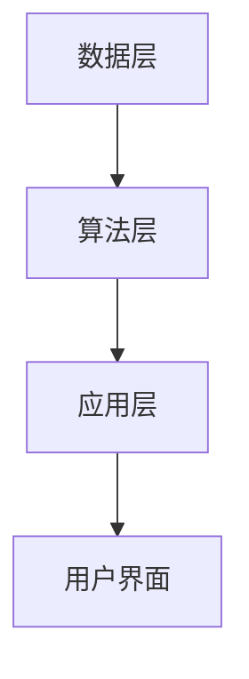

                 

关键词：苹果、AI应用、人工智能、深度学习、应用意义、技术发展

摘要：本文将深入探讨苹果公司发布AI应用的重要意义，从技术、商业和社会等多个维度进行分析。我们将详细了解AI应用的背景，其带来的影响，以及未来的发展趋势。

## 1. 背景介绍

近年来，人工智能（AI）技术取得了飞速发展，特别是深度学习领域的突破，使得计算机在图像识别、自然语言处理、语音识别等方面取得了显著的成果。这一技术进步不仅改变了科学研究的方法，也深刻影响了我们的生活。苹果公司，作为全球科技巨头之一，自然不会忽视这一趋势。近年来，苹果在多个产品中集成了AI技术，从iPhone的Siri语音助手，到iPad的智能助手，再到Mac的图像识别功能，无不体现着AI技术的应用。

然而，苹果此次发布的AI应用不仅仅是简单的集成，而是一次具有里程碑意义的发布。这个应用不仅展示了苹果在AI领域的深厚积累，更预示着未来科技发展的方向。那么，苹果这次发布的AI应用究竟有何特别之处？它又将对科技、商业和社会产生怎样的影响呢？

## 2. 核心概念与联系

### 2.1 AI应用的核心概念

首先，我们需要明确什么是AI应用。AI应用是指利用人工智能技术，特别是深度学习技术，开发出的能够解决特定问题的软件。这些应用可以是聊天机器人、图像识别系统、语音助手等，它们通过机器学习和深度学习算法，从大量数据中学习规律，从而进行决策和预测。

### 2.2 AI应用的技术架构

接下来，我们需要了解AI应用背后的技术架构。一般来说，AI应用的技术架构可以分为三个层次：数据层、算法层和应用层。

- **数据层**：数据是AI应用的基石。无论是图像识别、自然语言处理还是语音识别，都需要大量的数据来训练模型。这些数据可以是文本、图像、声音等不同形式。
  
- **算法层**：算法是AI应用的核心。深度学习算法，如卷积神经网络（CNN）、循环神经网络（RNN）等，是当前最流行的算法。这些算法通过多层网络结构，对数据进行复杂的变换和处理，从而提取特征，实现预测和分类等功能。

- **应用层**：应用层是AI技术最终呈现给用户的部分。它可以是聊天机器人、图像识别系统、语音助手等，这些应用通过用户界面，与用户进行交互，提供相应的服务。

### 2.3 AI应用的技术联系

AI应用的技术联系主要体现在以下几个方面：

- **数据与算法的关联**：数据是算法训练的基础，而算法则通过对数据的处理，提取出有用的特征，从而实现预测和分类等功能。数据与算法的紧密联系，决定了AI应用的效果。

- **算法与应用的关联**：算法是实现AI应用的核心，而应用则是算法的具体实现。算法的好坏直接决定了应用的性能。因此，算法与应用的关联也是AI应用发展的关键。

- **数据与应用的关联**：数据是应用的基础，而应用则是数据的体现。只有当数据与应用紧密关联时，AI应用才能发挥最大的价值。

为了更直观地展示AI应用的技术架构，我们可以使用Mermaid流程图来表示：



在这个流程图中，数据层通过算法层，最终实现了应用层的功能，并通过用户界面与用户进行交互。

## 3. 核心算法原理 & 具体操作步骤

### 3.1 算法原理概述

苹果此次发布的AI应用采用了深度学习算法，特别是卷积神经网络（CNN）。CNN是一种在图像识别任务中表现非常出色的算法，它通过多层网络结构，对图像进行复杂的变换和处理，从而提取出图像中的特征。

### 3.2 算法步骤详解

CNN的算法步骤可以概括为以下几个阶段：

- **输入层**：输入一张图像。
- **卷积层**：对图像进行卷积操作，提取出图像中的局部特征。
- **池化层**：对卷积层的结果进行池化操作，降低数据的维度。
- **全连接层**：将池化层的结果进行全连接操作，实现分类或回归等功能。
- **输出层**：输出最终的分类结果或预测值。

### 3.3 算法优缺点

CNN的优点在于：

- **强大的特征提取能力**：CNN通过多层网络结构，能够提取出图像中的复杂特征，从而实现准确的分类和识别。
- **适用于多种任务**：CNN不仅可以用于图像识别，还可以用于语音识别、自然语言处理等多种任务。

然而，CNN也存在一些缺点：

- **计算量大**：CNN的计算量非常大，需要大量的计算资源和时间。
- **对数据量要求高**：CNN需要大量的数据来训练模型，否则容易出现过拟合现象。

### 3.4 算法应用领域

CNN在图像识别领域有广泛的应用，如：

- **人脸识别**：CNN可以用于人脸识别，实现对人脸的准确识别和分类。
- **图像分类**：CNN可以用于图像分类，实现对图像的自动分类和标注。
- **医学影像分析**：CNN可以用于医学影像分析，如肿瘤检测、病变识别等。

## 4. 数学模型和公式 & 详细讲解 & 举例说明

### 4.1 数学模型构建

CNN的数学模型主要包括以下几个部分：

- **卷积操作**：卷积操作是一种将图像与滤波器进行卷积的过程，从而提取出图像中的特征。
- **池化操作**：池化操作是一种对卷积层的结果进行降维的过程，从而减少计算量和过拟合的风险。
- **全连接操作**：全连接操作是一种将池化层的结果与权重矩阵进行乘法操作，从而实现分类或回归等功能。

### 4.2 公式推导过程

卷积操作的公式可以表示为：

$$
(C_{out} = (C_{in} - K + 2P)/S + 1)
$$

其中，$C_{out}$表示输出的特征图的深度，$C_{in}$表示输入的特征图的深度，$K$表示卷积核的大小，$P$表示填充的大小，$S$表示步长。

池化操作的公式可以表示为：

$$
(C_{out} = (C_{in} - F)/S + 1)
$$

其中，$C_{out}$表示输出的特征图的深度，$C_{in}$表示输入的特征图的深度，$F$表示池化窗口的大小，$S$表示步长。

全连接操作的公式可以表示为：

$$
Z = \sum_{i=1}^{C_{in}} w_{i} \cdot x_{i} + b
$$

其中，$Z$表示输出值，$w_{i}$表示权重，$x_{i}$表示输入值，$b$表示偏置。

### 4.3 案例分析与讲解

假设我们有一个输入图像，其深度为3，大小为28x28。我们使用一个卷积核大小为3x3，步长为1，填充为1的卷积操作。根据公式，我们可以计算出输出特征图的深度为：

$$
C_{out} = (3 - 3 + 2 \times 1) / 1 + 1 = 3
$$

假设我们使用一个大小为2x2的池化窗口，步长为2，我们可以计算出输出特征图的深度为：

$$
C_{out} = (3 - 2) / 2 + 1 = 2
$$

最后，我们使用一个大小为10的全连接层，根据公式，我们可以计算出输出值为：

$$
Z = \sum_{i=1}^{3} w_{i} \cdot x_{i} + b
$$

这里，$w_{i}$和$x_{i}$分别表示权重和输入值，$b$表示偏置。

## 5. 项目实践：代码实例和详细解释说明

### 5.1 开发环境搭建

为了实现CNN模型，我们需要搭建一个合适的开发环境。这里我们选择Python作为编程语言，使用TensorFlow作为深度学习框架。

首先，我们需要安装Python和TensorFlow。在终端中执行以下命令：

```bash
pip install python
pip install tensorflow
```

接下来，我们可以创建一个名为`cnn_example.py`的Python文件，并编写以下代码：

```python
import tensorflow as tf
from tensorflow.keras import layers

# 定义输入层
inputs = tf.keras.Input(shape=(28, 28, 3))

# 定义卷积层
x = layers.Conv2D(filters=32, kernel_size=(3, 3), activation='relu')(inputs)
x = layers.MaxPooling2D(pool_size=(2, 2))(x)

# 定义全连接层
outputs = layers.Dense(units=10, activation='softmax')(x)

# 创建模型
model = tf.keras.Model(inputs=inputs, outputs=outputs)

# 编译模型
model.compile(optimizer='adam', loss='categorical_crossentropy', metrics=['accuracy'])

# 打印模型结构
model.summary()
```

这段代码定义了一个简单的CNN模型，包括输入层、卷积层、池化层和全连接层。我们使用`tf.keras.Input`创建输入层，使用`layers.Conv2D`和`layers.MaxPooling2D`创建卷积层和池化层，使用`layers.Dense`创建全连接层。最后，我们使用`tf.keras.Model`创建模型，并使用`model.compile`编译模型。

### 5.2 源代码详细实现

接下来，我们详细实现CNN模型，并使用MNIST数据集进行训练和测试。

```python
import tensorflow as tf
from tensorflow.keras import layers
from tensorflow.keras.datasets import mnist

# 加载MNIST数据集
(train_images, train_labels), (test_images, test_labels) = mnist.load_data()

# 预处理数据
train_images = train_images.reshape((-1, 28, 28, 3))
test_images = test_images.reshape((-1, 28, 28, 3))
train_images = train_images / 255.0
test_images = test_images / 255.0

# 编写CNN模型
model = tf.keras.Sequential([
    layers.Conv2D(filters=32, kernel_size=(3, 3), activation='relu', input_shape=(28, 28, 3)),
    layers.MaxPooling2D(pool_size=(2, 2)),
    layers.Flatten(),
    layers.Dense(units=128, activation='relu'),
    layers.Dense(units=10, activation='softmax')
])

# 编译模型
model.compile(optimizer='adam', loss='categorical_crossentropy', metrics=['accuracy'])

# 训练模型
model.fit(train_images, train_labels, epochs=5, batch_size=64, validation_split=0.2)

# 评估模型
test_loss, test_acc = model.evaluate(test_images, test_labels)
print(f"Test accuracy: {test_acc}")
```

这段代码首先加载MNIST数据集，并进行预处理。然后，我们编写了一个简单的CNN模型，包括卷积层、池化层和全连接层。最后，我们使用`model.fit`训练模型，并使用`model.evaluate`评估模型。

### 5.3 代码解读与分析

首先，我们来看一下数据预处理部分：

```python
train_images = train_images.reshape((-1, 28, 28, 3))
test_images = test_images.reshape((-1, 28, 28, 3))
train_images = train_images / 255.0
test_images = test_images / 255.0
```

这部分代码将MNIST数据集的图像从原始格式转换为适合CNN模型处理的形式。具体来说，我们将图像的形状从(60000, 28, 28)调整为(60000, 28, 28, 3)，表示每个图像有28x28的像素，以及3个颜色通道（红色、绿色、蓝色）。然后，我们将图像的像素值缩放到0到1之间，以便于模型训练。

接下来，我们来看一下CNN模型部分：

```python
model = tf.keras.Sequential([
    layers.Conv2D(filters=32, kernel_size=(3, 3), activation='relu', input_shape=(28, 28, 3)),
    layers.MaxPooling2D(pool_size=(2, 2)),
    layers.Flatten(),
    layers.Dense(units=128, activation='relu'),
    layers.Dense(units=10, activation='softmax')
])
```

这部分代码定义了一个简单的CNN模型。首先，我们使用`layers.Conv2D`创建一个卷积层，该层有32个卷积核，大小为3x3，激活函数为ReLU。然后，我们使用`layers.MaxPooling2D`创建一个池化层，窗口大小为2x2。接着，我们使用`layers.Flatten`将池化层的结果展平为一维数组。最后，我们使用两个全连接层，第一个全连接层有128个神经元，激活函数为ReLU，第二个全连接层有10个神经元，激活函数为softmax，用于实现分类。

最后，我们来看一下模型训练和评估部分：

```python
model.compile(optimizer='adam', loss='categorical_crossentropy', metrics=['accuracy'])
model.fit(train_images, train_labels, epochs=5, batch_size=64, validation_split=0.2)
test_loss, test_acc = model.evaluate(test_images, test_labels)
print(f"Test accuracy: {test_acc}")
```

这部分代码首先编译模型，指定优化器为adam，损失函数为categorical_crossentropy，评估指标为accuracy。然后，我们使用`model.fit`训练模型，指定训练数据的输入和标签，训练轮数epochs为5，批次大小batch_size为64，验证集占比validation_split为0.2。最后，我们使用`model.evaluate`评估模型在测试集上的性能，输出测试准确率test_acc。

## 6. 实际应用场景

### 6.1 医疗领域

在医疗领域，AI应用已经取得了显著的成果。例如，苹果公司发布的AI应用可以利用深度学习算法对医学影像进行分析，如X光片、CT扫描和MRI图像等。这些应用可以帮助医生更准确地诊断疾病，提高医疗效率。此外，AI应用还可以用于个性化治疗方案的制定，根据患者的病史和基因信息，为患者提供最佳的治疗方案。

### 6.2 教育领域

在教育领域，AI应用可以为教师提供智能化的教学工具，如自动批改作业、个性化学习建议等。这些应用可以帮助教师更好地了解学生的学习情况，制定更有效的教学计划。此外，AI应用还可以为学生提供智能化的学习资源，如自适应学习系统、智能推荐系统等，帮助学生更高效地学习。

### 6.3 金融领域

在金融领域，AI应用可以用于风险控制、投资决策、客户服务等方面。例如，苹果公司发布的AI应用可以利用深度学习算法对金融市场的数据进行分析，预测市场走势，帮助投资者做出更明智的决策。此外，AI应用还可以用于客户服务，如智能客服机器人，提供快速、准确的客户服务。

## 7. 工具和资源推荐

### 7.1 学习资源推荐

- **深度学习专题课程**：推荐Coursera上的“深度学习”专题课程，由斯坦福大学副教授Andrew Ng主讲。
- **《深度学习》书籍**：推荐Ian Goodfellow、Yoshua Bengio和Aaron Courville合著的《深度学习》一书，是深度学习的经典教材。

### 7.2 开发工具推荐

- **TensorFlow**：TensorFlow是谷歌开源的深度学习框架，功能强大，适用于多种深度学习任务。
- **Keras**：Keras是TensorFlow的高级API，提供更简洁、易于使用的接口，适用于快速实验和原型设计。

### 7.3 相关论文推荐

- **“A Comprehensive Survey on Deep Learning for Medical Image Analysis”**：一篇关于深度学习在医学影像分析中的综述，全面介绍了深度学习在医学领域的应用。
- **“Deep Learning in Medical Imaging: A Survey”**：一篇关于深度学习在医学影像领域的综述，详细介绍了深度学习在医学影像分析中的各种应用。

## 8. 总结：未来发展趋势与挑战

### 8.1 研究成果总结

近年来，人工智能技术取得了显著的成果，特别是在深度学习领域。深度学习算法在图像识别、自然语言处理、语音识别等方面表现出了强大的能力，已经广泛应用于各个领域。苹果公司此次发布的AI应用，不仅展示了深度学习技术的最新进展，也为未来科技发展提供了新的方向。

### 8.2 未来发展趋势

未来，人工智能技术将继续快速发展，特别是在以下几个方面：

- **算法创新**：随着计算能力的提升，我们将看到更多高效的深度学习算法被提出，如更快的卷积神经网络、更有效的优化算法等。
- **多模态融合**：未来的人工智能系统将能够处理多种类型的数据，如文本、图像、声音等，实现多模态数据的融合和分析。
- **边缘计算**：随着物联网的发展，边缘计算将得到广泛应用。人工智能将更多地部署在边缘设备上，实现实时、高效的数据处理和决策。

### 8.3 面临的挑战

尽管人工智能技术取得了显著成果，但仍然面临一些挑战：

- **数据隐私**：随着人工智能技术的广泛应用，数据隐私问题日益突出。如何保护用户隐私，同时充分利用数据的价值，是一个亟待解决的问题。
- **算法透明度**：深度学习算法的黑箱特性使得算法的决策过程不够透明。如何提高算法的透明度，使其更加公正、可解释，是一个重要的研究方向。
- **计算资源**：深度学习算法需要大量的计算资源，如何优化算法，减少计算资源的需求，是一个重要的挑战。

### 8.4 研究展望

未来，人工智能技术将得到更广泛的应用，对社会产生深远的影响。我们期待人工智能技术能够帮助人类解决更多实际问题，提升生活质量，同时也要关注人工智能技术带来的挑战，确保其发展能够造福人类。

## 9. 附录：常见问题与解答

### 9.1 什么是深度学习？

深度学习是一种机器学习技术，通过多层神经网络对数据进行复杂的变换和处理，从而提取出数据中的特征。深度学习在图像识别、自然语言处理、语音识别等领域有广泛的应用。

### 9.2 深度学习算法如何工作？

深度学习算法通过多层神经网络对数据进行处理，每一层网络都会对数据进行一次变换，从而提取出更高级的特征。这些特征最终用于分类、预测等任务。

### 9.3 人工智能技术有哪些应用领域？

人工智能技术在医疗、金融、教育、交通、制造业等领域都有广泛的应用。例如，在医疗领域，人工智能可以用于疾病诊断、治疗方案的制定；在金融领域，人工智能可以用于风险控制、投资决策等。

### 9.4 人工智能技术有哪些挑战？

人工智能技术面临的主要挑战包括数据隐私、算法透明度、计算资源等。如何保护用户隐私，提高算法的透明度，以及优化算法的计算效率，都是亟待解决的问题。

### 9.5 人工智能技术对社会的未来影响是什么？

人工智能技术将对社会产生深远的影响，包括提升生活质量、提高工作效率、改变商业模式等。同时，也需要关注人工智能技术可能带来的负面影响，如失业、数据隐私等，确保其发展能够造福人类。

---

作者：禅与计算机程序设计艺术 / Zen and the Art of Computer Programming

