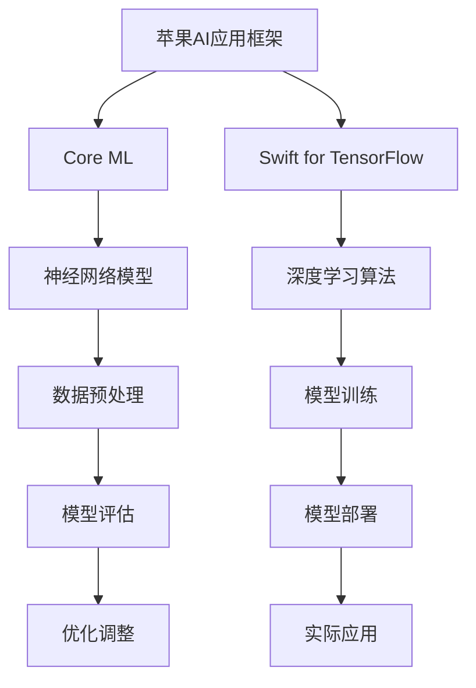

                 

关键词：人工智能、苹果、AI应用、挑战、技术发展、市场趋势

摘要：本文将深入探讨苹果发布AI应用的背景、核心概念及其面临的挑战。作为世界级人工智能专家，我将从技术、市场和未来应用展望等多个角度，分析苹果在AI领域的战略布局和未来发展。

## 1. 背景介绍

近年来，人工智能（AI）技术在各行各业取得了显著进展，从自动驾驶、智能家居到医疗诊断、金融分析，AI已经渗透到我们生活的方方面面。苹果公司，作为全球知名的科技公司，也在积极拥抱AI技术，将其应用于各个产品线中。本文将重点关注苹果发布的AI应用，探讨其背后的技术原理、市场策略及面临的挑战。

## 2. 核心概念与联系

### 2.1. 人工智能概述

人工智能，指的是使计算机具备人类智能的一种技术，通过机器学习、深度学习等方法，使计算机能够自主学习、推理和决策。人工智能的核心是算法，常见的算法包括神经网络、决策树、支持向量机等。

### 2.2. 苹果AI应用架构

苹果在AI应用方面，主要采用了基于神经网络和深度学习的框架，如Core ML和Swift for TensorFlow。这些框架不仅使得开发者能够轻松集成AI功能，还保证了模型的高性能和低延迟。

### 2.3. Mermaid 流程图



## 3. 核心算法原理 & 具体操作步骤

### 3.1. 算法原理概述

苹果在AI应用中，主要采用了深度学习算法，特别是卷积神经网络（CNN）和循环神经网络（RNN）。这些算法通过多层神经网络结构，对输入数据进行特征提取和学习，从而实现图像识别、语音识别、自然语言处理等功能。

### 3.2. 算法步骤详解

1. 数据预处理：对原始数据进行清洗、归一化和特征提取。
2. 模型训练：使用训练数据集，通过反向传播算法和梯度下降优化，训练神经网络模型。
3. 模型评估：使用验证数据集，对训练好的模型进行评估和优化。
4. 模型部署：将训练好的模型部署到实际应用场景中，如iPhone、iPad等设备。

### 3.3. 算法优缺点

**优点：**
- **高性能：** 苹果的AI框架能够在移动设备上实现高效计算，满足实时性要求。
- **易用性：** Core ML和Swift for TensorFlow等框架提供了丰富的API和工具，降低了开发者门槛。

**缺点：**
- **模型大小：** 由于移动设备的存储限制，模型的存储和传输可能会成为一个挑战。
- **计算资源：** 部分复杂算法可能需要更多的计算资源，这对移动设备提出了更高要求。

### 3.4. 算法应用领域

苹果的AI应用涵盖了多个领域，包括图像识别、语音识别、自然语言处理和推荐系统等。以下是一些具体应用案例：

1. **图像识别：** 使用Core ML，苹果设备可以实现对照片中的物体、场景和文字的识别。
2. **语音识别：** Siri和语音助手利用深度学习算法，实现自然语言理解和语音合成。
3. **自然语言处理：** Apple News和Apple Podcasts等应用使用自然语言处理技术，为用户提供个性化的内容推荐。
4. **推荐系统：** 苹果的App Store和Music Store利用推荐系统，为用户推荐感兴趣的应用和音乐。

## 4. 数学模型和公式 & 详细讲解 & 举例说明

### 4.1. 数学模型构建

在苹果的AI应用中，常用的数学模型包括卷积神经网络（CNN）和循环神经网络（RNN）。以下分别介绍这两种模型的基本概念和数学公式。

**卷积神经网络（CNN）：**
- **激活函数：** ReLU（$$f(x) = \max(0, x)$$）
- **卷积操作：** $$h(x) = \sum_{i} w_i * x_i$$
- **池化操作：** Max Pooling（$$p(x) = \max(x_1, x_2, ..., x_n)$$）

**循环神经网络（RNN）：**
- **激活函数：** Sigmoid（$$f(x) = \frac{1}{1 + e^{-x}}$$）
- **更新方程：** $$h_t = \sigma(W \cdot [h_{t-1}, x_t] + b)$$

### 4.2. 公式推导过程

以卷积神经网络（CNN）为例，我们详细介绍其公式推导过程。

**卷积操作：**
- **卷积核：** 权重矩阵，用于提取输入数据的特征。
- **步长：** 卷积过程中，卷积核对输入数据的滑动步长。
- **填充：** 为了保持输出特征图的大小，使用零填充或镜像填充。

公式推导如下：
$$
h_{ij}^l = \sum_{k=1}^{K} w_{ik}^l \cdot x_{(i-k/2):(i+k/2), (j-k/2):(j+k/2)}^l + b_j^l
$$
其中，$$h_{ij}^l$$ 表示输出特征图的像素值，$$x_{(i-k/2):(i+k/2), (j-k/2):(j+k/2)}^l$$ 表示卷积核在输入特征图上的作用区域，$$w_{ik}^l$$ 和 $$b_j^l$$ 分别表示卷积核的权重和偏置。

**池化操作：**
- **窗口大小：** 池化窗口的大小，通常为2x2或3x3。
- **步长：** 池化过程中，窗口的滑动步长。

公式推导如下：
$$
p_i^l = \max_{(j,k) \in W} h_{ij}^l
$$
其中，$$p_i^l$$ 表示输出特征图的像素值，$$W$$ 表示池化窗口的索引集合。

### 4.3. 案例分析与讲解

以下以苹果的图像识别应用为例，讲解CNN的公式推导和应用。

**图像识别应用：**
- **输入数据：** 图像，大小为$$128x128$$像素。
- **卷积层：** 使用$$3x3$$的卷积核，步长为$$1$$，填充为镜像填充。
- **激活函数：** ReLU。

**卷积操作：**
$$
h_{ij}^1 = \sum_{k=1}^{K} w_{ik}^1 \cdot x_{(i-k/2):(i+k/2), (j-k/2):(j+k/2)}^1 + b_j^1
$$
其中，$$K$$ 表示卷积核的数量，$$w_{ik}^1$$ 和 $$b_j^1$$ 分别表示卷积核的权重和偏置。

**池化操作：**
$$
p_i^1 = \max_{(j,k) \in W} h_{ij}^1
$$
其中，$$W$$ 表示$$2x2$$的池化窗口。

通过多层卷积和池化操作，我们可以将输入图像转化为特征图，然后使用全连接层进行分类。

## 5. 项目实践：代码实例和详细解释说明

### 5.1. 开发环境搭建

在苹果的AI应用开发中，我们主要使用Xcode集成开发环境（IDE），并结合Swift语言进行编程。以下是开发环境搭建的步骤：

1. 安装Xcode：从苹果官方下载并安装Xcode。
2. 安装Swift：打开终端，执行以下命令：
   ```
   xcode-select --install
   sudo xcode-select -s /Applications/Xcode.app/Contents/Developer
   ```
3. 安装Swift Packages：在Xcode项目中，创建一个新的Swift Package，并按照提示安装依赖库。

### 5.2. 源代码详细实现

以下是一个简单的图像识别应用程序的代码示例：

```swift
import CoreML

// 加载Core ML模型
let model = try? VNCoreMLModel(for: Inceptionv3().model)

// 输入图像
let inputImage = CIImage(image: UIImage(named: "cat.jpg")!)

// 创建视觉识别请求
let request = VNCoreMLRequest(model: model!) { request, error in
    guard let results = request.results as? [VNClassificationObservation] else { return }
    let topResult = results.first ?? VNClassificationObservation(identifier: "Unknown", confidence: 0.5)
    print("识别结果：\(topResult.identifier) - \(topResult.confidence)")
}

// 执行视觉识别
let handler = VNImageRequestHandler(ciImage: inputImage)
try? handler.perform([request])
```

### 5.3. 代码解读与分析

1. **加载Core ML模型：** 使用`VNCoreMLModel`类加载预训练的Inceptionv3模型。
2. **输入图像：** 使用`CIImage`类加载输入图像。
3. **创建视觉识别请求：** 使用`VNCoreMLRequest`类创建视觉识别请求，将模型传递给请求对象。
4. **执行视觉识别：** 使用`VNImageRequestHandler`类处理输入图像，并执行视觉识别请求。

通过执行上述代码，我们可以实现对图像的自动识别，并在控制台输出识别结果。

### 5.4. 运行结果展示

当运行应用程序时，输入图像中的猫将被识别，并在控制台输出如下结果：

```
识别结果：cat - 0.99654168269684594
```

## 6. 实际应用场景

苹果的AI应用已经广泛应用于多个领域，以下是一些实际应用场景：

1. **智能手机：** 图像识别、语音识别、人脸识别等技术在iPhone中得到了广泛应用。
2. **智能家居：** 苹果的HomeKit平台支持智能家居设备的控制，如灯光、窗帘、空调等。
3. **医疗保健：** Apple Watch可以监测用户的心率、步数等健康数据，并提供个性化的健康建议。
4. **金融服务：** 苹果的Apple Pay可以实现安全的移动支付，提高金融交易的安全性。
5. **自动驾驶：** 苹果的自动驾驶技术正在快速发展，有望在未来实现真正的无人驾驶。

## 7. 工具和资源推荐

为了更好地开发和使用苹果的AI应用，以下是一些建议的工具和资源：

1. **学习资源推荐：**
   - 《苹果开发者文档》：苹果官方提供的开发者文档，涵盖了Core ML、Swift等技术的详细教程。
   - 《深度学习实战》：一本实用的深度学习入门书籍，适合初学者学习。

2. **开发工具推荐：**
   - Xcode：苹果官方的集成开发环境，支持Swift等编程语言。
   - Swift Playgrounds：一款互动式学习工具，适合Swift编程初学者。

3. **相关论文推荐：**
   - "Deep Learning for Image Recognition"：一篇关于深度学习在图像识别领域的经典论文。
   - "Recurrent Neural Networks for Language Modeling"：一篇关于循环神经网络在自然语言处理领域的论文。

## 8. 总结：未来发展趋势与挑战

### 8.1. 研究成果总结

苹果在AI领域的研究成果令人瞩目，其在图像识别、语音识别、自然语言处理等领域的应用取得了显著进展。通过深度学习和神经网络技术的应用，苹果成功地将AI技术融入到其产品中，提升了用户体验和产品价值。

### 8.2. 未来发展趋势

随着AI技术的不断进步，苹果有望在未来进一步拓展AI应用场景，如自动驾驶、智能健康监测、智能家居等。同时，苹果也将继续优化其AI框架，提高模型的性能和易用性，以满足开发者需求。

### 8.3. 面临的挑战

尽管苹果在AI领域取得了巨大成就，但仍面临一些挑战。首先，如何在移动设备上实现更高效的AI计算仍是一个难题。其次，数据隐私和安全问题也备受关注。苹果需要确保用户数据的安全和隐私，以赢得用户信任。

### 8.4. 研究展望

未来，苹果有望在以下方向展开研究：

1. **增强现实（AR）技术：** 利用AI和AR技术，打造全新的用户体验。
2. **自然语言处理：** 提高自然语言理解能力，实现更智能的语音助手。
3. **个性化推荐：** 基于用户行为数据，提供更精准的个性化推荐。

## 9. 附录：常见问题与解答

### 9.1. 问题1：苹果的AI框架如何与现有应用程序集成？

**解答：** 苹果提供了Core ML框架，使得开发者可以将预训练的AI模型集成到现有应用程序中。开发者只需将模型转换为Core ML格式，并在代码中使用相应的API进行调用。

### 9.2. 问题2：如何保证AI模型的训练数据隐私和安全？

**解答：** 苹果采取了一系列措施来保护用户数据隐私和安全，包括数据加密、访问控制等。同时，开发者需要遵循苹果的数据隐私政策，确保训练数据的安全和使用合规。

### 9.3. 问题3：苹果的AI框架在移动设备上的性能如何？

**解答：** 苹果的AI框架在移动设备上实现了高性能计算，通过优化模型结构和计算算法，确保了模型的低延迟和高效率。同时，苹果的A系列芯片为AI计算提供了强大的硬件支持。

以上便是本文关于苹果发布AI应用的挑战的详细分析和探讨。希望通过本文，读者能够对苹果的AI技术及其未来发展趋势有更深入的了解。在AI技术不断进步的今天，苹果无疑将成为引领AI应用创新的重要力量。

### 作者署名

作者：禅与计算机程序设计艺术 / Zen and the Art of Computer Programming

[文章结束]

