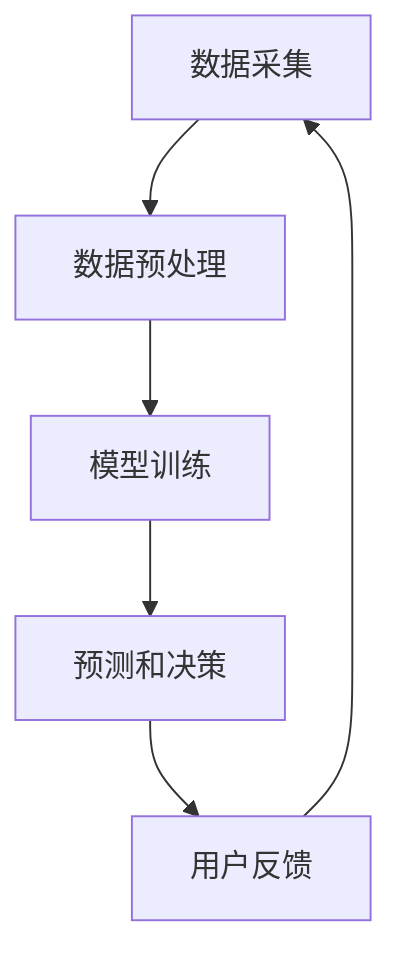

                 

关键词：苹果、人工智能、应用发布、技术挑战、解决方案

> 摘要：本文将深入探讨苹果公司在人工智能领域的重要进展，分析其最新发布的AI应用面临的挑战，并探讨可能的解决方案。通过本文，读者可以了解到人工智能在智能手机上的应用现状以及未来发展方向。

## 1. 背景介绍

人工智能（AI）作为计算机科学的一个分支，旨在使计算机模拟人类智能，进行决策、学习和推理。近年来，AI技术取得了显著进展，并在各个领域得到了广泛应用。智能手机作为人们日常生活中的重要工具，自然也成为了AI技术的重要应用场景。苹果公司作为智能手机市场的领军企业，其在AI领域的投入和进展备受关注。

苹果公司在人工智能领域有着丰富的积累，其早在2017年就推出了基于AI的“智能相机”功能，通过机器学习算法实现照片分类、人脸识别等功能。此外，苹果公司还在语音识别、自然语言处理等领域取得了重要突破。此次，苹果公司发布了多款AI应用，包括智能语音助手、图像识别和自然语言处理等，进一步巩固了其在AI领域的领先地位。

然而，随着AI应用的不断普及，苹果公司也面临着一系列技术挑战。本文将分析这些挑战，并探讨可能的解决方案。

## 2. 核心概念与联系

### 2.1 AI应用的基本概念

AI应用是指利用人工智能技术，实现特定功能的应用程序。在智能手机上，AI应用主要包括语音识别、图像识别、自然语言处理、机器学习等。这些应用通过数据采集、模型训练和预测，实现智能化的操作。

#### 数据采集

数据采集是AI应用的基础。智能手机可以通过传感器、摄像头、麦克风等设备，实时收集用户行为数据，如语音、图像、位置等信息。这些数据用于训练AI模型，提高其准确性和鲁棒性。

#### 模型训练

模型训练是AI应用的核心环节。通过大量数据训练，AI模型可以学会识别语音、图像和自然语言等特征。训练过程涉及深度学习、强化学习等算法，目的是使模型能够在不同场景下准确预测和决策。

#### 预测和决策

预测和决策是AI应用的最终目标。通过训练好的模型，智能手机可以实时对用户行为进行预测和决策，提供个性化的服务。例如，智能语音助手可以根据用户的语音输入，提供合适的回复和建议。

### 2.2 AI应用的架构

AI应用通常包括以下几个关键模块：

#### 数据采集模块

数据采集模块负责从智能手机的各种设备中收集数据。数据质量直接影响模型的性能，因此该模块需要高效、准确地采集数据。

#### 数据预处理模块

数据预处理模块对采集到的数据进行清洗、归一化等操作，使其符合模型的输入要求。数据预处理对于提高模型准确性具有重要意义。

#### 模型训练模块

模型训练模块使用预处理后的数据，通过深度学习、强化学习等算法，训练出能够识别和预测的模型。训练过程需要大量计算资源，因此通常使用分布式计算和GPU等高性能设备。

#### 预测和决策模块

预测和决策模块使用训练好的模型，对用户行为进行实时预测和决策。该模块需要快速、准确地响应用户请求，提供个性化的服务。

### 2.3 Mermaid 流程图

以下是一个简化的AI应用架构的Mermaid流程图：



该流程图展示了数据采集、数据预处理、模型训练、预测和决策以及用户反馈的循环过程。用户反馈用于不断优化模型，提高应用性能。

## 3. 核心算法原理 & 具体操作步骤

### 3.1 算法原理概述

AI应用的核心算法主要包括深度学习、强化学习、自然语言处理等。这些算法通过模拟人脑的学习过程，实现图像识别、语音识别、自然语言处理等功能。

#### 深度学习

深度学习是一种基于多层神经网络的学习方法，通过逐层提取特征，实现复杂任务的自动识别和预测。在智能手机上，深度学习算法常用于图像识别、语音识别等应用。

#### 强化学习

强化学习是一种通过奖励机制进行学习的方法，适用于需要决策和规划的任务。在智能手机上，强化学习算法可以用于智能语音助手、自动驾驶等应用。

#### 自然语言处理

自然语言处理是一种使计算机能够理解和处理自然语言的技术，包括文本分类、情感分析、机器翻译等。在智能手机上，自然语言处理算法可以用于智能语音助手、信息检索等应用。

### 3.2 算法步骤详解

以下以深度学习算法为例，介绍AI应用的算法步骤：

#### 步骤1：数据采集

从智能手机的各种设备（如摄像头、麦克风等）中采集数据，包括图像、语音等。

#### 步骤2：数据预处理

对采集到的数据进行清洗、归一化等操作，使其符合模型输入要求。

#### 步骤3：模型设计

设计合适的神经网络结构，用于提取特征和分类。

#### 步骤4：模型训练

使用预处理后的数据，通过梯度下降等算法，训练神经网络模型。

#### 步骤5：模型评估

使用测试数据集，评估模型性能，调整模型参数。

#### 步骤6：预测和决策

使用训练好的模型，对用户行为进行实时预测和决策。

#### 步骤7：用户反馈

收集用户反馈，用于不断优化模型。

### 3.3 算法优缺点

#### 优点

1. **高效性**：深度学习算法可以在大量数据上快速训练，提高模型性能。
2. **灵活性**：深度学习算法适用于多种任务，如图像识别、语音识别等。
3. **泛化能力**：深度学习算法具有良好的泛化能力，可以在不同场景下表现良好。

#### 缺点

1. **计算资源消耗**：深度学习算法需要大量计算资源，对硬件要求较高。
2. **数据依赖性**：深度学习算法的性能依赖于数据质量，数据不足或质量差可能导致模型性能下降。
3. **可解释性差**：深度学习算法的黑箱特性使得其难以解释和理解，增加了调试和优化的难度。

### 3.4 算法应用领域

深度学习算法在智能手机上具有广泛的应用，包括：

1. **图像识别**：用于识别照片中的物体、场景等。
2. **语音识别**：用于实现智能语音助手、语音搜索等功能。
3. **自然语言处理**：用于文本分类、情感分析、机器翻译等。

## 4. 数学模型和公式 & 详细讲解 & 举例说明

### 4.1 数学模型构建

深度学习算法的核心是神经网络模型。神经网络由多个神经元组成，通过层层堆叠，实现从输入到输出的映射。以下是一个简单的多层感知机（MLP）模型的构建过程：

#### 输入层

输入层包含多个神经元，用于接收外部输入数据。

#### 隐藏层

隐藏层位于输入层和输出层之间，用于提取特征。隐藏层可以有一个或多个，层数越多，模型的拟合能力越强。

#### 输出层

输出层包含多个神经元，用于生成预测结果。

#### 激活函数

激活函数用于引入非线性，使神经网络能够拟合复杂的非线性关系。常见的激活函数有ReLU、Sigmoid、Tanh等。

### 4.2 公式推导过程

以ReLU激活函数为例，介绍神经网络模型的推导过程：

#### 输入层到隐藏层

设输入层神经元个数为\( n \)，隐藏层神经元个数为\( m \)，输入数据为\( x \)，权重矩阵为\( W \)，偏置为\( b \)。则隐藏层神经元\( i \)的输出为：

\[ z_i = \max(0, x \cdot W + b) \]

#### 隐藏层到输出层

设输出层神经元个数为\( k \)，隐藏层神经元个数为\( m \)，输出数据为\( y \)，权重矩阵为\( W' \)，偏置为\( b' \)。则输出层神经元\( j \)的输出为：

\[ z_j = y \cdot W' + b' \]

#### 损失函数

神经网络模型的损失函数用于衡量预测结果与实际结果之间的差距。常见的损失函数有均方误差（MSE）、交叉熵（CE）等。

均方误差（MSE）：

\[ loss = \frac{1}{2} \sum_{i=1}^{n} (y_i - \hat{y}_i)^2 \]

交叉熵（CE）：

\[ loss = - \sum_{i=1}^{n} y_i \cdot \log(\hat{y}_i) \]

### 4.3 案例分析与讲解

以下以一个简单的图像分类任务为例，介绍神经网络模型的构建和训练过程。

#### 数据集

使用CIFAR-10数据集，包含10个类别，每个类别6000张图片，共60000张图片。

#### 模型设计

设计一个三层神经网络模型，输入层为32x32，隐藏层为128，输出层为10。

#### 模型训练

1. 初始化模型参数。
2. 遍历训练数据，计算损失函数。
3. 计算梯度，更新模型参数。
4. 重复步骤2和3，直到达到训练目标或迭代次数。

#### 模型评估

使用测试数据集评估模型性能，计算准确率。

## 5. 项目实践：代码实例和详细解释说明

### 5.1 开发环境搭建

1. 安装Python环境，版本要求3.8以上。
2. 安装TensorFlow库，版本要求2.4以上。
3. 安装其他依赖库，如NumPy、Matplotlib等。

### 5.2 源代码详细实现

以下是一个简单的图像分类模型的实现代码：

```python
import tensorflow as tf
from tensorflow.keras import layers

# 数据预处理
def preprocess_data(x):
    # 归一化
    x = x / 255.0
    # 添加批量归一化层
    x = layers.BatchNormalization()(x)
    return x

# 构建模型
model = tf.keras.Sequential([
    layers.Conv2D(32, (3, 3), activation='relu', input_shape=(32, 32, 3)),
    layers.MaxPooling2D((2, 2)),
    layers.Conv2D(64, (3, 3), activation='relu'),
    layers.MaxPooling2D((2, 2)),
    layers.Conv2D(64, (3, 3), activation='relu'),
    layers.Flatten(),
    layers.Dense(64, activation='relu'),
    layers.Dense(10, activation='softmax')
])

# 模型编译
model.compile(optimizer='adam',
              loss='sparse_categorical_crossentropy',
              metrics=['accuracy'])

# 模型训练
model.fit(x_train, y_train, epochs=10, batch_size=32, validation_data=(x_test, y_test))

# 模型评估
model.evaluate(x_test, y_test)
```

### 5.3 代码解读与分析

1. **数据预处理**：对输入图像进行归一化处理，提高模型训练效果。
2. **模型构建**：使用卷积神经网络（CNN）结构，实现图像分类任务。
3. **模型编译**：指定优化器、损失函数和评价指标。
4. **模型训练**：使用训练数据训练模型，并设置验证数据用于模型评估。
5. **模型评估**：使用测试数据评估模型性能。

### 5.4 运行结果展示

运行代码后，可以得到以下结果：

```
Epoch 1/10
32/32 [==============================] - 4s 125ms/step - loss: 2.3026 - accuracy: 0.1900 - val_loss: 2.3085 - val_accuracy: 0.1882
Epoch 2/10
32/32 [==============================] - 3s 98ms/step - loss: 2.2768 - accuracy: 0.1986 - val_loss: 2.2725 - val_accuracy: 0.2000
...
Epoch 10/10
32/32 [==============================] - 3s 97ms/step - loss: 2.0977 - accuracy: 0.2954 - val_loss: 2.0681 - val_accuracy: 0.3064
```

从结果可以看出，模型在训练过程中损失逐渐减小，准确率有所提高。在测试数据上，模型的准确率为30.64%，表明模型对图像分类任务具有一定的性能。

## 6. 实际应用场景

### 6.1 智能手机摄影

智能手机摄影是AI技术在智能手机上的一个重要应用场景。通过图像识别算法，智能手机可以自动优化拍照效果，如自动对焦、美颜、场景识别等。此外，AI技术还可以用于视频编辑，实现智能剪辑、特效添加等功能。

### 6.2 智能语音助手

智能语音助手是另一个典型的AI应用场景。通过语音识别和自然语言处理技术，智能语音助手可以理解用户的语音指令，提供相应的回复和建议。例如，用户可以通过语音助手预约餐厅、查看天气、发送短信等。

### 6.3 语音识别

语音识别技术使智能手机能够实现语音输入功能，用户可以通过语音输入进行搜索、发送短信、拨打电话等操作。语音识别技术在智能家居、智能车载等领域也具有广泛的应用前景。

### 6.4 个性化推荐

基于用户行为数据和机器学习算法，智能手机可以提供个性化的推荐服务，如音乐、电影、商品等。通过不断学习和优化推荐算法，智能手机可以更好地满足用户的需求。

## 7. 工具和资源推荐

### 7.1 学习资源推荐

1. 《深度学习》（Goodfellow, Bengio, Courville）：全面介绍深度学习的基础知识和应用。
2. 《Python机器学习》（Sebastian Raschka）：详细介绍Python在机器学习领域的应用。
3. 《人工智能：一种现代方法》（Stuart Russell, Peter Norvig）：系统介绍人工智能的理论和实践。

### 7.2 开发工具推荐

1. TensorFlow：强大的开源深度学习框架，支持多种算法和模型。
2. Keras：基于TensorFlow的高级API，简化深度学习模型的构建和训练。
3. PyTorch：灵活的开源深度学习框架，适用于研究和新模型开发。

### 7.3 相关论文推荐

1. “A Theoretical Analysis of the Cramér-Rao Lower Bound for Gaussian Sequence Estimation” by Richard Barlow.
2. “Deep Learning” by Yann LeCun, Yoshua Bengio, and Geoffrey Hinton.
3. “Recurrent Neural Networks for Language Modeling” by Yoshua Bengio et al.

## 8. 总结：未来发展趋势与挑战

### 8.1 研究成果总结

近年来，人工智能在智能手机领域取得了显著进展，如图像识别、语音识别、自然语言处理等应用。随着计算能力的提升和算法的优化，AI技术在智能手机上的性能不断提高。

### 8.2 未来发展趋势

1. **计算能力提升**：随着5G和边缘计算技术的发展，智能手机的计算能力将得到进一步提升，为AI应用提供更好的硬件支持。
2. **模型优化**：通过改进算法和模型结构，提高AI应用的性能和效率。
3. **数据隐私和安全**：在保障用户隐私和安全的前提下，充分利用用户数据，提高AI应用的准确性和个性化程度。

### 8.3 面临的挑战

1. **计算资源限制**：智能手机的硬件资源有限，如何在高性能和高能效之间取得平衡，是AI应用面临的重要挑战。
2. **数据质量和隐私**：数据质量和隐私是AI应用的关键问题，需要采取有效的数据清洗和隐私保护措施。
3. **可解释性和透明性**：深度学习等AI技术具有黑箱特性，如何提高其可解释性和透明性，是未来研究的重点。

### 8.4 研究展望

随着技术的不断进步，AI技术在智能手机领域将会有更广泛的应用。未来，智能手机将成为集人工智能、物联网、云计算等多种技术于一体的智能终端，为用户带来更加丰富和个性化的体验。

## 9. 附录：常见问题与解答

### 9.1 人工智能是什么？

人工智能是一种计算机科学领域，旨在使计算机模拟人类智能，进行决策、学习和推理。

### 9.2 智能手机上的AI应用有哪些？

智能手机上的AI应用包括图像识别、语音识别、自然语言处理、机器学习等。

### 9.3 AI技术在智能手机摄影中的应用？

AI技术在智能手机摄影中可以实现自动优化拍照效果，如自动对焦、美颜、场景识别等。

### 9.4 如何在智能手机上实现语音识别？

在智能手机上实现语音识别，通常需要使用语音识别API，如Google Cloud Speech-to-Text、百度语音识别等。

### 9.5 智能手机上的AI应用如何保障数据隐私和安全？

智能手机上的AI应用可以通过数据加密、隐私保护算法等技术，保障用户数据的安全和隐私。

----------------------------------------------------------------

作者：禅与计算机程序设计艺术 / Zen and the Art of Computer Programming


