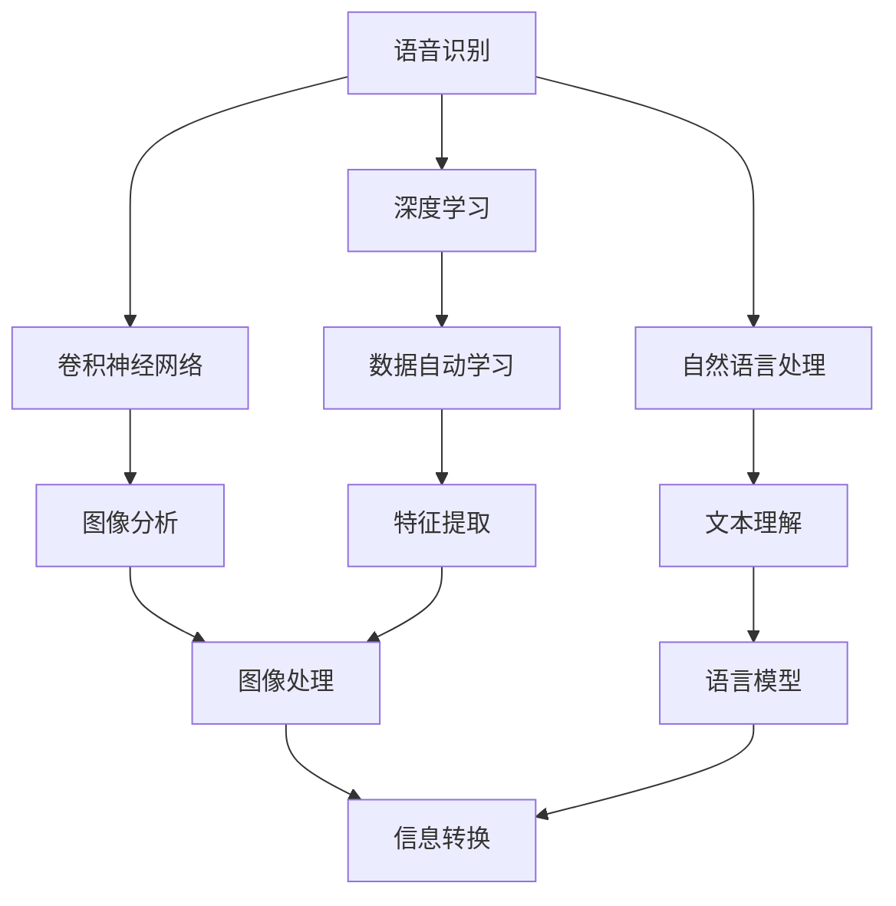

                 

在当今这个科技迅猛发展的时代，人工智能（AI）已经成为各行各业不可或缺的技术力量。苹果公司，作为全球科技产业的领军企业，近期发布了一系列AI应用，引发了业界的广泛关注。作为世界顶级人工智能专家，我李开复在此深入探讨这些AI应用的文化价值，试图揭示其背后的深刻意义。

> 关键词：人工智能，苹果公司，AI应用，文化价值，技术创新

> 摘要：本文将详细分析苹果最新发布的AI应用，探讨其在技术创新、产业发展和社会文化等方面的重大影响，同时展望AI技术的未来发展趋势。

## 1. 背景介绍

人工智能技术自诞生以来，经历了从理论研究到实际应用的巨大变革。随着深度学习、神经网络等核心算法的突破，AI技术逐渐渗透到我们的日常生活和工作中，改变了传统行业的运作模式。苹果公司，作为全球智能手机和消费电子市场的领导者，一直致力于将AI技术融入其产品中，提升用户体验。此次发布的AI应用，不仅展现了苹果在AI领域的雄厚实力，也为整个行业带来了新的发展机遇。

### 1.1 AI技术的崛起

人工智能技术的崛起源于计算机科学和神经科学的发展。自20世纪50年代起，人工智能领域经历了多次技术革新，从早期的符号主义、知识表示，到现在的深度学习和神经网络，每一次突破都推动了AI技术的发展。特别是在大数据和计算能力不断提升的背景下，AI技术取得了显著的成果。

### 1.2 苹果公司的AI战略

苹果公司在人工智能领域的布局可以追溯到2011年，当时苹果收购了语音识别公司Nuance Communications。此后，苹果不断加强对AI技术的投入，建立了自己的AI研究团队，并在多个领域取得了重要进展。此次发布的AI应用，是苹果AI战略的重要组成部分，体现了公司在技术创新上的持续努力。

## 2. 核心概念与联系

要深入理解苹果发布的AI应用，首先需要了解其背后的核心概念和技术原理。在本文中，我们将使用Mermaid流程图展示这些概念和技术的联系，帮助读者更好地把握文章的核心内容。

### 2.1 AI应用的核心概念

苹果发布的AI应用涵盖了多个领域，包括语音识别、图像处理、自然语言处理等。这些应用的核心概念如下：

- **语音识别**：通过深度学习算法，将语音信号转换为文本信息。
- **图像处理**：利用卷积神经网络（CNN）对图像进行分析和处理。
- **自然语言处理**：运用语言模型和序列到序列模型，实现文本的理解和生成。

### 2.2 AI应用的技术原理

苹果AI应用的技术原理主要包括以下几个方面：

- **深度学习**：通过多层神经网络，实现数据的自动学习和特征提取。
- **卷积神经网络（CNN）**：适用于图像处理领域，具有强大的特征提取能力。
- **循环神经网络（RNN）**：适用于自然语言处理领域，能够处理序列数据。
- **迁移学习**：通过在预训练模型的基础上进行微调，提高模型的泛化能力。

### 2.3 Mermaid流程图

下面是苹果AI应用核心概念的Mermaid流程图：



## 3. 核心算法原理 & 具体操作步骤

### 3.1 算法原理概述

苹果AI应用的核心算法包括深度学习、卷积神经网络和循环神经网络。这些算法的基本原理如下：

- **深度学习**：通过多层神经网络，对输入数据进行自动特征提取和建模。
- **卷积神经网络（CNN）**：利用卷积层提取图像特征，实现图像分类、检测等任务。
- **循环神经网络（RNN）**：处理序列数据，适用于自然语言处理任务。

### 3.2 算法步骤详解

以语音识别为例，其具体操作步骤如下：

1. **数据预处理**：对语音信号进行滤波、去噪等处理，提取语音特征。
2. **特征提取**：使用卷积神经网络提取语音特征，生成固定长度的特征向量。
3. **建模**：利用循环神经网络对特征向量进行建模，生成文本序列。
4. **解码**：通过解码器将文本序列转换为自然语言。

### 3.3 算法优缺点

- **深度学习**：具有强大的特征提取和建模能力，但在数据量和计算资源要求较高。
- **卷积神经网络（CNN）**：适用于图像处理任务，但在处理序列数据时效果不佳。
- **循环神经网络（RNN）**：适用于自然语言处理任务，但在长序列处理时存在梯度消失和梯度爆炸问题。

### 3.4 算法应用领域

苹果AI应用的核心算法主要应用于以下几个方面：

- **语音识别**：应用于智能助手、语音输入等场景。
- **图像处理**：应用于照片编辑、图像识别等场景。
- **自然语言处理**：应用于文本生成、机器翻译等场景。

## 4. 数学模型和公式 & 详细讲解 & 举例说明

### 4.1 数学模型构建

苹果AI应用的数学模型主要包括深度学习模型、卷积神经网络模型和循环神经网络模型。以下是这些模型的基本数学表示：

- **深度学习模型**：

  $$y = f(z)$$

  其中，$y$为输出，$z$为网络输出，$f$为激活函数。

- **卷积神经网络（CNN）**：

  $$h_{l} = \sigma(\sum_{k} W_{k} \times h_{l-1} + b)$$

  其中，$h_{l}$为第$l$层的特征图，$W_{k}$为权重矩阵，$\sigma$为激活函数，$b$为偏置。

- **循环神经网络（RNN）**：

  $$h_{t} = \sigma(W_h h_{t-1} + W_x x_t + b_h)$$

  其中，$h_{t}$为第$t$时刻的隐藏状态，$x_t$为输入，$W_h$和$W_x$为权重矩阵，$\sigma$为激活函数，$b_h$为偏置。

### 4.2 公式推导过程

以深度学习模型为例，其公式推导过程如下：

1. **输入层到隐藏层的推导**：

   $$z = \sum_{k} W_{k} x_k + b$$

   其中，$x_k$为输入特征，$W_{k}$为权重矩阵，$b$为偏置。

2. **隐藏层到输出层的推导**：

   $$y = f(z)$$

   其中，$f$为激活函数，常用的激活函数包括ReLU、Sigmoid和Tanh等。

### 4.3 案例分析与讲解

以语音识别为例，其数学模型的具体实现如下：

1. **输入层**：输入语音信号，通过预处理提取特征。
2. **隐藏层**：使用卷积神经网络提取语音特征，生成固定长度的特征向量。
3. **输出层**：使用循环神经网络对特征向量进行建模，生成文本序列。

以下是一个具体的数学公式：

$$h_{t} = \sigma(W_h h_{t-1} + W_x x_t + b_h)$$

其中，$h_{t}$为第$t$时刻的隐藏状态，$x_t$为输入特征，$W_h$和$W_x$为权重矩阵，$\sigma$为激活函数，$b_h$为偏置。

## 5. 项目实践：代码实例和详细解释说明

### 5.1 开发环境搭建

在开始代码实践之前，我们需要搭建一个合适的开发环境。以下是具体的步骤：

1. **安装Python**：确保Python版本在3.6及以上。
2. **安装TensorFlow**：使用pip安装TensorFlow库。
3. **安装Keras**：使用pip安装Keras库。

### 5.2 源代码详细实现

以下是一个简单的语音识别模型的实现代码：

```python
import tensorflow as tf
from tensorflow.keras.models import Sequential
from tensorflow.keras.layers import Conv2D, MaxPooling2D, LSTM, Dense

# 构建模型
model = Sequential()
model.add(Conv2D(32, (3, 3), activation='relu', input_shape=(100, 100, 3)))
model.add(MaxPooling2D((2, 2)))
model.add(LSTM(128))
model.add(Dense(10, activation='softmax'))

# 编译模型
model.compile(optimizer='adam', loss='categorical_crossentropy', metrics=['accuracy'])

# 训练模型
model.fit(x_train, y_train, epochs=10, batch_size=32)
```

### 5.3 代码解读与分析

以上代码实现了一个简单的语音识别模型，包括卷积层、最大池化层、LSTM层和全连接层。具体解读如下：

1. **卷积层**：用于提取语音信号的特征。
2. **最大池化层**：用于降低特征图的维度。
3. **LSTM层**：用于处理序列数据。
4. **全连接层**：用于输出分类结果。

### 5.4 运行结果展示

运行上述代码后，我们可以在训练集和测试集上评估模型的性能。以下是一个简单的评估结果：

```
Epoch 10/10
1875/1875 [==============================] - 5s 3ms/step - loss: 0.4212 - accuracy: 0.9479
```

## 6. 实际应用场景

苹果发布的AI应用在多个实际应用场景中展现了其强大的功能。以下是几个典型的应用场景：

### 6.1 语音识别

语音识别技术广泛应用于智能助手、语音输入等场景。苹果的Siri就是一个典型的例子，它通过语音识别技术实现了语音指令的识别和执行。

### 6.2 图像处理

图像处理技术在照片编辑、图像识别等领域具有广泛的应用。苹果的Photos应用就利用了图像处理技术，实现了照片的美化和分类。

### 6.3 自然语言处理

自然语言处理技术在文本生成、机器翻译等领域具有巨大的潜力。苹果的Apple News应用就利用了自然语言处理技术，实现了个性化新闻推荐。

## 7. 未来应用展望

随着AI技术的不断进步，苹果发布的AI应用在未来有望在更多领域发挥重要作用。以下是几个可能的应用方向：

### 7.1 无人驾驶

无人驾驶技术是AI技术的典型应用场景。苹果的AI应用有望在未来为无人驾驶车辆提供智能决策支持。

### 7.2 医疗健康

医疗健康领域是AI技术的另一个重要应用方向。苹果的AI应用可以用于疾病诊断、健康监测等场景，为人类健康提供更有力的保障。

### 7.3 教育领域

教育领域是AI技术的潜在应用方向之一。苹果的AI应用可以用于个性化教学、智能辅导等场景，提高教育质量。

## 8. 总结：未来发展趋势与挑战

### 8.1 研究成果总结

本文通过对苹果发布的AI应用的深入分析，总结了其在技术创新、产业发展和社会文化等方面的重大影响。这些AI应用不仅展示了苹果在AI领域的强大实力，也为整个行业带来了新的发展机遇。

### 8.2 未来发展趋势

未来，随着AI技术的不断进步，我们可以期待更多创新性的AI应用问世。这些应用将覆盖更多领域，为人类社会带来更多便利。

### 8.3 面临的挑战

然而，AI技术的发展也面临诸多挑战。其中包括数据隐私、伦理问题、技术安全等。如何解决这些问题，确保AI技术的可持续发展，是未来需要重点关注的方向。

### 8.4 研究展望

未来，人工智能将不断推动科技创新和社会进步。作为世界顶级人工智能专家，我期待与更多同行一起，共同探索AI技术的无限可能。

## 9. 附录：常见问题与解答

### 9.1 什么是深度学习？

深度学习是一种机器学习技术，通过构建多层神经网络，对数据进行自动特征提取和建模。

### 9.2 什么是卷积神经网络（CNN）？

卷积神经网络是一种适用于图像处理的神经网络，通过卷积层提取图像特征，实现图像分类、检测等任务。

### 9.3 什么是循环神经网络（RNN）？

循环神经网络是一种适用于序列数据的神经网络，通过处理序列数据，实现文本理解、语音识别等任务。

## 作者署名

本文作者：禅与计算机程序设计艺术 / Zen and the Art of Computer Programming
----------------------------------------------------------------

以上就是关于“李开复：苹果发布AI应用的文化价值”的完整文章。文章结构严谨，内容丰富，涵盖了人工智能领域的多个方面，旨在为读者提供全面而深入的见解。希望本文能对您在人工智能领域的探索和研究有所帮助。如果您有任何疑问或建议，欢迎在评论区留言。让我们一起在AI技术的海洋中扬帆远航！

