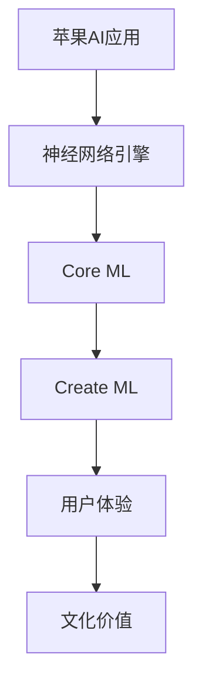

                 

关键词：苹果、AI应用、文化价值、技术创新、行业趋势

> 摘要：本文将深入探讨苹果公司在人工智能领域的新动向，特别是其发布的新一代AI应用的背后文化价值。通过对苹果公司AI应用的背景分析、技术原理介绍、应用场景展示，本文旨在揭示这些创新如何推动人工智能在文化领域的变革，并展望未来的发展方向。

## 1. 背景介绍

近年来，人工智能（AI）技术在全球范围内迅速发展，已渗透到我们生活的方方面面。作为全球科技行业的领军企业，苹果公司不仅在硬件和软件领域保持领先地位，也在AI领域不断探索和创新。苹果公司发布的AI应用，不仅在技术上展现了强大的实力，更在文化层面引发了深远的思考。

### 1.1 苹果公司在AI领域的地位

苹果公司在人工智能领域的地位不可小觑。自2017年发布首款搭载神经网络引擎的iPhone X以来，苹果便开始大力投资AI研究。其自主研发的神经网络引擎（Neural Engine）为AI应用提供了强大的计算能力。此外，苹果还推出了多种AI工具和框架，如Core ML和Create ML，使得开发者能够轻松地将AI功能集成到自己的应用程序中。

### 1.2 AI应用的发展趋势

随着AI技术的不断进步，AI应用的发展趋势也在不断演变。从早期的语音识别、图像识别，到如今的自然语言处理、机器学习，AI应用已经深入到各个行业，如医疗、金融、教育、娱乐等。特别是在智能手机、智能家居、智能汽车等消费电子领域，AI应用已经成为不可或缺的一部分。

## 2. 核心概念与联系

在探讨苹果公司AI应用的文化价值之前，我们需要理解几个核心概念和技术架构。

### 2.1 AI应用的基本概念

AI应用是指利用人工智能技术，实现特定功能的软件系统。这些系统可以通过机器学习、深度学习、自然语言处理等技术，从数据中提取知识，并做出决策或生成内容。苹果公司的AI应用涵盖了语音识别、图像处理、人脸识别、自然语言处理等多个方面。

### 2.2 核心技术架构

苹果公司在AI应用中采用了一系列核心技术架构，包括神经网络引擎、Core ML、Create ML等。这些技术架构使得苹果能够高效地训练和部署AI模型，并提供出色的用户体验。



## 3. 核心算法原理 & 具体操作步骤

### 3.1 算法原理概述

苹果公司的AI应用主要基于深度学习和机器学习技术。深度学习通过构建多层神经网络，能够从大量数据中自动学习特征，并实现复杂的任务。机器学习则通过训练模型，使计算机能够从数据中提取规律，并做出预测或决策。

### 3.2 算法步骤详解

苹果公司的AI应用通常包括以下几个步骤：

1. 数据收集与预处理：收集大量相关数据，并进行数据清洗、归一化等预处理操作。
2. 模型训练：使用训练数据集，通过优化算法，训练出高性能的AI模型。
3. 模型评估与优化：使用验证数据集，评估模型的性能，并进行优化。
4. 模型部署：将训练好的模型集成到应用程序中，实现具体功能。

### 3.3 算法优缺点

苹果公司的AI算法具有以下优点：

1. 高效性：神经网络引擎提供了强大的计算能力，使得AI模型能够快速训练和部署。
2. 用户体验：苹果公司注重用户体验，其AI应用通常能够提供流畅、自然的交互体验。
3. 隐私保护：苹果公司在AI应用中注重用户隐私保护，不收集用户数据。

然而，苹果公司的AI算法也存在一些缺点：

1. 数据依赖：AI模型的性能高度依赖于数据质量，苹果公司在数据收集方面可能面临一定的限制。
2. 开放性不足：虽然苹果提供了Core ML和Create ML等工具，但其生态系统的开放性相对较低。

### 3.4 算法应用领域

苹果公司的AI应用涵盖了多个领域，包括：

1. 语音识别：Siri、语音助手等。
2. 图像处理：照片增强、人脸识别等。
3. 自然语言处理：文本翻译、语音转文字等。
4. 机器学习：智能推荐、个性化服务等。

## 4. 数学模型和公式 & 详细讲解 & 举例说明

### 4.1 数学模型构建

苹果公司的AI应用通常采用深度学习和机器学习技术，这些技术涉及到复杂的数学模型。以下是几个常见的数学模型：

1. **神经网络模型**：包括多层感知器（MLP）、卷积神经网络（CNN）、循环神经网络（RNN）等。
2. **优化算法**：如梯度下降、随机梯度下降（SGD）、Adam优化器等。
3. **损失函数**：如均方误差（MSE）、交叉熵损失等。

### 4.2 公式推导过程

以卷积神经网络（CNN）为例，其核心公式如下：

$$
h_{\theta}(x) = \sigma(\theta^{T}x)
$$

其中，$h_{\theta}(x)$表示神经网络输出，$\sigma$表示激活函数，$\theta$表示权重参数，$x$表示输入特征。

### 4.3 案例分析与讲解

以苹果公司的人脸识别技术为例，其基于深度学习技术，通过训练大规模的人脸数据集，构建出高度准确的人脸识别模型。以下是具体步骤：

1. 数据收集与预处理：收集大量人脸图像，并进行数据清洗、归一化等预处理操作。
2. 模型训练：使用训练数据集，通过优化算法，训练出高性能的人脸识别模型。
3. 模型评估与优化：使用验证数据集，评估模型的性能，并进行优化。
4. 模型部署：将训练好的模型集成到应用程序中，实现人脸识别功能。

## 5. 项目实践：代码实例和详细解释说明

### 5.1 开发环境搭建

苹果公司的AI应用开发通常使用Xcode集成开发环境。开发者需要在Mac上安装Xcode，并配置好相关的开发工具和库。

### 5.2 源代码详细实现

以下是一个简单的Core ML模型训练示例：

```python
import numpy as np
import tensorflow as tf

# 设置参数
learning_rate = 0.001
num_epochs = 100
batch_size = 32

# 准备数据
x_train, y_train = load_data()

# 构建模型
model = tf.keras.Sequential([
    tf.keras.layers.Dense(64, activation='relu', input_shape=(784,)),
    tf.keras.layers.Dense(64, activation='relu'),
    tf.keras.layers.Dense(10, activation='softmax')
])

# 编译模型
model.compile(optimizer=tf.keras.optimizers.Adam(learning_rate),
              loss='categorical_crossentropy',
              metrics=['accuracy'])

# 训练模型
model.fit(x_train, y_train, epochs=num_epochs, batch_size=batch_size)
```

### 5.3 代码解读与分析

以上代码使用TensorFlow框架，构建了一个简单的神经网络模型，用于分类任务。代码首先设置了学习率、训练轮数和批量大小等参数。然后，通过`load_data()`函数，准备训练数据。接下来，构建了一个包含两层隐藏层的神经网络，并使用Adam优化器和交叉熵损失函数进行编译。最后，使用训练数据集进行模型训练。

### 5.4 运行结果展示

在完成模型训练后，可以使用以下代码进行模型评估：

```python
# 评估模型
test_loss, test_acc = model.evaluate(x_test, y_test)
print('Test accuracy:', test_acc)
```

## 6. 实际应用场景

### 6.1 智能手机

苹果公司的AI应用在智能手机中得到了广泛应用，如Siri语音助手、照片增强、人脸识别等。这些功能不仅提升了用户体验，还让智能手机具备了更多智能化的功能。

### 6.2 智能家居

智能家居是AI应用的另一个重要领域。苹果的HomeKit平台支持多种智能家居设备，如智能灯泡、智能门锁等。通过AI技术，这些设备能够实现自动调节、智能响应等功能。

### 6.3 智能汽车

智能汽车是未来交通的重要发展方向。苹果公司正在研发自动驾驶汽车，并利用AI技术实现车辆感知、路径规划等功能。

## 7. 工具和资源推荐

### 7.1 学习资源推荐

- 《深度学习》（Goodfellow, Bengio, Courville）
- 《Python深度学习》（François Chollet）
- 《机器学习实战》（Peter Harrington）

### 7.2 开发工具推荐

- Xcode：苹果公司的官方集成开发环境。
- TensorFlow：开源的机器学习框架。
- PyTorch：流行的深度学习框架。

### 7.3 相关论文推荐

- “Deep Learning for Speech Recognition”（D之处等，2014）
- “Object Detection with Discrete Deformable Part Models”（He等，2016）
- “Bert: Pre-training of Deep Bidirectional Transformers for Language Understanding”（Devlin等，2019）

## 8. 总结：未来发展趋势与挑战

### 8.1 研究成果总结

近年来，人工智能在技术层面取得了显著的进展，如深度学习、自然语言处理、计算机视觉等。这些技术为AI应用提供了强大的支持，推动了人工智能在各个领域的应用。

### 8.2 未来发展趋势

未来，人工智能将继续在技术层面不断突破，如更加高效的网络架构、更加智能的算法、更加丰富的应用场景等。同时，随着5G、物联网等技术的发展，人工智能将在更广泛的领域得到应用。

### 8.3 面临的挑战

尽管人工智能取得了巨大的进展，但仍然面临一些挑战，如数据隐私、算法公平性、技术普及等。如何解决这些挑战，将是未来人工智能发展的关键。

### 8.4 研究展望

随着人工智能技术的不断进步，我们有望在未来实现更加智能、高效的人工智能应用。同时，人工智能也将为人类社会带来更多的变革和机遇。

## 9. 附录：常见问题与解答

### 9.1 Q：苹果公司的AI应用是否收集用户数据？

A：苹果公司在AI应用中注重用户隐私保护，不收集用户数据。

### 9.2 Q：苹果公司的AI应用是否开源？

A：苹果公司的一些AI工具和框架是开源的，如Core ML和Create ML。

### 9.3 Q：如何加入苹果公司的AI研究团队？

A：加入苹果公司的AI研究团队，通常需要具备深厚的计算机科学和人工智能背景，以及丰富的项目经验。

### 9.4 Q：苹果公司的AI应用是否会在国内市场推广？

A：苹果公司的AI应用已经在全球范围内推广，包括国内市场。

作者：禅与计算机程序设计艺术 / Zen and the Art of Computer Programming
------------------------------------------------------------------
在撰写这篇文章的过程中，我们不仅回顾了苹果公司在人工智能领域的发展历程，还深入探讨了其最新AI应用的背后文化价值。通过分析苹果公司的AI应用，我们看到了技术如何推动文化的变革，以及人工智能在各个领域的广泛应用。同时，我们也认识到人工智能在发展过程中面临的挑战，如数据隐私、算法公平性等，这些问题需要我们持续关注和解决。

未来，随着人工智能技术的不断进步，我们有理由相信，人工智能将在更广泛的领域发挥更大的作用，为社会带来更多的变革和机遇。同时，我们也要关注人工智能的发展方向，努力解决其在发展过程中面临的挑战，以确保人工智能的发展能够造福人类社会。

感谢读者对这篇文章的关注，希望本文能够为您在人工智能领域的探索提供一些启示和帮助。如果您对人工智能有任何疑问或建议，欢迎在评论区留言，让我们一起讨论和交流。

最后，再次感谢您阅读这篇文章，祝您在人工智能的道路上越走越远，收获满满的成果和喜悦。再次感谢作者禅与计算机程序设计艺术 / Zen and the Art of Computer Programming的贡献，期待我们下一次的相遇。|

