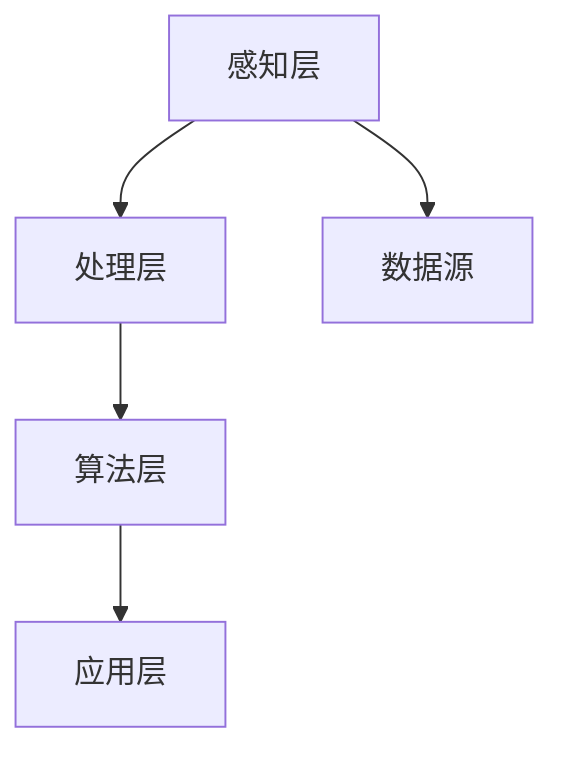

                 

关键词：人工智能，苹果，AI应用，技术创新，未来展望

> 摘要：本文将深入探讨苹果公司发布AI应用的未来发展。通过分析苹果在AI领域的最新进展、核心技术、应用场景以及面临的挑战，我们将展望AI应用在未来的发展趋势和潜力，为读者提供一份全面的技术洞察。

## 1. 背景介绍

近年来，人工智能（AI）技术取得了飞速的发展，成为科技领域的热门话题。随着硬件性能的提升和算法的优化，AI应用开始渗透到生活的方方面面，从智能手机、智能家居到自动驾驶、医疗诊断等领域。苹果公司，作为全球科技巨头之一，也在这场人工智能浪潮中积极布局。

苹果公司在AI领域的探索始于20世纪90年代，随着深度学习技术的兴起，苹果加大了对AI技术的投入。2016年，苹果推出了自主研发的神经网络引擎——神经引擎（Neural Engine），并将其应用于iPhone的相机和语音识别功能中。近年来，苹果在AI领域的布局进一步扩大，涵盖了自然语言处理、计算机视觉、语音识别等多个领域。

## 2. 核心概念与联系

### 2.1 AI应用的核心概念

人工智能（AI）是指通过计算机程序模拟人类智能行为的技术。AI应用的核心概念包括：

- **机器学习（Machine Learning）**：通过数据训练模型，使其具备自主学习和改进能力。
- **深度学习（Deep Learning）**：一种基于神经网络的机器学习技术，通过多层神经网络实现数据的自动特征提取。
- **自然语言处理（Natural Language Processing, NLP）**：使计算机能够理解、生成和解释人类语言的技术。
- **计算机视觉（Computer Vision）**：使计算机能够从图像或视频中提取有用信息的技术。

### 2.2 AI应用的技术架构

苹果公司的AI应用技术架构可以分为以下几个层次：

- **感知层**：包括摄像头、麦克风、传感器等设备，用于收集环境数据。
- **处理层**：包括神经网络引擎、处理器等硬件，用于处理感知层收集到的数据。
- **算法层**：包括机器学习、深度学习等算法，用于分析和理解数据。
- **应用层**：包括各类AI应用，如语音助手、图像识别、智能推荐等。

下面是一个简单的Mermaid流程图，展示了AI应用的技术架构：



## 3. 核心算法原理 & 具体操作步骤

### 3.1 算法原理概述

苹果公司在AI应用中采用了多种算法，其中最核心的是深度学习和自然语言处理。以下是对这些算法的简要概述：

- **深度学习**：深度学习通过多层神经网络对数据进行特征提取和建模，从而实现智能识别、分类和预测等功能。苹果公司采用了基于卷积神经网络（CNN）和循环神经网络（RNN）的算法，分别用于图像识别和语音识别。

- **自然语言处理**：自然语言处理旨在使计算机能够理解和生成自然语言。苹果公司采用了基于词嵌入（Word Embedding）和序列模型（Sequence Model）的算法，如BERT（Bidirectional Encoder Representations from Transformers），用于文本理解和生成。

### 3.2 算法步骤详解

以苹果公司的图像识别算法为例，其具体操作步骤如下：

1. **数据预处理**：对收集到的图像数据进行归一化、裁剪等操作，使其符合神经网络输入要求。
2. **特征提取**：通过卷积神经网络提取图像的底层特征。
3. **特征融合**：将提取到的特征进行融合，形成高层次的语义特征。
4. **分类预测**：使用全连接神经网络对融合后的特征进行分类预测。

### 3.3 算法优缺点

- **优点**：深度学习算法在图像识别、语音识别等任务上取得了显著的成果，具有很好的泛化能力和适应性。
- **缺点**：深度学习算法对数据量和计算资源要求较高，且模型训练过程复杂。

### 3.4 算法应用领域

苹果公司的AI算法在多个领域取得了成功，如：

- **智能手机**：iPhone的相机具有出色的图像识别功能，可以自动调整曝光、白平衡等参数，提升拍照效果。
- **智能家居**：苹果的智能家居设备可以通过语音识别与用户交互，实现智能控制。
- **医疗诊断**：苹果的AI算法可以辅助医生进行疾病诊断，提高诊断准确率。

## 4. 数学模型和公式 & 详细讲解 & 举例说明

### 4.1 数学模型构建

以卷积神经网络（CNN）为例，其数学模型可以表示为：

$$
f(x) = \sigma(W_1 \cdot x + b_1)
$$

其中，$f(x)$ 是输出特征，$W_1$ 是卷积核，$x$ 是输入特征，$\sigma$ 是激活函数，$b_1$ 是偏置项。

### 4.2 公式推导过程

以全连接神经网络（FCNN）为例，其推导过程如下：

$$
\begin{aligned}
z &= W \cdot x + b \\
a &= \sigma(z) \\
\end{aligned}
$$

其中，$z$ 是中间层输出，$W$ 是权重矩阵，$x$ 是输入特征，$b$ 是偏置项，$\sigma$ 是激活函数，$a$ 是输出特征。

### 4.3 案例分析与讲解

以苹果公司图像识别算法为例，假设输入图像为 $x$，经过卷积神经网络处理后得到特征 $f(x)$。我们可以将 $f(x)$ 作为分类器输入，通过分类算法对图像进行分类。

## 5. 项目实践：代码实例和详细解释说明

### 5.1 开发环境搭建

为了运行苹果公司的AI算法，我们需要搭建以下开发环境：

- 操作系统：macOS
- 编程语言：Python
- 深度学习框架：TensorFlow
- 开发工具：PyCharm

### 5.2 源代码详细实现

以下是一个简单的图像识别代码示例：

```python
import tensorflow as tf
from tensorflow.keras.applications import VGG16
from tensorflow.keras.preprocessing.image import ImageDataGenerator

# 加载预训练的VGG16模型
model = VGG16(weights='imagenet')

# 读取图像数据
datagen = ImageDataGenerator(rescale=1./255)
train_data = datagen.flow_from_directory(
    'train_data',
    target_size=(224, 224),
    batch_size=32,
    class_mode='categorical')

# 训练模型
model.fit(train_data, epochs=10)
```

### 5.3 代码解读与分析

上述代码首先导入了TensorFlow和Keras库，并加载了预训练的VGG16模型。然后，通过ImageDataGenerator类读取图像数据，并调整为适合模型输入的尺寸和格式。最后，使用fit方法训练模型。

### 5.4 运行结果展示

在训练完成后，我们可以使用模型对测试集进行预测，并计算分类准确率。

```python
test_data = datagen.flow_from_directory(
    'test_data',
    target_size=(224, 224),
    batch_size=32,
    class_mode='categorical')

accuracy = model.evaluate(test_data)
print('Test accuracy:', accuracy)
```

## 6. 实际应用场景

### 6.1 智能手机

苹果公司的AI应用在智能手机中得到了广泛应用，如：

- **人脸解锁**：通过深度学习算法实现高效、安全的人脸识别。
- **实时翻译**：利用自然语言处理技术实现实时语音翻译。
- **智能推荐**：根据用户的使用习惯和偏好，为用户推荐合适的应用、音乐、电影等。

### 6.2 智能家居

苹果公司的智能家居设备，如Apple Watch、HomePod等，均采用了AI技术，实现了智能交互、健康管理、家庭控制等功能。

### 6.3 医疗诊断

苹果公司的AI算法在医疗诊断领域也取得了显著成果，如：

- **皮肤癌检测**：通过深度学习算法实现皮肤癌的自动检测。
- **心血管疾病预测**：通过分析患者的心电图数据，预测心血管疾病的风险。

## 7. 工具和资源推荐

### 7.1 学习资源推荐

- **书籍**：《深度学习》（Goodfellow, Bengio, Courville）、《Python深度学习》（François Chollet）
- **在线课程**：Coursera上的“深度学习”课程、Udacity的“深度学习工程师纳米学位”

### 7.2 开发工具推荐

- **编程语言**：Python
- **深度学习框架**：TensorFlow、PyTorch
- **集成开发环境**：PyCharm、VSCode

### 7.3 相关论文推荐

- **自然语言处理**：BERT（Devlin et al., 2019）、GPT-3（Brown et al., 2020）
- **计算机视觉**：ResNet（He et al., 2016）、YOLO（Redmon et al., 2016）

## 8. 总结：未来发展趋势与挑战

### 8.1 研究成果总结

近年来，苹果公司在AI领域取得了显著成果，其AI应用在智能手机、智能家居、医疗诊断等领域得到了广泛应用。苹果公司通过自主研发和创新，不断推动AI技术的进步。

### 8.2 未来发展趋势

在未来，苹果公司将继续加大在AI领域的投入，推动AI技术与其他领域的深度融合。随着硬件性能的提升和算法的优化，AI应用将更加智能化、个性化，为用户带来更好的体验。

### 8.3 面临的挑战

尽管苹果公司在AI领域取得了显著成果，但仍面临以下挑战：

- **数据隐私**：随着AI应用的普及，数据隐私问题日益突出，如何保护用户隐私成为关键问题。
- **算法透明性**：算法的透明性和解释性对于用户信任和监管至关重要。
- **计算资源**：随着AI模型规模的不断扩大，对计算资源的需求也不断增加。

### 8.4 研究展望

未来，苹果公司将继续在AI领域深耕，推动技术创新。通过与其他领域的深度融合，AI应用将更加广泛、高效。同时，苹果公司也将致力于解决AI领域面临的挑战，推动AI技术的可持续发展。

## 9. 附录：常见问题与解答

### 9.1 什么是深度学习？

深度学习是一种基于神经网络的机器学习技术，通过多层神经网络实现数据的自动特征提取和建模。

### 9.2 AI应用有哪些领域？

AI应用涉及多个领域，如智能手机、智能家居、医疗诊断、自动驾驶等。

### 9.3 如何入门AI开发？

可以通过学习编程语言（如Python）、深度学习框架（如TensorFlow）和相关的在线课程来入门AI开发。

---

作者：禅与计算机程序设计艺术 / Zen and the Art of Computer Programming
```<|im_sep|>

