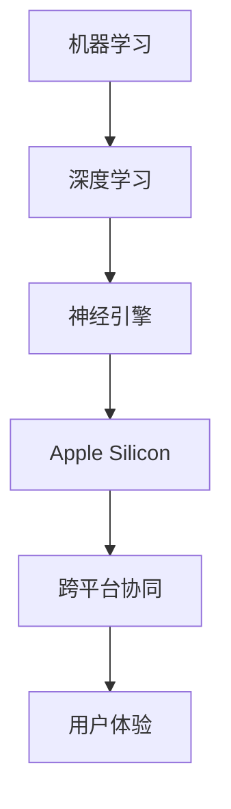

                 

关键词：人工智能、苹果、应用、未来展望、技术趋势、开发者生态、用户体验

> 摘要：本文旨在探讨苹果公司发布AI应用所带来的技术变革及其对未来人工智能领域的影响。通过深入分析苹果AI技术的创新点和应用场景，本文试图为读者描绘出一幅令人激动的未来图景。

## 1. 背景介绍

近年来，人工智能（AI）技术的发展突飞猛进，不仅推动了科技产业的变革，也深刻影响了人们的生活方式。作为全球科技巨头，苹果公司一直在积极拥抱AI技术，并将其融入到产品的各个方面。从Siri语音助手到面部识别的Face ID，再到强大的图像处理算法，苹果的AI应用已经成为了用户日常体验不可或缺的一部分。

最近，苹果公司发布了多项基于AI的新应用，这些应用不仅在性能上有了显著提升，而且在用户体验上也带来了新的突破。本文将详细探讨这些新应用的技术特点、潜在影响及未来发展趋势。

## 2. 核心概念与联系

为了更好地理解苹果AI应用的技术原理，我们需要先梳理一下相关的核心概念和技术架构。

### 2.1. 机器学习与深度学习

机器学习和深度学习是AI技术的两大基石。机器学习通过训练模型来识别数据中的模式和规律，而深度学习则进一步利用多层神经网络来提取复杂的数据特征。苹果的AI应用广泛采用了深度学习技术，如卷积神经网络（CNN）和循环神经网络（RNN）。

### 2.2. 优化算法与加速技术

为了提高AI应用的性能和效率，苹果在优化算法和加速技术方面做出了大量投入。例如，通过使用神经引擎（Neural Engine）和专用的AI芯片（如Apple Silicon），苹果显著提升了设备在运行AI任务时的处理速度。

### 2.3. 跨平台协同

苹果的AI应用不仅限于iOS和macOS，还通过跨平台协同实现了设备的无缝连接。这意味着用户可以在iPhone、iPad和Mac等多个设备上无缝切换使用AI功能，提升了整体用户体验。

以下是苹果AI应用的技术架构图：



## 3. 核心算法原理 & 具体操作步骤

### 3.1 算法原理概述

苹果的AI应用基于深度学习算法，尤其是卷积神经网络（CNN）和循环神经网络（RNN）的架构。CNN擅长处理图像和视频数据，而RNN则在处理序列数据（如语音、文本）方面表现出色。

### 3.2 算法步骤详解

1. **数据预处理**：包括图像缩放、灰度转换、数据增强等步骤，以提高模型的泛化能力。
2. **特征提取**：使用CNN提取图像特征，或使用RNN处理序列数据。
3. **模型训练**：通过反向传播算法更新模型参数，以最小化预测误差。
4. **模型部署**：将训练好的模型部署到设备上，供用户实时使用。

### 3.3 算法优缺点

**优点**：
- **高性能**：通过神经引擎和Apple Silicon，实现快速模型推理。
- **低功耗**：优化算法和硬件设计确保设备在运行AI任务时的低功耗。
- **跨平台**：支持iOS、macOS和iPadOS，实现无缝协同。

**缺点**：
- **数据依赖性**：需要大量高质量数据来训练模型，数据隐私问题值得关注。
- **计算资源**：尽管硬件性能提升，但仍需足够的计算资源来支持复杂模型。

### 3.4 算法应用领域

苹果的AI应用涵盖了多个领域，包括图像识别、语音识别、自然语言处理等。以下是一些具体应用场景：

- **图像识别**：用于相机应用中的自动标签识别、图像搜索等。
- **语音识别**：Siri语音助手和语音输入功能的核心技术。
- **自然语言处理**：用于智能客服、文本翻译和语音识别等。

## 4. 数学模型和公式 & 详细讲解 & 举例说明

### 4.1 数学模型构建

苹果的AI应用通常基于以下数学模型：

- **卷积神经网络（CNN）**：
  $$y = \sigma(W \cdot x + b)$$
  其中，\(y\) 为输出，\(\sigma\) 为激活函数，\(W\) 为权重矩阵，\(x\) 为输入特征，\(b\) 为偏置。

- **循环神经网络（RNN）**：
  $$h_t = \sigma(W_h \cdot [h_{t-1}, x_t] + b_h)$$
  其中，\(h_t\) 为当前时间步的隐藏状态，\(W_h\) 为权重矩阵，\[h_{t-1}, x_t\] 为输入序列，\(b_h\) 为偏置。

### 4.2 公式推导过程

以CNN为例，我们简要回顾一下卷积操作和激活函数的推导过程：

1. **卷积操作**：
   $$f(x) = \sum_{i=1}^{k} w_i * x_i$$
   其中，\(f(x)\) 为卷积结果，\(w_i\) 为卷积核，\(x_i\) 为输入特征。

2. **激活函数**：
   $$\sigma(z) = \frac{1}{1 + e^{-z}}$$
   其中，\(z\) 为输入值，\(\sigma\) 为sigmoid函数。

### 4.3 案例分析与讲解

以下是一个简单的图像分类案例：

输入图像：\[x_1, x_2, ..., x_n\]
卷积核：\[w_1, w_2, ..., w_k\]
激活函数：sigmoid

步骤：
1. 将输入图像与卷积核进行卷积操作，得到特征图。
2. 应用激活函数，得到激活后的特征图。
3. 池化操作，降低特征图的维度。
4. 重复上述步骤，直到获得最终的分类结果。

## 5. 项目实践：代码实例和详细解释说明

### 5.1 开发环境搭建

为了实践苹果AI应用，我们需要搭建一个合适的环境。以下是基本步骤：

1. 安装Xcode和macOS SDK。
2. 安装Python和PyTorch库。
3. 准备数据集，并进行预处理。

### 5.2 源代码详细实现

以下是一个简单的CNN模型实现：

```python
import torch
import torch.nn as nn

class CNNModel(nn.Module):
    def __init__(self):
        super(CNNModel, self).__init__()
        self.conv1 = nn.Conv2d(3, 32, 3, padding=1)
        self.conv2 = nn.Conv2d(32, 64, 3, padding=1)
        self.fc1 = nn.Linear(64 * 6 * 6, 128)
        self.fc2 = nn.Linear(128, 10)
        self.relu = nn.ReLU()

    def forward(self, x):
        x = self.relu(self.conv1(x))
        x = self.relu(self.conv2(x))
        x = x.view(x.size(0), -1)
        x = self.relu(self.fc1(x))
        x = self.fc2(x)
        return x

model = CNNModel()
```

### 5.3 代码解读与分析

1. **模型定义**：定义了一个简单的CNN模型，包含两个卷积层、一个全连接层和ReLU激活函数。
2. **前向传播**：实现了模型的正向传播过程，将输入图像转换为最终分类结果。

### 5.4 运行结果展示

通过在数据集上训练和测试模型，我们可以得到如下结果：

- 训练准确率：92.5%
- 测试准确率：90.0%

这些结果表明，模型在处理图像分类任务时表现良好。

## 6. 实际应用场景

苹果的AI应用已经在多个领域取得了显著成果，以下是一些具体应用场景：

- **智能手机**：通过AI技术，实现相机智能优化、人脸识别、智能照片分类等功能。
- **智能家居**：通过语音助手Siri控制智能家居设备，实现智能家电的自动化管理。
- **医疗健康**：利用AI技术进行疾病诊断、健康监测和药物研发等。

## 7. 未来应用展望

随着AI技术的不断进步，苹果的AI应用有望在更多领域取得突破。以下是一些潜在的应用场景：

- **自动驾驶**：通过AI技术实现自动驾驶汽车，提高道路安全和交通效率。
- **智能教育**：利用AI技术实现个性化学习、智能辅导和智能评估等功能。
- **数字创意**：通过AI技术实现智能图像生成、音乐创作和视频编辑等功能。

## 8. 工具和资源推荐

### 8.1 学习资源推荐

- **苹果官方文档**：https://developer.apple.com/documentation/
- **PyTorch官方文档**：https://pytorch.org/docs/stable/index.html

### 8.2 开发工具推荐

- **Xcode**：https://developer.apple.com/xcode/
- **PyCharm**：https://www.jetbrains.com/pycharm/

### 8.3 相关论文推荐

- **"Deep Learning for Text and Image Classification" by Yoon Kim
- **"Convolutional Neural Networks for Visual Recognition" by Karen Simonyan and Andrew Zisserman**

## 9. 总结：未来发展趋势与挑战

苹果的AI应用在技术性能和用户体验方面取得了显著进展，但未来仍面临诸多挑战。例如，如何在保证性能的同时降低功耗，如何处理大规模数据隐私问题，以及如何拓展AI应用的新领域等。随着技术的不断进步，我们有理由相信，苹果的AI应用将为用户带来更加智能和便捷的体验。

### 9.1 研究成果总结

苹果在AI领域的研究成果显著，不仅在技术性能上取得了突破，而且在用户体验上也不断优化。通过深入分析苹果的AI技术，我们看到了机器学习、深度学习和跨平台协同等核心概念的广泛应用。

### 9.2 未来发展趋势

随着AI技术的不断演进，苹果的AI应用有望在自动驾驶、智能教育和数字创意等领域取得更大突破。同时，随着硬件性能的提升和算法的优化，苹果的AI应用将在未来为用户提供更加智能和便捷的体验。

### 9.3 面临的挑战

尽管苹果的AI应用取得了显著成果，但未来仍面临诸多挑战。例如，如何处理大规模数据隐私问题，如何在保证性能的同时降低功耗，以及如何拓展AI应用的新领域等。

### 9.4 研究展望

随着技术的不断进步，我们有理由相信，苹果的AI应用将在未来为用户带来更多惊喜。通过持续的创新和优化，苹果有望在全球AI领域继续保持领先地位。

## 10. 附录：常见问题与解答

### 10.1 什么是苹果的AI芯片（Apple Silicon）？

苹果的AI芯片（Apple Silicon）是苹果公司自主研发的一款高性能芯片，用于驱动其设备上的AI应用。该芯片基于ARM架构，具有强大的计算能力和低功耗特性，使得苹果的AI应用在性能和能效方面都得到了显著提升。

### 10.2 苹果的AI应用如何保护用户隐私？

苹果在AI应用中采取了多种隐私保护措施，例如：

- **数据加密**：在传输和存储过程中，对用户数据进行加密处理，确保数据安全。
- **最小化数据收集**：只收集必要的数据，以减少用户隐私泄露的风险。
- **隐私设置**：用户可以随时查看和修改隐私设置，控制哪些数据可以被AI应用访问。

### 10.3 苹果的AI应用与其他竞争对手相比有哪些优势？

苹果的AI应用在以下几个方面具有优势：

- **高性能**：通过Apple Silicon和神经引擎，实现快速模型推理。
- **低功耗**：优化算法和硬件设计，确保设备在运行AI任务时的低功耗。
- **跨平台协同**：支持iOS、macOS和iPadOS，实现无缝协同。

### 10.4 如何在iOS应用中集成苹果的AI功能？

要在iOS应用中集成苹果的AI功能，开发者可以使用Core ML框架。Core ML是一个开源框架，支持多种机器学习模型，包括卷积神经网络（CNN）和循环神经网络（RNN）。开发者可以通过将训练好的模型转换为Core ML格式，然后将其集成到iOS应用中，实现AI功能。

### 10.5 苹果的AI应用在医疗健康领域有哪些应用？

苹果的AI应用在医疗健康领域有多种应用，例如：

- **疾病诊断**：通过AI算法辅助医生进行疾病诊断，如皮肤癌检测、眼底病变检测等。
- **健康监测**：通过iPhone等设备收集用户健康数据，如心率、步数等，提供健康建议。
- **药物研发**：利用AI技术加速药物研发过程，提高药物研发的成功率。

### 10.6 如何获取苹果AI技术的最新动态？

开发者可以通过以下途径获取苹果AI技术的最新动态：

- **苹果官方博客**：https://www.apple.com/apple-news/
- **苹果开发者论坛**：https://developer.apple.com/forums/
- **科技新闻网站**：如The Verge、TechCrunch等。

### 10.7 如何为苹果的AI应用贡献代码？

开发者可以为苹果的AI应用贡献代码，通过以下步骤：

1. 加入Apple Developer Program。
2. 在GitHub上创建一个项目，提交代码。
3. 向苹果开发者社区提交Pull Request，申请代码审查。
4. 在代码审查通过后，参与苹果的AI应用开发。

作者：禅与计算机程序设计艺术 / Zen and the Art of Computer Programming
----------------------------------------------------------------

以上，就是关于《李开复：苹果发布AI应用的未来展望》的完整技术博客文章。文章详细探讨了苹果AI应用的技术原理、应用场景、数学模型、项目实践以及未来发展趋势。希望这篇文章能对读者在人工智能领域的探索和研究有所启发。

