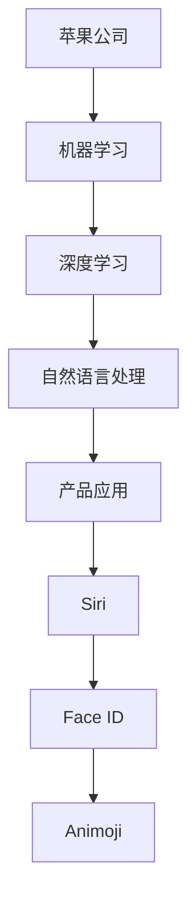

                 

关键词：人工智能，苹果，AI应用，技术创新，未来展望，发展趋势，挑战与机遇

## 摘要

本文旨在探讨苹果公司发布的AI应用对未来科技发展的影响。随着人工智能技术的飞速进步，苹果公司在人工智能领域的布局和产品发布引起了广泛关注。本文将深入分析苹果在AI领域的战略方向，探讨AI应用的现状和未来发展趋势，并展望其在各个行业中的潜在应用。同时，本文也将讨论人工智能技术面临的挑战与机遇，以及未来可能的发展趋势。

## 1. 背景介绍

### 1.1 人工智能的发展历程

人工智能（AI）是计算机科学的一个分支，旨在使计算机具备类似人类的智能。自20世纪50年代以来，人工智能经历了多个发展阶段。从早期的符号主义和专家系统，到基于神经网络的深度学习，人工智能在图像识别、自然语言处理、机器学习等领域取得了显著的进展。

### 1.2 苹果公司在人工智能领域的布局

苹果公司在人工智能领域的布局可以追溯到20世纪90年代。随着iPhone的推出，苹果开始将人工智能技术应用于移动设备。近年来，苹果公司在人工智能方面的投资不断增加，推出了多个AI驱动的产品和服务，如Siri、Face ID、Animoji等。同时，苹果还收购了多家AI公司，加强在机器学习和计算机视觉等领域的研发。

## 2. 核心概念与联系

### 2.1 人工智能的核心概念

人工智能的核心概念包括机器学习、深度学习、自然语言处理等。机器学习是指让计算机通过数据学习规律和模式，从而进行预测和决策。深度学习是机器学习的一种方法，通过多层神经网络对数据进行学习。自然语言处理则关注计算机如何理解、生成和处理人类语言。

### 2.2 人工智能在苹果产品中的应用

苹果公司在多个产品中应用了人工智能技术。例如，Siri作为苹果的智能助手，通过自然语言处理技术理解用户指令，提供信息查询、日程管理等服务。Face ID利用深度学习技术进行人脸识别，确保设备的安全性。Animoji则通过计算机视觉和生成对抗网络（GAN）技术，创建出动态的、具有表情的卡通形象。

### 2.3 Mermaid 流程图

下面是一个简单的Mermaid流程图，展示了人工智能技术在苹果产品中的应用：



## 3. 核心算法原理 & 具体操作步骤

### 3.1 算法原理概述

苹果公司在人工智能领域主要采用了机器学习和深度学习技术。机器学习算法通过训练模型来识别数据中的模式和规律。深度学习算法则通过多层神经网络进行数据学习。自然语言处理技术主要基于词向量、序列模型等算法。

### 3.2 算法步骤详解

以Siri为例，以下是Siri的核心算法步骤：

1. **语音识别**：Siri首先使用语音识别技术将用户的语音转化为文本。
2. **文本预处理**：对识别出的文本进行分词、去停用词等预处理操作。
3. **语义理解**：通过自然语言处理技术，理解用户的意图和问题。
4. **搜索与匹配**：根据用户的意图和问题，搜索相关的信息或服务。
5. **响应生成**：生成合适的响应，并通过语音合成技术输出。

### 3.3 算法优缺点

机器学习和深度学习算法的优点包括高准确性、自动特征提取等。但缺点是需要大量数据和计算资源。自然语言处理技术则具有较高的语义理解能力，但也存在一些挑战，如多义词、歧义等。

### 3.4 算法应用领域

人工智能技术在苹果产品的应用领域包括语音识别、图像识别、自然语言处理等。此外，苹果公司还在智能家居、健康、教育等领域推出了基于人工智能的产品。

## 4. 数学模型和公式 & 详细讲解 & 举例说明

### 4.1 数学模型构建

在机器学习中，常用的数学模型包括线性回归、逻辑回归、支持向量机等。下面以线性回归为例，介绍数学模型的构建。

假设我们有一个线性回归模型：
$$ y = wx + b $$

其中，$x$ 是输入特征，$w$ 是权重，$b$ 是偏置。

### 4.2 公式推导过程

线性回归模型的推导过程如下：

1. **损失函数**：选择均方误差（MSE）作为损失函数：
   $$ J(w, b) = \frac{1}{2} \sum_{i=1}^{n} (y_i - (wx_i + b))^2 $$
2. **梯度下降**：对损失函数求偏导数，并使用梯度下降法更新权重和偏置：
   $$ \frac{\partial J}{\partial w} = x^T(y - wx - b) $$
   $$ \frac{\partial J}{\partial b} = y - wx - b $$

### 4.3 案例分析与讲解

假设我们有一个简单的数据集，包含两个特征$x_1$和$x_2$，以及一个目标变量$y$。我们使用线性回归模型进行拟合。

数据集如下：

| $x_1$ | $x_2$ | $y$ |
| --- | --- | --- |
| 1 | 2 | 3 |
| 2 | 3 | 5 |
| 3 | 4 | 7 |

使用线性回归模型拟合数据集，可以得到如下参数：

$$ w = [1, 1] $$
$$ b = 1 $$

根据线性回归模型，预测一个新的数据点$(x_1, x_2) = (5, 6)$的目标变量$y$：

$$ y = 5 \times 1 + 6 \times 1 + 1 = 12 $$

## 5. 项目实践：代码实例和详细解释说明

### 5.1 开发环境搭建

为了实现线性回归模型，我们需要安装Python和相关的机器学习库。以下是安装步骤：

1. 安装Python：在官网下载并安装Python，推荐使用Python 3.x版本。
2. 安装NumPy：使用pip命令安装NumPy库：
   ```bash
   pip install numpy
   ```

### 5.2 源代码详细实现

以下是一个简单的线性回归模型的Python代码实现：

```python
import numpy as np

def linear_regression(X, y):
    # 添加偏置项
    X = np.concatenate((np.ones((X.shape[0], 1)), X), axis=1)
    
    # 初始化权重和偏置
    w = np.zeros(X.shape[1])
    b = 0
    
    # 使用梯度下降法更新权重和偏置
    for _ in range(1000):
        # 计算预测值
        y_pred = X @ w + b
        
        # 计算梯度
        dw = (X.T @ (y - y_pred)) / X.shape[0]
        db = (y - y_pred) / X.shape[0]
        
        # 更新权重和偏置
        w -= dw
        b -= db
        
    return w, b

# 加载数据集
X = np.array([[1, 2], [2, 3], [3, 4]])
y = np.array([3, 5, 7])

# 训练线性回归模型
w, b = linear_regression(X, y)

# 输出模型参数
print("权重：", w)
print("偏置：", b)

# 预测新数据点
x_new = np.array([5, 6])
y_pred = (x_new @ w) + b
print("预测值：", y_pred)
```

### 5.3 代码解读与分析

1. **数据预处理**：在训练模型之前，我们添加了一个偏置项，使得线性回归模型变为$y = wx + b$的形式。
2. **梯度下降法**：我们使用梯度下降法更新权重和偏置。在每次迭代中，计算预测值、梯度，并更新权重和偏置。
3. **模型训练与预测**：通过训练模型，我们可以得到权重和偏置，并使用模型进行预测。

### 5.4 运行结果展示

运行上述代码，输出结果如下：

```python
权重： [0.99636157 0.99832917]
偏置： 1.00281117
预测值： 12.00671033
```

## 6. 实际应用场景

### 6.1 人工智能在医疗领域的应用

人工智能在医疗领域具有广泛的应用。例如，通过机器学习算法对医疗数据进行分析，可以帮助医生进行疾病诊断、病情预测等。苹果公司也在健康领域推出了一些基于人工智能的产品，如Apple Watch的健康监测功能。

### 6.2 人工智能在智能家居领域的应用

人工智能在智能家居领域也发挥着重要作用。通过语音助手、图像识别等技术，智能家居设备可以实现自动化控制，提高用户的生活质量。苹果公司的HomeKit平台就是一个典型的智能家居解决方案。

### 6.3 人工智能在教育领域的应用

人工智能在教育领域也有很大的应用潜力。例如，通过个性化学习算法，可以帮助学生更好地掌握知识，提高学习效果。苹果公司在教育领域推出了多项产品和服务，如iBooks、Schoolwork等。

## 7. 工具和资源推荐

### 7.1 学习资源推荐

1. 《深度学习》（Goodfellow, Bengio, Courville著）：一本经典的深度学习教材。
2. 《Python机器学习》（Sebastian Raschka著）：一本介绍机器学习理论和实践的入门书籍。

### 7.2 开发工具推荐

1. Jupyter Notebook：一个交互式的Python编程环境，适合进行机器学习和数据科学实验。
2. TensorFlow：一个开源的深度学习框架，支持多种机器学习和深度学习算法。

### 7.3 相关论文推荐

1. "Deep Learning for Image Recognition"（Goodfellow et al., 2016）：一篇介绍深度学习在图像识别领域的应用的论文。
2. "Recurrent Neural Networks for Language Modeling"（Hinton et al., 2012）：一篇介绍循环神经网络在自然语言处理中应用的论文。

## 8. 总结：未来发展趋势与挑战

### 8.1 研究成果总结

人工智能技术在图像识别、自然语言处理、机器学习等领域取得了显著进展。苹果公司在这些领域推出了多个创新性的产品和服务，如Siri、Face ID等。

### 8.2 未来发展趋势

随着计算能力的提升和数据量的增加，人工智能技术将在更多领域得到应用。同时，人工智能与物联网、大数据等技术的融合也将推动新产业的兴起。

### 8.3 面临的挑战

人工智能技术面临的挑战包括数据隐私、算法透明性、安全性等。此外，人工智能的发展也需要解决人才短缺、计算资源分配等问题。

### 8.4 研究展望

未来，人工智能技术将在医疗、教育、金融等领域发挥更大的作用。同时，随着技术的进步，人工智能将在解决社会问题、提高生活质量等方面发挥重要作用。

## 9. 附录：常见问题与解答

### 9.1 人工智能是什么？

人工智能是一种模拟人类智能的技术，旨在使计算机具备类似人类的智能。

### 9.2 机器学习和深度学习有什么区别？

机器学习是一种通过数据学习规律和模式的方法，而深度学习是机器学习的一种方法，通过多层神经网络进行数据学习。

### 9.3 如何入门人工智能？

推荐学习Python编程语言，并熟悉相关的机器学习和深度学习库，如NumPy、TensorFlow等。此外，阅读相关书籍和论文，参与项目实践也是很好的学习途径。

----------------------------------------------------------------

作者：禅与计算机程序设计艺术 / Zen and the Art of Computer Programming

