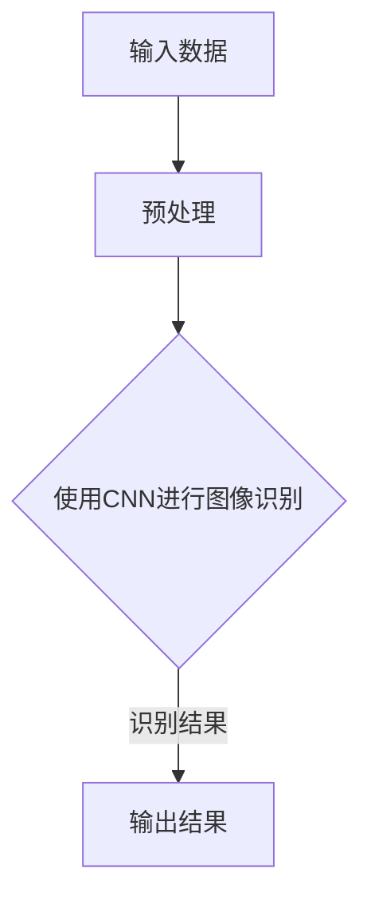

                 

关键词：苹果、AI应用、发布、机会、技术趋势

摘要：本文将深入探讨苹果公司在AI领域的最新动态，分析其发布AI应用带来的市场机遇，并展望未来人工智能在科技产业中的发展趋势。

## 1. 背景介绍

近年来，人工智能（AI）技术取得了飞速发展，逐渐渗透到各行各业。苹果公司作为全球领先的科技企业，也在AI领域积极布局，不断推出创新产品。此次苹果发布AI应用，无疑为市场注入了新的活力，引发了广泛关注。

## 2. 核心概念与联系

### 2.1 AI技术原理

人工智能是指通过计算机模拟人类的智能行为，实现自动学习、推理、规划等功能。其主要包括机器学习、深度学习、自然语言处理等技术。

### 2.2 苹果AI应用架构

苹果AI应用采用了先进的神经网络架构，包括卷积神经网络（CNN）、循环神经网络（RNN）和长短时记忆网络（LSTM）等。这些技术使得苹果AI应用在图像识别、语音识别、自然语言处理等方面具有强大的能力。

### 2.3 Mermaid流程图



## 3. 核心算法原理 & 具体操作步骤

### 3.1 算法原理概述

苹果AI应用的核心算法基于深度学习，其原理是通过多层神经网络对大量数据进行分析和学习，从而提取出数据中的规律和特征。具体来说，算法包括以下几个步骤：

1. 数据预处理：对输入数据进行归一化、去噪等处理，以提高模型的准确性。
2. 神经网络训练：使用训练数据对神经网络进行训练，不断调整网络权重，使其能够准确识别数据中的特征。
3. 预测与评估：使用训练好的模型对测试数据进行分析，评估模型的准确性。

### 3.2 算法步骤详解

1. **数据预处理**：
   - 数据归一化：将输入数据的值缩放到一个固定范围，如[-1, 1]。
   - 数据去噪：使用滤波器或降噪算法去除噪声，提高数据质量。

2. **神经网络训练**：
   - 初始化网络权重：随机初始化网络权重。
   - 前向传播：将输入数据传递到神经网络中，计算输出结果。
   - 反向传播：计算输出误差，并更新网络权重。

3. **预测与评估**：
   - 输入测试数据：将测试数据输入训练好的模型，得到预测结果。
   - 评估模型性能：计算预测结果与真实结果的误差，评估模型性能。

### 3.3 算法优缺点

**优点**：
- **强大的学习能力**：通过大量数据训练，模型能够准确识别各种特征。
- **高效的运算速度**：采用神经网络加速计算，提高运算效率。

**缺点**：
- **对数据依赖性较强**：模型性能受训练数据的影响较大，数据质量会影响模型效果。
- **计算资源需求较高**：训练过程需要大量计算资源，对硬件要求较高。

### 3.4 算法应用领域

苹果AI应用主要应用于图像识别、语音识别、自然语言处理等领域，如：

- **图像识别**：用于人脸识别、物体检测等。
- **语音识别**：用于语音助手、语音输入等。
- **自然语言处理**：用于文本分析、情感识别等。

## 4. 数学模型和公式 & 详细讲解 & 举例说明

### 4.1 数学模型构建

苹果AI应用的数学模型主要基于深度学习，包括以下几个部分：

1. **输入层**：接收外部输入数据，如图像、语音等。
2. **隐藏层**：通过激活函数对输入数据进行非线性变换，提取特征。
3. **输出层**：将隐藏层提取的特征映射到目标输出，如分类结果、回归值等。

### 4.2 公式推导过程

假设我们有一个简单的全连接神经网络，包含一个输入层、一个隐藏层和一个输出层。输入层有 \( n \) 个神经元，隐藏层有 \( m \) 个神经元，输出层有 \( p \) 个神经元。

1. **输入层到隐藏层**：

   设输入层向量为 \( X \)，隐藏层向量为 \( H \)，权重矩阵为 \( W \)，偏置矩阵为 \( b \)。

   $$ H = \sigma(XW + b) $$

   其中，\( \sigma \) 为激活函数，如ReLU函数。

2. **隐藏层到输出层**：

   设隐藏层向量为 \( H \)，输出层向量为 \( Y \)，权重矩阵为 \( W' \)，偏置矩阵为 \( b' \)。

   $$ Y = \sigma(HW' + b') $$

   其中，\( \sigma \) 为激活函数，如Sigmoid函数。

### 4.3 案例分析与讲解

以图像识别为例，假设我们有一个 \( 28 \times 28 \) 像素的灰度图像，需要识别为数字0-9中的某一个。

1. **输入层**：

   $$ X = [x_1, x_2, ..., x_{784}] $$

   其中，\( x_i \) 表示像素值。

2. **隐藏层**：

   假设隐藏层有 \( 128 \) 个神经元，使用ReLU函数作为激活函数。

   $$ H = \sigma(XW + b) $$

   其中，\( W \) 为 \( 784 \times 128 \) 的权重矩阵，\( b \) 为 \( 128 \) 个偏置。

3. **输出层**：

   假设输出层有 \( 10 \) 个神经元，使用Sigmoid函数作为激活函数。

   $$ Y = \sigma(HW' + b') $$

   其中，\( W' \) 为 \( 128 \times 10 \) 的权重矩阵，\( b' \) 为 \( 10 \) 个偏置。

4. **损失函数**：

   使用交叉熵损失函数 \( C \) 来评估模型的准确性。

   $$ C = -\frac{1}{N}\sum_{i=1}^{N}y_i\log(y_i^{\hat{}}) $$

   其中，\( y_i \) 为真实标签，\( y_i^{\hat{}} \) 为预测标签。

## 5. 项目实践：代码实例和详细解释说明

### 5.1 开发环境搭建

- Python 3.7+
- TensorFlow 2.0+
- Matplotlib 3.0+

### 5.2 源代码详细实现

```python
import tensorflow as tf
import numpy as np
import matplotlib.pyplot as plt

# 数据预处理
def preprocess_data(data):
    data = data / 255.0
    return data

# 神经网络模型
def build_model():
    inputs = tf.keras.Input(shape=(28, 28, 1))
    x = tf.keras.layers.Conv2D(32, (3, 3), activation='relu')(inputs)
    x = tf.keras.layers.MaxPooling2D((2, 2))(x)
    x = tf.keras.layers.Conv2D(64, (3, 3), activation='relu')(x)
    x = tf.keras.layers.MaxPooling2D((2, 2))(x)
    x = tf.keras.layers.Flatten()(x)
    x = tf.keras.layers.Dense(128, activation='relu')(x)
    outputs = tf.keras.layers.Dense(10, activation='softmax')(x)
    model = tf.keras.Model(inputs, outputs)
    return model

# 训练模型
def train_model(model, train_data, train_labels, epochs):
    model.compile(optimizer='adam', loss='categorical_crossentropy', metrics=['accuracy'])
    model.fit(train_data, train_labels, epochs=epochs, batch_size=64)

# 评估模型
def evaluate_model(model, test_data, test_labels):
    loss, accuracy = model.evaluate(test_data, test_labels)
    print(f"Test accuracy: {accuracy:.2f}")

# 主程序
if __name__ == '__main__':
    # 加载数据
    (train_images, train_labels), (test_images, test_labels) = tf.keras.datasets.mnist.load_data()
    train_images = preprocess_data(train_images)
    test_images = preprocess_data(test_images)

    # 构建模型
    model = build_model()

    # 训练模型
    train_model(model, train_images, train_labels, epochs=10)

    # 评估模型
    evaluate_model(model, test_images, test_labels)
```

### 5.3 代码解读与分析

1. **数据预处理**：将图像数据缩放到[0, 1]范围内，方便模型训练。
2. **神经网络模型**：构建一个简单的卷积神经网络，包括卷积层、池化层和全连接层。
3. **训练模型**：使用随机梯度下降（SGD）优化器，交叉熵损失函数，训练模型。
4. **评估模型**：计算模型在测试集上的准确率。

## 6. 实际应用场景

苹果AI应用在实际场景中具有广泛的应用，如：

- **智能手机**：用于人脸识别、图像处理、智能搜索等。
- **智能家居**：用于语音助手、安防监控、智能家居控制等。
- **汽车**：用于自动驾驶、智能导航、车辆诊断等。

## 7. 工具和资源推荐

### 7.1 学习资源推荐

- 《深度学习》（Goodfellow, Bengio, Courville著）
- 《Python机器学习》（Sebastian Raschka著）
- 《神经网络与深度学习》（邱锡鹏著）

### 7.2 开发工具推荐

- TensorFlow：适用于构建和训练深度学习模型的强大工具。
- Keras：基于TensorFlow的高层API，易于使用和调试。
- PyTorch：适用于研究和开发的另一个流行的深度学习框架。

### 7.3 相关论文推荐

- "Deep Learning for Image Recognition"（Goodfellow et al., 2016）
- "Convolutional Neural Networks for Visual Recognition"（LeCun et al., 2015）
- "Recurrent Neural Networks for Language Modeling"（Liu et al., 2015）

## 8. 总结：未来发展趋势与挑战

### 8.1 研究成果总结

苹果AI应用的发布标志着人工智能技术的进一步成熟。通过深度学习、卷积神经网络等技术的应用，AI在图像识别、语音识别、自然语言处理等领域取得了显著成果。

### 8.2 未来发展趋势

未来，人工智能将继续向更广泛的应用领域扩展，如医疗、金融、教育等。同时，随着硬件性能的提升，深度学习模型将变得更加高效、强大。

### 8.3 面临的挑战

尽管人工智能取得了显著成果，但仍面临一系列挑战，如数据隐私、模型解释性、计算资源等。如何克服这些挑战，将决定人工智能的未来发展。

### 8.4 研究展望

随着技术的不断进步，人工智能将在未来发挥越来越重要的作用。研究者应继续探索新型算法、优化现有模型，以应对不断变化的挑战。

## 9. 附录：常见问题与解答

### 9.1 什么是深度学习？

深度学习是一种基于人工神经网络的学习方法，通过多层神经网络对大量数据进行分析和学习，从而提取出数据中的规律和特征。

### 9.2 如何学习深度学习？

学习深度学习需要掌握一定的数学基础，如线性代数、概率论、微积分等。同时，建议学习Python编程和常用的深度学习框架，如TensorFlow和PyTorch。

### 9.3 深度学习在哪些领域有应用？

深度学习在图像识别、语音识别、自然语言处理、推荐系统、自动驾驶等领域具有广泛的应用。

## 作者署名

作者：禅与计算机程序设计艺术 / Zen and the Art of Computer Programming
----------------------------------------------------------------

以上就是本文的完整内容，希望对您有所启发。如果您有任何疑问或建议，欢迎在评论区留言。谢谢！

