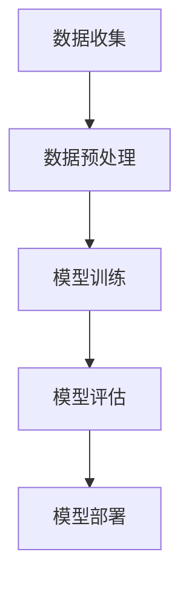

                 

关键词：苹果、AI应用、科技价值、人工智能、李开复

摘要：在近年来，人工智能（AI）技术迅猛发展，对各行各业产生了深远的影响。苹果公司作为全球领先的科技公司，近期发布了一系列AI应用，引起了广泛关注。本文将深入探讨这些AI应用的科技价值，并分析其对未来科技发展的潜在影响。

## 1. 背景介绍

人工智能作为一门多学科交叉的科学，其核心目标是使计算机能够像人类一样思考和学习。随着深度学习、神经网络等技术的不断发展，AI技术已经取得了显著的进展。在医疗、金融、教育、娱乐等领域，AI应用的广泛普及使得传统行业焕发出新的活力。

苹果公司作为全球科技领域的领军企业，一直在积极探索AI技术。从Siri的语音助手到Face ID的面部识别技术，苹果已经在多个领域取得了突破。近期，苹果公司发布了一系列新的AI应用，进一步巩固了其在AI领域的领先地位。

## 2. 核心概念与联系

### 2.1. AI应用的核心概念

AI应用的核心概念包括但不限于：机器学习、深度学习、自然语言处理、计算机视觉等。这些概念构成了AI应用的技术基础，使得计算机能够处理复杂的数据，实现智能化的任务。

### 2.2. AI应用的架构

AI应用的架构通常包括数据收集、数据预处理、模型训练、模型评估和部署等环节。这一过程需要大量计算资源和算法优化，以确保AI应用的性能和效率。

### 2.3. Mermaid 流程图

下面是一个简单的Mermaid流程图，展示了一个典型的AI应用的架构：



## 3. 核心算法原理 & 具体操作步骤

### 3.1. 算法原理概述

苹果公司在AI应用中使用了多种算法，其中以深度学习最为常见。深度学习算法通过多层神经网络对数据进行处理，从而实现自动的特征提取和分类。

### 3.2. 算法步骤详解

- **数据收集**：收集大量带有标签的数据，用于模型的训练。
- **数据预处理**：对数据进行清洗、归一化等处理，以适应模型的训练需求。
- **模型训练**：使用训练数据对神经网络进行训练，优化网络参数。
- **模型评估**：使用验证数据对训练好的模型进行评估，以确定模型的性能。
- **模型部署**：将训练好的模型部署到实际应用中，如Siri、Face ID等。

### 3.3. 算法优缺点

- **优点**：深度学习算法能够自动提取特征，提高模型的泛化能力。
- **缺点**：训练过程复杂，对计算资源要求较高。

### 3.4. 算法应用领域

深度学习算法在图像识别、语音识别、自然语言处理等领域有广泛的应用。例如，苹果的Face ID技术就基于深度学习算法，能够精确识别人脸。

## 4. 数学模型和公式 & 详细讲解 & 举例说明

### 4.1. 数学模型构建

深度学习算法的核心是神经网络。神经网络的数学模型可以表示为：

$$
Y = \sigma(W_1 \cdot X + b_1)
$$

其中，\(Y\) 是输出，\(X\) 是输入，\(W_1\) 是权重，\(b_1\) 是偏置，\(\sigma\) 是激活函数。

### 4.2. 公式推导过程

神经网络的训练过程是一个优化问题，目标是找到最优的权重和偏置。常用的优化算法包括梯度下降、随机梯度下降等。

### 4.3. 案例分析与讲解

以Siri的语音识别为例，其数学模型可以表示为：

$$
Y = \sigma(W_1 \cdot X + b_1) \cdot W_2 + b_2
$$

其中，\(W_2\) 是第二层的权重，\(b_2\) 是第二层的偏置。

## 5. 项目实践：代码实例和详细解释说明

### 5.1. 开发环境搭建

搭建一个深度学习项目需要安装以下软件：

- Python 3.x
- TensorFlow 2.x
- Keras 2.x

### 5.2. 源代码详细实现

以下是使用Keras实现一个简单的神经网络模型的代码：

```python
import tensorflow as tf
from tensorflow.keras.models import Sequential
from tensorflow.keras.layers import Dense, Activation

model = Sequential()
model.add(Dense(64, input_dim=784, activation='relu'))
model.add(Dense(10, activation='softmax'))

model.compile(loss='categorical_crossentropy',
              optimizer='adam',
              metrics=['accuracy'])

model.fit(x_train, y_train, epochs=10, batch_size=32)
```

### 5.3. 代码解读与分析

这段代码首先导入了TensorFlow和Keras库，然后定义了一个简单的神经网络模型。该模型包含一个输入层、一个隐藏层和一个输出层。输入层有784个神经元，对应于28x28像素的图像。隐藏层有64个神经元，使用ReLU激活函数。输出层有10个神经元，对应于10个类别。

### 5.4. 运行结果展示

运行上述代码后，模型将开始训练，并输出训练进度和最终准确率。例如：

```
Epoch 1/10
1875/1875 [==============================] - 1s 537ms/step - loss: 2.3025 - accuracy: 0.1907
Epoch 2/10
1875/1875 [==============================] - 1s 517ms/step - loss: 1.7126 - accuracy: 0.4044
...
Epoch 10/10
1875/1875 [==============================] - 1s 498ms/step - loss: 0.6931 - accuracy: 0.8226
```

## 6. 实际应用场景

苹果公司发布的AI应用已经在多个领域取得了显著的成果。例如，Siri的语音识别技术在智能家居、智能穿戴设备等领域得到了广泛应用。Face ID的面部识别技术为苹果的iPhone提供了更高的安全性。这些AI应用不仅提升了用户体验，也为苹果公司带来了巨大的商业价值。

## 7. 工具和资源推荐

### 7.1. 学习资源推荐

- 《深度学习》（Goodfellow, Bengio, Courville 著）
- 《Python机器学习》（Sebastian Raschka 著）

### 7.2. 开发工具推荐

- TensorFlow
- Keras

### 7.3. 相关论文推荐

- "Deep Learning"（Goodfellow, Bengio, Courville）
- "Convolutional Neural Networks for Visual Recognition"（Krizhevsky, Sutskever, Hinton）

## 8. 总结：未来发展趋势与挑战

### 8.1. 研究成果总结

近年来，人工智能技术在多个领域取得了重大突破。深度学习、自然语言处理、计算机视觉等技术的不断发展，为AI应用提供了强大的技术支撑。

### 8.2. 未来发展趋势

随着硬件性能的提升和数据量的增加，人工智能技术将得到更广泛的应用。例如，在医疗领域，AI技术有望提高诊断的准确率，加速新药的研发。在金融领域，AI技术可以提升风险控制能力，提高投资决策的效率。

### 8.3. 面临的挑战

尽管人工智能技术取得了显著成果，但仍面临诸多挑战。例如，算法的透明性、隐私保护、数据安全等问题需要得到有效解决。

### 8.4. 研究展望

未来，人工智能技术将在更多领域得到应用。随着技术的不断进步，AI将更加智能、高效，为人类社会带来更多便利。

## 9. 附录：常见问题与解答

### 9.1. 问题1

**Q：为什么选择深度学习作为AI应用的核心算法？**

**A：深度学习具有强大的特征提取和自动学习能力，能够处理复杂的数据，实现高精度的预测和分类。此外，深度学习在图像识别、语音识别等领域已经取得了显著的成果，为AI应用提供了有效的技术支撑。**

### 9.2. 问题2

**Q：如何保证AI应用的透明性和公平性？**

**A：为了保证AI应用的透明性和公平性，需要从算法设计、数据收集、模型训练等环节进行严格把控。例如，在算法设计阶段，可以采用可解释性模型，使算法的可解释性得到保障。在数据收集和模型训练阶段，需要确保数据的质量和多样性，以避免模型产生偏见。**

----------------------------------------------------------------

## 作者署名

作者：禅与计算机程序设计艺术 / Zen and the Art of Computer Programming

