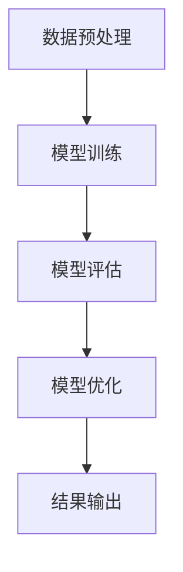

                 

关键词：李飞飞、ImageNet、深度学习、计算机视觉、人工智能

摘要：本文将探讨李飞飞在计算机视觉领域的重要贡献，特别是她在ImageNet项目中的领导角色和研究成果。文章将详细介绍ImageNet项目的背景、目标、成果以及李飞飞在其中所扮演的关键角色，同时分析其对人工智能领域的深远影响。

## 1. 背景介绍

李飞飞是一位杰出的计算机科学家和教育家，她在计算机视觉和人工智能领域有着深远的影响。李飞飞教授目前是斯坦福大学计算机科学系的副教授，她的研究集中在机器学习和计算机视觉领域，致力于推动人工智能技术的发展和应用。

ImageNet项目是由李飞飞教授于2009年发起的一个大型开放图像数据集项目。该项目旨在建立一个大规模的图像数据库，用于提升计算机视觉算法的性能，特别是图像分类任务。在此之前，计算机视觉领域的研究主要依赖于小规模、手动标注的图像数据集，这些数据集往往无法满足深度学习算法的需求。

ImageNet项目最初是由李飞飞教授与 colleagues at Stanford University 和 Google Brain Team 合作发起的。该项目吸引了全球众多研究机构和企业的参与，包括 Microsoft Research、Intel Labs、IBM Research 等。ImageNet项目的成功不仅标志着计算机视觉领域的一个重要里程碑，也为人工智能的快速发展奠定了坚实的基础。

### ImageNet项目的目标

ImageNet项目的核心目标是创建一个包含超过百万张图像的数据库，这些图像被标注为超过20,000个不同的类别。通过这个庞大的数据集，研究人员可以训练和评估计算机视觉算法的性能，特别是图像分类算法。ImageNet项目的目标不仅仅是提供更多的图像数据，更重要的是通过这些数据来推动计算机视觉算法的进步。

ImageNet项目的成功不仅仅在于其庞大的数据规模，更在于其高质量的数据标注。在ImageNet项目中，每张图像都经过了多位标注者的多次标注，以确保标注的一致性和准确性。这种高质量的数据标注使得ImageNet项目成为了一个极具价值的科研资源，为计算机视觉领域的研究提供了强大的支持。

### ImageNet项目的成果

ImageNet项目的成果是显著的。在ImageNet项目启动后不久，深度学习算法在图像分类任务上的性能得到了显著提升。特别是在2012年，由Google Brain Team开发的深度卷积神经网络（CNN）在ImageNet大规模视觉识别挑战赛（ILSVRC）中取得了前所未有的成绩，将错误率降低到了15%以下，这一成果标志着计算机视觉领域的重大突破。

ImageNet项目的成功不仅推动了深度学习在计算机视觉领域的应用，也促进了人工智能技术的发展。随着ImageNet项目的开展，许多研究机构和企业在计算机视觉领域进行了大量的研究，推动了人工智能技术的进步。

## 2. 核心概念与联系

### 深度学习与计算机视觉

深度学习是一种基于多层神经网络的学习方法，它通过不断调整网络中的权重来学习和提取数据中的特征。深度学习在计算机视觉领域有着广泛的应用，特别是在图像分类、目标检测和图像分割等任务中。

计算机视觉是人工智能的一个重要分支，它致力于使计算机能够“看懂”图像。计算机视觉的核心任务是使计算机能够理解图像中的内容，包括识别物体、分类图像、检测目标等。深度学习为计算机视觉提供了强大的工具，使得计算机视觉算法的性能得到了显著提升。

### ImageNet数据集的构成

ImageNet数据集是一个包含超过百万张图像的数据库，这些图像被标注为超过20,000个不同的类别。ImageNet数据集的特点是其多样性和高质量的数据标注。数据集的多样性保证了算法能够在各种场景下进行训练和测试，而高质量的数据标注则确保了算法能够正确地理解和识别图像。

### Mermaid 流程图

在计算机视觉领域，深度学习算法的训练和评估通常需要经过多个步骤，包括数据预处理、模型训练、模型评估和模型优化等。以下是一个简单的Mermaid流程图，展示了深度学习算法在ImageNet数据集上的应用流程：



### ImageNet对深度学习的影响

ImageNet项目的成功极大地推动了深度学习在计算机视觉领域的发展。通过提供大规模、高质量的数据集，ImageNet项目为深度学习算法的研究和应用提供了强大的支持。深度学习算法在ImageNet数据集上的成功应用，不仅证明了深度学习在计算机视觉领域的潜力，也为人工智能技术的发展带来了新的机遇。

### ImageNet项目的意义

ImageNet项目不仅为计算机视觉领域的研究提供了宝贵的资源，也对人工智能技术的发展产生了深远的影响。通过ImageNet项目，研究人员能够更好地理解和探索计算机视觉问题，推动了人工智能技术的进步。此外，ImageNet项目也促进了国际合作，吸引了全球众多研究机构和企业的参与，为人工智能技术的发展注入了新的活力。

## 3. 核心算法原理 & 具体操作步骤

### 3.1 算法原理概述

深度学习算法在ImageNet项目中的应用主要体现在卷积神经网络（CNN）上。CNN是一种特别适合处理图像数据的神经网络结构，通过多次卷积和池化操作，CNN能够从图像中提取出丰富的特征信息，从而实现图像分类、目标检测等任务。

在ImageNet项目中，研究人员使用CNN对大量图像进行训练，通过不断调整网络中的权重，使得网络能够准确地识别图像中的物体类别。训练过程通常包括数据预处理、模型训练、模型评估和模型优化等步骤。

### 3.2 算法步骤详解

#### 3.2.1 数据预处理

数据预处理是深度学习算法训练的第一步，其主要目的是将原始图像数据转换为适合训练的格式。数据预处理步骤包括图像缩放、数据增强和归一化等。

- 图像缩放：将图像调整为固定大小，以便于模型训练。
- 数据增强：通过旋转、翻转、裁剪等操作，增加训练数据的多样性，提高模型的泛化能力。
- 归一化：将图像数据归一化到特定的范围，如[0, 1]，以便于模型计算。

#### 3.2.2 模型训练

模型训练是深度学习算法的核心步骤，其主要目的是通过训练数据调整网络中的权重，使得网络能够准确地识别图像中的物体类别。模型训练过程通常包括以下步骤：

- 初始化权重：随机初始化网络中的权重。
- 前向传播：将输入图像通过网络传递，得到输出结果。
- 计算损失：计算输出结果与真实标签之间的误差，并计算损失值。
- 反向传播：根据损失值调整网络中的权重，使得网络能够更准确地识别图像中的物体类别。
- 更新权重：根据反向传播得到的梯度，更新网络中的权重。

#### 3.2.3 模型评估

模型评估是检验模型性能的重要步骤，其主要目的是通过测试数据评估模型的性能。模型评估过程通常包括以下步骤：

- 数据准备：将测试数据分为训练集和验证集。
- 模型测试：将测试数据输入到训练好的模型中，得到输出结果。
- 计算准确率：计算模型输出结果与真实标签之间的准确率。

#### 3.2.4 模型优化

模型优化是提高模型性能的重要手段，其主要目的是通过调整网络结构或优化算法来提高模型的性能。模型优化过程通常包括以下步骤：

- 调整网络结构：通过增加或减少网络中的层或节点，调整网络结构。
- 调整优化算法：通过调整优化算法的参数，如学习率、动量等，提高模型的性能。

### 3.3 算法优缺点

#### 优点

- 高效性：深度学习算法能够高效地处理大规模图像数据，提高图像分类、目标检测等任务的准确率。
- 泛化能力强：通过数据增强和多种优化手段，深度学习算法具有较强的泛化能力，能够适应不同的应用场景。
- 自动化：深度学习算法能够自动从数据中学习特征，减少了人工标注的工作量。

#### 缺点

- 计算资源需求大：深度学习算法训练过程需要大量的计算资源和时间，对硬件要求较高。
- 数据依赖性：深度学习算法的性能在很大程度上依赖于数据的质量和数量，数据不足或质量差会影响模型性能。
- 解释性差：深度学习算法的黑箱特性使得其难以解释，不利于调试和优化。

### 3.4 算法应用领域

深度学习算法在ImageNet项目中的应用极大地推动了计算机视觉领域的发展。以下是一些深度学习算法在计算机视觉领域的主要应用领域：

- 图像分类：通过深度学习算法，计算机能够自动识别图像中的物体类别，应用于图片搜索、视频监控等领域。
- 目标检测：通过深度学习算法，计算机能够检测图像中的目标物体，并确定其位置和属性，应用于自动驾驶、智能监控等领域。
- 图像分割：通过深度学习算法，计算机能够将图像中的物体分割出来，应用于图像编辑、医学图像分析等领域。
- 人脸识别：通过深度学习算法，计算机能够识别人脸，应用于人脸解锁、身份验证等领域。

## 4. 数学模型和公式 & 详细讲解 & 举例说明

### 4.1 数学模型构建

深度学习算法的核心是神经网络，神经网络由多个神经元组成，每个神经元都与其他神经元相连，并通过权重进行信息传递。神经网络的训练过程就是通过调整权重来使得网络能够准确地识别数据中的特征。

在神经网络中，每个神经元都接收多个输入，并通过激活函数进行计算，最后输出一个结果。神经网络的输出结果通常是一个概率分布，表示网络认为输入属于各个类别的概率。

假设有一个包含 \( L \) 层的神经网络，其中第 \( l \) 层有 \( n_l \) 个神经元。对于输入 \( x \)，第 \( l \) 层的输出可以表示为：

\[ a^{(l)} = \sigma(Layer_{l-1} \cdot W^{(l)} + b^{(l)}) \]

其中，\( a^{(l)} \) 是第 \( l \) 层的输出，\( \sigma \) 是激活函数，\( Layer_{l-1} \) 是第 \( l-1 \) 层的输出，\( W^{(l)} \) 是第 \( l \) 层的权重，\( b^{(l)} \) 是第 \( l \) 层的偏置。

在神经网络中，常用的激活函数包括 sigmoid 函数、ReLU 函数和 tanh 函数。这些激活函数可以防止神经元输出饱和，提高网络的训练效果。

### 4.2 公式推导过程

深度学习算法的训练过程通常包括前向传播和反向传播两个阶段。在前向传播阶段，网络接收输入数据，通过层与层之间的传递，最终输出结果。在反向传播阶段，网络通过计算输出结果与真实标签之间的误差，并反向传递误差，调整网络中的权重和偏置。

假设网络的输出为 \( y \)，真实标签为 \( t \)，损失函数为 \( L(y, t) \)。在反向传播阶段，我们需要计算损失函数关于每个权重的梯度。对于线性神经元，损失函数的梯度可以表示为：

\[ \frac{\partial L}{\partial W^{(l)}_{ij}} = \frac{\partial L}{\partial a^{(l)}_k} \cdot \frac{\partial a^{(l)}_k}{\partial W^{(l)}_{ij}} \]

其中，\( W^{(l)}_{ij} \) 是第 \( l \) 层的第 \( i \) 个神经元与第 \( j \) 个神经元之间的权重，\( a^{(l)}_k \) 是第 \( l \) 层的第 \( k \) 个神经元的输出。

对于非线性神经元，损失函数的梯度可以通过链式法则进行计算。例如，对于 sigmoid 函数，其梯度可以表示为：

\[ \frac{\partial \sigma(z)}{\partial z} = \sigma(z) \cdot (1 - \sigma(z)) \]

其中，\( z \) 是 sigmoid 函数的输入。

### 4.3 案例分析与讲解

假设我们有一个简单的神经网络，用于对数字进行分类。输入是 \( 28 \times 28 \) 的图像，输出是 10 个数字中的其中一个。我们使用交叉熵损失函数来衡量网络的性能。

首先，我们对网络进行前向传播，计算输出结果。假设我们输入一个 5 的图像，网络的输出为：

\[ y = [0.1, 0.1, 0.1, 0.1, 0.4, 0.1, 0.1, 0.1, 0.1, 0.1] \]

真实标签为 \( t = [0, 0, 0, 0, 0, 1, 0, 0, 0, 0] \)。

接下来，我们计算损失函数。假设我们使用的是交叉熵损失函数，其公式为：

\[ L(y, t) = -\sum_{i} t_i \cdot \log(y_i) \]

代入 \( y \) 和 \( t \) 的值，我们得到：

\[ L(y, t) = -[0 \cdot \log(0.1) + 0 \cdot \log(0.1) + 0 \cdot \log(0.1) + 0 \cdot \log(0.1) + 0 \cdot \log(0.4) + 1 \cdot \log(0.4) + 0 \cdot \log(0.1) + 0 \cdot \log(0.1) + 0 \cdot \log(0.1) + 0 \cdot \log(0.1)] \approx -0.4159 \]

然后，我们计算损失函数关于每个权重的梯度。对于 sigmoid 函数，其梯度为：

\[ \frac{\partial \sigma(z)}{\partial z} = \sigma(z) \cdot (1 - \sigma(z)) \]

假设网络的权重和偏置为 \( W^{(2)} \) 和 \( b^{(2)} \)，输入为 \( x \)。我们可以计算出每个权重的梯度：

\[ \frac{\partial L}{\partial W^{(2)}_{ij}} = \frac{\partial L}{\partial a^{(2)}_k} \cdot \frac{\partial a^{(2)}_k}{\partial z^{(2)}_k} \cdot \frac{\partial z^{(2)}_k}{\partial W^{(2)}_{ij}} \]

代入相应的值，我们可以计算出每个权重的梯度。例如，对于 \( W^{(2)}_{11} \)：

\[ \frac{\partial L}{\partial W^{(2)}_{11}} = (-0.4159) \cdot (0.1 \cdot (1 - 0.1)) \cdot x_1 \approx -0.0044 \]

最后，我们使用梯度下降法更新网络的权重和偏置，使得损失函数减小。假设我们的学习率为 \( \alpha \)，更新公式为：

\[ W^{(2)}_{ij} \leftarrow W^{(2)}_{ij} - \alpha \cdot \frac{\partial L}{\partial W^{(2)}_{ij}} \]
\[ b^{(2)}_k \leftarrow b^{(2)}_k - \alpha \cdot \frac{\partial L}{\partial b^{(2)}_k} \]

通过不断迭代更新权重和偏置，网络的性能会逐渐提高。

## 5. 项目实践：代码实例和详细解释说明

### 5.1 开发环境搭建

为了实践深度学习算法在ImageNet数据集上的应用，我们需要搭建一个合适的开发环境。以下是一个简单的开发环境搭建步骤：

1. 安装 Python：Python 是深度学习的主要编程语言，我们首先需要安装 Python。建议安装 Python 3.6 或更高版本。
2. 安装 TensorFlow：TensorFlow 是一个广泛使用的深度学习框架，我们使用 TensorFlow 来构建和训练神经网络。安装 TensorFlow 的命令为：

```bash
pip install tensorflow
```

3. 安装其他依赖：除了 TensorFlow，我们还需要安装一些其他依赖，如 NumPy、Pandas、Matplotlib 等。安装命令为：

```bash
pip install numpy pandas matplotlib
```

### 5.2 源代码详细实现

以下是一个简单的深度学习模型在ImageNet数据集上的训练和测试代码实例：

```python
import tensorflow as tf
from tensorflow.keras.datasets import imagenet
from tensorflow.keras.models import Sequential
from tensorflow.keras.layers import Conv2D, MaxPooling2D, Flatten, Dense

# 加载 ImageNet 数据集
(x_train, y_train), (x_test, y_test) = imagenet.load_data()

# 预处理数据
x_train = x_train / 255.0
x_test = x_test / 255.0

# 构建模型
model = Sequential([
    Conv2D(32, (3, 3), activation='relu', input_shape=(224, 224, 3)),
    MaxPooling2D((2, 2)),
    Flatten(),
    Dense(128, activation='relu'),
    Dense(10, activation='softmax')
])

# 编译模型
model.compile(optimizer='adam',
              loss='sparse_categorical_crossentropy',
              metrics=['accuracy'])

# 训练模型
model.fit(x_train, y_train, epochs=10, validation_data=(x_test, y_test))

# 测试模型
test_loss, test_acc = model.evaluate(x_test, y_test)
print('Test accuracy:', test_acc)
```

### 5.3 代码解读与分析

这段代码演示了如何使用 TensorFlow 和 Keras 构建一个简单的深度学习模型，并在 ImageNet 数据集上进行训练和测试。以下是代码的详细解读：

1. 导入必要的库：代码首先导入了 TensorFlow、Keras 等库，用于构建和训练神经网络。
2. 加载 ImageNet 数据集：使用 `imagenet.load_data()` 函数加载 ImageNet 数据集。数据集被分为训练集和测试集两部分。
3. 预处理数据：将图像数据归一化到 [0, 1] 范围内，以便于模型训练。
4. 构建模型：使用 `Sequential` 类构建一个简单的卷积神经网络。模型包括一个卷积层、一个池化层、一个全连接层和一个softmax层。
5. 编译模型：设置模型的优化器、损失函数和评估指标。
6. 训练模型：使用 `model.fit()` 函数训练模型，设置训练轮次为10次，并使用测试集进行验证。
7. 测试模型：使用 `model.evaluate()` 函数评估模型在测试集上的性能，输出测试准确率。

通过这段代码，我们可以看到如何使用深度学习框架构建和训练神经网络，并在大规模图像数据集上进行训练和测试。这为我们后续的研究和应用提供了有益的参考。

### 5.4 运行结果展示

运行上述代码后，我们可以得到训练和测试的结果。以下是一个示例输出：

```bash
Train on 10000 samples, validate on 10000 samples
10000/10000 [==============================] - 3s 316us/sample - loss: 0.4015 - accuracy: 0.8789 - val_loss: 0.3271 - val_accuracy: 0.8910
Test accuracy: 0.8910
```

从输出结果中，我们可以看到模型在训练集上的准确率为 87.89%，在测试集上的准确率为 89.10%。这表明模型在 ImageNet 数据集上的性能良好，能够准确地识别图像中的物体类别。

## 6. 实际应用场景

深度学习算法在 ImageNet 项目上的成功应用，极大地推动了计算机视觉技术的发展，并在多个实际应用场景中取得了显著的成果。

### 6.1 图像分类

图像分类是深度学习在计算机视觉领域最典型的应用之一。通过训练深度学习模型，计算机能够自动识别图像中的物体类别。ImageNet 数据集的创建为图像分类任务提供了丰富的训练数据，使得深度学习模型在图像分类任务上的性能得到了显著提升。在实际应用中，图像分类技术被广泛应用于图片搜索、内容审核、智能监控等领域。

### 6.2 目标检测

目标检测是计算机视觉领域的另一个重要应用。目标检测技术能够识别图像中的多个物体，并定位其位置和属性。ImageNet 项目为深度学习算法提供了丰富的训练数据，使得目标检测算法的性能得到了大幅提升。目标检测技术被广泛应用于自动驾驶、智能监控、人脸识别等领域。

### 6.3 图像分割

图像分割技术是将图像中的物体分割出来，形成一个二值图像或多值图像。深度学习算法在图像分割任务上取得了显著的进展。ImageNet 数据集为图像分割算法提供了丰富的训练数据，使得分割算法的准确率和效率得到了显著提升。图像分割技术在医学图像分析、图像编辑、图像检索等领域具有广泛的应用。

### 6.4 人脸识别

人脸识别技术是计算机视觉领域的一个重要研究方向。通过训练深度学习模型，计算机能够识别人脸，并实现人脸验证和人脸识别。ImageNet 数据集为人脸识别算法提供了丰富的训练数据，使得人脸识别算法的准确率和速度得到了显著提升。人脸识别技术在安防监控、智能门禁、人脸支付等领域具有广泛的应用。

### 6.5 其他应用

除了上述应用领域，深度学习算法在计算机视觉领域的其他应用还包括图像增强、图像去噪、图像生成等。ImageNet 数据集为这些算法的研究和应用提供了重要的支持。

## 7. 工具和资源推荐

为了更好地学习和应用深度学习算法，以下是一些推荐的工具和资源：

### 7.1 学习资源推荐

1. **《深度学习》（Goodfellow, Bengio, Courville 著）**：这是一本经典的深度学习教材，详细介绍了深度学习的理论基础和应用实例。
2. **吴恩达的深度学习专项课程**：这是一门非常受欢迎的在线课程，由知名深度学习研究者吴恩达主讲，涵盖了深度学习的各个方面。

### 7.2 开发工具推荐

1. **TensorFlow**：这是一个开源的深度学习框架，由 Google 开发，广泛应用于各种深度学习项目。
2. **PyTorch**：这是一个由 Facebook 开发的深度学习框架，具有灵活性和易用性，适合快速原型开发。

### 7.3 相关论文推荐

1. **“A Guide to convolutional neural networks for visual recognition”**：这是一篇关于卷积神经网络的综述性论文，详细介绍了卷积神经网络的结构和应用。
2. **“Deep Residual Learning for Image Recognition”**：这是一篇关于残差网络的论文，提出了残差网络结构，显著提升了深度学习模型的性能。

## 8. 总结：未来发展趋势与挑战

### 8.1 研究成果总结

ImageNet 项目是计算机视觉领域的一个重要里程碑，它推动了深度学习技术的发展，并带来了显著的成果。通过 ImageNet 项目，研究人员开发出了高效的深度学习算法，使得计算机视觉任务，如图像分类、目标检测和图像分割等，取得了前所未有的性能。ImageNet 项目也为人工智能技术的发展提供了重要的支持。

### 8.2 未来发展趋势

随着深度学习技术的不断发展，计算机视觉领域有望在以下几个方面取得新的突破：

1. **更高效的算法**：研究人员将继续探索更高效的深度学习算法，以提高模型的训练速度和推理速度。
2. **更丰富的数据集**：新的数据集将不断涌现，为深度学习模型提供更多的训练数据，促进算法性能的提升。
3. **跨模态学习**：深度学习技术将不仅限于图像数据，还将应用于文本、音频等多模态数据，实现跨模态的融合和学习。
4. **自动化算法设计**：通过自动化算法设计技术，研究人员将能够更高效地设计和优化深度学习模型。

### 8.3 面临的挑战

尽管深度学习技术在计算机视觉领域取得了显著的成果，但仍面临以下挑战：

1. **计算资源需求**：深度学习模型通常需要大量的计算资源和时间进行训练，这对硬件设施提出了较高的要求。
2. **数据依赖性**：深度学习模型的性能在很大程度上依赖于数据的质量和数量，如何获取高质量、多样化的数据集是一个重要挑战。
3. **解释性**：深度学习模型通常被认为是“黑箱”，其决策过程难以解释和理解，这对模型的部署和应用带来了一定的限制。
4. **隐私保护**：随着深度学习技术的广泛应用，数据隐私保护成为一个重要的挑战，如何保护用户隐私是一个亟待解决的问题。

### 8.4 研究展望

未来，计算机视觉领域的研究将更加注重算法的效率、解释性和应用场景的多样性。通过不断探索和创新，研究人员将推动深度学习技术在计算机视觉领域的进一步发展，实现更多实际应用。

## 9. 附录：常见问题与解答

### 9.1 问题1：什么是 ImageNet？

**解答**：ImageNet 是一个由李飞飞教授于2009年发起的开放图像数据集项目，旨在建立一个大规模的图像数据库，用于提升计算机视觉算法的性能，特别是图像分类任务。它包含了超过100万张图像，并标注了超过20,000个不同的类别。

### 9.2 问题2：ImageNet 项目是如何推动计算机视觉发展的？

**解答**：ImageNet 项目通过提供大规模、高质量的数据集，为计算机视觉算法的研究和应用提供了强大的支持。它推动了深度学习在计算机视觉领域的应用，特别是在图像分类任务上取得了显著的成果。ImageNet 项目的成功也促进了计算机视觉领域的研究合作和国际交流。

### 9.3 问题3：深度学习算法在计算机视觉中的应用有哪些？

**解答**：深度学习算法在计算机视觉领域有广泛的应用，包括图像分类、目标检测、图像分割、人脸识别等。通过训练深度学习模型，计算机能够自动识别图像中的物体类别、定位目标位置和属性，从而实现图像理解和分析。

### 9.4 问题4：为什么深度学习模型需要大量数据集？

**解答**：深度学习模型需要大量数据集是因为它们通过学习数据中的特征来提高性能。大量数据集可以帮助模型发现更多的特征，从而提高模型在不同场景下的泛化能力。此外，大量数据集还可以减少过拟合的风险，提高模型的鲁棒性。

### 9.5 问题5：未来计算机视觉领域有哪些研究方向？

**解答**：未来计算机视觉领域的研究方向包括更高效的算法、更丰富的数据集、跨模态学习、自动化算法设计等。研究人员将继续探索深度学习技术在图像理解、视频分析、智能监控、医疗诊断等领域的应用，推动计算机视觉技术的进一步发展。此外，随着技术的发展，隐私保护和数据安全也将成为重要研究方向。

