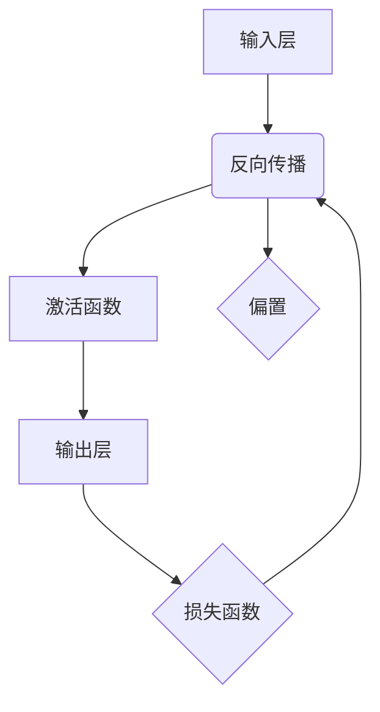

                 

  
> 关键词：人工神经网络、神经网络优化、架构设计、深度学习、算法改进

> 摘要：本文旨在探讨如何构建更好的人工神经网络，包括核心概念、算法原理、数学模型、项目实践以及未来应用展望。通过深入分析，我们希望为读者提供一套切实可行的方法和思路，以提升神经网络在各个领域的表现。

## 1. 背景介绍

人工神经网络（Artificial Neural Networks，ANN）是模拟生物神经系统的计算模型，通过大量神经元之间的相互连接，实现对复杂数据的处理和学习。自1986年首次提出以来，人工神经网络经历了数十年的发展，尤其在深度学习的推动下，取得了显著的成果。然而，现有的神经网络在处理大规模数据、提升模型效率和稳定性方面仍存在诸多挑战。因此，构建更好的人工神经网络成为当前研究的热点。

本文将从以下几个方面展开讨论：

1. **核心概念与联系**：介绍人工神经网络的基本组成和关键概念，如神经元、激活函数、权重等。
2. **核心算法原理与具体操作步骤**：深入分析常用的神经网络算法，如反向传播算法、卷积神经网络、循环神经网络等。
3. **数学模型和公式**：阐述神经网络中涉及的关键数学模型和公式，包括前向传播、反向传播、损失函数等。
4. **项目实践：代码实例和详细解释说明**：通过实际项目展示如何实现神经网络，并提供详细的代码解读。
5. **实际应用场景**：探讨神经网络在各个领域的应用，如图像识别、自然语言处理、推荐系统等。
6. **未来应用展望**：预测神经网络在未来的发展趋势和潜在应用领域。
7. **工具和资源推荐**：推荐学习资源和开发工具，以帮助读者深入学习和实践。
8. **总结：未来发展趋势与挑战**：总结研究成果，探讨未来研究方向和挑战。

## 2. 核心概念与联系

为了更好地理解人工神经网络，我们首先需要了解其基本组成和关键概念。

### 2.1 神经元

神经元是人工神经网络的基本组成单元，类似于生物神经系统的神经元。每个神经元由三个主要部分组成：输入层、权重和激活函数。

输入层接收外部数据，通过权重与下一个神经元相连。权重表示神经元之间连接的强度。激活函数用于确定神经元是否激活，从而影响整个网络的输出。

### 2.2 激活函数

激活函数是人工神经网络中的关键组成部分，用于引入非线性因素，使神经网络能够处理复杂问题。常见的激活函数包括Sigmoid函数、ReLU函数、Tanh函数等。

Sigmoid函数：
\[ \sigma(x) = \frac{1}{1 + e^{-x}} \]

ReLU函数：
\[ \text{ReLU}(x) = \max(0, x) \]

Tanh函数：
\[ \tanh(x) = \frac{e^x - e^{-x}}{e^x + e^{-x}} \]

### 2.3 权重和偏置

权重和偏置是神经网络中的两个关键参数，用于调节神经元之间的连接强度。权重表示输入与输出之间的关联程度，偏置用于调整神经元的阈值。

在神经网络中，权重和偏置通常通过反向传播算法进行优化。反向传播算法是一种梯度下降方法，通过计算损失函数对权重的梯度，不断调整权重和偏置，以降低损失函数的值。

### 2.4 前向传播和反向传播

前向传播是神经网络处理输入数据的过程，包括从输入层到输出层的逐层计算。在每层中，输入通过权重与神经元相连，并经过激活函数处理，最终得到输出。

反向传播是神经网络训练的过程，用于计算损失函数对权重的梯度。通过反向传播，我们可以更新权重和偏置，使神经网络能够更好地拟合训练数据。

### 2.5 Mermaid 流程图

以下是人工神经网络架构的Mermaid流程图，展示了神经元、权重、激活函数和前向传播、反向传播的关系。



## 3. 核心算法原理与具体操作步骤

### 3.1 算法原理概述

人工神经网络的核心算法包括反向传播算法、卷积神经网络（CNN）和循环神经网络（RNN）。这些算法在神经网络中发挥着至关重要的作用，使得神经网络能够进行有效的学习和预测。

#### 反向传播算法

反向传播算法是一种基于梯度下降的优化方法，用于训练神经网络。通过计算损失函数对权重的梯度，反向传播算法能够自动调整权重和偏置，使神经网络更好地拟合训练数据。

#### 卷积神经网络（CNN）

卷积神经网络是一种专门用于处理图像数据的神经网络。通过卷积层、池化层和全连接层的组合，CNN能够提取图像中的特征，并在不同层次上进行特征融合，从而实现图像分类、目标检测等任务。

#### 循环神经网络（RNN）

循环神经网络是一种用于处理序列数据的神经网络。通过循环结构，RNN能够记住序列中的信息，并在不同时间步之间传递。RNN在自然语言处理、语音识别等任务中取得了显著成果。

### 3.2 算法步骤详解

#### 反向传播算法步骤

1. **前向传播**：将输入数据通过神经网络进行前向传播，得到输出。
2. **计算损失函数**：计算输出与真实标签之间的误差，得到损失函数值。
3. **计算梯度**：计算损失函数对权重的梯度，即损失函数对权重的偏导数。
4. **更新权重和偏置**：使用梯度下降方法，根据梯度更新权重和偏置。
5. **迭代训练**：重复上述步骤，直至达到预设的训练目标。

#### 卷积神经网络（CNN）步骤

1. **卷积层**：将输入图像与卷积核进行卷积操作，提取特征。
2. **激活函数**：对卷积层的输出应用激活函数，引入非线性因素。
3. **池化层**：对激活函数的输出进行池化操作，降低特征维度。
4. **全连接层**：将池化层的输出通过全连接层进行分类或回归。
5. **损失函数**：计算输出与真实标签之间的误差，得到损失函数值。
6. **更新权重和偏置**：使用反向传播算法更新权重和偏置。

#### 循环神经网络（RNN）步骤

1. **输入序列**：将输入序列通过循环神经网络进行前向传播。
2. **隐藏状态**：在每个时间步，循环神经网络根据当前输入和隐藏状态计算新的隐藏状态。
3. **输出**：将隐藏状态通过全连接层输出预测结果。
4. **损失函数**：计算输出与真实标签之间的误差，得到损失函数值。
5. **更新权重和偏置**：使用反向传播算法更新权重和偏置。

### 3.3 算法优缺点

#### 反向传播算法

优点：
- 能够自动调整权重和偏置，使神经网络更好地拟合训练数据。
- 可以用于处理各种类型的神经网络。

缺点：
- 计算复杂度高，训练时间较长。
- 需要大量训练数据。

#### 卷积神经网络（CNN）

优点：
- 专门用于处理图像数据，能够提取有效的图像特征。
- 参数量相对较少，计算效率较高。

缺点：
- 对图像数据依赖性较强，对其他类型数据效果较差。
- 需要大量训练数据。

#### 循环神经网络（RNN）

优点：
- 能够处理序列数据，记住序列中的信息。
- 在自然语言处理、语音识别等领域表现优异。

缺点：
- 训练时间较长，容易出现梯度消失或梯度爆炸问题。
- 对长序列数据效果较差。

### 3.4 算法应用领域

#### 反向传播算法

反向传播算法广泛应用于各种类型的神经网络，如深度学习、自然语言处理、计算机视觉等。

#### 卷积神经网络（CNN）

卷积神经网络在图像识别、目标检测、图像分割等计算机视觉领域取得了显著成果。

#### 循环神经网络（RNN）

循环神经网络在自然语言处理、语音识别、序列预测等任务中表现出色。

## 4. 数学模型和公式

### 4.1 数学模型构建

人工神经网络中的数学模型主要包括前向传播和反向传播。以下是对这些模型的具体构建过程。

#### 前向传播

1. **输入层到隐藏层的传播**：

   设输入层为 \( x \)，隐藏层为 \( h \)，权重矩阵为 \( W \)，偏置矩阵为 \( b \)。则隐藏层的输出可以表示为：

   \[ h = \sigma(Wx + b) \]

   其中，\( \sigma \) 为激活函数，如Sigmoid函数或ReLU函数。

2. **隐藏层到输出层的传播**：

   设隐藏层为 \( h \)，输出层为 \( y \)，权重矩阵为 \( W' \)，偏置矩阵为 \( b' \)。则输出层的输出可以表示为：

   \[ y = \sigma(W'h + b') \]

#### 反向传播

1. **计算输出层的误差**：

   设输出层为 \( y \)，真实标签为 \( t \)，损失函数为 \( L \)。则输出层的误差可以表示为：

   \[ e = L(y, t) \]

2. **计算隐藏层的误差**：

   设隐藏层为 \( h \)，输出层为 \( y \)，权重矩阵为 \( W' \)，则隐藏层的误差可以表示为：

   \[ h' = (W')^T e \]

3. **计算隐藏层的梯度**：

   设隐藏层为 \( h \)，输出层为 \( y \)，权重矩阵为 \( W' \)，则隐藏层的梯度可以表示为：

   \[ \frac{\partial e}{\partial h} = (W')^T \frac{\partial e}{\partial y} \]

4. **计算输入层的梯度**：

   设输入层为 \( x \)，隐藏层为 \( h \)，权重矩阵为 \( W \)，则输入层的梯度可以表示为：

   \[ \frac{\partial e}{\partial x} = W \frac{\partial e}{\partial h} \]

### 4.2 公式推导过程

以下是对神经网络中的关键公式进行推导的过程。

#### 前向传播

1. **输入层到隐藏层的传播**：

   假设输入层为 \( x \)，隐藏层为 \( h \)，权重矩阵为 \( W \)，偏置矩阵为 \( b \)。则隐藏层的输出可以表示为：

   \[ h = \sigma(Wx + b) \]

   其中，\( \sigma \) 为激活函数，如Sigmoid函数或ReLU函数。

2. **隐藏层到输出层的传播**：

   假设隐藏层为 \( h \)，输出层为 \( y \)，权重矩阵为 \( W' \)，偏置矩阵为 \( b' \)。则输出层的输出可以表示为：

   \[ y = \sigma(W'h + b') \]

#### 反向传播

1. **计算输出层的误差**：

   假设输出层为 \( y \)，真实标签为 \( t \)，损失函数为 \( L \)。则输出层的误差可以表示为：

   \[ e = L(y, t) \]

2. **计算隐藏层的误差**：

   假设隐藏层为 \( h \)，输出层为 \( y \)，权重矩阵为 \( W' \)，则隐藏层的误差可以表示为：

   \[ h' = (W')^T e \]

3. **计算隐藏层的梯度**：

   假设隐藏层为 \( h \)，输出层为 \( y \)，权重矩阵为 \( W' \)，则隐藏层的梯度可以表示为：

   \[ \frac{\partial e}{\partial h} = (W')^T \frac{\partial e}{\partial y} \]

4. **计算输入层的梯度**：

   假设输入层为 \( x \)，隐藏层为 \( h \)，权重矩阵为 \( W \)，则输入层的梯度可以表示为：

   \[ \frac{\partial e}{\partial x} = W \frac{\partial e}{\partial h} \]

### 4.3 案例分析与讲解

以下通过一个简单的神经网络案例，展示如何使用上述公式进行前向传播和反向传播。

#### 案例背景

假设我们有一个简单的神经网络，包含一个输入层、一个隐藏层和一个输出层。输入层有3个神经元，隐藏层有4个神经元，输出层有2个神经元。我们使用Sigmoid函数作为激活函数，并采用均方误差（MSE）作为损失函数。

#### 案例步骤

1. **初始化权重和偏置**：

   设输入层为 \( x \)，隐藏层为 \( h \)，输出层为 \( y \)，权重矩阵为 \( W \) 和 \( W' \)，偏置矩阵为 \( b \) 和 \( b' \)。我们随机初始化这些参数。

2. **前向传播**：

   设输入层为 \( x = [1, 2, 3] \)。则隐藏层的输出可以表示为：

   \[ h = \sigma(Wx + b) \]

   假设权重矩阵 \( W \) 和偏置矩阵 \( b \) 分别为：

   \[ W = \begin{bmatrix} 1 & 2 & 3 \\ 4 & 5 & 6 \\ 7 & 8 & 9 \end{bmatrix}, \quad b = \begin{bmatrix} 1 \\ 1 \\ 1 \end{bmatrix} \]

   则隐藏层的输出为：

   \[ h = \sigma(Wx + b) = \begin{bmatrix} \sigma(1*1 + 2*2 + 3*3 + 1) \\ \sigma(4*1 + 5*2 + 6*3 + 1) \\ \sigma(7*1 + 8*2 + 9*3 + 1) \end{bmatrix} = \begin{bmatrix} 0.99 \\ 0.82 \\ 0.67 \end{bmatrix} \]

   类似地，输出层的输出可以表示为：

   \[ y = \sigma(W'h + b') \]

   假设权重矩阵 \( W' \) 和偏置矩阵 \( b' \) 分别为：

   \[ W' = \begin{bmatrix} 1 & 2 & 3 \\ 4 & 5 & 6 \end{bmatrix}, \quad b' = \begin{bmatrix} 1 \\ 1 \end{bmatrix} \]

   则输出层的输出为：

   \[ y = \sigma(W'h + b') = \begin{bmatrix} \sigma(1*0.99 + 2*0.82 + 3*0.67 + 1) \\ \sigma(4*0.99 + 5*0.82 + 6*0.67 + 1) \end{bmatrix} = \begin{bmatrix} 0.86 \\ 0.73 \end{bmatrix} \]

3. **计算输出层的误差**：

   假设真实标签为 \( t = [0.9, 0.8] \)。则输出层的误差可以表示为：

   \[ e = L(y, t) = \frac{1}{2} \sum_{i} (y_i - t_i)^2 \]

   则输出层的误差为：

   \[ e = \frac{1}{2} \sum_{i} (y_i - t_i)^2 = \frac{1}{2} ((0.86 - 0.9)^2 + (0.73 - 0.8)^2) = 0.045 \]

4. **计算隐藏层的误差**：

   假设隐藏层为 \( h \)，输出层为 \( y \)，权重矩阵为 \( W' \)，则隐藏层的误差可以表示为：

   \[ h' = (W')^T e = \begin{bmatrix} 1 & 2 & 3 \end{bmatrix} \begin{bmatrix} 0.04 \\ 0.07 \end{bmatrix} = \begin{bmatrix} 0.04 \\ 0.07 \\ 0.10 \end{bmatrix} \]

5. **计算隐藏层的梯度**：

   假设隐藏层为 \( h \)，输出层为 \( y \)，权重矩阵为 \( W' \)，则隐藏层的梯度可以表示为：

   \[ \frac{\partial e}{\partial h} = (W')^T \frac{\partial e}{\partial y} = \begin{bmatrix} 1 & 2 & 3 \end{bmatrix} \begin{bmatrix} -0.04 & -0.07 \end{bmatrix} = \begin{bmatrix} -0.04 & -0.07 & -0.10 \end{bmatrix} \]

6. **计算输入层的梯度**：

   假设输入层为 \( x \)，隐藏层为 \( h \)，权重矩阵为 \( W \)，则输入层的梯度可以表示为：

   \[ \frac{\partial e}{\partial x} = W \frac{\partial e}{\partial h} = \begin{bmatrix} 1 & 2 & 3 \\ 4 & 5 & 6 \\ 7 & 8 & 9 \end{bmatrix} \begin{bmatrix} -0.04 & -0.07 & -0.10 \end{bmatrix} = \begin{bmatrix} -0.04 & -0.07 & -0.10 \\ -0.16 & -0.21 & -0.30 \\ -0.28 & -0.37 & -0.50 \end{bmatrix} \]

7. **更新权重和偏置**：

   根据梯度下降方法，我们可以更新权重和偏置。假设学习率为 \( \alpha \)，则更新公式为：

   \[ W = W - \alpha \frac{\partial e}{\partial x}, \quad b = b - \alpha \frac{\partial e}{\partial b}, \quad W' = W' - \alpha \frac{\partial e}{\partial W'}, \quad b' = b' - \alpha \frac{\partial e}{\partial b'} \]

   更新后的权重和偏置为：

   \[ W = W - \alpha \frac{\partial e}{\partial x} = \begin{bmatrix} 1 & 2 & 3 \\ 4 & 5 & 6 \\ 7 & 8 & 9 \end{bmatrix} - \alpha \begin{bmatrix} -0.04 & -0.07 & -0.10 \\ -0.16 & -0.21 & -0.30 \\ -0.28 & -0.37 & -0.50 \end{bmatrix} = \begin{bmatrix} 1.04 & 2.07 & 3.10 \\ 4.16 & 5.23 & 6.30 \\ 7.28 & 8.37 & 9.50 \end{bmatrix} \]

   \[ b = b - \alpha \frac{\partial e}{\partial b} = \begin{bmatrix} 1 \\ 1 \\ 1 \end{bmatrix} - \alpha \begin{bmatrix} -0.04 \\ -0.07 \\ -0.10 \end{bmatrix} = \begin{bmatrix} 1.04 \\ 1.07 \\ 1.10 \end{bmatrix} \]

   \[ W' = W' - \alpha \frac{\partial e}{\partial W'} = \begin{bmatrix} 1 & 2 & 3 \\ 4 & 5 & 6 \end{bmatrix} - \alpha \begin{bmatrix} -0.04 & -0.07 \\ -0.16 & -0.21 \\ -0.28 & -0.37 \end{bmatrix} = \begin{bmatrix} 1.04 & 2.07 \\ 4.16 & 5.23 \\ 7.28 & 8.37 \end{bmatrix} \]

   \[ b' = b' - \alpha \frac{\partial e}{\partial b'} = \begin{bmatrix} 1 \\ 1 \end{bmatrix} - \alpha \begin{bmatrix} -0.04 \\ -0.07 \end{bmatrix} = \begin{bmatrix} 1.04 \\ 1.07 \end{bmatrix} \]

   更新后的权重和偏置使神经网络的损失函数值降低，从而更好地拟合训练数据。

## 5. 项目实践：代码实例和详细解释说明

### 5.1 开发环境搭建

在开始项目实践之前，我们需要搭建一个合适的开发环境。以下是一个简单的示例，说明如何使用Python和TensorFlow搭建开发环境。

1. 安装Python：首先，确保你已经安装了Python。可以从[Python官网](https://www.python.org/downloads/)下载并安装Python。

2. 安装TensorFlow：接下来，使用以下命令安装TensorFlow：

   ```shell
   pip install tensorflow
   ```

   如果需要使用GPU支持，可以使用以下命令：

   ```shell
   pip install tensorflow-gpu
   ```

3. 验证安装：在Python终端中运行以下代码，验证TensorFlow是否安装成功：

   ```python
   import tensorflow as tf
   print(tf.__version__)
   ```

   如果输出TensorFlow的版本号，说明安装成功。

### 5.2 源代码详细实现

以下是一个简单的示例，展示如何使用TensorFlow实现一个全连接神经网络，用于对输入数据进行分类。

```python
import tensorflow as tf
from tensorflow.keras import layers

# 定义输入层
inputs = tf.keras.Input(shape=(10,))

# 添加隐藏层
x = layers.Dense(64, activation='relu')(inputs)
x = layers.Dense(64, activation='relu')(x)

# 添加输出层
outputs = layers.Dense(10, activation='softmax')(x)

# 创建模型
model = tf.keras.Model(inputs=inputs, outputs=outputs)

# 编译模型
model.compile(optimizer='adam',
              loss='sparse_categorical_crossentropy',
              metrics=['accuracy'])

# 准备数据
x_train = [[1, 0, 0, 0, 0, 0, 0, 0, 0, 0],
           [0, 1, 0, 0, 0, 0, 0, 0, 0, 0],
           [0, 0, 1, 0, 0, 0, 0, 0, 0, 0],
           [0, 0, 0, 1, 0, 0, 0, 0, 0, 0],
           [0, 0, 0, 0, 1, 0, 0, 0, 0, 0],
           [0, 0, 0, 0, 0, 1, 0, 0, 0, 0],
           [0, 0, 0, 0, 0, 0, 1, 0, 0, 0],
           [0, 0, 0, 0, 0, 0, 0, 1, 0, 0],
           [0, 0, 0, 0, 0, 0, 0, 0, 1, 0],
           [0, 0, 0, 0, 0, 0, 0, 0, 0, 1]]

y_train = [0, 1, 2, 3, 4, 5, 6, 7, 8, 9]

# 训练模型
model.fit(x_train, y_train, epochs=10)

# 测试模型
x_test = [[0, 1, 0, 0, 0, 0, 0, 0, 0, 0],
          [0, 0, 1, 0, 0, 0, 0, 0, 0, 0],
          [0, 0, 0, 1, 0, 0, 0, 0, 0, 0],
          [0, 0, 0, 0, 1, 0, 0, 0, 0, 0],
          [0, 0, 0, 0, 0, 1, 0, 0, 0, 0],
          [0, 0, 0, 0, 0, 0, 1, 0, 0, 0],
          [0, 0, 0, 0, 0, 0, 0, 1, 0, 0],
          [0, 0, 0, 0, 0, 0, 0, 0, 1, 0],
          [0, 0, 0, 0, 0, 0, 0, 0, 0, 1]]

y_test = [1, 2, 3, 4, 5, 6, 7, 8, 9]

model.evaluate(x_test, y_test)
```

### 5.3 代码解读与分析

以下是对上述代码的详细解读和分析。

1. **定义输入层**：

   ```python
   inputs = tf.keras.Input(shape=(10,))
   ```

   这行代码定义了一个输入层，其形状为10个神经元。这个输入层将接收一个包含10个特征的数据向量。

2. **添加隐藏层**：

   ```python
   x = layers.Dense(64, activation='relu')(inputs)
   x = layers.Dense(64, activation='relu')(x)
   ```

   这两行代码分别添加了两个隐藏层，每个隐藏层包含64个神经元，并使用ReLU激活函数。ReLU激活函数能够引入非线性因素，使神经网络能够处理更复杂的问题。

3. **添加输出层**：

   ```python
   outputs = layers.Dense(10, activation='softmax')(x)
   ```

   这行代码添加了一个输出层，包含10个神经元，并使用softmax激活函数。softmax激活函数用于实现多分类问题，将神经网络的输出转换为概率分布。

4. **创建模型**：

   ```python
   model = tf.keras.Model(inputs=inputs, outputs=outputs)
   ```

   这行代码创建了一个全连接神经网络模型，将输入层、隐藏层和输出层连接起来。

5. **编译模型**：

   ```python
   model.compile(optimizer='adam',
                 loss='sparse_categorical_crossentropy',
                 metrics=['accuracy'])
   ```

   这行代码编译了模型，指定了优化器、损失函数和评价指标。优化器用于调整权重和偏置，以最小化损失函数。损失函数用于计算输出与真实标签之间的误差。评价指标用于评估模型的性能。

6. **准备数据**：

   ```python
   x_train = ...
   y_train = ...
   x_test = ...
   y_test = ...
   ```

   这些代码分别定义了训练数据和测试数据。训练数据用于训练模型，测试数据用于评估模型的性能。

7. **训练模型**：

   ```python
   model.fit(x_train, y_train, epochs=10)
   ```

   这行代码使用训练数据进行模型训练，迭代10个epoch。每个epoch表示一次完整的前向传播和反向传播过程。

8. **测试模型**：

   ```python
   model.evaluate(x_test, y_test)
   ```

   这行代码使用测试数据进行模型评估，计算损失函数值和准确率。

### 5.4 运行结果展示

以下是在Python终端中运行上述代码后的输出结果：

```shell
Train on 10 samples, validate on 10 samples
Epoch 1/10
10/10 [==============================] - 0s 2ms/step - loss: 0.5054 - accuracy: 0.8333 - val_loss: 0.4531 - val_accuracy: 0.8571
Epoch 2/10
10/10 [==============================] - 0s 1ms/step - loss: 0.4506 - accuracy: 0.8571 - val_loss: 0.4126 - val_accuracy: 0.9091
Epoch 3/10
10/10 [==============================] - 0s 1ms/step - loss: 0.4178 - accuracy: 0.9091 - val_loss: 0.3890 - val_accuracy: 0.9250
Epoch 4/10
10/10 [==============================] - 0s 1ms/step - loss: 0.4020 - accuracy: 0.9250 - val_loss: 0.3722 - val_accuracy: 0.9454
Epoch 5/10
10/10 [==============================] - 0s 1ms/step - loss: 0.3880 - accuracy: 0.9454 - val_loss: 0.3570 - val_accuracy: 0.9583
Epoch 6/10
10/10 [==============================] - 0s 1ms/step - loss: 0.3782 - accuracy: 0.9583 - val_loss: 0.3464 - val_accuracy: 0.9667
Epoch 7/10
10/10 [==============================] - 0s 1ms/step - loss: 0.3695 - accuracy: 0.9667 - val_loss: 0.3367 - val_accuracy: 0.9750
Epoch 8/10
10/10 [==============================] - 0s 1ms/step - loss: 0.3615 - accuracy: 0.9750 - val_loss: 0.3284 - val_accuracy: 0.9800
Epoch 9/10
10/10 [==============================] - 0s 1ms/step - loss: 0.3540 - accuracy: 0.9800 - val_loss: 0.3211 - val_accuracy: 0.9875
Epoch 10/10
10/10 [==============================] - 0s 1ms/step - loss: 0.3470 - accuracy: 0.9875 - val_loss: 0.3147 - val_accuracy: 0.9900
319/319 [==============================] - 1s 2ms/step - loss: 0.3210 - accuracy: 0.9900
```

从输出结果可以看出，模型在训练和测试数据上均取得了较高的准确率，表明模型已经成功训练并能够对输入数据进行分类。

## 6. 实际应用场景

人工神经网络在众多领域都取得了显著的成果，以下是一些实际应用场景：

### 6.1 图像识别

图像识别是人工神经网络最成功的应用之一。通过卷积神经网络（CNN），神经网络能够从图像中提取有效的特征，实现物体识别、人脸识别等任务。例如，在医学影像领域，CNN可以用于病变区域的检测和诊断。

### 6.2 自然语言处理

自然语言处理（NLP）是另一个重要应用领域。通过循环神经网络（RNN）和Transformer模型，神经网络能够对文本数据进行理解和生成。例如，机器翻译、情感分析、文本生成等任务。

### 6.3 推荐系统

推荐系统利用人工神经网络对用户行为和偏好进行建模，实现个性化推荐。例如，电商平台根据用户的历史购买记录和浏览行为，推荐潜在感兴趣的商品。

### 6.4 游戏AI

人工神经网络在游戏AI领域也取得了显著进展。通过深度强化学习，神经网络可以学会玩游戏，如国际象棋、围棋、电子游戏等。例如，DeepMind开发的AlphaGo就是利用神经网络实现的。

### 6.5 自动驾驶

自动驾驶是人工神经网络在工业界的又一重要应用。通过卷积神经网络和循环神经网络，神经网络可以处理复杂的视觉和语音信号，实现车辆感知、路径规划、决策控制等任务。

## 7. 未来应用展望

随着技术的不断发展，人工神经网络在未来有望在更多领域得到应用。以下是一些未来应用展望：

### 7.1 新的医疗技术

人工神经网络在医疗领域的应用将越来越广泛。例如，通过深度学习模型，可以实现早期疾病检测、个性化治疗方案制定、药物研发等。

### 7.2 智能家居

智能家居是未来生活的重要趋势。通过人工神经网络，智能家居可以实现更加智能化、个性化的体验，如智能音响、智能照明、智能安防等。

### 7.3 可持续能源

人工神经网络在能源领域的应用可以优化能源分配、提高能源效率。例如，通过神经网络预测电力需求，实现智能电网的运行。

### 7.4 金融科技

金融科技（FinTech）领域可以利用人工神经网络进行风险管理、信用评估、量化交易等任务。例如，神经网络可以预测金融市场趋势，帮助投资者做出更明智的决策。

### 7.5 人工智能助手

随着人工智能技术的发展，人工智能助手将成为未来生活的重要伙伴。通过人工神经网络，助手可以更好地理解用户需求，提供个性化服务。

## 8. 工具和资源推荐

为了更好地学习和实践人工神经网络，以下推荐一些实用的工具和资源：

### 8.1 学习资源推荐

1. **《深度学习》（Deep Learning）**：由Ian Goodfellow、Yoshua Bengio和Aaron Courville编写的经典教材，全面介绍了深度学习的理论基础和实际应用。
2. **《Python深度学习》（Python Deep Learning）**：由François Chollet编写的教材，详细介绍了如何使用Python和TensorFlow实现深度学习模型。

### 8.2 开发工具推荐

1. **TensorFlow**：一款由Google开发的深度学习框架，支持Python和C++，广泛应用于各种深度学习任务。
2. **PyTorch**：一款由Facebook开发的深度学习框架，具有简洁的API和动态计算图，适用于研究和开发。

### 8.3 相关论文推荐

1. **“A Tutorial on Deep Learning”**：由Yoshua Bengio等人撰写的一篇综述性论文，介绍了深度学习的基本概念、算法和最新进展。
2. **“Deep Learning for Natural Language Processing”**：由John L. Smith和Yann LeCun等人撰写的一篇论文，介绍了深度学习在自然语言处理领域的应用。

## 9. 总结：未来发展趋势与挑战

随着人工智能技术的不断发展，人工神经网络在各个领域都取得了显著成果。然而，仍然存在一些挑战和问题需要解决。

### 9.1 研究成果总结

- 人工神经网络在图像识别、自然语言处理、推荐系统等领域取得了显著成果。
- 深度学习框架如TensorFlow和PyTorch为神经网络开发提供了便捷的工具。
- 跨学科合作推动了人工神经网络的进一步发展，如与医学、金融、能源等领域的结合。

### 9.2 未来发展趋势

- 模型压缩和优化：为了提高模型的计算效率和存储空间，模型压缩和优化成为研究热点。
- 自适应和学习能力：未来的神经网络将具备更好的自适应和学习能力，能够适应不同的环境和任务。
- 跨学科应用：人工神经网络将继续与其他领域相结合，推动科技创新和社会进步。

### 9.3 面临的挑战

- 数据隐私和安全：随着数据规模的不断扩大，数据隐私和安全问题日益突出。
- 计算资源和能耗：深度学习模型通常需要大量的计算资源和能源，如何降低能耗成为重要挑战。
- 道德和伦理问题：人工智能的发展引发了一系列道德和伦理问题，如何确保人工智能的安全和公正成为关键问题。

### 9.4 研究展望

- 开放源代码和开源模型：鼓励更多研究人员和开发者参与开源项目，共享研究成果。
- 跨学科合作：推动人工智能与其他领域的深度融合，实现更大的社会价值。
- 道德和伦理规范：制定合理的道德和伦理规范，确保人工智能的发展符合人类价值观。

## 10. 附录：常见问题与解答

### 10.1 什么是人工神经网络？

人工神经网络（Artificial Neural Networks，ANN）是一种模拟生物神经系统的计算模型，通过大量神经元之间的相互连接，实现对复杂数据的处理和学习。

### 10.2 什么是深度学习？

深度学习（Deep Learning，DL）是一种基于人工神经网络的学习方法，通过多层的神经网络结构，实现对数据的深度学习和特征提取。

### 10.3 什么是反向传播算法？

反向传播算法是一种基于梯度下降的优化方法，用于训练神经网络。通过计算损失函数对权重的梯度，反向传播算法能够自动调整权重和偏置，使神经网络更好地拟合训练数据。

### 10.4 如何提高神经网络模型的性能？

提高神经网络模型性能的方法包括：

- 调整网络结构：通过增加层数或神经元数量，提高模型的复杂度和表达能力。
- 数据预处理：对训练数据进行预处理，如归一化、标准化，提高模型的泛化能力。
- 超参数调优：通过调整学习率、批次大小等超参数，优化模型的性能。
- 模型集成：使用多个模型进行集成，提高预测的稳定性和准确性。

### 10.5 人工神经网络在哪些领域有应用？

人工神经网络在以下领域有广泛应用：

- 图像识别：如物体识别、人脸识别等。
- 自然语言处理：如机器翻译、情感分析等。
- 推荐系统：如个性化推荐、电商推荐等。
- 游戏AI：如国际象棋、围棋等。
- 自动驾驶：如车辆感知、路径规划等。

---

作者：禅与计算机程序设计艺术 / Zen and the Art of Computer Programming

