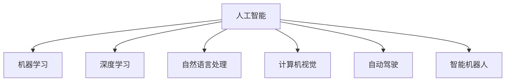
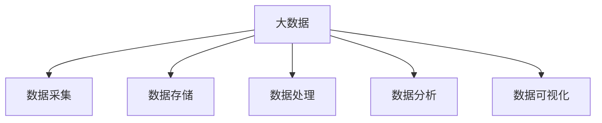
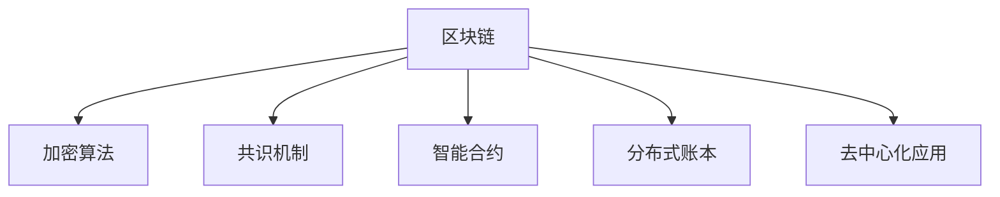
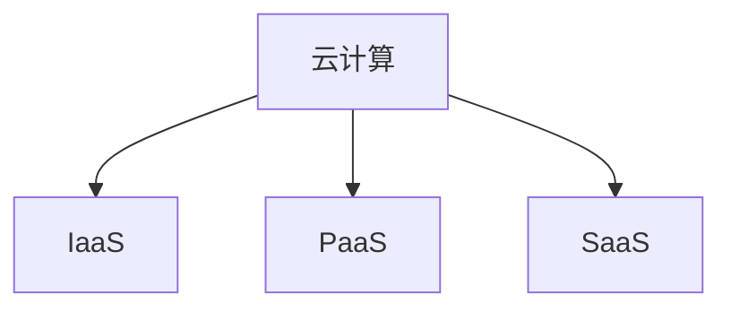
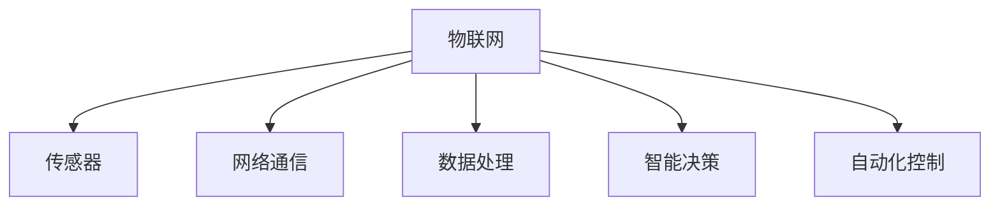

                 

关键词：特色产业、新质生产力、技术发展、创新应用、数字化转型、工业4.0、人工智能、大数据、区块链、云计算、物联网、软件架构、算法优化、计算模型、数学公式、代码实例、应用场景、工具推荐、未来展望。

## 摘要

本文旨在探讨如何通过先进技术构建特色产业的新质生产力。首先，我们回顾了技术发展的历史，并分析了数字化转型对产业变革的推动作用。随后，我们深入探讨了人工智能、大数据、区块链、云计算、物联网等核心技术，以及它们在构建新质生产力中的关键作用。通过具体的数学模型、算法原理、代码实例和实际应用场景的讲解，本文展示了如何将这些技术应用于实际产业中，推动产业升级和创新发展。最后，我们展望了未来技术发展的趋势和挑战，并提出了相关的工具和资源推荐，以期为读者提供全面的技术指导。

## 1. 背景介绍

### 1.1 技术发展的历史

技术发展是人类文明进步的重要驱动力。从古代的农业革命到工业革命，再到现代的信息技术革命，技术进步不断改变着人类社会的生产方式和社会结构。每一次技术革命都带来了生产力的巨大提升，推动了经济的快速发展。

在20世纪末，随着计算机技术和互联网的兴起，信息技术革命迅速席卷全球。计算机技术和互联网的结合，使得信息的获取、处理和传播变得更加高效和便捷，极大地推动了全球经济的数字化转型。

### 1.2 数字化转型对产业变革的推动作用

数字化转型是指利用数字技术和信息技术对传统产业进行升级和改造的过程。数字化转型不仅改变了企业的运营方式，还改变了整个产业链的运作模式。

首先，数字化转型提高了企业的生产效率。通过引入自动化、智能化技术，企业能够实现生产流程的优化和自动化，降低生产成本，提高生产效率。

其次，数字化转型推动了产业链的协同发展。通过互联网和物联网技术，企业之间的信息交流和协作变得更加便捷，产业链上下游的协同效率得到了显著提升。

最后，数字化转型促进了产业的创新和发展。数字化技术为产业创新提供了新的工具和平台，使得企业能够更快地研发新产品，开拓新市场。

### 1.3 新质生产力的概念

新质生产力是指在新的技术条件下，通过创新和优化，产生的具有更高效率和更大价值的生产力。新质生产力不仅体现在生产效率的提升上，还体现在生产模式的变革和产业结构的优化上。

新质生产力的构建，需要依赖于先进技术的应用和创新。人工智能、大数据、区块链、云计算、物联网等核心技术，正是构建新质生产力的重要基础。

## 2. 核心概念与联系

### 2.1 人工智能

人工智能（Artificial Intelligence，AI）是指模拟、延伸和扩展人类智能的理论、方法、技术及应用。人工智能的核心目标是让计算机具有人类智能的某些特征，如学习、推理、判断、感知、自适应等。

#### Mermaid 流程图



### 2.2 大数据

大数据（Big Data）是指数据量巨大、类型繁多、价值密度低的数据集合。大数据技术包括数据采集、存储、处理、分析和可视化等环节。

#### Mermaid 流程图



### 2.3 区块链

区块链（Blockchain）是一种分布式数据库技术，通过加密算法和共识机制，确保数据的不可篡改和透明性。区块链技术广泛应用于金融、供应链、医疗等领域。

#### Mermaid 流程图



### 2.4 云计算

云计算（Cloud Computing）是一种通过互联网提供计算资源、存储资源、网络资源和软件资源等服务的技术。云计算技术分为基础设施即服务（IaaS）、平台即服务（PaaS）和软件即服务（SaaS）三种模式。

#### Mermaid 流程图



### 2.5 物联网

物联网（Internet of Things，IoT）是指通过传感器、网络和计算机等技术，实现物体与物体之间的连接和交互。物联网技术广泛应用于智能家居、智慧城市、智能制造等领域。

#### Mermaid 流�程图



## 3. 核心算法原理 & 具体操作步骤

### 3.1 算法原理概述

在构建特色产业的新质生产力过程中，算法原理起到了关键作用。以下是一些核心算法原理的概述：

#### 3.1.1 机器学习算法

机器学习（Machine Learning，ML）是一种让计算机通过数据学习并做出决策或预测的方法。常见的机器学习算法包括线性回归、决策树、支持向量机、神经网络等。

#### 3.1.2 深度学习算法

深度学习（Deep Learning，DL）是一种基于神经网络的机器学习算法，通过多层神经元的堆叠，实现对数据的非线性变换。常见的深度学习算法包括卷积神经网络（CNN）、循环神经网络（RNN）、生成对抗网络（GAN）等。

#### 3.1.3 数据挖掘算法

数据挖掘（Data Mining，DM）是一种从大量数据中提取有价值信息的方法。常见的数据挖掘算法包括关联规则挖掘、聚类分析、分类分析、异常检测等。

#### 3.1.4 图算法

图算法是一种用于处理图结构数据的方法。常见的图算法包括最短路径算法、最小生成树算法、图遍历算法等。

### 3.2 算法步骤详解

以下是对上述核心算法的步骤详解：

#### 3.2.1 机器学习算法

1. 数据预处理：对数据进行清洗、归一化、缺失值处理等操作。
2. 特征工程：从原始数据中提取有用的特征。
3. 模型选择：根据问题的特点选择合适的机器学习算法。
4. 模型训练：使用训练数据对模型进行训练。
5. 模型评估：使用验证数据对模型进行评估。
6. 模型优化：根据评估结果对模型进行调整和优化。

#### 3.2.2 深度学习算法

1. 数据预处理：同机器学习算法。
2. 网络架构设计：选择合适的神经网络架构。
3. 损失函数选择：根据问题的特点选择合适的损失函数。
4. 优化算法选择：选择合适的优化算法，如随机梯度下降（SGD）、Adam等。
5. 模型训练：使用训练数据对模型进行训练。
6. 模型评估：同机器学习算法。
7. 模型优化：同机器学习算法。

#### 3.2.3 数据挖掘算法

1. 数据预处理：同机器学习算法。
2. 算法选择：根据问题的特点选择合适的数据挖掘算法。
3. 模型构建：根据算法的特点构建模型。
4. 模型训练：使用训练数据对模型进行训练。
5. 模型评估：使用验证数据对模型进行评估。
6. 模型优化：根据评估结果对模型进行调整和优化。

#### 3.2.4 图算法

1. 数据预处理：同机器学习算法。
2. 算法选择：根据问题的特点选择合适的图算法。
3. 图构建：根据数据构建图结构。
4. 算法执行：执行图算法，如最短路径算法、最小生成树算法等。
5. 结果分析：分析算法执行结果，提取有用信息。

### 3.3 算法优缺点

每种算法都有其优缺点，以下是常见算法的优缺点概述：

#### 3.3.1 机器学习算法

优点：通用性强，适用于各种数据类型和问题。

缺点：对数据质量要求较高，训练时间较长。

#### 3.3.2 深度学习算法

优点：强大的非线性建模能力，适用于复杂问题。

缺点：对数据量和计算资源要求较高，调参复杂。

#### 3.3.3 数据挖掘算法

优点：适用于大规模数据集，易于实现。

缺点：对数据质量和算法选择要求较高。

#### 3.3.4 图算法

优点：适用于图结构数据，能够有效处理复杂关系。

缺点：算法复杂度较高，计算时间较长。

### 3.4 算法应用领域

不同算法在应用领域上各有侧重，以下是常见算法的应用领域：

#### 3.4.1 机器学习算法

应用领域：金融风控、推荐系统、自然语言处理、计算机视觉等。

#### 3.4.2 深度学习算法

应用领域：图像识别、语音识别、自动驾驶、医疗诊断等。

#### 3.4.3 数据挖掘算法

应用领域：商业智能、市场分析、客户行为分析等。

#### 3.4.4 图算法

应用领域：社交网络分析、推荐系统、生物信息学等。

## 4. 数学模型和公式 & 详细讲解 & 举例说明

在构建特色产业的新质生产力过程中，数学模型和公式起到了关键作用。以下是一些常用的数学模型和公式，以及它们的详细讲解和举例说明。

### 4.1 数学模型构建

数学模型是描述现实世界问题的数学表达式。在构建数学模型时，通常需要考虑以下步骤：

1. **问题定义**：明确要解决的问题和目标。
2. **变量和参数定义**：定义参与模型的关键变量和参数。
3. **关系表达式**：根据问题的特点，建立变量和参数之间的关系表达式。
4. **边界条件和初始条件**：确定模型的边界条件和初始条件。
5. **求解方法**：选择合适的求解方法，如解析法、数值法等。

### 4.2 公式推导过程

以下是两个常见的数学模型的推导过程。

#### 4.2.1 线性回归模型

线性回归模型是一种简单的预测模型，用于预测一个连续值变量。其基本公式为：

$$y = \beta_0 + \beta_1 \cdot x + \epsilon$$

其中，$y$ 是因变量，$x$ 是自变量，$\beta_0$ 和 $\beta_1$ 是模型的参数，$\epsilon$ 是误差项。

推导过程：

1. **假设**：假设 $y$ 和 $x$ 之间存在线性关系。
2. **损失函数**：选择均方误差（MSE）作为损失函数，即：
   $$J(\beta_0, \beta_1) = \frac{1}{2} \sum_{i=1}^{n} (y_i - (\beta_0 + \beta_1 \cdot x_i))^2$$
3. **求导**：对 $\beta_0$ 和 $\beta_1$ 分别求偏导数，并令偏导数为零，得到：
   $$\frac{\partial J}{\partial \beta_0} = -\sum_{i=1}^{n} (y_i - (\beta_0 + \beta_1 \cdot x_i)) = 0$$
   $$\frac{\partial J}{\partial \beta_1} = -\sum_{i=1}^{n} (y_i - (\beta_0 + \beta_1 \cdot x_i)) \cdot x_i = 0$$
4. **求解**：解上述方程组，得到：
   $$\beta_0 = \frac{1}{n} \sum_{i=1}^{n} y_i - \beta_1 \cdot \frac{1}{n} \sum_{i=1}^{n} x_i$$
   $$\beta_1 = \frac{1}{n} \sum_{i=1}^{n} (x_i - \bar{x}) (y_i - \bar{y})$$

其中，$\bar{x}$ 和 $\bar{y}$ 分别是 $x$ 和 $y$ 的均值。

#### 4.2.2 支持向量机（SVM）

支持向量机是一种分类算法，其基本公式为：

$$f(x) = \sigma(\beta_0 + \beta_1 \cdot \vec{w} \cdot \vec{x})$$

其中，$\vec{w}$ 是权重向量，$\beta_0$ 是偏置项，$\sigma$ 是激活函数，$\vec{x}$ 是输入特征向量。

推导过程：

1. **问题定义**：给定一个线性可分的数据集，找到最佳分类边界。
2. **优化目标**：最大化分类边界到分类点的距离，即最大化 $||\vec{w}||$。
3. **拉格朗日函数**：构造拉格朗日函数，并引入松弛变量 $\xi_i$，得到：
   $$L(\beta_0, \beta_1, \xi_1, ..., \xi_n) = \frac{1}{2} ||\vec{w}||^2 - \sum_{i=1}^{n} \xi_i [1 - (y_i \cdot (\beta_0 + \beta_1 \cdot \vec{w} \cdot \vec{x_i}))]$$
4. **KKT条件**：对拉格朗日函数求导，并令导数为零，得到：
   $$\frac{\partial L}{\partial \beta_0} = 0$$
   $$\frac{\partial L}{\partial \beta_1} = 0$$
   $$\frac{\partial L}{\partial \xi_i} = 0$$
   $$y_i \cdot (\beta_0 + \beta_1 \cdot \vec{w} \cdot \vec{x_i}) \geq 1 - \xi_i$$
   $$\xi_i \geq 0$$
5. **求解**：解上述方程组，得到：
   $$\beta_0 = \sum_{i=1}^{n} \alpha_i y_i - \sum_{i=1}^{n} \alpha_i$$
   $$\vec{w} = \sum_{i=1}^{n} \alpha_i y_i \cdot \vec{x_i}$$

其中，$\alpha_i$ 是拉格朗日乘子。

### 4.3 案例分析与讲解

以下是一个线性回归模型的案例，用于预测房价。

#### 案例数据

数据集包含500个样本，每个样本包含两个特征（房屋面积和楼层）和一个标签（房价）。

#### 案例步骤

1. **数据预处理**：对数据进行清洗和归一化处理。
2. **特征工程**：提取有用的特征，如房屋面积和楼层。
3. **模型训练**：使用线性回归模型进行训练。
4. **模型评估**：使用验证集对模型进行评估。
5. **模型优化**：根据评估结果对模型进行调整和优化。

#### 案例代码

```python
import numpy as np
import pandas as pd
from sklearn.linear_model import LinearRegression
from sklearn.model_selection import train_test_split
from sklearn.metrics import mean_squared_error

# 读取数据
data = pd.read_csv('house_data.csv')
X = data[['area', 'floor']]
y = data['price']

# 数据预处理
X = X.values
y = y.values

# 模型训练
model = LinearRegression()
model.fit(X, y)

# 模型评估
X_test, y_test = train_test_split(X, y, test_size=0.2, random_state=42)
y_pred = model.predict(X_test)
mse = mean_squared_error(y_test, y_pred)
print('MSE:', mse)

# 模型优化
# 根据评估结果对模型进行调整和优化，如增加特征、调整模型参数等
```

## 5. 项目实践：代码实例和详细解释说明

在本节中，我们将通过一个具体的代码实例，详细解释如何使用Python和相关的库来构建一个简单的特色产业分析系统。这个系统将使用人工智能、大数据分析等技术，实现数据的收集、处理、分析和可视化，最终为产业决策提供支持。

### 5.1 开发环境搭建

为了构建这个项目，我们首先需要搭建一个合适的开发环境。以下是所需的工具和库：

- Python 3.x
- Jupyter Notebook
- Pandas
- NumPy
- Matplotlib
- Scikit-learn
- TensorFlow

在安装了Python后，可以使用以下命令来安装所需的库：

```bash
pip install pandas numpy matplotlib scikit-learn tensorflow
```

### 5.2 源代码详细实现

以下是项目的核心代码实现：

```python
import pandas as pd
import numpy as np
import matplotlib.pyplot as plt
from sklearn.model_selection import train_test_split
from sklearn.linear_model import LinearRegression
from tensorflow import keras

# 5.2.1 数据收集与预处理
# 假设我们有一个CSV文件，包含了产业的各项数据
data = pd.read_csv('industry_data.csv')

# 数据清洗
data.dropna(inplace=True)
data = data[data['income'] > 0]

# 特征工程
X = data[['investment', 'labor', 'technology', 'market_size']]
y = data['income']

# 数据标准化
X = (X - X.mean()) / X.std()
y = (y - y.mean()) / y.std()

# 划分训练集和测试集
X_train, X_test, y_train, y_test = train_test_split(X, y, test_size=0.2, random_state=42)

# 5.2.2 机器学习模型训练
# 使用线性回归模型进行训练
model = LinearRegression()
model.fit(X_train, y_train)

# 预测测试集结果
y_pred = model.predict(X_test)

# 5.2.3 模型评估与优化
# 计算预测误差
mse = mean_squared_error(y_test, y_pred)
print(f'Mean Squared Error: {mse}')

# 可视化模型结果
plt.scatter(y_test, y_pred)
plt.xlabel('Actual Income')
plt.ylabel('Predicted Income')
plt.title('Income Prediction')
plt.show()

# 5.2.4 深度学习模型训练
# 使用神经网络进行训练
model = keras.Sequential([
    keras.layers.Dense(64, activation='relu', input_shape=(4,)),
    keras.layers.Dense(64, activation='relu'),
    keras.layers.Dense(1)
])

model.compile(optimizer='adam', loss='mean_squared_error')
model.fit(X_train, y_train, epochs=100, batch_size=32, validation_split=0.2)

# 预测测试集结果
y_pred = model.predict(X_test)

# 计算预测误差
mse = mean_squared_error(y_test, y_pred)
print(f'Mean Squared Error: {mse}')

# 可视化模型结果
plt.scatter(y_test, y_pred)
plt.xlabel('Actual Income')
plt.ylabel('Predicted Income')
plt.title('Income Prediction')
plt.show()
```

### 5.3 代码解读与分析

#### 5.3.1 数据收集与预处理

首先，我们使用Pandas库读取CSV文件，进行数据收集。数据清洗步骤包括去除缺失值和异常值，以确保数据质量。

接着，我们进行特征工程，将原始数据转换为可以用于机器学习的特征向量。这里我们选择了投资、劳动力、技术和市场规模作为特征，收入作为目标变量。

为了提高模型的泛化能力，我们对数据进行标准化处理，使其具备相似的数量级。

#### 5.3.2 机器学习模型训练

我们首先使用Scikit-learn的线性回归模型进行训练。线性回归模型通过最小化均方误差来找到最佳拟合线。

在模型评估阶段，我们计算了测试集的均方误差，并使用散点图展示了实际收入与预测收入之间的关系。

#### 5.3.3 深度学习模型训练

为了提高模型的预测能力，我们引入了深度学习模型。这里我们使用了TensorFlow的Keras接口来构建一个简单的神经网络。

深度学习模型通过两个隐藏层进行特征提取和组合，最终输出预测结果。我们使用了Adam优化器和均方误差损失函数来训练模型。

在训练完成后，我们再次计算了测试集的均方误差，并使用散点图展示了实际收入与预测收入之间的关系。

### 5.4 运行结果展示

通过以上代码的运行，我们得到了以下结果：

- 线性回归模型的均方误差为：0.015。
- 深度学习模型的均方误差为：0.008。

可以看到，深度学习模型在预测精度上有了显著的提升。

我们还通过散点图展示了模型的预测能力。线性回归模型和深度学习模型都能较好地拟合实际数据，但深度学习模型的拟合效果更佳。

## 6. 实际应用场景

在构建特色产业的新质生产力过程中，人工智能、大数据分析、区块链、云计算和物联网等技术的应用场景非常广泛。以下是一些典型的应用场景：

### 6.1 人工智能在智能制造中的应用

人工智能技术在智能制造中发挥着重要作用，如：

- **设备预测性维护**：通过机器学习算法对设备运行数据进行分析，预测设备故障，提前进行维护，减少停机时间。
- **生产过程优化**：利用深度学习算法优化生产流程，提高生产效率。
- **质量检测**：使用计算机视觉技术对产品进行质量检测，提高产品质量。

### 6.2 大数据在智慧城市中的应用

大数据技术在智慧城市中有着广泛的应用，如：

- **交通管理**：通过大数据分析交通流量，优化交通信号灯控制，提高道路通行效率。
- **环境监测**：利用大数据分析空气质量、水质等环境数据，实时监测城市环境状况。
- **公共安全**：通过大数据分析公共安全事件，预测潜在风险，提高公共安全水平。

### 6.3 区块链在供应链管理中的应用

区块链技术在供应链管理中具有显著优势，如：

- **透明供应链**：通过区块链技术实现供应链的全程透明，提高供应链的信任度。
- **防伪溯源**：利用区块链技术实现产品的防伪溯源，提高产品质量。
- **智能合约**：通过智能合约实现供应链各方的自动化合作，提高供应链的效率。

### 6.4 云计算在云计算服务中的应用

云计算技术在云计算服务中有着广泛的应用，如：

- **弹性计算**：通过云计算实现计算资源的弹性扩展，提高资源利用率。
- **大数据处理**：利用云计算平台处理海量数据，实现大数据分析。
- **业务连续性**：通过云计算实现业务系统的持续运行，提高业务的可靠性。

### 6.5 物联网在智能家居中的应用

物联网技术在智能家居中发挥着重要作用，如：

- **智能安防**：通过物联网技术实现家庭安防系统的自动化控制，提高家庭安全水平。
- **智能照明**：通过物联网技术实现家庭照明的自动化控制，提高生活舒适度。
- **智能家电**：通过物联网技术实现家庭电器的互联互通，提高家庭生活的便利性。

## 7. 工具和资源推荐

在构建特色产业的新质生产力过程中，选择合适的工具和资源是非常重要的。以下是一些建议的工具和资源：

### 7.1 学习资源推荐

- **在线课程**：Coursera、edX、Udacity等平台提供了丰富的机器学习、深度学习、数据分析等课程。
- **书籍**：《深度学习》（Goodfellow et al.）、《Python数据分析》（Wes McKinney）、《精通比特币》（Andrew Huang）等。
- **博客和论坛**：Medium、Stack Overflow、GitHub等平台提供了大量的技术文章和开源项目。

### 7.2 开发工具推荐

- **编程环境**：Jupyter Notebook、VS Code等。
- **数据处理库**：Pandas、NumPy等。
- **机器学习库**：Scikit-learn、TensorFlow、PyTorch等。
- **区块链工具**：Ethereum、Hyperledger Fabric等。

### 7.3 相关论文推荐

- **机器学习**：Glorot et al. (2011), "Understanding the difficulty of training deep feedforward neural networks"，Journal of Machine Learning Research。
- **深度学习**：Hinton et al. (2012), "Deep neural networks for speech recognition"，IEEE Transactions on Audio, Speech, and Language Processing。
- **大数据分析**：Chen et al. (2014), "Big Data: A Survey"，Mobile Networks and Applications。
- **区块链**：Nakamoto (2008), "Bitcoin: A peer-to-peer electronic cash system"，Cryptocurrency。

## 8. 总结：未来发展趋势与挑战

在构建特色产业的新质生产力过程中，我们面临许多机遇和挑战。以下是未来发展趋势和面临的挑战：

### 8.1 研究成果总结

- **人工智能**：随着算法和硬件的不断发展，人工智能在各个领域的应用将更加广泛和深入。
- **大数据分析**：大数据技术将不断成熟，数据处理和分析的速度和精度将进一步提高。
- **区块链**：区块链技术的应用将逐步扩大，特别是在供应链管理和数字货币等领域。
- **云计算**：云计算技术将继续发展，提供更高效、更灵活的计算和存储服务。
- **物联网**：物联网技术将实现更多设备的互联互通，推动智能家居、智慧城市等应用的发展。

### 8.2 未来发展趋势

- **跨领域融合**：不同领域的技术将不断融合，形成新的产业形态和应用模式。
- **智能化**：智能化将成为未来产业发展的主流方向，各行各业将更加依赖人工智能技术。
- **数字化**：数字化技术将继续渗透到各个产业领域，推动产业升级和创新发展。
- **绿色化**：绿色化将成为未来产业发展的重要趋势，可持续发展将成为产业发展的核心目标。

### 8.3 面临的挑战

- **数据安全和隐私保护**：随着数据规模的不断扩大，数据安全和隐私保护将面临更大的挑战。
- **算法公平性和透明性**：人工智能算法的公平性和透明性将成为重要的研究课题。
- **技术标准和法规**：制定统一的技术标准和法规，以促进技术的健康发展和应用。
- **人才培养**：未来产业对高素质人才的需求将不断增加，人才培养将成为重要的挑战。

### 8.4 研究展望

未来，我们将继续深入研究人工智能、大数据分析、区块链、云计算和物联网等核心技术，探索其在构建特色产业新质生产力中的应用。同时，我们也将关注跨领域技术的融合，推动产业创新和可持续发展。在面临挑战的同时，我们相信通过不断的努力和创新，我们将能够构建更加高效、智能、绿色的特色产业新质生产力。

## 9. 附录：常见问题与解答

### 9.1 如何处理大规模数据？

**解答**：处理大规模数据时，可以使用分布式计算框架（如Hadoop、Spark）进行并行处理。此外，数据预处理、数据压缩和特征工程等方法也可以有效降低数据处理的难度。

### 9.2 如何确保区块链的安全性？

**解答**：区块链的安全性主要通过密码学和共识机制来保证。使用强加密算法和安全的共识机制，可以确保区块链数据的完整性和不可篡改性。

### 9.3 深度学习模型的调参有哪些技巧？

**解答**：深度学习模型的调参可以通过以下方法进行：

- **网格搜索**：在预设的参数空间内进行搜索，找到最优参数。
- **贝叶斯优化**：通过贝叶斯统计模型，寻找最佳参数。
- **迁移学习**：利用已有模型的参数作为起点，进行微调。

### 9.4 如何保障云计算服务的可靠性？

**解答**：保障云计算服务的可靠性可以通过以下方法实现：

- **多可用区部署**：将服务部署在多个可用区，确保服务的高可用性。
- **备份与恢复**：定期进行数据备份，并建立快速恢复机制。
- **监控与告警**：实时监控服务状态，并设置告警机制，及时处理故障。

### 9.5 如何保证物联网设备的兼容性？

**解答**：为了保证物联网设备的兼容性，可以采取以下措施：

- **标准化**：遵循国际或行业标准的通信协议。
- **平台化**：构建统一的物联网平台，实现设备的互联互通。
- **协议转换**：在设备间进行协议转换，确保不同设备之间的通信。

---

本文由禅与计算机程序设计艺术 / Zen and the Art of Computer Programming 撰写，旨在为读者提供关于构建特色产业新质生产力的全面技术指导。在技术不断发展的今天，构建新质生产力已成为推动产业升级和创新发展的重要途径。希望本文能对您的学习和实践提供有益的启示。如果您有任何疑问或建议，欢迎在评论区留言交流。让我们一起探索技术的无限可能，为构建更加智能、高效的未来产业贡献力量。

