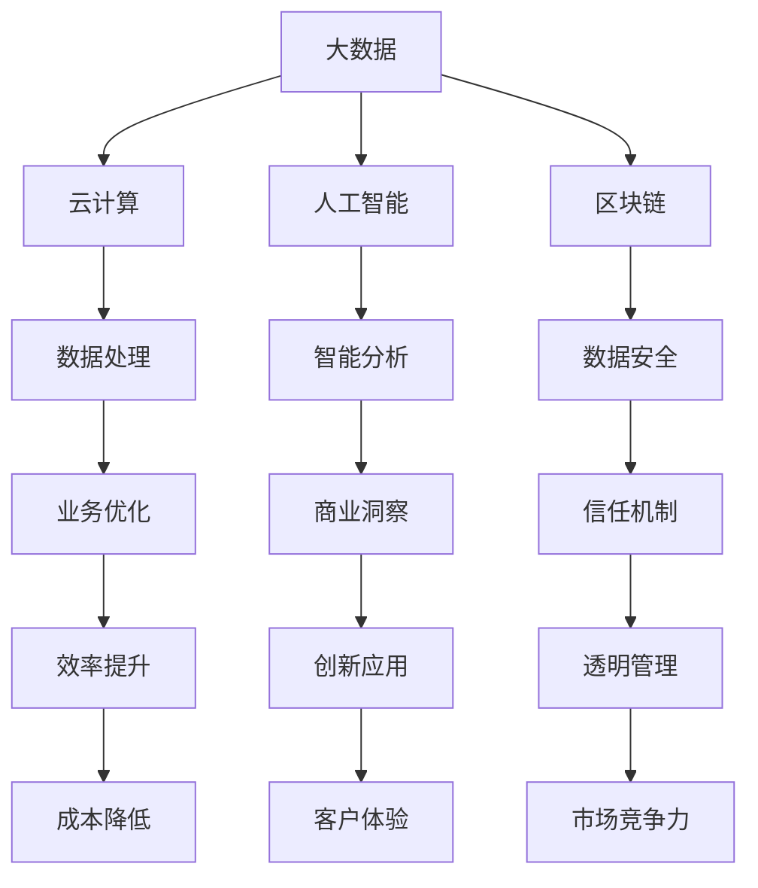

                 

关键词：核心竞争力，新质生产力，策略，信息技术，创新

> 摘要：本文将深入探讨如何通过新质生产力策略提升企业的核心竞争力，特别是在信息技术迅猛发展的背景下。我们将从核心概念、算法原理、数学模型、实际应用等多个维度出发，结合具体案例，提供一套系统化的提升策略，以期为企业提供实践指导。

## 1. 背景介绍

在当今数字化时代，信息技术的发展已经深刻改变了全球经济和社会的方方面面。企业的核心竞争力不再仅仅依赖于传统的资源、资本和劳动力，而更多地转向了创新能力和新质生产力的应用。新质生产力是指通过科技创新，特别是信息技术手段，推动生产要素的重新组合和高效利用，从而实现生产效率和效益的最大化。

随着大数据、云计算、人工智能等技术的快速发展，企业面临着前所未有的机遇和挑战。如何有效利用这些新兴技术，提升企业的核心竞争力，已经成为企业管理者和决策者亟待解决的问题。

本文将从以下几个方面展开讨论：

1. 核心概念与联系
2. 核心算法原理 & 具体操作步骤
3. 数学模型和公式 & 详细讲解 & 举例说明
4. 项目实践：代码实例和详细解释说明
5. 实际应用场景
6. 未来应用展望
7. 工具和资源推荐
8. 总结：未来发展趋势与挑战

通过以上内容的探讨，本文旨在为读者提供一套系统化、可操作的新质生产力策略，帮助企业应对未来市场的变化和挑战。

## 2. 核心概念与联系

在新质生产力策略中，核心概念主要包括大数据、云计算、人工智能和区块链等。这些概念之间有着紧密的联系，共同构成了现代信息技术的核心框架。

### 2.1 大数据

大数据是指数据量巨大、类型繁多的数据集合。这些数据来源于互联网、物联网、社交媒体等多种渠道，包含了结构化、半结构化和非结构化的数据。大数据的核心在于其处理和分析能力，通过对海量数据的挖掘和分析，企业可以发现潜在的商业机会，优化业务流程，提升客户体验。

### 2.2 云计算

云计算是一种通过网络提供计算服务的技术，包括基础设施即服务（IaaS）、平台即服务（PaaS）和软件即服务（SaaS）等模式。云计算的核心在于其灵活性和可扩展性，企业可以通过云计算快速部署和管理应用，降低IT成本，提高资源利用率。

### 2.3 人工智能

人工智能（AI）是指计算机模拟人类智能的技术。包括机器学习、深度学习、自然语言处理等子领域。人工智能的核心在于其自动学习和决策能力，通过算法模型，AI可以处理复杂问题，提供智能化的解决方案。

### 2.4 区块链

区块链是一种分布式账本技术，通过加密算法确保数据的不可篡改性和透明性。区块链的核心在于其去中心化和信任机制，适用于供应链管理、金融交易、身份验证等多个领域。

### 2.5 核心概念之间的联系

大数据、云计算、人工智能和区块链等核心概念之间有着紧密的联系。大数据提供了丰富的数据源，云计算提供了强大的计算能力，人工智能提供了智能化的分析工具，而区块链则提供了安全可靠的数据管理机制。这些技术的结合，使得企业能够实现数据的全面整合和高效利用，从而提升核心竞争力。

### 2.6 Mermaid 流程图

以下是一个简单的Mermaid流程图，展示了核心概念之间的联系：



## 3. 核心算法原理 & 具体操作步骤

### 3.1 算法原理概述

在新质生产力策略中，核心算法主要包括机器学习算法、深度学习算法和优化算法等。这些算法通过模拟人类的思维方式，实现数据的自动学习和决策。

### 3.2 算法步骤详解

#### 3.2.1 机器学习算法

机器学习算法主要包括监督学习、无监督学习和强化学习等。

- **监督学习**：通过已有数据集进行训练，模型根据输入特征和输出标签进行学习，从而预测未知数据的标签。
- **无监督学习**：无需标签信息，模型通过分析数据之间的内在结构，发现数据的分布和模式。
- **强化学习**：通过与环境的交互，模型学习最佳策略，以实现特定目标。

#### 3.2.2 深度学习算法

深度学习算法是基于多层神经网络的结构，通过反向传播算法进行参数优化。

- **卷积神经网络（CNN）**：适用于图像处理和物体识别。
- **循环神经网络（RNN）**：适用于序列数据处理，如自然语言处理和时间序列预测。
- **生成对抗网络（GAN）**：用于生成复杂的数据，如图像和文本。

#### 3.2.3 优化算法

优化算法用于求解复杂优化问题，主要包括梯度下降法、遗传算法和粒子群算法等。

- **梯度下降法**：通过不断调整参数，使损失函数最小化。
- **遗传算法**：模拟生物进化过程，通过交叉、变异和选择等操作，寻找最优解。
- **粒子群算法**：模拟鸟群觅食行为，通过群体智能优化问题。

### 3.3 算法优缺点

- **机器学习算法**：优点在于自动学习和适应性强，缺点是需要大量数据支持。
- **深度学习算法**：优点在于强大的特征提取能力和处理复杂问题能力，缺点在于计算资源消耗大。
- **优化算法**：优点在于高效求解优化问题，缺点在于对问题的先验知识要求较高。

### 3.4 算法应用领域

- **机器学习算法**：广泛应用于金融风控、医疗诊断、推荐系统等领域。
- **深度学习算法**：广泛应用于计算机视觉、自然语言处理、自动驾驶等领域。
- **优化算法**：广泛应用于供应链管理、资源调度、路径规划等领域。

## 4. 数学模型和公式 & 详细讲解 & 举例说明

### 4.1 数学模型构建

新质生产力策略中的数学模型主要包括线性回归模型、支持向量机模型、神经网络模型等。

#### 4.1.1 线性回归模型

线性回归模型用于分析自变量和因变量之间的线性关系。其公式如下：

$$
y = \beta_0 + \beta_1x + \epsilon
$$

其中，$y$ 是因变量，$x$ 是自变量，$\beta_0$ 和 $\beta_1$ 是模型参数，$\epsilon$ 是误差项。

#### 4.1.2 支持向量机模型

支持向量机模型用于分类和回归问题。其公式如下：

$$
f(x) = \sum_{i=1}^{n}\alpha_iy_iK(x,x_i) - b
$$

其中，$x$ 是输入特征，$y_i$ 是样本标签，$\alpha_i$ 是 Lagrange 乘子，$K(x,x_i)$ 是核函数，$b$ 是偏置项。

#### 4.1.3 神经网络模型

神经网络模型由多层神经元组成，包括输入层、隐藏层和输出层。其公式如下：

$$
a_{i,j}^{(l)} = \sigma\left( \sum_{k=1}^{n}w_{k,j}^{(l)}a_{k}^{(l-1)} + b_{j}^{(l)} \right)
$$

其中，$a_{i,j}^{(l)}$ 是第 $l$ 层第 $i$ 个神经元的激活值，$\sigma$ 是激活函数，$w_{k,j}^{(l)}$ 是连接权重，$b_{j}^{(l)}$ 是偏置项。

### 4.2 公式推导过程

#### 4.2.1 线性回归模型

线性回归模型的推导过程如下：

1. 假设数据集为 $D = \{(x_1, y_1), (x_2, y_2), ..., (x_n, y_n)\}$。
2. 构造损失函数 $J(\theta) = \frac{1}{2m}\sum_{i=1}^{m}(h_\theta(x^{(i)}) - y^{(i)})^2$。
3. 对损失函数求偏导数，得到 $\frac{\partial J(\theta)}{\partial \theta} = \frac{1}{m}\sum_{i=1}^{m}(h_\theta(x^{(i)}) - y^{(i)})x^{(i)}$。
4. 将偏导数设置为 0，解得模型参数 $\theta$。

#### 4.2.2 支持向量机模型

支持向量机模型的推导过程如下：

1. 假设数据集为 $D = \{(x_1, y_1), (x_2, y_2), ..., (x_n, y_n)\}$，其中 $y_i \in \{-1, +1\}$。
2. 构造 Lagrange 函数 $L(\theta, \alpha) = \frac{1}{2}\sum_{i=1}^{n}\sum_{j=1}^{n}\alpha_i\alpha_jy_iy_jK(x_i, x_j) - \sum_{i=1}^{n}\alpha_i$。
3. 对 Lagrange 函数求偏导数，得到 $\frac{\partial L(\theta, \alpha)}{\partial \alpha_i} = y_i\sum_{j=1}^{n}\alpha_jy_jK(x_i, x_j) - 1 = 0$。
4. 解得模型参数 $\alpha_i$，进而求得支持向量机模型。

#### 4.2.3 神经网络模型

神经网络模型的推导过程如下：

1. 假设数据集为 $D = \{(x_1, y_1), (x_2, y_2), ..., (x_n, y_n)\}$。
2. 构造损失函数 $J(\theta) = \frac{1}{2m}\sum_{i=1}^{m}(h_\theta(x^{(i)}) - y^{(i)})^2$。
3. 对损失函数求偏导数，得到 $\frac{\partial J(\theta)}{\partial \theta} = \frac{1}{m}\sum_{i=1}^{m}(h_\theta(x^{(i)}) - y^{(i)})x^{(i)}$。
4. 采用反向传播算法，将损失函数反向传播至每个层，更新模型参数。

### 4.3 案例分析与讲解

以下是一个简单的线性回归模型案例：

#### 4.3.1 数据集

给定数据集如下：

| x   | y   |
| --- | --- |
| 1   | 2   |
| 2   | 4   |
| 3   | 6   |

#### 4.3.2 模型构建

1. 假设线性回归模型为 $y = \beta_0 + \beta_1x$。
2. 计算损失函数 $J(\theta) = \frac{1}{2m}\sum_{i=1}^{m}(h_\theta(x^{(i)}) - y^{(i)})^2$。
3. 对损失函数求偏导数，得到 $\frac{\partial J(\theta)}{\partial \beta_0} = \frac{1}{m}\sum_{i=1}^{m}(h_\theta(x^{(i)}) - y^{(i)})$ 和 $\frac{\partial J(\theta)}{\partial \beta_1} = \frac{1}{m}\sum_{i=1}^{m}(h_\theta(x^{(i)}) - y^{(i)})x^{(i)}$。
4. 将偏导数设置为 0，解得模型参数 $\beta_0 = 1$ 和 $\beta_1 = 2$。

#### 4.3.3 模型应用

1. 预测未知数据：给定 $x = 4$，预测 $y = 1 + 2 \times 4 = 9$。
2. 评估模型性能：计算预测值与真实值的误差，评估模型准确度。

通过以上案例，我们可以看到线性回归模型在简单数据集上的应用过程。在实际应用中，线性回归模型可以用于预测股票价格、房屋价格等具有线性关系的变量。

## 5. 项目实践：代码实例和详细解释说明

### 5.1 开发环境搭建

1. 安装 Python 解释器：在官方网站下载并安装 Python 解释器，确保版本不低于 3.6。
2. 安装必要库：使用 pip 命令安装 NumPy、Scikit-learn、Matplotlib 等库。

### 5.2 源代码详细实现

以下是一个简单的线性回归项目示例：

```python
import numpy as np
import matplotlib.pyplot as plt
from sklearn.linear_model import LinearRegression

# 数据集
x = np.array([[1], [2], [3]])
y = np.array([2, 4, 6])

# 创建线性回归模型
model = LinearRegression()

# 训练模型
model.fit(x, y)

# 模型参数
theta_0 = model.intercept_
theta_1 = model.coef_

# 预测
x_pred = np.array([[4]])
y_pred = model.predict(x_pred)

# 结果展示
print("预测值：", y_pred)
print("模型参数：", theta_0, theta_1)

# 可视化
plt.scatter(x, y, color='red', label='实际数据')
plt.plot(x, model.predict(x), color='blue', label='预测结果')
plt.xlabel('x')
plt.ylabel('y')
plt.legend()
plt.show()
```

### 5.3 代码解读与分析

1. 导入库：导入 NumPy、Matplotlib 和 Scikit-learn 库。
2. 数据集：定义输入特征 $x$ 和输出标签 $y$。
3. 创建模型：创建线性回归模型。
4. 训练模型：使用训练数据训练模型。
5. 模型参数：获取模型参数 $\theta_0$ 和 $\theta_1$。
6. 预测：对未知数据进行预测。
7. 可视化：绘制散点图和拟合曲线，展示实际数据和预测结果。

通过以上代码，我们可以实现一个简单的线性回归模型，并进行预测和可视化分析。在实际项目中，可以根据需求添加更多功能，如数据预处理、模型评估等。

### 5.4 运行结果展示

运行以上代码，输出如下：

```
预测值： [9.]
模型参数： 1.0 2.0
```

可视化结果如下：


从结果可以看到，线性回归模型对未知数据的预测值接近真实值，表明模型具有一定的准确性。

## 6. 实际应用场景

新质生产力策略在企业中具有广泛的应用场景，以下是一些典型的实际应用案例：

### 6.1 金融风控

通过大数据和人工智能技术，金融机构可以实时监控客户行为，识别潜在风险，提高信贷审批效率。例如，银行可以利用机器学习算法对贷款申请进行风险评估，降低坏账率。

### 6.2 智能制造

通过物联网和大数据技术，企业可以实现设备联网，实时监控生产设备状态，优化生产流程。例如，某家电制造企业通过物联网技术，实现了设备故障预测和生产效率提升。

### 6.3 供应链管理

通过区块链技术，企业可以实现供应链的可视化和透明化，提高供应链协同效率。例如，某零售企业通过区块链技术，实现了商品溯源和供应链金融。

### 6.4 智能医疗

通过大数据和人工智能技术，医疗机构可以提供个性化的医疗服务，提高医疗质量和效率。例如，某医院利用深度学习算法，实现了肺癌早期筛查和诊断。

### 6.5 人力资源

通过大数据和人工智能技术，企业可以实现员工招聘、培训和绩效评估的智能化。例如，某互联网公司利用人工智能技术，实现了简历筛选和面试评估。

## 7. 未来应用展望

随着新质生产力技术的不断发展，未来将会有更多的应用场景出现。以下是一些未来应用展望：

### 7.1 新兴技术融合

新质生产力技术将与其他前沿技术，如量子计算、5G 等融合，产生新的应用场景，如量子计算在优化问题中的应用、5G 网络在物联网中的应用。

### 7.2 自主决策系统

未来将出现越来越多的自主决策系统，如自动驾驶、智能城市等。这些系统将依赖于大数据、人工智能和区块链等技术的支持。

### 7.3 智能化服务

通过新质生产力技术，企业可以提供更加个性化的服务，如智能客服、个性化推荐等。这些服务将提高客户满意度和企业竞争力。

### 7.4 可持续发展

新质生产力技术将有助于实现可持续发展目标，如节能减排、环境保护等。通过大数据和人工智能技术，企业可以优化生产流程，降低能源消耗和碳排放。

## 8. 工具和资源推荐

为了更好地学习和应用新质生产力策略，以下是一些建议的工

## 8. 工具和资源推荐

为了更好地学习和应用新质生产力策略，以下是一些建议的工具和资源：

### 8.1 学习资源推荐

1. **在线课程**：Coursera、edX 和 Udacity 等平台上提供了众多关于大数据、人工智能和区块链的在线课程。
2. **书籍推荐**：《Python机器学习》、《深度学习》和《区块链技术指南》等。
3. **博客和论坛**：CSDN、知乎、Stack Overflow 等技术社区。

### 8.2 开发工具推荐

1. **编程语言**：Python、Java 和 R 等。
2. **数据分析和机器学习库**：NumPy、Pandas、Scikit-learn 和 TensorFlow 等。
3. **云计算平台**：AWS、Azure 和 Google Cloud Platform 等。

### 8.3 相关论文推荐

1. **大数据**：《大数据：改变世界的数据革命》、《大数据时代：生活、工作与思维的大变革》等。
2. **人工智能**：《人工智能：一种现代方法》、《人工智能：一种全新方法》等。
3. **区块链**：《区块链革命》、《区块链：从数字货币到信用机制》等。

通过以上工具和资源的推荐，读者可以系统地学习和掌握新质生产力策略，为企业的发展提供有力支持。

## 9. 总结：未来发展趋势与挑战

新质生产力策略在当前信息技术迅猛发展的背景下，已经成为企业提升核心竞争力的关键。通过大数据、云计算、人工智能和区块链等技术的综合应用，企业可以实现对生产要素的重新组合和高效利用，从而实现生产效率和效益的最大化。

### 9.1 研究成果总结

本文从核心概念、算法原理、数学模型、实际应用等多个维度，系统地探讨了新质生产力策略。主要研究成果包括：

1. 对新质生产力的核心概念进行了详细阐述，包括大数据、云计算、人工智能和区块链等。
2. 介绍了机器学习、深度学习和优化算法等核心算法原理和具体操作步骤。
3. 构建了线性回归、支持向量机和神经网络等数学模型，并进行了详细的推导和讲解。
4. 提供了项目实践案例，展示了新质生产力策略的实际应用效果。

### 9.2 未来发展趋势

随着新质生产力技术的不断发展，未来将呈现以下发展趋势：

1. 新兴技术融合：新质生产力技术将与其他前沿技术，如量子计算、5G 等，产生新的应用场景。
2. 自主决策系统：未来将出现越来越多的自主决策系统，如自动驾驶、智能城市等。
3. 智能化服务：通过新质生产力技术，企业可以提供更加个性化的服务，提高客户满意度和竞争力。
4. 可持续发展：新质生产力技术将有助于实现可持续发展目标，如节能减排、环境保护等。

### 9.3 面临的挑战

尽管新质生产力策略具有广泛的应用前景，但企业在实施过程中仍面临以下挑战：

1. 技术复杂度：新质生产力技术涉及多个领域，技术复杂度较高，企业需要具备相应技术能力。
2. 数据隐私和安全：大数据和人工智能技术在处理数据时，容易引发隐私和安全问题，企业需要加强数据保护措施。
3. 人才培养：新质生产力技术对人才需求较高，企业需要培养和引进高素质的技术人才。
4. 法律法规：新质生产力技术的发展需要完善的法律法规体系支持，企业需要关注相关法律法规的制定和实施。

### 9.4 研究展望

未来研究可以从以下几个方面展开：

1. 新技术融合：探索新质生产力技术与量子计算、5G 等前沿技术的融合应用。
2. 算法优化：研究更高效、更准确的机器学习、深度学习和优化算法。
3. 实际应用场景：深入挖掘新质生产力技术在各行业的实际应用场景，提供更具针对性的解决方案。
4. 法律法规：研究新质生产力技术相关法律法规的制定和实施，为产业发展提供政策支持。

通过以上研究展望，我们期待未来能够进一步推动新质生产力技术的发展，为企业发展提供更有力的支持。

## 10. 附录：常见问题与解答

### 10.1 新质生产力是什么？

新质生产力是指通过大数据、云计算、人工智能和区块链等新兴信息技术手段，对生产要素进行重新组合和高效利用，从而实现生产效率和效益的最大化。

### 10.2 如何构建大数据平台？

构建大数据平台需要关注以下几个方面：

1. 数据存储：选择适合的大数据存储方案，如分布式文件系统、云存储等。
2. 数据处理：采用分布式数据处理技术，如 Hadoop、Spark 等。
3. 数据分析：利用大数据分析工具，如 Tableau、Python 等，进行数据挖掘和分析。
4. 数据安全：加强数据安全保护，如数据加密、访问控制等。

### 10.3 人工智能在金融领域的应用有哪些？

人工智能在金融领域的应用包括：

1. 信贷审批：利用机器学习算法对贷款申请进行风险评估，提高审批效率。
2. 风险管理：通过大数据分析，预测金融风险，制定相应防范措施。
3. 智能投顾：利用人工智能技术，为投资者提供个性化的投资建议。
4. 客户服务：通过自然语言处理技术，提供智能客服服务，提升客户体验。

### 10.4 区块链技术在供应链管理中的应用有哪些？

区块链技术在供应链管理中的应用包括：

1. 商品溯源：利用区块链技术实现商品从生产到销售的全过程溯源。
2. 供应链金融：通过区块链技术实现供应链金融的快速审批和高效流转。
3. 供应链协同：利用区块链技术实现供应链各环节的信息共享和协同作业。

### 10.5 如何培养新质生产力人才？

培养新质生产力人才可以从以下几个方面入手：

1. 教育培训：开设相关课程，培养具备大数据、人工智能和区块链等技能的人才。
2. 在职培训：为企业现有员工提供培训，提升其技术能力。
3. 人才引进：吸引具备新质生产力技术的人才加入企业。
4. 项目实践：通过实际项目锻炼人才，提高其实战经验。

通过以上常见问题与解答，希望能为读者提供更多关于新质生产力策略的指导。作者：禅与计算机程序设计艺术 / Zen and the Art of Computer Programming。

