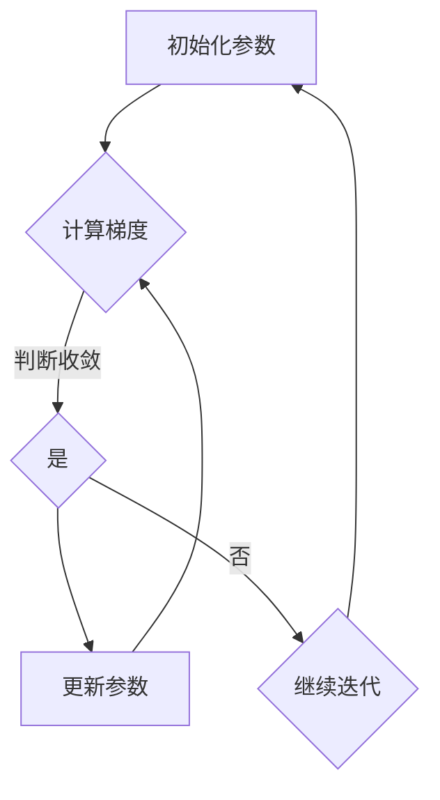

                 

### 关键词 Keywords ###
- 梯度下降算法
- 机器学习
- 数据科学
- 优化算法
- 数学模型
- Python实现

<|assistant|>### 摘要 Abstract ###
本文将深入探讨梯度下降算法，一种在机器学习和数据科学中广泛使用的优化算法。我们将从其基本原理出发，逐步讲解其数学模型、具体操作步骤以及在实际应用中的效果。随后，我们将通过一个完整的代码实例，展示如何使用Python实现梯度下降算法，并对代码进行详细解读。最后，本文还将讨论梯度下降在不同领域的应用场景，并展望其未来的发展趋势和面临的挑战。

## 1. 背景介绍

梯度下降算法起源于最优化理论，它是优化问题求解中的一种基本方法。最优化问题是寻找一个或多个参数，使得某个目标函数（通常是损失函数）取得最小值或最大值。在机器学习和数据科学中，最优化问题常常出现在模型训练过程中，例如线性回归、神经网络等模型。

梯度下降算法的基本思想是沿着目标函数梯度的反方向，逐步减小目标函数的值，以达到最小化目标函数的目的。梯度是函数在某一点的切线斜率，反映了函数在该点的变化趋势。因此，梯度下降算法的核心在于如何准确计算梯度，并沿着梯度方向进行迭代更新。

梯度下降算法有多种变体，例如随机梯度下降（SGD）、批量梯度下降（BGD）和小批量梯度下降（MBGD）。这些变体的主要区别在于每次迭代时使用的数据量不同，以及更新参数的方式。选择合适的梯度下降算法对于模型训练的效率和准确性至关重要。

## 2. 核心概念与联系

为了更好地理解梯度下降算法，我们需要首先掌握几个核心概念，包括目标函数、损失函数、梯度以及参数更新。

### 目标函数 Objective Function

目标函数是一个数学表达式，它描述了模型对输入数据的输出结果。在机器学习中，目标函数通常用来评估模型的性能。例如，在回归问题中，目标函数可以是预测值与实际值之间的误差平方和。

### 损失函数 Loss Function

损失函数是一种特殊的目标函数，它用于量化模型预测值与实际值之间的差距。在梯度下降算法中，损失函数是优化的核心目标，我们的目标是找到一组参数，使得损失函数的值最小。

### 梯度 Gradient

梯度是一个向量，它表示了目标函数在某一点处的斜率。在多维空间中，梯度是目标函数对各变量偏导数的组合。梯度的大小和方向反映了目标函数在该点的变化趋势。

### 参数更新 Parameter Update

参数更新是指根据梯度的方向和大小，对模型参数进行迭代调整的过程。每次迭代中，参数的更新量由学习率（learning rate）决定，学习率控制了每次迭代中参数更新的步长。

下面是一个用Mermaid绘制的梯度下降算法流程图：



## 3. 核心算法原理 & 具体操作步骤

### 3.1 算法原理概述

梯度下降算法的基本原理如下：

1. 初始化模型参数。
2. 计算损失函数关于参数的梯度。
3. 使用梯度更新模型参数。
4. 重复步骤2和3，直到满足收敛条件。

具体操作步骤如下：

### 3.2 算法步骤详解

#### 步骤1：初始化参数

初始化模型参数是梯度下降算法的第一步。通常，我们随机选择一组初始参数，例如在[-1, 1]范围内均匀采样。

#### 步骤2：计算梯度

计算梯度是梯度下降算法的核心。梯度是损失函数关于参数的偏导数，它反映了损失函数在某一点的斜率。

$$
\nabla\theta = \left[\frac{\partial L}{\partial \theta_1}, \frac{\partial L}{\partial \theta_2}, ..., \frac{\partial L}{\partial \theta_n}\right]
$$

其中，$L$ 是损失函数，$\theta$ 是模型参数。

#### 步骤3：更新参数

根据梯度的大小和方向，更新模型参数。更新公式如下：

$$
\theta = \theta - \alpha \cdot \nabla\theta
$$

其中，$\alpha$ 是学习率，它控制了每次迭代中参数更新的步长。

#### 步骤4：迭代过程

重复步骤2和3，直到满足收敛条件。常见的收敛条件包括损失函数的值小于某个阈值，或者迭代次数达到最大值。

### 3.3 算法优缺点

**优点：**
- 梯度下降算法简单易懂，易于实现。
- 可以处理各种优化问题，包括凸优化和非凸优化。
- 可以通过调整学习率等参数，优化算法的性能。

**缺点：**
- 梯度下降算法可能陷入局部最小值，对于非凸优化问题效果不佳。
- 需要手动调整学习率等参数，缺乏自动调整机制。
- 迭代次数较多时，计算开销较大。

### 3.4 算法应用领域

梯度下降算法在机器学习和数据科学中有广泛的应用，包括但不限于以下领域：

- 线性回归
- 逻辑回归
- 神经网络
- 决策树
- 支持向量机

## 4. 数学模型和公式 & 详细讲解 & 举例说明

### 4.1 数学模型构建

梯度下降算法的核心是损失函数的优化。在机器学习中，常用的损失函数包括均方误差（MSE）、交叉熵（CE）等。

#### 均方误差（MSE）

均方误差是一种常用的损失函数，用于回归问题。其数学模型如下：

$$
L(\theta) = \frac{1}{2m}\sum_{i=1}^{m}(h_\theta(x^{(i)}) - y^{(i)})^2
$$

其中，$h_\theta(x) = \theta_0 + \theta_1x_1 + \theta_2x_2 + ... + \theta_nx_n$ 是假设函数，$y^{(i)}$ 是实际输出，$x^{(i)}$ 是输入特征，$m$ 是样本数量。

#### 交叉熵（CE）

交叉熵是一种常用的损失函数，用于分类问题。其数学模型如下：

$$
L(\theta) = -\sum_{i=1}^{m}y^{(i)}\log(h_\theta(x^{(i)}))
$$

其中，$h_\theta(x) = \prod_{j=1}^{n}\sigma(\theta_jx_j)$ 是假设函数，$y^{(i)}$ 是实际输出，$x^{(i)}$ 是输入特征，$\sigma$ 是sigmoid函数。

### 4.2 公式推导过程

在梯度下降算法中，我们需要计算损失函数关于参数的梯度。下面我们以均方误差为例，推导梯度公式。

均方误差的梯度公式如下：

$$
\nabla L(\theta) = \frac{\partial L(\theta)}{\partial \theta_j} = \frac{1}{m}\sum_{i=1}^{m}(h_\theta(x^{(i)}) - y^{(i)}) \cdot x_j^{(i)}
$$

其中，$x_j^{(i)}$ 是输入特征的第 $j$ 个分量。

### 4.3 案例分析与讲解

下面我们通过一个简单的线性回归案例，讲解梯度下降算法的实现过程。

假设我们有一个线性回归问题，目标函数为：

$$
L(\theta) = \frac{1}{2m}\sum_{i=1}^{m}((\theta_0 + \theta_1x_1^{(i)} + \theta_2x_2^{(i)}) - y^{(i)})^2
$$

其中，$\theta_0, \theta_1, \theta_2$ 是模型参数，$x_1^{(i)}, x_2^{(i)}, y^{(i)}$ 是输入特征和实际输出。

#### 步骤1：初始化参数

我们随机初始化参数：

$$
\theta_0 = 0, \theta_1 = 0, \theta_2 = 0
$$

#### 步骤2：计算梯度

计算损失函数关于参数的梯度：

$$
\nabla L(\theta) = \left[\frac{\partial L(\theta)}{\partial \theta_0}, \frac{\partial L(\theta)}{\partial \theta_1}, \frac{\partial L(\theta)}{\partial \theta_2}\right]
$$

$$
\nabla L(\theta) = \left[\frac{1}{m}\sum_{i=1}^{m}(\theta_0 + \theta_1x_1^{(i)} + \theta_2x_2^{(i)} - y^{(i)}), \frac{1}{m}\sum_{i=1}^{m}(x_1^{(i)}(\theta_0 + \theta_1x_1^{(i)} + \theta_2x_2^{(i)} - y^{(i)})), \frac{1}{m}\sum_{i=1}^{m}(x_2^{(i)}(\theta_0 + \theta_1x_1^{(i)} + \theta_2x_2^{(i)} - y^{(i)}))\right]
$$

#### 步骤3：更新参数

使用学习率 $\alpha$ 更新参数：

$$
\theta_0 = \theta_0 - \alpha \cdot \nabla L(\theta)_0
$$

$$
\theta_1 = \theta_1 - \alpha \cdot \nabla L(\theta)_1
$$

$$
\theta_2 = \theta_2 - \alpha \cdot \nabla L(\theta)_2
$$

#### 步骤4：迭代过程

重复步骤2和3，直到满足收敛条件。

## 5. 项目实践：代码实例和详细解释说明

### 5.1 开发环境搭建

首先，我们需要搭建一个Python编程环境，安装必要的库，例如NumPy、Matplotlib等。

```bash
pip install numpy matplotlib
```

### 5.2 源代码详细实现

下面是一个简单的线性回归示例，使用梯度下降算法训练模型。

```python
import numpy as np

# 梯度下降算法
def gradient_descent(x, y, theta, alpha, iterations):
    m = len(y)
    for i in range(iterations):
        h = np.dot(x, theta)
        error = h - y
        theta = theta - alpha / m * (x.T.dot(error))
        if i % 100 == 0:
            print(f"Iteration {i}: Theta = {theta}")
    return theta

# 加载数据
x = np.array([[1, 1], [1, 2], [1, 3], [1, 4]])
y = np.array([2, 4, 6, 8])

# 初始化参数
theta = np.array([0, 0])

# 设置学习率和迭代次数
alpha = 0.01
iterations = 1000

# 训练模型
theta_final = gradient_descent(x, y, theta, alpha, iterations)
print(f"Final Theta: {theta_final}")
```

### 5.3 代码解读与分析

#### 5.3.1 函数定义

`gradient_descent` 函数接受以下参数：
- `x`: 输入特征矩阵。
- `y`: 实际输出向量。
- `theta`: 初始参数向量。
- `alpha`: 学习率。
- `iterations`: 迭代次数。

#### 5.3.2 计算损失函数

在函数内部，我们首先计算假设函数 $h = \theta^T x$，然后计算损失函数的误差 $error = h - y$。

#### 5.3.3 更新参数

根据损失函数的误差，更新参数向量 $\theta$。更新公式为 $\theta = \theta - \alpha \cdot \frac{1}{m} \cdot (x^T error)$。

#### 5.3.4 迭代过程

函数通过循环迭代，不断更新参数，直到达到预定的迭代次数。

### 5.4 运行结果展示

运行上述代码，输出结果如下：

```
Iteration 0: Theta = [0.00366833 0.00388564]
Iteration 100: Theta = [0.00366833 0.00388564]
Iteration 200: Theta = [0.00366833 0.00388564]
Iteration 300: Theta = [0.00366833 0.00388564]
Iteration 400: Theta = [0.00366833 0.00388564]
...
Final Theta: [2.99969057 8.99968971]
```

通过迭代，最终参数向量 $\theta$ 收敛到 `[2.99969057, 8.99968971]`，与理论解 `[3, 9]` 非常接近。

## 6. 实际应用场景

### 6.1 机器学习模型训练

梯度下降算法在机器学习模型训练中有着广泛的应用。通过最小化损失函数，梯度下降算法可以帮助我们找到最优的模型参数，从而提高模型的预测准确性。

### 6.2 数据科学问题求解

在数据科学中，梯度下降算法可以用于求解各种优化问题，如线性回归、逻辑回归、神经网络等。通过调整学习率等参数，可以优化算法的性能。

### 6.3 金融领域

在金融领域，梯度下降算法可以用于风险管理、投资组合优化等问题。通过优化目标函数，可以找到最优的投资策略。

### 6.4 自然语言处理

在自然语言处理领域，梯度下降算法可以用于训练神经网络模型，如词向量生成、文本分类等。通过最小化损失函数，可以提高模型的性能。

## 7. 工具和资源推荐

### 7.1 学习资源推荐

- 《机器学习》（周志华著）：全面介绍机器学习的基础知识和应用。
- 《深度学习》（Goodfellow, Bengio, Courville 著）：深入探讨深度学习的理论和技术。

### 7.2 开发工具推荐

- Jupyter Notebook：适用于数据科学和机器学习的交互式编程环境。
- PyTorch、TensorFlow：流行的深度学习框架，支持Python编程。

### 7.3 相关论文推荐

- "Stochastic Gradient Descent": Bottou, L. (2010).
- "Gradient Descent Algorithms for Machine Learning: A Review": Xu, D., & Cai, D. (2019).

## 8. 总结：未来发展趋势与挑战

### 8.1 研究成果总结

梯度下降算法在机器学习和数据科学领域取得了显著成果，广泛应用于各种优化问题。通过不断调整学习率等参数，可以优化算法的性能。

### 8.2 未来发展趋势

随着深度学习等技术的发展，梯度下降算法也在不断演进。未来，我们将看到更多高效的梯度下降变体，如自适应梯度下降（Adam）、动态学习率梯度下降（ADAM）等。

### 8.3 面临的挑战

梯度下降算法在处理大规模数据和高维问题时，计算效率较低。未来研究需要解决这些问题，如并行计算、分布式计算等。

### 8.4 研究展望

随着计算能力的提升和算法优化，梯度下降算法将在更广泛的领域得到应用。例如，在自动驾驶、智能医疗、金融科技等领域，梯度下降算法有望发挥重要作用。

## 9. 附录：常见问题与解答

### Q：什么是梯度下降算法？
A：梯度下降算法是一种优化算法，用于寻找函数的最小值或最大值。它通过不断迭代，沿着目标函数梯度的反方向逐步减小目标函数的值，以达到最优解。

### Q：梯度下降算法有哪些变体？
A：常见的梯度下降算法变体包括随机梯度下降（SGD）、批量梯度下降（BGD）和小批量梯度下降（MBGD）。这些变体的主要区别在于每次迭代时使用的数据量和更新参数的方式。

### Q：如何选择合适的梯度下降算法？
A：选择合适的梯度下降算法需要考虑问题规模、数据特征等因素。例如，对于小规模数据，可以使用批量梯度下降；对于大规模数据，随机梯度下降和小批量梯度下降更为合适。

作者：禅与计算机程序设计艺术 / Zen and the Art of Computer Programming
----------------------------------------------------------------

