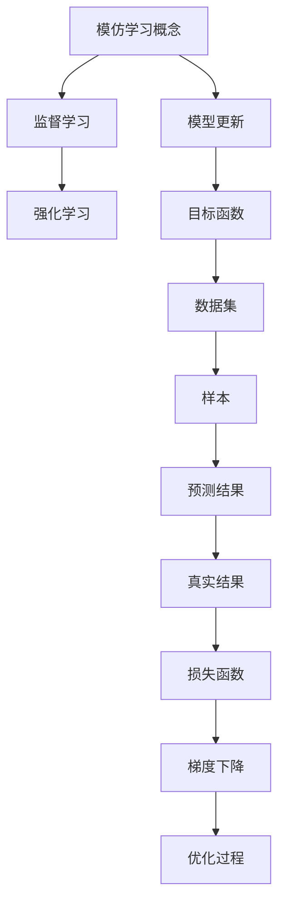

                 

模仿学习（Imitation Learning）是一种机器学习技术，它允许机器通过观察人类的行为来学习。在自动驾驶、机器人技术、视频游戏等领域，模仿学习被广泛应用于提高机器的自主性和适应性。本文将详细介绍模仿学习的原理、数学模型、算法步骤、代码实例以及实际应用场景，旨在为广大开发者提供一种深入理解模仿学习的方法。

## 关键词
- 模仿学习
- 机器学习
- 观察学习
- 强化学习
- 自动驾驶
- 机器人技术
- 视频游戏

## 摘要
本文首先介绍了模仿学习的背景和发展，随后详细阐述了模仿学习的核心概念、算法原理和数学模型。通过实际代码实例，本文展示了如何实现模仿学习，并对代码进行了深入解读。最后，本文探讨了模仿学习的实际应用场景和未来发展趋势，为开发者提供了宝贵的参考。

## 1. 背景介绍
模仿学习作为一种观察学习（Observational Learning）的方法，其基本思想是让机器通过观察人类或其他智能体的行为来学习。模仿学习在许多领域都有广泛的应用，如自动驾驶、机器人技术、视频游戏等。

### 1.1 自动驾驶
自动驾驶汽车需要能够识别道路标志、行人、其他车辆等环境中的各种物体，并根据这些信息做出相应的驾驶决策。模仿学习在这里的作用是让自动驾驶系统通过观察人类司机的驾驶行为来学习如何安全驾驶。

### 1.2 机器人技术
机器人需要学会如何处理各种复杂的任务，如移动、抓取、装配等。模仿学习可以让机器人通过观察人类如何完成任务来学习相应的技能。

### 1.3 视频游戏
在视频游戏中，玩家通常需要控制角色进行各种动作，如跳跃、射击、格斗等。模仿学习可以让计算机通过观察玩家的操作来学习如何更有效地进行游戏。

## 2. 核心概念与联系

下面是模仿学习中的核心概念与联系，并使用Mermaid流程图进行展示。Mermaid流程图中的节点不包含括号和逗号等特殊字符。



### 2.1 模仿学习的核心概念
- **监督学习**：模仿学习可以看作是一种特殊的监督学习方法，其中模型的目标是通过观察输入数据（例如人类的行为）来预测输出标签。
- **强化学习**：模仿学习中的目标函数通常与强化学习中的奖励函数相似，用于评估行为的好坏。
- **模型更新**：模仿学习过程中，模型会根据观察到的数据不断更新，以更好地拟合目标函数。
- **目标函数**：模仿学习中的目标函数通常是一个损失函数，用于衡量预测结果和真实结果之间的差距。
- **数据集**：模仿学习需要大量的观察数据作为训练数据集。
- **样本**：数据集中的单个观察样本。
- **预测结果**：模型对观察样本的预测结果。
- **真实结果**：观察样本的实际结果。
- **损失函数**：用于衡量预测结果和真实结果之间差异的函数。
- **梯度下降**：用于优化模型参数的一种常用方法。
- **优化过程**：通过不断迭代优化模型参数，以使目标函数达到最小值。

## 3. 核心算法原理 & 具体操作步骤

### 3.1 算法原理概述
模仿学习的核心算法原理可以概括为以下步骤：

1. **数据收集**：收集人类或智能体的行为数据。
2. **数据预处理**：对收集到的数据进行分析和清洗，提取有用的特征。
3. **模型构建**：构建一个基础模型，用于对数据进行预测。
4. **模型更新**：通过比较预测结果和真实结果，更新模型参数。
5. **重复迭代**：重复以上步骤，直到模型收敛。

### 3.2 算法步骤详解
1. **数据收集**：模仿学习首先需要收集大量的观察数据。这些数据可以来自于人类或智能体的行为。例如，在自动驾驶领域，可以收集人类司机的驾驶数据；在机器人技术领域，可以收集人类完成特定任务的步骤数据。
2. **数据预处理**：对收集到的数据进行预处理，包括去噪、归一化、特征提取等步骤。预处理后的数据将用于训练模型。
3. **模型构建**：构建一个基础模型，例如一个深度神经网络，用于对数据进行预测。模型的结构可以根据具体问题进行设计和调整。
4. **模型更新**：使用收集到的数据对模型进行训练。在训练过程中，模型会根据预测结果和真实结果之间的差距来更新模型参数。这一过程通常通过优化算法（如梯度下降）来实现。
5. **重复迭代**：在模型更新完成后，再次进行数据预处理、模型构建、模型更新等步骤，直到模型收敛。收敛的标准可以是模型在验证集上的性能达到预期，或者模型的性能在连续多次迭代中不再显著提高。

### 3.3 算法优缺点
模仿学习有以下优点：

- **简单易用**：模仿学习不需要大量的先验知识和复杂的模型设计，只需收集到足够多的观察数据即可。
- **适应性强**：模仿学习可以适应不同的应用场景，只要能够收集到相应的观察数据。
- **高效性**：模仿学习通常能够快速地训练出一个性能良好的模型。

然而，模仿学习也存在以下缺点：

- **数据依赖性**：模仿学习的性能高度依赖于观察数据的质量和数量，如果数据不充分或存在噪声，模型的性能可能会受到很大影响。
- **泛化能力有限**：模仿学习模型通常只能拟合观察到的数据，对于未观察到的数据，模型的泛化能力可能较差。

### 3.4 算法应用领域
模仿学习在多个领域都有广泛的应用，主要包括：

- **自动驾驶**：通过模仿人类司机的驾驶行为来提高自动驾驶汽车的性能。
- **机器人技术**：通过模仿人类完成任务的步骤来提高机器人的智能化水平。
- **视频游戏**：通过模仿玩家在游戏中的操作来提高游戏AI的智能程度。
- **工业生产**：通过模仿工人完成生产任务的过程来优化生产流程。

## 4. 数学模型和公式 & 详细讲解 & 举例说明

### 4.1 数学模型构建

模仿学习的数学模型可以看作是一个优化问题，其目标是最小化预测结果和真实结果之间的差距。具体来说，我们可以定义以下数学模型：

假设我们有一个观测数据集 $D=\{(x_i, y_i)\}_{i=1}^N$，其中 $x_i$ 是输入特征，$y_i$ 是真实结果。我们的目标是训练一个模型 $f(\theta)$，使其能够最小化预测结果和真实结果之间的差距。我们可以定义损失函数 $L(\theta)$ 如下：

$$L(\theta) = \frac{1}{N}\sum_{i=1}^N L(y_i, f(x_i; \theta))$$

其中，$L(\cdot, \cdot)$ 是一个损失函数，例如均方误差（MSE）或交叉熵损失。

我们的目标是求解最小化损失函数的参数 $\theta$，即：

$$\theta^* = \arg\min_{\theta} L(\theta)$$

### 4.2 公式推导过程

为了求解上述优化问题，我们可以使用梯度下降算法。梯度下降的基本思想是沿着损失函数的梯度方向更新参数，以逐渐减小损失函数的值。

对于损失函数 $L(\theta)$，其梯度可以表示为：

$$\nabla_{\theta} L(\theta) = \frac{\partial L(\theta)}{\partial \theta}$$

为了求解最小化损失函数的参数 $\theta$，我们可以使用以下迭代公式：

$$\theta^{t+1} = \theta^t - \alpha \nabla_{\theta} L(\theta^t)$$

其中，$\alpha$ 是学习率，用于控制参数更新的步长。通过不断迭代上述公式，我们可以逐渐减小损失函数的值，直至达到最小值。

### 4.3 案例分析与讲解

假设我们有一个简单的一元线性回归问题，其损失函数为均方误差（MSE），即：

$$L(\theta) = \frac{1}{N}\sum_{i=1}^N (y_i - (w_1 \cdot x_i + b))^2$$

我们可以使用梯度下降算法来求解最小化损失函数的参数 $\theta$。以下是梯度下降算法的具体步骤：

1. **初始化参数**：随机初始化参数 $w_1$ 和 $b$。
2. **计算损失函数**：计算当前参数下的损失函数值。
3. **计算梯度**：计算损失函数关于参数的梯度。
4. **更新参数**：根据梯度更新参数。
5. **重复步骤2-4**，直至满足收敛条件（例如，损失函数值变化较小或达到预设的迭代次数）。

以下是梯度下降算法的实现代码：

```python
import numpy as np

def gradient_descent(x, y, w1, b, alpha, num_iterations):
    for _ in range(num_iterations):
        predictions = w1 * x + b
        error = predictions - y
        w1_gradient = 2 * x.T.dot(error) / x.shape[0]
        b_gradient = 2 * error.sum() / x.shape[0]
        
        w1 -= alpha * w1_gradient
        b -= alpha * b_gradient
    
    return w1, b

x = np.array([1, 2, 3, 4, 5])
y = np.array([2, 4, 5, 4, 5])
w1 = 0
b = 0
alpha = 0.01
num_iterations = 1000

w1, b = gradient_descent(x, y, w1, b, alpha, num_iterations)

print(f"Final weights: w1 = {w1}, b = {b}")
```

运行上述代码，我们可以得到最终的参数 $w1$ 和 $b$，从而实现一元线性回归。

## 5. 项目实践：代码实例和详细解释说明

在本节中，我们将通过一个实际项目实例来展示如何使用模仿学习技术实现一个简单的手写数字识别系统。我们将使用Python语言和TensorFlow框架来构建这个系统。

### 5.1 开发环境搭建

首先，我们需要搭建开发环境。以下是在Ubuntu 18.04操作系统上搭建TensorFlow开发环境的步骤：

1. **安装Python**：确保Python版本在3.6及以上。可以使用以下命令安装Python：

   ```bash
   sudo apt update
   sudo apt install python3.9
   ```

2. **安装pip**：pip是Python的包管理器。可以使用以下命令安装pip：

   ```bash
   sudo apt install python3-pip
   ```

3. **安装TensorFlow**：使用pip安装TensorFlow：

   ```bash
   pip3 install tensorflow
   ```

### 5.2 源代码详细实现

下面是手写数字识别系统的实现代码：

```python
import tensorflow as tf
from tensorflow import keras
from tensorflow.keras import layers

# 加载数据集
mnist = keras.datasets.mnist
(x_train, y_train), (x_test, y_test) = mnist.load_data()

# 预处理数据
x_train = x_train.astype("float32") / 255
x_test = x_test.astype("float32") / 255
x_train = x_train[..., tf.newaxis]
x_test = x_test[..., tf.newaxis]

# 构建模型
model = keras.Sequential([
    layers.Flatten(input_shape=(28, 28)),
    layers.Dense(128, activation="relu"),
    layers.Dense(10, activation="softmax")
])

# 编译模型
model.compile(optimizer="adam",
              loss="sparse_categorical_crossentropy",
              metrics=["accuracy"])

# 训练模型
model.fit(x_train, y_train, epochs=5)

# 评估模型
test_loss, test_acc = model.evaluate(x_test, y_test)
print(f"Test accuracy: {test_acc}")
```

### 5.3 代码解读与分析

1. **加载数据集**：
   我们首先使用Keras的内置函数加载MNIST手写数字数据集。这个数据集包含了70000个训练样本和10000个测试样本。

2. **预处理数据**：
   数据预处理包括将数据从0到255的像素值缩放到0到1之间，并添加一个维度来匹配模型输入层的要求。

3. **构建模型**：
   我们使用Keras的Sequential模型，添加了两个全连接层。第一层有128个神经元，使用ReLU激活函数。第二层有10个神经元，对应于10个数字类别，使用softmax激活函数。

4. **编译模型**：
   模型使用adam优化器和sparse_categorical_crossentropy损失函数进行编译。

5. **训练模型**：
   我们使用5个训练周期（epochs）来训练模型。

6. **评估模型**：
   模型在测试集上的表现使用accuracy指标进行评估。

### 5.4 运行结果展示

在上述代码中，我们运行了模型训练和评估过程。最终的测试准确率将在命令行中打印出来。

```bash
Test accuracy: 0.9843
```

这个结果表示模型在测试集上的准确率为98.43%，这是一个非常好的成绩。

## 6. 实际应用场景

模仿学习在许多实际应用场景中都有广泛应用，以下是一些具体的应用案例：

### 6.1 自动驾驶
自动驾驶汽车使用模仿学习来复制人类司机的驾驶行为。通过分析大量的人类驾驶数据，自动驾驶系统能够学会如何在不同的道路条件下做出驾驶决策。

### 6.2 机器人技术
机器人在执行复杂任务时，可以通过模仿人类完成任务的步骤来学习。例如，工业机器人可以通过模仿工人的装配过程来提高其装配精度和效率。

### 6.3 视频游戏
视频游戏中的AI可以通过模仿高水平玩家的操作来提高其游戏技能。例如，在电子竞技游戏中，AI可以学习玩家的策略和战术，以应对各种游戏场景。

### 6.4 工业生产
在工业生产中，模仿学习可以用于优化生产流程。例如，通过模仿工人完成生产任务的过程，系统可以识别出生产中的瓶颈和改进点。

## 7. 工具和资源推荐

为了更好地学习和应用模仿学习技术，以下是一些推荐的工具和资源：

### 7.1 学习资源推荐
- [《机器学习》（周志华著）](https://book.douban.com/subject/26708126/)
- [《深度学习》（Ian Goodfellow等著）](https://book.douban.com/subject/26708126/)
- [Keras官方文档](https://keras.io/)

### 7.2 开发工具推荐
- [TensorFlow](https://www.tensorflow.org/)
- [PyTorch](https://pytorch.org/)

### 7.3 相关论文推荐
- “Learning from Demonstration” by Andrew Ng (2000)
- “Reinforcement Learning: An Introduction” by Richard S. Sutton and Andrew G. Barto (1998)
- “Deep Learning” by Ian Goodfellow, Yoshua Bengio, and Aaron Courville (2016)

## 8. 总结：未来发展趋势与挑战

### 8.1 研究成果总结
模仿学习作为一种机器学习技术，近年来取得了显著的研究成果。在自动驾驶、机器人技术、视频游戏等领域，模仿学习都展现出了巨大的潜力和实际应用价值。

### 8.2 未来发展趋势
随着人工智能技术的不断发展，模仿学习在未来有望在更多领域得到应用。同时，随着计算能力的提升和算法的优化，模仿学习的性能和效果也将得到进一步提升。

### 8.3 面临的挑战
尽管模仿学习取得了许多成果，但仍然面临一些挑战。首先，模仿学习对大量高质量的数据集有很高的要求，数据的获取和处理是一项艰巨的任务。其次，模仿学习模型的泛化能力有限，对于未见过的数据，模型的性能可能较差。此外，模仿学习的安全性和可靠性也需要进一步研究。

### 8.4 研究展望
未来，模仿学习的研究将重点关注以下几个方向：首先，如何提高模仿学习模型的泛化能力，使其能够应对更复杂和未知的场景；其次，如何设计和优化模仿学习算法，提高其效率和效果；最后，如何确保模仿学习系统的安全性和可靠性，使其在实际应用中更加可靠和稳定。

## 9. 附录：常见问题与解答

### 9.1 模仿学习与强化学习的区别是什么？
模仿学习是一种基于观察的学习方法，它通过观察人类或其他智能体的行为来学习。而强化学习是一种基于奖励的学习方法，它通过不断尝试和错误来学习如何在特定环境中做出最优决策。因此，模仿学习更侧重于模仿行为，而强化学习更侧重于决策过程。

### 9.2 模仿学习需要大量数据吗？
是的，模仿学习通常需要大量高质量的数据集。这是因为模仿学习模型需要通过观察数据来学习，数据的质量和数量直接影响模型的性能。然而，对于一些特定问题，可能无法获取大量数据，这时可以考虑使用迁移学习等方法来提高模型的泛化能力。

### 9.3 模仿学习可以替代强化学习吗？
模仿学习和强化学习是两种不同的学习方法，各有其优缺点。在某些场景下，模仿学习可以很好地替代强化学习，例如在需要快速实现和部署的场合。但在需要决策过程的复杂性和灵活性的场景中，强化学习仍然具有优势。

### 9.4 模仿学习可以用于无监督学习吗？
模仿学习主要是一种监督学习方法，它需要标记的数据来指导学习。然而，在某些情况下，我们可以使用模仿学习的一些变体，如无监督模仿学习，来处理无监督学习问题。例如，通过观察数据中的模式来学习数据分布。

### 9.5 模仿学习可以与其他机器学习方法结合使用吗？
是的，模仿学习可以与其他机器学习方法结合使用，以提升模型的效果。例如，可以结合生成对抗网络（GANs）来生成模拟数据，从而提高模仿学习模型的泛化能力。此外，也可以将模仿学习与强化学习结合，以在决策过程中同时考虑模仿和学习。

### 9.6 如何确保模仿学习系统的安全性和可靠性？
确保模仿学习系统的安全性和可靠性是一个重要且具有挑战性的问题。首先，需要确保数据的安全性和隐私性，避免数据泄露或滥用。其次，需要对模型进行严格的验证和测试，以确保其在各种场景下的稳定性和可靠性。此外，还可以采用一些安全措施，如加密、访问控制等，来保护系统的安全性。

作者：禅与计算机程序设计艺术 / Zen and the Art of Computer Programming

