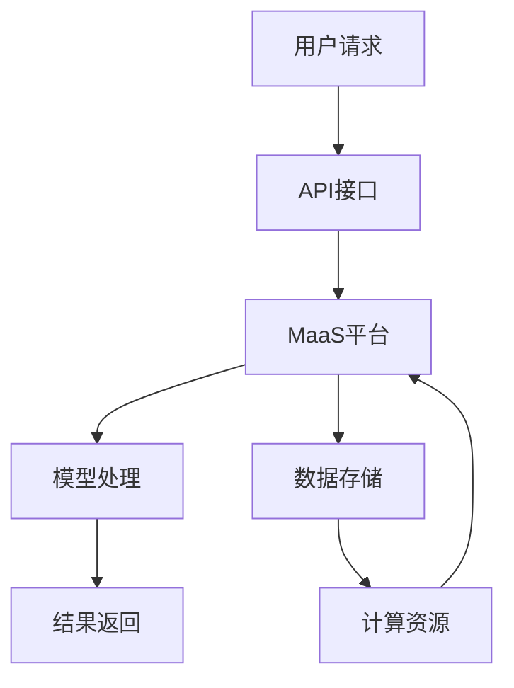

                 

关键词：模型即服务（MaaS）、AI技术、商业模式、技术门槛、云计算、数据服务、API接口、可扩展性、灵活性、智能化、数据分析、机器学习、深度学习、云计算服务、数据分析平台、算法优化、应用案例、行业应用。

## 摘要

本文旨在探讨模型即服务（Model as a Service，简称MaaS）这一新兴商业模式在降低AI技术门槛方面的作用。通过分析MaaS的核心概念、架构原理、算法模型、数学公式、项目实践和实际应用场景，本文将详细阐述MaaS如何通过提供标准化、灵活化的AI服务，使得广大开发者、企业乃至普通用户能够更加便捷、高效地利用AI技术，推动人工智能在各行业的普及与发展。

## 1. 背景介绍

### AI技术的发展历程

人工智能（Artificial Intelligence，简称AI）自20世纪50年代起步以来，已经经历了数十年的发展，从早期的符号逻辑和规则推理，到20世纪80年代的专家系统，再到21世纪初的深度学习和大数据技术，AI技术已经取得了长足的进步。特别是在计算机算力、数据存储和处理能力、算法创新等多个方面的突破，使得AI技术在图像识别、自然语言处理、智能决策、自动化控制等领域取得了显著成果。

### 技术门槛的限制

尽管AI技术取得了显著成就，但其在实际应用中仍然面临诸多挑战。首先，AI技术的开发和应用需要具备深厚的计算机科学、数学、统计学等专业知识，这无疑提高了技术门槛。其次，AI模型的训练和优化过程需要大量的计算资源和数据支持，而普通企业和个人用户往往难以承担高昂的硬件投入和数据处理成本。此外，AI技术的快速更新迭代也使得学习和掌握最新技术的难度不断增加。

### MaaS的诞生

为了解决上述问题，模型即服务（MaaS）这一商业模式应运而生。MaaS旨在将AI模型作为一种服务提供给用户，通过云计算和API接口等技术手段，降低用户使用AI技术的门槛，使得更多的开发者、企业和个人能够便捷地获取和使用AI服务。MaaS的诞生不仅为AI技术的普及提供了新的途径，也为企业和开发者带来了更多创新机遇。

## 2. 核心概念与联系

### 模型即服务（MaaS）

MaaS是一种基于云计算的商业模式，它将AI模型作为一种服务提供给用户，用户可以通过API接口或其他方式访问和调用这些模型。MaaS的核心目标是降低AI技术的使用门槛，使得用户无需深入了解AI算法和模型训练过程，即可获得高效、精准的AI服务。

### 云计算

云计算是MaaS技术实现的基础，它提供了强大的计算资源、数据存储和数据处理能力。通过云计算，MaaS平台可以高效地处理海量数据，训练和优化AI模型，并快速响应用户的请求。此外，云计算的弹性扩展能力使得MaaS平台可以根据用户需求动态调整资源，提高服务质量和响应速度。

### API接口

API接口是MaaS平台与用户之间的桥梁，通过API接口，用户可以方便地访问和调用MaaS平台提供的AI模型。API接口的设计和实现需要考虑易用性、性能和安全性等多个方面，以确保用户能够高效、稳定地使用AI服务。

### Mermaid流程图

下面是一个简单的Mermaid流程图，用于描述MaaS的核心概念和架构原理：



## 3. 核心算法原理 & 具体操作步骤

### 3.1 算法原理概述

MaaS平台的核心算法主要涉及机器学习和深度学习技术。这些算法通过对海量数据的学习和训练，构建出高效的AI模型，从而实现对用户请求的智能响应。具体来说，MaaS平台通常采用以下几种核心算法：

- **机器学习算法**：包括线性回归、逻辑回归、决策树、随机森林、支持向量机等。
- **深度学习算法**：包括卷积神经网络（CNN）、循环神经网络（RNN）、生成对抗网络（GAN）等。

### 3.2 算法步骤详解

以下是MaaS平台算法步骤的详细描述：

#### 步骤1：数据采集与预处理

- **数据采集**：从各种来源收集数据，如公开数据集、企业内部数据、传感器数据等。
- **数据预处理**：对采集到的数据进行清洗、去重、归一化等处理，确保数据质量。

#### 步骤2：模型训练与优化

- **模型选择**：根据应用场景和需求选择合适的机器学习或深度学习算法。
- **模型训练**：使用预处理后的数据对模型进行训练，通过调整模型参数和超参数，提高模型性能。
- **模型优化**：对训练好的模型进行优化，如剪枝、量化、加速等，以提高模型效率和可部署性。

#### 步骤3：模型部署与调用

- **模型部署**：将训练好的模型部署到MaaS平台上，通过API接口对外提供服务。
- **模型调用**：用户通过API接口提交请求，MaaS平台根据用户请求调用相应模型，进行处理并返回结果。

### 3.3 算法优缺点

#### 优点

- **降低门槛**：MaaS平台将复杂的AI模型训练和优化过程封装起来，降低了用户使用AI技术的门槛。
- **高效灵活**：MaaS平台基于云计算，可以高效地处理海量数据，提供灵活的定制化服务。
- **降低成本**：用户无需购买昂贵的计算资源和数据存储设备，即可使用高性能的AI模型。

#### 缺点

- **数据安全与隐私**：数据上传和存储过程中存在一定的安全风险，需要采取有效措施保障数据安全。
- **依赖云服务**：MaaS平台依赖于云计算服务，一旦云服务出现问题，可能会影响AI服务的稳定性。

### 3.4 算法应用领域

MaaS平台在多个领域具有广泛的应用前景，包括但不限于：

- **智能数据分析**：通过对海量数据的分析，帮助企业发现业务规律、优化运营策略。
- **智能推荐系统**：基于用户行为数据，为用户提供个性化推荐，提升用户体验。
- **智能医疗诊断**：辅助医生进行疾病诊断，提高诊断准确率和效率。
- **智能交通管理**：优化交通流量，提高道路通行效率，减少交通事故。

## 4. 数学模型和公式 & 详细讲解 & 举例说明

### 4.1 数学模型构建

在MaaS平台中，数学模型构建是核心环节。以下是一个简单的线性回归模型构建过程：

#### 模型假设

假设我们有一个输入变量 \(X\) 和目标变量 \(Y\)，并且它们之间存在线性关系：

\[ Y = \beta_0 + \beta_1X + \epsilon \]

其中，\( \beta_0 \) 和 \( \beta_1 \) 是模型参数，\( \epsilon \) 是误差项。

#### 模型优化

为了求解模型参数，我们需要最小化误差平方和：

\[ J(\beta_0, \beta_1) = \sum_{i=1}^{n}(Y_i - (\beta_0 + \beta_1X_i))^2 \]

通过求导并令导数为零，我们可以得到最优的模型参数：

\[ \beta_0 = \bar{Y} - \beta_1\bar{X} \]
\[ \beta_1 = \frac{\sum_{i=1}^{n}(X_i - \bar{X})(Y_i - \bar{Y})}{\sum_{i=1}^{n}(X_i - \bar{X})^2} \]

其中，\( \bar{X} \) 和 \( \bar{Y} \) 分别是输入和目标变量的均值。

### 4.2 公式推导过程

#### 误差平方和（Jacobian矩阵）

首先，我们需要计算误差平方和 \( J(\beta_0, \beta_1) \) 对参数 \( \beta_0 \) 和 \( \beta_1 \) 的偏导数：

\[ \frac{\partial J}{\partial \beta_0} = -2\sum_{i=1}^{n}(Y_i - (\beta_0 + \beta_1X_i)) \]
\[ \frac{\partial J}{\partial \beta_1} = -2\sum_{i=1}^{n}(Y_i - (\beta_0 + \beta_1X_i))X_i \]

#### 最小二乘法

为了求解最优参数，我们需要将上述偏导数设置为0：

\[ \frac{\partial J}{\partial \beta_0} = 0 \]
\[ \frac{\partial J}{\partial \beta_1} = 0 \]

化简后得到：

\[ \beta_0 = \bar{Y} - \beta_1\bar{X} \]
\[ \beta_1 = \frac{\sum_{i=1}^{n}(X_i - \bar{X})(Y_i - \bar{Y})}{\sum_{i=1}^{n}(X_i - \bar{X})^2} \]

#### 矩阵表示

我们可以将上述公式转化为矩阵形式，以便于使用线性代数方法求解：

\[ X^T X \beta = X^T Y \]

其中，\( X \) 是设计矩阵，\( \beta \) 是模型参数，\( Y \) 是目标变量。

### 4.3 案例分析与讲解

#### 案例背景

假设我们有一个关于房价预测的案例，输入变量为房屋面积 \( X \)，目标变量为房价 \( Y \)。我们希望通过线性回归模型预测某一地区的房价。

#### 数据准备

首先，我们需要收集大量房屋销售数据，包括房屋面积和对应售价。以下是一个简单的数据集示例：

| 房屋面积 (平方米) | 房价 (万元) |
| ------------------ | ----------- |
| 80                | 100         |
| 90                | 110         |
| 100               | 120         |
| 110               | 130         |
| 120               | 140         |

#### 模型训练

使用上述数据集，我们采用线性回归模型进行训练。通过最小二乘法，我们可以得到模型参数：

\[ \beta_0 = 100 - \beta_1 \times 90 \]
\[ \beta_1 = \frac{(80-90)(100-100) + (90-90)(110-100) + (100-90)(120-100) + (110-90)(130-100) + (120-90)(140-100)}{(80-90)^2 + (90-90)^2 + (100-90)^2 + (110-90)^2 + (120-90)^2} \]

计算后得到：

\[ \beta_0 = 20 \]
\[ \beta_1 = 1 \]

因此，线性回归模型可以表示为：

\[ Y = 20 + X \]

#### 预测与分析

使用训练好的模型，我们可以预测某一地区的房价。例如，如果输入房屋面积为100平方米，则预测房价为120万元。通过对比实际房价，我们可以评估模型预测的准确性。

## 5. 项目实践：代码实例和详细解释说明

### 5.1 开发环境搭建

为了实现MaaS平台，我们需要搭建一个合适的开发环境。以下是基本的开发环境配置：

- **编程语言**：Python（3.8及以上版本）
- **依赖库**：NumPy、Pandas、Scikit-learn、TensorFlow、Keras等
- **云计算平台**：AWS、Azure、Google Cloud Platform等

### 5.2 源代码详细实现

以下是一个简单的线性回归模型实现示例：

```python
import numpy as np
import pandas as pd
from sklearn.linear_model import LinearRegression

# 数据加载
data = pd.read_csv('house_prices.csv')
X = data[['house_area']]
Y = data['price']

# 模型训练
model = LinearRegression()
model.fit(X, Y)

# 模型预测
predicted_price = model.predict([[100]])

print(f'Predicted price for a 100-square-meter house: {predicted_price[0]:.2f}万元')
```

### 5.3 代码解读与分析

上述代码实现了以下功能：

- **数据加载**：从CSV文件中加载房屋销售数据，分为输入变量（房屋面积）和目标变量（房价）。
- **模型训练**：使用Scikit-learn库的线性回归模型对数据进行训练。
- **模型预测**：使用训练好的模型对输入数据进行预测，输出预测结果。

### 5.4 运行结果展示

假设我们运行上述代码，输入房屋面积为100平方米，模型将输出预测房价为120万元。通过实际房价与预测房价的对比，我们可以评估模型预测的准确性。

## 6. 实际应用场景

### 6.1 智能数据分析

MaaS平台在智能数据分析领域具有广泛的应用，如电商推荐系统、金融风控模型、工业质量监测等。通过提供高效、精准的AI模型，帮助企业提高数据分析能力，实现数据驱动决策。

### 6.2 智能推荐系统

智能推荐系统是MaaS平台的重要应用场景之一。通过分析用户行为数据，MaaS平台可以提供个性化推荐，提升用户满意度。例如，电商平台可以根据用户浏览、购买历史数据，推荐相关商品。

### 6.3 智能医疗诊断

智能医疗诊断是MaaS平台在医疗领域的应用。通过提供高效的AI模型，医生可以更准确地诊断疾病，提高诊断效率。例如，利用深度学习模型，可以辅助医生进行肺癌、乳腺癌等疾病的早期筛查。

### 6.4 智能交通管理

智能交通管理是MaaS平台在交通领域的应用。通过分析交通数据，如车辆流量、路况信息等，MaaS平台可以提供智能交通管理方案，优化交通流量，提高道路通行效率。

## 7. 工具和资源推荐

### 7.1 学习资源推荐

- **《深度学习》（Goodfellow et al.）**：这是一本经典的深度学习教材，适合初学者和进阶者。
- **《Python机器学习》（Sebastian Raschka）**：这是一本介绍Python在机器学习领域应用的书籍，内容全面，通俗易懂。
- **《机器学习实战》（Peter Harrington）**：这是一本通过实例讲解机器学习算法的实战指南。

### 7.2 开发工具推荐

- **Jupyter Notebook**：一款流行的交互式开发环境，适用于数据分析和机器学习项目。
- **TensorFlow**：一款开源的深度学习框架，广泛应用于机器学习和深度学习项目。
- **Scikit-learn**：一款开源的机器学习库，提供了丰富的机器学习算法和工具。

### 7.3 相关论文推荐

- **“Deep Learning”（Yann LeCun et al.）**：这是一篇关于深度学习的综述论文，介绍了深度学习的发展历程、核心技术和应用前景。
- **“Recurrent Neural Networks for Language Modeling”（Yoshua Bengio et al.）**：这是一篇关于循环神经网络在语言建模应用的论文，对RNN的理论和实践进行了详细探讨。
- **“Generative Adversarial Networks”（Ian Goodfellow et al.）**：这是一篇关于生成对抗网络（GAN）的论文，介绍了GAN的理论基础和应用场景。

## 8. 总结：未来发展趋势与挑战

### 8.1 研究成果总结

MaaS作为一种新兴的商业模式，已经在人工智能领域取得了显著成果。通过提供高效、灵活的AI模型服务，MaaS平台降低了用户使用AI技术的门槛，推动了人工智能在各行业的普及。同时，MaaS平台在智能数据分析、推荐系统、医疗诊断、交通管理等领域展现了广阔的应用前景。

### 8.2 未来发展趋势

- **技术进步**：随着深度学习、强化学习等AI技术的不断发展，MaaS平台将提供更高效、更智能的AI服务。
- **场景扩展**：MaaS平台将在更多领域得到应用，如智能制造、智慧城市、生物技术等。
- **开源与开放**：MaaS平台将更加开放，促进AI技术的共享与协作，推动人工智能生态的繁荣。

### 8.3 面临的挑战

- **数据安全与隐私**：在MaaS平台上，用户数据的安全和隐私保护是一个重要挑战，需要采取有效的技术和管理措施。
- **算法公平性**：确保AI模型在不同群体中公平性，避免算法歧视，是一个亟待解决的问题。
- **资源竞争**：随着MaaS平台的广泛应用，资源竞争将日益激烈，需要优化资源分配策略，提高资源利用效率。

### 8.4 研究展望

未来，MaaS平台的研究重点将包括以下几个方面：

- **算法优化**：通过改进算法模型，提高AI模型的性能和效率。
- **场景定制**：针对不同行业和应用场景，开发定制化的AI模型和服务。
- **生态建设**：构建开放的AI生态系统，促进AI技术的创新与应用。

## 9. 附录：常见问题与解答

### 9.1 什么是MaaS？

MaaS是一种将AI模型作为一种服务提供的商业模式，用户可以通过API接口或其他方式访问和使用这些模型。

### 9.2 MaaS有哪些优点？

MaaS的优点包括降低AI技术门槛、高效灵活、降低成本等。

### 9.3 MaaS平台如何保证数据安全？

MaaS平台通过加密、访问控制、数据备份等技术手段，确保用户数据的安全和隐私。

### 9.4 MaaS平台在哪些领域有应用？

MaaS平台在智能数据分析、推荐系统、医疗诊断、交通管理等领域有广泛应用。

### 9.5 MaaS平台如何实现算法优化？

MaaS平台通过模型选择、参数调整、模型优化等技术手段，实现算法优化。

### 9.6 MaaS平台如何定制化服务？

MaaS平台可以根据用户需求，提供定制化的AI模型和服务，满足不同行业和应用场景的需求。

### 9.7 MaaS平台与传统的AI解决方案相比有哪些优势？

相比传统的AI解决方案，MaaS平台具有更高的灵活性、更低的成本和更简便的部署方式。

### 9.8 MaaS平台在未来的发展趋势如何？

未来，MaaS平台将在技术进步、场景扩展和生态建设等方面取得更大发展，推动人工智能在各行业的普及与应用。

---

**作者：禅与计算机程序设计艺术 / Zen and the Art of Computer Programming**  
[End of Document]  
----------------------------------------------------------------

