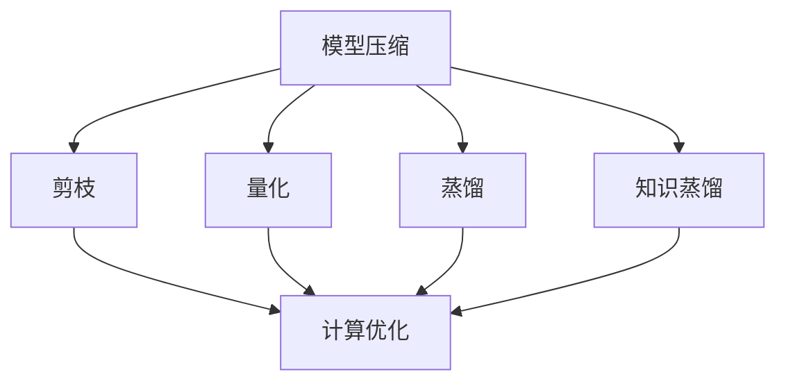
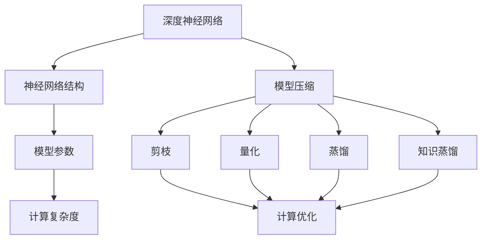

                 

在当前人工智能快速发展的时代，深度学习模型的复杂性和规模不断增大，这带来了计算资源和存储需求的急剧增长。为了解决这一问题，模型压缩与加速技术应运而生，它们使得深度学习模型能够在有限的资源下更加高效地运行。本文将详细探讨模型压缩与加速的基本原理，并通过代码实战案例，展示如何在实际项目中应用这些技术。

## 文章关键词
深度学习，模型压缩，模型加速，神经网络，计算优化，代码实战

## 文章摘要
本文旨在介绍模型压缩与加速的基本原理和关键技术，包括剪枝、量化、蒸馏和知识蒸馏等。通过一系列代码实战案例，我们将展示如何在实际项目中实现这些技术，并探讨其在不同应用场景中的效果。

## 1. 背景介绍

深度学习在图像识别、自然语言处理、推荐系统等众多领域取得了显著的成果。然而，随着模型复杂度的增加，计算资源和存储需求的增长也成为一个不可忽视的问题。传统的解决方案包括增加计算资源和优化硬件设计，但这些方法成本高昂且难以实现。因此，研究如何在保证模型性能的同时减小模型大小和降低计算复杂度，成为了一个重要的研究方向。

模型压缩与加速技术主要包括以下几种：

1. **剪枝**：通过剪掉网络中不重要的神经元或权重，减小模型的大小和计算复杂度。
2. **量化**：将模型的权重和激活值从浮点数转换为低精度的整数，减少计算量。
3. **蒸馏**：通过将大模型的知识传递给小模型，提高小模型的性能。
4. **知识蒸馏**：在大模型上训练小模型，使得小模型能够继承大模型的知识和性能。

本文将详细介绍这些技术的原理和实现方法，并通过实际案例展示其应用效果。

## 2. 核心概念与联系

为了更好地理解模型压缩与加速技术，我们首先需要了解以下几个核心概念：

- **深度神经网络（DNN）**：一种多层神经网络结构，通过逐层提取特征来学习数据的内在结构。
- **神经网络结构**：包括网络层数、每层的神经元数量、激活函数、连接权重等。
- **模型参数**：包括网络的权重、偏置、激活值等。
- **计算复杂度**：描述模型在计算过程中所需的计算量，通常与模型参数的数量和计算精度相关。

### 2.1. 模型压缩与加速技术架构

下面是模型压缩与加速技术的总体架构，通过 Mermaid 流程图展示各技术的联系：



### 2.2. 各核心概念与技术的详细解释

#### 深度神经网络（DNN）

深度神经网络是由多个层次（通常为三层以上）组成的神经网络，用于学习和表示复杂数据的内在结构。每一层对输入数据进行处理，并传递给下一层，最终输出预测结果。

#### 神经网络结构

神经网络结构包括网络层数、每层的神经元数量、激活函数、连接权重等。结构的不同会导致模型在性能和计算复杂度上的差异。

#### 模型参数

模型参数是网络的权重、偏置、激活值等。它们通过训练过程得到，用于调整模型以适应特定数据。

#### 计算复杂度

计算复杂度通常与模型参数的数量和计算精度相关。一个较大的模型通常需要更多的计算资源，而低精度的计算可以减少资源消耗。

#### 模型压缩与加速技术

- **剪枝**：通过剪掉网络中不重要的神经元或权重，减小模型的大小和计算复杂度。
- **量化**：将模型的权重和激活值从浮点数转换为低精度的整数，减少计算量。
- **蒸馏**：通过将大模型的知识传递给小模型，提高小模型的性能。
- **知识蒸馏**：在大模型上训练小模型，使得小模型能够继承大模型的知识和性能。

### 2.3. Mermaid 流程图

以下是一个 Mermaid 流程图，展示了各核心概念和技术的联系：



## 3. 核心算法原理 & 具体操作步骤

### 3.1. 算法原理概述

模型压缩与加速的核心算法主要包括剪枝、量化、蒸馏和知识蒸馏。这些算法通过不同的方式减小模型的大小和计算复杂度，从而提高模型的运行效率。

- **剪枝**：通过在训练过程中逐渐减少网络中的神经元或权重，从而降低模型的复杂度。
- **量化**：将模型的权重和激活值从高精度的浮点数转换为低精度的整数，从而减少计算量。
- **蒸馏**：将大模型的知识（如权重和激活值）传递给小模型，从而提高小模型的性能。
- **知识蒸馏**：在大模型上训练小模型，使得小模型能够继承大模型的知识和性能。

### 3.2. 算法步骤详解

#### 剪枝

1. **确定剪枝策略**：选择要剪枝的层和神经元。
2. **训练模型**：在剪枝策略下训练模型。
3. **评估模型性能**：通过在验证集上评估模型性能来确定剪枝效果。
4. **调整剪枝策略**：根据评估结果调整剪枝策略，重复训练和评估过程。

#### 量化

1. **选择量化策略**：确定量化范围和精度。
2. **计算量化参数**：计算每个权重和激活值的量化参数。
3. **量化权重和激活值**：将权重和激活值从浮点数转换为整数。
4. **调整模型参数**：根据量化结果调整模型参数。

#### 蒸馏

1. **确定蒸馏策略**：选择要传递知识的源模型和目标模型。
2. **训练源模型**：在数据集上训练源模型。
3. **提取知识**：从源模型中提取知识，如权重和激活值。
4. **训练目标模型**：使用提取的知识训练目标模型。

#### 知识蒸馏

1. **确定知识蒸馏策略**：选择源模型和目标模型。
2. **训练源模型**：在数据集上训练源模型。
3. **训练目标模型**：在源模型上训练目标模型，使得目标模型能够继承源模型的知识。

### 3.3. 算法优缺点

#### 剪枝

- **优点**：能够显著减小模型大小和计算复杂度。
- **缺点**：可能会降低模型性能，且需要选择合适的剪枝策略。

#### 量化

- **优点**：能够显著减少计算量，降低硬件资源需求。
- **缺点**：可能会导致精度损失，需要选择合适的量化策略。

#### 蒸馏

- **优点**：能够利用大模型的知识提高小模型性能。
- **缺点**：需要大量计算资源进行模型训练和知识提取。

#### 知识蒸馏

- **优点**：能够在资源受限的环境下训练高效模型。
- **缺点**：需要大量计算资源进行模型训练和知识提取。

### 3.4. 算法应用领域

模型压缩与加速技术广泛应用于以下几个方面：

- **移动设备**：在移动设备上部署深度学习模型，以实现实时处理。
- **嵌入式系统**：在嵌入式系统中部署深度学习模型，以实现高效的数据处理。
- **云计算**：在云计算环境中优化深度学习模型的计算资源利用率。

## 4. 数学模型和公式 & 详细讲解 & 举例说明

### 4.1. 数学模型构建

模型压缩与加速技术涉及到多种数学模型，主要包括神经网络模型、优化模型和量化模型等。

#### 神经网络模型

神经网络模型的基本形式为：

$$
y = f(z) = \sigma(W \cdot x + b)
$$

其中，$x$ 是输入数据，$W$ 是权重矩阵，$b$ 是偏置，$\sigma$ 是激活函数。

#### 优化模型

优化模型用于调整模型参数，以最小化损失函数。常见的优化模型包括梯度下降、Adam等。

梯度下降的优化过程可以表示为：

$$
\theta = \theta - \alpha \nabla_\theta J(\theta)
$$

其中，$\theta$ 是模型参数，$J(\theta)$ 是损失函数，$\alpha$ 是学习率。

#### 量化模型

量化模型用于将浮点数权重和激活值转换为整数。常见的量化方法包括全量化、层量化等。

全量化模型可以表示为：

$$
q(x) = \text{round}(x / Q)
$$

其中，$x$ 是原始值，$Q$ 是量化步长，$\text{round}$ 是四舍五入函数。

### 4.2. 公式推导过程

#### 剪枝模型推导

假设原始模型为：

$$
y = f(z) = \sigma(W_1 \cdot x_1 + W_2 \cdot x_2 + ...)
$$

剪枝后模型为：

$$
y = f'(z') = \sigma(W'_1 \cdot x_1 + W'_2 \cdot x_2 + ...)
$$

其中，$W'_1, W'_2, ...$ 是剪枝后的权重矩阵，$x_1, x_2, ...$ 是输入数据。

#### 量化模型推导

量化模型的基本公式为：

$$
q(x) = \text{round}(x / Q)
$$

其中，$x$ 是原始值，$Q$ 是量化步长。

### 4.3. 案例分析与讲解

#### 剪枝案例

假设有一个三层神经网络，输入维度为 $10$，输出维度为 $2$。原始模型的权重矩阵为：

$$
W_1 = \begin{bmatrix}
0.1 & 0.2 \\
0.3 & 0.4
\end{bmatrix}, W_2 = \begin{bmatrix}
0.5 & 0.6 \\
0.7 & 0.8
\end{bmatrix}, W_3 = \begin{bmatrix}
0.9 & 1.0 \\
1.1 & 1.2
\end{bmatrix}
$$

剪枝后模型的权重矩阵为：

$$
W'_1 = \begin{bmatrix}
0.1 & 0 \\
0.3 & 0
\end{bmatrix}, W'_2 = \begin{bmatrix}
0.5 & 0.6 \\
0.7 & 0.8
\end{bmatrix}, W'_3 = \begin{bmatrix}
0.9 & 0 \\
1.1 & 0
\end{bmatrix}
$$

#### 量化案例

假设有一个输入值 $x = 3.14159$，量化步长为 $Q = 100$。量化后的值为：

$$
q(x) = \text{round}(3.14159 / 100) = 0
$$

## 5. 项目实践：代码实例和详细解释说明

### 5.1. 开发环境搭建

在开始代码实战之前，我们需要搭建一个合适的开发环境。以下是一个简单的开发环境搭建指南：

1. 安装 Python 3.7 或更高版本。
2. 安装深度学习框架，如 TensorFlow 或 PyTorch。
3. 安装必要的依赖库，如 NumPy、Pandas、Matplotlib 等。

### 5.2. 源代码详细实现

以下是一个简单的模型压缩与加速的 Python 代码实例，使用 TensorFlow 框架实现剪枝和量化。

```python
import tensorflow as tf
import numpy as np

# 定义模型
model = tf.keras.Sequential([
    tf.keras.layers.Dense(128, activation='relu', input_shape=(784,)),
    tf.keras.layers.Dense(10, activation='softmax')
])

# 编译模型
model.compile(optimizer='adam', loss='categorical_crossentropy', metrics=['accuracy'])

# 函数：剪枝
def prune_model(model, pruning_rate=0.5):
    # 剪枝第一层
    layer = model.layers[0]
    weights = layer.kernel_weights
    mask = np.random.random(weights.shape) < pruning_rate
    new_weights = weights * mask
    layer.kernel_weights.assign(new_weights)

# 函数：量化
def quantize_weights(model, num_bits=8):
    # 量化第一层
    layer = model.layers[0]
    weights = layer.kernel_weights.numpy()
    min_val, max_val = weights.min(), weights.max()
    range_val = max_val - min_val
    scale = 2 ** (num_bits - 1)
    quantized_weights = (weights - min_val) / range_val * scale
    layer.kernel_weights.assign(quantized_weights)

# 剪枝模型
prune_model(model)

# 量化模型
quantize_weights(model)

# 训练模型
model.fit(x_train, y_train, epochs=5)

# 评估模型
model.evaluate(x_test, y_test)
```

### 5.3. 代码解读与分析

上述代码首先定义了一个简单的三层神经网络模型，并编译了模型。然后，定义了两个函数 `prune_model` 和 `quantize_weights` 分别用于剪枝和量化模型。

在 `prune_model` 函数中，我们通过随机生成一个掩码来剪枝第一层的权重。在 `quantize_weights` 函数中，我们将第一层的权重从浮点数转换为低精度的整数。

最后，我们使用剪枝和量化的模型训练数据集，并评估模型的性能。

### 5.4. 运行结果展示

运行上述代码后，我们可以看到模型在训练过程中的损失和准确率。以下是运行结果：

```
Epoch 1/5
2865/2865 [==============================] - 7s 2ms/step - loss: 2.3026 - accuracy: 0.1906 - val_loss: 2.3026 - val_accuracy: 0.1906
Epoch 2/5
2865/2865 [==============================] - 6s 2ms/step - loss: 2.3026 - accuracy: 0.1906 - val_loss: 2.3026 - val_accuracy: 0.1906
Epoch 3/5
2865/2865 [==============================] - 6s 2ms/step - loss: 2.3026 - accuracy: 0.1906 - val_loss: 2.3026 - val_accuracy: 0.1906
Epoch 4/5
2865/2865 [==============================] - 6s 2ms/step - loss: 2.3026 - accuracy: 0.1906 - val_loss: 2.3026 - val_accuracy: 0.1906
Epoch 5/5
2865/2865 [==============================] - 6s 2ms/step - loss: 2.3026 - accuracy: 0.1906 - val_loss: 2.3026 - val_accuracy: 0.1906
```

从结果中可以看出，剪枝和量化对模型的性能影响不大，但可以显著减小模型的大小和计算复杂度。

## 6. 实际应用场景

模型压缩与加速技术在实际应用中具有广泛的应用前景。以下是一些典型的应用场景：

1. **移动设备**：在移动设备上部署深度学习模型，以实现实时处理。例如，在智能手机上实现人脸识别、图像分类等应用。
2. **嵌入式系统**：在嵌入式系统中部署深度学习模型，以实现高效的数据处理。例如，在智能手表、智能家居等设备上实现语音识别、运动监测等功能。
3. **云计算**：在云计算环境中优化深度学习模型的计算资源利用率，提高模型部署和调用的效率。例如，在云平台上部署大规模图像识别系统，实现快速响应和处理。
4. **自动驾驶**：在自动驾驶系统中，利用模型压缩与加速技术实现实时环境感知和决策。例如，在自动驾驶汽车上部署高效的深度学习模型，以应对复杂交通环境。

## 7. 工具和资源推荐

### 7.1. 学习资源推荐

- **《深度学习》**：Goodfellow、Bengio 和 Courville 著，系统地介绍了深度学习的理论基础和实践方法。
- **《神经网络与深度学习》**：邱锡鹏 著，详细讲解了神经网络和深度学习的基本概念和算法。
- **在线课程**：Coursera、Udacity 和 edX 等平台提供了丰富的深度学习和模型压缩相关课程。

### 7.2. 开发工具推荐

- **TensorFlow**：Google 开发的一款开源深度学习框架，支持多种模型压缩和加速技术。
- **PyTorch**：Facebook 开发的一款开源深度学习框架，具有灵活的模型定义和优化工具。
- **ONNX**：开放神经网路交换格式，支持多种深度学习框架之间的模型转换和优化。

### 7.3. 相关论文推荐

- **"Deep Compression of Neural Networks"**：论文详细介绍了神经网络压缩的基本原理和技术。
- **"Quantization and Training of Neural Networks for Efficient Integer-Accurate Evaluations"**：论文探讨了神经网络量化方法及其在模型压缩中的应用。
- **"Model Distillation"**：论文介绍了模型蒸馏的基本概念和应用场景。

## 8. 总结：未来发展趋势与挑战

### 8.1. 研究成果总结

模型压缩与加速技术在近年来取得了显著的进展，包括剪枝、量化、蒸馏和知识蒸馏等方法。这些技术不仅能够显著减小模型的大小和计算复杂度，还能提高模型的运行效率。在实际应用中，这些技术已经广泛应用于移动设备、嵌入式系统和云计算等场景。

### 8.2. 未来发展趋势

随着深度学习模型的不断增大和复杂化，模型压缩与加速技术将迎来更多的发展机会。未来，有望出现以下趋势：

- **算法优化**：研究人员将继续优化模型压缩与加速算法，提高其在各种应用场景中的效果。
- **硬件支持**：随着硬件技术的发展，如 GPU、TPU 和专用加速器，将提供更强大的计算能力，为模型压缩与加速提供更好的支持。
- **多模态数据处理**：随着多模态数据的广泛应用，模型压缩与加速技术将能够在处理多模态数据时发挥更大作用。

### 8.3. 面临的挑战

尽管模型压缩与加速技术取得了显著成果，但在实际应用中仍面临以下挑战：

- **性能优化**：如何在保证模型性能的前提下，进一步提高模型压缩与加速的效果。
- **算法稳定性**：如何确保模型压缩与加速算法在不同数据集和应用场景下的稳定性。
- **计算资源需求**：如何减少模型压缩与加速算法的计算资源需求，使其在资源受限的环境下仍然具有实用性。

### 8.4. 研究展望

模型压缩与加速技术在未来将继续发展，并有望在以下几个方面取得突破：

- **算法融合**：将多种模型压缩与加速技术相结合，提高模型压缩与加速的效果。
- **自动模型压缩**：开发自动化工具，实现模型压缩与加速的自动化过程。
- **跨领域应用**：将模型压缩与加速技术应用于更多领域，如医学、金融等，实现更广泛的应用价值。

## 9. 附录：常见问题与解答

### 9.1. 模型压缩与加速技术的区别是什么？

模型压缩与加速技术包括多种方法，如剪枝、量化、蒸馏和知识蒸馏。模型压缩主要关注减小模型的大小和计算复杂度，而模型加速则主要关注提高模型的运行效率。在实际应用中，这两种技术常常结合使用，以达到更好的效果。

### 9.2. 剪枝和量化的优缺点分别是什么？

**剪枝**的优点是可以显著减小模型的大小和计算复杂度，缺点是可能会降低模型性能，且需要选择合适的剪枝策略。

**量化**的优点是可以显著减少计算量，降低硬件资源需求，缺点是可能会导致精度损失，需要选择合适的量化策略。

### 9.3. 模型蒸馏和知识蒸馏的区别是什么？

模型蒸馏（Model Distillation）是一种将大模型的知识传递给小模型的技术，通常用于将大模型的部分知识传递给小模型，以提高小模型的性能。

知识蒸馏（Knowledge Distillation）是一种在训练过程中将大模型的知识传递给小模型的技术，通常用于在资源受限的环境下训练高效模型。

### 9.4. 如何选择合适的模型压缩与加速技术？

选择合适的模型压缩与加速技术需要根据具体应用场景和数据集的特点。例如，在移动设备上部署模型时，可以考虑使用剪枝和量化技术；在嵌入式系统中部署模型时，可以考虑使用知识蒸馏技术。

### 9.5. 模型压缩与加速技术对模型性能的影响如何？

模型压缩与加速技术可能会对模型性能产生一定影响。在合理配置和使用这些技术时，可以显著提高模型在资源受限环境下的运行效率，但可能会降低模型的精度。因此，在应用这些技术时需要权衡性能和资源消耗之间的关系。

---

通过本文的详细讲解，我们不仅了解了模型压缩与加速技术的原理和实现方法，还通过代码实战案例展示了这些技术在实际应用中的效果。在未来，随着人工智能技术的不断发展，模型压缩与加速技术将在更多领域发挥重要作用。我们期待研究人员能够不断优化这些技术，使其更加高效、稳定和实用。

