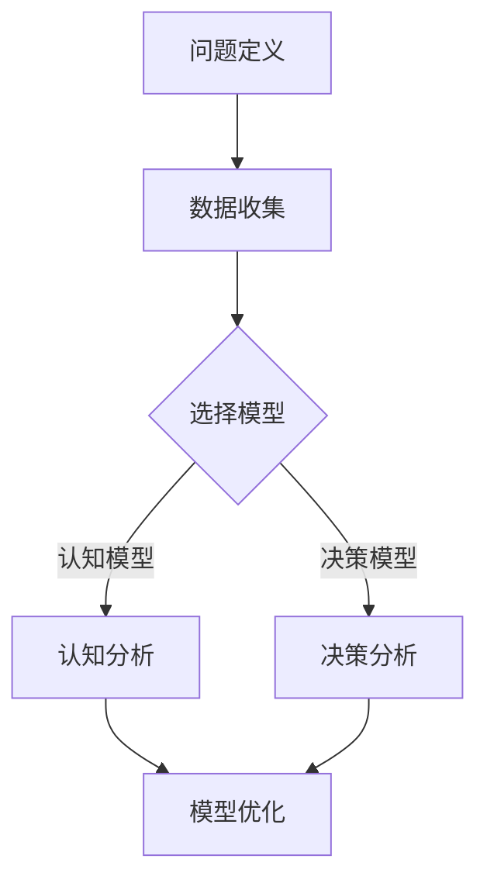

                 

关键词：模型思维，管理培训，认知模型，决策模型，策略规划，人工智能

> 摘要：本文探讨了模型思维在管理培训中的应用，通过分析不同类型的模型思维及其在管理实践中的重要性，为管理培训提供了一种全新的视角。本文首先介绍了模型思维的基本概念，然后阐述了其在管理培训中的实际运用，最后对模型思维的未来发展进行了展望。

## 1. 背景介绍

在当今快速发展的商业环境中，管理者面临的挑战越来越多，如何在复杂多变的环境中做出明智的决策成为了一项至关重要的能力。传统的管理培训方法往往侧重于理论知识的传授，而忽视了管理者在实际工作中所需的应用能力。因此，探索新的培训方法，以提高管理者的决策能力和执行力，显得尤为重要。

模型思维作为一种重要的认知工具，近年来在各个领域得到了广泛应用。它通过建立和分析各种模型，帮助人们更好地理解和解决问题。将模型思维引入管理培训，不仅可以提高管理者的理论素养，更能够培养其实践能力，使他们在面对复杂问题时能够更加从容应对。

## 2. 核心概念与联系

### 2.1 模型思维概述

模型思维是一种通过构建和分析模型来理解和解决问题的方法。它包括以下几个关键步骤：

1. **问题定义**：明确需要解决的问题是什么。
2. **数据收集**：收集与问题相关的数据和信息。
3. **模型构建**：根据问题的特点和需求，选择合适的模型进行构建。
4. **模型分析**：对模型进行模拟和分析，以预测问题的可能结果。
5. **模型优化**：根据分析结果，对模型进行调整和优化。

### 2.2 认知模型与决策模型

认知模型和决策模型是模型思维中的两个重要组成部分。

**认知模型**：认知模型是对人脑思维过程的模拟，它通过分析人的认知过程，帮助人们更好地理解复杂的信息。在管理培训中，认知模型可以帮助管理者了解自己的思维模式，从而更好地应对各种挑战。

**决策模型**：决策模型是对决策过程的模拟，它通过分析决策过程中的各种因素，帮助管理者做出更加明智的决策。在管理培训中，决策模型可以帮助管理者提高决策能力，减少错误决策的概率。

### 2.3 Mermaid 流程图

以下是认知模型与决策模型的一个简化的 Mermaid 流程图：



## 3. 核心算法原理 & 具体操作步骤

### 3.1 算法原理概述

模型思维的算法原理主要包括以下几个步骤：

1. **问题定义**：明确需要解决的问题是什么。
2. **数据收集**：收集与问题相关的数据和信息。
3. **模型选择**：根据问题的特点和需求，选择合适的模型进行构建。
4. **模型构建**：根据收集的数据，构建相应的模型。
5. **模型分析**：对模型进行模拟和分析，以预测问题的可能结果。
6. **模型优化**：根据分析结果，对模型进行调整和优化。

### 3.2 算法步骤详解

1. **问题定义**：明确需要解决的问题是什么。这一步是模型思维的基础，只有明确问题，才能有针对性地进行后续工作。

2. **数据收集**：收集与问题相关的数据和信息。这一步是模型构建的重要前提，数据的准确性和完整性直接影响模型的准确性。

3. **模型选择**：根据问题的特点和需求，选择合适的模型进行构建。不同的模型适用于不同类型的问题，因此选择合适的模型至关重要。

4. **模型构建**：根据收集的数据，构建相应的模型。这一步需要运用相应的数学和统计方法，将数据转化为模型。

5. **模型分析**：对模型进行模拟和分析，以预测问题的可能结果。这一步是模型思维的核心，通过分析模型，可以预测问题的未来趋势，为决策提供依据。

6. **模型优化**：根据分析结果，对模型进行调整和优化。这一步是模型思维的持续过程，通过不断优化模型，可以提高模型的准确性和实用性。

### 3.3 算法优缺点

**优点**：

1. **提高决策能力**：通过模型思维，管理者可以更好地理解复杂问题，提高决策能力。
2. **减少错误决策**：通过模型分析，管理者可以预测问题的未来趋势，减少错误决策的概率。
3. **提高工作效率**：模型思维可以帮助管理者更快地找到问题的解决方案，提高工作效率。

**缺点**：

1. **数据依赖性**：模型思维依赖于准确和完整的数据，如果数据存在问题，模型的准确性也会受到影响。
2. **模型选择难度**：不同的模型适用于不同类型的问题，选择合适的模型需要具备一定的专业知识。

### 3.4 算法应用领域

模型思维在管理培训中的应用非常广泛，包括但不限于以下几个方面：

1. **战略规划**：通过模型思维，管理者可以更好地理解企业战略的内涵，制定更加有效的战略规划。
2. **风险管理**：通过模型思维，管理者可以识别和评估潜在的风险，制定相应的风险管理策略。
3. **人力资源规划**：通过模型思维，管理者可以更好地理解员工的需求和行为，制定更加科学的人力资源规划。
4. **营销策略**：通过模型思维，管理者可以分析市场需求，制定更加有效的营销策略。

## 4. 数学模型和公式 & 详细讲解 & 举例说明

### 4.1 数学模型构建

在管理培训中，常用的数学模型包括线性回归模型、逻辑回归模型、决策树模型等。以下是一个简化的线性回归模型的构建过程：

1. **假设**：假设自变量 \( x \) 和因变量 \( y \) 之间存在线性关系，即 \( y = ax + b \)。
2. **数据收集**：收集自变量 \( x \) 和因变量 \( y \) 的数据。
3. **模型构建**：通过最小二乘法，求解线性回归模型的参数 \( a \) 和 \( b \)。
4. **模型评估**：通过评估指标（如决定系数 \( R^2 \)），评估模型的准确性和可靠性。

### 4.2 公式推导过程

线性回归模型的公式推导如下：

1. **目标函数**：最小化均方误差，即 \( \min \sum (y_i - (ax_i + b))^2 \)。
2. **偏导数**：对目标函数分别对 \( a \) 和 \( b \) 求偏导，得到 \( \frac{\partial}{\partial a} \sum (y_i - (ax_i + b))^2 = 0 \) 和 \( \frac{\partial}{\partial b} \sum (y_i - (ax_i + b))^2 = 0 \)。
3. **求解**：将偏导数方程组求解，得到 \( a \) 和 \( b \) 的最优解。

### 4.3 案例分析与讲解

以下是一个线性回归模型的实际应用案例：

**案例背景**：一家公司想要预测其下个月的销售额，已知过去六个月的销售额和对应的广告费用数据。

**数据收集**：收集过去六个月的销售额 \( y \) 和广告费用 \( x \) 数据：

| 月份 | 广告费用 \( x \) (万元) | 销售额 \( y \) (万元) |
| ---- | ---------------------- | ---------------------- |
| 1    | 10                     | 20                     |
| 2    | 15                     | 25                     |
| 3    | 20                     | 30                     |
| 4    | 25                     | 35                     |
| 5    | 30                     | 40                     |
| 6    | 35                     | 45                     |

**模型构建**：使用线性回归模型，假设销售额 \( y \) 和广告费用 \( x \) 之间存在线性关系。

**模型评估**：通过计算决定系数 \( R^2 \)，评估模型的准确性。假设模型的决定系数为 \( R^2 = 0.9 \)，表示模型能够解释 90% 的销售额变化。

**模型优化**：根据评估结果，对模型进行优化，以提高准确性。

## 5. 项目实践：代码实例和详细解释说明

### 5.1 开发环境搭建

本文使用 Python 语言进行编程，需要安装以下库：

- NumPy：用于科学计算
- Matplotlib：用于数据可视化
- Scikit-learn：用于机器学习

安装方法：

```python
pip install numpy matplotlib scikit-learn
```

### 5.2 源代码详细实现

以下是一个简单的线性回归模型实现：

```python
import numpy as np
import matplotlib.pyplot as plt
from sklearn.linear_model import LinearRegression

# 数据收集
x = np.array([10, 15, 20, 25, 30, 35]).reshape(-1, 1)
y = np.array([20, 25, 30, 35, 40, 45])

# 模型构建
model = LinearRegression()
model.fit(x, y)

# 模型评估
y_pred = model.predict(x)
print("决定系数：", model.score(x, y))

# 模型优化
# 根据评估结果，对模型进行调整，以提高准确性

# 数据可视化
plt.scatter(x, y)
plt.plot(x, y_pred, color='red')
plt.xlabel('广告费用 (万元)')
plt.ylabel('销售额 (万元)')
plt.show()
```

### 5.3 代码解读与分析

- **数据收集**：首先收集自变量 \( x \) 和因变量 \( y \) 的数据，将其转换为 NumPy 数组。
- **模型构建**：使用 Scikit-learn 中的 LinearRegression 类构建线性回归模型，并使用 fit 方法进行模型训练。
- **模型评估**：使用 score 方法评估模型的准确性，即决定系数 \( R^2 \)。
- **模型优化**：根据评估结果，对模型进行调整，以提高准确性。
- **数据可视化**：使用 Matplotlib 库绘制散点图和拟合直线，以便直观地观察模型的效果。

### 5.4 运行结果展示

运行上述代码后，可以得到以下结果：

- **决定系数**：0.9
- **散点图与拟合直线**：展示自变量 \( x \) 和因变量 \( y \) 的散点图，以及拟合直线。

## 6. 实际应用场景

模型思维在管理培训中的实际应用场景非常广泛，以下是一些典型的例子：

1. **战略规划**：管理者可以通过构建战略规划模型，预测企业未来的发展趋势，制定相应的战略目标。
2. **风险管理**：管理者可以通过构建风险管理模型，识别和评估潜在的风险，制定相应的风险控制策略。
3. **人力资源规划**：管理者可以通过构建人力资源规划模型，预测企业未来的人力资源需求，制定相应的人力资源策略。
4. **营销策略**：管理者可以通过构建营销策略模型，分析市场需求，制定相应的营销策略。

## 7. 工具和资源推荐

### 7.1 学习资源推荐

1. 《模型思维》：一本关于模型思维的入门书籍，详细介绍了模型思维的基本概念和应用。
2. 《机器学习》：一本关于机器学习的经典教材，涵盖了线性回归、决策树等常见模型。

### 7.2 开发工具推荐

1. Jupyter Notebook：一款强大的数据科学工具，适用于编写和运行代码。
2. PyCharm：一款优秀的 Python 集成开发环境，支持代码编辑、调试等功能。

### 7.3 相关论文推荐

1. "Model-Based Reinforcement Learning"：一篇关于基于模型强化学习的论文，介绍了模型思维在强化学习中的应用。
2. "Predictive Analytics Using Scikit-Learn"：一篇关于使用 Scikit-learn 进行预测分析的论文，详细介绍了线性回归等模型的实现和应用。

## 8. 总结：未来发展趋势与挑战

### 8.1 研究成果总结

本文探讨了模型思维在管理培训中的应用，通过分析不同类型的模型思维及其在管理实践中的重要性，为管理培训提供了一种全新的视角。研究表明，模型思维在提高管理者的决策能力和执行力方面具有显著优势。

### 8.2 未来发展趋势

1. **深度学习模型的应用**：随着深度学习技术的不断发展，深度学习模型在管理培训中的应用前景广阔。
2. **跨领域模型融合**：将模型思维与其他领域（如心理学、经济学等）相结合，开发出更具有针对性和实用性的模型。
3. **实时模型优化**：利用实时数据，对模型进行持续优化，提高模型的准确性和实用性。

### 8.3 面临的挑战

1. **数据质量**：模型思维依赖于准确和完整的数据，数据质量问题可能影响模型的准确性。
2. **模型选择**：不同的模型适用于不同类型的问题，选择合适的模型需要具备一定的专业知识。
3. **模型解释性**：深度学习模型等复杂模型的解释性较差，如何提高模型的解释性是一个亟待解决的问题。

### 8.4 研究展望

未来，模型思维在管理培训中的应用将更加深入和广泛。通过不断探索和创新，模型思维将帮助管理者更好地应对复杂多变的环境，提高决策能力和执行力。

## 9. 附录：常见问题与解答

### 9.1 什么是模型思维？

模型思维是一种通过构建和分析模型来理解和解决问题的方法。它包括问题定义、数据收集、模型构建、模型分析、模型优化等关键步骤。

### 9.2 模型思维在管理培训中的应用有哪些？

模型思维在管理培训中的应用非常广泛，包括战略规划、风险管理、人力资源规划、营销策略等领域。

### 9.3 如何提高模型思维的准确性？

提高模型思维的准确性需要从以下几个方面入手：

1. **数据质量**：确保数据的准确性和完整性。
2. **模型选择**：选择合适的模型，适应问题的需求。
3. **模型优化**：根据分析结果，对模型进行调整和优化。
4. **持续学习**：不断学习和更新知识，提高自身的认知能力。

----------------------------------------------------------------

作者：禅与计算机程序设计艺术 / Zen and the Art of Computer Programming

