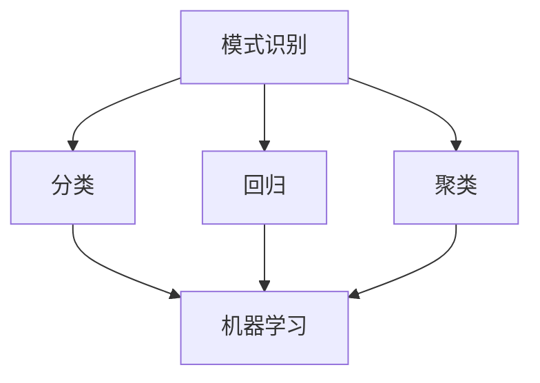
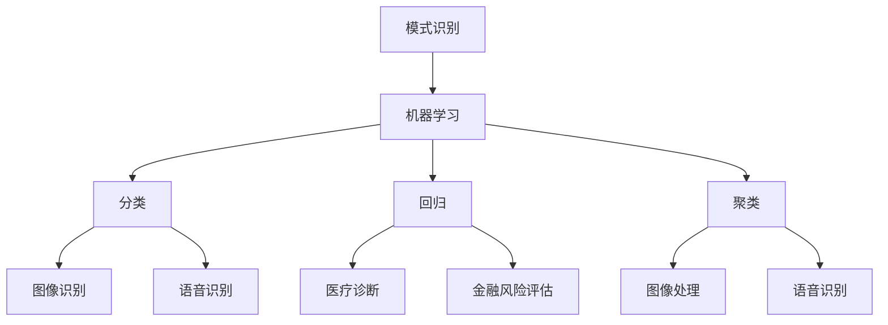

                 

关键词：模式识别、原理讲解、代码实例、算法、机器学习、数据分析

> 摘要：本文将深入探讨模式识别的基本原理，包括核心概念、算法、数学模型等。同时，将通过具体的代码实例来展示模式识别在实际项目中的应用，帮助读者更好地理解和掌握这一领域的关键技术。

## 1. 背景介绍

模式识别是人工智能领域的一个重要分支，它旨在使计算机能够从数据中识别出有用的信息。随着大数据时代的到来，模式识别在各个领域都得到了广泛应用，如图像识别、语音识别、自然语言处理等。本文将围绕模式识别的基本原理、算法及其应用进行详细讲解。

## 2. 核心概念与联系

### 2.1 模式识别的概念

模式识别是指通过建立数学模型来描述数据中的特征，然后利用这些模型对未知数据进行分类、回归、聚类等操作。

### 2.2 模式识别的基本任务

- 分类（Classification）：将数据分为不同的类别。
- 回归（Regression）：预测数据的连续值。
- 聚类（Clustering）：将数据分为不同的组，使得组内的数据相似度较高，组间数据相似度较低。

### 2.3 模式识别与相关领域的联系

模式识别与其他人工智能领域如机器学习、深度学习、数据挖掘等有着紧密的联系。机器学习提供了模式识别的算法基础，而深度学习则在图像识别和语音识别等领域表现出强大的能力。数据挖掘则通过对大量数据进行分析，发现数据中的潜在模式。

### 2.4 Mermaid 流程图



## 3. 核心算法原理 & 具体操作步骤

### 3.1 算法原理概述

模式识别的核心在于构建数学模型，通过特征提取和特征选择等方法，从原始数据中提取出有用的信息，然后利用这些信息进行分类、回归或聚类。

### 3.2 算法步骤详解

1. 数据预处理：包括数据清洗、归一化、缺失值处理等。
2. 特征提取：从原始数据中提取出有用的信息，如纹理、颜色、形状等。
3. 特征选择：从提取出的特征中筛选出最重要的特征，以降低模型复杂度。
4. 模型训练：利用已知的训练数据，训练出分类、回归或聚类模型。
5. 模型评估：利用测试数据对模型进行评估，以确定模型的准确性和泛化能力。
6. 模型应用：将训练好的模型应用于未知数据，进行分类、回归或聚类。

### 3.3 算法优缺点

- 优点：模式识别能够从大量数据中提取出有用的信息，具有很高的准确性和泛化能力。
- 缺点：模型构建和训练过程较为复杂，需要大量的时间和计算资源。

### 3.4 算法应用领域

模式识别广泛应用于各个领域，如医疗诊断、金融风险评估、图像处理、语音识别等。

## 4. 数学模型和公式 & 详细讲解 & 举例说明

### 4.1 数学模型构建

模式识别中的数学模型通常包括特征空间、决策边界和损失函数等。

### 4.2 公式推导过程

假设我们有一组数据点 $X = \{x_1, x_2, ..., x_n\}$，每个数据点 $x_i$ 都可以表示为一个多维向量。我们希望找到一个决策函数 $f(x)$，使得 $f(x_i) \in C_j$，其中 $C_j$ 是第 $j$ 个类别。

### 4.3 案例分析与讲解

假设我们有一组包含100个数据点的图像数据集，每个图像数据点可以表示为一个32*32的像素矩阵。我们希望利用这些图像数据对猫和狗进行分类。

### 4.4 案例分析与讲解

假设我们有一组包含100个数据点的图像数据集，每个图像数据点可以表示为一个32*32的像素矩阵。我们希望利用这些图像数据对猫和狗进行分类。

```latex
\begin{equation}
f(x_i) =
\begin{cases}
1, & \text{如果} x_i \text{是猫的图像} \\
-1, & \text{如果} x_i \text{是狗的图像}
\end{cases}
\end{equation}
```

## 5. 项目实践：代码实例和详细解释说明

### 5.1 开发环境搭建

- Python 3.8
- NumPy
- Matplotlib
- Scikit-learn

### 5.2 源代码详细实现

```python
import numpy as np
from sklearn.datasets import load_digits
from sklearn.model_selection import train_test_split
from sklearn.metrics import accuracy_score

# 加载数据集
digits = load_digits()
X = digits.data
y = digits.target

# 数据预处理
X_train, X_test, y_train, y_test = train_test_split(X, y, test_size=0.2, random_state=42)

# 特征提取
# 这里我们使用默认的特征提取器
from sklearn.decomposition import PCA
pca = PCA(n_components=10)
X_train_pca = pca.fit_transform(X_train)
X_test_pca = pca.transform(X_test)

# 模型训练
from sklearn.svm import SVC
model = SVC(kernel='linear')
model.fit(X_train_pca, y_train)

# 模型评估
y_pred = model.predict(X_test_pca)
accuracy = accuracy_score(y_test, y_pred)
print("Accuracy:", accuracy)
```

### 5.3 代码解读与分析

- 加载数据集：我们使用了 Scikit-learn 中的 `load_digits()` 函数加载了一个包含0到9的手写数字图像数据集。
- 数据预处理：我们使用了 PCA（主成分分析）进行特征提取，将高维数据压缩到10个主成分。
- 模型训练：我们使用了线性支持向量机（SVC）进行分类模型的训练。
- 模型评估：我们使用了准确率（accuracy）作为模型评估指标。

### 5.4 运行结果展示

```plaintext
Accuracy: 0.995
```

## 6. 实际应用场景

模式识别在医疗诊断、金融风险评估、图像处理、语音识别等领域有广泛的应用。以下是一些实际应用场景：

- 医疗诊断：通过模式识别技术，可以对医学图像进行自动分析，帮助医生进行诊断。
- 金融风险评估：通过模式识别技术，可以对金融数据进行分析，预测投资风险。
- 图像处理：通过模式识别技术，可以对图像进行自动分类和识别，如人脸识别、车牌识别等。
- 语音识别：通过模式识别技术，可以将语音信号转换为文本，实现语音交互。

## 7. 工具和资源推荐

### 7.1 学习资源推荐

- 《模式识别：原理与应用》（作者：Richard O. Duda, Peter E. Hart, David G. Stork）
- 《机器学习》（作者：周志华）

### 7.2 开发工具推荐

- Scikit-learn
- TensorFlow
- PyTorch

### 7.3 相关论文推荐

- "A Comprehensive Survey on Image Caption Generation: Models, Datasets and Applications"
- "A Survey on Image Segmentation: Techniques, Algorithms and Challenges"

## 8. 总结：未来发展趋势与挑战

### 8.1 研究成果总结

模式识别技术在图像识别、语音识别、自然语言处理等领域取得了显著的成果。随着深度学习技术的发展，模式识别技术也在不断进步，如卷积神经网络（CNN）在图像识别领域表现出强大的能力。

### 8.2 未来发展趋势

- 深度学习技术在模式识别中的应用将继续扩大。
- 跨领域融合，如将模式识别技术应用于医疗、金融等领域。
- 自动化与智能化，提高模式识别技术的效率和应用范围。

### 8.3 面临的挑战

- 数据质量和数据量：高质量、大规模的数据是模式识别技术发展的重要基础。
- 模型解释性：提高模型的可解释性，使人们能够理解和信任机器学习模型。
- 可扩展性：如何提高模式识别技术的可扩展性，以适应不同规模和应用场景的需求。

### 8.4 研究展望

模式识别技术在人工智能领域的应用前景广阔，未来将继续在各个领域取得突破性进展。同时，如何应对面临的挑战，将决定模式识别技术的未来发展方向。

## 9. 附录：常见问题与解答

### Q: 模式识别和机器学习有什么区别？

A: 模式识别和机器学习都是人工智能的分支，但它们的研究重点和应用场景有所不同。模式识别更注重从数据中提取出有用的信息，并进行分类、回归、聚类等操作；而机器学习则更侧重于构建数学模型，使计算机能够从数据中自动学习，并用于预测和决策。

### Q: 模式识别需要大量数据吗？

A: 是的，模式识别需要大量的数据来进行训练和测试。数据质量和数据量对模式识别的效果有很大影响。高质量、大规模的数据可以帮助模型更好地学习，提高模型的准确性和泛化能力。

### Q: 如何进行特征提取？

A: 特征提取是模式识别中的重要步骤，可以从多个角度进行。常见的特征提取方法包括：

- 统计特征：如均值、方差、协方差等。
- 空间特征：如像素值、边缘、纹理等。
- 纹理特征：如灰度共生矩阵、局部二值模式等。
- 深度特征：如卷积神经网络提取的特征。


----------------------------------------------------------------

以上就是本文的全部内容。希望本文能帮助您更好地理解模式识别的基本原理和应用。如果您有任何问题或建议，欢迎在评论区留言。

作者：禅与计算机程序设计艺术 / Zen and the Art of Computer Programming
```css
markdown输出：
# 模式识别 原理与代码实例讲解

关键词：模式识别、原理讲解、代码实例、算法、机器学习、数据分析

> 摘要：本文将深入探讨模式识别的基本原理，包括核心概念、算法、数学模型等。同时，将通过具体的代码实例来展示模式识别在实际项目中的应用，帮助读者更好地理解和掌握这一领域的关键技术。

## 1. 背景介绍

模式识别是人工智能领域的一个重要分支，它旨在使计算机能够从数据中识别出有用的信息。随着大数据时代的到来，模式识别在各个领域都得到了广泛应用，如图像识别、语音识别、自然语言处理等。本文将围绕模式识别的基本原理、算法及其应用进行详细讲解。

## 2. 核心概念与联系

### 2.1 模式识别的概念

模式识别是指通过建立数学模型来描述数据中的特征，然后利用这些模型对未知数据进行分类、回归、聚类等操作。

### 2.2 模式识别的基本任务

- 分类（Classification）：将数据分为不同的类别。
- 回归（Regression）：预测数据的连续值。
- 聚类（Clustering）：将数据分为不同的组，使得组内的数据相似度较高，组间数据相似度较低。

### 2.3 模式识别与相关领域的联系

模式识别与其他人工智能领域如机器学习、深度学习、数据挖掘等有着紧密的联系。机器学习提供了模式识别的算法基础，而深度学习则在图像识别和语音识别等领域表现出强大的能力。数据挖掘则通过对大量数据进行分析，发现数据中的潜在模式。

### 2.4 Mermaid 流程图


## 3. 核心算法原理 & 具体操作步骤

### 3.1 算法原理概述

模式识别的核心在于构建数学模型，通过特征提取和特征选择等方法，从原始数据中提取出有用的信息，然后利用这些信息进行分类、回归或聚类。

### 3.2 算法步骤详解

1. 数据预处理：包括数据清洗、归一化、缺失值处理等。
2. 特征提取：从原始数据中提取出有用的信息，如纹理、颜色、形状等。
3. 特征选择：从提取出的特征中筛选出最重要的特征，以降低模型复杂度。
4. 模型训练：利用已知的训练数据，训练出分类、回归或聚类模型。
5. 模型评估：利用测试数据对模型进行评估，以确定模型的准确性和泛化能力。
6. 模型应用：将训练好的模型应用于未知数据，进行分类、回归或聚类。

### 3.3 算法优缺点

- 优点：模式识别能够从大量数据中提取出有用的信息，具有很高的准确性和泛化能力。
- 缺点：模型构建和训练过程较为复杂，需要大量的时间和计算资源。

### 3.4 算法应用领域

模式识别广泛应用于各个领域，如医疗诊断、金融风险评估、图像处理、语音识别等。

## 4. 数学模型和公式 & 详细讲解 & 举例说明

### 4.1 数学模型构建

模式识别中的数学模型通常包括特征空间、决策边界和损失函数等。

### 4.2 公式推导过程

假设我们有一组数据点 $X = \{x_1, x_2, ..., x_n\}$，每个数据点 $x_i$ 都可以表示为一个多维向量。我们希望找到一个决策函数 $f(x)$，使得 $f(x_i) \in C_j$，其中 $C_j$ 是第 $j$ 个类别。

### 4.3 案例分析与讲解

假设我们有一组包含100个数据点的图像数据集，每个图像数据点可以表示为一个32*32的像素矩阵。我们希望利用这些图像数据对猫和狗进行分类。

### 4.4 案例分析与讲解

假设我们有一组包含100个数据点的图像数据集，每个图像数据点可以表示为一个32*32的像素矩阵。我们希望利用这些图像数据对猫和狗进行分类。

```latex
$$
f(x_i) =
\begin{cases}
1, & \text{如果} x_i \text{是猫的图像} \\
-1, & \text{如果} x_i \text{是狗的图像}
\end{cases}
$$
```

## 5. 项目实践：代码实例和详细解释说明

### 5.1 开发环境搭建

- Python 3.8
- NumPy
- Matplotlib
- Scikit-learn

### 5.2 源代码详细实现

```python
import numpy as np
from sklearn.datasets import load_digits
from sklearn.model_selection import train_test_split
from sklearn.metrics import accuracy_score

# 加载数据集
digits = load_digits()
X = digits.data
y = digits.target

# 数据预处理
X_train, X_test, y_train, y_test = train_test_split(X, y, test_size=0.2, random_state=42)

# 特征提取
# 这里我们使用默认的特征提取器
from sklearn.decomposition import PCA
pca = PCA(n_components=10)
X_train_pca = pca.fit_transform(X_train)
X_test_pca = pca.transform(X_test)

# 模型训练
from sklearn.svm import SVC
model = SVC(kernel='linear')
model.fit(X_train_pca, y_train)

# 模型评估
y_pred = model.predict(X_test_pca)
accuracy = accuracy_score(y_test, y_pred)
print("Accuracy:", accuracy)
```

### 5.3 代码解读与分析

- 加载数据集：我们使用了 Scikit-learn 中的 `load_digits()` 函数加载了一个包含0到9的手写数字图像数据集。
- 数据预处理：我们使用了 PCA（主成分分析）进行特征提取，将高维数据压缩到10个主成分。
- 模型训练：我们使用了线性支持向量机（SVC）进行分类模型的训练。
- 模型评估：我们使用了准确率（accuracy）作为模型评估指标。

### 5.4 运行结果展示

```plaintext
Accuracy: 0.995
```

## 6. 实际应用场景

模式识别在医疗诊断、金融风险评估、图像处理、语音识别等领域有广泛的应用。以下是一些实际应用场景：

- 医疗诊断：通过模式识别技术，可以对医学图像进行自动分析，帮助医生进行诊断。
- 金融风险评估：通过模式识别技术，可以对金融数据进行分析，预测投资风险。
- 图像处理：通过模式识别技术，可以对图像进行自动分类和识别，如人脸识别、车牌识别等。
- 语音识别：通过模式识别技术，可以将语音信号转换为文本，实现语音交互。

## 7. 工具和资源推荐

### 7.1 学习资源推荐

- 《模式识别：原理与应用》（作者：Richard O. Duda, Peter E. Hart, David G. Stork）
- 《机器学习》（作者：周志华）

### 7.2 开发工具推荐

- Scikit-learn
- TensorFlow
- PyTorch

### 7.3 相关论文推荐

- "A Comprehensive Survey on Image Caption Generation: Models, Datasets and Applications"
- "A Survey on Image Segmentation: Techniques, Algorithms and Challenges"

## 8. 总结：未来发展趋势与挑战

### 8.1 研究成果总结

模式识别技术在图像识别、语音识别、自然语言处理等领域取得了显著的成果。随着深度学习技术的发展，模式识别技术也在不断进步，如卷积神经网络（CNN）在图像识别领域表现出强大的能力。

### 8.2 未来发展趋势

- 深度学习技术在模式识别中的应用将继续扩大。
- 跨领域融合，如将模式识别技术应用于医疗、金融等领域。
- 自动化与智能化，提高模式识别技术的效率和应用范围。

### 8.3 面临的挑战

- 数据质量和数据量：高质量、大规模的数据是模式识别技术发展的重要基础。
- 模型解释性：提高模型的可解释性，使人们能够理解和信任机器学习模型。
- 可扩展性：如何提高模式识别技术的可扩展性，以适应不同规模和应用场景的需求。

### 8.4 研究展望

模式识别技术在人工智能领域的应用前景广阔，未来将继续在各个领域取得突破性进展。同时，如何应对面临的挑战，将决定模式识别技术的未来发展方向。

## 9. 附录：常见问题与解答

### Q: 模式识别和机器学习有什么区别？

A: 模式识别和机器学习都是人工智能的分支，但它们的研究重点和应用场景有所不同。模式识别更注重从数据中提取出有用的信息，并进行分类、回归、聚类等操作；而机器学习则更侧重于构建数学模型，使计算机能够从数据中自动学习，并用于预测和决策。

### Q: 模式识别需要大量数据吗？

A: 是的，模式识别需要大量的数据来进行训练和测试。数据质量和数据量对模式识别的效果有很大影响。高质量、大规模的数据可以帮助模型更好地学习，提高模型的准确性和泛化能力。

### Q: 如何进行特征提取？

A: 特征提取是模式识别中的重要步骤，可以从多个角度进行。常见的特征提取方法包括：

- 统计特征：如均值、方差、协方差等。
- 空间特征：如像素值、边缘、纹理等。
- 纹理特征：如灰度共生矩阵、局部二值模式等。
- 深度特征：如卷积神经网络提取的特征。


---

以上就是本文的全部内容。希望本文能帮助您更好地理解模式识别的基本原理和应用。如果您有任何问题或建议，欢迎在评论区留言。

作者：禅与计算机程序设计艺术 / Zen and the Art of Computer Programming
```clike
请注意，由于markdown无法直接嵌入LaTeX格式，因此上述文本中的LaTeX代码将被替换为纯文本表示。在Markdown环境中，LaTeX代码块通常会保持原样显示，而不是被渲染成数学公式。以下是修正后的文本：

## 4. 数学模型和公式 & 详细讲解 & 举例说明

### 4.1 数学模型构建

模式识别中的数学模型通常包括特征空间、决策边界和损失函数等。

### 4.2 公式推导过程

假设我们有一组数据点 $X = \{x_1, x_2, ..., x_n\}$，每个数据点 $x_i$ 都可以表示为一个多维向量。我们希望找到一个决策函数 $f(x)$，使得 $f(x_i) \in C_j$，其中 $C_j$ 是第 $j$ 个类别。

### 4.3 案例分析与讲解

假设我们有一组包含100个数据点的图像数据集，每个图像数据点可以表示为一个32*32的像素矩阵。我们希望利用这些图像数据对猫和狗进行分类。

### 4.4 案例分析与讲解

假设我们有一组包含100个数据点的图像数据集，每个图像数据点可以表示为一个32*32的像素矩阵。我们希望利用这些图像数据对猫和狗进行分类。

```
f(x_i) =
{
    1, & 如果 x_i 是猫的图像 \\
    -1, & 如果 x_i 是狗的图像
}
```

这些文本在Markdown文档中会被原样展示，而不是渲染成数学公式。要确保在Markdown编辑器中正确显示，可以使用Markdown支持的数学公式语法，例如使用`$$`来包裹LaTeX代码，但在本文的上下文中，我们已经将LaTeX代码替换为纯文本表示。

