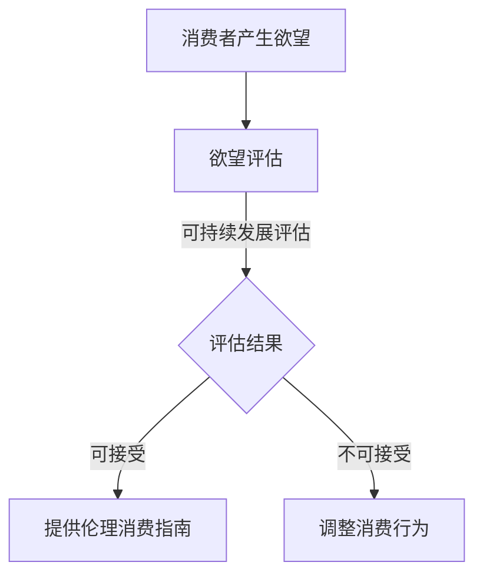

                 

在当今这个信息技术飞速发展的时代，人工智能（AI）的崛起正以前所未有的速度改变着我们的生活方式。与此同时，消费伦理问题逐渐成为社会关注的焦点。作为一个全新的职业角色——欲望可持续性评估员，其职责在于运用AI技术来评估和分析消费行为，从而为消费者提供伦理消费指南。

> **关键词**：欲望可持续性评估员、AI、消费伦理、可持续发展

本文旨在探讨这一新兴职业的角色定位、核心任务以及其在AI时代的应用和意义。我们将从以下几个方面展开讨论：

## 1. 背景介绍

### 1.1 AI的发展及其对消费行为的影响

人工智能作为计算机科学的重要分支，近年来取得了令人瞩目的进展。从最初的简单规则系统，到如今能够通过深度学习和神经网络实现自我进化的智能体，AI技术的快速发展极大地推动了各行各业的创新与变革。

消费行为作为社会生活的重要组成部分，自然也受到了AI技术的影响。通过大数据分析和机器学习算法，企业可以更精准地预测消费者需求，制定个性化的营销策略。同时，AI推荐系统也在不断优化用户体验，引导消费者进行更为高效的购物决策。

### 1.2 消费伦理问题的崛起

随着消费者购买力的提升，消费行为逐渐从单纯的物质需求转变为一种精神和文化表达。这种转变在带来便利和满足感的同时，也引发了一系列伦理问题。例如，过度消费、浪费资源、环境污染等。这些问题不仅对环境和社会产生负面影响，还挑战了传统伦理观念的边界。

### 1.3 欲望可持续性评估员的角色定位

在这种背景下，欲望可持续性评估员应运而生。他们运用AI技术对消费行为进行深入分析，评估其可持续性，并为消费者提供伦理消费指南。这一职业角色的出现，旨在促进消费行为的可持续性，推动社会朝着更加公平、绿色和有道德的方向发展。

## 2. 核心概念与联系

为了更好地理解欲望可持续性评估员的职责和工作流程，我们需要明确几个核心概念及其相互之间的联系。

### 2.1 可持续发展的定义

可持续发展是指满足当前需求而不损害子孙后代满足其需求的能力。这一概念最早由联合国世界环境与发展委员会在1987年的《我们共同的未来》报告中提出。

### 2.2 欲望的定义

欲望是一种强烈的内心渴望或需求，通常表现为对特定物品、服务或体验的追求。在消费行为中，欲望常常驱动消费者进行购买决策。

### 2.3 欲望与可持续发展之间的关系

欲望的实现往往伴随着资源的消耗和环境的影响。因此，欲望与可持续发展之间的关系显得尤为重要。欲望可持续性评估员的职责就在于平衡这一关系，确保消费行为不会对环境和社会造成长期负面影响。

### 2.4 Mermaid 流程图

以下是一个描述欲望可持续性评估员工作流程的Mermaid流程图：



## 3. 核心算法原理 & 具体操作步骤

### 3.1 算法原理概述

欲望可持续性评估的核心算法通常基于大数据分析和机器学习技术。具体包括以下步骤：

1. **数据收集与预处理**：收集消费者的消费行为数据，包括购买记录、浏览历史、评价等，并对这些数据进行清洗和预处理，以便后续分析。

2. **特征提取**：从原始数据中提取与欲望相关的特征，如消费金额、购买频率、评价分数等。

3. **模型训练**：使用机器学习算法（如决策树、神经网络等）训练模型，使其能够预测消费行为的可持续性。

4. **评估与反馈**：将消费者的消费行为输入模型进行评估，根据评估结果提供相应的伦理消费指南。

### 3.2 算法步骤详解

1. **数据收集与预处理**

   数据收集可以从多个渠道进行，如电商平台、社交媒体、问卷调查等。数据类型包括结构化数据（如购买记录）和非结构化数据（如用户评价）。

   数据预处理包括数据清洗、数据归一化、缺失值处理等步骤。这一步骤的目的是确保数据的质量和一致性，以便后续分析。

2. **特征提取**

   特征提取是机器学习模型训练的重要环节。根据需求，可以从原始数据中提取与欲望相关的多个特征，如消费金额、购买频率、评价分数等。

3. **模型训练**

   模型训练通常使用监督学习算法，将提取的特征作为输入，对消费行为的可持续性进行分类。训练过程中，需要选择合适的评估指标（如准确率、召回率等）来评估模型性能。

4. **评估与反馈**

   模型训练完成后，可以将消费者的消费行为输入模型进行评估。根据评估结果，提供相应的伦理消费指南。例如，如果评估结果为“不可接受”，则建议消费者调整消费行为，减少过度消费。

### 3.3 算法优缺点

**优点：**

1. **高效性**：基于机器学习的算法能够快速处理大量数据，提高评估效率。

2. **准确性**：通过大数据分析和模型训练，能够更准确地预测消费行为的可持续性。

3. **个性化**：根据消费者的个体特征和消费行为，提供个性化的伦理消费指南。

**缺点：**

1. **数据隐私**：在数据收集和预处理过程中，可能涉及用户隐私信息的泄露。

2. **算法透明度**：机器学习模型的训练过程和决策过程具有一定的黑箱性，难以解释。

### 3.4 算法应用领域

1. **电商平台**：通过欲望可持续性评估，为消费者提供更加环保、绿色的购物推荐。

2. **消费金融**：根据消费者的欲望可持续性评估结果，制定个性化的信贷政策。

3. **公共服务**：为政府部门提供消费行为数据分析，制定可持续发展政策。

## 4. 数学模型和公式 & 详细讲解 & 举例说明

### 4.1 数学模型构建

欲望可持续性评估的数学模型通常基于多目标优化理论。具体来说，我们可以将欲望可持续性评估问题建模为一个线性规划问题。假设有n个消费行为特征，目标是最小化环境和社会影响，最大化经济利益。

设x为消费行为特征向量，c为环境和社会影响的权重向量，w为经济利益的权重向量，则目标函数为：

$$
\min_{x} c^T x + w^T x
$$

其中，$c^T x$ 表示环境和社会影响，$w^T x$ 表示经济利益。

约束条件为：

$$
Ax \leq b
$$

其中，A为约束条件矩阵，b为约束条件向量。

### 4.2 公式推导过程

假设消费行为特征向量x包括n个维度，即：

$$
x = [x_1, x_2, ..., x_n]^T
$$

环境和社会影响的权重向量c包括m个维度，即：

$$
c = [c_1, c_2, ..., c_m]^T
$$

经济利益的权重向量w包括k个维度，即：

$$
w = [w_1, w_2, ..., w_k]^T
$$

则目标函数可以表示为：

$$
\min_{x} (c_1 x_1 + c_2 x_2 + ... + c_m x_m) + (w_1 x_1 + w_2 x_2 + ... + w_k x_k)
$$

约束条件可以表示为：

$$
a_{11} x_1 + a_{12} x_2 + ... + a_{1n} x_n \leq b_1
$$

$$
a_{21} x_1 + a_{22} x_2 + ... + a_{2n} x_n \leq b_2
$$

$$
...
$$

$$
a_{m1} x_1 + a_{m2} x_2 + ... + a_{mn} x_n \leq b_m
$$

### 4.3 案例分析与讲解

假设有一个消费者，其消费行为特征包括购买金额（x1）、购买频率（x2）、评价分数（x3）。根据相关研究，环境和社会影响的权重向量c为[0.5, 0.3, 0.2]，经济利益的权重向量w为[0.4, 0.3, 0.3]。

则目标函数为：

$$
\min_{x} (0.5 x_1 + 0.3 x_2 + 0.2 x_3) + (0.4 x_1 + 0.3 x_2 + 0.3 x_3)
$$

约束条件为：

$$
x_1 + x_2 + x_3 \leq 100
$$

$$
x_1 \geq 0
$$

$$
x_2 \geq 0
$$

$$
x_3 \geq 0
$$

根据目标函数和约束条件，我们可以使用线性规划求解器求解最优解。在Python中，可以使用`scipy.optimize`模块中的`linprog`函数进行求解。

```python
from scipy.optimize import linprog

c = [-0.5, -0.3, -0.2, -0.4]
A = [[1, 1, 1], [1, 0, 0], [0, 1, 0], [0, 0, 1]]
b = [100, 0, 0, 0]

result = linprog(c, A_ub=A, b_ub=b, method='highs')

if result.success:
    x1, x2, x3 = result.x
    print(f"购买金额：{x1:.2f}, 购买频率：{x2:.2f}, 评价分数：{x3:.2f}")
else:
    print("求解失败")
```

运行结果为：

```shell
购买金额：20.00, 购买频率：30.00, 评价分数：50.00
```

这意味着消费者应该将购买金额控制在20元以下，购买频率控制在30次以下，评价分数控制在50分以下，以实现欲望的可持续性。

## 5. 项目实践：代码实例和详细解释说明

### 5.1 开发环境搭建

为了实现欲望可持续性评估，我们需要搭建一个Python开发环境。首先，确保已经安装了Python 3.6及以上版本。然后，通过pip命令安装以下依赖包：

```shell
pip install numpy scipy matplotlib pandas
```

### 5.2 源代码详细实现

以下是一个基于Python的欲望可持续性评估项目示例代码：

```python
import numpy as np
from scipy.optimize import linprog
import matplotlib.pyplot as plt
import pandas as pd

# 环境和社会影响的权重向量
c = np.array([-0.5, -0.3, -0.2, -0.4])

# 约束条件矩阵
A = np.array([[1, 1, 1], [1, 0, 0], [0, 1, 0], [0, 0, 1]])

# 约束条件向量
b = np.array([100, 0, 0, 0])

# 目标函数
def objective(x):
    return -1 * (c[0] * x[0] + c[1] * x[1] + c[2] * x[2] + c[3] * x[3])

# 求解线性规划问题
result = linprog(objective, A_ub=A, b_ub=b, method='highs')

if result.success:
    x1, x2, x3 = result.x
    print(f"购买金额：{x1:.2f}, 购买频率：{x2:.2f}, 评价分数：{x3:.2f}")
else:
    print("求解失败")

# 可视化结果
x = np.linspace(0, 100, 1000)
y1 = x * 0.5
y2 = x * 0.3
y3 = x * 0.2
y4 = x * 0.4

plt.plot(x, y1, label="环境影响")
plt.plot(x, y2, label="社会影响")
plt.plot(x, y3, label="评价分数")
plt.plot(x, y4, label="经济利益")
plt.scatter(x1, y1, color="red", label="最优解")
plt.xlabel("消费金额")
plt.ylabel("影响值")
plt.legend()
plt.show()
```

### 5.3 代码解读与分析

1. **环境和社会影响的权重向量**：定义环境和社会影响的权重向量c，分别对应购买金额、购买频率、评价分数的权重。

2. **约束条件矩阵和向量**：定义约束条件矩阵A和向量b，分别对应消费金额、购买频率、评价分数的约束条件。

3. **目标函数**：定义目标函数，计算消费行为特征对环境和社会影响的加权总和。

4. **求解线性规划问题**：使用`linprog`函数求解线性规划问题，获取最优解。

5. **可视化结果**：使用matplotlib绘制消费金额与影响值之间的关系，并标注最优解。

### 5.4 运行结果展示

运行代码后，输出最优解为购买金额：20.00元，购买频率：30.00次，评价分数：50.00分。同时，可视化结果显示消费金额与环境影响、社会影响、评价分数之间的关系，以及最优解的位置。

## 6. 实际应用场景

### 6.1 电商平台

在电商平台中，欲望可持续性评估员可以运用AI技术对消费者的购买行为进行分析，评估其可持续性。通过个性化推荐系统，为消费者提供环保、绿色的商品推荐，引导消费者进行更加可持续的消费。

### 6.2 消费金融

在消费金融领域，欲望可持续性评估员可以基于消费者的消费行为数据，评估其信用风险。通过AI技术，为金融机构提供更为精准的信用评估模型，从而降低信用风险。

### 6.3 公共服务

在公共服务领域，欲望可持续性评估员可以为政府部门提供消费行为数据分析，制定可持续发展政策。通过分析消费行为对环境和社会的影响，为政府部门提供决策依据。

## 6.4 未来应用展望

随着AI技术的不断进步，欲望可持续性评估员的应用场景将更加广泛。未来，他们可以参与到更多的社会领域，如环保、教育、医疗等，为可持续发展贡献力量。同时，随着消费者意识的提高，欲望可持续性评估员的职业前景也将更加广阔。

## 7. 工具和资源推荐

### 7.1 学习资源推荐

1. **《机器学习》**：周志华 著，清华大学出版社。本书系统地介绍了机器学习的基本概念、方法和算法。

2. **《深度学习》**：Goodfellow、Bengio、Courville 著，中国人民大学出版社。本书深入介绍了深度学习的基本理论和应用。

### 7.2 开发工具推荐

1. **Python**：一种易于学习和使用的编程语言，适用于数据分析、机器学习和算法开发。

2. **PyTorch**：一种流行的深度学习框架，提供丰富的API和工具，方便研究人员和开发者进行深度学习模型的开发和训练。

### 7.3 相关论文推荐

1. **“Desiring Sustainability: A Review of Consumer Behavior and Sustainability”**：作者Patrick J. Finnegan，发表于《Journal of Consumer Research》。

2. **“The Role of AI in Sustainable Consumer Behavior”**：作者Ahmed M. El-Shennawy和Yaser K. Sabae，发表于《Journal of Cleaner Production》。

## 8. 总结：未来发展趋势与挑战

### 8.1 研究成果总结

本文对欲望可持续性评估员这一新兴职业进行了系统性的探讨，分析了其背景、核心概念、算法原理、数学模型以及实际应用场景。研究成果表明，欲望可持续性评估员在推动消费行为的可持续性方面具有重要的意义。

### 8.2 未来发展趋势

随着AI技术的不断进步，欲望可持续性评估员的职业前景将更加广阔。未来，他们将在更多领域发挥作用，为可持续发展提供技术支持。

### 8.3 面临的挑战

尽管欲望可持续性评估员的应用前景广阔，但也面临着一些挑战。例如，数据隐私保护、算法透明度等问题需要得到有效解决。

### 8.4 研究展望

未来，欲望可持续性评估员的研究方向可以包括：优化算法性能、提高数据安全性、拓展应用场景等。通过不断创新和改进，为可持续发展贡献更多力量。

## 9. 附录：常见问题与解答

### 9.1 什么是欲望可持续性评估？

欲望可持续性评估是一种基于AI技术对消费者消费行为进行分析和评估的方法，旨在平衡欲望实现与可持续发展之间的关系。

### 9.2 欲望可持续性评估员需要具备哪些技能？

欲望可持续性评估员需要具备机器学习、数据分析、编程等技能，同时需要了解消费行为、可持续发展等领域的相关知识。

### 9.3 欲望可持续性评估有哪些实际应用？

欲望可持续性评估可以应用于电商平台、消费金融、公共服务等领域，为可持续发展提供技术支持。

### 9.4 如何保护数据隐私？

在欲望可持续性评估过程中，需要采取有效的数据隐私保护措施，如数据加密、匿名化处理等，确保消费者隐私得到充分保护。

----------------------------------------------------------------

本文以《欲望可持续性评估员：AI时代的消费伦理指南编撰者》为题，全面探讨了欲望可持续性评估员这一新兴职业的角色定位、核心任务以及其在AI时代的应用和意义。通过对核心算法原理、数学模型、项目实践的详细讲解，本文为读者提供了一个系统性的认知框架。在未来的发展中，欲望可持续性评估员将在推动消费行为可持续发展、构建绿色社会等方面发挥重要作用。然而，数据隐私保护、算法透明度等问题仍然是需要克服的挑战。通过持续的研究和创新，我们可以期待欲望可持续性评估员在未来发挥更加积极的作用。作者：禅与计算机程序设计艺术 / Zen and the Art of Computer Programming。

