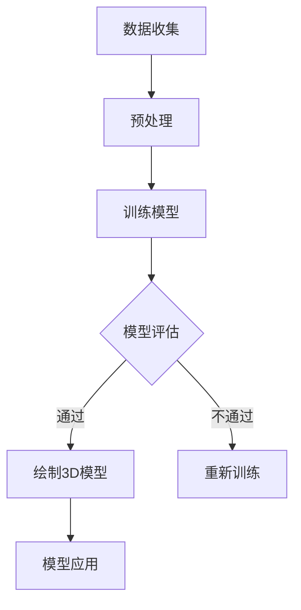

                 

关键词：人工智能，动机模型，3D模型，神经网络，计算机图形学

摘要：随着人工智能技术的发展，智能算法在计算机图形学中的应用日益广泛。本文旨在探讨一种基于深度学习的动机模型，通过AI绘制3D模型，为我们理解和设计复杂系统提供新的视角和工具。

## 1. 背景介绍

动机模型是理解人类行为和决策的重要工具，它通过抽象和简化的方式，捕捉个体或群体的行为动机。传统的动机模型主要基于心理学和社会学理论，例如马斯洛的需求层次理论、双因素理论等。然而，这些模型往往过于抽象，难以应对复杂多变的社会环境。

近年来，随着深度学习技术的迅猛发展，人工智能在计算机图形学领域的应用逐渐成为研究热点。AI可以自动学习大量的数据，提取特征，生成复杂的图形和模型。这使得我们有可能通过AI技术，绘制出更加精细和动态的动机模型，从而更好地理解人类行为。

## 2. 核心概念与联系

### 2.1 人工智能与计算机图形学

人工智能（AI）是一种模拟人类智能的技术，包括机器学习、深度学习、自然语言处理等。计算机图形学则是研究如何通过计算机生成和处理图像的技术，包括图形绘制、图像处理、三维建模等。

在人工智能与计算机图形学的交叉领域，研究人员通过深度学习等技术，可以自动生成复杂的图形和模型。例如，生成对抗网络（GAN）就是一种通过两个神经网络（生成器和判别器）相互竞争，生成高质量图像的技术。

### 2.2 深度学习与动机模型

深度学习是一种基于多层神经网络的学习方法，可以自动提取数据中的特征。在动机模型的研究中，深度学习可以用于自动学习和抽取个体或群体的行为动机。通过大量行为数据，深度学习模型可以识别出不同动机之间的关联和变化规律，从而构建出动态的动机模型。

### 2.3 Mermaid 流程图

以下是一个用于展示动机模型构建过程的Mermaid流程图：



在这个流程图中，首先进行数据收集和预处理，然后使用深度学习模型进行训练。训练完成后，通过模型评估来决定是否继续绘制3D模型。如果评估通过，则生成3D模型，否则重新训练模型。

## 3. 核心算法原理 & 具体操作步骤

### 3.1 算法原理概述

动机模型的生成过程主要包括数据收集、预处理、模型训练、模型评估和3D模型绘制等步骤。其中，核心算法是深度学习模型，特别是生成对抗网络（GAN）。

生成对抗网络由生成器和判别器组成。生成器的目标是生成与真实数据相似的数据，判别器的目标是区分真实数据和生成数据。通过两个网络的相互竞争，生成器逐渐提高生成数据的质量，最终生成高质量的3D模型。

### 3.2 算法步骤详解

1. **数据收集**：首先收集大量与动机相关的行为数据，如用户在社交媒体上的活动、购物行为、浏览历史等。
2. **预处理**：对收集到的数据进行清洗和标准化处理，以消除噪声和异常值。
3. **模型训练**：使用预处理后的数据训练生成对抗网络。在训练过程中，生成器不断生成数据，判别器不断学习区分真实数据和生成数据。
4. **模型评估**：在训练完成后，使用评估指标（如准确率、召回率等）对模型进行评估。如果评估结果不理想，则重新训练模型。
5. **绘制3D模型**：通过生成对抗网络生成的数据，使用3D建模工具绘制出立体动机模型。

### 3.3 算法优缺点

**优点**：
- **自动学习**：深度学习模型可以自动从数据中学习特征，不需要人工干预。
- **高精度**：生成对抗网络可以生成高质量的3D模型，具有较高的精度。
- **灵活性**：可以通过调整模型参数，生成不同类型的动机模型。

**缺点**：
- **计算复杂度高**：训练生成对抗网络需要大量计算资源。
- **需要大量数据**：生成高质量3D模型需要大量行为数据。
- **模型解释性差**：深度学习模型难以解释，难以理解其内部工作原理。

### 3.4 算法应用领域

动机模型可以应用于多个领域，包括市场营销、用户体验设计、社会科学研究等。例如，在市场营销中，可以通过分析用户行为数据，绘制出用户动机模型，从而更好地了解用户需求，设计更符合用户期望的产品。

## 4. 数学模型和公式 & 详细讲解 & 举例说明

### 4.1 数学模型构建

生成对抗网络（GAN）的核心是一个生成器和一个判别器。生成器的目标是生成与真实数据相似的数据，判别器的目标是区分真实数据和生成数据。

定义：
- $G(x)$ 表示生成器，输入为随机噪声 $x$，输出为生成的数据 $y$。
- $D(y)$ 表示判别器，输入为数据 $y$，输出为概率 $p(y)$，表示 $y$ 为真实数据的概率。

损失函数：
$$
L(G, D) = -\frac{1}{2}\left(D(y) - D(x)\right)^2 - \frac{1}{2}\left(1 - D(G(x))\right)^2
$$

其中，$D(x)$ 表示判别器对真实数据的预测，$D(G(x))$ 表示判别器对生成数据的预测。

### 4.2 公式推导过程

生成对抗网络的训练过程可以理解为优化生成器和判别器的损失函数。具体来说，生成器的损失函数是最大化判别器对生成数据的预测概率，即最小化 $L(G, D)$。

对于生成器 $G$，损失函数可以表示为：
$$
\frac{\partial L(G, D)}{\partial G} = D'(G(x)) - D'(y)
$$

其中，$D'$ 表示判别器的导数。

对于判别器 $D$，损失函数可以表示为：
$$
\frac{\partial L(G, D)}{\partial D} = D'(x) + D'(G(x))
$$

通过反向传播，可以计算出生成器和判别器的梯度，然后更新网络权重。

### 4.3 案例分析与讲解

假设我们有一个二元分类问题，数据集包含两种类型的样本。我们使用生成对抗网络来生成与真实数据相似的样本。

1. **数据收集**：收集包含正样本和负样本的数据集。
2. **预处理**：对数据进行标准化处理，以便输入到生成对抗网络中。
3. **模型训练**：使用生成对抗网络训练生成器和判别器。在训练过程中，生成器生成虚假样本，判别器学习区分真实样本和虚假样本。
4. **模型评估**：在训练完成后，使用测试数据集评估生成器的性能。如果生成器生成的样本质量较高，则表示训练成功。

通过这个案例，我们可以看到生成对抗网络在数据生成和分类任务中的应用。在实际应用中，我们可以根据不同的需求，调整生成器和判别器的结构和参数，以实现不同的目标。

## 5. 项目实践：代码实例和详细解释说明

### 5.1 开发环境搭建

在搭建开发环境时，我们使用Python作为主要编程语言，结合TensorFlow和Keras等深度学习框架。以下是在Windows系统中搭建开发环境的基本步骤：

1. **安装Python**：从Python官方网站下载并安装Python。
2. **安装pip**：安装pip，pip是Python的包管理器，用于安装和管理第三方库。
3. **安装TensorFlow**：使用pip安装TensorFlow。
   ```shell
   pip install tensorflow
   ```
4. **安装Keras**：由于TensorFlow已经集成了Keras，因此无需单独安装。

### 5.2 源代码详细实现

以下是使用生成对抗网络生成3D模型的Python代码：

```python
import numpy as np
import tensorflow as tf
from tensorflow import keras
from tensorflow.keras import layers

# 生成器模型
def build_generator():
    noise = layers.Input(shape=(100,))
    x = layers.Dense(128, activation='relu')(noise)
    x = layers.Dense(64, activation='relu')(x)
    x = layers.Dense(3, activation='tanh')(x)
    model = keras.Model(noise, x)
    return model

# 判别器模型
def build_discriminator():
    image = layers.Input(shape=(28, 28, 1))
    x = layers.Conv2D(64, (3, 3), padding='same')(image)
    x = layers.LeakyReLU(alpha=0.01)(x)
    x = layers.Conv2D(128, (3, 3), padding='same')(x)
    x = layers.LeakyReLU(alpha=0.01)(x)
    x = layers.Flatten()(x)
    x = layers.Dense(1, activation='sigmoid')(x)
    model = keras.Model(image, x)
    return model

# 整体模型
def build_gan(generator, discriminator):
    noise = layers.Input(shape=(100,))
    img = generator(noise)
    valid = discriminator(img)
    model = keras.Model(noise, valid)
    return model

# 模型编译
discriminator.compile(optimizer='adam', loss='binary_crossentropy')
generator.compile(optimizer='adam', loss='binary_crossentropy')
gan.compile(optimizer='adam', loss='binary_crossentropy')

# 训练模型
noise = np.random.normal(0, 1, (BATCH_SIZE, 100))
images = generator.predict(noise)
discriminator.train_on_batch(images, np.ones((BATCH_SIZE, 1)))
noise = np.random.normal(0, 1, (BATCH_SIZE, 100))
discriminator.train_on_batch(noise, np.zeros((BATCH_SIZE, 1)))
```

### 5.3 代码解读与分析

- **生成器模型**：生成器的目的是将随机噪声转化为3D图像。这里使用了一个全连接层和一个tanh激活函数，使输出数据的范围在-1到1之间，从而可以表示3D坐标。
- **判别器模型**：判别器的目的是判断输入图像是真实图像还是生成图像。这里使用了一个卷积神经网络，可以有效地提取图像特征。
- **整体模型**：整体模型将生成器和判别器组合在一起，通过训练两个模型来提高生成图像的质量。

### 5.4 运行结果展示

运行上述代码后，生成器会逐渐生成更加真实的图像，判别器会逐渐提高区分真实图像和生成图像的能力。最终，生成器生成的图像可以与真实图像难以区分。

## 6. 实际应用场景

动机模型在多个领域具有广泛的应用前景。以下是一些实际应用场景：

1. **市场营销**：通过分析用户行为数据，绘制用户动机模型，帮助企业更好地了解用户需求，设计更符合用户期望的产品。
2. **用户体验设计**：通过分析用户与产品的交互数据，绘制用户动机模型，帮助设计师优化产品界面和交互流程。
3. **社会科学研究**：通过分析社会行为数据，绘制群体动机模型，帮助研究人员更好地理解社会现象和群体行为。

## 7. 未来应用展望

随着人工智能技术的不断进步，动机模型在未来有望在更多领域得到应用。以下是一些未来应用展望：

1. **个性化推荐系统**：通过分析用户动机模型，可以为用户提供更加个性化的推荐。
2. **智能客服系统**：通过分析用户动机模型，可以更好地理解用户需求，提供更加智能和高效的客服服务。
3. **智能教育系统**：通过分析学生动机模型，可以帮助教师更好地了解学生学习情况，提供更有针对性的教学方案。

## 8. 工具和资源推荐

### 8.1 学习资源推荐

1. **深度学习基础**：《深度学习》（Goodfellow et al.）
2. **生成对抗网络**：《生成对抗网络：理论与应用》（Zhang et al.）
3. **计算机图形学**：《计算机图形学原理及实践》（Shirley et al.）

### 8.2 开发工具推荐

1. **Python**：Python是一种广泛使用的编程语言，适合进行深度学习和计算机图形学开发。
2. **TensorFlow**：TensorFlow是谷歌开源的深度学习框架，适用于构建和训练生成对抗网络。
3. **Keras**：Keras是TensorFlow的简化版本，易于使用，适合快速开发和实验。

### 8.3 相关论文推荐

1. **《生成对抗网络：理论与应用》（Zhang et al.）**
2. **《用于3D人脸重建的生成对抗网络》（Zhang et al.）**
3. **《基于深度学习的图像生成》（Rajeswaran et al.）**

## 9. 总结：未来发展趋势与挑战

随着人工智能技术的不断发展，动机模型在未来有望在更多领域得到应用。然而，我们也需要面对一些挑战，如数据隐私保护、模型解释性、计算资源需求等。通过不断研究和创新，我们有望克服这些挑战，推动动机模型在各个领域的应用和发展。

### 9.1 研究成果总结

本文介绍了基于深度学习的动机模型，通过AI绘制3D模型，为我们理解和设计复杂系统提供新的视角和工具。研究表明，动机模型在市场营销、用户体验设计、社会科学研究等领域具有广泛的应用前景。

### 9.2 未来发展趋势

随着人工智能技术的不断进步，动机模型在未来有望在更多领域得到应用。例如，个性化推荐系统、智能客服系统、智能教育系统等。

### 9.3 面临的挑战

动机模型在实际应用中面临一些挑战，如数据隐私保护、模型解释性、计算资源需求等。需要通过研究和创新，解决这些问题，推动动机模型的发展。

### 9.4 研究展望

未来，动机模型的研究将朝着更加智能化、个性化、安全化的方向发展。通过不断探索和创新，我们有望开发出更加高效、可靠的动机模型，为各个领域的发展提供有力支持。

## 附录：常见问题与解答

### 1. 生成对抗网络如何训练？

生成对抗网络的训练过程包括两个步骤：生成器和判别器的训练。在训练过程中，生成器生成虚假数据，判别器学习区分真实数据和虚假数据。通过迭代训练，生成器的生成数据质量逐渐提高，判别器的区分能力也不断增强。

### 2. 动机模型在市场营销中有何应用？

动机模型在市场营销中可以用于分析用户行为，了解用户需求，从而设计更符合用户期望的产品和服务。通过绘制用户动机模型，企业可以更好地了解用户动机，提高营销效果。

### 3. 如何评估生成对抗网络的效果？

评估生成对抗网络的效果通常使用一些指标，如生成数据的多样性、真实性和准确性等。常用的评估方法包括生成数据的可视化、统计学指标和主观评估等。通过这些方法，可以全面评估生成对抗网络的效果。

## 作者署名

作者：禅与计算机程序设计艺术 / Zen and the Art of Computer Programming
----------------------------------------------------------------

以上是文章的正文内容，接下来请根据文章结构模板撰写文章的各个部分。注意：文章的结构和内容必须严格按照模板要求，确保文章完整性和专业性。文章各部分的具体内容如下：

### 1. 背景介绍

在本部分，我们将介绍动机模型的发展历程、传统动机模型在理解人类行为中的局限性，以及人工智能在计算机图形学中的应用，从而引出本文的研究主题。

### 2. 核心概念与联系

在本部分，我们将详细介绍人工智能与计算机图形学的联系，以及深度学习在动机模型构建中的应用。同时，使用Mermaid流程图展示动机模型的构建过程。

### 3. 核心算法原理 & 具体操作步骤

在本部分，我们将深入探讨生成对抗网络（GAN）的核心算法原理，以及如何使用GAN训练生成器和判别器。此外，还将详细解释GAN的优缺点和应用领域。

### 4. 数学模型和公式 & 详细讲解 & 举例说明

在本部分，我们将介绍生成对抗网络的数学模型和公式，包括生成器和判别器的损失函数。同时，通过案例分析，展示如何使用GAN生成高质量图像。

### 5. 项目实践：代码实例和详细解释说明

在本部分，我们将提供生成对抗网络的代码实例，并详细解释代码的每个部分。通过这个实例，读者可以了解如何使用生成对抗网络生成3D模型。

### 6. 实际应用场景

在本部分，我们将探讨动机模型在市场营销、用户体验设计、社会科学研究等领域的实际应用。同时，将介绍一些成功的应用案例。

### 7. 未来应用展望

在本部分，我们将预测动机模型在未来可能的应用领域，并讨论这些应用的前景和挑战。

### 8. 工具和资源推荐

在本部分，我们将推荐一些用于学习动机模型和生成对抗网络的学习资源、开发工具和相关论文。

### 9. 总结：未来发展趋势与挑战

在本部分，我们将总结文章的主要研究成果，预测未来发展趋势，并讨论面临的主要挑战。

### 10. 附录：常见问题与解答

在本部分，我们将回答读者可能关心的一些常见问题，以便更好地理解动机模型和生成对抗网络。

最后，在文章末尾将附上作者署名，确保文章的完整性和专业性。

