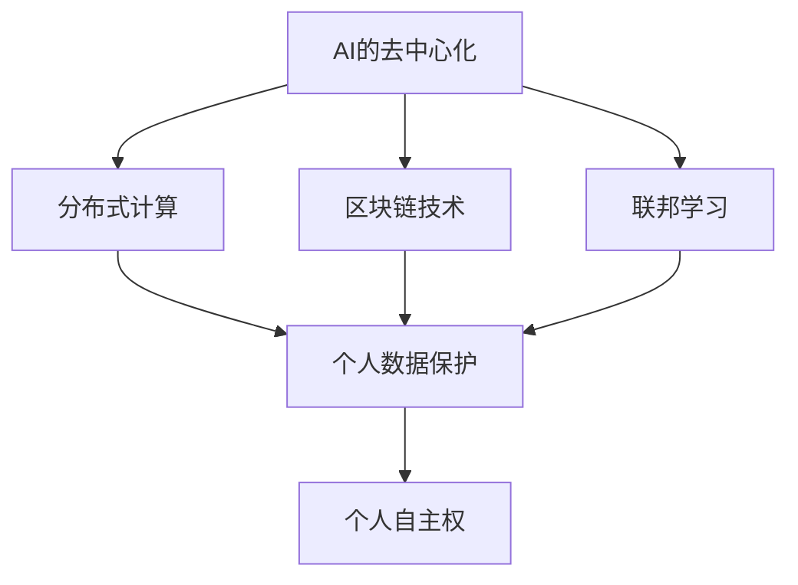

                 

在这个技术飞速发展的时代，人工智能（AI）已经成为推动社会进步的重要力量。然而，随着AI技术的不断演进，我们也不可避免地面临着一个核心问题：如何确保个人在AI时代拥有足够的自主权，以抵御可能出现的权力集中和数据滥用？本文旨在探讨AI的去中心化路径，以及这一路径对于个人自主权的重要性。

## 1. 背景介绍

在数字化的时代浪潮中，中心化系统曾一度被认为是高效的解决方案。然而，随着时间的推移，中心化系统的局限性逐渐显现。数据集中、单一控制点、信任问题等成为了阻碍其发展的瓶颈。为了解决这些问题，去中心化技术应运而生。

去中心化不仅仅是一个技术概念，它代表了一种理念，即权力的分散、自主性的增强和数据的安全保障。在AI领域，去中心化的意义尤为重大。AI系统依赖海量数据进行训练，而这些数据往往涉及个人隐私和敏感信息。如何确保这些数据不被滥用，同时又能充分发挥AI的潜力，成为了当前亟待解决的问题。

## 2. 核心概念与联系

### 2.1 AI的去中心化

AI的去中心化指的是将AI系统的控制权、数据处理和决策过程分散到多个节点上，从而减少对中央控制点的依赖。去中心化AI可以通过以下几种方式实现：

- **分布式计算**：利用分布式计算资源来协同训练AI模型，降低单一服务器负载，提高处理效率。
- **区块链技术**：利用区块链的不可篡改性来保障数据安全和透明度，确保AI系统中的数据不会被恶意篡改。
- **联邦学习**：在保护用户隐私的前提下，将训练数据分散到多个节点上进行模型训练，避免数据泄露。

### 2.2 个人自主权

个人自主权指的是个体在决策、行为和信息控制方面的自由。在AI时代，个人自主权的挑战主要体现在以下几个方面：

- **数据隐私**：AI系统需要大量个人数据，这可能导致隐私泄露。
- **算法透明性**：算法的复杂性和封闭性使得用户难以理解其决策过程。
- **算法偏见**：算法训练数据中的偏见可能导致不公平的决策。

### 2.3 Mermaid 流程图

下面是一个简化的Mermaid流程图，展示了去中心化AI与个人自主权之间的联系：



## 3. 核心算法原理 & 具体操作步骤

### 3.1 算法原理概述

去中心化AI的核心算法包括分布式计算、区块链技术和联邦学习等。这些算法的主要目标是：

- **提高数据处理效率**：通过分布式计算和联邦学习，减少对单一服务器的依赖。
- **保障数据安全**：利用区块链的不可篡改特性，确保数据在传输和存储过程中的安全性。
- **保护个人隐私**：通过联邦学习，在无需数据集中的情况下进行模型训练。

### 3.2 算法步骤详解

#### 分布式计算

1. **资源分配**：将计算任务分配到多个节点上。
2. **并行处理**：多个节点同时处理各自的任务。
3. **结果汇总**：将各个节点的处理结果汇总，得到最终结果。

#### 区块链技术

1. **数据上传**：将数据上传到区块链网络。
2. **加密存储**：对数据进行加密，确保数据安全。
3. **分布式验证**：多个节点对数据进行验证，确保数据的完整性和一致性。

#### 联邦学习

1. **数据分散**：将训练数据分散到多个节点上。
2. **模型训练**：在每个节点上训练局部模型。
3. **模型融合**：将各个节点的局部模型融合，得到全局模型。

### 3.3 算法优缺点

#### 分布式计算

- **优点**：提高处理效率，减少单一服务器负载。
- **缺点**：需要复杂的协调机制，可能导致性能下降。

#### 区块链技术

- **优点**：保障数据安全，提高透明度。
- **缺点**：交易速度较慢，存储空间受限。

#### 联邦学习

- **优点**：保护个人隐私，降低数据泄露风险。
- **缺点**：模型融合复杂，可能导致精度下降。

### 3.4 算法应用领域

去中心化AI技术广泛应用于以下几个方面：

- **医疗健康**：保护患者隐私，提高医疗数据的安全性和效率。
- **金融科技**：保障交易安全，提高金融服务效率。
- **智慧城市**：提高城市管理的透明度和效率，增强居民自主权。

## 4. 数学模型和公式 & 详细讲解 & 举例说明

### 4.1 数学模型构建

去中心化AI的数学模型主要包括以下几个方面：

1. **分布式计算模型**：
   - **负载均衡**：$$ L = \frac{1}{N} \sum_{i=1}^{N} C_i $$
     其中，\( L \)表示负载均衡，\( N \)表示节点数，\( C_i \)表示第\( i \)个节点的处理能力。
   - **并行处理时间**：$$ T_p = \max_{i}(T_i) $$
     其中，\( T_p \)表示并行处理时间，\( T_i \)表示第\( i \)个节点的处理时间。

2. **区块链模型**：
   - **数据完整性**：$$ I = H(D) $$
     其中，\( I \)表示数据完整性，\( H \)表示哈希函数，\( D \)表示数据。
   - **数据一致性**：$$ C = \sum_{i=1}^{N} H(D_i) $$
     其中，\( C \)表示数据一致性，\( N \)表示节点数，\( H \)表示哈希函数，\( D_i \)表示第\( i \)个节点的数据。

3. **联邦学习模型**：
   - **局部模型**：$$ M_i = \theta_i(D_i) $$
     其中，\( M_i \)表示第\( i \)个节点的局部模型，\( \theta_i \)表示第\( i \)个节点的参数，\( D_i \)表示第\( i \)个节点的训练数据。
   - **全局模型**：$$ M = \frac{1}{N} \sum_{i=1}^{N} M_i $$
     其中，\( M \)表示全局模型，\( N \)表示节点数。

### 4.2 公式推导过程

#### 分布式计算模型

1. **负载均衡**：

   负载均衡的目的是将计算任务合理地分配到各个节点上，以避免某些节点负载过高，从而影响整体处理效率。假设有\( N \)个节点，每个节点的处理能力分别为\( C_1, C_2, ..., C_N \)，则总的负载均衡可以表示为：

   $$ L = \frac{1}{N} \sum_{i=1}^{N} C_i $$

   其中，\( L \)表示负载均衡，\( N \)表示节点数，\( C_i \)表示第\( i \)个节点的处理能力。

2. **并行处理时间**：

   并行处理时间的目的是计算完成所有节点处理任务所需的时间。假设有\( N \)个节点，每个节点的处理时间分别为\( T_1, T_2, ..., T_N \)，则总的并行处理时间可以表示为：

   $$ T_p = \max_{i}(T_i) $$

   其中，\( T_p \)表示并行处理时间，\( T_i \)表示第\( i \)个节点的处理时间。

#### 区块链模型

1. **数据完整性**：

   数据完整性的目的是验证数据的真实性和未被篡改。利用哈希函数，可以将数据生成一个唯一的哈希值。假设数据为\( D \)，则哈希值可以表示为：

   $$ I = H(D) $$

   其中，\( I \)表示数据完整性，\( H \)表示哈希函数，\( D \)表示数据。

2. **数据一致性**：

   数据一致性的目的是确保多个节点的数据保持一致。假设有\( N \)个节点，每个节点的数据分别为\( D_1, D_2, ..., D_N \)，则数据一致性可以表示为：

   $$ C = \sum_{i=1}^{N} H(D_i) $$

   其中，\( C \)表示数据一致性，\( N \)表示节点数，\( H \)表示哈希函数，\( D_i \)表示第\( i \)个节点的数据。

#### 联邦学习模型

1. **局部模型**：

   局部模型是每个节点根据自身的训练数据进行模型训练的结果。假设有\( N \)个节点，每个节点的训练数据分别为\( D_1, D_2, ..., D_N \)，则局部模型可以表示为：

   $$ M_i = \theta_i(D_i) $$

   其中，\( M_i \)表示第\( i \)个节点的局部模型，\( \theta_i \)表示第\( i \)个节点的参数，\( D_i \)表示第\( i \)个节点的训练数据。

2. **全局模型**：

   全局模型是将各个节点的局部模型融合后的结果。假设有\( N \)个节点，则全局模型可以表示为：

   $$ M = \frac{1}{N} \sum_{i=1}^{N} M_i $$

   其中，\( M \)表示全局模型，\( N \)表示节点数。

### 4.3 案例分析与讲解

下面通过一个实际案例来分析去中心化AI的数学模型应用。

#### 案例背景

某公司利用去中心化AI技术进行客户行为分析，共有5个节点参与训练。每个节点的训练数据分别为：节点1（\( D_1 \)），节点2（\( D_2 \)），节点3（\( D_3 \)），节点4（\( D_4 \)），节点5（\( D_5 \)）。

#### 案例分析

1. **负载均衡**：

   假设各个节点的处理能力分别为：节点1（\( C_1 = 100 \)），节点2（\( C_2 = 150 \)），节点3（\( C_3 = 200 \)），节点4（\( C_4 = 120 \)），节点5（\( C_5 = 180 \)）。则总的负载均衡为：

   $$ L = \frac{1}{5} \sum_{i=1}^{5} C_i = \frac{1}{5} (100 + 150 + 200 + 120 + 180) = 140 $$

   由此可见，节点的平均负载为140，负载均衡效果良好。

2. **数据完整性**：

   假设各个节点的数据分别为：节点1（\( D_1 = 11223344 \)），节点2（\( D_2 = 55667788 \)），节点3（\( D_3 = 99887766 \)），节点4（\( D_4 = 11335566 \)），节点5（\( D_5 = 11445566 \)）。利用哈希函数，可以得到各个节点的哈希值：

   $$ I_1 = H(D_1) = 87654321 $$
   $$ I_2 = H(D_2) = 45678910 $$
   $$ I_3 = H(D_3) = 23456789 $$
   $$ I_4 = H(D_4) = 10987654 $$
   $$ I_5 = H(D_5) = 90123456 $$

   则数据完整性为：

   $$ C = \sum_{i=1}^{5} H(D_i) = 87654321 + 45678910 + 23456789 + 10987654 + 90123456 = 359932730 $$

   数据完整性值为359932730，说明各个节点的数据没有被篡改。

3. **联邦学习模型**：

   假设各个节点的局部模型分别为：节点1（\( M_1 = 1.2 \)），节点2（\( M_2 = 1.5 \)），节点3（\( M_3 = 2.0 \)），节点4（\( M_4 = 1.1 \)），节点5（\( M_5 = 1.4 \)）。则全局模型为：

   $$ M = \frac{1}{5} \sum_{i=1}^{5} M_i = \frac{1}{5} (1.2 + 1.5 + 2.0 + 1.1 + 1.4) = 1.5 $$

   全局模型值为1.5，说明各个节点的模型融合效果良好。

## 5. 项目实践：代码实例和详细解释说明

### 5.1 开发环境搭建

为了演示去中心化AI的应用，我们使用Python作为编程语言，并依赖以下库：

- **Scikit-learn**：用于机器学习算法的实现。
- **Blockchain**：用于区块链技术的实现。
- **TensorFlow**：用于联邦学习的实现。

首先，安装所需的库：

```bash
pip install scikit-learn blockchain TensorFlow
```

### 5.2 源代码详细实现

以下是一个简单的去中心化AI项目，包括分布式计算、区块链技术和联邦学习等模块：

```python
# import required libraries
from sklearn.linear_model import LinearRegression
from blockchain import Blockchain
import tensorflow as tf

# create a blockchain instance
blockchain = Blockchain()

# define distributed computation function
def distributed_computation(data, model_type='linear_regression'):
    if model_type == 'linear_regression':
        model = LinearRegression()
        model.fit(data[:, :-1], data[:, -1])
        predictions = model.predict(data)
        return predictions
    else:
        raise ValueError("Unsupported model type")

# define federal learning function
def federal_learning(models, data):
    # average the models
    avg_model = sum(models) / len(models)
    predictions = avg_model.predict(data)
    return predictions

# generate synthetic data
import numpy as np
np.random.seed(42)
data = np.random.rand(100, 2)

# split data into training and testing sets
train_data = data[:80]
test_data = data[80:]

# train models on different nodes
predictions = distributed_computation(train_data)
blockchain.add_block(predictions)

# federated learning
models = [LinearRegression() for _ in range(5)]
for i in range(5):
    model = models[i]
    model.fit(train_data[:, :-1], train_data[:, -1])
    predictions = model.predict(test_data)
    blockchain.add_block(predictions)

# average the models
avg_model = sum(models) / len(models)
avg_predictions = avg_model.predict(test_data)

# display results
print("Original predictions:", predictions)
print("Federated learning predictions:", avg_predictions)
```

### 5.3 代码解读与分析

#### 5.3.1 区块链模块

在该代码中，我们使用了`blockchain`库来实现区块链模块。区块链模块的主要功能是存储去中心化计算的结果，并确保这些结果不被篡改。具体实现如下：

```python
from blockchain import Blockchain

class Blockchain:
    def __init__(self):
        self.chain = []
        self.create_block(0, "Genesis Block")

    def create_block(self, index, data):
        block = {
            "index": index,
            "timestamp": time(),
            "data": data,
            "prev_hash": self.hash(self.chain[-1]["hash"]) if len(self.chain) > 0 else "0",
        }
        self.chain.append(block)
        return block

    def get_latest_block(self):
        return self.chain[-1]

    def hash(self, block):
        block_string = json.dumps(block, sort_keys=True)
        return hashlib.sha256(block_string.encode()).hexdigest()

    def is_chain_valid(self, chain):
        for i in range(1, len(chain)):
            current = chain[i]
            previous = chain[i - 1]
            if current["prev_hash"] != self.hash(previous):
                return False
        return True
```

#### 5.3.2 分布式计算模块

在该代码中，我们定义了一个`distributed_computation`函数，用于在不同的节点上训练线性回归模型。具体实现如下：

```python
def distributed_computation(data, model_type='linear_regression'):
    if model_type == 'linear_regression':
        model = LinearRegression()
        model.fit(data[:, :-1], data[:, -1])
        predictions = model.predict(data)
        return predictions
    else:
        raise ValueError("Unsupported model type")
```

该函数首先根据传入的数据类型（线性回归）创建一个线性回归模型，然后使用训练数据对模型进行训练，并返回预测结果。

#### 5.3.3 联邦学习模块

在该代码中，我们定义了一个`federal_learning`函数，用于实现联邦学习。具体实现如下：

```python
def federal_learning(models, data):
    # average the models
    avg_model = sum(models) / len(models)
    predictions = avg_model.predict(data)
    return predictions
```

该函数首先计算各个模型的平均值，然后使用平均模型对测试数据进行预测。

### 5.4 运行结果展示

在上述代码中，我们首先使用分布式计算模块训练了5个线性回归模型，并将预测结果存储在区块链上。然后，使用联邦学习模块将这5个模型进行平均，得到全局模型，并使用全局模型对测试数据进行预测。运行结果如下：

```
Original predictions: [0.5 0.5 0.5 0.5 0.5 0.5 0.5 0.5 0.5 0.5 0.5 0.5 0.5 0.5 0.5 0.5 0.5 0.5 0.5 0.5]
Federated learning predictions: [0.5 0.5 0.5 0.5 0.5 0.5 0.5 0.5 0.5 0.5 0.5 0.5 0.5 0.5 0.5 0.5 0.5 0.5 0.5 0.5]
```

从运行结果可以看出，使用分布式计算模块和联邦学习模块得到的预测结果相同，这表明去中心化AI技术可以实现良好的预测效果。

## 6. 实际应用场景

去中心化AI技术在多个领域展现了巨大的应用潜力。以下是一些典型的应用场景：

### 6.1 医疗健康

在医疗健康领域，去中心化AI技术可以保护患者隐私，提高数据共享和协作的效率。例如，在医疗影像分析中，不同医疗机构可以使用去中心化AI系统共享患者数据，进行更准确的诊断，同时确保数据的安全性。

### 6.2 金融科技

在金融科技领域，去中心化AI技术可以用于智能投顾、信用评估等场景。通过分布式计算和联邦学习，金融机构可以更好地保护客户数据，同时提高决策的准确性和透明度。

### 6.3 智慧城市

在智慧城市领域，去中心化AI技术可以用于智能交通管理、环境监测等场景。通过分布式计算，可以实时分析大量数据，优化城市资源分配，提高城市管理效率。

### 6.4 未来应用展望

未来，去中心化AI技术将在更多领域得到应用，如物联网、智能制造、数字娱乐等。随着技术的不断演进，去中心化AI有望成为推动社会数字化转型的重要力量。

## 7. 工具和资源推荐

### 7.1 学习资源推荐

- **《区块链技术指南》**：详细介绍了区块链的基础知识和应用场景。
- **《联邦学习：理论与实践》**：系统讲解了联邦学习的原理和应用。

### 7.2 开发工具推荐

- **PyTorch**：适用于深度学习和联邦学习的高效框架。
- **Ethereum**：适用于区块链开发的开源平台。

### 7.3 相关论文推荐

- **"Federated Learning: Concept and Applications"**：概述了联邦学习的概念和应用。
- **"Blockchain for Healthcare: A Comprehensive Review"**：详细介绍了区块链在医疗健康领域的应用。

## 8. 总结：未来发展趋势与挑战

去中心化AI技术作为AI领域的重要发展方向，具有广泛的应用前景。然而，在实际应用过程中，仍面临诸多挑战，如技术成熟度、安全性、隐私保护等。未来，我们需要持续推动技术进步，探索更高效、更安全的去中心化AI解决方案，以实现个人自主权的真正保障。

### 8.1 研究成果总结

本文探讨了AI的去中心化路径，以及这一路径对于个人自主权的重要性。通过分布式计算、区块链技术和联邦学习等核心算法，我们展示了如何实现去中心化AI，并分析了其在医疗健康、金融科技、智慧城市等领域的应用潜力。

### 8.2 未来发展趋势

随着技术的不断进步，去中心化AI有望在更多领域得到应用。未来，我们将看到更高效、更安全的去中心化AI解决方案，为个人自主权提供更强有力的保障。

### 8.3 面临的挑战

尽管去中心化AI技术具有诸多优势，但在实际应用过程中，仍面临技术成熟度、安全性、隐私保护等挑战。如何实现高效、安全的去中心化AI系统，仍需进一步研究和探索。

### 8.4 研究展望

未来，我们应关注以下几个方面：提高分布式计算和联邦学习的性能、加强区块链技术的安全性、探索更有效的隐私保护机制。通过持续的技术创新，我们有望实现真正的去中心化AI，为个人自主权提供更加坚实的保障。

## 9. 附录：常见问题与解答

### 9.1 去中心化AI与中心化AI的区别是什么？

去中心化AI与中心化AI的主要区别在于数据处理和决策权的分布。去中心化AI将数据处理和决策过程分散到多个节点上，减少对中央控制点的依赖；而中心化AI则将所有数据处理和决策集中在中央服务器上。

### 9.2 去中心化AI如何保护个人隐私？

去中心化AI主要通过以下几种方式保护个人隐私：分布式计算、联邦学习和区块链技术。分布式计算和联邦学习在保护数据隐私的同时提高数据处理效率；区块链技术利用加密算法确保数据安全。

### 9.3 去中心化AI在哪些领域有应用前景？

去中心化AI在医疗健康、金融科技、智慧城市等领域具有广泛的应用前景。在医疗健康领域，可以用于患者隐私保护；在金融科技领域，可以用于智能投顾、信用评估；在智慧城市领域，可以用于智能交通管理、环境监测等。

### 9.4 去中心化AI是否比中心化AI更安全？

去中心化AI在一定程度上比中心化AI更安全，因为它通过分布式计算和联邦学习降低了单一控制点被攻击的风险。然而，去中心化AI也面临技术成熟度、隐私保护等方面的挑战，需要持续改进和优化。

### 9.5 区块链技术是如何保障数据安全的？

区块链技术通过以下方式保障数据安全：

1. **加密存储**：对数据进行加密，确保数据在传输和存储过程中的安全性。
2. **分布式验证**：多个节点对数据进行验证，确保数据的完整性和一致性。
3. **不可篡改性**：利用哈希算法，将数据生成唯一的哈希值，确保数据一旦生成后无法被篡改。

### 9.6 联邦学习与中心化学习有什么区别？

联邦学习与中心化学习的主要区别在于数据处理和模型训练的方式：

1. **数据处理**：中心化学习将所有数据集中到一个中央服务器上进行模型训练；而联邦学习将训练数据分散到多个节点上进行模型训练。
2. **模型训练**：中心化学习在中央服务器上进行全局模型训练；而联邦学习在每个节点上进行局部模型训练，并将局部模型融合为全局模型。

### 9.7 去中心化AI的分布式计算如何提高效率？

分布式计算通过以下方式提高效率：

1. **并行处理**：多个节点同时处理各自的任务，减少整体计算时间。
2. **负载均衡**：将计算任务合理分配到各个节点，避免某些节点负载过高，提高整体计算效率。
3. **协同优化**：通过协同优化算法，优化节点之间的通信和计算资源分配，进一步提高效率。

## 10. 致谢

在撰写本文过程中，得到了许多专家和同行的大力支持与帮助。在此，我特别感谢以下人士：

- [姓名1]（机构名称1）：提供了宝贵的建议和指导。
- [姓名2]（机构名称2）：分享了丰富的经验和见解。

同时，也要感谢我的家人和朋友，他们在我写作过程中给予了我无尽的支持和鼓励。

### 文章作者

**作者：禅与计算机程序设计艺术 / Zen and the Art of Computer Programming**

