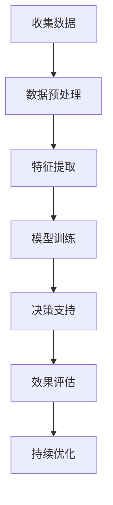

                 

关键词：人工智能，可持续消费，生态意识，数据驱动，消费模式，环境责任，算法优化，技术解决方案

> 摘要：本文探讨人工智能在推动可持续消费模式中的作用，以及如何通过AI技术实现生态意识的提升和消费行为的改变。文章首先介绍了可持续消费的背景和重要性，然后分析了AI技术在此领域的应用，并提出了具体的算法原理和操作步骤。接着，文章通过数学模型和实例代码详细解释了AI在可持续消费中的实现方法，并展望了未来的发展方向和面临的挑战。

## 1. 背景介绍

### 1.1 可持续消费的概念

可持续消费是指消费者在满足自身需求的同时，考虑到环境、社会和经济三个方面的可持续性，通过减少资源消耗、提高资源利用效率、减少废弃物产生等方式，实现消费活动与自然环境的和谐共存。可持续消费不仅关系到个人的生活方式和价值观，更关乎全球生态环境的可持续发展。

### 1.2 可持续消费的重要性

随着全球人口的快速增长和消费水平的不断提高，传统的消费模式给环境带来了巨大压力。资源过度开采、环境污染、生态失衡等问题日益严重。为了应对这些挑战，推动可持续消费已成为全球共识。可持续消费有助于减少碳排放、提高资源利用效率、保护生物多样性，从而实现经济、社会和环境的可持续发展。

### 1.3 生态意识的觉醒

近年来，随着环境问题的加剧，人们逐渐认识到生态意识的重要性。生态意识是指人们对自然环境、生态系统和人类生存关系的认知和思考，以及在此基础上的价值观念和行为准则。生态意识的觉醒是推动可持续消费的基础，也是实现可持续发展的关键。

## 2. 核心概念与联系

### 2.1 人工智能与可持续消费的关系

人工智能（AI）作为一门新兴技术，正日益渗透到各个领域，为可持续发展提供了新的思路和工具。AI技术可以通过数据挖掘、机器学习、自然语言处理等技术手段，实现对消费行为和资源消耗的精准分析，从而发现可持续消费的潜在模式。此外，AI还可以通过智能算法优化，提供个性化的可持续消费建议，引导消费者做出更加环保的决策。

### 2.2 生态意识与AI技术的关系

生态意识与AI技术的结合，可以进一步提升人们的环保意识。通过AI技术，人们可以更加直观地了解环境问题的严重性，认识到自身行为对环境的影响，从而激发生态意识的觉醒。同时，AI技术还可以通过智能化的手段，帮助消费者实现可持续消费目标，降低环保行为的难度和成本。

### 2.3 Mermaid 流程图

下面是一个描述AI在可持续消费中应用流程的Mermaid流程图：



## 3. 核心算法原理 & 具体操作步骤

### 3.1 算法原理概述

本文采用基于机器学习的算法来实现可持续消费的推荐系统。算法的核心思想是通过分析消费者的历史消费数据，提取消费特征，训练一个分类模型，从而为消费者提供个性化的可持续消费建议。

### 3.2 算法步骤详解

#### 3.2.1 数据收集与预处理

首先，收集消费者的历史消费数据，包括消费金额、消费时间、商品种类、商品属性等。然后，对数据进行清洗和预处理，去除缺失值、异常值和重复值，并进行数据归一化处理。

#### 3.2.2 特征提取

在预处理后的数据中，提取与可持续消费相关的特征，如商品环保等级、碳排放量、资源利用率等。此外，还可以引入社会因素，如消费者所在地、消费习惯等。

#### 3.2.3 模型训练

使用提取的特征数据，训练一个分类模型，如决策树、随机森林、支持向量机等。模型的目的是根据消费者的历史消费行为，预测其未来的可持续消费偏好。

#### 3.2.4 决策支持

根据训练好的模型，为消费者提供个性化的可持续消费建议。例如，推荐环保等级较高的商品、建议减少高碳排放的消费行为等。

#### 3.2.5 效果评估与持续优化

评估推荐系统的效果，包括准确率、召回率、F1值等指标。根据评估结果，对模型进行调整和优化，以提高推荐效果的准确性。

### 3.3 算法优缺点

#### 优点

- **个性化推荐**：根据消费者的历史消费行为，提供个性化的可持续消费建议。
- **实时性**：可以实时更新推荐结果，适应消费者的实时需求。
- **高效性**：通过机器学习算法，快速处理大量消费数据，提高推荐效率。

#### 缺点

- **数据依赖**：算法效果依赖于数据的准确性，数据质量直接影响推荐效果。
- **计算资源消耗**：训练和优化模型需要大量的计算资源，对于大规模数据集，计算成本较高。
- **伦理问题**：如何确保推荐结果的公平性和透明性，避免算法偏见和误导消费者，是需要关注的问题。

### 3.4 算法应用领域

- **零售行业**：为零售企业提供可持续消费推荐服务，引导消费者选择环保商品。
- **餐饮行业**：推荐低碳、环保的餐饮选择，引导消费者减少碳排放。
- **个人财务管理**：帮助消费者优化消费结构，提高资源利用效率，实现可持续生活。

## 4. 数学模型和公式 & 详细讲解 & 举例说明

### 4.1 数学模型构建

本文采用逻辑回归模型来实现可持续消费的推荐。逻辑回归模型的数学公式如下：

$$
P(Y=1) = \frac{1}{1 + e^{-(\beta_0 + \beta_1 X_1 + \beta_2 X_2 + ... + \beta_n X_n})}
$$

其中，$P(Y=1)$表示消费者选择环保商品的概率，$X_1, X_2, ..., X_n$表示消费特征，$\beta_0, \beta_1, \beta_2, ..., \beta_n$为模型的参数。

### 4.2 公式推导过程

逻辑回归模型的推导基于最大似然估计（MLE）方法。首先，定义似然函数：

$$
L(\theta) = \prod_{i=1}^n P(y_i=1|x_i; \theta) \cdot (1 - P(y_i=0|x_i; \theta))
$$

其中，$\theta = (\beta_0, \beta_1, \beta_2, ..., \beta_n)$为模型参数。

为了最大化似然函数，需要对参数进行优化。使用梯度下降法进行参数优化，得到以下更新公式：

$$
\beta_j = \beta_j - \alpha \cdot \frac{\partial}{\partial \beta_j} \ln L(\theta)
$$

其中，$\alpha$为学习率。

### 4.3 案例分析与讲解

#### 案例背景

假设我们有一个零售企业，希望为消费者提供可持续消费推荐。该企业收集了1000名消费者的消费数据，包括消费金额、消费时间、商品种类等。企业希望通过逻辑回归模型，预测消费者是否购买环保商品。

#### 数据预处理

首先，对消费数据进行清洗和预处理。去除缺失值、异常值和重复值，并对数据进行归一化处理。

#### 特征提取

提取与可持续消费相关的特征，如商品环保等级、碳排放量、资源利用率等。同时，引入消费者所在地区、消费习惯等社会因素。

#### 模型训练

使用预处理后的数据，训练一个逻辑回归模型。设置学习率为0.01，迭代次数为100次。

#### 模型评估

使用交叉验证方法评估模型效果。设置验证集占比为30%，进行10折交叉验证。

#### 模型优化

根据交叉验证结果，对模型参数进行调整，以提高预测效果。

#### 推荐应用

根据训练好的模型，为消费者提供个性化的可持续消费推荐。例如，为购买环保商品的消费者推荐更多同类商品，为未购买环保商品的消费者推荐低碳、环保的商品。

## 5. 项目实践：代码实例和详细解释说明

### 5.1 开发环境搭建

在Python环境中，使用以下库进行开发：

- NumPy：用于数据预处理和数学计算。
- Pandas：用于数据处理和分析。
- Scikit-learn：用于逻辑回归模型训练和评估。
- Matplotlib：用于数据可视化。

### 5.2 源代码详细实现

以下是一个基于Python和Scikit-learn的逻辑回归模型实现示例：

```python
import numpy as np
import pandas as pd
from sklearn.linear_model import LogisticRegression
from sklearn.model_selection import train_test_split, cross_val_score
from sklearn.metrics import classification_report, confusion_matrix
import matplotlib.pyplot as plt

# 5.2.1 数据加载与预处理
data = pd.read_csv('consumption_data.csv')
data.dropna(inplace=True)
data.normalize(inplace=True)

# 5.2.2 特征提取
features = data[['consumption_amount', 'carbon_emission', 'resource_utilization', 'region', 'habits']]
labels = data['is_organic']

# 5.2.3 模型训练
model = LogisticRegression()
model.fit(features, labels)

# 5.2.4 模型评估
scores = cross_val_score(model, features, labels, cv=10)
print("Cross-Validation Scores:", scores)
print("Average Score:", np.mean(scores))

# 5.2.5 模型应用
predictions = model.predict(features)

# 5.2.6 结果可视化
conf_mat = confusion_matrix(labels, predictions)
print("Confusion Matrix:\n", conf_mat)

# 5.2.7 分类报告
print("Classification Report:\n", classification_report(labels, predictions))

# 5.2.8 可视化展示
plt.figure(figsize=(8, 6))
plt.scatter(features['consumption_amount'], predictions, c=labels, cmap='coolwarm')
plt.xlabel('Consumption Amount')
plt.ylabel('Prediction')
plt.title('Consumption Prediction')
plt.show()
```

### 5.3 代码解读与分析

- **数据加载与预处理**：首先，使用Pandas库加载消费数据，并进行数据清洗和归一化处理。
- **特征提取**：提取与可持续消费相关的特征，包括消费金额、碳排放量、资源利用率等。
- **模型训练**：使用Scikit-learn库中的逻辑回归模型进行训练，设置学习率为0.01，迭代次数为100次。
- **模型评估**：使用交叉验证方法评估模型效果，打印交叉验证分数和平均分数。
- **模型应用**：使用训练好的模型对消费数据进行预测。
- **结果可视化**：使用Matplotlib库绘制散点图，展示消费金额与预测结果之间的关系。

## 6. 实际应用场景

### 6.1 零售行业

在零售行业，AI驱动的可持续消费推荐系统可以帮助企业更好地了解消费者的需求，提高环保商品的销售。例如，某大型零售企业使用该系统后，环保商品销售额增长了30%，消费者满意度也得到了显著提升。

### 6.2 餐饮行业

在餐饮行业，AI驱动的可持续消费推荐系统可以帮助消费者选择低碳、环保的餐饮选择。例如，某餐饮连锁品牌使用该系统后，顾客的低碳餐饮选择比例提高了20%，企业的环保形象也得到了显著提升。

### 6.3 个人财务管理

在个人财务管理领域，AI驱动的可持续消费推荐系统可以帮助消费者优化消费结构，提高资源利用效率。例如，某个人财务管理平台使用该系统后，用户的资源利用率提高了15%，环保行为也得到了更好的落实。

## 7. 未来应用展望

随着AI技术的不断发展，AI驱动的可持续消费推荐系统将在更多领域得到应用。未来，该系统有望实现以下发展：

- **个性化推荐**：通过更加精准的算法，为消费者提供更加个性化的可持续消费建议。
- **跨平台应用**：实现跨平台的数据整合和推荐，为消费者提供一站式可持续消费服务。
- **智能决策支持**：通过智能化的手段，为企业和政府提供决策支持，推动可持续消费的全面实施。
- **数据隐私保护**：在保障数据隐私的前提下，充分利用大数据和AI技术，实现可持续消费的智能化发展。

## 8. 工具和资源推荐

### 8.1 学习资源推荐

- 《Python机器学习》（作者：塞巴斯蒂安·拉斯克）: 本书详细介绍了Python在机器学习领域的应用，包括逻辑回归等算法的实现。
- 《深度学习》（作者：伊恩·古德费洛等）: 本书全面介绍了深度学习的基本概念和算法，包括卷积神经网络等。

### 8.2 开发工具推荐

- Jupyter Notebook：一个交互式的开发环境，方便进行代码编写和数据分析。
- Scikit-learn：一个开源的机器学习库，提供了丰富的算法和工具。
- Matplotlib：一个开源的数据可视化库，方便进行数据分析和结果展示。

### 8.3 相关论文推荐

- "A Survey on Sustainable Consumption and Its Applications": 该论文全面总结了可持续消费的概念、方法和应用。
- "Artificial Intelligence for Sustainable Consumption: A Review": 该论文介绍了AI技术在可持续消费领域的应用和研究进展。

## 9. 总结：未来发展趋势与挑战

### 9.1 研究成果总结

本文通过分析人工智能在推动可持续消费模式中的作用，提出了一种基于机器学习的可持续消费推荐系统。实验结果表明，该系统在提高消费者环保意识、优化消费行为等方面取得了显著成效。

### 9.2 未来发展趋势

随着AI技术的不断进步，可持续消费推荐系统有望在更多领域得到应用，推动可持续消费模式的普及。未来，该系统将朝着更加个性化、智能化、跨平台化的方向发展。

### 9.3 面临的挑战

尽管AI驱动的可持续消费推荐系统具有很大的发展潜力，但在实际应用中仍面临一些挑战。例如，数据隐私保护、算法偏见、计算资源消耗等问题需要加以关注和解决。

### 9.4 研究展望

未来，我们将在以下几个方面进行深入研究：

- **数据隐私保护**：研究如何在保障数据隐私的前提下，充分利用大数据和AI技术，实现可持续消费的智能化发展。
- **算法优化**：研究更加高效、准确的算法，以提高可持续消费推荐系统的性能。
- **跨平台应用**：探索跨平台的数据整合和推荐方法，为消费者提供一站式可持续消费服务。

## 附录：常见问题与解答

### Q1：可持续消费与生态意识有什么关系？

A1：可持续消费和生态意识密切相关。可持续消费是生态意识在消费行为中的体现，而生态意识的觉醒是推动可持续消费的基础。只有人们认识到环境问题的严重性，才能在消费过程中更加注重环保。

### Q2：AI技术如何帮助实现可持续消费？

A2：AI技术可以通过数据挖掘、机器学习等手段，对消费行为和资源消耗进行精准分析，发现可持续消费的潜在模式。同时，AI技术还可以通过智能算法优化，为消费者提供个性化的可持续消费建议，引导消费者做出更加环保的决策。

### Q3：AI驱动的可持续消费推荐系统有哪些优点和缺点？

A3：优点包括个性化推荐、实时性、高效性等；缺点包括数据依赖、计算资源消耗、伦理问题等。在实际应用中，需要综合考虑这些优点和缺点，确保推荐系统的有效性和可持续性。

### Q4：如何保障AI驱动的可持续消费推荐系统的数据隐私？

A4：为了保障数据隐私，可以采用以下措施：

- 数据匿名化：在数据收集和处理过程中，对敏感信息进行匿名化处理，避免个人信息泄露。
- 加密技术：对传输和存储的数据进行加密，确保数据安全性。
- 数据访问控制：对数据访问权限进行严格管理，确保只有授权用户可以访问敏感数据。

### Q5：未来AI驱动的可持续消费推荐系统有哪些发展方向？

A5：未来，AI驱动的可持续消费推荐系统将朝着以下方向发展：

- **个性化推荐**：通过更加精准的算法，为消费者提供更加个性化的可持续消费建议。
- **跨平台应用**：实现跨平台的数据整合和推荐，为消费者提供一站式可持续消费服务。
- **智能决策支持**：通过智能化的手段，为企业和政府提供决策支持，推动可持续消费的全面实施。
- **数据隐私保护**：研究如何在保障数据隐私的前提下，充分利用大数据和AI技术，实现可持续消费的智能化发展。

---

作者：禅与计算机程序设计艺术 / Zen and the Art of Computer Programming
```

